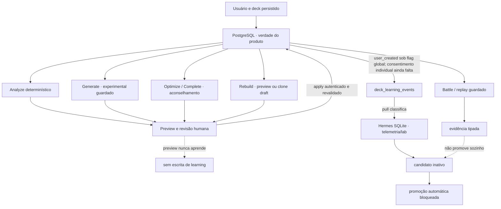

# BrewTact — fluxo atual de Deckbuilder, IA e aprendizado — 2026-08-12

Atualizado em 2026-08-13.

Status: `SECOND_AUDIT_MAPPED · CONTAINMENT_PARTIAL · IMPLEMENTATION_PACKAGE_NOT_STARTED`.

Este documento é o mapa manual canônico da implementação existente. Ele
responde o que cada jornada faz hoje, onde os dados vivem e quais fronteiras
estão fechadas antes do pacote de ajustes finais. Não declara o backlog
concluído, não promove deck/regra e não substitui evidência de runtime ou de
release.

Em caso de divergência, use esta precedência:

1. código vivo, migrations e testes do checkout;
2. PostgreSQL/backend para estado de produto;
3. `COMMANDER_DECKBUILDING_CONTRACT_2026-06-29.md` para intenção e gates de
   construção Commander;
4. `APP_AI_KNOWLEDGE_BRIDGE_CONTRACT_2026-07-06.md` para a ponte de
   conhecimento até API/app;
5. `docs/BREWTACT_MASTER_EXECUTION_BACKLOG_2026-08-12.md` para trabalho ainda
   não entregue;
6. `project_logic_manifest.json` e `docs/generated/CURRENT_SYSTEM.md` para
   inventário estrutural gerado;
7. Hermes/SQLite e relatórios somente como cache, laboratório ou evidência.

## Decisão curta

O projeto tem um fluxo funcional e já está mapeado o bastante para iniciar a
correção por tasks, mas **não** para afirmar “sem furos, sem duplicação e pronto
para produção”. A segunda auditoria independente em 15 frentes encontrou gaps
materiais de autoridade, schema, jobs, privacidade, Battle evidence e legado.
Hoje:

- Analyze determinístico mede o deck a partir de PostgreSQL;
- Generate, Optimize, Complete e Rebuild produzem proposta ou draft sob gates;
- o usuário precisa revisar antes de qualquer mudança no deck original;
- preview de IA não grava evento de aprendizado nem equivale a aceite;
- escrita de aprendizado de produto está desligada por padrão;
- eventos que não são `user_created`, inclusive `ai_generated`, ficam em
  quarentena e nunca se tornam treináveis apenas por tamanho/formato;
- Hermes pode guardar telemetria e candidatos, mas não ativa verdade de
  produto;
- sync e promoção automáticos de learned decks estão em dry-run e qualquer
  `--apply` automático falha fechado;
- Battle produz evidência, não legalidade nem promoção;
- a state machine e o receipt de promoção definitivos continuam abertos em
  `DCK-P0-05`.

Assim, “aprendizado” significa atualmente **coleta classificada e insumos
governados**, não retreinamento online nem autoalteração de decks.

## Fontes de verdade e grãos

| Superfície | Verdade/uso atual | Não autoriza |
| --- | --- | --- |
| PostgreSQL/backend | usuários, decks, `deck_cards`, legalidade, jobs, caches de produto e learned decks registrados | qualidade ou promoção sem gate |
| `card_intelligence_snapshot` | visão preferida de inteligência uma linha por carta para evitar fanout | regra executável ou recomendação final isoladamente |
| Scryfall/MTGJSON/dados oficiais | identidade, Oracle, impressão, legalidade e rulings | intenção do comandante ou desempenho |
| corpus/profile/stats Commander | referências e intenção para ranking, shell e explicações | legalidade e verdade universal |
| Hermes/SQLite | espelho operacional, auditoria, experimento e candidato inativo | ativar learned deck em PostgreSQL |
| XMage pinado / Forge pinado | execução externa de regras dentro do contrato próprio | incluir carta em deck, promover regra nativa ou provar qualidade |
| Battle/replay | resultado, exposição positiva e comparação com provenance | provar uso não observado ou promover automaticamente |
| relatórios Markdown/JSON | receipt e trilha de engenharia | consumo direto pela API/app como verdade |

Nunca faça join direto de `deck_cards` com uma fonte multi-row como
`card_battle_rules`, `card_function_tags` ou `card_semantic_tags_v2` sem
agregar por `card_id`. O caminho preferido é `card_intelligence_snapshot`.

## Fluxo ponta a ponta real



### 1. Criar, importar, editar e validar

O estado do deck vive em `decks` e `deck_cards`. A API autentica ownership e
os serviços de regras validam formato, singleton, tamanho, comandante e
identidade. A jornada é funcional, mas ainda não possui uma revisão otimista e
um ledger imutável únicos para todas as mutações.

Código principal:

- `server/routes/decks/index.dart`;
- `server/lib/deck_rules_service.dart`;
- `server/routes/import/to-deck/index.dart`;
- `app/lib/features/decks/providers/deck_provider.dart`.

Estado: `FUNCTIONAL_WITH_P0_GAPS`. Antes da abertura final, fechar
`DCK-P0-00`, `DCK-P0-01`, `DCK-P0-02`, `DCK-P0-03`, `DCK-P0-06`,
`DCK-P0-07` e `DCK-P1-04`.

### 2. Analyze determinístico

`GET /decks/:id/analysis` lê o deck do owner, prefere
`card_intelligence_snapshot`, calcula composição, curva, cores, preço e funções,
consulta legalidade e inclui diagnóstico Commander e evidência Battle segura.
Ele é a análise estrutural principal do app e não depende de provider de IA.

Código principal:

- `server/routes/decks/[id]/analysis/index.dart`;
- `server/lib/ai/functional_card_tags.dart`;
- `server/lib/ai/optimization_ramp_profile.dart`;
- `app/lib/features/decks/models/deck_analysis.dart`;
- `app/lib/features/decks/widgets/deck_analysis_tab.dart`.

Limite conhecido: ainda existem regras/heurísticas locais e estados de
readiness paralelos. `DCK-P1-04` e `DCK-P1-06` precisam criar uma única verdade
por revisão e separar visualmente legalidade, estrutura e evidência.

Estado: `FUNCTIONAL_DETERMINISTIC · NOT_FINAL_READINESS_AUTHORITY`.

### 3. Analyze com IA

`POST /decks/:id/ai-analysis` calcula métricas determinísticas, pode consultar
o provider permitido e só persiste `synergy_score`, strengths e weaknesses
quando o resultado veio do provider real. Fallback heurístico/mock informa
`source`, `is_mock=true`, `persisted=false`, usa `no-store` e não atualiza os
campos canônicos no servidor. Porém o DTO/provider Flutter ainda descarta essa
provenance e pode apresentar o preview como estado normal. O snapshot real
persistido também não está ligado a revision/signature, modelo, prompt, schema,
`as_of`, fonte e confiança, nem usa OCC antes de gravar.

Código principal:

- `server/routes/decks/[id]/ai-analysis/index.dart`;
- `server/lib/ai/deck_advanced_analysis.dart`.

Estado: `FUNCTIONAL_GUARDED · P0_PROVENANCE_AND_REVISION_OPEN` por
`BT-AI-003`/`BT-AI-020`; score não deve aparecer como medida calibrada até
`BT-AI-010`.

### 4. Generate

`POST /ai/generate` recebe objetivo, formato, comandante, bracket e constraints;
carrega profiles/stats/corpus governados e só lê usage/learned deck histórico
quando as capabilities explícitas forem habilitadas após receipt; monta
guidance/shell determinístico; chama provider somente quando permitido; resolve
cartas; aplica constraints e valida o resultado. O retorno é preview com
diagnósticos, não um deck automaticamente promovido.

Há caminho síncrono, jobs assíncronos e cache. O cache separa o comandante e
rejeita hit cujo resultado não coincide. Ainda falta provar que a **primeira**
execução sem guidance/reference usa exatamente o comandante solicitado. O job
também não é um worker durável: a closure vive no processo HTTP, não possui
lease/fencing/recovery e o save continua materializando a lista no cliente.

Código principal:

- `server/routes/ai/generate/index.dart`;
- `server/routes/ai/generate/jobs/[id].dart`;
- `server/lib/ai_generate_job.dart`;
- `server/lib/ai_generate_performance_support.dart`;
- `server/lib/ai/commander_deckbuilding_contract_support.dart`;
- `server/lib/generated_deck_validation_service.dart`;
- `app/lib/features/decks/providers/deck_provider_support_generation.dart`.

Containment atual: nenhuma ramificação de preview grava learning; os campos
`learning_eligible=false` do payload são diagnóstico, não escrita. Resultado
mock sempre força `can_save=false`, é
rejeitado na fronteira do cache e o app bloqueia save mesmo se receber flags
contraditórias. O app ainda precisa de review completo do comandante + 99
cartas, e a materialização precisa do artifact único.

Estado: `FUNCTIONAL_EXPERIMENTAL · PREVIEW_NO_LEARNING_WRITE`; aberto em
`DCK-P0-04`, `DCK-P1-05`, `DCK-P1-12`, `BT-AI-004`, `BT-AI-005`,
`BT-AI-006`, `BT-AI-011` e `BT-AI-021..025`.

### 5. Optimize e Complete

`POST /ai/optimize` atende dois modos:

- `optimize`: propõe pares de remoção/adição;
- `complete`: completa slots faltantes, com floors e validação final próprios.

O pipeline é determinístico-first, com provider/fallback somente sob política,
e aplica legalidade, identidade, bracket, floors funcionais, integridade de
swap, validação pós-proposta e resposta diagnóstica. Ele entrega preview. O
apply efetivo continua uma ação posterior e precisa ser revalidado.

A auditoria encontrou três divergências estruturais ainda abertas: a decisão
efetiva de modo não coincide integralmente com o `mode` público; um caminho
aggressive/incomplete pode criar um segundo job dentro da execução; e
Optimize/Complete ainda rodam em closure process-local, sem lease/recovery ou
cancelamento físico do provider. `BT-AI-021`, `BT-AI-022` e `BT-AI-031`
fecham essa fronteira.

Containments atuais:

- cache usa SHA-256 e a leitura exige `cache_key + user_id + deck_id +
  deck_signature`;
- o preview não escreve feedback “accepted”;
- o app emite `optimize_preview_received`, não `deck_optimized`, ao receber a
  proposta;
- logs novos de análise não copiam `deck_id`/`user_id` para o JSON de reasoning;
- cache e resposta não constituem receipt de aplicação.

O app/backend ainda acoplam `learning_eligible` à possibilidade de apply. Isso
é incorreto: uma alteração voluntária pode ser segura para o deck do owner e ao
mesmo tempo proibida para learning. `DCK-P1-07` deve separar esses estados.

Código principal:

- `server/routes/ai/optimize/index.dart`;
- `server/lib/ai/optimize_runtime_support.dart`;
- `server/lib/ai/optimize_cache_support.dart`;
- `server/lib/ai/optimization_quality_gate.dart`;
- `server/lib/ai/optimize_complete_support.dart`;
- `server/lib/ai/optimize_swap_integrity.dart`;
- `app/lib/features/decks/providers/deck_provider_support_ai.dart`;
- `app/lib/features/decks/widgets/deck_optimize_flow_support.dart`.

Estado: `FUNCTIONAL_GUARDED · P0_JOB_AND_APPLY_CONVERGENCE_OPEN`. O
apply/undo/retry idempotente, service único para bulk/replace, ledger, HMAC e
constraints seguem em `DCK-P0-01`, `DCK-P0-02`, `DCK-P1-07`, `BT-AI-004` e
`BT-AI-021..025`. Dados históricos e outros sinks com IDs continuam sujeitos a
`BT-AI-012`, `BT-SEC-AI-002` e `BT-PRIV-001..003`.

### 6. Rebuild

`POST /ai/rebuild` opera em `preview_only` ou `draft_clone`; declara
`applied_to_original=false` e mantém o original invariável. O consumidor atual,
porém, usa clone direto como caminho normal: não há etapa visual genuína antes
do insert, idempotency key, source revision ou lineage durável. Timeout/retry
pode duplicar drafts e constraints de collection/budget não chegam ao serviço.

Código principal:

- `server/routes/ai/rebuild/index.dart`;
- `server/lib/ai/rebuild_guided_service.dart`;
- `server/lib/ai/rebuild_route_request_support.dart`;
- `app/lib/features/decks/providers/deck_provider_support_ai.dart`.

Estado: `ORIGINAL_PRESERVED · DIRECT_CLONE_NOT_RELEASE_READY`. Faltam
preview-first, artifact/revision, idempotência, lineage, stale blocking,
Partner/Background e paridade de constraints em `DCK-P1-08`, `DCK-P1-12` e
`BT-AI-004`.

### 7. Telemetria, candidatos e promoção

As três etapas abaixo são deliberadamente diferentes:

1. **telemetria**: fato de produto classificado, sem declarar qualidade;
2. **candidato**: material experimental inativo que pode ser auditado;
3. **promoção**: decisão explícita e versionada que ainda não tem state machine
   completa.

Comportamento atual:

- `shouldWriteProductLearning()` retorna false por padrão e só aceita a **flag
  global** `MANALOOM_ENABLE_PRODUCT_LEARNING_WRITES=1`; isso é containment
  operacional, não consentimento individual; runtime E2E isolado sempre bloqueia;
- quando habilitado, a criação real de deck pode gravar `user_created` em
  `deck_learning_events`;
- `server/bin/pull_learning_events.py` espelha eventos não sincronizados em
  `user_learning_events` no SQLite e reclassifica todo o histórico local;
- apenas `source=user_created`, Commander, comandante presente e contagem
  mínima podem receber `training_eligible=1`; qualquer outra source recebe
  `quarantined_source`;
- `training_eligible` é classificação de telemetria, não prova de consentimento,
  qualidade, uso natural nem promoção; não há consumer online autorizado a
  transformar essa classificação em modelo ou deck ativo;
- o evento PostgreSQL não possui hoje subject ledger/revision/signature/FK
  suficiente para subtrair contribuição individual; o agregado
  `commander_card_usage` não é reversível por usuário;
- export Hermes produz candidato com `is_active=false`;
- o importador backend rejeita ativação de learned deck enquanto faltar
  receipt `DCK-P0-05`;
- `auto_sync_learned_decks` e `auto_promote_learned_decks` são audits dry-run;
  wrappers e Python rejeitam `--apply`/opt-in legado;
- `server/bin/optimizer_loop.sh` é um tombstone que retorna erro; o preflight
  governado permanece `server/bin/master_optimizer_preflight.sh`;
- learned decks que já estavam ativos em PostgreSQL antes desta contenção são
  preservados para auditoria, mas sua leitura de produto fica default-off até
  receberem inventário e receipt; não são desativados por mutação automática.
- `MANALOOM_ENABLE_PROMOTED_LEARNED_DECK_READS` e
  `MANALOOM_ENABLE_COMMANDER_USAGE_CORPUS_READS` aceitam somente o literal `1`;
  ausentes ou inválidas fazem zero leitura PG. A rota
  `/ai/commander-learning` responde `503` antes do banco enquanto desligada;
- o knowledge import periódico é `report_only`, não carrega credencial PG nem
  cria artefato interno; `--apply`/env legacy falham antes do runner. O scan
  atual encontrou 2.809 candidatos, incluindo 1.921 duplicatas por chave
  natural em perfis de carta, portanto não há base para reabrir apply.

Código principal:

- `server/lib/e2e_validation_policy.dart`;
- `server/lib/ai/deck_learning_event_support.dart`;
- `server/bin/pull_learning_events.py`;
- `server/lib/ai/commander_learned_deck_support.dart`;
- `server/bin/commander_learned_deck.dart`;
- `server/bin/auto_sync_learned_decks.py`;
- `server/bin/auto_promote_learned_decks.py`;
- `docs/hermes-analysis/manaloom-knowledge/scripts/export_hermes_learned_deck.py`.

Estado: `CONTAINED · LEARNING_DEFAULT_OFF · PROMOTION_BLOCKED`. Isso reduz risco,
mas não conclui `BT-AI-001`, pois o aceite exige audit/backfill comprovado do
ambiente aplicável, nem conclui `DCK-P0-05`/`BT-AI-002`/`BT-AI-030`. A lane pode
continuar OFF sem bloquear o core; habilitá-la antes desses receipts é proibido.

### 8. Battle e replay

Battle recebe decks e controles canônicos, executa no runtime permitido,
persiste attempts/jobs/replays com identidade de engine e devolve resultado e
provenance. Uma exposição tipada pode alimentar decisão humana ou um gate
posterior. Vitória agregada, seed de mesmo nome, disponibilidade no catálogo ou
resultado sem a carta drawn/cast/used não promovem carta nem deck.

A segunda auditoria reabriu a prova de evidência: o extractor Python não filtra
sempre `subject_deck_key`, o agregado online exclui falhas/timeouts ao nascer de
replays, controls podem ser autodeclarados/ecoar sem igualdade e o receipt de
comparação ainda não chega produtivamente ao PostgreSQL. Até
`BT-BAT-EVD-001..006`, Battle permanece evidência experimental e nunca entra em
promotion receipt.

Código principal:

- `server/lib/battle/battle_job_service.dart`;
- `server/lib/battle/battle_job_runner.dart`;
- `server/lib/ai/deck_battle_learning_evidence.dart`;
- `server/routes/ai/battle/jobs/index.dart`;
- `server/routes/ai/simulate/index.dart`;
- `docs/hermes-analysis/EXTERNAL_BATTLE_EXECUTION_CONTRACT.md`.

Estado técnico: `IMPLEMENTED_GUARDED_EVIDENCE`. Estado de oferta: `OFF` até os
P0 de topologia, ownership, fila, entitlement, isolamento, capacidade,
observabilidade e custo em `BT-BAT-000..010`. Battle nunca é atalho para
`DCK-P0-05`.

## Inventário de rotas e efeitos

| Superfície | Consumer conhecido | Efeito persistente atual | Postura até fechar tasks |
| --- | --- | --- | --- |
| `POST /ai/generate` + jobs | Flutter Generate | job/cache/usage; preview não grava learning | allowlist experimental; `DCK-P0-04`, `BT-AI-021..025` |
| `POST /ai/optimize` + jobs | Flutter Optimize | job/cache/preferências/logs/provider usage; preview não é accepted | guardado; `DCK-P1-07`, `BT-AI-031` |
| `POST /ai/rebuild` | Flutter fallback guiado | pode inserir clone draft | default clone não está pronto; `DCK-P1-08` |
| `GET /decks/:id/analysis` | Deck Details/Analysis | leitura | não é autoridade legal final; `DCK-P1-04` |
| `POST /decks/:id/ai-analysis` | Deck Details/Analysis | provider real atualiza score/textos no deck | OFF/guardado até `BT-AI-003`/`BT-AI-020` |
| `POST /ai/archetypes` | estratégia no app | cache/provider usage | entra no registry/capability de `BT-AI-029` |
| `POST /ai/explain` | detalhe de carta | pode persistir `cards.ai_description` | inventariar/autorizar explicitamente em `BT-AI-029` |
| `GET /ai/commander-reference` | backend Generate/Optimize | zero DML; preview externo transitório | manter read-only; ingestão é `BT-AI-017` |
| `GET /ai/commander-learning` | Flutter Generate | zero PG quando capability OFF; read quando ON | default-off até `DCK-P0-05` |
| `POST /decks/:id/recommendations` | nenhum Flutter encontrado | provider/plan; sem persistir sugestão | default-off, telemetria→adapter/410 em `BT-AI-029` |
| `POST /ai/weakness-analysis` | nenhum Flutter encontrado | grava `deck_weakness_reports` | default-off antes de PG; decidir em `BT-AI-029` |
| `POST /ai/simulate-matchup` | nenhum Flutter encontrado | grava `deck_matchups` | default-off; `/ai/simulate` é caminho atual |
| `GET /decks/:id/simulate` | nenhum Flutter encontrado | cálculo legacy | default-off; decidir adapter/410 |
| `GET /ai/ml-status` | admin | leitura de lane ML parcialmente ausente do baseline | não pode declarar active; `BT-AI-027`/`BT-DB-005` |

Esse inventário deve virar registry machine-readable em `BT-AI-029`; a tabela
manual não substitui enforcement server-side nem telemetria de clientes externos.

## Matriz de prontidão por jornada

| Jornada | Funciona hoje | Contenção presente | Impede declarar final |
| --- | --- | --- | --- |
| criar/importar/editar | sim, em PostgreSQL | auth, ownership e regras existentes | revision, ledger, artifact, soft-delete e session epoch |
| Analyze determinístico | sim | leitura owner-scoped e snapshot anti-fanout | quatro autoridades de readiness precisam convergir |
| Analyze IA | sim, guardado | mock não persiste no server | revision/OCC/provenance no app, cache/freshness e score calibrado |
| Generate | sim, experimental | preview no-write, validação e cache hit por commander | primeira resposta, job durável, materialização e review 100/100 |
| Optimize | sim, guardado | preview sem aceite, cache isolado, quality gates | router de modo, job durável, apply único, ledger e constraints |
| Complete | sim, dentro de Optimize | floors, top-up e validação final | exatamente um job, cancel físico e parity de gates |
| Rebuild | clone preserva original | original não aplicado | preview-first, idempotência, lineage, revision/partner/constraints |
| Learning | telemetria/candidato apenas | writes e reads promovidos default-off, source quarantine, import inativo | state machine, consentimento, uso, receipt |
| Battle | sim como evidência guardada | pins/provenance e não promoção | P0 Battle, escala/custo e rollout |

## Código canônico, compatibilidade e duplicações

### Conservar como canônico

- validação/legalidade: `server/lib/deck_rules_service.dart` por revision; o GET
  Analyze deve consumir essa autoridade, não reimplementá-la;
- Analyze estrutural atual: `server/routes/decks/[id]/analysis/index.dart`, como
  leitura/diagnóstico a convergir, não como segunda autoridade legal;
- geração: `server/routes/ai/generate/index.dart` e supports importados;
- Optimize/Complete: `server/routes/ai/optimize/index.dart` e `optimize_*_support`;
- Rebuild: `server/routes/ai/rebuild/index.dart` e `rebuild_*`;
- contrato Commander: `COMMANDER_DECKBUILDING_CONTRACT_2026-06-29.md`;
- verdade de aprendizado: tabelas PostgreSQL + state machine/receipt futuros;
- inteligência por carta: `card_intelligence_snapshot` quando disponível;
- Battle externo: contratos pinados de XMage/Forge, em processo separado.

### Manter temporariamente, mas convergir

- `/decks/:id/analysis` e `/decks/:id/ai-analysis` têm finalidades diferentes,
  porém precisam de uma única revision/readiness e vocabulário comum;
- `deck_state_analysis.dart` e `optimize_state_support.dart` calculam estados
  sobrepostos; convergir após testes de paridade, sem remoção cega;
- Complete é modo de Optimize; não criar uma terceira pipeline independente;
- `/ai/weakness-analysis`, `/ai/simulate-matchup`, `/decks/:id/simulate` e
  `/decks/:id/recommendations` não têm consumer Flutter encontrado; ficam
  default-off por `BT-AI-029` antes de decidir adapter/410/remove. `/ai/simulate`
  é a superfície atual e também depende dos P0 Battle;
- `server/lib/ai/battle_simulator.dart` não é a autoridade de execução externa;
  o contrato canônico aponta `BattleExecutionRuntime`; confirmar zero consumer
  antes de arquivar o arquivo legado;
- `card_deck_profiles` não é uma proteção ativa no runtime atual: o parâmetro e
  o bloco morto foram retirados. Qualquer reintrodução depende de schema,
  vocabulário, provenance e consumer reais em `BT-AI-016`;
- `optimization_analysis_logs`, `theme_contextual_rules`, `synergy_packages`,
  `archetype_patterns` e `ml_learning_state` são referenciadas por runtime, mas
  não são reproduzidas pelo baseline canônico inspecionado. `BT-DB-005` decide
  relação por relação entre migration real e remoção do consumer; capturar erro
  e degradar silenciosamente não é contrato.

### Legado bloqueado ou histórico

- `server/bin/optimizer_loop.sh`: tombstone fail-closed;
- `server/bin/update_schema.dart`: tombstone fail-closed; ele não pode mais
  dropar decks/resultados nem reaplicar `database_setup.sql`;
- scripts Hermes de geração/otimização: laboratório/auditoria, nunca runtime de
  produto por presença no repositório;
- relatórios antigos em `docs/hermes-analysis/` e
  `master_optimizer_reports/`: evidência datada, não fila de execução;
- `optimize_feedback_support.dart`: removido do caminho runtime porque preview
  não é aceite; o receipt futuro deve nascer no apply confirmado, não ressuscitar
  inferência por HTTP 2xx.
- métodos DML sem consumer e a lane `MLKnowledgeService`/`ml-status` ficam sob
  `BT-AI-027`/`BT-AI-029`; presença de teste ou relatório não os torna produto.

Política de limpeza: só remover uma superfície após provar zero consumer,
substituto canônico, compatibilidade/migração e gates verdes. “Parece duplicado”
não é autorização para apagar.

## Contenções aplicadas nesta organização

| Risco | Estado de contenção no código | Conclusão que não deve ser inferida |
| --- | --- | --- |
| preview Generate contaminava learning | chamada de escrita removida; teste de fronteira adicionado | corpus live já auditado/limpo |
| learning ligava por padrão | opt-in explícito; E2E isolado sempre off | consentimento/state machine concluídos |
| `ai_generated` podia ser treinável por contagem | source quarantine e backfill SQLite | rows PostgreSQL/live reconciliadas |
| export/import ativava learned deck | export inativo e import active bloqueado | campeão por comandante implementado |
| auto-sync/auto-promote mutavam | dry-run por padrão e apply bloqueado | promoção manual com receipt pronta |
| optimizer legado mutava | entrypoint tombstonado | novo optimizer finalizado |
| cache Optimize podia colidir/vazar owner | SHA-256 + owner/deck/signature na leitura | Analyze cache corrigido |
| preview Optimize parecia aceite | feedback runtime removido e evento renomeado | apply/undo ledger concluído |
| reasoning repetia IDs de usuário/deck | identificadores removidos de novos payloads | histórico export/delete remediado |
| retry idempotente podia debitar novamente | reservation reutilizada é liberada e não incrementa uso | retry no hard-cap reconhece key antes da reserva |
| GET Commander reference persistia fallback | perfil externo normal passa a ser transitório/read-only | ingestão interna versionada/freshness concluída |
| imports Hermes/Markdown aplicavam por cron | entrypoint fica report-only e apply é bloqueado | schema/provenance/idempotência definitivos |
| learned deck/usage histórico ainda podia influenciar produto | duas capabilities explícitas default-off; zero PG quando OFF | audit/backfill e receipt dos rows antigos |
| mock podia parecer deck/análise normal | save/cache/persistência bloqueados e provenance obrigatória | calibração/provider real e artifact final |
| reset de schema legado podia dropar tabelas | `server/bin/update_schema.dart` agora é tombstone rc=2 | todo DDL runtime/CLI já foi removido |

Reservas e settlement de custo existentes não substituem o entitlement e o
ledger comercial únicos. O estado final de quota/idempotência continua sujeito
a `BT-AI-015`, `BT-AI-021..025`, `BT-BAT-004`, `BT-SEC-001`, `DCK-P0-01` e
aos testes da task que efetivamente alterar esse contrato.

## Fechamento da segunda auditoria — 15 frentes

| Frente | Veredito | Tasks que carregam o fechamento |
| --- | --- | --- |
| mutações e ciclo do deck | funcional, mas sem CAS/ledger universal; hard delete e replace one-phase | `DCK-P0-00..07`, `DCK-P1-01..04` |
| Generate | preview contido; primeira resposta, job e materialização ainda abertos | `DCK-P0-04`, `BT-AI-004`, `BT-AI-011`, `BT-AI-021..025` |
| Analyze | quatro autoridades de readiness e artifact IA stale/provenance perdida no app | `DCK-P1-04`, `DCK-P1-06`, `BT-AI-003`, `BT-AI-020` |
| Optimize/Complete | melhor gate de apply, mas modo/job/apply/learning ainda divididos | `DCK-P1-07`, `BT-AI-004`, `BT-AI-021..025`, `BT-AI-031` |
| Rebuild | original preservado, mas clone direto não é preview/idempotente/lineage | `DCK-P1-08`, `DCK-P1-12` |
| learning | writes/reads/promotion contidos; consentimento/retração/state machine ausentes | `DCK-P0-05`, `BT-AI-001`, `BT-AI-002`, `BT-AI-014`, `BT-AI-019`, `BT-AI-030` |
| PostgreSQL/Hermes | PG continua verdade; runtime lê tabelas suplementares fora do baseline | `BT-DB-001`, `BT-DB-004`, `BT-DB-005`, `BT-AI-027`, `BT-AI-028` |
| Partner/Background | identidade composta não atravessa todos os contratos | `DCK-P1-12` |
| jobs/quota/escala | closures não duráveis, cancel incompleto, sem backpressure/cost ledger | `BT-AI-015`, `BT-AI-021..026` |
| privacidade/segurança IA | ownership principal bom; callback, body, logs e subject retraction abertos | `BT-AUTH-001`, `BT-AUTH-002`, `BT-SEC-AI-001`, `BT-SEC-AI-002`, `BT-AI-030` |
| Battle evidence | execução existe; subject, censoring, controls e receipt não fecham learning | `BT-BAT-EVD-001..006` |
| app Flutter | consumidores principais existem; session epoch, revision cache e provenance faltam | `DCK-P0-07`, `DCK-P1-13`, `BT-AI-003`, `BT-AI-020` |
| código legado/duplicado | há validation-only e rotas sem consumer; remoção depende de registry/telemetria | `BT-AI-018`, `BT-AI-027`, `BT-AI-029`, `BT-GATE-004` |
| documentação/lineage | históricos foram isolados parcialmente; lifecycle/DAG/parser ainda abertos | `BT-DOC-001`, `BT-DOC-004`, `BT-DOC-005` |
| gates | code-only útil, mas PARTIAL, receipts e cobertura ainda não autorizam claim final | `BT-GATE-001..006` |

O auditor real de reachability encontrou zero arquivo totalmente órfão neste
checkout e classificou `battle_simulator.dart` como `validation-only`. Isso não
prova ausência de redundância runtime: rotas públicas sem consumer, DML órfão e
implementações paralelas continuam inventariados em `BT-AI-029`.

## Gaps que bloqueiam os ajustes finais

Ordem recomendada, mantendo os IDs do backlog mestre:

1. verdade/capabilities/DAG/gates: `BT-GOV-001`, `BT-SCP-001`, `BT-DOC-004`,
   `BT-GATE-001`, `BT-GATE-002`;
2. baseline e boundary DDL: `BT-DB-001`, `BT-DB-004`, `BT-DB-005`;
3. containment de surfaces: `DCK-P0-00`, `BT-AI-029`; learning continua OFF;
4. revision/artifact/sessão: `DCK-P0-01`, `DCK-P0-02`, `DCK-P0-07`;
5. readiness/Analyze/apply: `DCK-P1-04`, `DCK-P1-06`, `DCK-P1-07`,
   `BT-AI-003`, `BT-AI-004`, `BT-AI-020`, `BT-AI-031`;
6. jobs/segurança/custo: `BT-SEC-AI-001`, `BT-AI-015`, `BT-AI-021..025`;
7. Generate/Rebuild: `DCK-P0-04`, `DCK-P1-05`, `DCK-P1-08`, `DCK-P1-12`,
   `BT-AI-011`;
8. learning em programa independente: `DCK-P0-05`, `BT-AI-001`,
   `BT-AI-002`, `BT-AI-014`, `BT-AI-019`, `BT-AI-030`;
9. E2E/telemetria e depois UX: `DCK-P1-11`, `BT-GATE-003`, `BT-GATE-005`,
   `BT-UX-IMG-001`, `BT-UX-SWAP-001`, `BT-UX-DECK-001..004`;
10. Battle horizontal/evidence é programa separado: `BT-BAT-000..010` e
    `BT-BAT-EVD-001..006`.

Não iniciar UX final sobre um artifact/readiness que ainda pode mudar. É seguro
trabalhar antes em contrato de imagem/fixture e protótipo, mas o apply visual
deve depender dos P0 do ciclo.

## Gates exatos antes de dizer “organizado”

Gate focado desta fronteira:

```bash
./scripts/manaloom_deck_ai_learning_gate.sh --profile local
./scripts/quality_gate.sh deck-ai-learning local
```

O script já existe e o perfil local foi observado como `PASS_CODE_ONLY` numa
execução anterior. Essa observação é diagnóstica: o receipt vive em `/tmp`, o
worktree estava dirty, os campos “sem rede/sem mutação” ainda não são medição
forte e a auditoria encontrou lacunas de cobertura. Portanto ela **não** é
evidência durável nem autoriza dizer “organizado”. `BT-GATE-002` deve ligar o
receipt a SHA, digest inicial/final, project logic, schema/target, checks
obrigatórios e hashes dos artifacts.

Para uma decisão de release, valide o receipt PostgreSQL read-only fresco
exigido pelo perfil próprio:

```bash
./scripts/manaloom_deck_ai_learning_gate.sh --profile release-read-only
./scripts/quality_gate.sh deck-ai-learning release-read-only
```

Esse perfil hoje valida a evidência indicada em
`MANALOOM_DECK_AI_RELEASE_RECEIPT`, mas `BT-GATE-002` precisa endurecer seu
binding antes de ele ser aceito como prova de release. Ele nunca autoriza escrita
live.

Gates complementares read-only:

```bash
./scripts/quality_gate.sh ai-bridge
./scripts/quality_gate.sh deep-ai
./scripts/quality_gate.sh pg-contract

python3 docs/hermes-analysis/manaloom-knowledge/scripts/commander_deckbuilding_flow_research_audit.py \
  --out-prefix /tmp/brewtact_commander_flow_current
python3 docs/hermes-analysis/manaloom-knowledge/scripts/deckbuilding_contract_surface_audit.py \
  --out-prefix /tmp/brewtact_deckbuilding_contract_current
python3 docs/hermes-analysis/manaloom-knowledge/scripts/operational_surface_alignment_audit.py \
  --out-prefix /tmp/brewtact_operational_surface_current

./scripts/manaloom_project_logic.sh --write
./scripts/manaloom_project_logic.sh --check
git diff --check
```

`pg-contract` lê PostgreSQL quando configurado; não é autorização de escrita.
Nenhum desses gates substitui `full`, E2E, UI proof, runtime Web/Android,
Battle real, migração, deploy ou release. O agregador canônico agora retorna
`PARTIAL=3`; somente `--allow-partial` preserva zero em modo diagnóstico,
sempre com `gate_eligible=false`. `BT-GATE-001` permanece aberto até a bateria
consolidada confirmar esse comportamento no digest final.

## Critério para começar a task de ajustes finais

O owner pode abrir o pacote de implementação quando:

1. `BT-DOC-004` provar IDs/dependências/lifecycle sem ambiguidades;
2. `BT-DB-001` registrar o baseline real e `BT-DB-004` impedir DDL paralelo;
3. cada P0 da primeira onda tiver task sheet, owner, escopo, rollback e aceite;
4. capabilities adiadas, learning e rotas legadas estiverem fail-closed também
   na API direta;
5. não houver doc histórica sendo usada como fila corrente;
6. o gate code-only passar no mesmo digest sem `SKIP/PARTIAL`, e qualquer claim
   PG/runtime usar receipt forte e aplicável;
7. a mudança visual referenciar o artifact/readiness definido pelos P0;
8. nenhuma claim transformar heurística, Battle ou Hermes em legalidade ou
   promoção.

O inventário e a ordem agora estão preparados para correção; isso é diferente
de dizer que as correções já terminaram. Até os itens acima, o veredito é:
**fluxo mapeado, riscos mais perigosos parcialmente contidos, backlog ampliado,
produto funcional em modo guardado e pacote final ainda não iniciado**.
