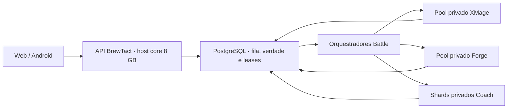
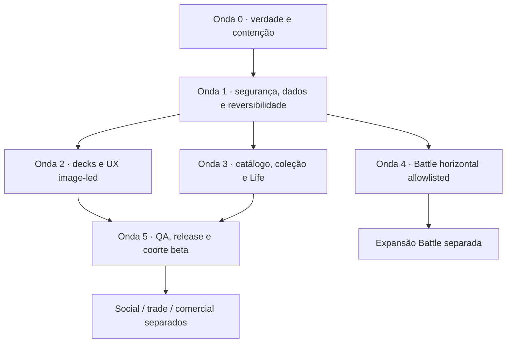

# BrewTact — Backlog mestre de produto, arquitetura, UX e release

Status: `MASTER_TASK_INDEX · CURRENT_DECISION_NO_GO · EXECUTION_IN_PROGRESS · WIP_LIMIT_1`

Data-base: `2026-08-12`
Checkout auditado: `8264ffb27292`
Produto público: **BrewTact**
Nomes internos legados: `ManaLoom` e `manaloom` continuam válidos onde ainda
forem identificadores técnicos; não devem reaparecer na experiência pública.

## 1. Objetivo e precedência

Este documento reúne em um único backlog executável:

- lógica de produto e jornadas do consumidor;
- segurança, privacidade, autorização e preservação de dados;
- ciclo completo de decks e IA Commander;
- catálogo, cartas, coleção, preços, Scanner e arte;
- Life Counter, pós-jogo, Battle Lab e Coach;
- arquitetura horizontal de XMage/Forge para múltiplos usuários;
- UX visual orientada por cartas, com menos texto e mais reconhecimento;
- social, comunidade, marketplace e trades;
- observabilidade, capacidade, migrations, backup, release e jurídico;
- métricas, pesquisa com usuários e critérios de decisão.

Ele passa a ser o **índice de priorização e execução**. Não substitui:

1. `project_logic_manifest.json` e `docs/generated/CURRENT_SYSTEM.md` para a
   verdade estrutural gerada;
2. PostgreSQL/backend como verdade de dados;
3. contratos específicos de cada área;
4. receipts de testes, runtime, UI e release;
5. parecer jurídico externo quando ele for exigido.

Um item não recebe `PASS` porque está descrito aqui. Ele só fecha com o aceite e
os gates indicados, na mesma revisão de código e no mesmo digest aplicável.

## 2. Decisão executiva atual

### 2.1 Veredito

O BrewTact possui um núcleo de produto promissor, mas o estado atual é
**NO-GO para lançamento público integral**. A estratégia aprovada é lançar por
fatias verificáveis, começando por uma beta gratuita de escopo reduzido, em
coorte controlada e deliberadamente menor.

### 2.2 Beta core pretendida

Pode entrar no escopo da beta core depois dos seus P0:

- cadastro, login, recuperação, aceite legal e conta;
- catálogo local somente leitura para o consumidor;
- busca e detalhe de cartas;
- coleção/fichário pessoal privado;
- criação manual e importação de deck novo;
- edição, validação estrita e exportação de decks;
- análise estrutural e Optimize como aconselhamento revisável;
- nova experiência visual de Deck Details e sugestões com imagens de cartas;
- Life Counter local somente após isolamento por conta e saída confiável.

### 2.3 Fora da beta core por padrão

Devem permanecer inacessíveis no app **e na API direta**, salvo uma liberação
específica posterior:

- Battle público, Battle Live e Coach;
- Scanner/OCR;
- geração IA generalizada ou promoção autônoma de aprendizado;
- galeria pública, perfis públicos, busca de usuários, comments e follows;
- DMs, push social, Binder público, marketplace e trades;
- checkout, assinatura, anúncios e qualquer paywall ligado a arte/dados;
- iOS/VoiceOver, se formalmente `DEFERRED_BY_SCOPE` no candidato inicial.

### 2.4 Princípios não negociáveis

- PostgreSQL/backend é a verdade; Hermes/SQLite é cache ou laboratório.
- UI escondida não autoriza uma função: capability é server-side e default-deny.
- Nenhuma IA aplica, publica, aprende ou promove sozinha.
- Preview e commit devem representar exatamente a mesma entrada e revisão.
- Toda mutação destrutiva precisa de concorrência otimista, histórico e retorno.
- Carta física usa identidade de impressão; deck usa identidade jogável.
- Legalidade/estrutura não significam desempenho comprovado.
- Imagem de carta é evidência de reconhecimento, não decoração genérica.
- Arte autorizada aparece inteira com `BoxFit.contain`; nunca cortada, desfocada
  ou usada como fundo derivado.
- `PASS_AUTOMATED`, `PASS_RUNTIME` e `PASS_VISUAL_REVIEWED` são independentes.
- Migrations, deploys e mutações live exigem autorização e janela próprias.

## 3. Baseline real deste checkout

No momento desta consolidação, o manifesto gerado declara:

| Indicador | Baseline deste checkout |
| --- | ---: |
| Migration mais recente | `058` |
| Quantidade de migrations | `58` |
| Tabelas canônicas | `79` |
| Views | `6` |

Consequências:

- qualquer trabalho chamado anteriormente de migration `059` é tratado aqui
  como **proposta a revalidar**, não como código já presente;
- números de tabelas, colunas, FKs, memória e capacidade observados em worktrees
  temporários não recebem crédito no checkout atual;
- a primeira tarefa de schema/capacidade deve gerar evidência fresca antes de
  escolher DDL, mínimos ou declarar um perfil operacional saudável.

## 4. Arquitetura Battle decidida para o host de 8 GB

### 4.1 O que foi decidido

O servidor atual permanece com **8 GB**. Ele será tratado como core/control
plane para API, PostgreSQL e operações, respeitando medição e reservas reais.
XMage, Forge e Coach não devem depender de coabitação nesse host.

O requisito anterior de 16 GB representava um cenário de **serviços de engine
co-residentes**, com limites e headroom somados. Ele não significava “16 GB para
cinco usuários” e não é o modelo de escala do produto.

### 4.2 Modelo-alvo



Regras:

- a API aceita/consulta/cancela trabalhos; ela não executa engine síncrona;
- PostgreSQL permanece a fila inicial, com idempotência, lease e fencing;
- cada worker anuncia slots, saúde, pin e capacidade;
- XMage continua primeiro; Forge só recebe gap estrutural aceito;
- Coach é stateful e fica preso a um shard/processo; não usa round-robin cego;
- sem slot saudável, nova execução falha fechado ou aguarda dentro da política;
- broker externo e engine-per-session são hipóteses P2, não premissas;
- custos e limites por usuário/plano precedem abertura pública.

## 5. Como ler o backlog

### 5.1 Prioridade

| Código | Significado |
| --- | --- |
| `P0 CORE` | Bloqueia a beta core. |
| `P0 AI` | Bloqueia Analyze/Optimize na beta; a beta pode avançar somente se essas capabilities ficarem comprovadamente OFF. |
| `P0 GENERATE` | Bloqueia Generate/Rebuild fora de allowlist experimental. |
| `P0 LEARNING` | Bloqueia qualquer leitura, escrita, treinamento ou promoção de learning; não bloqueia a beta com toda a lane comprovadamente OFF. |
| `P0 CAPABILITY` | Bloqueia apenas a capability indicada; aparece também como `P0 BATTLE`, `P0 SCANNER`, `P0 LIFE`, `P0 SOCIAL` ou `P0 TRADE`. |
| `P0 COMMERCIAL` | Bloqueia monetização, não a beta gratuita se a oferta paga estiver inacessível. |
| `P1` | Necessário antes de ampliar uma beta ou declarar maturidade consumer. |
| `P2` | Posterior a baseline de uso, capacidade ou validação. |

### 5.2 Estado inicial

| Estado | Uso |
| --- | --- |
| `TODO` | Pronto para decomposição/implementação. |
| `BLOCKED_BY_P0` | Depende de outro P0. |
| `DEFERRED_BY_SCOPE` | Código pode existir, mas a superfície deve permanecer inacessível. |
| `WAITING_EXTERNAL` | Exige advogado, fornecedor, hardware, conta ou owner externo. |
| `EVIDENCE_REQUIRED` | Implementação alegada, mas sem receipt válido neste checkout. |
| `IN_PROGRESS_CONTAINED` | O bypass perigoso foi bloqueado, mas o modelo definitivo e seus gates ainda não fecharam. |
| `IMPLEMENTED_LOCAL_PENDING_FULL_GATE` | Correção local e testes focais existem; ainda falta a bateria consolidada/receipt aplicável. |
| `PASS` | Aceite e todos os gates aplicáveis comprovados. |

### 5.3 Definition of Done de qualquer task

Uma task só pode ser concluída quando:

1. código, contrato, migration e API map aplicáveis concordam;
2. owner, escopo, risco, rollback e observabilidade estão explícitos;
3. testes unitários, negativos, concorrentes e idempotentes aplicáveis passam;
4. schema usa PostgreSQL loopback descartável quando houver dado persistido;
5. `manaloom_project_logic.sh --write` e `--check` passam quando exigidos;
6. UI app-facing possui os três níveis de evidência do contrato;
7. TalkBack humano e teclado Web real permanecem gates separados;
8. nenhum artefato histórico é reutilizado como prova da revisão nova;
9. nenhum deploy, migration live ou promoção ocorre por consequência implícita.

## 6. Caminho crítico e ondas



| Onda | Resultado de saída |
| --- | --- |
| 0 | Uma única verdade de escopo/oferta; funções perigosas bloqueadas server-side. |
| 1 | Conta, privacidade, schema e mutações críticas seguras e reversíveis. |
| 2 | Ciclo de deck coerente e experiência visual centrada em cartas. |
| 3 | Catálogo read-only, coleção confiável e Life isolado por conta. |
| 4 | Battle em workers separados, com admissão, custo e observabilidade. |
| 5 | Candidato beta core same-SHA, UI revisada e decisão assinada. |
| 6+ | Capacidades adicionais abertas uma a uma, nunca por implicação. |

---

# 7. Catálogo mestre de tasks

## Épico A — Verdade de produto, escopo e documentação

| ID | Pri. | Estado | Entrega | Depende de | Aceite mínimo |
| --- | --- | --- | --- | --- | --- |
| `BT-GOV-001` | P0 CORE | PASS | Publicar decisão corrente única: beta gratuita, público, plataformas, domínio, oferta, flags, IA, Battle e módulos adiados. | — | Documento curto, datado e sem conflito com UI/API/deploy. Receipt: `docs/qa/execution/2026-08-14/BT-GOV-001.md`; implementação: `fd0397a5a97742bcb5127c7b2d08d80aca4bf738`. |
| `BT-SCP-001` | P0 CORE | IN_PROGRESS_CONTAINED | Manifesto server-authoritative de capabilities, default-deny e versionado no release identity. | `BT-GOV-001` | Flag ausente/inválida fica OFF; API nega antes de PG; app só apresenta o permitido; cadastro novo tem capability própria e fica OFF, enquanto login/recuperação/privacidade de contas existentes permanecem control-plane; same-SHA registra a matriz; `implementation_status`, `release_capability` e `live_verified_as_of` são eixos distintos. |
| `BT-OFFER-001` | P0 CORE | IMPLEMENTED_LOCAL_PENDING_FULL_GATE | Unificar a oferta pública da beta e remover promessas conflitantes de Free/Pro/checkout/limites. | `BT-GOV-001` | Landing, app, backend e contratos usam a mesma oferta; checkout e paywall inacessíveis se beta gratuita. |
| `BT-DOC-001` | P0 CORE | IN_PROGRESS_CONTAINED | Reconciliar docs ativos e marcar relatórios antigos como históricos para prioridade. | `BT-GOV-001` | Deck/IA ganhou mapa canônico; qualquer plano/manual/Hermes antigo recebe lifecycle inequívoco; zero comando mutante em documento histórico pode parecer operacional. |
| `BT-DOC-002` | P1 | IMPLEMENTED_LOCAL_PENDING_FULL_GATE | Corrigir duplicidade de IDs de ADR e registry de decisões. | `BT-DOC-001` | ADR XMage foi renumerado canonicamente para 0012, 0004 duplicado ficou histórico; 0011 pertence ao domínio BrewTact; project-logic/link checks precisam fechar. |
| `BT-DOC-003` | P1 | TODO | Padronizar BrewTact em textos públicos, User-Agent e provenance; manter nomes legados só quando técnicos. | `BT-GOV-001` | Scan público sem ManaLoom/MTGDeckBuilder indevido; contato e versão consistentes. |
| `BT-DOC-004` | P0 CORE | IMPLEMENTED_LOCAL_PENDING_FULL_GATE | Registry machine-readable de tasks, dependências, lifecycle documental, rotas/consumers e receipts. | `BT-DOC-001` | IDs únicos; dependências resolvidas; nenhum placeholder; ciclo detectado; histórico não entra como fonte ativa; receipt vinculado ao digest. |
| `BT-DOC-005` | P1 | TODO | Corrigir lineage/parser do project logic e eliminar inputs duplicados. | `BT-DOC-004` | `digest_inputs` sem duplicação; composite PK, nullability e defaults corretos; fixtures impedem regressão. |
| `BT-KPI-001` | P0 CORE | TODO | Definir eventos, coortes, métricas de ativação, guardrails e política de privacidade de telemetria. | `BT-GOV-001` | Métricas contam usuários/loops de valor, não apenas eventos; nenhum decklist/UGC em analytics. |

Decisão de escopo inicial de `BT-SCP-001`:

> Contenção da Onda 0: o artefato commitado começa com **29/29 capabilities
> OFF**. Os estados `ON após P0` abaixo são metas condicionais, não configuração
> atual. Cada promoção exige alteração versionada, receipt same-SHA e seus gates.

| Capability | Estado inicial |
| --- | --- |
| cadastro de nova conta | `OFF`; acesso e privacidade de contas existentes continuam control-plane |
| catálogo/decks/coleção privados | `ON` após P0 próprios |
| Analyze/Optimize advisory | `ON` após P0 próprios |
| Generate/Rebuild | `EXPERIMENTAL_ALLOWLIST` |
| Battle batch | `OFF` até Épico G |
| Battle Live/Coach | `OFF` até Épico G |
| Scanner | `OFF` |
| Galeria/social/DM/push | `OFF` |
| Binder público/trades/marketplace | `OFF` |
| checkout/assinatura/ads/paywall de arte | `OFF` |

## Épico B — Conta, autorização, privacidade e segurança

| ID | Pri. | Estado | Entrega | Depende de | Aceite mínimo |
| --- | --- | --- | --- | --- | --- |
| `BT-AUTH-001` | P0 CORE | TODO | Padronizar erros públicos tipados e impedir exception/SQL/stack cru. | — | Corpus de falhas retorna código estável e request-id; zero detalhe interno. |
| `BT-AUTH-002` | P0 CORE | TODO | Limites globais de body antes do parse e limites por campo/URL. | — | Oversize/chunked/compressed rejeitado antes de alocar/gravar; DB não cresce. |
| `BT-AUTH-003` | P0 CORE | TODO | Recuperação de senha não enumerável, rate-limited e com invalidação de sessões/tokens. | — | Conta existente/inexistente indistinguível em status, shape e timing aceitável; replay de token falha. |
| `BT-AUTH-004` | P0 CORE | TODO | Exigir step-up/reautenticação para export e exclusão de conta. | `BT-AUTH-003` | Token antigo ou sessão roubada não executa ação sensível; rate limit distribuído. |
| `BT-AUTH-005` | P1 | TODO | Exigir email verificado para custos de IA/Battle e para qualquer interação social futura. | `BT-SCP-001` | API direta e UI concordam; leitura segura permanece disponível. |
| `BT-AUTH-006` | P0 CORE | TODO | Admissão controlada de contas antes de promover `account_registration`. | `BT-AUTH-001`, `BT-AUTH-002`, `BT-SCP-001` | Convite/allowlist server-side single-use, expirável e revogável; rate limit distribuído, idempotência e auditoria; negação ocorre antes de criar usuário ou enviar email; E2E cobre válido, inválido, expirado, replay e concorrência. |
| `BT-LEGAL-ACCEPT-001` | P0 CORE | TODO | Corrigir versionamento/reaceite de Termos e Privacidade, incluindo UX de `legal_acceptance_required`. | `BT-GOV-001` | Aceite registra versões exatas; versão nova bloqueia só o necessário; mensagens traduzidas e acionáveis. |
| `BT-PRIV-001` | P0 CORE | TODO | Tornar export de dados um job allowlisted, sem fingerprints/IDs internos indevidos. | `BT-AUTH-004` | Export completo e mínimo; isolamento A/B; expiração e download auditados. |
| `BT-PRIV-002` | P0 CORE | TODO | Orquestrar exclusão com outbox/reconciliação de sidecars, jobs, caches e arquivos. | `BT-AUTH-004` | Nenhum runtime ativo recria dado; retry idempotente; receipt por consumidor. |
| `BT-PRIV-003` | P1 | TODO | Inventário de retenção por tabela/artefato, incluindo replays, prompts, logs e UGC. | `BT-PRIV-001`, `BT-PRIV-002` | Owner, finalidade, prazo, export/delete e exceção legal por classe. |
| `BT-SEC-001` | P1 | TODO | Rate limiting distribuído fail-closed para mutações caras, com buckets por ação. | `BT-AUTH-002` | Falha do limiter não degrada para memória por réplica nas mutações caras. |
| `BT-SEC-AI-001` | P0 AI | TODO | Fechar callback interno de IA e eliminar encaminhamento do bearer do usuário. | `BT-AUTH-002`, `BT-SCP-001` | Destino privado/allowlisted; redirects e DNS rebinding bloqueados; token curto ligado a job/user/audience/nonce; replay e outra réplica falham corretamente. |
| `BT-SEC-AI-002` | P0 AI | TODO | Allowlist estruturada e pseudonimização de logs/provider/Sentry. | `BT-PRIV-003` | Zero user/deck/job ID cru em sinks não essenciais; retenção/export/delete e gate estático comprovados. |

## Épico C — Ciclo completo de decks

### P0 do ciclo

| ID | Pri. | Estado | Entrega | Depende de | Aceite mínimo |
| --- | --- | --- | --- | --- | --- |
| `DCK-P0-00` | P0 CORE | TODO | Conter fluxos perigosos: replace-all OFF, deck novo privado e IA advisory. | `BT-SCP-001` | Add-only continua; replace direto/API consumer nega; deck vazio não nasce público. |
| `DCK-P0-01` | P0 CORE | TODO | Revisão otimista de deck + ledger imutável de mudanças + undo universal. | `BT-DB-001` | Todo mutator usa expected revision/If-Match; uma de duas concorrentes vence; outra 409; retry não duplica; receipt atômico evita segunda validação; undo recusa HEAD novo. |
| `DCK-P0-02` | P0 CORE | TODO | `DeckReviewArtifact v1` único para preview/commit, com HMAC, revisão, hash, constraints e expiração. | `DCK-P0-01` | Qualquer mudança semântica invalida; outro usuário/tamper/stale/expired falha. |
| `DCK-P0-03` | P0 CORE | BLOCKED_BY_P0 | Importar em deck existente em duas fases, diff completo e undo. | `DCK-P0-01`, `DCK-P0-02` | Zero delete/insert antes de confirmar; falha preserva original; stale retorna 409. |
| `DCK-P0-04` | P0 CORE | BLOCKED_BY_P0 | Generate persiste request/fingerprint e materializa server-side pelo job. | `DCK-P0-02` | Resultado A nunca salva como controles B; cliente não injeta lista; cross-device reidrata a entrada original. |
| `DCK-P0-05` | P0 LEARNING | IN_PROGRESS_CONTAINED | Separar telemetria, contribuição, candidato e promoção por state machine/receipt. | `DCK-P0-02`, `BT-DB-001` | Writes/reads default-off; opt-in por usuário/finalidade; ledger atribuível/idempotente; revoke/delete subtrai PG e Hermes; promoção exige validação current, uso natural, Battle censurado e decisão humana; um campeão por comandante. |
| `DCK-P0-06` | P0 CORE | TODO | Soft-delete, lixeira, restore e purge posterior governado. | `BT-DB-001` | DELETE não apaga cards imediatamente; some de todas as superfícies; restore íntegro e privado. |
| `DCK-P0-07` | P0 CORE | TODO | Isolar sessão/conta e ordenar respostas assíncronas no app. | — | Logout troca epoch e limpa jobs/history/caches; resposta tardia de deck/usuário A nunca sobrescreve B; testes determinísticos A→B e login A→logout→login B. |

### P1 do ciclo

| ID | Pri. | Estado | Entrega | Depende de | Aceite mínimo |
| --- | --- | --- | --- | --- | --- |
| `DCK-P1-01` | P1 | BLOCKED_BY_P0 | Criação sempre draft privado; publicação é ação posterior. | `DCK-P0-01`, `DCK-P0-06` | Deck vazio não aparece público; WIP é explícito; validado usa revisão corrente. |
| `DCK-P1-02` | P1 | BLOCKED_BY_P0 | Import-new inclui comandante e todos os campos na assinatura. | `DCK-P0-02` | Mudar comandante invalida preview; partial só salva como draft explícito. |
| `DCK-P1-03` | P1 | BLOCKED_BY_P0 | Edição/remoção usa revision, undo e conflito amigável. | `DCK-P0-01` | Sem reconstruir lista inteira no cliente; erro não perde mudança concorrente. |
| `DCK-P1-04` | P0 CORE | BLOCKED_BY_P0 | Uma única verdade de validação/readiness estrita por revisão. | `DCK-P0-01` | UI nunca diz “pronto” sem strict atual; ausência de legalidade não vira legal. |
| `DCK-P1-05` | P1 | BLOCKED_BY_P0 | Review de Generate com comandante + 99 cartas inspecionáveis. | `DCK-P0-04` | 100/100 contabilizadas; arte/fallback, função, fonte e blockers visíveis; learning pode continuar OFF. |
| `DCK-P1-06` | P0 AI | BLOCKED_BY_P0 | Separar Legalidade, Estrutura e Evidência estratégica/Battle. | `DCK-P1-04` | Nenhum score/heurística aparece como regra ou superioridade; Analyze pode operar com learning OFF. |
| `DCK-P1-07` | P0 AI | BLOCKED_BY_P0 | Integrar os dois applies de Optimize ao ledger/service único e preservar HMAC/floors/revisão. | `DCK-P0-01`, `DCK-P0-02` | Bulk/replace convergem; apply/rollback/retry retornam o mesmo receipt; seleção parcial revalidada; `can_apply` independe de learning. |
| `DCK-P1-08` | P0 GENERATE | BLOCKED_BY_P0 | Rebuild preview-first, clone privado, idempotência e lineage persistente. | `DCK-P0-01`, `DCK-P0-02` | Default não cria clone; original invariável; retry não duplica; source stale bloqueia; condition/partner/constraints preservados. |
| `DCK-P1-09` | P1 | DEFERRED_BY_SCOPE | Publish/copy com validation state e provenance. | `DCK-P1-01`, `DCK-P1-04`, `DCK-P0-06` | Copy cria draft privado, strict recheck e attribution; WIP rotulado. |
| `DCK-P1-10` | P1 | BLOCKED_BY_P0 | Drafts server-side para handoff Web↔Android. | `DCK-P0-01`, `DCK-P0-04` | Inputs/fingerprint restaurados entre devices; conflitos não sobrescrevem. |
| `DCK-P1-11` | P1 | BLOCKED_BY_P0 | Telemetria e E2E do ciclo completo. | `DCK-P0-01`, `DCK-P0-02`, `DCK-P0-03`, `DCK-P0-04`, `DCK-P0-06`, `DCK-P0-07`, `DCK-P1-04`, `DCK-P1-07` | Stale aceito=0; artifact mismatch bloqueado=100%; undo elegível ≥99%. |
| `DCK-P1-12` | P0 AI | TODO | Tornar Partner/Background identidade de comandante de primeira classe em todo o ciclo. | `DCK-P1-04`, `DCK-P0-02` | Par ordenado/canônico participa de validation, fingerprint, cache, learning, Battle, import, Generate, Optimize e Rebuild; corpus legado ambíguo fica em quarentena. |
| `DCK-P1-13` | P1 | BLOCKED_BY_P0 | Cache app por owner+deck+revision e reconciliação no open/resume. | `DCK-P0-01`, `DCK-P0-07` | Swap 1→1 invalida curva/cores/funções/readiness; response antiga não vence; freshness visível. |

### P2 do ciclo

| ID | Pri. | Estado | Entrega | Depende de | Aceite mínimo |
| --- | --- | --- | --- | --- | --- |
| `DCK-P2-01` | P2 | BLOCKED_BY_P0 | Timeline visual, compare e restore como nova versão. | `DCK-P0-01`, `DCK-P0-06` | Cada ponto referencia revisão/receipt; restore cria uma nova revisão sem apagar histórico. |
| `DCK-P2-02` | P2 | BLOCKED_BY_P0 | Fork/branch de deck e merge sempre por preview. | `DCK-P0-01`, `DCK-P0-02` | Merge mostra diff completo, valida a revisão-base e nunca aplica conflito silenciosamente. |
| `DCK-P2-03` | P2 | BLOCKED_BY_P0 | Personalização de learning com consentimento e amostra mínima. | `DCK-P0-05`, `BT-AI-030` | Opt-in revogável, coorte mínima e fallback neutro; delete/opt-out removem influência futura. |
| `DCK-P2-04` | P2 | BLOCKED_BY_P0 | Colaboração em tempo real após edição single-user estável. | `DCK-P0-01`, `DCK-P0-07`, `DCK-P1-13` | Presença, permissões e conflitos convergem sem sobrescrever revisões nem vazar outro owner. |

## Épico D — UX image-led e redução de densidade textual

### Tese visual aprovada

Deck Details deixa de parecer um painel administrativo e passa a funcionar como
uma **bancada viva do comandante**:

- uma carta reconhecível ancora cada decisão relevante;
- texto inicial é curto e orientado a ação;
- motivos, metodologia e provenance aparecem por progressive disclosure;
- gráficos usam posição/comprimento, valor impresso e conclusão textual;
- o usuário vê primeiro “o que está acontecendo” e “qual é a próxima ação”.

Essa direção é apoiada por padrões de produtos do domínio e por literatura de
reconhecimento/progressive disclosure, mas o ganho de conversão continua sendo
uma hipótese a provar com usuários do BrewTact.

### Tasks visuais prioritárias

| ID | Pri. | Estado | Entrega | Depende de | Aceite mínimo |
| --- | --- | --- | --- | --- | --- |
| `BT-UX-IMG-001` | P0 CORE | TODO | Contrato visual image-led compartilhado para cartas. | `BT-ART-01` | Aspect ratio `63:88`, `contain`, exact-first, fallback rotulado, nome sem imagem e sem layout shift. |
| `BT-UX-FIX-001` | P0 CORE | TODO | Fixtures realistas e patológicas de decks/trocas. | — | 100 cartas reais, DFC, nomes longos, sem imagem, offline, moedas e extrema densidade. |
| `BT-UX-DECK-001` | P1 | BLOCKED_BY_P0 | Resolver único de readiness e CTA principal do deck. | `DCK-P1-04` | Um status, um bloqueio principal e um CTA; sem mensagens concorrentes. |
| `BT-UX-DECK-002` | P1 | TODO | Hero do Deck Details com arte grande do comandante e identidade do deck. | `BT-UX-IMG-001` | Mobile e desktop; carta inteira; nome/formato/cores/100 cartas; sem repetir bloco do comandante. |
| `BT-UX-DECK-003` | P1 | BLOCKED_BY_P0 | Diagnóstico visual: barras de meta, curva e até 3 recomendações principais. | `BT-UX-DECK-001`, `DCK-P1-06` | Valor impresso, takeaway textual, zero donut/tooltip-only, lista de dados acessível. |
| `BT-UX-DECK-004` | P1 | TODO | Layout responsivo: coluna mobile e inspector sticky desktop 320–360 px. | `BT-UX-DECK-002` | Sem “mobile esticado”; zero overflow a 320 CSS px e 200% texto. |
| `BT-UX-SWAP-001` | P0 CORE | TODO | Troca visual pareada `SAI → ENTRA` com imagens integrais. | `BT-UX-IMG-001`, `DCK-P0-02` | Nome, impressão/estado, motivo curto, função e impacto; imagem não substitui texto. |
| `BT-UX-SWAP-002` | P1 | BLOCKED_BY_P0 | Dialog/flow responsivo com seleção clara, lazy image e resumo sticky. | `BT-UX-SWAP-001` | Mobile 1 coluna; desktop 2 colunas; nenhuma condição impossível de breakpoint. |
| `BT-UX-SWAP-003` | P1 | TODO | Progressive disclosure dos motivos e methodology/provenance. | `BT-UX-SWAP-001` | Camada 1 ação, camada 2 motivos/cartas, camada 3 método; máximo 2 expansões. |
| `BT-UX-A11Y-001` | P0 CORE | BLOCKED_BY_P0 | Semântica, contraste, foco, reflow e dados alternativos dos gráficos. | `BT-UX-DECK-001`, `BT-UX-DECK-002`, `BT-UX-DECK-003`, `BT-UX-DECK-004`, `BT-UX-SWAP-001`, `BT-UX-SWAP-002`, `BT-UX-SWAP-003` | Contraste WCAG, 48 dp, TalkBack lógico, teclado real e informação nunca só por cor/tooltip. |
| `BT-UX-MOTION-001` | P2 | BLOCKED_BY_P0 | Motion discreto com reduced motion completo. | `BT-UX-DECK-002`, `BT-UX-DECK-003`, `BT-UX-DECK-004`, `BT-UX-SWAP-002`, `BT-UX-SWAP-003` | `disableAnimations` elimina deslocamento/escala/opacidade não essenciais. |
| `BT-UX-RES-001` | P1 | BLOCKED_BY_P0 | Teste comparativo da tela atual versus protótipo image-led. | `BT-UX-DECK-002`, `BT-UX-DECK-003`, `BT-UX-DECK-004`, `BT-UX-SWAP-001`, `BT-UX-SWAP-002`, `BT-UX-SWAP-003` | 6–8 participantes na rodada 1, iteração e 5 na rodada 2; segmentos novo/casual/experiente. |
| `BT-UX-PROOF-001` | P0 CORE | BLOCKED_BY_P0 | Evidência visual fresca de todas as superfícies alteradas. | `BT-UX-A11Y-001`, `BT-UX-DECK-001`, `BT-UX-DECK-002`, `BT-UX-DECK-003`, `BT-UX-DECK-004`, `BT-UX-SWAP-001`, `BT-UX-SWAP-002`, `BT-UX-SWAP-003` | `PASS_AUTOMATED`, `PASS_RUNTIME`, todas as capturas abertas e `PASS_VISUAL_REVIEWED`. |

### Layout de referência

Mobile:

1. hero compacto com comandante, nome, formato e identidade;
2. CTA principal e ação secundária;
3. faixa de prontidão: legalidade, 100/100 e bracket;
4. maior bloqueio ou até três recomendações com thumbnails;
5. “Ver análise completa”;
6. Strategy/descrição, impressão e preço em disclosures curtos.

Desktop:

- coluna principal para recomendações, cartas e gráficos;
- inspector sticky de 320–360 px para comandante, prontidão e ações;
- nada crítico atrás de accordion;
- imagens secundárias carregadas apenas quando visíveis/expandidas.

### Métricas da pesquisa UX

- identificação correta de deck/formato/legalidade em 10 segundos;
- tempo até a primeira decisão correta;
- sucesso sem ajuda para encontrar a maior lacuna e as cartas relacionadas;
- compreensão de “legal/estrutural” versus “desempenho comprovado”;
- erro de interpretação de gráfico e recomendação;
- expansões, retornos, scroll e confiança percebida;
- paridade com TalkBack, baixa visão/200% e teclado/switch.

## Épico E — Catálogo, cartas, coleção, Scanner, preço e arte

### P0

| ID | Pri. | Estado | Entrega | Depende de | Aceite mínimo |
| --- | --- | --- | --- | --- | --- |
| `BT-CAT-01` | P0 CORE | TODO | Refresh de catálogo em job/CLI interno, com lock, idempotência, budget e audit. | `BT-GOV-001` | Usuário/anônimo não dispara upstream; 200/404/429/5xx/timeout e retry cobertos. |
| `BT-CAT-02` | P0 CORE | BLOCKED_BY_P0 | `/cards`, `/resolve` e `/printings` estritamente read-only. | `BT-CAT-01` | Leitura causa 0 DML e 0 upstream calls; `sync=true` rejeitado; app não o envia. |
| `BT-CAT-03` | P0 CORE | BLOCKED_BY_P0 | Rate limit/cache/freshness/observabilidade do catálogo. | `BT-CAT-01`, `BT-CAT-02` | Limiter-down fail-closed quando caro; alerta de DML/upstream em leitura >0. |
| `BT-ART-01` | P0 CORE | TODO | Contrato técnico/legal de arte e provenance BrewTact para beta gratuita. | `BT-GOV-001` | Exact printing first; reference label; full-card contain; hosts/cache/rate; zero proxy/crop/paywall. |
| `BT-ART-02` | P0 COMMERCIAL | WAITING_EXTERNAL | Bloquear monetização de arte/dados até parecer externo. | `BT-ART-01`, `BT-LEGAL-002` | API/UI/checkout negativos enquanto receipt jurídico não existir. |
| `BT-SCN-00` | P0 CORE | TODO | Provar Scanner fora do artefato/capabilities da beta. | `BT-SCP-001`, `BT-CAT-02` | Sem CTA/deep link/câmera/capability; chamada direta não aciona sync. |
| `BT-SCN-01` | P0 SCANNER | DEFERRED_BY_SCOPE | Seleção de impressão fail-closed; nunca `first` por posição. | `BT-CAT-02` | Auto-select só por set+collector inequívocos; ambiguidade bloqueia `+1`; erro aceito=0. |
| `BT-SCN-02` | P0 SCANNER | DEFERRED_BY_SCOPE | Todas as impressões, confiança de identidade e prova Android física. | `BT-SCN-01`, `BT-ART-01` | Sem truncar 10; queue-before-apply; câmera/luz/permissão/offline/TalkBack. |

### P1

| ID | Pri. | Estado | Entrega | Depende de | Aceite mínimo |
| --- | --- | --- | --- | --- | --- |
| `BT-NAV-01` | P1 | TODO | Corrigir “Abrir Fichário” para tab do Fichário, não Ofertas. | — | Deep link/reload/back e tracking corretos. |
| `BT-DISC-01` | P1 | BLOCKED_BY_P0 | Busca localizada PT/alias por `oracle_id` sem duplicar printings. | `BT-CAT-02` | Exact localized/canonical/prefix/fuzzy controlado; ambiguidade explícita. |
| `BT-DETAIL-01` | P1 | BLOCKED_BY_P0 | Detalhe de carta acionável: Tenho, Quero, deck, printings, rulings e preço. | `BT-DISC-01`, `BT-PRICE-01` | Nenhuma troca silenciosa de impressão; provenance e as-of. |
| `BT-COL-01` | P1 | BLOCKED_BY_P0 | Progresso de edição no mesmo grão. | `BT-CAT-02` | Numerador/denominador usam oracle ou printing conforme ADR; ≤100% por construção. |
| `BT-COL-02` | P1 | BLOCKED_BY_P0 | Wishlist explicitamente `this_printing` ou `any_playable_printing`. | `BT-COL-01` | Matching e copy coerentes; deck missing continua jogável/oracle. |
| `BT-COL-03` | P1 | BLOCKED_BY_P0 | Validar foil/finish contra capacidade da impressão. | `BT-CAT-02` | Backend rejeita combinação impossível; fluxo de correção de catálogo explícito. |
| `BT-PRICE-01` | P1 | BLOCKED_BY_P0 | Moeda, fonte, freshness, stale/unavailable e coverage. | `BT-CAT-01` | BRL/USD separados; zero FX implícito; preço é “estimativa”. |
| `BT-IMP-01` | P1 | BLOCKED_BY_P0 | Remover jargão de sync/persistência/MTGJSON e explicar online/cached. | `BT-OFF-01` | Loading/empty/error/offline acionáveis; formulário/draft preservados. |
| `BT-OFF-01` | P1 | BLOCKED_BY_P0 | Fronteira `online_required/cached_read_only/stale/current`. | `BT-CAT-02` | Queda de rede em cada estágio não mente nem perde draft. |
| `BT-IMP-02` | P1 | BLOCKED_BY_P0 | Adapters CSV/file pela mesma fila de revisão. | `BT-COL-02`, `BT-COL-03` | Nenhum arquivo aplica direto; malformed/large/encoding/injection testados. |
| `BT-DOC-COL-01` | P1 | BLOCKED_BY_P0 | Canonicalizar/reconciliar contrato e status de coleção/Scanner. | `BT-CAT-01`, `BT-CAT-02`, `BT-CAT-03`, `BT-ART-01`, `BT-SCN-00` | Manifesto gerado pelo script; status `implemented + flag-off + hardware-not-proven`. |

### P2

| ID | Pri. | Estado | Entrega | Depende de | Aceite mínimo |
| --- | --- | --- | --- | --- | --- |
| `BT-COL-04` | P2 | BLOCKED_BY_P0 | Localização estruturada área/caixa/posição, nunca via notes. | `BT-COL-01`, `BT-COL-03` | Campos tipados, export/delete e busca preservam localização sem interpretar texto livre. |
| `BT-OFF-02` | P2 | BLOCKED_BY_P0 | Fila offline de mutação somente após contrato CAS/conflito. | `BT-OFF-01`, `DCK-P0-01` | Replay idempotente e conflito explícito; logout nunca envia a fila da conta anterior. |
| `BT-PRICE-02` | P2 | BLOCKED_BY_P0 | Histórico/alerta financeiro e eventual FX com fonte/licença. | `BT-PRICE-01`, `BT-LEGAL-002` | Fonte, moeda, timestamp, licença e alertas stale ficam visíveis; sem aconselhamento financeiro. |
| `BT-SCN-03` | P2 | DEFERRED_BY_SCOPE | Rollout allowlist→percentual→geral com kill switch. | `BT-SCN-01`, `BT-SCN-02` | Coortes e rollback server-side; falha de OCR/catálogo desativa novas capturas sem perder fila revisada. |

## Épico F — Commander IA, Analyze, Optimize e aprendizado

| ID | Pri. | Estado | Entrega | Depende de | Aceite mínimo |
| --- | --- | --- | --- | --- | --- |
| `BT-AI-001` | P0 LEARNING | IMPLEMENTED_LOCAL_PENDING_FULL_GATE | Quarentenar todo evento `ai_generated` do corpus treinável. | `DCK-P0-05` | 0 preview não salvo em training; reclassificação integral no cache Hermes; prova live/read-only fica separada. |
| `BT-AI-002` | P0 LEARNING | BLOCKED_BY_P0 | Ledger de aprendizado exige deck real, revision/signature, validação, consentimento, uso natural e receipt. | `DCK-P0-05` | 100% admitidos atribuíveis/idempotentes; revoke/delete subtrai contribuição; agregados e deck recém-criado por IA não promovem. |
| `BT-AI-003` | P0 AI | TODO | Unificar Analyze por revisão e persistir artifact com model/prompt/schema/as-of/source/confidence. | `DCK-P1-04`, `DCK-P0-01` | Mutação invalida; OCC impede gravação sobre revisão nova; app preserva provenance/mock/persisted; comunidade não publica análise stale. |
| `BT-AI-004` | P0 AI | TODO | Constraint contract único para Generate/Complete/Optimize/Rebuild e apply/materialize. | `DCK-P0-02` | Collection/budget/must-keep/avoid sobrevivem todos os handoffs, entram no HMAC e são rechecados no commit. |
| `BT-AI-005` | P1 | TODO | Remover top-400 collection-only que pode falsamente bloquear deck possível. | `BT-AI-004` | False-block=0 no corpus; busca legal/on-color bounded. |
| `BT-AI-006` | P1 | TODO | Transparência de preço/fonte/câmbio e incerteza. | `BT-PRICE-01` | Hard budget bloqueia missing price; copy não promete precisão de loja/frete. |
| `BT-AI-007` | P0 AI | TODO | Reescrever “seguro/equilibrado/curado Hermes” e scores absolutos não calibrados. | `DCK-P1-06` | Copy distingue legalidade, heurística e evidência; Hermes não aparece ao consumidor. |
| `BT-AI-008` | P0 AI | WAITING_EXTERNAL | Disclosure/minimização de provider/subprocessador antes do primeiro uso. | `BT-PRIV-003`, `BT-LEGAL-002` | Categorias enviadas, retenção, operador, região, redação de PII e alternativa determinística explicados. |
| `BT-AI-009` | P2 | BLOCKED_BY_P0 | Depreciar `/recommendations` standalone e convergir em Analyze→Optimize. | `BT-KPI-001`, `BT-AI-029` | Nenhum consumidor depende; uma única verdade de recomendação. |
| `BT-AI-010` | P2 | BLOCKED_BY_P0 | Calibrar score contra painel especializado antes de exibi-lo como número. | `BT-KPI-001`, `BT-AI-003` | Erro e repetibilidade pré-definidos; sem número até passar. |
| `BT-AI-011` | P0 GENERATE | IN_PROGRESS_CONTAINED | Vincular comandante solicitado à execução, fingerprint, cache e resultado Generate. | `DCK-P1-12` | Cache hit já recusa divergência; falta provar que a primeira resposta, sem guidance/reference, também usa e valida exatamente o comandante solicitado. |
| `BT-AI-012` | P0 AI | IN_PROGRESS_CONTAINED | Impedir preview Optimize de virar feedback “aceito” e remover identificadores crus dos sinks de IA. | `BT-PRIV-003`, `BT-SEC-AI-002` | Preview não escreve aceite; evento distingue preview; logs/provider/Sentry usam allowlist/pseudônimo; histórico tem retention/export/delete. |
| `BT-AI-013` | P0 AI | IMPLEMENTED_LOCAL_PENDING_FULL_GATE | Isolar cache Optimize por usuário, deck e assinatura com SHA-256. | — | Colisão/chave de outro tenant não retorna nem sobrescreve payload. |
| `BT-AI-014` | P0 LEARNING | IN_PROGRESS_CONTAINED | Tornar imports Hermes/Markdown→PostgreSQL snapshots candidatos versionados, transacionais, idempotentes e com provenance. | `DCK-P0-05`, `BT-DB-002` | Cron report-only; replace-by-snapshot; stale cleanup/rollback; nenhum apply até schema, hash e receipt fecharem. |
| `BT-AI-015` | P0 AI | IN_PROGRESS_CONTAINED | Tornar lookup idempotente, reserva, enqueue e settlement uma operação durável única. | `BT-AI-023` | Retry reutilizado não debita; hard-cap reconhece key antes da reserva; fingerprint divergente 409/0; reservation_id fica ligado ao job. |
| `BT-AI-016` | P1 | IN_PROGRESS_CONTAINED | Unificar vocabulário e consumer de `card_deck_profiles` ou retirar a alegação de proteção. | `BT-DB-005` | Parâmetro/runtime morto e claims atuais foram retirados; reativação exige schema real, `essential→core`, `removable→filler` e perfil bounded. |
| `BT-AI-017` | P1 | IN_PROGRESS_CONTAINED | Consolidar snapshot/provenance/freshness das referências Commander. | `BT-CAT-01`, `BT-DB-004` | GET/refresh já são read-only; ingestão interna é transacional, versionada e replace-by-snapshot; expira rows ausentes, não mistura source em PK e possui rollback. |
| `BT-AI-018` | P1 | TODO | Remover split-brain e rotas/helpers duplicados após telemetria de consumidores. | `BT-AI-003`, `DCK-P1-04` | Uma verdade para análise/readiness; legacy vira adapter/410 apenas após janela observada. |
| `BT-AI-019` | P0 LEARNING | IMPLEMENTED_LOCAL_PENDING_FULL_GATE | Desligar reads de learned deck promovido e usage corpus histórico até receipt/backfill. | `DCK-P0-05`, `BT-AI-002` | Flags ausentes/invalidas fazem zero leitura PG; rota learned falha 503 antes do banco; nenhuma copy alega “salvo por usuários”. |
| `BT-AI-020` | P0 AI | IN_PROGRESS_CONTAINED | Impedir mock/fallback de virar deck, cache ou análise canônica. | `BT-AI-003`, `DCK-P0-04` | Server Generate/cache/save e persistência de AI Analysis estão contidos; falta o app manter `source/is_mock/persisted` em estado preview separado e reconciliar o canônico por revision. |
| `BT-AI-021` | P0 AI | TODO | Executor durável comum para Generate/Optimize/Complete. | `BT-DB-001` | Payload canônico persistido; claim/lease/fencing/heartbeat/tentativas; crash e outra réplica retomam exatamente uma execução. |
| `BT-AI-022` | P0 AI | TODO | Cancelamento físico, fences de side effect e contenção de custo. | `BT-AI-021` | Cancel/timeout aborta provider/self-call; zero cache/preference/result após terminal; operação viva após cancel=0. |
| `BT-AI-023` | P0 AI | TODO | Ledger durável e separado de entitlement de produto versus custo do provider. | `BT-DB-001` | Reservation ligada ao job; outbox/reconciler; policy para cache/422/timeout; chamadas/tokens/USD e expiração reconciliados. |
| `BT-AI-024` | P0 AI | TODO | Admission control por user/global/lane e budgets de RAM/pool/socket/cache. | `BT-AI-021`, `BT-CAP-001` | Fila bounded e `Retry-After`; limites ativos; cache Generate LRU com cap de entries/bytes; heap/RSS não cresce com prompts únicos. |
| `BT-AI-025` | P0 AI | TODO | Contrato horizontal de IA sem bearer/self-token por processo. | `BT-SEC-AI-001`, `BT-AI-021` | Worker separado usa identidade de serviço/job; duas réplicas funcionam; limiter distribuído não multiplica quota. |
| `BT-AI-026` | P1 | TODO | Consolidar stores/lifecycle duplicados e ampliar testes de crash/custo. | `BT-AI-021`, `BT-AI-022`, `BT-AI-023`, `BT-AI-024`, `BT-AI-025` | Um lifecycle; sem maps redundantes; crash/recovery, hard-cap concorrente, cancel e settlement são gates obrigatórios. |
| `BT-AI-027` | P0 AI | TODO | Decidir a lane ML legada e relações ausentes do baseline; remover ou migrar integralmente. | `BT-DB-005` | `ml-status` não diz active sem schema; orphan DML fica bloqueado/removido; nenhum `catch` transforma ausência de tabela em inteligência silenciosamente vazia. |
| `BT-AI-028` | P0 AI | TODO | Corrigir o grão de sinais/candidatos e impedir `MAX` de dimensões de linhas diferentes. | `BT-AI-027` | Score, budget tier, bracket, source e freshness vêm da mesma observação/version; fixtures multi-source provam a seleção. |
| `BT-AI-029` | P0 CORE | TODO | Registry de todas as rotas IA, consumer, writes, capability, owner e substituto. | `BT-SCP-001`, `BT-DOC-004` | Rotas sem consumer (`recommendations`, weakness, simulate-matchup e simulate legado) ficam OFF antes de PG/provider; telemetria decide adapter/410/remove. |
| `BT-AI-030` | P0 LEARNING | TODO | Retração, purge e reconciliação de learning por sujeito em PG e Hermes. | `DCK-P0-05`, `BT-PRIV-002` | Opt-out/delete revoga leases, remove/invalida eventos e contribuição agregada, emite receipts por sistema e impede regravação em voo. |
| `BT-AI-031` | P0 AI | TODO | Router efetivo de Optimize/Complete e exatamente um job por request. | `BT-AI-021` | Modo solicitado/política/tamanho produzem decisão explícita; zero segundo job órfão; parity de gates e quota por modo. |

## Épico G — Battle, Coach e escala horizontal

### P0 antes de qualquer abertura Battle

| ID | Pri. | Estado | Entrega | Depende de | Aceite mínimo |
| --- | --- | --- | --- | --- | --- |
| `BT-BAT-000` | P0 BATTLE | TODO | ADR da topologia: host 8 GB core; engines/workers fora dele. | `BT-GOV-001` | API+PG+ops no core; nenhum engine/worker co-residente como requisito. |
| `BT-BAT-001` | P0 BATTLE | TODO | Replay/annotation owner-scoped pela tentativa, não por possuir qualquer deck A/B. | — | A privado + B público: dono B não lista/lê/anota replay de A. |
| `BT-BAT-002` | P0 BATTLE | TODO | Exclusão de conta não apaga tentativa/replay de outro owner por possuir oponente. | `BT-PRIV-002` | Matriz A/B preserva ownership e remove/anonymiza só o permitido. |
| `BT-BAT-003` | P0 BATTLE | TODO | Remover bypass síncrono `/ai/simulate type=battle` ou encaminhar à fila. | — | Zero execução pública direta; body/quota/admission unificados; crash não derruba API. |
| `BT-BAT-004` | P0 BATTLE | TODO | Capability/entitlement server-side e ledger de reserva/settle/refund. | `BT-SCP-001` | Direct API não contorna pacote; leitura/cancel/replay permanecem; idempotência não cobra 2×; worker/readiness usam o mesmo default fail-closed e provam processo realmente supervisionado antes de qualquer `battle_batch=ON`. |
| `BT-BAT-005` | P0 BATTLE | TODO | Separar API e worker em serviços/processos independentes. | `BT-BAT-003` | Restart/pressão de worker não derruba API; mesma SHA/digest; drain honesto; entrypoint e readiness usam default OFF idêntico e o status saudável prova processo/heartbeat real, não apenas URLs configuradas. |
| `BT-BAT-006` | P0 BATTLE | TODO | Perfil `core_8gb` medido e fail-closed. | `BT-BAT-000` | Reservas/limites de API+PG+ops cabem; pressão/swap bloqueiam promoção; engine excluída. |
| `BT-BAT-007` | P0 BATTLE | TODO | Boundary privada/authenticated dos sidecars e licença/pins/SBOM. | `BT-BAT-000` | Zero rota pública; auth serviço-a-serviço; XMage→Forge só por gap; GPL isolada. |
| `BT-BAT-008` | P0 BATTLE | TODO | Observabilidade multi-serviço, SLO e receiver humano. | `BT-BAT-005` | Fila/idade/lease/restart/RSS/heap/GC/slots/DB/custo; alerta sintético reconhecido. |
| `BT-BAT-009` | P0 BATTLE | TODO | Envelope de custo e kill switches por capability. | `BT-BAT-004`, `BT-BAT-008` | Teto diário/mensal bloqueia só novos trabalhos; custo por job/minuto reconciliado. |
| `BT-BAT-010` | P0 BATTLE | BLOCKED_BY_P0 | Gate de promoção topology-aware. | `BT-BAT-000`, `BT-BAT-001`, `BT-BAT-002`, `BT-BAT-003`, `BT-BAT-004`, `BT-BAT-005`, `BT-BAT-006`, `BT-BAT-007`, `BT-BAT-008`, `BT-BAT-009`, `BT-BAT-EVD-001`, `BT-BAT-EVD-002`, `BT-BAT-EVD-003`, `BT-BAT-EVD-004` | Same-SHA first-party, pins engine, capacity, DR, receiver, budget e smoke verdes. |
| `BT-BAT-EVD-001` | P0 BATTLE | TODO | Filtrar evidência Python/Dart pelo `subject_deck_key` exato. | — | Carta usada apenas pelo oponente nunca qualifica exposição do deck sujeito; paridade Python↔Dart. |
| `BT-BAT-EVD-002` | P0 BATTLE | TODO | Agregado censurado inclui attempts sem replay, timeout, erro e coverage gap. | `BT-BAT-EVD-001` | Denominador nasce em attempts; survivor bias explícito; qualquer incomplete sample bloqueia claim/promoção. |
| `BT-BAT-EVD-003` | P0 BATTLE | TODO | Persistir/validar receipt `external_battle_comparison_gate_v1`. | `BT-BAT-EVD-002`, `DCK-P0-05` | Job→attempts→replays→comparison→PG mantém hashes, pins, subject, controls e decisão; helper/teste isolado não conta como ponte produtiva. |
| `BT-BAT-EVD-004` | P0 BATTLE | TODO | Tornar lane/natural sample/controls atestados pelo servidor e comparar request↔echo. | `BT-BAT-007` | Cliente não autodeclara `natural_sample`/`same_lane`; qualquer echo divergente ou ausente falha fechado. |
| `BT-BAT-EVD-005` | P1 | TODO | Sanitizar evidência inválida e separar disponibilidade de adapter de prontidão Battle. | `DCK-P1-06` | Nome de carta inválida não vaza; `pending_adapter` não significa ausência de XMage/Forge; provenance/coverage visíveis. |
| `BT-BAT-EVD-006` | P1 | TODO | Remover semântica histórica ambígua de `promotion_allowed`. | `BT-DOC-001` | Scripts/relatórios distinguem “pode rodar próximo gate” de promoção de produto; nomes/DTOs impossibilitam confusão. |

### P1 horizontal

| ID | Pri. | Estado | Entrega | Depende de | Aceite mínimo |
| --- | --- | --- | --- | --- | --- |
| `BT-BAT-101` | P1 | BLOCKED_BY_P0 | Perfis por workload: API, orchestrator, XMage, Forge, Coach. | `BT-BAT-010` | Heap/reservation/limit/CPU/headroom/slots/startup/custo por perfil. |
| `BT-BAT-102` | P1 | BLOCKED_BY_P0 | Registry de workers e scheduler por slot/lane. | `BT-BAT-101` | Heartbeat TTL/fencing; stale remove slots; sem overbooking/starvation. |
| `BT-BAT-103` | P1 | BLOCKED_BY_P0 | Pool horizontal XMage batch. | `BT-BAT-102` | 2+ workers; kill em claim/start/persist não duplica replay/terminal. |
| `BT-BAT-104` | P1 | BLOCKED_BY_P0 | Pool Forge separado. | `BT-BAT-103` | Só gap XMage válido; serial por processo; falha operacional termina. |
| `BT-BAT-105` | P1 | BLOCKED_BY_P0 | Autoscaling bounded por queue age/slots/startup/budget. | `BT-BAT-103`, `BT-BAT-104` | Min/max/cooldown; scale-in drena; nunca excede DB/custo/capacity. |
| `BT-BAT-106` | P1 | BLOCKED_BY_P0 | API redundante e orçamento de conexões por processo. | `BT-BAT-005` | API/worker/ops separados; worker saturado não esgota API. |
| `BT-COACH-101` | P1 | BLOCKED_BY_P0 | Registry `runtime→shard+epoch/process` e roteamento server-side. | `BT-BAT-101` | Cliente não carrega afinidade; shard stale termina `process_lost`. |
| `BT-COACH-102` | P1 | BLOCKED_BY_P0 | Drain/rollout Coach allowlisted e pool distinto. | `BT-COACH-101` | 1/2/4/8+ medidos; sessão existente conclui ou termina honestamente. |
| `BT-BAT-107` | P1 | BLOCKED_BY_P0 | Capacidade/retention de replays, jobs e evidence. | `BT-BAT-008`, `BT-DR-001` | Forecast storage/backup/vacuum; export/delete íntegros. |
| `BT-BAT-108` | P1 | BLOCKED_BY_P0 | Game day horizontal. | `BT-BAT-103`, `BT-BAT-104`, `BT-BAT-105`, `BT-BAT-106`, `BT-COACH-102`, `BT-BAT-107` | Perda de API/worker/node/shard/PG sem duplicação ou fallback silencioso. |
| `BT-BAT-109` | P1 | BLOCKED_BY_P0 | Promoção progressiva 1→2→4→8+ workers. | `BT-BAT-101`, `BT-BAT-102`, `BT-BAT-103`, `BT-BAT-104`, `BT-BAT-105`, `BT-BAT-106`, `BT-COACH-101`, `BT-COACH-102`, `BT-BAT-107`, `BT-BAT-108` | Soak/rollback; utilização aprovada ≤75%; Coach é coorte separada. |

### P2 Battle

| ID | Pri. | Estado | Entrega | Depende de | Aceite mínimo |
| --- | --- | --- | --- | --- | --- |
| `BT-BAT-201` | P2 | BLOCKED_BY_P0 | Avaliar broker somente se profiling provar gargalo da fila PostgreSQL. | `BT-BAT-109` | Decisão compara throughput, operação, custo e rollback; sem broker quando PG atende SLO. |
| `BT-BAT-202` | P2 | BLOCKED_BY_P0 | Spike engine-per-session/serverless com cold start e custo. | `BT-BAT-101`, `BT-BAT-109` | Cold start, memória, concorrência e custo por sessão medidos contra o pool. |
| `BT-BAT-203` | P2 | BLOCKED_BY_P0 | Spot/preemptible apenas para batch e após teste de interrupção. | `BT-BAT-103`, `BT-BAT-108` | Interrupção reencaminha por lease/fencing sem duplicar cobrança, resultado ou replay. |
| `BT-COACH-201` | P2 | BLOCKED_BY_P0 | Game-state portátil somente se `process_lost` observado justificar. | `BT-COACH-102`, `BT-BAT-108` | Estado restaurado é completo e privado; ausência de caso real mantém a task sem implementação. |
| `BT-BAT-204` | P2 | BLOCKED_BY_P0 | Multi-AZ/região somente por trigger de SLO/negócio. | `BT-BAT-109`, `BT-OBS-001` | Trigger, consistência, egress, failover e custo medidos; rollout separado por região. |

## Épico H — Life Counter, partida e pós-jogo

| ID | Pri. | Estado | Entrega | Depende de | Aceite mínimo |
| --- | --- | --- | --- | --- | --- |
| `LC-P0-01` | P0 LIFE | TODO | Namespace local por usuário para sessão, histórico, Lotus e outbox. | — | Conta B nunca herda nick/deck/sessão/nota de A; legado migra ou é limpo com receipt. |
| `LC-P0-02` | P0 LIFE | TODO | Lifecycle de login/logout/troca de conta limpa/reabre stores corretos. | `LC-P0-01` | Logout, forced logout, delete, token expiry e restart cobertos. |
| `LC-P0-03` | P0 LIFE | TODO | Saída fail-closed quando flush não conclui. | `LC-P0-01` | UI não afirma “salvo/pausado” com `storageFlushed=false`; retry/continuar/sair sem salvar claros. |
| `LC-P0-04` | P0 LIFE | BLOCKED_BY_P0 | Reconciliar status documental do Life/pós-jogo. | `LC-P0-01`, `LC-P0-02`, `LC-P0-03` | Docs não chamam persistência local de durável/server-side. |
| `PG-P1-01` | P1 | BLOCKED_BY_P0 | Receipt durável de partida antes de notas/otimização. | `DCK-P0-01`, `LC-P0-01`, `LC-P0-02`, `LC-P0-03`, `LC-P0-04` | Um match ID, participantes, deck revision e outcome; retry idempotente. |
| `PG-P1-02` | P1 | TODO | Pós-jogo estruturado em 20–30s e image-led. | `PG-P1-01` | Winners/losers, cartas destaque e nota curta; skip permitido; sem parede de texto. |
| `PGSYNC-P1-01` | P1 | TODO | Sync CAS tipado e resolução de conflito. | `PG-P1-01` | Dois devices não sobrescrevem; typed 409/merge/retry. |
| `PG-P1-03` | P1 | TODO | Coordenador offline/outbox com estado visível. | `PGSYNC-P1-01` | queued/syncing/conflict/synced; logout não envia conta errada. |
| `LC-P1-01` | P1 | TODO | Budget/compactação/paginação de histórico local. | `LC-P0-01` | Limite em bytes/entradas, cleanup e métricas honestas. |
| `PG-KPI-01` | P1 | TODO | Instrumentar loop partida→nota→ajuste→nova partida. | `BT-KPI-001` | Coortes por usuário/deck, sem conteúdo sensível; baseline antes de target. |

P2: IDs ordenáveis, archive/clone de hipóteses do deck e agregados longitudinais
somente após o loop básico demonstrar uso.

Se `LC-P0-01`, `LC-P0-02`, `LC-P0-03` e `LC-P0-04` não entrarem no candidato,
Life e pós-jogo devem ser
comprovadamente `DEFERRED_BY_SCOPE`; deixar a tela acessível com stores globais
continua bloqueador da capability.

## Épico I — Social, comunidade, marketplace e trades

### Contenção que bloqueia a beta core

| ID | Pri. | Estado | Entrega | Depende de | Aceite mínimo |
| --- | --- | --- | --- | --- | --- |
| `SCOPE-P0-SOC-00` | P0 CORE | TODO | Flags server-side separadas para gallery, profiles, comments, follows, user search, DM, public binder, trades e push; todas OFF. | `BT-SCP-001` | UI/deep links ausentes e API direta nega antes de PG; flags no release identity. |
| `SCOPE-P0-TRD-00` | P0 CORE | TODO | Kill switch explícito de marketplace/trades e remoção de promessas da beta. | `BT-SCP-001` | Nenhuma listagem/match/proposta pode ser criada via API direta; copy não promete venda/troca. |

### Tasks que bloqueiam apenas uma futura liberação social

| ID | Pri. | Estado | Entrega | Depende de | Aceite mínimo |
| --- | --- | --- | --- | --- | --- |
| `SOC-P0-01` | P0 SOCIAL | DEFERRED_BY_SCOPE | Privacidade default-closed e backfill governado. | `BT-SCP-001` | Perfil/Binder private; message/trade none; busca por opt-in. |
| `SOC-P0-02` | P0 SOCIAL | DEFERRED_BY_SCOPE | Predicate único de read/report/action. | `SOC-P0-01` | UUID conhecido não revela nem permite report de alvo inacessível. |
| `SOC-P0-03` | P0 SOCIAL | DEFERRED_BY_SCOPE | Hold de moderação separado de preferência do owner. | `SOC-P0-01`, `SOC-P0-02` | Owner não republica durante hold; somente moderador libera. |
| `SOC-P0-04` | P0 SOCIAL | DEFERRED_BY_SCOPE | Composição de múltiplos reports e restore correto. | `SOC-P0-03` | Restore não reexpõe com outro enforcement ativo. |
| `SOC-P0-05` | P0 SOCIAL | DEFERRED_BY_SCOPE | Body/field/URL limits, quota, spam e retention. | `BT-AUTH-002`, `BT-SEC-001` | Oversize/burst/concurrency/limiter-down cobertos. |
| `SOC-P0-06` | P0 SOCIAL | DEFERRED_BY_SCOPE | Jornada notice, decisão e appeal no app. | `SOC-P0-03`, `SOC-P0-04` | Report ID preservado; afetado recorre; reporter não recebe detalhe sensível. |
| `SOC-P0-07` | P0 SOCIAL | DEFERRED_BY_SCOPE | Moderador nominal e ops-key só break-glass. | `SOC-P0-03`, `SOC-P0-04` | 100% ações com principal, justificativa e audit. |
| `LEGAL-P0-SOC-01` | P0 SOCIAL | WAITING_EXTERNAL | Parecer de menores, UGC, privacidade e trade. | `BT-LEGAL-001` | Memorando externo assinado; Codex/checklist não é signoff. |
| `OPS-P0-SOC-01` | P0 SOCIAL | DEFERRED_BY_SCOPE | Operação humana de trust & safety. | `LEGAL-P0-SOC-01`, `SOC-P0-07` | SLA, owner, escalation, tabletop, queue e on-call. |
| `SOC-P0-08` | P0 SOCIAL | DEFERRED_BY_SCOPE | E2E com 3 contas, block, report, moderation, appeal e restore. | `SOC-P0-01`, `SOC-P0-02`, `SOC-P0-03`, `SOC-P0-04`, `SOC-P0-05`, `SOC-P0-06`, `SOC-P0-07`, `LEGAL-P0-SOC-01`, `OPS-P0-SOC-01` | Zero IDOR/reexposição; UI/runtime/same-SHA. |

### Primeiras expansões possíveis

| ID | Pri. | Estado | Entrega | Depende de | Aceite mínimo |
| --- | --- | --- | --- | --- | --- |
| `SOC-P1-01` | P1 | DEFERRED_BY_SCOPE | Galeria de Decks → detalhe → copiar como draft → revisar. | `SOC-P0-01`, `SOC-P0-02`, `SOC-P0-08`, `DCK-P1-09` | Copy cria draft privado com attribution e revalidação; galeria respeita hold/visibilidade. |
| `SOC-P1-02` | P1 | DEFERRED_BY_SCOPE | Retirar Cotações/trade de Comunidade e corrigir contexto. | `SCOPE-P0-SOC-00`, `SCOPE-P0-TRD-00` | Navegação e copy não misturam comunidade, preço e troca; deep links fechados permanecem negados. |
| `SOC-P1-03` | P1 | DEFERRED_BY_SCOPE | Busca pública anti-enumeração e opt-in. | `SOC-P0-01`, `SOC-P0-02`, `SOC-P0-05` | Sem opt-in, identificador conhecido ou busca parcial não revela perfil; rate limit distribuído. |
| `SOC-P1-04` | P1 | DEFERRED_BY_SCOPE | Notification outbox e preferências; FCM separado. | `SOC-P0-01`, `SOC-P0-05`, `SOC-P0-07` | Outbox idempotente, preferências por categoria e token revogado não recebe evento. |
| `SOC-P1-05` | P1 | DEFERRED_BY_SCOPE | Telemetria de coorte sem UGC/decklist. | `BT-KPI-001`, `SOC-P0-01` | Eventos pseudonimizados medem jornada sem conteúdo, decklist, mensagem ou identificador bruto. |
| `SOC-P2-01` | P2 | DEFERRED_BY_SCOPE | Comments e follows com flags separadas e beta fechada. | `SOC-P0-08`, `SOC-P1-01`, `SOC-P1-03` | Cada capability abre isoladamente; block/hold/report continuam prevalecendo. |
| `SOC-P2-02` | P2 | DEFERRED_BY_SCOPE | DMs somente por consentimento e após decisão de menores. | `LEGAL-P0-SOC-01`, `SOC-P0-08`, `SOC-P1-03` | Consentimento bilateral revogável, anti-spam, report/block e retenção comprovados. |
| `SOC-P2-03` | P2 | DEFERRED_BY_SCOPE | Push social depois de outbox e prova física. | `SOC-P1-04`, `SOC-P2-01`, `SOC-P2-02` | Android físico prova opt-in/out, redaction, deep link autorizado e revogação. |

### Trade/marketplace — alpha futuro separado

| ID | Pri. | Estado | Entrega | Depende de | Aceite mínimo |
| --- | --- | --- | --- | --- | --- |
| `TRD-P0-01` | P0 TRADE | DEFERRED_BY_SCOPE | Policy de visibilidade e matching que não exponha coleção privada. | `SCOPE-P0-TRD-00`, `SOC-P0-01` | Matching usa somente itens consentidos; enumeração e UUID conhecido não revelam inventário privado. |
| `TRD-P0-02` | P0 TRADE | DEFERRED_BY_SCOPE | Defaults privados; localização e identidade fora de responses públicas. | `TRD-P0-01` | Novos dados nascem privados e respostas removem endereço, localização precisa e PII. |
| `TRD-P0-03` | P0 TRADE | DEFERRED_BY_SCOPE | Contrato de dinheiro/estado; inicialmente troca pura, sem pagamento. | `BT-GOV-001`, `TRD-P0-02` | API e copy proíbem pagamento/garantia; estados e responsabilidades ficam tipados. |
| `TRD-P0-04` | P0 TRADE | DEFERRED_BY_SCOPE | Reserva/aceite/cancel/expiry concorrentes e fulfilment bilateral. | `TRD-P0-03` | Uma transição concorrente vence; retry é idempotente; expiry libera reservas corretamente. |
| `TRD-P0-05` | P0 TRADE | DEFERRED_BY_SCOPE | Reconciliar Binder/quantidade/impressão e invalidar oferta stale. | `TRD-P0-04`, `BT-COL-03` | Impressão/finish/quantidade são exatos; mudança do Binder invalida proposta e reserva stale. |
| `TRD-P0-06` | P0 TRADE | DEFERRED_BY_SCOPE | Disputa/report/moderação e operação antifraude. | `SOC-P0-03`, `SOC-P0-04`, `SOC-P0-07`, `TRD-P0-04` | Hold, disputa, evidência e decisão têm owner/SLA/audit; restore não ignora enforcement. |
| `TRD-P0-07` | P0 TRADE | DEFERRED_BY_SCOPE | E2E PostgreSQL e UI de duas contas, idempotência e race. | `TRD-P0-01`, `TRD-P0-02`, `TRD-P0-03`, `TRD-P0-04`, `TRD-P0-05`, `TRD-P0-06` | Duas contas provam isolamento, concorrência, cancel/expiry, fulfilment e cleanup na mesma SHA. |
| `TRD-P1-01` | P1 | DEFERRED_BY_SCOPE | Abuse/rate limits, incident support, histórico, expiry e observabilidade. | `TRD-P0-07`, `BT-SEC-001`, `BT-OBS-001` | Limites distribuídos, alertas, runbook e histórico explicam bloqueio sem expor dados da contraparte. |
| `TRD-P2-01` | P2 | DEFERRED_BY_SCOPE | Preços, localização, pagamentos/venda e retenção após counsel específico. | `TRD-P1-01`, `BT-PRICE-02`, `BT-LEGAL-002` | Parecer, licença, pagamento, fraude, retenção e rollback recebem programa/release separados. |

## Épico J — Schema, capacidade, observabilidade, backup e release

| ID | Pri. | Estado | Entrega | Depende de | Aceite mínimo |
| --- | --- | --- | --- | --- | --- |
| `BT-DB-001` | P0 CORE | TODO | Auditar schema real fresh contra baseline 058 antes de desenhar próximo DDL. | — | Inventário de tabelas/views/colunas/FKs/ledger; diferenças classificadas, sem deletar “extras”. |
| `BT-DB-002` | P0 CORE | BLOCKED_BY_P0 | Próxima migration preservadora — `059` somente se ainda for o próximo número. | `BT-DB-001` | Perfis de origem fechados, preflight antes de DDL, payload preservado, postcheck exato. |
| `BT-DB-003` | P0 CORE | BLOCKED_BY_P0 | Upgrade/rollback por restore do mesmo dump e testes de profile misto. | `BT-DB-002` | Canonical e live-drift suportados explicitamente; perfil misto falha antes de DDL. |
| `BT-DB-004` | P0 CORE | IN_PROGRESS_CONTAINED | Proibir DDL runtime/fora de migrations e tombstonar resets destrutivos. | `BT-DB-001` | `update_schema.dart` já falha fechado; sync/backfill/Commander CLIs não executam CREATE/ALTER/DROP; `sync_state` tem um único DDL; schema só muda por migration+gate; auditor cobre todos os entrypoints. |
| `BT-DB-005` | P0 AI | TODO | Classificar relações ML suplementares consumidas mas ausentes do baseline. | `BT-DB-001` | Para `optimization_analysis_logs`, `theme_contextual_rules`, `synergy_packages`, `archetype_patterns`, `ml_learning_state` e demais extras: migrar com contrato ou remover consumer; fresh baseline não degrada silenciosamente. |
| `BT-CAP-001` | P0 CORE | TODO | Medir host e criar política de capacidade atual versionada. | `BT-GOV-001` | Memória/CPU/swap/DB/resources por serviço; sem reutilizar números de worktree temporário. |
| `BT-CAP-002` | P0 CORE | BLOCKED_BY_P0 | Aplicar/provar reservations/limits e rollback exato de resources. | `BT-CAP-001` | Preflight antes de mutação; rollback restaura image/env/resources/deploy. |
| `BT-OBS-001` | P0 CORE | TODO | SLOs e alertas de API, PG, jobs, cache, catálogo e releases. | `BT-KPI-001` | Receiver humano, thresholds, alert test e runbook; PII excluída. |
| `BT-OBS-002` | P1 | TODO | Monitor externo agendado para DNS/TLS/HTTP/readiness/same-SHA. | `BT-OBS-001` | Duas execuções agendadas verdes; receiver idempotente e acknowledged. |
| `BT-DR-001` | P0 CORE | TODO | Backup fresco criptografado off-site + fetch do objeto exato + restore isolado. | `BT-DB-001` | Manifest/checksum/object version; RPO/RTO medidos; dados e schema validados. |
| `BT-REL-001` | P0 CORE | BLOCKED_BY_P0 | Transação de promoção full-stack e rollback comprovado. | `BT-SCP-001`, `BT-CAP-002`, `BT-DR-001`, `BT-OBS-001` | Backend, public Web, Flutter Web/Android e ops convergem; failure pre-receipt não fica invisível. |
| `BT-REL-002` | P0 CORE | BLOCKED_BY_P0 | Gate same-SHA e release identity por superfície. | `BT-REL-001` | SHA completo, product/surface e flags; app compara o digest recebido com a matriz embutida no próprio artefato; backend novo não habilita código antigo; mixed SHA/digest falha fechado. |
| `BT-REL-003` | P0 CORE | BLOCKED_BY_P0 | Candidato congelado e matriz local completa. | `BT-REL-002`, `BT-GATE-003`, `BT-GATE-005`, `BT-UX-PROOF-001` | quick/full/schema/e2e/release e segurança verdes no commit candidato; o gate resolve e exige todos os P0 core aplicáveis. |
| `BT-QA-001` | P0 CORE | BLOCKED_BY_P0 | Homologação Web real + Android físico. | `BT-REL-003`, `BT-UX-PROOF-001` | Capturas abertas, TalkBack, teclado, permissões, offline, erros e flows negativos. |
| `BT-DEC-001` | P0 CORE | BLOCKED_BY_P0 | Decisão GO/NO-GO assinada pelo owner. | `BT-QA-001` | Escopo, bloqueios, riscos aceitos, rollout, monitor e rollback explícitos. |
| `BT-GATE-001` | P0 CORE | IMPLEMENTED_LOCAL_PENDING_FULL_GATE | `SKIP/PARTIAL` solicitado nunca retorna sucesso nem é apresentado como PASS. | — | E2E/quality/local CI propagam `BLOCKED` não-zero; testes cobrem runtime/PG/Flutter omitidos. |
| `BT-GATE-002` | P0 CORE | IMPLEMENTED_LOCAL_PENDING_FULL_GATE | Receipt forte ligado a SHA, worktree/project-logic digest, schema/target e checks nomeados. | `BT-DOC-004` | Receipt fresco não pode ser forjado com um check; digest no fim igual ao início; logs/artifacts hasheados; `/tmp` não é prova durável. |
| `BT-GATE-003` | P0 CORE | TODO | Compor gate Deck/IA/Learning no `local_ci full/release` sem duplicar suites. | `BT-GATE-001`, `BT-GATE-002` | Pre-push cobre containment Python/Dart; release exige receipt PG/runtime aplicável; cada slice roda uma vez. |
| `BT-GATE-004` | P1 | TODO | Executar reachability real e registry de código validation-only/legacy. | `BT-AI-029` | CI roda o analisador real, não só teste do classificador; zero órfão desconhecido; validation-only tem owner/substituto/expiry. |
| `BT-GATE-005` | P0 AI | TODO | Traceability completa código→teste→gate por jornada. | `BT-DOC-004` | Generate/save, Analyze, Optimize/Complete/apply, Rebuild, learning, privacy, jobs e Battle evidence têm positivos/negativos/concorrência; warnings estruturados bloqueiam conforme policy. |
| `BT-GATE-006` | P1 | TODO | Preflight de recursos para gates pesados. | `BT-CAP-001` | Disco/RAM/SDK pinados antes do build; insuficiência retorna BLOCKED, não corrompe cache nem vira falha de produto. |

## Épico K — Site público, ativação e aprendizado de produto

| ID | Pri. | Estado | Entrega | Depende de | Aceite mínimo |
| --- | --- | --- | --- | --- | --- |
| `BT-WEB-001` | P0 CORE | BLOCKED_BY_P0 | Landing BrewTact coerente com a oferta/escopo real. | `BT-GOV-001`, `BT-SCP-001`, `BT-OFFER-001` | Sem Pro/market/social/Battle prometidos quando OFF; screenshots e release metadata corretos. |
| `BT-WEB-002` | P1 | BLOCKED_BY_P0 | Propagar intenção landing→auth→onboarding→ação de valor. | `BT-WEB-001`, `BT-ACT-001` | Deep link/reload/back preservam intenção; sem bypass de auth/capability. |
| `BT-ACT-001` | P1 | BLOCKED_BY_P0 | Onboarding leva a primeiro deck validado ou primeira coleção útil. | `BT-KPI-001`, `DCK-P1-04`, `BT-COL-01` | Funnel por usuário/coorte; erro tem recuperação; abandono mensurado. |
| `BT-ACT-002` | P1 | BLOCKED_BY_P0 | Loop recomendado: deck→análise visual→troca revisada→partida→nota. | `BT-ACT-001`, `BT-UX-DECK-003`, `BT-UX-SWAP-001`, `PG-P1-02` | Cada etapa tem CTA único e receipt; eventos não contam preview como apply. |
| `BT-ACT-003` | P1 | BLOCKED_BY_P0 | Pesquisa/telemetria de duas coortes antes de novos módulos. | `BT-KPI-001`, `BT-ACT-001`, `BT-ACT-002`, `BT-UX-RES-001` | Decisão GO/ITERATE/STOP pré-registrada; metas só depois da baseline. |

KPIs iniciais — definições antes de metas:

- ativação: usuário com primeiro deck strict-valid ou primeira cópia física
  revisada dentro da janela definida;
- valor de deck: Deck Details → recomendação compreendida → preview → apply/undo;
- confiança: mutações stale aceitas, impressão errada, legalidade divergente,
  rollback e restore;
- retenção: partida → nota → mudança → nova partida;
- Battle: custo/job, queue age, sucesso censurado, slots e fairness;
- guardrails: privacy default-public, IDOR, conteúdo reexposto, erro de impressão,
  DML/upstream em leitura e claims de desempenho incorretos.

## Épico L — Jurídico e comercial

| ID | Pri. | Estado | Entrega | Depende de | Aceite mínimo |
| --- | --- | --- | --- | --- | --- |
| `BT-LEGAL-001` | P0 COMMERCIAL | TODO | Pacote final para advogado: entidade, regiões, público/idade, dados, IA, arte, UGC, social, trade, retenção e textos versionados. | `BT-GOV-001`, `BT-PRIV-003`, `BT-ART-01` | Inventário fechado e reproduzível; perguntas e decisões do owner explícitas. |
| `BT-LEGAL-002` | P0 COMMERCIAL | WAITING_EXTERNAL | Parecer jurídico externo assinado. | `BT-LEGAL-001` | Profissional/jurisdição/data/escopo/ressalvas/próxima revisão; receipt/hash seguro. |
| `BT-COM-001` | P0 COMMERCIAL | DEFERRED_BY_SCOPE | Definir oferta paga e entitlement apenas após parecer e custo real. | `BT-LEGAL-002`, `BT-COM-002` | Backend é autoridade; checkout/webhook/refund/reconciliação e kill switch. |
| `BT-COM-002` | P1 | DEFERRED_BY_SCOPE | Unit economics por capability e pacote. | `BT-CAP-001`, `BT-AI-023`, `BT-BAT-009` | Margem observada; custo p50/p95; Battle/Coach com budget; nenhum subsídio oculto. |
| `BT-COM-003` | P0 COMMERCIAL | DEFERRED_BY_SCOPE | Tornar entitlement sensível a `renews_at`/expiração e reconciliar status. | `BT-COM-001` | Plano vencido não conserva quota Pro; webhook/reconciler/retry concorrente e clock boundaries comprovados. |

O parecer não pode ser produzido ou assinado pelo Codex. Até `BT-LEGAL-002`, a
beta gratuita pode avançar somente se todas as superfícies comerciais/social de
risco estiverem formalmente fora do escopo e tecnicamente inacessíveis.

---

# 8. Primeiro pacote de execução recomendado

Não começar “por todas as telas”. A primeira tranche deve reduzir risco e criar
uma base estável para o redesenho:

1. **Onda 0 — verdade executável:** `BT-GOV-001`, `BT-SCP-001`,
   `BT-OFFER-001`, `BT-DOC-001`, `BT-DOC-004`, `BT-GATE-001` e
   `BT-GATE-002`;
2. **Baseline antes de DDL:** `BT-DB-001`, `BT-DB-004`, `BT-DB-005`,
   `BT-CAP-001`, `BT-DR-001` e `BT-OBS-001`;
3. **Containment server-side:** `DCK-P0-00`, `SCOPE-P0-SOC-00`,
   `SCOPE-P0-TRD-00`, `BT-SCN-00`, `BT-AI-029`; learning permanece OFF por
   `DCK-P0-05`/`BT-AI-019` até seu programa separado fechar;
4. **Segurança e privacidade:** `BT-AUTH-001`, `BT-AUTH-002`, `BT-AUTH-003`,
   `BT-AUTH-004`, `BT-AUTH-006`, `BT-PRIV-001`, `BT-PRIV-002`, `BT-SEC-AI-001` e
   `BT-SEC-AI-002`;
5. **Fundação de decks:** `DCK-P0-01`, `DCK-P0-02`, `DCK-P0-06` e
   `DCK-P0-07`; depois `DCK-P0-03` e `DCK-P1-04`;
6. **Analyze/Optimize da beta:** `BT-AI-003`, `BT-AI-004`, `BT-AI-007`,
   `BT-AI-008`, `BT-AI-012`, `BT-AI-013`, `BT-AI-020`, `DCK-P1-06`,
   `DCK-P1-07`, `DCK-P1-12`, `BT-AI-027`, `BT-AI-028` e `BT-AI-031`;
7. **Execução assíncrona e custo:** `BT-AI-015`, `BT-AI-021`, `BT-AI-022`,
   `BT-AI-023`, `BT-AI-024`, `BT-AI-025`; `BT-AI-026` fecha consolidação;
8. **Generate/Rebuild allowlisted:** `DCK-P0-04`, `DCK-P1-05`,
   `DCK-P1-08`, `BT-AI-005`, `BT-AI-006` e fechamento de `BT-AI-011`;
9. **Learning separado:** `DCK-P0-05`, `BT-AI-001`, `BT-AI-002`,
   `BT-AI-014`, `BT-AI-019` e `BT-AI-030`; enquanto isso não passar, toda a
   lane continua inacessível sem bloquear o core;
10. **Catálogo/coleção:** `BT-CAT-01`, `BT-CAT-02`, `BT-CAT-03` e
    `BT-ART-01`;
11. **UX sobre contrato estável:** `BT-UX-IMG-001`, `BT-UX-FIX-001`,
    `BT-UX-SWAP-001`, depois `BT-UX-DECK-001`, `BT-UX-DECK-002`,
    `BT-UX-DECK-003`, `BT-UX-DECK-004`, `BT-UX-SWAP-002` e
    `BT-UX-SWAP-003`;
12. **Fechamento:** `BT-GATE-003`, `BT-GATE-005`, `BT-REL-001`,
    `BT-REL-002`, `BT-REL-003`,
    `BT-UX-PROOF-001`, `BT-QA-001` e `BT-DEC-001`.

Battle horizontal é um programa paralelo, mas não entra no caminho da beta core
enquanto suas capabilities estiverem comprovadamente OFF.

## 9. Modelo de execução de cada task

O contrato operacional, a fila WIP 1 e o template da ficha ficam em:

- `docs/execution/README.md` — contrato canônico de execução e fechamento;
- `docs/execution/CURRENT_QUEUE.md` — coordenação derivada, sem autoridade para
  alterar prioridade, estado, dependências ou aceite;
- `docs/execution/TASK_PACKET_TEMPLATE.md` — modelo do ledger de uma execução.

Ao iniciar um ID, criar uma ficha a partir do template. A ficha referencia a
linha canônica pelo ID e pelo hash do registry; ela não redefine os seis campos
da task. No mínimo, registra:

```text
Task ID:
Owner:
Escopo / fora de escopo:
Arquivos e contratos:
Baseline reproduzível:
Riscos e dados sensíveis:
Plano de implementação:
Plano de migration (se houver):
Testes positivos, negativos, concorrência e idempotência:
UI evidence (se aplicável):
Observabilidade / SLO:
Rollback:
Receipts:
Decisão: PASS | FAIL | BLOCKED | DEFERRED_BY_SCOPE
```

Somente um ID pode ocupar o slot `NOW`. Pacotes de onda e fichas são material
de execução não autoritativo: o estado só muda nesta tabela, depois de receipt
revisado e regeneração do registry.

Regras de atualização deste backlog:

- mudar o `Estado` somente com link para receipt/commit correspondente;
- não reescrever prova histórica; adicionar uma evidência nova;
- `DEFERRED_BY_SCOPE` exige prova de inacessibilidade, não apenas intenção;
- dependência externa permanece `WAITING_EXTERNAL` até o artefato existir;
- task visual sem todas as capturas abertas não recebe `PASS_VISUAL_REVIEWED`;
- task live é separada da implementação local e exige autorização explícita.

## 10. Fontes locais principais

- `AGENTS.md`
- `project_logic_manifest.json`
- `docs/generated/CURRENT_SYSTEM.md`
- `docs/MANALOOM_E2E_RELEASE_CONTRACT.md`
- `docs/MANALOOM_UI_LIVE_EVIDENCE_CONTRACT.md`
- `docs/CONTEXTO_PRODUTO_ATUAL.md`
- `docs/BREWTACT_DECKBUILDER_AI_CURRENT_FLOW_2026-08-12.md`
- `docs/hermes-analysis/COMMANDER_DECKBUILDING_CONTRACT_2026-06-29.md`
- `docs/hermes-analysis/GLOBAL_BATTLE_RULES_AND_LEARNING_CLOSURE_2026-07-15.md`
- `docs/hermes-analysis/EXTERNAL_BATTLE_EXECUTION_CONTRACT.md`
- `docs/hermes-analysis/EXTERNAL_ENGINE_CAPABILITY_CONTRACT.json`
- `docs/MANALOOM_CARD_ART_SOURCE_CACHE_AND_RIGHTS_CONTRACT.md`
- `docs/MANALOOM_COLLECTION_INGESTION_CONTRACT.md`
- `docs/MANALOOM_EXTERNAL_ENGINE_DELTA_SCHEDULE.md`
- `docs/qa/MANALOOM_EXTERNAL_LEGAL_REVIEW_BRIEF_2026-08-07.md`
- `server/doc/API_CONTRACTS_AND_DATA_MAP.md`
- `docs/MANALOOM_PRODUCT_COMPLETION_TRACKER.md`
- `docs/MANALOOM_ACTIVE_PRODUCT_BACKLOG_2026-07-06.md` — histórico de
  priorização; não deve prevalecer sobre este backlog.

## 11. Base de pesquisa UX externa

- [NN/g — Progressive Disclosure](https://www.nngroup.com/articles/progressive-disclosure/)
- [NN/g — Accordions Are Not Always the Answer](https://www.nngroup.com/articles/accordions-complex-content/)
- [NN/g — Layer-Cake Pattern of Scanning Content](https://www.nngroup.com/articles/layer-cake-pattern-scanning/)
- [Cleveland & McGill — Graphical Perception](https://doi.org/10.1080/01621459.1984.10478080)
- [WCAG — Contrast Minimum](https://www.w3.org/WAI/WCAG22/Understanding/contrast-minimum.html)
- [WCAG — Non-text Contrast](https://www.w3.org/WAI/WCAG22/Understanding/non-text-contrast.html)
- [WCAG — Reflow](https://www.w3.org/WAI/WCAG22/Understanding/reflow.html)
- [WCAG — Animation from Interactions](https://www.w3.org/WAI/WCAG22/Understanding/animation-from-interactions.html)
- [W3C — Involving Users in Evaluation](https://www.w3.org/WAI/test-evaluate/involving-users/)
- Archidekt, ManaBox e EDHREC como referências comparativas de reconhecimento
  de cartas, visualização de deck e progressive disclosure — nunca como prova
  de que o mesmo padrão melhora conversão no BrewTact sem pesquisa própria.

## 12. Resultado esperado

O objetivo não é transformar o BrewTact em “um app com muitas funções”. É
entregar um produto em que o jogador consegue, com confiança:

1. reconhecer seu deck e suas cartas;
2. entender o maior problema sem ler uma parede de texto;
3. revisar por que uma carta sai e outra entra;
4. aplicar ou desfazer sem perder trabalho;
5. jogar, registrar o que aconteceu e voltar com uma hipótese melhor;
6. usar Battle/Coach somente quando capacidade, custo, segurança e evidência
   forem reais;
7. ampliar para social, trade e monetização sem comprometer privacidade ou
   prometer algo que o sistema ainda não prova.
