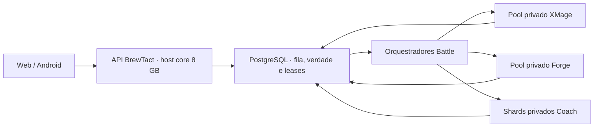
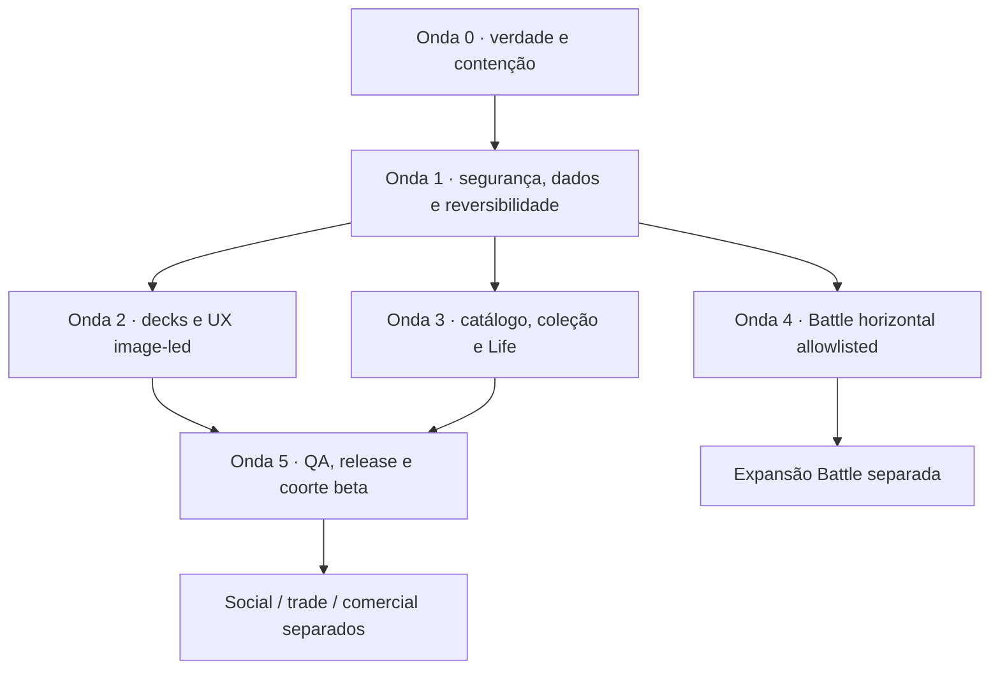

# BrewTact — Backlog mestre de produto, arquitetura, UX e release

Status: `MASTER_TASK_INDEX · CURRENT_DECISION_NO_GO · EXECUTION_IN_PROGRESS · WIP_LIMIT_1`

Data-base: `2026-08-12`
Checkout auditado: `8264ffb27292`
Última revisão do índice: 2026-09-22 (decisões do dono sobre as 55 recomendações de `docs/status/DECISOES_PENDENTES_2026-09-22.md`, registradas na §2.5 e nas linhas das tarefas; antes, no mesmo dia, correção documental contra o código e medição das 49 P0 CORE; estado verificado em `docs/status/ESTADO_DO_PROJETO_2026-09-22.md`, medição em `docs/flows/_p0/README.md`). Revisão anterior: 2026-09-18 (commit f6f791098: +BT-PLAY-001/002/003; aceite de BT-SCP-001 ampliado; matriz "Battle interativo / Jogar contra IA").
Produto público: **BrewTact**
Nomes internos legados: `ManaLoom` e `manaloom` continuam válidos onde ainda
forem identificadores técnicos; não devem reaparecer na experiência pública.

## 1. Objetivo e precedência

Este documento reúne em um único backlog executável:

- lógica de produto e jornadas do consumidor;
- segurança, privacidade, autorização e preservação de dados;
- ciclo completo de decks e IA Commander;
- catálogo, cartas, coleção, preços, Scanner e arte;
- Life Counter, pós-jogo, Battle Lab interno e Jogar contra IA;
- arquitetura horizontal de XMage/Forge para múltiplos usuários;
- UX visual orientada por cartas, com menos texto e mais reconhecimento;
- social, comunidade, marketplace e trades;
- observabilidade, capacidade, migrations, backup, release e jurídico;
- métricas, pesquisa com usuários e critérios de decisão.

Ele passa a ser o **índice de priorização e execução**. Não substitui:

1. `project_logic_manifest.json` e `docs/generated/CURRENT_SYSTEM.md` para a
   verdade estrutural gerada;
2. PostgreSQL/backend como verdade de dados;
3. contratos específicos de cada área;
4. receipts de testes, runtime, UI e release;
5. parecer jurídico externo quando ele for exigido.

Um item não recebe `PASS` porque está descrito aqui. Ele só fecha com o aceite e
os gates indicados, na mesma revisão de código e no mesmo digest aplicável.

## 2. Decisão executiva atual

### 2.1 Veredito

O BrewTact possui um núcleo de produto promissor, mas o estado atual é
**NO-GO para lançamento público integral**. A estratégia aprovada é lançar por
fatias verificáveis, começando por uma beta gratuita de escopo reduzido, em
coorte controlada e deliberadamente menor.

### 2.2 Beta core pretendida

Pode entrar no escopo da beta core depois dos seus P0:

- cadastro, login, recuperação, aceite legal e conta;
- catálogo local somente leitura para o consumidor;
- busca e detalhe de cartas;
- coleção/fichário pessoal privado;
- criação manual e importação de deck novo;
- edição, validação estrita e exportação de decks;
- nova experiência visual de Deck Details com imagens de cartas;
- Life Counter local somente após isolamento por conta e saída confiável.

Segunda onda, por decisão do dono de 2026-09-22 (D-07): análise estrutural e
Optimize como aconselhamento revisável, com as sugestões de troca por imagem de
carta. Elas entram depois das suas P0 AI; a primeira coorte abre sem elas.

### 2.3 Fora da beta core por padrão

Devem permanecer inacessíveis no app **e na API direta**, salvo uma liberação
específica posterior:

- Battle público e Jogar contra IA; Battle Live nunca é produto espectador;
- Scanner/OCR;
- geração IA generalizada ou promoção autônoma de aprendizado;
- galeria pública, perfis públicos, busca de usuários, comments e follows;
- DMs, push social, Binder público, marketplace e trades;
- checkout, assinatura, anúncios e qualquer paywall ligado a arte/dados;
- iOS/VoiceOver, se formalmente `DEFERRED_BY_SCOPE` no candidato inicial.

### 2.4 Princípios não negociáveis

- PostgreSQL/backend é a verdade; Hermes/SQLite é cache ou laboratório.
- UI escondida não autoriza uma função: capability é server-side e default-deny.
- Nenhuma IA aplica, publica, aprende ou promove sozinha.
- Preview e commit devem representar exatamente a mesma entrada e revisão.
- Toda mutação destrutiva precisa de concorrência otimista, histórico e retorno.
- Carta física usa identidade de impressão; deck usa identidade jogável.
- Legalidade/estrutura não significam desempenho comprovado.
- Imagem de carta é evidência de reconhecimento, não decoração genérica.
- Arte autorizada aparece inteira com `BoxFit.contain`; nunca cortada, desfocada
  ou usada como fundo derivado.
- `PASS_AUTOMATED`, `PASS_RUNTIME` e `PASS_VISUAL_REVIEWED` são independentes.
- Migrations, deploys e mutações live exigem autorização e janela próprias.

### 2.5 Decisões do dono de 2026-09-22

Em 2026-09-22 o dono aceitou as 55 recomendações de
`docs/status/DECISOES_PENDENTES_2026-09-22.md` ("siga com todas as indicações que
você sugeriu"). O registro guarda o texto integral de cada uma; as linhas das
tarefas afetadas trazem a decisão que vale para elas. O essencial:

- **Item 0 (`BT-REL-000`).** Feito em 2026-09-23, antecipado pelo dono: backup local
  com ensaio de restauração, `master` promovido, migration 058, e backend, site público
  e agendador em `87fd5a2e6` com as 29 capabilities off e observação same-SHA. Até
  então a produção rodava `a6ee09c8f` (2026-08-03), sem a política de capabilities.
  Cada passo em produção pede a aprovação do dono.
- **Escopo (D-07).** Primeira coorte com o núcleo e o contador de vida (P0 CORE e
  P0 LIFE); Analyze/Optimize numa segunda onda (§2.2).
- **Processo (D-02, D-03).** Duas raias, uma de servidor, banco e gates e outra de
  app, com WIP-1 cada (o contrato da fila muda no `BT-GOV-002`); prova de UI
  recapturada em lote, com o classificador de escopo staged no commit.
- **Segurança (D-19).** Os quatro buracos foram fechados em produção em 2026-09-23
  (`166aaed57`), dentro de `BT-AUTH-003`, `BT-AUTH-004` e `DCK-P0-06`; o tempo da
  recuperação de senha fechou no mesmo dia (`c0f907108`).
- **E-mail verificado (D-56, 2026-09-23).** Escrever deck, importar e mexer no fichário
  exigem e-mail verificado; aceitar o convite da coorte conta como verificação. No ar
  desde 2026-09-23 às 11:01 UTC (`22a7749a7`).
- **Host (D-57, D-58, 2026-09-23).** XMage desligado até o Battle abrir; host reiniciado
  com a atualização de segurança; o IP do balanceador mudou e foi fixado de novo
  (`22a7749a7`). Abertas: D-59 (confiança no proxy), D-60 (restart do proxy local do
  Postgres) e D-61 (atualizações que não são de segurança).
- **Frentes da coordenação (D-62 a D-71, 2026-09-23).** Servidor, catálogo e privacidade
  foram integrados em `c0f907108`, no ar desde 14:49 UTC. O dono decidiu a D-62 (preço de
  deck pela impressão em papel mais barata) e aceitou as recomendações da D-63 à D-71;
  migration, escrita ou exclusão em produção e o advogado continuam pedindo a palavra dele.
- **Catálogo, segunda rodada (D-72 a D-75, 2026-09-23).** Preço de deck pela impressão em papel
  mais barata, sem oversized nem borda dourada; rota de preço só de leitura no catálogo; os
  preços se aplicam na execução diária das 06:20 UTC.
- **Achados dos fluxos (D-53).** Cada um ganhou ID: `BT-NAV-02`, `BT-NAV-03`,
  `LC-P0-05`, `BT-AI-033`, `BT-UX-ERR-001`, `BT-AUTH-007`, `BT-AUTH-008`,
  `BT-AUTH-009`, `BT-CAT-04`, `BT-DOC-007`, `BT-AUTH-010`, `BT-KPI-002` e
  `LC-P0-06`; o 12 já era o `BT-AI-032`, e o 15 foi corrigido em 2026-09-22 (`TRD-P0-01`).
- **GO/NO-GO (D-18).** `BT-DEC-001` depende de todas as P0 CORE e P0 LIFE
  abertas; exige também produção na linha de base contida, catálogo com menos de
  7 dias (atualizado desde 2026-09-23, com o job diário ativado), rollback treinado e
  a assinatura do dono.
- **Continuam com o dono na hora da execução:** o bucket e a chave `age` do
  backup (D-12), o parecer do advogado (D-12, D-24), o aparelho físico (D-15), a
  exclusão dos dumps de 2026-07-17 (D-26) e toda escrita, migração, deploy ou
  exclusão em produção (D-10, D-11, D-49, D-50).

## 3. Baseline real deste checkout

No momento desta consolidação, o manifesto gerado declara:

| Indicador | Baseline deste checkout |
| --- | ---: |
| Migration mais recente | `058` |
| Quantidade de migrations | `58` |
| Tabelas canônicas | `79` |
| Views | `6` |

Consequências:

- qualquer trabalho chamado anteriormente de migration `059` é tratado aqui
  como **proposta a revalidar**, não como código já presente;
- números de tabelas, colunas, FKs, memória e capacidade observados em worktrees
  temporários não recebem crédito no checkout atual;
- a primeira tarefa de schema/capacidade deve gerar evidência fresca antes de
  escolher DDL, mínimos ou declarar um perfil operacional saudável.

## 4. Arquitetura Battle decidida para o host de 8 GB

### 4.1 O que foi decidido

O servidor atual permanece com **8 GB**. Ele será tratado como core/control
plane para API, PostgreSQL e operações, respeitando medição e reservas reais.
XMage, Forge e Coach não devem depender de coabitação nesse host.

O requisito anterior de 16 GB representava um cenário de **serviços de engine
co-residentes**, com limites e headroom somados. Ele não significava “16 GB para
cinco usuários” e não é o modelo de escala do produto.

### 4.2 Modelo-alvo



Regras:

- a API aceita/consulta/cancela trabalhos; ela não executa engine síncrona;
- PostgreSQL permanece a fila inicial, com idempotência, lease e fencing;
- cada worker anuncia slots, saúde, pin e capacidade;
- XMage continua primeiro; Forge só recebe gap estrutural aceito;
- Coach é stateful e fica preso a um shard/processo; não usa round-robin cego;
- sem slot saudável, nova execução falha fechado ou aguarda dentro da política;
- broker externo e engine-per-session são hipóteses P2, não premissas;
- custos e limites por usuário/plano precedem abertura pública.

## 5. Como ler o backlog

### 5.1 Prioridade

| Código | Significado |
| --- | --- |
| `P0 CORE` | Bloqueia a beta core. |
| `P0 AI` | Bloqueia Analyze/Optimize na beta; a beta pode avançar somente se essas capabilities ficarem comprovadamente OFF. |
| `P0 GENERATE` | Bloqueia Generate/Rebuild fora de allowlist experimental. |
| `P0 LEARNING` | Bloqueia qualquer leitura, escrita, treinamento ou promoção de learning; não bloqueia a beta com toda a lane comprovadamente OFF. |
| `P0 CAPABILITY` | Bloqueia apenas a capability indicada; aparece também como `P0 BATTLE`, `P0 SCANNER`, `P0 LIFE`, `P0 SOCIAL` ou `P0 TRADE`. |
| `P0 COMMERCIAL` | Bloqueia monetização, não a beta gratuita se a oferta paga estiver inacessível. |
| `P1` | Necessário antes de ampliar uma beta ou declarar maturidade consumer. |
| `P2` | Posterior a baseline de uso, capacidade ou validação. |

### 5.2 Estado inicial

| Estado | Uso |
| --- | --- |
| `TODO` | Pronto para decomposição/implementação. |
| `BLOCKED_BY_P0` | Depende de outro P0. |
| `DEFERRED_BY_SCOPE` | Código pode existir, mas a superfície deve permanecer inacessível. |
| `WAITING_EXTERNAL` | Exige advogado, fornecedor, hardware, conta ou owner externo. |
| `EVIDENCE_REQUIRED` | Implementação alegada, mas sem receipt válido neste checkout. |
| `IN_PROGRESS_CONTAINED` | O bypass perigoso foi bloqueado, mas o modelo definitivo e seus gates ainda não fecharam. |
| `IMPLEMENTED_LOCAL_PENDING_FULL_GATE` | Correção local e testes focais existem; ainda falta a bateria consolidada/receipt aplicável. |
| `PASS` | Aceite e todos os gates aplicáveis comprovados. |

### 5.3 Definition of Done de qualquer task

Uma task só pode ser concluída quando:

1. código, contrato, migration e API map aplicáveis concordam;
2. owner, escopo, risco, rollback e observabilidade estão explícitos;
3. testes unitários, negativos, concorrentes e idempotentes aplicáveis passam;
4. schema usa PostgreSQL loopback descartável quando houver dado persistido;
5. `manaloom_project_logic.sh --write` e `--check` passam quando exigidos;
6. UI app-facing possui os três níveis de evidência do contrato;
7. TalkBack humano e teclado Web real permanecem gates separados;
8. nenhum artefato histórico é reutilizado como prova da revisão nova;
9. nenhum deploy, migration live ou promoção ocorre por consequência implícita.

## 6. Caminho crítico e ondas



| Onda | Resultado de saída |
| --- | --- |
| 0 | Uma única verdade de escopo/oferta; funções perigosas bloqueadas server-side. |
| 1 | Conta, privacidade, schema e mutações críticas seguras e reversíveis. |
| 2 | Ciclo de deck coerente e experiência visual centrada em cartas. |
| 3 | Catálogo read-only, coleção confiável e Life isolado por conta. |
| 4 | Battle em workers separados, com admissão, custo e observabilidade. |
| 5 | Candidato beta core same-SHA, UI revisada e decisão assinada. |
| 6+ | Capacidades adicionais abertas uma a uma, nunca por implicação. |

Situação em 2026-09-22: Onda 0 aberta (3/7 PASS: BT-GOV-001, BT-DOC-001, BT-DOC-004; BT-SCP-001 NOW desde 2026-08-24; BT-OFFER-001/BT-GATE-001 sem receipt; BT-GATE-002 com implementação incompleta (medição de 2026-09-22)). Onda 1: nenhum ID iniciado. Fora das ondas: Jogar contra IA (f6f791098, sem mover BT-PLAY-*), BT-CI-001 e BT-UIEV-001 (infra de gate).

---

# 7. Catálogo mestre de tasks

## Épico A — Verdade de produto, escopo e documentação

| ID | Pri. | Estado | Entrega | Depende de | Aceite mínimo |
| --- | --- | --- | --- | --- | --- |
| `BT-GOV-001` | P0 CORE | PASS | Publicar decisão corrente única: beta gratuita, público, plataformas, domínio, oferta, flags, IA, Battle e módulos adiados. | — | Documento curto, datado e sem conflito com UI/API/deploy. Receipt: `docs/qa/execution/2026-08-14/BT-GOV-001.md`; implementação: `fd0397a5a97742bcb5127c7b2d08d80aca4bf738`. |
| `BT-GOV-002` | P0 CORE | IMPLEMENTED_LOCAL_PENDING_FULL_GATE | Fila com duas raias (D-02): servidor, banco e gates numa; app na outra; WIP-1 por raia. | — | O gerador aceita no máximo dois slots `NOW`, um por raia, cada um com ficha e contenção próprias; o teste do gerador cobre um e dois slots e rejeita três ou raia repetida; `CURRENT_QUEUE.md` declara a raia do app quando o `BT-UIEV-001` fechar. Feito em 2026-09-23, na branch `servidor/raia-2026-09-23`: `tools/project_logic/lib/project_logic_generator.dart` lê a coluna `Raia` da tabela "Slot atual" (`servidor` ou `app`), aceita até dois slots `NOW`, um por raia, valida ficha e linha de contenção de cada um com as regras do slot único (a linha de contenção leva a raia entre parênteses) e publica `active_slots` no registry, mantendo `active_slot` para quem já lia um slot só; o formato antigo, sem a coluna, continua aceito. `CURRENT_QUEUE.md` passou a usar a coluna com o slot da raia de servidor e documenta a sintaxe em "Como mover o slot". Evidência: o teste do gerador cobre um e dois slots e rejeita três slots, raia repetida, raia desconhecida, o mesmo ID nas duas raias, raia sem linha de contenção, contenção de raia sem slot, contenção repetida, ficha ausente, dois slots sem a coluna, a coluna fora do lugar e slots com e sem a coluna; uma mutação que aceita raia repetida falha no teste. A raia do app não foi aberta: isso fica para a coordenação, quando o `BT-UIEV-001` fechar. |
| `BT-SCP-001` | P0 CORE | IN_PROGRESS_CONTAINED | Manifesto server-authoritative de capabilities, default-deny e versionado no release identity. | `BT-GOV-001`, `BT-UIEV-001`, `BT-WEB-003` | Flag ausente/inválida fica OFF; API nega antes de PG; app só apresenta o permitido; nenhuma rota espectador fica pública e a implementação interativa guardada usa a direção Jogar contra IA; cadastro novo tem capability própria e fica OFF, enquanto login/recuperação/privacidade de contas existentes permanecem control-plane; same-SHA registra a matriz; `implementation_status`, `release_capability` e `live_verified_as_of` são eixos distintos. Evidência parcial: receipts docs/qa/execution/2026-09-21/btscp001-gate-amplo.md e btuiev001-chromedriver-e-recaptura.md; commits d83e9b1e1, 07014b431, d26f23a16. Aceite ampliado em f6f791098 durante a execução. Dependências explicitadas em 2026-09-22: `BT-UIEV-001` (evidência de UI) e `BT-WEB-003` (`npm audit`) bloqueiam o gate amplo que o `PASS` exige (§5.2); o slot segue como contenção fail-closed, com o marcador declarado na fila. Decisão do dono em 2026-09-22: D-03 (o classificador de escopo staged do worktree `manaloom-bt-scp-001-cleanroom` entra na árvore: o commit roda a evidência de UI só quando há UI no commit; a prova completa sai em lote no `BT-UX-PROOF-001`); D-04 (as correções de UI da contenção social, de trade e do scanner entram neste slot, antes da recaptura do `BT-UIEV-001`); D-05 (prova de mecanismo aceita; a observação de produção passa para o `BT-REL-000`; sem reescrever histórico; o próximo commit passa pelos hooks e o receipt lista os 16 commits que citam `--no-verify`); D-52 (o que faltar do commit `0779595e2` entra aqui). A observação de produção (D-05) foi feita no `BT-REL-000` em 2026-09-23. |
| `BT-OFFER-001` | P0 CORE | IMPLEMENTED_LOCAL_PENDING_FULL_GATE | Unificar a oferta pública da beta e remover promessas conflitantes de Free/Pro/checkout/limites. | `BT-GOV-001` | Landing, app, backend e contratos usam a mesma oferta; checkout e paywall inacessíveis se beta gratuita. Evidência: fd0397a5a + receipt BT-GOV-001 (`docs/qa/execution/2026-08-14/BT-GOV-001.md`). |
| `BT-DOC-001` | P0 CORE | PASS | Reconciliar docs ativos e marcar relatórios antigos como históricos para prioridade. | `BT-GOV-001` | Deck/IA ganhou mapa canônico; qualquer plano/manual/Hermes antigo recebe lifecycle inequívoco; zero comando mutante em documento histórico pode parecer operacional. Receipt: `docs/qa/execution/2026-08-24/BT-DOC-001.md`; implementação: `c6e2725af0995e01dcf675f20e3a8b608b84d555`. |
| `BT-DOC-002` | P1 | IMPLEMENTED_LOCAL_PENDING_FULL_GATE | Corrigir duplicidade de IDs de ADR e registry de decisões. | `BT-DOC-001` | ADR XMage foi renumerado canonicamente para 0012, 0004 duplicado ficou histórico; 0011 pertence ao domínio BrewTact; project-logic/link checks precisam fechar. Evidência: c6e2725af. |
| `BT-DOC-003` | P1 | TODO | Padronizar BrewTact em textos públicos, User-Agent e provenance; manter nomes legados só quando técnicos. | `BT-GOV-001` | Scan público sem ManaLoom/MTGDeckBuilder indevido; contato e versão consistentes. |
| `BT-DOC-004` | P0 CORE | PASS | Registry machine-readable de tasks, dependências, lifecycle documental, rotas/consumers e receipts. | `BT-DOC-001` | IDs únicos; dependências resolvidas; nenhum placeholder; ciclo detectado; histórico não entra como fonte ativa; receipt vinculado ao digest. Receipt: `docs/qa/execution/2026-08-24/BT-DOC-004.md`; implementação: `d9f7a59cd87d032df3d076c35ffbdb17e41525a6`. |
| `BT-DOC-005` | P1 | TODO | Corrigir lineage/parser do project logic e eliminar inputs duplicados. | `BT-DOC-004` | `digest_inputs` sem duplicação; composite PK, nullability e defaults corretos; fixtures impedem regressão. |
| `BT-DOC-006` | P0 CORE | IMPLEMENTED_LOCAL_PENDING_FULL_GATE | Registrar o terceiro portão fail-closed de capability (`server/bin/manaloom_ops_daemon.py`: 16 jobs, `JOB_REQUIRED_CAPABILITIES`, `/health` próprio) no mapa operacional e declarar o fluxo `ops_scheduler` no contrato. | — | `docs/MAPA_OPERACIONAL_DO_PROJETO.md` §2 nomeia os três portões; `docs/project_logic_contracts.json` tem `flows[ops_scheduler]` com o daemon, os jobs e as tabelas que ele escreve; `--check` sincronizado. Evidência: árvore de trabalho 2026-09-22 (`docs/verdade/FATOS.md` 2.4); commit pendente. Decisão do dono em 2026-09-21; linha registrada em 2026-09-22. |
| `BT-DOC-007` | P1 | TODO | OpenAPI gerado deriva `bearerAuth` da presença de `authMiddleware` (achado 10 dos fluxos). | — | As 9 rotas anônimas deixam de declarar `bearerAuth`; teste do gerador cobre rota anônima e autenticada. |
| `BT-KPI-001` | P0 CORE | TODO | Definir eventos, coortes, métricas de ativação, guardrails e política de privacidade de telemetria. | `BT-GOV-001` | Métricas contam usuários/loops de valor, não apenas eventos; nenhum decklist/UGC em analytics. Medição de 2026-09-22 (`docs/flows/_p0/privacidade-telemetria.md`): o código atual faz o que o aceite proíbe (conta eventos e divide por signups) e testes consagram isso (`commercial_metrics_service_test.dart:8-18`) — há retrabalho, não só trabalho novo. Decisão do dono em 2026-09-22: D-47, ativação é o primeiro deck criado ou importado em até 24 h do cadastro; retenção é a volta na segunda semana; guardrails de custo de IA e de taxa de erro; nenhuma decklist em analytics; política de privacidade atualizada quando a telemetria entrar. |
| `BT-KPI-002` | P1 | TODO | Eventos de ativação do onboarding aceitos pelo servidor ou retirados do app (achado 13 dos fluxos). | `BT-KPI-001` | Os eventos `onboarding_goal_selected`, `onboarding_experience_selected`, `onboarding_build_mode_selected` e `onboarding_task_started` entram no allowlist ou saem do app; nenhum descarte silencioso. |

Decisão de escopo inicial de `BT-SCP-001`:

> Contenção da Onda 0: o artefato commitado começa com **29/29 capabilities
> OFF**. Os estados `ON após P0` abaixo são metas condicionais, não configuração
> atual. Cada promoção exige alteração versionada, receipt same-SHA e seus gates.

| Capability | Estado inicial |
| --- | --- |
| cadastro de nova conta | `OFF`; acesso e privacidade de contas existentes continuam control-plane |
| catálogo/decks/coleção privados | `ON` após P0 próprios |
| Analyze/Optimize advisory | `ON` após P0 próprios |
| Generate/Rebuild | `EXPERIMENTAL_ALLOWLIST` |
| Battle batch | `OFF` até Épico G |
| Battle interativo/Jogar contra IA | `OFF` até Épico G; Live é infraestrutura interna, nunca CTA espectador |
| Scanner | `OFF` |
| Galeria/social/DM/push | `OFF` |
| Binder público/trades/marketplace | `OFF` |
| checkout/assinatura/ads/paywall de arte | `OFF` |

## Épico B — Conta, autorização, privacidade e segurança

| ID | Pri. | Estado | Entrega | Depende de | Aceite mínimo |
| --- | --- | --- | --- | --- | --- |
| `BT-AUTH-001` | P0 CORE | TODO | Padronizar erros públicos tipados e impedir exception/SQL/stack cru. | — | Corpus de falhas retorna código estável e request-id; zero detalhe interno. Decisão do dono em 2026-09-22: D-21, códigos `dominio_motivo` em snake_case acompanham a frase em português, sem substituí-la. Achado de 2026-09-23 (frente de segurança): `GET /reports/:id` devolve o texto da exceção em `details` quando o banco falha (`server/routes/reports/[id].dart:19`). |
| `BT-AUTH-002` | P0 CORE | TODO | Limites globais de body antes do parse e limites por campo/URL. | — | Oversize/chunked/compressed rejeitado antes de alocar/gravar; DB não cresce. Decisão do dono em 2026-09-22: D-21, teto de body de 1 MB, maior só no import. |
| `BT-AUTH-003` | P0 CORE | IMPLEMENTED_LOCAL_PENDING_FULL_GATE | Recuperação de senha não enumerável, rate-limited e com invalidação de sessões/tokens. | — | Conta existente/inexistente indistinguível em status, shape e timing aceitável; replay de token falha. Decisão do dono em 2026-09-22: D-19 e D-21, inclui o oráculo de enumeração do login (conta inexistente lança antes do bcrypt, e a resposta devolve o texto da exceção): bcrypt fictício com diferença de mediana abaixo de 20 ms em 50 tentativas, limite por e-mail e por IP, resposta sem texto de exceção. Buraco 3 da D-19 fechado localmente em 2026-09-23, na branch `seguranca/d19-buracos-2026-09-23`: o login verifica a senha também para conta inexistente, contra um hash bcrypt fictício de mesmo custo, e responde 401 idêntico nos dois casos; nenhuma resposta do login repete texto de exceção; login e recuperação ganharam limite por e-mail (buckets `auth_login_email` e `auth_recovery_email`, 10 tentativas por 15 min em produção), somado ao limite por IP que já existia. Evidência: `server/test/auth_login_enumeration_test.dart` (12 testes; 4 mutações falham como esperado) e medição ponta a ponta em API e PostgreSQL locais, 50 tentativas intercaladas por caso: diferença de mediana de 0,1 ms, contra 94,2 ms na base `519b7e021`; `server/test/auth_login_timing_live_test.dart` repete a medição no harness vivo. A parte do login está no ar em produção desde 2026-09-23 às 08:08 UTC (`166aaed57`, `docs/qa/execution/2026-09-23/deploy-seguranca-d19.md`). Recuperação de senha fechada localmente em 2026-09-23, na branch `servidor/raia-2026-09-23`: `POST /auth/forgot-password` responde sem esperar nada que dependa da conta, porque achar a conta, criar o token e entregar o e-mail rodam depois da resposta (`server/lib/password_recovery_dispatcher.dart`, sem fila persistente e sem migração); a falha desse trabalho vai para o log e para a observabilidade, e o texto da resposta não mudou. A troca de token agora trava a conta, para pedidos seguidos deixarem um único token vivo. Evidência: `server/test/password_recovery_async_test.dart` (8 testes; 4 mutações falham como esperado), `server/test/password_reset_token_race_db_live_test.dart` (20 pedidos simultâneos, 1 token vivo, em PostgreSQL descartável) e medição ponta a ponta com entrega de 300 ms: diferença de mediana de 0,05 ms em 50 tentativas, contra 313,6 ms na base `47dc3b698`; `server/test/auth_forgot_password_timing_live_test.dart` repete a medição no modo de produção. No ar desde 2026-09-23 às 14:49 UTC (`c0f907108`). Por fora, recuperação de senha de e-mail inexistente responde 202 com a frase genérica, e o limite responde 429. |
| `BT-AUTH-004` | P0 CORE | IMPLEMENTED_LOCAL_PENDING_FULL_GATE | Exigir step-up/reautenticação para export e exclusão de conta. | `BT-AUTH-003` | Token antigo ou sessão roubada não executa ação sensível; rate limit distribuído. Decisão do dono em 2026-09-22: D-19 e D-20, reverificação de senha por requisição, sem migração, na exportação, na exclusão e na troca de e-mail; `DELETE /users/me` entra no limite de tentativas de credencial; a exportação deixa de sair só com o token de sessão. Buracos 1 e 2 da D-19 fechados no servidor em 2026-09-23, na branch `seguranca/d19-buracos-2026-09-23`: a exportação virou `POST /users/me/export` com a senha no corpo, conferida a cada requisição (sem senha 400, senha errada 401, e o `GET` saiu da rota e do plano de controle); `DELETE /users/me` e a exportação entram no bucket de credenciais por IP, agora instalado no middleware de `/users`, e ganharam o limite por conta `account_reverification` (10 por 15 min em produção, distribuído como o de `/auth`); troca de e-mail não existe em rota nenhuma, e um teste falha se `PATCH /users/me` passar a gravar e-mail. Evidência: `server/test/account_reverification_test.dart` (9 testes; 5 mutações falham como esperado) e `server/test/privacy_account_live_test.dart` reescrito para o contrato novo, verde contra API e PostgreSQL locais. O app ainda chama `GET /users/me/export` (`app/lib/features/profile/account_privacy_service.dart:36`): precisa pedir a senha e usar `POST`, na raia do app, com a prova de UI. No ar em produção desde 2026-09-23 às 08:08 UTC (`166aaed57`, `docs/qa/execution/2026-09-23/deploy-seguranca-d19.md`). |
| `BT-AUTH-005` | P1 | TODO | Exigir email verificado para custos de IA/Battle e para qualquer interação social futura. | `BT-SCP-001` | API direta e UI concordam; leitura segura permanece disponível. |
| `BT-AUTH-006` | P0 CORE | TODO | Admissão controlada de contas antes de promover `account_registration`. | `BT-AUTH-001`, `BT-AUTH-002`, `BT-SCP-001` | Convite/allowlist server-side single-use, expirável e revogável; rate limit distribuído, idempotência e auditoria; negação ocorre antes de criar usuário ou enviar email; E2E cobre válido, inválido, expirado, replay e concorrência. Decisão do dono em 2026-09-22: D-16, convite de uso único emitido pelo dono, em lotes de 20 a 30, entregue por e-mail, com expiração e revogável; sem lista de espera; o convite deixa de ser exigido quando o cadastro abrir. Decisão do dono em 2026-09-23: aceitar o convite enviado ao e-mail conta como verificação do e-mail, porque escrever deck, importar, usar o fichário e publicar exigem e-mail verificado (`BT-AUTH-010`). |
| `BT-AUTH-007` | P0 CORE | IMPLEMENTED_LOCAL_PENDING_FULL_GATE | Trocar a senha não sobrescreve o usuário completo com um `user` truncado (achado 6 dos fluxos; alcançável hoje). | — | Depois de trocar a senha, e-mail verificado, nome e avatar continuam iguais no app; teste de servidor e de app. Corrigido no servidor em 2026-09-23, na branch `seguranca/d19-buracos-2026-09-23`: `POST /auth/change-password` e `POST /auth/revoke-sessions` devolvem o usuário completo, no formato de `GET /users/me`, lido do próprio `UPDATE ... RETURNING`; o app, que já troca o usuário guardado pelo da resposta, deixa de perder os campos sem mudar código. Evidência: `server/test/account_security_full_user_test.dart` (4 testes; a volta do `user` truncado falha em 2). Falta o teste de app pedido no aceite, na raia do app. No ar em produção desde 2026-09-23 às 08:08 UTC (`166aaed57`, `docs/qa/execution/2026-09-23/deploy-seguranca-d19.md`). |
| `BT-AUTH-008` | P1 | TODO | A splash valida o token antes de navegar (achado 7 dos fluxos). | — | Sessão válida com rede lenta não mostra o login; teste de widget. |
| `BT-AUTH-009` | P1 | TODO | O link de recuperação de senha funciona para quem já está logado (achado 8 dos fluxos). | — | `/reset-password?token=` não redireciona para `/home` descartando o token; teste de rota. |
| `BT-AUTH-010` | P0 CORE | IMPLEMENTED_LOCAL_PENDING_FULL_GATE | O import exige e-mail verificado, como o fichário (achado 11 dos fluxos). | — | `/import` e `/import/*` passam pela mesma verificação de e-mail do fichário; teste negativo com conta não verificada. Feito em 2026-09-23, na branch `seguranca/d19-buracos-2026-09-23`: `server/routes/import/_middleware.dart` instala `verifiedEmailForMutations()` por dentro do `authMiddleware`, igual ao fichário. Evidência: `server/test/import_verified_email_test.dart` (conta não verificada recebe 403 `email_verification_required` em `/import`, `/import/to-deck` e `/import/validate` sem o handler rodar; conta verificada passa) e a lista estrutural de `server/test/email_verification_contract_test.dart`; a versão da base falha nos dois. Decisão do dono em 2026-09-23: escrever deck também exige e-mail verificado; ler os próprios decks e apagar o próprio deck, não. Feito no mesmo dia, na mesma branch: `server/routes/decks/_middleware.dart` instala `verifiedEmailForDeckContentWrites()`, com a regra em `server/lib/deck_write_verification_policy.dart` (sob `/decks` toda escrita exige, menos apagar o próprio deck, os cálculos do servidor sobre a lista atual e os registros privados de partida), e `POST /ai/rebuild` com `save_mode=draft_clone` também exige. Evidência: `server/test/deck_write_verified_email_test.dart` (a tabela de todas as rotas de `server/routes/decks` falha se aparecer rota sem classificação; 4 mutações falham como esperado) e `server/test/email_verification_live_test.dart`, verde contra API e PostgreSQL locais. Na coorte por convite, aceitar o convite enviado ao e-mail vai contar como verificação; isso entra no `BT-AUTH-006`. O app precisa tratar `email_verification_required` nas telas de deck e oferecer o reenvio da verificação. A parte do import está no ar desde 2026-09-23 às 08:08 UTC (`166aaed57`); a escrita de deck com e-mail verificado (D-56, `bedafe8bf`) está no ar desde as 11:01 UTC do mesmo dia (`22a7749a7`). |
| `BT-LEGAL-ACCEPT-001` | P0 CORE | TODO | Corrigir versionamento/reaceite de Termos e Privacidade, incluindo UX de `legal_acceptance_required`. | `BT-GOV-001` | Aceite registra versões exatas; versão nova bloqueia só o necessário; mensagens traduzidas e acionáveis. Decisão do dono em 2026-09-22: D-24, o reaceite bloqueia só o que cria ou compartilha dado (deck novo, import, IA); login, exportação e exclusão seguem livres; beta só em pt-BR; texto legal versionado no repositório; histórico de aceites guardado (confirmar com advogado). |
| `BT-PRIV-001` | P0 CORE | IMPLEMENTED_LOCAL_PENDING_FULL_GATE | Tornar export de dados um job allowlisted, sem fingerprints/IDs internos indevidos. | `BT-AUTH-004`, `BT-PRIV-003` | Export completo e mínimo; isolamento A/B; expiração e download auditados. Decisão do dono em 2026-09-22: D-22, gerar sob demanda e entregar como download no app, sem guardar; só dados do próprio usuário, com IDs de terceiros anonimizados; sem hashes nem fingerprints internos. D-25: depende do inventário do `BT-PRIV-003`. Feito em 2026-09-23, na branch `privacidade/2026-09-23`, sobre o inventário do `BT-PRIV-003`: a exportação segue gerada sob demanda numa transação somente leitura e entregue como anexo `no-store`, sem cópia no servidor; cada uma das 39 seções sai por `jsonb_build_object` só com as colunas que o inventário marca para sair (`server/lib/privacy/privacy_export_allowlist.dart`), sem nenhum `to_jsonb`; UUIDs de outras pessoas e de decks de outras pessoas viram pseudônimos HMAC com chave aleatória por arquivo; `request_fingerprint`, `request_key`, `cache_key`, hashes de deck e chaves de idempotência e de lease saem de qualquer profundidade do JSON; entraram bloqueios, eventos de bloqueio, recursos de moderação, confrontos e fraquezas de deck e o registro de consentimento da conta; saíram as simulações que outra pessoa rodou contra o deck público do titular; relação ausente derruba a exportação; formato `schema_version` 2. Evidência: `server/test/privacy_export_allowlist_test.dart` (13 testes; falha se a allowlist e o inventário divergirem) e `server/test/privacy_export_db_live_test.dart` (11 testes verdes contra PostgreSQL descartável com três contas e dado nas 39 tabelas exportadas: nenhum ID cru nem texto de outra pessoa, nenhum hash ou fingerprint, nada gravado no banco); 8 mutações falham como esperado. O job, a expiração e o download auditado do aceite original saíram com a D-22 (nada é guardado); a auditoria do pedido de exportação não foi decidida. O app ainda chama `GET /users/me/export` e precisa pedir a senha, usar `POST` e entregar o arquivo (raia do app). No ar desde 2026-09-23 às 14:49 UTC (`c0f907108`). Decisão do dono em 2026-09-23: D-71, registrar cada pedido de exportação, sem o conteúdo. D-71 feita em 2026-09-23, na branch `privacidade/rodada2-2026-09-23`, sem tabela: cada pedido que chega a `POST /users/me/export` deixa uma linha `MANALOOM_PRIVACY_EXPORT_REQUEST` no stdout, no formato da de demanda do catálogo (D-63), com evento, horário, resultado (`ok`, `method_not_allowed`, `password_required`, `invalid_password`, `rate_limited`, `not_found` ou `error`) e uma referência pseudônima de quem pediu (HMAC-SHA256 do ID com chave derivada do `JWT_SECRET`, truncado em 16 hexadecimais); nunca o ID cru, a senha nem o conteúdo. Pedidos barrados pela autenticação ou pelo balde por IP do middleware de `/users` não chegam à rota e não entram na contagem. Evidência: `server/test/privacy_export_request_log_test.dart` (11 testes: formato, referência estável e derivada, uma linha por pedido em cada saída da rota); 8 mutações falham como esperado. Pendente de decisão: o prazo desses logs segue a rotação do host, ainda não documentada. D-71 em `a71f53862`: uma linha `MANALOOM_PRIVACY_EXPORT_REQUEST` por pedido, com referência pseudônima. Decisão do dono em 2026-09-24: D-78, esses logs guardam 90 dias. |
| `BT-PRIV-002` | P0 CORE | IN_PROGRESS_CONTAINED | Orquestrar exclusão com outbox/reconciliação de sidecars, jobs, caches e arquivos. | `BT-AUTH-004`, `BT-PRIV-003` | Nenhum runtime ativo recria dado; retry idempotente; receipt por consumidor. Decisão do dono em 2026-09-22: D-23, exclusão por outbox; caches com TTL de até 24 h; Sentry sem ID do usuário e retenção do provedor documentada; backups não são reescritos, com prazo de rotação na política; simulações de terceiros contra deck público de quem saiu anonimizadas. D-25: depende do inventário do `BT-PRIV-003`. Feito em 2026-09-23, na branch `privacidade/2026-09-23`, sem migration: a exclusão confere antes da primeira escrita todas as relações que toca e para se faltar alguma; apaga bloqueios e tokens de recuperação e de verificação do titular; tira o titular dos eventos de bloqueio, dos recursos (o texto vira um marcador), das ações de moderação e da evidência da denúncia; simulações e tentativas que outra pessoa rodou contra o deck público do titular ficam com ela, com o UUID e o nome do deck trocados no replay e o hash do lado dele nulo, e as dele saem; o recibo leva a política `brewtact-beta-privacy-v2` e um resumo que diz isso. O `EndpointCache` ganhou teto de 24 h e limpa as entradas vencidas a cada acesso depois de 1 min. O Sentry do servidor não recebe mais o ID do usuário: nenhum evento leva o usuário e todo UUID de caminho, título, tag, exceção e contexto vira `:id`, com o `request_id` preservado. Evidência: `server/test/privacy_account_deletion_test.dart` (7 testes), `server/test/endpoint_cache_ttl_test.dart` (4), `server/test/observability_test.dart` (2 testes novos e 1 corrigido, que consagrava o ID cru) e `server/test/privacy_account_deletion_db_live_test.dart` (9 testes verdes contra PostgreSQL descartável com três contas); 10 mutações falham como esperado. Segue aberto: o outbox da D-23, com receipt por consumidor e retry idempotente, exige tabela nova, e a proposta de DDL foi relatada à coordenação (migration é decisão do dono); jobs e sessões de Jogar contra IA que outra pessoa rodou contra o deck de quem saiu guardam o hash e a lista do deck (`BT-BAT-002`); o SQLite do Hermes (`BT-AI-030`); o Sentry do app e a limpeza do aparelho (raia do app); a retenção do plano Sentry, que o dono confere no painel. No ar desde 2026-09-23 às 14:49 UTC (`c0f907108`). Decisões do dono em 2026-09-23: D-66 (itens de troca na exclusão), D-68 (outbox aprovado; a migration pede a palavra do dono na execução) e D-70 (limpeza por prazo sem depender de capability, ligada só com a palavra do dono). D-66 feita em 2026-09-23, na branch `privacidade/rodada2-2026-09-23`, com migration proposta e não aplicada: a oferta de troca aberta (`pending`) do titular, enviada ou recebida, é cancelada com uma linha no histórico e perde os itens dele, e os da outra pessoa ficam; nas outras trocas o item do titular fica com a troca, sem o vínculo com o fichário; o recibo passa à política `brewtact-beta-privacy-v3`, com `open_trade_offers`. A migration 059 deixa `trade_items.owner_id` em `RESTRICT` nos dois bancos, como as outras chaves de troca e mensagem, e reinstala o trigger de conta ativa; o baseline acompanha, e a prontidão e o deploy passam a exigir a 059. Medição que corrige o problema descrito na D-66: a exclusão do produto não falha na produção, porque pseudonimiza a conta sem apagar a linha de `users`; o que falha é o `DELETE` direto nessa linha, que só scripts de limpeza de teste usam. Evidência: `server/test/privacy_trade_items_db_live_test.dart` (8 testes verdes contra PostgreSQL descartável: com a chave sem ação, como na produção, o `DELETE` direto falha; com `CASCADE`, passa e leva os itens da outra parte; com a 059, falha igual; a exclusão do produto passa nas três formas e trata os itens), `server/test/privacy_account_deletion_test.dart` (9 testes) e `server/test/privacy_data_inventory_test.dart` (modo `partial_delete`); 16 mutações falham como esperado. Pendente de decisão: as trocas em andamento (`accepted`, `shipped`, `delivered`, `disputed`) seguem com a outra pessoa, como as concluídas; aplicar a 059 na produção pede a palavra do dono. D-68 feita em 2026-09-23, na mesma branch, com a migration 060 proposta e não aplicada: `account_deletion_outbox` com o DDL aprovado; a exclusão grava uma linha por consumidor fora do banco na mesma transação do recibo (política `brewtact-beta-privacy-v4`), com os decks só como o HMAC dos tombstones e só para o Hermes e o sidecar, e volta inteira se o outbox falhar. O job `manaloom_account_deletion_outbox` roda a cada 15 min sem capability, sob o contrato `account_deletion_outbox_v1` e fechado com política inválida, com lease, nova tentativa com intervalo crescente até 24 h, teto de 20 tentativas e recibo por execução sem identificador; conclui `endpoint_cache` depois do teto de 24 h e `sentry` na hora, porque os eventos do servidor não levam o usuário. Ficam abertos com o motivo em `last_error_code`, sem gastar tentativa: `hermes_learning_sqlite` (falta o consumidor na imagem de ops que calcule o HMAC dos `deck_id` do `knowledge.db`), `interactive_battle_sidecar` (falta rota e credencial do job para confirmar a varredura do sidecar; o Battle está desligado) e `backups` (falta a rotação de 30 dias da D-69). O teste que fixa as capabilities dos demais jobs segue igual. Evidência: `server/test/account_deletion_outbox_test.dart` (8 testes), `server/test/privacy_deletion_outbox_db_live_test.dart` (11 testes verdes contra PostgreSQL descartável) e `server/test/manaloom_ops_daemon_test.py`; 22 mutações falham como esperado. Pendente de decisão: se o sidecar pode ser dado como limpo pelo teto de vida da sessão, como o EndpointCache; aplicar a 060 na produção pede a palavra do dono. D-70 feita em 2026-09-23, na mesma branch, sem migration: o job `manaloom_ai_runtime_cleanup` saiu de `ai_analyze_optimize_advisory` e roda sem capability, sob o contrato `retention_cleanup_apply_v1` (em `PRIVACY_CONTROL_JOBS`, fechado com política inválida); apaga só os prazos da nova seção `retention_cleanup` do inventário (telemetria do Optimize e `ai_logs` em 180 dias, reservas de cota não confirmadas em 10 min, igual ao TTL do `PlanService`, `rate_limit_events` em 24 h e jobs de IA em 24 h, pela D-32), sem variável de ambiente nem flag de prazo, e deixa um recibo por execução (`MANALOOM_RETENTION_CLEANUP`, só contagens). Desligado por padrão: o agendado só conta até uma execução supervisionada com `MANALOOM_CONFIRM_POSTGRES_WRITES` (`--mode activate`) registrar a ativação em `sync_state`; `--mode deactivate` pausa, e outra execução em andamento faz a atual parar sem apagar. O teste que fixa as capabilities dos demais jobs segue igual. Evidência: `server/test/retention_cleanup_test.dart` (10 testes; cruza as regras com o inventário nos dois sentidos), `server/test/retention_cleanup_db_live_test.dart` (6 testes verdes contra PostgreSQL descartável) e `server/test/manaloom_ops_daemon_test.py`; 16 mutações falham como esperado. Pendente de decisão: ligar em produção (`--mode activate`) é exclusão em produção e pede a palavra do dono; os prazos de partida da D-69 só entram no job depois do advogado. Rodada 2 integrada em `81841e234` e ainda não implantada (depois das recapturas do gate, por decisão do dono): D-66 (`282ee5a6d`, migration 059), D-68 (`33951170c`, migration 060), D-70 (`8bb7983ff`, sobe só contando). Decisões do dono em 2026-09-24: D-76 (trocas em andamento ficam com a outra pessoa) e D-77 (sidecar dado como limpo pelo tempo máximo da sessão). |
| `BT-PRIV-003` | P0 CORE | IMPLEMENTED_LOCAL_PENDING_FULL_GATE | Inventário de retenção por tabela/artefato, incluindo replays, prompts, logs e UGC. | — | Owner, finalidade, prazo, export/delete e exceção legal por classe. Medição de 2026-09-22 (`docs/flows/_p0/README.md`): este inventário é insumo de `BT-PRIV-001`, `BT-PRIV-002` e `DCK-P0-04` — a dependência declarada está invertida; corrigir exige decidir a prioridade desta tarefa (hoje P1), decisão do dono. Decisão do dono em 2026-09-22: D-25, promovido a P0 CORE e dependência invertida: o inventário vem antes da exportação, da exclusão e do `DCK-P0-04`. Feito em 2026-09-23, na branch `privacidade/2026-09-23`: inventário legível por máquina em `docs/privacy/data_retention_inventory.json` (as 79 tabelas do schema versionado, 44 com dado pessoal, cada uma com finalidade, dono, prazo, quem apaga, exportação, exclusão e exceção legal; 6 views; 20 tabelas e 3 colunas que só existem na produção, uma delas com dado pessoal (`ml_prompt_feedback.user_rating`); 13 artefatos fora do banco, como caches, sidecars, logs, Sentry, provedores, backups e aparelho; classificação de exportação das 517 colunas das 39 tabelas exportadas; os prazos das D-23, D-29, D-30 e D-32) e resumo em `docs/privacy/INVENTARIO_DE_RETENCAO.md`. Evidência: `server/test/privacy_data_inventory_test.dart` (14 testes contra o schema do manifesto, os prazos decididos e o serviço de exclusão; 10 mutações falham como esperado) e `server/test/privacy_data_inventory_db_live_test.dart` (4 testes verdes contra PostgreSQL descartável com as 58 migrations; tabela e coluna novas no banco fazem 2 falharem). Achado: nenhum prazo automático roda em produção, porque o job de limpeza exige `ai_analyze_optimize_advisory`, que está OFF. Seguem com o dono: prazo de rotação dos backups; prazos de analytics, replays, notificações e feedback de IA; retenção declarada por Sentry, OpenAI e Resend; base legal de trocas, moderação e nomes de jogador de torneio (advogado). Decisão do dono em 2026-09-23: D-69, prazos de partida a confirmar com o advogado (D-24). |
| `BT-SEC-001` | P1 | TODO | Rate limiting distribuído fail-closed para mutações caras, com buckets por ação. | `BT-AUTH-002` | Falha do limiter não degrada para memória por réplica nas mutações caras. Achado de 2026-09-23 (frente de segurança): o limitador distribuído retorna sem `await` dentro do `try`, e uma falha do banco vira 500 em vez de cair no caminho previsto. |
| `BT-SEC-AI-001` | P0 AI | TODO | Fechar callback interno de IA e eliminar encaminhamento do bearer do usuário. | `BT-AUTH-002`, `BT-SCP-001` | Destino privado/allowlisted; redirects e DNS rebinding bloqueados; token curto ligado a job/user/audience/nonce; replay e outra réplica falham corretamente. |
| `BT-SEC-AI-002` | P0 AI | TODO | Allowlist estruturada e pseudonimização de logs/provider/Sentry. | `BT-PRIV-003` | Zero user/deck/job ID cru em sinks não essenciais; retenção/export/delete e gate estático comprovados. |

## Épico C — Ciclo completo de decks

### P0 do ciclo

| ID | Pri. | Estado | Entrega | Depende de | Aceite mínimo |
| --- | --- | --- | --- | --- | --- |
| `DCK-P0-00` | P0 CORE | IN_PROGRESS_CONTAINED | Conter fluxos perigosos: replace-all OFF, deck novo privado e IA advisory. | `BT-SCP-001` | Add-only continua; replace direto/API consumer nega; deck vazio não nasce público. Medição de 2026-09-22 (`docs/flows/_p0/deck-core.md`): metade — o portão `deck_replace_all` já está provado (`b2d3fc04f`; `release_capability_policy_test.dart:195-197`); um teste ainda afirma que deck vazio nasce público (`decks_crud_test.dart:184-212`). Decisão do dono em 2026-09-22: D-27, criar edição incremental (remoção e PATCH) sob `decks_private`; `deck_replace_all` segue off. Parte do servidor feita em 2026-09-24 na branch `deck/rodada1-2026-09-24`, ainda fora do ar: `PATCH /decks/:id` (nome, descrição, arquétipo, bracket e visibilidade; cartas, formato e outros campos dão 400 `deck_patch_field_unsupported`) e `POST /decks/:id/cards/remove` abriram sob `decks_private`; `PUT /decks/:id`, a troca de edição e o import sobre deck existente seguem em `deck_replace_all`. Deck novo nasce privado; `is_public: true` exige `gallery_public` aberta e cartas, com 422 `deck_publication_unavailable` ou `deck_public_requires_cards` antes de gravar (`server/lib/deck_visibility_policy.dart`), e um deck público que fica vazio (remoção ou `PUT` com lista vazia) vira privado na mesma transação. IA consultiva: `POST /ai/rebuild` sem `save_mode` passou a ser só prévia. Evidência: `server/test/deck_containment_test.dart` (portão na matriz da beta, recusas antes do banco), `server/test/deck_incremental_edit_db_live_test.dart` (PostgreSQL descartável, 9 casos), o teste antigo que fixava deck vazio público invertido (`decks_crud_test.dart`) e 12 mutações derrubadas. Falta: o app usar as rotas novas, esconder as ações de replace-all e traduzir os códigos (raia do app). Recomendação registrada no diário da frente: levar a troca de edição (`cards/replace`) para `decks_private`, porque troca a impressão da mesma carta sem refazer a lista. |
| `DCK-P0-01` | P0 CORE | TODO | Revisão otimista de deck + ledger imutável de mudanças + undo universal. | `BT-DB-001` | Todo mutator usa expected revision/If-Match; uma de duas concorrentes vence; outra 409; retry não duplica; receipt atômico evita segunda validação; undo recusa HEAD novo. Decisão do dono em 2026-09-22: D-29, `If-Match` com transição: primeiro só avisa; passa a ser exigido quando a versão mínima do app mandar o cabeçalho. |
| `DCK-P0-02` | P0 CORE | TODO | `DeckReviewArtifact v1` único para preview/commit, com HMAC, revisão, hash, constraints e expiração. | `DCK-P0-01` | Qualquer mudança semântica invalida; outro usuário/tamper/stale/expired falha. Decisão do dono em 2026-09-22: D-29, artifact de preview com TTL de 24 h, reutilizável pelo mesmo usuário. |
| `DCK-P0-03` | P0 CORE | BLOCKED_BY_P0 | Importar em deck existente em duas fases, diff completo e undo. | `DCK-P0-01`, `DCK-P0-02` | Zero delete/insert antes de confirmar; falha preserva original; stale retorna 409. Decisão do dono em 2026-09-22: D-29, o preview de import em deck existente, que não grava nada, fica sob `decks_private`; o commit continua sob `deck_replace_all`; na beta, o import entra por deck novo (`/import`). |
| `DCK-P0-04` | P0 CORE | BLOCKED_BY_P0 | Generate persiste request/fingerprint e materializa server-side pelo job. | `DCK-P0-02`, `BT-PRIV-003` | Resultado A nunca salva como controles B; cliente não injeta lista; cross-device reidrata a entrada original. Decisão do dono em 2026-09-22: D-29, prompt bruto retido por 30 dias e fora de `decks.description`; D-25, depende do `BT-PRIV-003`. |
| `DCK-P0-05` | P0 LEARNING | EVIDENCE_REQUIRED | Separar telemetria, contribuição, candidato e promoção por state machine/receipt. | `DCK-P0-02`, `BT-DB-001` | Writes/reads default-off; opt-in por usuário/finalidade; ledger atribuível/idempotente; revoke/delete subtrai PG e Hermes; promoção exige validação current, uso natural, Battle censurado e decisão humana; um campeão por comandante. Estado rebaixado em 2026-09-22: nenhum receipt/commit citado na linha (regra l.738; `docs/verdade/FATOS.md` 4.5) — voltar ao estado anterior exige o link. |
| `DCK-P0-06` | P0 CORE | IN_PROGRESS_CONTAINED | Soft-delete, lixeira, restore e purge posterior governado. | `BT-DB-001` | DELETE não apaga cards imediatamente; some de todas as superfícies; restore íntegro e privado. Decisão do dono em 2026-09-22: D-30, purge em 30 dias; deck na lixeira não conta em limite nem em aprendizado e entra na exportação; restaurar não republica relatório. D-19: `/reports/:id` segue público, mas é invalidado quando o deck é apagado. Parte da D-19 (buraco 4) feita localmente em 2026-09-23, na branch `seguranca/d19-buracos-2026-09-23`: `getPublicReport` só serve o relatório com o deck vivo e fora da lixeira (JOIN em `decks` com `deleted_at IS NULL`), sem migração; vale também para os relatórios de decks apagados antes da correção. Evidência: `server/test/shareable_report_deleted_deck_test.dart` e `server/test/shareable_report_deleted_deck_db_live_test.dart` (PostgreSQL descartável: deck apagado e deck na lixeira deixam de servir, o de deck vivo segue 200; a versão da base falha nos dois). Soft-delete, lixeira, restore e purge continuam abertos; quando o restore existir, ele precisa manter o relatório invalidado (D-30), porque o filtro de leitura sozinho voltaria a servi-lo. No ar em produção desde 2026-09-23 às 08:08 UTC (`166aaed57`, `docs/qa/execution/2026-09-23/deploy-seguranca-d19.md`). Só a parte da D-19; a lixeira segue aberta. |
| `DCK-P0-07` | P0 CORE | TODO | Isolar sessão/conta e ordenar respostas assíncronas no app. | — | Logout troca epoch e limpa jobs/history/caches; resposta tardia de deck/usuário A nunca sobrescreve B; testes determinísticos A→B e login A→logout→login B. |

### P1 do ciclo

| ID | Pri. | Estado | Entrega | Depende de | Aceite mínimo |
| --- | --- | --- | --- | --- | --- |
| `DCK-P1-01` | P1 | BLOCKED_BY_P0 | Criação sempre draft privado; publicação é ação posterior. | `DCK-P0-01`, `DCK-P0-06` | Deck vazio não aparece público; WIP é explícito; validado usa revisão corrente. |
| `DCK-P1-02` | P1 | BLOCKED_BY_P0 | Import-new inclui comandante e todos os campos na assinatura. | `DCK-P0-02` | Mudar comandante invalida preview; partial só salva como draft explícito. |
| `DCK-P1-03` | P1 | BLOCKED_BY_P0 | Edição/remoção usa revision, undo e conflito amigável. | `DCK-P0-01` | Sem reconstruir lista inteira no cliente; erro não perde mudança concorrente. |
| `DCK-P1-04` | P0 CORE | BLOCKED_BY_P0 | Uma única verdade de validação/readiness estrita por revisão. | `DCK-P0-01` | UI nunca diz “pronto” sem strict atual; ausência de legalidade não vira legal. Medição de 2026-09-22 (`docs/flows/_p0/deck-core.md`): metade pode andar hoje (H4/H7); tornar legalidade ausente bloqueante pode rebaixar decks validados e é decisão do dono. Produção em 2026-09-22 (`docs/qa/execution/2026-09-22/prod-readonly-estrutura-e-contagens.md`): 0 de 15 decks validados seriam rebaixados se legalidade ausente passasse a bloquear. Decisão do dono em 2026-09-22: D-28, tornar bloqueante agora; medido na produção, 0 de 15 decks validados seriam rebaixados. |
| `DCK-P1-05` | P1 | BLOCKED_BY_P0 | Review de Generate com comandante + 99 cartas inspecionáveis. | `DCK-P0-04` | 100/100 contabilizadas; arte/fallback, função, fonte e blockers visíveis; learning pode continuar OFF. |
| `DCK-P1-06` | P0 AI | BLOCKED_BY_P0 | Separar Legalidade, Estrutura e Evidência estratégica/Battle. | `DCK-P1-04` | Nenhum score/heurística aparece como regra ou superioridade; Analyze pode operar com learning OFF. |
| `DCK-P1-07` | P0 AI | BLOCKED_BY_P0 | Integrar os dois applies de Optimize ao ledger/service único e preservar HMAC/floors/revisão. | `DCK-P0-01`, `DCK-P0-02` | Bulk/replace convergem; apply/rollback/retry retornam o mesmo receipt; seleção parcial revalidada; `can_apply` independe de learning. |
| `DCK-P1-08` | P0 GENERATE | BLOCKED_BY_P0 | Rebuild preview-first, clone privado, idempotência e lineage persistente. | `DCK-P0-01`, `DCK-P0-02` | Default não cria clone; original invariável; retry não duplica; source stale bloqueia; condition/partner/constraints preservados. |
| `DCK-P1-09` | P1 | DEFERRED_BY_SCOPE | Publish/copy com validation state e provenance. | `DCK-P1-01`, `DCK-P1-04`, `DCK-P0-06` | Copy cria draft privado, strict recheck e attribution; WIP rotulado. |
| `DCK-P1-10` | P1 | BLOCKED_BY_P0 | Drafts server-side para handoff Web↔Android. | `DCK-P0-01`, `DCK-P0-04` | Inputs/fingerprint restaurados entre devices; conflitos não sobrescrevem. |
| `DCK-P1-11` | P1 | BLOCKED_BY_P0 | Telemetria e E2E do ciclo completo. | `DCK-P0-01`, `DCK-P0-02`, `DCK-P0-03`, `DCK-P0-04`, `DCK-P0-06`, `DCK-P0-07`, `DCK-P1-04`, `DCK-P1-07` | Stale aceito=0; artifact mismatch bloqueado=100%; undo elegível ≥99%. |
| `DCK-P1-12` | P0 AI | TODO | Tornar Partner/Background identidade de comandante de primeira classe em todo o ciclo. | `DCK-P1-04`, `DCK-P0-02` | Par ordenado/canônico participa de validation, fingerprint, cache, learning, Battle, import, Generate, Optimize e Rebuild; corpus legado ambíguo fica em quarentena. |
| `DCK-P1-13` | P1 | BLOCKED_BY_P0 | Cache app por owner+deck+revision e reconciliação no open/resume. | `DCK-P0-01`, `DCK-P0-07` | Swap 1→1 invalida curva/cores/funções/readiness; response antiga não vence; freshness visível. |

### P2 do ciclo

| ID | Pri. | Estado | Entrega | Depende de | Aceite mínimo |
| --- | --- | --- | --- | --- | --- |
| `DCK-P2-01` | P2 | BLOCKED_BY_P0 | Timeline visual, compare e restore como nova versão. | `DCK-P0-01`, `DCK-P0-06` | Cada ponto referencia revisão/receipt; restore cria uma nova revisão sem apagar histórico. |
| `DCK-P2-02` | P2 | BLOCKED_BY_P0 | Fork/branch de deck e merge sempre por preview. | `DCK-P0-01`, `DCK-P0-02` | Merge mostra diff completo, valida a revisão-base e nunca aplica conflito silenciosamente. |
| `DCK-P2-03` | P2 | BLOCKED_BY_P0 | Personalização de learning com consentimento e amostra mínima. | `DCK-P0-05`, `BT-AI-030` | Opt-in revogável, coorte mínima e fallback neutro; delete/opt-out removem influência futura. |
| `DCK-P2-04` | P2 | BLOCKED_BY_P0 | Colaboração em tempo real após edição single-user estável. | `DCK-P0-01`, `DCK-P0-07`, `DCK-P1-13` | Presença, permissões e conflitos convergem sem sobrescrever revisões nem vazar outro owner. |

## Épico D — UX image-led e redução de densidade textual

### Tese visual aprovada

Deck Details deixa de parecer um painel administrativo e passa a funcionar como
uma **bancada viva do comandante**:

- uma carta reconhecível ancora cada decisão relevante;
- texto inicial é curto e orientado a ação;
- motivos, metodologia e provenance aparecem por progressive disclosure;
- gráficos usam posição/comprimento, valor impresso e conclusão textual;
- o usuário vê primeiro “o que está acontecendo” e “qual é a próxima ação”.

Essa direção é apoiada por padrões de produtos do domínio e por literatura de
reconhecimento/progressive disclosure, mas o ganho de conversão continua sendo
uma hipótese a provar com usuários do BrewTact.

### Tasks visuais prioritárias

| ID | Pri. | Estado | Entrega | Depende de | Aceite mínimo |
| --- | --- | --- | --- | --- | --- |
| `BT-UX-IMG-001` | P0 CORE | TODO | Contrato visual image-led compartilhado para cartas. | `BT-ART-01` | Aspect ratio `63:88`, `contain`, exact-first, fallback rotulado, nome sem imagem e sem layout shift. Medição de 2026-09-22 (`docs/flows/_p0/ux-telas.md`): metade — o widget de carta já faz 63:88, `contain`, exact-first e rótulos, com teste (`card_artwork.dart:66,74-93`). Decisão do dono em 2026-09-22: D-37, arte inteira, sem crop, blur ou cover; sai a proposta de fundo desfocado da auditoria visual. |
| `BT-UX-FIX-001` | P0 CORE | TODO | Fixtures realistas e patológicas de decks/trocas. | — | 100 cartas reais, DFC, nomes longos, sem imagem, offline, moedas e extrema densidade. Medição de 2026-09-22 (`docs/flows/_p0/ux-telas.md`): metade — 11 arquivos já escritos no worktree não commitado `~/.codex/worktrees/manaloom-bt-ux-fix-001` (branch local `codex/bt-ux-fix-001`, fora do remoto). Decisão do dono em 2026-09-22: D-45, "trocas" são as do Optimize e entram com a onda da IA; as fixtures de deck do worktree `manaloom-bt-ux-fix-001` entram agora; as de Trade esperam Trades abrir; nenhuma imagem de carta versionada. |
| `BT-UX-DECK-001` | P1 | BLOCKED_BY_P0 | Resolver único de readiness e CTA principal do deck. | `DCK-P1-04` | Um status, um bloqueio principal e um CTA; sem mensagens concorrentes. |
| `BT-UX-DECK-002` | P1 | TODO | Hero do Deck Details com arte grande do comandante e identidade do deck. | `BT-UX-IMG-001` | Mobile e desktop; carta inteira; nome/formato/cores/100 cartas; sem repetir bloco do comandante. |
| `BT-UX-DECK-003` | P1 | BLOCKED_BY_P0 | Diagnóstico visual: barras de meta, curva e até 3 recomendações principais. | `BT-UX-DECK-001`, `DCK-P1-06` | Valor impresso, takeaway textual, zero donut/tooltip-only, lista de dados acessível. |
| `BT-UX-DECK-004` | P1 | TODO | Layout responsivo: coluna mobile e inspector sticky desktop 320–360 px. | `BT-UX-DECK-002` | Sem “mobile esticado”; zero overflow a 320 CSS px e 200% texto. |
| `BT-UX-SWAP-001` | P0 AI | TODO | Troca visual pareada `SAI → ENTRA` com imagens integrais. | `BT-UX-IMG-001`, `DCK-P0-02` | Nome, impressão/estado, motivo curto, função e impacto; imagem não substitui texto. Decisão do dono em 2026-09-22: D-07, sai do P0 CORE e vai com a onda de Analyze/Optimize; D-45, depois do kit, e "trocas" são as do Optimize. |
| `BT-UX-SWAP-002` | P1 | BLOCKED_BY_P0 | Dialog/flow responsivo com seleção clara, lazy image e resumo sticky. | `BT-UX-SWAP-001` | Mobile 1 coluna; desktop 2 colunas; nenhuma condição impossível de breakpoint. |
| `BT-UX-SWAP-003` | P1 | TODO | Progressive disclosure dos motivos e methodology/provenance. | `BT-UX-SWAP-001` | Camada 1 ação, camada 2 motivos/cartas, camada 3 método; máximo 2 expansões. |
| `BT-UX-A11Y-001` | P0 CORE | BLOCKED_BY_P0 | Semântica, contraste, foco, reflow e dados alternativos dos gráficos. | `BT-UX-KIT-001`, `BT-UX-IMG-001` | Contraste WCAG, 48 dp, TalkBack lógico, teclado real e informação nunca só por cor/tooltip. Decisão do dono em 2026-09-22: D-08, dependências re-escopadas para a beta da D-07; D-15, aparelho físico autorizado uma vez, perto do release, direto com quem executar, e matrizes de TalkBack e teclado re-escopadas; D-44, 48 dp. |
| `BT-UX-MOTION-001` | P2 | BLOCKED_BY_P0 | Motion discreto com reduced motion completo. | `BT-UX-DECK-002`, `BT-UX-DECK-003`, `BT-UX-DECK-004`, `BT-UX-SWAP-002`, `BT-UX-SWAP-003` | `disableAnimations` elimina deslocamento/escala/opacidade não essenciais. |
| `BT-UX-RES-001` | P1 | BLOCKED_BY_P0 | Teste comparativo da tela atual versus protótipo image-led. | `BT-UX-DECK-002`, `BT-UX-DECK-003`, `BT-UX-DECK-004`, `BT-UX-SWAP-001`, `BT-UX-SWAP-002`, `BT-UX-SWAP-003` | 6–8 participantes na rodada 1, iteração e 5 na rodada 2; segmentos novo/casual/experiente. |
| `BT-UX-PROOF-001` | P0 CORE | BLOCKED_BY_P0 | Evidência visual fresca de todas as superfícies alteradas. | `BT-UX-A11Y-001`, `BT-UX-FIX-001`, `BT-UX-KIT-001` | `PASS_AUTOMATED`, `PASS_RUNTIME`, todas as capturas abertas e `PASS_VISUAL_REVIEWED`. Decisão do dono em 2026-09-22: D-08, dependências re-escopadas; D-03, prova completa em lote aqui; D-15, o dono assina `PASS_VISUAL_REVIEWED` de onboarding, detalhe do deck, contador e home, e o agente assina o resto contra a régua do contador. |
| `BT-UX-KIT-001` | P0 CORE | TODO | Kit de primitivas visuais em app/lib (régua do contador: azulejos, miniaturas, numerais): cinco primitivas em `app/lib/core/widgets/` (`AppTile`, `AppNumeral`, `AppTileBoard`, `AppTileOverlay`, `AppHeroTile`), cinco peças derivadas (`AppChoicePiece`, `AppNumeralPiece`, `AppRuleTile`, `AppActionBar`, `AppPlaque`), tokens do kit como `ThemeExtension` em `app/lib/core/theme/bt_tokens.dart`, as quatro revogações em `app/lib/core/theme/app_theme.dart`, remoção dos tokens `lifeCounter*` sem uso e guarda de regressão com espécime golden; nenhuma tela de produto é redesenhada e nenhuma capability, rota ou contrato de servidor muda. | `BT-UIEV-001` | Packet `docs/design/execution/BT-UX-KIT-001-proposto.md`. As cinco primitivas e as cinco peças derivadas existem com a API de §4/§5 de `docs/design/ui-kit-spec.md` e suíte de widget verde; nenhum literal de cor fora de `app_theme.dart` (`app_theme_token_usage_test.dart` verde, sem isenção nova); as quatro revogações aplicadas com a suíte inteira verde; guarda de regressão de §9 na catraca 24; espécime em Flutter igual ao protótipo por comparação de imagem (`PASS_AUTOMATED`, `PASS_RUNTIME` em 390/834/1440/1920 e `PASS_VISUAL_REVIEWED`); goldens existentes inalterados ou cada mudança justificada por imagem; matriz de capability idêntica antes e depois. Decisão do dono em 2026-09-22: D-44, ratificados os contrastes que o protótipo resolveu (A7, C2/C3, D1, E1; 43 pares no mínimo, medidos em 2026-09-22); aprovadas as saídas derivadas A1–A6, A8, B1–B3 e C1 pela saída ii; F1 literais de cor no `app_theme.dart`; F2 estado em segunda linha acima de 160%; F3 custo da transparência assumido na beta; F4 `AppRuleTile` com texto rico e alvos próprios; F5 e F6 alinhados à régua (traço 2, raio 12); alvo de toque de 48 dp. D-06: raia do app, logo depois do `BT-UIEV-001`. |
| `BT-UX-ERR-001` | P0 CORE | TODO | O app mostra a frase em português do servidor, nunca o código cru (achado 5 dos fluxos). | `BT-AUTH-001` | `capability_unavailable` e os demais códigos nunca aparecem crus; o tradutor prefere `message` a `error`; teste do mapper. |

### Layout de referência

Mobile:

1. hero compacto com comandante, nome, formato e identidade;
2. CTA principal e ação secundária;
3. faixa de prontidão: legalidade, 100/100 e bracket;
4. maior bloqueio ou até três recomendações com thumbnails;
5. “Ver análise completa”;
6. Strategy/descrição, impressão e preço em disclosures curtos.

Desktop:

- coluna principal para recomendações, cartas e gráficos;
- inspector sticky de 320–360 px para comandante, prontidão e ações;
- nada crítico atrás de accordion;
- imagens secundárias carregadas apenas quando visíveis/expandidas.

### Métricas da pesquisa UX

- identificação correta de deck/formato/legalidade em 10 segundos;
- tempo até a primeira decisão correta;
- sucesso sem ajuda para encontrar a maior lacuna e as cartas relacionadas;
- compreensão de “legal/estrutural” versus “desempenho comprovado”;
- erro de interpretação de gráfico e recomendação;
- expansões, retornos, scroll e confiança percebida;
- paridade com TalkBack, baixa visão/200% e teclado/switch.

## Épico E — Catálogo, cartas, coleção, Scanner, preço e arte

### P0

| ID | Pri. | Estado | Entrega | Depende de | Aceite mínimo |
| --- | --- | --- | --- | --- | --- |
| `BT-CAT-01` | P0 CORE | IMPLEMENTED_LOCAL_PENDING_FULL_GATE | Refresh de catálogo em job/CLI interno, com lock, idempotência, budget e audit. | `BT-GOV-001` | Usuário/anônimo não dispara upstream; 200/404/429/5xx/timeout e retry cobertos. Decisão do dono em 2026-09-22: D-33, religar antes da beta com contrato de apply só para dado de referência (cartas, sets, legalidades, preços), por upsert idempotente, com receipt por execução e nunca em tabela de usuário; corrigir o invólucro que roda `dart run` numa imagem só AOT. D-34: fonte é o bulk data diário do Scryfall (`default_cards`). D-35: a base passa do grão Oracle para o de impressão. Feito em 2026-09-23 (fase 1), na branch `catalogo/2026-09-23`: `server/bin/sync_catalog_reference_from_scryfall.py` lê o bulk `default_cards` da Scryfall (1 chamada de metadados e 1 download com gzip por execução, com teto de requisições, bytes, tempo e cartas novas) e grava sob o contrato `catalog_reference_apply_v1`: só `cards`, `sets` e `card_legalities` (preços em `cards`), mais `sync_log` e `sync_state`, por upsert com IS DISTINCT FROM numa transação com advisory lock, sem DDL, sem DELETE e sem tabela de usuário; cada execução deixa receipt em JSON e linha em `sync_log`. O agendado só aplica depois de uma ativação supervisionada (`--mode activate`, com `MANALOOM_CONFIRM_POSTGRES_WRITES`), e `--mode deactivate` pausa. `server/bin/cron_sync_cards.sh` deixou o `docker exec ... dart run` na imagem AOT da API e roda o job na imagem de ops. O daemon registra `manaloom_catalog_reference_refresh` (diário, 06:20) com `JOB_REQUIRED_CAPABILITIES` vazio e o contrato em `REFERENCE_DATA_JOBS`: roda com as 29 capabilities off, não roda com política inválida, e nenhum outro job abriu; o deploy de ops e os testes de contrato passam a esperar os dois jobs. Evidência: `server/test/sync_catalog_reference_from_scryfall_test.py` (41 testes: matriz 200/404/429/5xx/timeout com retry e teto, download gzip, plano, contrato de tabelas, modos, receipt e invólucro), `server/test/sync_catalog_reference_db_live_test.py` em PostgreSQL descartável (ativação, no-op da mesma fonte, reaplicação forçada com delta zero, desativação e tabelas de usuário intactas) e `server/test/manaloom_ops_daemon_test.py` (24 testes); 12 mutações, todas derrubadas. Fora desta fase: a primeira execução real em produção, que é da coordenação; o preço das linhas-alias Oracle, que o job não atualiza (pendente de decisão: qual impressão representa a carta); o `price_history`; e a fase 2 da D-35, grão de impressão e migração das linhas-alias, que é correção de dados em produção com aprovação por execução. O `POST /cards/resolve` ainda chama a Scryfall até o `BT-CAT-02`. Registrado no agendador em produção desde 2026-09-23 às 14:52 UTC (`c0f907108`), inativo. O dry-run parou sem gravar porque a Scryfall trocou `download_uri` por `jsonl_download_uri` (JSON Lines); o ajuste está com a frente de catálogo. Decisões do dono em 2026-09-23: D-62, o preço da linha-alias Oracle é o da impressão em papel mais barata (não foil, USD); D-64, parâmetros aceitos e User-Agent com o endereço do site. Ajuste do formato JSON Lines em `96bb03aca`, no ar às 15:30 UTC (`f52fdc970`). O job foi ativado às 15:34 UTC depois de um dry-run coerente: inseriu 4.617 cartas e 20 sets, atualizou 254 impressões, inseriu 501.977 legalidades e atualizou 2.875; o catálogo ficou com 0,27 dia (`docs/qa/execution/2026-09-23/BT-CAT-01-ativacao-do-catalogo.md`). D-62 feita em 2026-09-23 na branch `catalogo/preco-d62-2026-09-23`, ainda fora do ar: o job dá à linha-alias Oracle o menor `prices.usd` entre as impressões em papel da carta no bulk (todas as do arquivo, não só as do catálogo; digital e foil não contam), só nas colunas de preço não foil, por upsert com IS DISTINCT FROM sob o mesmo contrato; carta sem esse preço mantém o valor e entra na contagem do receipt (`alias_prices`) e na linha `catalog_reference:alias_prices` do `sync_log`. Evidência: fixture com várias impressões da mesma carta em JSON e JSON Lines, `server/test/sync_catalog_reference_from_scryfall_test.py` (75 testes), o teste em PostgreSQL descartável nos dois formatos e 8 mutações derrubadas. Na mesma branch, a D-64: o job se apresenta à Scryfall como `BrewTact/1.0 (+https://brewtact.com)`, sem e-mail, nos metadados e no download; o teste confere o texto exato nas duas requisições, e 3 mutações foram derrubadas. Decisão do dono em 2026-09-23: D-73, refinar a D-62 antes de subir. Feito no mesmo dia na branch `catalogo/refino-d73-2026-09-23`, ainda fora do ar: impressões `oversized` e de borda dourada (`border_color` gold) saem do menor preço, e só esses dois critérios; o receipt conta as impressões com preço que o refino tirou e as linhas-alias em que ele muda o resultado, no dry-run e na execução aplicada. Carta que só existe oversized, como plano ou esquema, fica com o preço que tem. Evidência: fixture com oversized mais barato, borda dourada mais barata, carta só oversized e oversized mais caro, em JSON e JSON Lines; `server/test/sync_catalog_reference_from_scryfall_test.py` (78 testes); o teste em PostgreSQL descartável, com dry-run e ativação nos dois formatos; e 7 mutações derrubadas. Decisões do dono em 2026-09-23 (noite): D-73, o menor preço ignora impressões oversized e de borda dourada (`fe49b976f`); D-74, os 84 códigos de set duplicados por caixa saem em produção com a palavra do dono e ganham índice único em `LOWER(code)`; D-75, `price_history` fica desligada até depois da coorte. Preço das linhas-alias (D-62, D-73) no ar desde 2026-09-23 às 18:55 UTC (`41bab49c9`); o dry-run planejou preço para 32.131 das 34.074 linhas-alias, e a primeira aplicação é a execução das 06:20 UTC (`docs/qa/execution/2026-09-23/deploy-preco-de-deck.md`). Primeira aplicação automática às 06:20 UTC de 2026-09-24: 32.131 linhas-alias com preço da Scryfall, sem inserção nem exclusão (FATOS 11.28). |
| `BT-CAT-02` | P0 CORE | IN_PROGRESS_CONTAINED | `/cards`, `/resolve` e `/printings` estritamente read-only. | `BT-CAT-01` | Leitura causa 0 DML e 0 upstream calls; `sync=true` rejeitado; app não o envia. Decisão do dono em 2026-09-22: D-35, carta ausente responde 404 `card_not_in_catalog` com frase em português e soma num contador de demanda; nenhuma sincronização disparada por usuário; as linhas-alias Oracle ficam enquanto houver referência e migram numa correção de dados com receipt (escrita em produção com aprovação por execução). Feito em 2026-09-23, na branch `catalogo/2026-09-23`: as 7 rotas de catálogo só leem. `POST /cards/resolve` perdeu o fallback da Scryfall e a escrita em `cards`, `sets` e `card_legalities`, e `GET /cards/printings` (somente leitura desde o `BT-CAT-04`) responde 404 quando não há edição; carta ausente responde 404 `card_not_in_catalog` com frase em português (`server/lib/catalog_read_contract.dart`). Evidência: `server/test/cards_resolve_read_only_test.dart` (carta ausente, token ausente, carta local e nome ambíguo, sempre sem chamada externa e sem DML; a versão da base chama a Scryfall e cai em 500), `server/test/cards_printings_read_only_test.dart` e `server/test/catalog_routes_read_only_guard_test.dart` (as 7 rotas e as bibliotecas que elas importam, sem cliente HTTP nem DML). Falta: `sync=true` é ignorado, não rejeitado, porque o app ainda o envia (`app/lib/features/cards/providers/card_provider.dart:531`) e rejeitar agora quebraria o "Escolher edição"; o 400 depende da raia do app tirar o parâmetro e tratar o 404. O contador de demanda exige tabela nova e ficou como proposta de DDL (pendente de decisão). A migração das linhas-alias Oracle é a fase 2 da D-35. No ar desde 2026-09-23 às 14:49 UTC (`c0f907108`). Decisão do dono em 2026-09-23: D-63, sem tabela de demanda; a contagem sai do log. Na mesma linha da D-35, feito em 2026-09-23 na branch `catalogo/preco-d62-2026-09-23`, ainda fora do ar: `POST /decks/:id/pricing` deixou de buscar preço na Scryfall a pedido do usuário e de gravar em `cards`; lê o preço do banco, que o job do `BT-CAT-01` mantém (D-62), e só grava o snapshot de preço do próprio deck. `force` e `refresh_missing` continuam aceitos e não têm efeito; o contrato de resposta ficou igual, com `cache_status` sempre `cached` e os contadores de busca em zero (`server/doc/API_CONTRACTS_AND_DATA_MAP.md`). Evidência: `server/test/deck_pricing_read_only_test.dart` (carta sem preço com o corpo que o app envia, com `force`, sem corpo e com corpo inválido; `force` repetido 5 vezes; deck de outro usuário; sempre sem chamada externa e sem escrita em `cards`; a versão da base chama a Scryfall) e 6 mutações derrubadas. Decisão do dono em 2026-09-23: D-72, a rota de preço continua gravando o total no próprio deck. D-63 feita no mesmo dia na branch `catalogo/refino-d73-2026-09-23`, ainda fora do ar: cada 404 `card_not_in_catalog` de `GET /cards/printings` e `POST /cards/resolve` escreve no log uma linha `MANALOOM_CATALOG_CARD_DEMAND` com um JSON (evento, rota, `include_tokens` e o nome normalizado: em minúsculas, com espaços e caracteres de controle reduzidos, e-mail e segredo mascarados e no máximo 200 caracteres). A linha não leva dado do usuário, e não há tabela nem escrita no banco. O `POST /cards/resolve/batch` responde 200 com `unresolved` e não escreve a linha. Evidência: `server/test/catalog_card_demand_log_test.dart` (as duas rotas com cabeçalhos de usuário que não aparecem na linha, a busca com tokens, carta encontrada e nome ambíguo sem linha, nome hostil sempre em JSON de uma linha) e 8 mutações derrubadas. Decisões do dono em 2026-09-23 (noite): D-72, a rota de preço continua gravando o total no próprio deck; D-63 implementada em `b9428ea14` (linha `MANALOOM_CATALOG_CARD_DEMAND` por 404, sem dado do usuário). `POST /decks/:id/pricing` só lê o catálogo, no ar desde 2026-09-23 às 18:53 UTC (`41bab49c9`). |
| `BT-CAT-03` | P0 CORE | IN_PROGRESS_CONTAINED | Rate limit/cache/freshness/observabilidade do catálogo. | `BT-CAT-01`, `BT-CAT-02` | Limiter-down fail-closed quando caro; alerta de DML/upstream em leitura >0. Medição de 2026-09-22 (`docs/flows/_p0/catalogo-arte.md`): metade pode andar hoje (rate limit, fail-closed e teto do cache). Decisão do dono em 2026-09-22: D-36, catálogo com mais de 7 dias dispara alerta sem bloquear a leitura; leitura cara é busca textual sem filtro, com limite por IP. Feito em 2026-09-23, na branch `catalogo/2026-09-23`: `GET /cards` com `name` e sem `set` nem `id` (a busca textual sem filtro) passa por limite por IP antes de tocar o banco (`server/lib/catalog_search_rate_limit.dart`: 60 por minuto em produção no contador distribuído, 429 `catalog_search_rate_limited`; contador fora do ar ou origem não validada dá 503 fail-closed); as outras leituras seguem sem esse limite. O job do `BT-CAT-01` mede a idade do catálogo em toda execução, pela data da fonte aplicada ou pelo último sync: com mais de 7 dias o receipt marca `catalog_stale`, o stderr leva `MANALOOM_CATALOG_FRESHNESS_ALERT` e o modo agendado sai com 3, que o daemon registra como erro e o relatório do governor mostra; a leitura nunca consulta o frescor, então nada é bloqueado. O alerta dispara mesmo com o contrato inativo, que será o caso da produção quando a imagem de ops com o job subir (catálogo de 2026-06-06, contrato inativo até a ativação supervisionada). Evidência: `server/test/catalog_search_rate_limit_test.dart` (classificação da leitura cara, 429 por IP, contador distribuído, fail-closed e rota que responde antes de consultar), `server/test/sync_catalog_reference_from_scryfall_test.py` (limite de 7 dias, data da fonte, alerta com o contrato inativo e sem alerta depois do apply) e o teste em PostgreSQL descartável com relógio fixo. Falta: o alerta de DML/upstream em leitura existe como guarda de teste (`server/test/catalog_routes_read_only_guard_test.dart` e os testes de comportamento do `BT-CAT-02`), não como contador em execução; o teto de entradas do `EndpointCache` e o `return await` de `server/lib/rate_limit_middleware.dart:263` não foram mexidos (arquivos compartilhados com outras frentes). No ar desde 2026-09-23 às 14:49 UTC (`c0f907108`). Depois da ativação do `BT-CAT-01` (2026-09-23, 15:34 UTC), o alerta de frescor apagou: catálogo com 0,27 dia. |
| `BT-CAT-04` | P0 CORE | IMPLEMENTED_LOCAL_PENDING_FULL_GATE | `GET /cards/printings?sync=true` deixa de escrever no banco e de chamar a Scryfall por chamador anônimo (achado 9 dos fluxos). | — | Nenhuma rota anônima faz DML nem chama terceiro; a sincronização sai só pelo job do `BT-CAT-01` (D-35); teste negativo. Feito em 2026-09-23, na branch `catalogo/2026-09-23`: `server/routes/cards/printings/index.dart` só lê; o `sync` é ignorado, e saíram o cliente HTTP, as duas chamadas à Scryfall e os upserts em `cards` e `sets`. Evidência: `server/test/cards_printings_read_only_test.dart` sobe o handler com um pool roteirizado e um cliente HTTP que conta as chamadas; com `sync=true` e 0 ou 1 edição local (o gatilho antigo), e em 5 repetições, há 0 chamada externa e só as 3 leituras. A versão da base falha nos 3 casos (2 chamadas à Scryfall e `INSERT INTO cards`). A guarda de fonte de `server/test/cards_route_test.dart` foi invertida, e o contrato em `server/doc/API_CONTRACTS_AND_DATA_MAP.md` passou a dizer somente leitura. O app ainda envia `sync=true` (`app/lib/features/cards/providers/card_provider.dart:531`), que o servidor ignora; tirar o parâmetro é da raia do app. O `POST /cards/resolve`, a outra rota anônima que escrevia e chamava a Scryfall, fechou no `BT-CAT-02` no mesmo dia, e `server/test/catalog_routes_read_only_guard_test.dart` passou a cobrir as 7 rotas de catálogo. No ar desde 2026-09-23 às 14:49 UTC (`c0f907108`). |
| `BT-ART-01` | P0 CORE | TODO | Contrato técnico/legal de arte e provenance BrewTact para beta gratuita. | `BT-GOV-001` | Exact printing first; reference label; full-card contain; hosts/cache/rate; zero proxy/crop/paywall. Medição de 2026-09-22 (`docs/flows/_p0/catalogo-arte.md`): metade — 4 de 9 asserções já provadas por commits anteriores (`776b9e25d`, `e6737c53b`, `f6f791098`); o gate e o retry da Scryfall só existem no caminho Web. Decisão do dono em 2026-09-22: D-37, nada de crop, blur ou cover; limitador e retry do Scryfall também no caminho nativo; User-Agent `BrewTact/1.0` com contato; revalidar as políticas do Scryfall e da Wizards sob a marca BrewTact; o contrato de arte fica como documento de engenharia citado pelo pacote jurídico. |
| `BT-ART-02` | P0 COMMERCIAL | WAITING_EXTERNAL | Bloquear monetização de arte/dados até parecer externo. | `BT-ART-01`, `BT-LEGAL-002` | API/UI/checkout negativos enquanto receipt jurídico não existir. |
| `BT-SCN-00` | P0 CORE | TODO | Provar Scanner fora do artefato/capabilities da beta. | `BT-SCP-001`, `BT-CAT-02` | Sem CTA/deep link/câmera/capability; chamada direta não aciona sync. Medição de 2026-09-22 (`docs/flows/_p0/contencao-escopo.md`): metade — capability, CTA, rota e manifesto Android já existem; um teste ainda exige câmera no artefato Web (`manaloom_release_ops_contract_test.sh:286`). Decisão do dono em 2026-09-22: D-41, remover permissões e plugins de câmera do build de release no Android e no Web (`app/web/nginx.conf:41`), ajustando o teste de contrato que hoje exige `camera=(self)`; receipt só pelo orquestrador same-SHA, sem probe de APK não canônico. D-04: a parte de UI entra no slot do `BT-SCP-001`. |
| `BT-SCN-01` | P0 SCANNER | DEFERRED_BY_SCOPE | Seleção de impressão fail-closed; nunca `first` por posição. | `BT-CAT-02` | Auto-select só por set+collector inequívocos; ambiguidade bloqueia `+1`; erro aceito=0. |
| `BT-SCN-02` | P0 SCANNER | DEFERRED_BY_SCOPE | Todas as impressões, confiança de identidade e prova Android física. | `BT-SCN-01`, `BT-ART-01` | Sem truncar 10; queue-before-apply; câmera/luz/permissão/offline/TalkBack. |

### P1

| ID | Pri. | Estado | Entrega | Depende de | Aceite mínimo |
| --- | --- | --- | --- | --- | --- |
| `BT-NAV-01` | P1 | IMPLEMENTED_LOCAL_PENDING_FULL_GATE | Corrigir "Abrir Fichário" para tab do Fichário, não Ofertas. | — | Deep link/reload/back e tracking corretos. Correção: b2d3fc04f (`home_screen.dart:442` → `/collection?tab=0`); falta receipt de deep link/reload/back. |
| `BT-NAV-02` | P0 CORE | TODO | O portão de rota do app não nega tudo durante o refresh de capabilities (achado 1 dos fluxos). | — | Retomar o app não expulsa o usuário de `/notifications`, `/decks` e `/collection`; teste de rota com refresh em andamento. |
| `BT-NAV-03` | P0 CORE | TODO | A primeira tela autenticada não é beco sem saída sob a política vigente (achado 2 dos fluxos). | — | O usuário da beta sai do onboarding para a home com as capabilities da D-07; teste de fluxo. |
| `BT-DISC-01` | P1 | BLOCKED_BY_P0 | Busca localizada PT/alias por `oracle_id` sem duplicar printings. | `BT-CAT-02` | Exact localized/canonical/prefix/fuzzy controlado; ambiguidade explícita. |
| `BT-DETAIL-01` | P1 | BLOCKED_BY_P0 | Detalhe de carta acionável: Tenho, Quero, deck, printings, rulings e preço. | `BT-DISC-01`, `BT-PRICE-01` | Nenhuma troca silenciosa de impressão; provenance e as-of. |
| `BT-COL-01` | P1 | BLOCKED_BY_P0 | Progresso de edição no mesmo grão. | `BT-CAT-02` | Numerador/denominador usam oracle ou printing conforme ADR; ≤100% por construção. |
| `BT-COL-02` | P1 | BLOCKED_BY_P0 | Wishlist explicitamente `this_printing` ou `any_playable_printing`. | `BT-COL-01` | Matching e copy coerentes; deck missing continua jogável/oracle. |
| `BT-COL-03` | P1 | BLOCKED_BY_P0 | Validar foil/finish contra capacidade da impressão. | `BT-CAT-02` | Backend rejeita combinação impossível; fluxo de correção de catálogo explícito. |
| `BT-PRICE-01` | P1 | BLOCKED_BY_P0 | Moeda, fonte, freshness, stale/unavailable e coverage. | `BT-CAT-01` | BRL/USD separados; zero FX implícito; preço é “estimativa”. |
| `BT-IMP-01` | P1 | BLOCKED_BY_P0 | Remover jargão de sync/persistência/MTGJSON e explicar online/cached. | `BT-OFF-01` | Loading/empty/error/offline acionáveis; formulário/draft preservados. |
| `BT-OFF-01` | P1 | BLOCKED_BY_P0 | Fronteira `online_required/cached_read_only/stale/current`. | `BT-CAT-02` | Queda de rede em cada estágio não mente nem perde draft. |
| `BT-IMP-02` | P1 | BLOCKED_BY_P0 | Adapters CSV/file pela mesma fila de revisão. | `BT-COL-02`, `BT-COL-03` | Nenhum arquivo aplica direto; malformed/large/encoding/injection testados. |
| `BT-DOC-COL-01` | P1 | BLOCKED_BY_P0 | Canonicalizar/reconciliar contrato e status de coleção/Scanner. | `BT-CAT-01`, `BT-CAT-02`, `BT-CAT-03`, `BT-ART-01`, `BT-SCN-00` | Manifesto gerado pelo script; status `implemented + flag-off + hardware-not-proven`. |

### P2

| ID | Pri. | Estado | Entrega | Depende de | Aceite mínimo |
| --- | --- | --- | --- | --- | --- |
| `BT-COL-04` | P2 | BLOCKED_BY_P0 | Localização estruturada área/caixa/posição, nunca via notes. | `BT-COL-01`, `BT-COL-03` | Campos tipados, export/delete e busca preservam localização sem interpretar texto livre. |
| `BT-OFF-02` | P2 | BLOCKED_BY_P0 | Fila offline de mutação somente após contrato CAS/conflito. | `BT-OFF-01`, `DCK-P0-01` | Replay idempotente e conflito explícito; logout nunca envia a fila da conta anterior. |
| `BT-PRICE-02` | P2 | BLOCKED_BY_P0 | Histórico/alerta financeiro e eventual FX com fonte/licença. | `BT-PRICE-01`, `BT-LEGAL-002` | Fonte, moeda, timestamp, licença e alertas stale ficam visíveis; sem aconselhamento financeiro. |
| `BT-SCN-03` | P2 | DEFERRED_BY_SCOPE | Rollout allowlist→percentual→geral com kill switch. | `BT-SCN-01`, `BT-SCN-02` | Coortes e rollback server-side; falha de OCR/catálogo desativa novas capturas sem perder fila revisada. |

## Épico F — Commander IA, Analyze, Optimize e aprendizado

| ID | Pri. | Estado | Entrega | Depende de | Aceite mínimo |
| --- | --- | --- | --- | --- | --- |
| `BT-AI-001` | P0 LEARNING | EVIDENCE_REQUIRED | Quarentenar todo evento `ai_generated` do corpus treinável. | `DCK-P0-05` | 0 preview não salvo em training; reclassificação integral no cache Hermes; prova live/read-only fica separada. Estado rebaixado em 2026-09-22: nenhum receipt/commit citado na linha (regra l.738; `docs/verdade/FATOS.md` 4.5) — voltar ao estado anterior exige o link. |
| `BT-AI-002` | P0 LEARNING | BLOCKED_BY_P0 | Ledger de aprendizado exige deck real, revision/signature, validação, consentimento, uso natural e receipt. | `DCK-P0-05` | 100% admitidos atribuíveis/idempotentes; revoke/delete subtrai contribuição; agregados e deck recém-criado por IA não promovem. |
| `BT-AI-003` | P0 AI | TODO | Unificar Analyze por revisão e persistir artifact com model/prompt/schema/as-of/source/confidence. | `DCK-P1-04`, `DCK-P0-01` | Mutação invalida; OCC impede gravação sobre revisão nova; app preserva provenance/mock/persisted; comunidade não publica análise stale. |
| `BT-AI-004` | P0 AI | TODO | Constraint contract único para Generate/Complete/Optimize/Rebuild e apply/materialize. | `DCK-P0-02` | Collection/budget/must-keep/avoid sobrevivem todos os handoffs, entram no HMAC e são rechecados no commit. |
| `BT-AI-005` | P1 | TODO | Remover top-400 collection-only que pode falsamente bloquear deck possível. | `BT-AI-004` | False-block=0 no corpus; busca legal/on-color bounded. |
| `BT-AI-006` | P1 | TODO | Transparência de preço/fonte/câmbio e incerteza. | `BT-PRICE-01` | Hard budget bloqueia missing price; copy não promete precisão de loja/frete. |
| `BT-AI-007` | P0 AI | TODO | Reescrever “seguro/equilibrado/curado Hermes” e scores absolutos não calibrados. | `DCK-P1-06` | Copy distingue legalidade, heurística e evidência; Hermes não aparece ao consumidor. |
| `BT-AI-008` | P0 AI | WAITING_EXTERNAL | Disclosure/minimização de provider/subprocessador antes do primeiro uso. | `BT-PRIV-003`, `BT-LEGAL-002` | Categorias enviadas, retenção, operador, região, redação de PII e alternativa determinística explicados. |
| `BT-AI-009` | P2 | BLOCKED_BY_P0 | Depreciar `/recommendations` standalone e convergir em Analyze→Optimize. | `BT-KPI-001`, `BT-AI-029` | Nenhum consumidor depende; uma única verdade de recomendação. |
| `BT-AI-010` | P2 | BLOCKED_BY_P0 | Calibrar score contra painel especializado antes de exibi-lo como número. | `BT-KPI-001`, `BT-AI-003` | Erro e repetibilidade pré-definidos; sem número até passar. |
| `BT-AI-011` | P0 GENERATE | EVIDENCE_REQUIRED | Vincular comandante solicitado à execução, fingerprint, cache e resultado Generate. | `DCK-P1-12` | Cache hit já recusa divergência; falta provar que a primeira resposta, sem guidance/reference, também usa e valida exatamente o comandante solicitado. Estado rebaixado em 2026-09-22: nenhum receipt/commit citado na linha (regra l.738; `docs/verdade/FATOS.md` 4.5) — voltar ao estado anterior exige o link. |
| `BT-AI-012` | P0 AI | EVIDENCE_REQUIRED | Impedir preview Optimize de virar feedback “aceito” e remover identificadores crus dos sinks de IA. | `BT-PRIV-003`, `BT-SEC-AI-002` | Preview não escreve aceite; evento distingue preview; logs/provider/Sentry usam allowlist/pseudônimo; histórico tem retention/export/delete. Estado rebaixado em 2026-09-22: nenhum receipt/commit citado na linha (regra l.738; `docs/verdade/FATOS.md` 4.5) — voltar ao estado anterior exige o link. |
| `BT-AI-013` | P0 AI | IMPLEMENTED_LOCAL_PENDING_FULL_GATE | Isolar cache Optimize por usuário, deck e assinatura com SHA-256. | — | Colisão/chave de outro tenant não retorna nem sobrescreve payload. Evidência: `server/lib/ai/optimize_cache_support.dart:65`. |
| `BT-AI-014` | P0 LEARNING | EVIDENCE_REQUIRED | Tornar imports Hermes/Markdown→PostgreSQL snapshots candidatos versionados, transacionais, idempotentes e com provenance. | `DCK-P0-05`, `BT-DB-002` | Cron report-only; replace-by-snapshot; stale cleanup/rollback; nenhum apply até schema, hash e receipt fecharem. Estado rebaixado em 2026-09-22: nenhum receipt/commit citado na linha (regra l.738; `docs/verdade/FATOS.md` 4.5) — voltar ao estado anterior exige o link. |
| `BT-AI-015` | P0 AI | EVIDENCE_REQUIRED | Tornar lookup idempotente, reserva, enqueue e settlement uma operação durável única. | `BT-AI-023` | Retry reutilizado não debita; hard-cap reconhece key antes da reserva; fingerprint divergente 409/0; reservation_id fica ligado ao job. Estado rebaixado em 2026-09-22: nenhum receipt/commit citado na linha (regra l.738; `docs/verdade/FATOS.md` 4.5) — voltar ao estado anterior exige o link. |
| `BT-AI-016` | P1 | EVIDENCE_REQUIRED | Unificar vocabulário e consumer de `card_deck_profiles` ou retirar a alegação de proteção. | `BT-DB-005` | Parâmetro/runtime morto e claims atuais foram retirados; reativação exige schema real, `essential→core`, `removable→filler` e perfil bounded. Estado rebaixado em 2026-09-22: nenhum receipt/commit citado na linha (regra l.738; `docs/verdade/FATOS.md` 4.5) — voltar ao estado anterior exige o link. |
| `BT-AI-017` | P1 | EVIDENCE_REQUIRED | Consolidar snapshot/provenance/freshness das referências Commander. | `BT-CAT-01`, `BT-DB-004` | GET/refresh já são read-only; ingestão interna é transacional, versionada e replace-by-snapshot; expira rows ausentes, não mistura source em PK e possui rollback. Estado rebaixado em 2026-09-22: nenhum receipt/commit citado na linha (regra l.738; `docs/verdade/FATOS.md` 4.5) — voltar ao estado anterior exige o link. |
| `BT-AI-018` | P1 | TODO | Remover split-brain e rotas/helpers duplicados após telemetria de consumidores. | `BT-AI-003`, `DCK-P1-04` | Uma verdade para análise/readiness; legacy vira adapter/410 apenas após janela observada. |
| `BT-AI-019` | P0 LEARNING | EVIDENCE_REQUIRED | Desligar reads de learned deck promovido e usage corpus histórico até receipt/backfill. | `DCK-P0-05`, `BT-AI-002` | Flags ausentes/invalidas fazem zero leitura PG; rota learned falha 503 antes do banco; nenhuma copy alega “salvo por usuários”. Estado rebaixado em 2026-09-22: nenhum receipt/commit citado na linha (regra l.738; `docs/verdade/FATOS.md` 4.5) — voltar ao estado anterior exige o link. |
| `BT-AI-020` | P0 AI | EVIDENCE_REQUIRED | Impedir mock/fallback de virar deck, cache ou análise canônica. | `BT-AI-003`, `DCK-P0-04` | Server Generate/cache/save e persistência de AI Analysis estão contidos; falta o app manter `source/is_mock/persisted` em estado preview separado e reconciliar o canônico por revision. Estado rebaixado em 2026-09-22: nenhum receipt/commit citado na linha (regra l.738; `docs/verdade/FATOS.md` 4.5) — voltar ao estado anterior exige o link. |
| `BT-AI-021` | P0 AI | TODO | Executor durável comum para Generate/Optimize/Complete. | `BT-DB-001` | Payload canônico persistido; claim/lease/fencing/heartbeat/tentativas; crash e outra réplica retomam exatamente uma execução. |
| `BT-AI-022` | P0 AI | TODO | Cancelamento físico, fences de side effect e contenção de custo. | `BT-AI-021` | Cancel/timeout aborta provider/self-call; zero cache/preference/result após terminal; operação viva após cancel=0. |
| `BT-AI-023` | P0 AI | TODO | Ledger durável e separado de entitlement de produto versus custo do provider. | `BT-DB-001` | Reservation ligada ao job; outbox/reconciler; policy para cache/422/timeout; chamadas/tokens/USD e expiração reconciliados. |
| `BT-AI-024` | P0 AI | TODO | Admission control por user/global/lane e budgets de RAM/pool/socket/cache. | `BT-AI-021`, `BT-CAP-001` | Fila bounded e `Retry-After`; limites ativos; cache Generate LRU com cap de entries/bytes; heap/RSS não cresce com prompts únicos. |
| `BT-AI-025` | P0 AI | TODO | Contrato horizontal de IA sem bearer/self-token por processo. | `BT-SEC-AI-001`, `BT-AI-021` | Worker separado usa identidade de serviço/job; duas réplicas funcionam; limiter distribuído não multiplica quota. |
| `BT-AI-026` | P1 | TODO | Consolidar stores/lifecycle duplicados e ampliar testes de crash/custo. | `BT-AI-021`, `BT-AI-022`, `BT-AI-023`, `BT-AI-024`, `BT-AI-025` | Um lifecycle; sem maps redundantes; crash/recovery, hard-cap concorrente, cancel e settlement são gates obrigatórios. |
| `BT-AI-027` | P0 AI | TODO | Decidir a lane ML legada e relações ausentes do baseline; remover ou migrar integralmente. | `BT-DB-005` | `ml-status` não diz active sem schema; orphan DML fica bloqueado/removido; nenhum `catch` transforma ausência de tabela em inteligência silenciosamente vazia. Decisão do dono em 2026-09-22: D-31, `GET /ai/ml-status` fica com esta tarefa. |
| `BT-AI-028` | P0 AI | TODO | Corrigir o grão de sinais/candidatos e impedir `MAX` de dimensões de linhas diferentes. | `BT-AI-027` | Score, budget tier, bracket, source e freshness vêm da mesma observação/version; fixtures multi-source provam a seleção. |
| `BT-AI-029` | P0 CORE | TODO | Registry de todas as rotas IA, consumer, writes, capability, owner e substituto. | `BT-SCP-001`, `BT-DOC-004` | Rotas sem consumer (`recommendations`, weakness, simulate-matchup e simulate legado) ficam OFF antes de PG/provider; telemetria decide adapter/410/remove. Medição de 2026-09-22 (`docs/flows/_p0/contencao-escopo.md`): a metade "OFF antes do PG" já foi entregue (`b2d3fc04f`, `406d7dd53`); faltam o registry com owner/substituto e a decisão adapter/410/remove. Decisão do dono em 2026-09-22: D-31, remover as quatro rotas sem consumidor (`POST /decks/:id/recommendations`, `GET /decks/:id/simulate`, `POST /ai/simulate-matchup`, `POST /ai/weakness-analysis`) e os testes que as tratam como recurso; substitutos: Optimize, Battle e Analyze; janela de telemetria em produção dispensada; `/ai/optimize/telemetry` segue off sob `legacy_ai_routes`, e o registry decide pela mesma regra. |
| `BT-AI-030` | P0 LEARNING | TODO | Retração, purge e reconciliação de learning por sujeito em PG e Hermes. | `DCK-P0-05`, `BT-PRIV-002` | Opt-out/delete revoga leases, remove/invalida eventos e contribuição agregada, emite receipts por sistema e impede regravação em voo. |
| `BT-AI-031` | P0 AI | TODO | Router efetivo de Optimize/Complete e exatamente um job por request. | `BT-AI-021` | Modo solicitado/política/tamanho produzem decisão explícita; zero segundo job órfão; parity de gates e quota por modo. |
| `BT-AI-032` | P0 AI | TODO | Alinhar a retenção dos jobs de IA (`cleanup_optimize_telemetry.dart` via `manaloom_ops_daemon.py`, `AI_JOB_RETENTION_MINUTES=30`) à janela de retomada que o app implementa e documenta em `docs/flows/deck_ai.md`. | — | Retenção ≥ janela de retomada declarada; teste de servidor prova que um job com idade dentro da janela é retomável e fora dela é limpo; o app não oferece retomada além da janela. Decisão do dono em 2026-09-21: subir a retenção. Produção em 2026-09-22 (`docs/qa/execution/2026-09-22/prod-readonly-estrutura-e-contagens.md`): 0 linhas em `ai_generate_jobs` e `ai_optimize_jobs`, embora o funil registre gerações em 2026-08-02. Decisão do dono em 2026-09-22: D-32, retenção de 24 h. |
| `BT-AI-033` | P0 AI | TODO | O apply do Optimize usa um caminho liberado pela mesma capability que o app consulta (achado 4 dos fluxos). | `DCK-P0-00` | Aceitar uma sugestão não morre em 404 por `deck_replace_all`; app e servidor consultam a mesma capability; teste de contrato. |

## Épico G — Battle, Jogar contra IA e escala horizontal

### P0 antes de qualquer abertura Battle

| ID | Pri. | Estado | Entrega | Depende de | Aceite mínimo |
| --- | --- | --- | --- | --- | --- |
| `BT-BAT-000` | P0 BATTLE | TODO | ADR da topologia: host 8 GB core; engines/workers fora dele. | `BT-GOV-001` | API+PG+ops no core; nenhum engine/worker co-residente como requisito. |
| `BT-BAT-001` | P0 BATTLE | TODO | Replay/annotation owner-scoped pela tentativa, não por possuir qualquer deck A/B. | — | A privado + B público: dono B não lista/lê/anota replay de A. |
| `BT-BAT-002` | P0 BATTLE | TODO | Exclusão de conta não apaga tentativa/replay de outro owner por possuir oponente. | `BT-PRIV-002` | Matriz A/B preserva ownership e remove/anonymiza só o permitido. |
| `BT-BAT-003` | P0 BATTLE | TODO | Remover bypass síncrono `/ai/simulate type=battle` ou encaminhar à fila. | — | Zero execução pública direta; body/quota/admission unificados; crash não derruba API. |
| `BT-BAT-004` | P0 BATTLE | TODO | Capability/entitlement server-side e ledger de reserva/settle/refund. | `BT-SCP-001` | Direct API não contorna pacote; leitura/cancel/replay permanecem; idempotência não cobra 2×; worker/readiness usam o mesmo default fail-closed e provam processo realmente supervisionado antes de qualquer `battle_batch=ON`. |
| `BT-BAT-005` | P0 BATTLE | TODO | Separar API e worker em serviços/processos independentes. | `BT-BAT-003` | Restart/pressão de worker não derruba API; mesma SHA/digest; drain honesto; entrypoint e readiness usam default OFF idêntico e o status saudável prova processo/heartbeat real, não apenas URLs configuradas. |
| `BT-BAT-006` | P0 BATTLE | TODO | Perfil `core_8gb` medido e fail-closed. | `BT-BAT-000` | Reservas/limites de API+PG+ops cabem; pressão/swap bloqueiam promoção; engine excluída. |
| `BT-BAT-007` | P0 BATTLE | TODO | Boundary privada/authenticated dos sidecars e licença/pins/SBOM. | `BT-BAT-000` | Zero rota pública; auth serviço-a-serviço; XMage→Forge só por gap; GPL isolada. |
| `BT-BAT-008` | P0 BATTLE | TODO | Observabilidade multi-serviço, SLO e receiver humano. | `BT-BAT-005` | Fila/idade/lease/restart/RSS/heap/GC/slots/DB/custo; alerta sintético reconhecido. |
| `BT-BAT-009` | P0 BATTLE | TODO | Envelope de custo e kill switches por capability. | `BT-BAT-004`, `BT-BAT-008` | Teto diário/mensal bloqueia só novos trabalhos; custo por job/minuto reconciliado. |
| `BT-BAT-010` | P0 BATTLE | BLOCKED_BY_P0 | Gate de promoção topology-aware. | `BT-BAT-000`, `BT-BAT-001`, `BT-BAT-002`, `BT-BAT-003`, `BT-BAT-004`, `BT-BAT-005`, `BT-BAT-006`, `BT-BAT-007`, `BT-BAT-008`, `BT-BAT-009`, `BT-BAT-EVD-001`, `BT-BAT-EVD-002`, `BT-BAT-EVD-003`, `BT-BAT-EVD-004` | Same-SHA first-party, pins engine, capacity, DR, receiver, budget e smoke verdes. |
| `BT-BAT-EVD-001` | P0 BATTLE | TODO | Filtrar evidência Python/Dart pelo `subject_deck_key` exato. | — | Carta usada apenas pelo oponente nunca qualifica exposição do deck sujeito; paridade Python↔Dart. |
| `BT-BAT-EVD-002` | P0 BATTLE | TODO | Agregado censurado inclui attempts sem replay, timeout, erro e coverage gap. | `BT-BAT-EVD-001` | Denominador nasce em attempts; survivor bias explícito; qualquer incomplete sample bloqueia claim/promoção. |
| `BT-BAT-EVD-003` | P0 BATTLE | TODO | Persistir/validar receipt `external_battle_comparison_gate_v1`. | `BT-BAT-EVD-002`, `DCK-P0-05` | Job→attempts→replays→comparison→PG mantém hashes, pins, subject, controls e decisão; helper/teste isolado não conta como ponte produtiva. |
| `BT-BAT-EVD-004` | P0 BATTLE | TODO | Tornar lane/natural sample/controls atestados pelo servidor e comparar request↔echo. | `BT-BAT-007` | Cliente não autodeclara `natural_sample`/`same_lane`; qualquer echo divergente ou ausente falha fechado. |
| `BT-BAT-EVD-005` | P1 | TODO | Sanitizar evidência inválida e separar disponibilidade de adapter de prontidão Battle. | `DCK-P1-06` | Nome de carta inválida não vaza; `pending_adapter` não significa ausência de XMage/Forge; provenance/coverage visíveis. |
| `BT-BAT-EVD-006` | P1 | TODO | Remover semântica histórica ambígua de `promotion_allowed`. | `BT-DOC-001` | Scripts/relatórios distinguem “pode rodar próximo gate” de promoção de produto; nomes/DTOs impossibilitam confusão. |
| `BT-PLAY-001` | P0 BATTLE | BLOCKED_BY_P0 | Entregar a mesa card-first de Jogar contra IA e eliminar espectador da superfície pública. | `BT-SCP-001`, `BT-BAT-004`, `BT-BAT-005`, `BT-BAT-007` | Rota canônica `/play-vs-ai`; redirects legados sem CTA; zero rota pública `/battle-live`; mão própria sempre visível; carta legal acionável; painel acessível cobre opções sem carta, inteiro e distribuição; preflight XMage bloqueado nunca consulta Forge, simula nem abre replay substituto; capabilities continuam OFF até promoção. |
| `BT-PLAY-002` | P0 BATTLE | BLOCKED_BY_P0 | Provar os casos de uso em partida XMage real completa, não apenas fixture/widget. | `BT-PLAY-001`, `BT-BAT-010` | Mesma SHA/pin cobre escolha de oponente, mulligan, mana, cast, alvo, prioridade/passe, combate, reconexão, concessão e resultado terminal esperado; erro não fabrica resultado; replay/rematch validados. |
| `BT-PLAY-003` | P0 BATTLE | BLOCKED_BY_P0 | Fechar resiliência, acessibilidade, capacidade e rollout de Jogar contra IA. | `BT-PLAY-002`, `BT-BAT-008`, `BT-BAT-009` | Web real e Android físico; teclado/TalkBack; timeout/retry/idempotência; SLO/custo/kill switch/rollback e coorte allowlisted com receipts same-SHA. |

### Evidência antecipada, sem avanço de estado

Em 2026-08-25, o trabalho contido do slot `BT-SCP-001` produziu uma prova
focal candidata a `BT-PLAY-001/002`: build Web release real, API/PostgreSQL
loopback, XMage upstream/patch pinados, jornada do mulligan ao dano,
reconexão, concessão, replay e rematch, além dos três níveis de evidência UI.
O receipt é
`docs/qa/execution/2026-08-25/play-vs-ai-real-xmage-e2e.md`.

As linhas acima continuam `BLOCKED_BY_P0`. Um teste antecipado não contorna
dependências, WIP 1, clean-SHA, `BT-BAT-010`, Android físico,
teclado/TalkBack, capacidade, custo/SLO, kill switch ou decisão de coorte. Ele
reduz risco técnico e torna o próximo aceite auditável; não é promoção de
produto nem release.

### P1 horizontal

| ID | Pri. | Estado | Entrega | Depende de | Aceite mínimo |
| --- | --- | --- | --- | --- | --- |
| `BT-BAT-101` | P1 | BLOCKED_BY_P0 | Perfis por workload: API, orchestrator, XMage, Forge, Coach. | `BT-BAT-010` | Heap/reservation/limit/CPU/headroom/slots/startup/custo por perfil. |
| `BT-BAT-102` | P1 | BLOCKED_BY_P0 | Registry de workers e scheduler por slot/lane. | `BT-BAT-101` | Heartbeat TTL/fencing; stale remove slots; sem overbooking/starvation. |
| `BT-BAT-103` | P1 | BLOCKED_BY_P0 | Pool horizontal XMage batch. | `BT-BAT-102` | 2+ workers; kill em claim/start/persist não duplica replay/terminal. |
| `BT-BAT-104` | P1 | BLOCKED_BY_P0 | Pool Forge separado. | `BT-BAT-103` | Só gap XMage válido; serial por processo; falha operacional termina. |
| `BT-BAT-105` | P1 | BLOCKED_BY_P0 | Autoscaling bounded por queue age/slots/startup/budget. | `BT-BAT-103`, `BT-BAT-104` | Min/max/cooldown; scale-in drena; nunca excede DB/custo/capacity. |
| `BT-BAT-106` | P1 | BLOCKED_BY_P0 | API redundante e orçamento de conexões por processo. | `BT-BAT-005` | API/worker/ops separados; worker saturado não esgota API. |
| `BT-COACH-101` | P1 | BLOCKED_BY_P0 | Registry `runtime→shard+epoch/process` e roteamento server-side. | `BT-BAT-101` | Cliente não carrega afinidade; shard stale termina `process_lost`. |
| `BT-COACH-102` | P1 | BLOCKED_BY_P0 | Drain/rollout Coach allowlisted e pool distinto. | `BT-COACH-101` | 1/2/4/8+ medidos; sessão existente conclui ou termina honestamente. |
| `BT-BAT-107` | P1 | BLOCKED_BY_P0 | Capacidade/retention de replays, jobs e evidence. | `BT-BAT-008`, `BT-DR-001` | Forecast storage/backup/vacuum; export/delete íntegros. |
| `BT-BAT-108` | P1 | BLOCKED_BY_P0 | Game day horizontal. | `BT-BAT-103`, `BT-BAT-104`, `BT-BAT-105`, `BT-BAT-106`, `BT-COACH-102`, `BT-BAT-107` | Perda de API/worker/node/shard/PG sem duplicação ou fallback silencioso. |
| `BT-BAT-109` | P1 | BLOCKED_BY_P0 | Promoção progressiva 1→2→4→8+ workers. | `BT-BAT-101`, `BT-BAT-102`, `BT-BAT-103`, `BT-BAT-104`, `BT-BAT-105`, `BT-BAT-106`, `BT-COACH-101`, `BT-COACH-102`, `BT-BAT-107`, `BT-BAT-108` | Soak/rollback; utilização aprovada ≤75%; Coach é coorte separada. |

### P2 Battle

| ID | Pri. | Estado | Entrega | Depende de | Aceite mínimo |
| --- | --- | --- | --- | --- | --- |
| `BT-BAT-201` | P2 | BLOCKED_BY_P0 | Avaliar broker somente se profiling provar gargalo da fila PostgreSQL. | `BT-BAT-109` | Decisão compara throughput, operação, custo e rollback; sem broker quando PG atende SLO. |
| `BT-BAT-202` | P2 | BLOCKED_BY_P0 | Spike engine-per-session/serverless com cold start e custo. | `BT-BAT-101`, `BT-BAT-109` | Cold start, memória, concorrência e custo por sessão medidos contra o pool. |
| `BT-BAT-203` | P2 | BLOCKED_BY_P0 | Spot/preemptible apenas para batch e após teste de interrupção. | `BT-BAT-103`, `BT-BAT-108` | Interrupção reencaminha por lease/fencing sem duplicar cobrança, resultado ou replay. |
| `BT-COACH-201` | P2 | BLOCKED_BY_P0 | Game-state portátil somente se `process_lost` observado justificar. | `BT-COACH-102`, `BT-BAT-108` | Estado restaurado é completo e privado; ausência de caso real mantém a task sem implementação. |
| `BT-BAT-204` | P2 | BLOCKED_BY_P0 | Multi-AZ/região somente por trigger de SLO/negócio. | `BT-BAT-109`, `BT-OBS-001` | Trigger, consistência, egress, failover e custo medidos; rollout separado por região. |

## Épico H — Life Counter, partida e pós-jogo

| ID | Pri. | Estado | Entrega | Depende de | Aceite mínimo |
| --- | --- | --- | --- | --- | --- |
| `LC-P0-01` | P0 LIFE | TODO | Namespace local por usuário para sessão, histórico, Lotus e outbox. | — | Conta B nunca herda nick/deck/sessão/nota de A; legado migra ou é limpo com receipt. |
| `LC-P0-02` | P0 LIFE | TODO | Lifecycle de login/logout/troca de conta limpa/reabre stores corretos. | `LC-P0-01` | Logout, forced logout, delete, token expiry e restart cobertos. |
| `LC-P0-03` | P0 LIFE | TODO | Saída fail-closed quando flush não conclui. | `LC-P0-01` | UI não afirma “salvo/pausado” com `storageFlushed=false`; retry/continuar/sair sem salvar claros. |
| `LC-P0-04` | P0 LIFE | BLOCKED_BY_P0 | Reconciliar status documental do Life/pós-jogo. | `LC-P0-01`, `LC-P0-02`, `LC-P0-03` | Docs não chamam persistência local de durável/server-side. |
| `LC-P0-05` | P0 LIFE | TODO | `deck_version_at` deixa de ser o horário da requisição (achado 3 dos fluxos). | — | O seletor de cartas do pós-jogo funciona em partida de mais de 5 minutos; teste de servidor fixa `deck_version_at` na revisão do deck. |
| `LC-P0-06` | P0 LIFE | TODO | Nota de pós-jogo: o 409 não é engolido e `deleteNote` não trata 404 como sucesso (achado 14 dos fluxos). | `LC-P0-01` | A segunda nota do mesmo pós-jogo mostra o conflito; nota apagada não ressuscita; teste de store. |
| `PG-P1-01` | P1 | BLOCKED_BY_P0 | Receipt durável de partida antes de notas/otimização. | `DCK-P0-01`, `LC-P0-01`, `LC-P0-02`, `LC-P0-03`, `LC-P0-04` | Um match ID, participantes, deck revision e outcome; retry idempotente. |
| `PG-P1-02` | P1 | TODO | Pós-jogo estruturado em 20–30s e image-led. | `PG-P1-01` | Winners/losers, cartas destaque e nota curta; skip permitido; sem parede de texto. |
| `PGSYNC-P1-01` | P1 | TODO | Sync CAS tipado e resolução de conflito. | `PG-P1-01` | Dois devices não sobrescrevem; typed 409/merge/retry. |
| `PG-P1-03` | P1 | TODO | Coordenador offline/outbox com estado visível. | `PGSYNC-P1-01` | queued/syncing/conflict/synced; logout não envia conta errada. |
| `LC-P1-01` | P1 | TODO | Budget/compactação/paginação de histórico local. | `LC-P0-01` | Limite em bytes/entradas, cleanup e métricas honestas. |
| `PG-KPI-01` | P1 | TODO | Instrumentar loop partida→nota→ajuste→nova partida. | `BT-KPI-001` | Coortes por usuário/deck, sem conteúdo sensível; baseline antes de target. |

P2: IDs ordenáveis, archive/clone de hipóteses do deck e agregados longitudinais
somente após o loop básico demonstrar uso.

Se `LC-P0-01`, `LC-P0-02`, `LC-P0-03` e `LC-P0-04` não entrarem no candidato,
Life e pós-jogo devem ser
comprovadamente `DEFERRED_BY_SCOPE`; deixar a tela acessível com stores globais
continua bloqueador da capability.

## Épico I — Social, comunidade, marketplace e trades

### Contenção que bloqueia a beta core

| ID | Pri. | Estado | Entrega | Depende de | Aceite mínimo |
| --- | --- | --- | --- | --- | --- |
| `SCOPE-P0-SOC-00` | P0 CORE | EVIDENCE_REQUIRED | Flags server-side separadas para gallery, profiles, comments, follows, user search, DM, public binder, trades e push; todas OFF. | `BT-SCP-001` | UI/deep links ausentes e API direta nega antes de PG; flags no release identity. Implementado em b2d3fc04f (política 29/29 OFF; `server/routes/_middleware.dart:105-144`; guards do app); receipt próprio pendente. Medição de 2026-09-22 (`docs/flows/_p0/contencao-escopo.md`): quase lá — falta um teste de negação em runtime por rota social (hoje só `/ai/battle/jobs` e `/auth/register` passam pelo middleware real em teste) e o receipt. Decisão do dono em 2026-09-22: D-39, abrir as flags sociais uma a uma, depois de corrigir os endpoints compostos que vazam dado de outras flags. |
| `SCOPE-P0-TRD-00` | P0 CORE | IN_PROGRESS_CONTAINED | Kill switch explícito de marketplace/trades e remoção de promessas da beta. | `BT-SCP-001` | Nenhuma listagem/match/proposta pode ser criada via API direta; copy não promete venda/troca. Implementado em b2d3fc04f/fd0397a5a (marketplace/trades OFF; copy limpa em BT-GOV-001); receipt de negação por rota (listagem/match/proposta) pendente. Estado corrigido em 2026-09-22 de `EVIDENCE_REQUIRED` para `TODO`: falta código, não só receipt — `POST`/`PUT /binder` gravam `for_sale`/`for_trade`/`price` sem checar capability (`server/routes/binder/index.dart:335-364`; `[id]/index.dart:572-585`) e o editor do fichário mostra venda e troca (`binder_item_editor.dart:1093-1160`); ver `docs/flows/_p0/contencao-escopo.md`. Produção em 2026-09-22 (`docs/qa/execution/2026-09-22/prod-readonly-estrutura-e-contagens.md`): 0 listagens de venda ou troca (`for_sale` e `for_trade` falsos nos 214 itens de fichário). Decisão do dono em 2026-09-22: D-39, na beta a troca e a venda do fichário ficam escondidas e a escrita responde 422; D-38, `trade_visibility` respeitado também na busca global; D-40, pack 05 rotulado como capability futura; D-04, a parte de UI entra no slot do `BT-SCP-001`. Parte do servidor feita em 2026-09-24 na branch `deck/rodada1-2026-09-24`, ainda fora do ar: `POST /binder` e `PUT /binder/:id` recusam com 422 `binder_commerce_unavailable` (campo e capability no corpo), antes do banco, a cópia oferecida para troca sem `trades` ou para venda, ou com preço, sem `marketplace` (`server/lib/binder_item_contract.dart`); `false` e `null`, que o app manda quando não oferece, continuam valendo. D-38: `GET /community/marketplace` respeita `trade_visibility` (seguidores, ninguém e anônimo) no WHERE da contagem e da listagem. A resposta de e-mail não verificado deixou de prometer "publicar, conversar ou negociar". Evidência: `server/test/trade_marketplace_kill_switch_test.dart` (na matriz da beta, 8 rotas de proposta, match e marketplace dão 404 antes do handler; o fichário dá 422 sem tocar o banco e grava com as capabilities abertas), `server/test/community_marketplace_trade_visibility_db_live_test.dart` (PostgreSQL descartável), o mapa de `release_capability_policy_test.dart` com match e fichário, os termos em português no teste do site (`public_web_product_contract_test.dart`) e 13 mutações derrubadas. Falta: a parte do app (esconder troca e venda no fichário, D-04), o pack 05 (D-40, com a sessão do gate) e o receipt de negação por rota no SHA integrado. |

### Tasks que bloqueiam apenas uma futura liberação social

| ID | Pri. | Estado | Entrega | Depende de | Aceite mínimo |
| --- | --- | --- | --- | --- | --- |
| `SOC-P0-01` | P0 SOCIAL | DEFERRED_BY_SCOPE | Privacidade default-closed e backfill governado. | `BT-SCP-001` | Perfil/Binder private; message/trade none; busca por opt-in. |
| `SOC-P0-02` | P0 SOCIAL | DEFERRED_BY_SCOPE | Predicate único de read/report/action. | `SOC-P0-01` | UUID conhecido não revela nem permite report de alvo inacessível. |
| `SOC-P0-03` | P0 SOCIAL | DEFERRED_BY_SCOPE | Hold de moderação separado de preferência do owner. | `SOC-P0-01`, `SOC-P0-02` | Owner não republica durante hold; somente moderador libera. |
| `SOC-P0-04` | P0 SOCIAL | DEFERRED_BY_SCOPE | Composição de múltiplos reports e restore correto. | `SOC-P0-03` | Restore não reexpõe com outro enforcement ativo. |
| `SOC-P0-05` | P0 SOCIAL | DEFERRED_BY_SCOPE | Body/field/URL limits, quota, spam e retention. | `BT-AUTH-002`, `BT-SEC-001` | Oversize/burst/concurrency/limiter-down cobertos. |
| `SOC-P0-06` | P0 SOCIAL | DEFERRED_BY_SCOPE | Jornada notice, decisão e appeal no app. | `SOC-P0-03`, `SOC-P0-04` | Report ID preservado; afetado recorre; reporter não recebe detalhe sensível. |
| `SOC-P0-07` | P0 SOCIAL | DEFERRED_BY_SCOPE | Moderador nominal e ops-key só break-glass. | `SOC-P0-03`, `SOC-P0-04` | 100% ações com principal, justificativa e audit. |
| `LEGAL-P0-SOC-01` | P0 SOCIAL | WAITING_EXTERNAL | Parecer de menores, UGC, privacidade e trade. | `BT-LEGAL-001` | Memorando externo assinado; Codex/checklist não é signoff. |
| `OPS-P0-SOC-01` | P0 SOCIAL | DEFERRED_BY_SCOPE | Operação humana de trust & safety. | `LEGAL-P0-SOC-01`, `SOC-P0-07` | SLA, owner, escalation, tabletop, queue e on-call. |
| `SOC-P0-08` | P0 SOCIAL | DEFERRED_BY_SCOPE | E2E com 3 contas, block, report, moderation, appeal e restore. | `SOC-P0-01`, `SOC-P0-02`, `SOC-P0-03`, `SOC-P0-04`, `SOC-P0-05`, `SOC-P0-06`, `SOC-P0-07`, `LEGAL-P0-SOC-01`, `OPS-P0-SOC-01` | Zero IDOR/reexposição; UI/runtime/same-SHA. |

### Primeiras expansões possíveis

| ID | Pri. | Estado | Entrega | Depende de | Aceite mínimo |
| --- | --- | --- | --- | --- | --- |
| `SOC-P1-01` | P1 | DEFERRED_BY_SCOPE | Galeria de Decks → detalhe → copiar como draft → revisar. | `SOC-P0-01`, `SOC-P0-02`, `SOC-P0-08`, `DCK-P1-09` | Copy cria draft privado com attribution e revalidação; galeria respeita hold/visibilidade. |
| `SOC-P1-02` | P1 | DEFERRED_BY_SCOPE | Retirar Cotações/trade de Comunidade e corrigir contexto. | `SCOPE-P0-SOC-00`, `SCOPE-P0-TRD-00` | Navegação e copy não misturam comunidade, preço e troca; deep links fechados permanecem negados. |
| `SOC-P1-03` | P1 | DEFERRED_BY_SCOPE | Busca pública anti-enumeração e opt-in. | `SOC-P0-01`, `SOC-P0-02`, `SOC-P0-05` | Sem opt-in, identificador conhecido ou busca parcial não revela perfil; rate limit distribuído. |
| `SOC-P1-04` | P1 | DEFERRED_BY_SCOPE | Notification outbox e preferências; FCM separado. | `SOC-P0-01`, `SOC-P0-05`, `SOC-P0-07` | Outbox idempotente, preferências por categoria e token revogado não recebe evento. |
| `SOC-P1-05` | P1 | DEFERRED_BY_SCOPE | Telemetria de coorte sem UGC/decklist. | `BT-KPI-001`, `SOC-P0-01` | Eventos pseudonimizados medem jornada sem conteúdo, decklist, mensagem ou identificador bruto. |
| `SOC-P2-01` | P2 | DEFERRED_BY_SCOPE | Comments e follows com flags separadas e beta fechada. | `SOC-P0-08`, `SOC-P1-01`, `SOC-P1-03` | Cada capability abre isoladamente; block/hold/report continuam prevalecendo. |
| `SOC-P2-02` | P2 | DEFERRED_BY_SCOPE | DMs somente por consentimento e após decisão de menores. | `LEGAL-P0-SOC-01`, `SOC-P0-08`, `SOC-P1-03` | Consentimento bilateral revogável, anti-spam, report/block e retenção comprovados. |
| `SOC-P2-03` | P2 | DEFERRED_BY_SCOPE | Push social depois de outbox e prova física. | `SOC-P1-04`, `SOC-P2-01`, `SOC-P2-02` | Android físico prova opt-in/out, redaction, deep link autorizado e revogação. |

### Trade/marketplace — alpha futuro separado

| ID | Pri. | Estado | Entrega | Depende de | Aceite mínimo |
| --- | --- | --- | --- | --- | --- |
| `TRD-P0-01` | P0 TRADE | DEFERRED_BY_SCOPE | Policy de visibilidade e matching que não exponha coleção privada. | `SCOPE-P0-TRD-00`, `SOC-P0-01` | Matching usa somente itens consentidos; enumeração e UUID conhecido não revelam inventário privado. Achado 15 dos fluxos: a busca do marketplace passou a respeitar a visibilidade de perfil e de fichário e os bloqueios (correção de 2026-09-22, com teste por mutação). D-38: falta respeitar `trade_visibility`. |
| `TRD-P0-02` | P0 TRADE | DEFERRED_BY_SCOPE | Defaults privados; localização e identidade fora de responses públicas. | `TRD-P0-01` | Novos dados nascem privados e respostas removem endereço, localização precisa e PII. |
| `TRD-P0-03` | P0 TRADE | DEFERRED_BY_SCOPE | Contrato de dinheiro/estado; inicialmente troca pura, sem pagamento. | `BT-GOV-001`, `TRD-P0-02` | API e copy proíbem pagamento/garantia; estados e responsabilidades ficam tipados. |
| `TRD-P0-04` | P0 TRADE | DEFERRED_BY_SCOPE | Reserva/aceite/cancel/expiry concorrentes e fulfilment bilateral. | `TRD-P0-03` | Uma transição concorrente vence; retry é idempotente; expiry libera reservas corretamente. |
| `TRD-P0-05` | P0 TRADE | DEFERRED_BY_SCOPE | Reconciliar Binder/quantidade/impressão e invalidar oferta stale. | `TRD-P0-04`, `BT-COL-03` | Impressão/finish/quantidade são exatos; mudança do Binder invalida proposta e reserva stale. |
| `TRD-P0-06` | P0 TRADE | DEFERRED_BY_SCOPE | Disputa/report/moderação e operação antifraude. | `SOC-P0-03`, `SOC-P0-04`, `SOC-P0-07`, `TRD-P0-04` | Hold, disputa, evidência e decisão têm owner/SLA/audit; restore não ignora enforcement. |
| `TRD-P0-07` | P0 TRADE | DEFERRED_BY_SCOPE | E2E PostgreSQL e UI de duas contas, idempotência e race. | `TRD-P0-01`, `TRD-P0-02`, `TRD-P0-03`, `TRD-P0-04`, `TRD-P0-05`, `TRD-P0-06` | Duas contas provam isolamento, concorrência, cancel/expiry, fulfilment e cleanup na mesma SHA. |
| `TRD-P1-01` | P1 | DEFERRED_BY_SCOPE | Abuse/rate limits, incident support, histórico, expiry e observabilidade. | `TRD-P0-07`, `BT-SEC-001`, `BT-OBS-001` | Limites distribuídos, alertas, runbook e histórico explicam bloqueio sem expor dados da contraparte. |
| `TRD-P2-01` | P2 | DEFERRED_BY_SCOPE | Preços, localização, pagamentos/venda e retenção após counsel específico. | `TRD-P1-01`, `BT-PRICE-02`, `BT-LEGAL-002` | Parecer, licença, pagamento, fraude, retenção e rollback recebem programa/release separados. |

## Épico J — Schema, capacidade, observabilidade, backup e release

| ID | Pri. | Estado | Entrega | Depende de | Aceite mínimo |
| --- | --- | --- | --- | --- | --- |
| `BT-DB-001` | P0 CORE | IMPLEMENTED_LOCAL_PENDING_FULL_GATE | Auditar schema real fresh contra baseline 058 antes de desenhar próximo DDL. | — | Inventário de tabelas/views/colunas/FKs/ledger; diferenças classificadas, sem deletar “extras”. Leitura read-only da produção em 2026-09-22 (`docs/qa/execution/2026-09-22/prod-readonly-estrutura-e-contagens.md`): inventário e diff feitos — 99 tabelas em `public` (as 79 do baseline e mais 20), 4 com colunas divergentes, 2 chaves estrangeiras ausentes e 1 a mais, schema `manaloom_deploy_audit` com 1.033 tabelas, ledger em 057; a ferramenta reproduzível e o receipt vieram em 2026-09-23 (abaixo). Decisão do dono em 2026-09-22: D-48, comparar produção com ambiente fresco (a leitura de 2026-09-22 já cobriu o lado da produção); D-06, raia de servidor. Feito em 2026-09-23, na branch `servidor/raia-2026-09-23`: `scripts/manaloom_schema_audit.sh` sobe um PostgreSQL 17 descartável sem rede, cria a base do zero pelas migrations, monta o alvo de um dump só com a estrutura e o ledger (e para se outra tabela tiver linhas) e roda `server/bin/schema_audit.dart`, que lê os dois catálogos em transação `READ ONLY` e classifica tabelas, views, colunas (tipo, nulidade e default), chaves estrangeiras, índices e o ledger em faltando, sobrando e divergente, em JSON e Markdown, sem apagar nada. Rodado contra o backup de 2026-09-23 00:51 UTC; receipt `docs/qa/execution/2026-09-23/BT-DB-001-auditoria-de-schema.md`, com as saídas da ferramenta ao lado. Confirma as diferenças de 2026-09-22 e acrescenta 32 colunas divergentes em 12 tabelas, 3 views com texto diferente (a `commander_learning_snapshot` com lógica diferente, porque as migrations 023 e 024 interpolam uma constante que mudou depois), 4 chaves estrangeiras com outra ação de `ON DELETE` (em `trade_items.owner_id`, `CASCADE` no repositório e nenhuma na produção) e 87 índices a mais, 6 deles `UNIQUE` em tabelas comuns. Evidência: `server/test/schema_audit_test.dart` (12 testes; três mutações falham) e o receipt. Decisões do dono em 2026-09-23 sobre as diferenças: D-65 (a view segue o código atual, numa migration nova, e o `BT-DB-004` proíbe migration que monte SQL com código mutável), D-66 (chave de `trade_items`) e D-67 (os `UNIQUE` da produção viram migration; os `NOT NULL` são apertados na produção depois de contar os nulos). |
| `BT-DB-002` | P0 CORE | BLOCKED_BY_P0 | Próxima migration preservadora — `059` somente se ainda for o próximo número. | `BT-DB-001` | Perfis de origem fechados, preflight antes de DDL, payload preservado, postcheck exato. |
| `BT-DB-003` | P0 CORE | BLOCKED_BY_P0 | Upgrade/rollback por restore do mesmo dump e testes de profile misto. | `BT-DB-002` | Canonical e live-drift suportados explicitamente; perfil misto falha antes de DDL. |
| `BT-DB-004` | P0 CORE | TODO | Proibir DDL runtime/fora de migrations e tombstonar resets destrutivos. | `BT-DB-001` | `update_schema.dart` já falha fechado; sync/backfill/Commander CLIs não executam CREATE/ALTER/DROP; `sync_state` tem um único DDL; schema só muda por migration+gate; auditor cobre todos os entrypoints. Evidência: `server/bin/update_schema.dart` (tombstone fail-closed). Estado corrigido em 2026-09-22 de `IN_PROGRESS_CONTAINED` para `TODO`: a contenção não vale para a maior parte da superfície — `update_schema.dart` falha fechado, mas 11 CLIs, `setup_database.dart` e 47 pacotes SQL versionados ainda alteram schema fora de migration; ver `docs/flows/_p0/banco.md`. Decisão do dono em 2026-09-22: D-48, `setup_database.dart` vira tombstone fail-closed; `extract_meta_insights --full` passa a exigir aprovação; `database_indexes.sql` é aposentado (os índices que a produção tiver viram migration); os 47 pacotes SQL vão para o arquivo e param de criar tabelas em `manaloom_deploy_audit`; `sync_state` com um único DDL. |
| `BT-DB-005` | P0 AI | TODO | Classificar relações ML suplementares consumidas mas ausentes do baseline. | `BT-DB-001` | Para `optimization_analysis_logs`, `theme_contextual_rules`, `synergy_packages`, `archetype_patterns`, `ml_learning_state` e demais extras: migrar com contrato ou remover consumer; fresh baseline não degrada silenciosamente. Leitura da produção em 2026-09-22 (`docs/qa/execution/2026-09-22/prod-readonly-estrutura-e-contagens.md`): 7 tabelas usadas pelo código não nascem de migration — `optimization_analysis_logs`, `synergy_packages`, `archetype_patterns`, `theme_contextual_rules`, `ml_learning_state`, `card_rulings_legacy`, `analysis_sources`. Decisão do dono em 2026-09-22: D-48, a 059 cria as 7 tabelas que o código usa sem migration e reconcilia as colunas divergentes, sem perfil de live-drift. |
| `BT-DB-006` | P1 | BLOCKED_BY_P0 | Higiene de dados da produção (D-49, D-50). | `BT-REL-000` | Depois do backup: o schema `manaloom_deploy_audit` (1.033 tabelas) e os 9 backups manuais exportados para o arquivo cifrado e apagados; as 4 tabelas órfãs só depois de confirmar leitura zero; backfill dos 12 decks com formato em maiúscula; órfãos de `ml_prompt_feedback` contados e as 2 chaves estrangeiras criadas como `NOT VALID` e validadas; cada execução com aprovação do dono. |
| `BT-CAP-001` | P0 CORE | TODO | Medir host e criar política de capacidade atual versionada. | `BT-GOV-001` | Memória/CPU/swap/DB/resources por serviço; sem reutilizar números de worktree temporário. Decisão do dono em 2026-09-22: D-14, leitura SSH somente leitura do host autorizada (CPU, memória e disco por container); o repositório ainda não tem ferramenta para isso. Primeira leitura somente leitura em 2026-09-23 (4 vCPU, 7.941 MB de RAM, disco em 70%, consumo por serviço e retrato antes e depois do reinício do host) em `docs/qa/execution/2026-09-23/host-xmage-e-reinicio.md`; faltam a política versionada e a ferramenta no repositório. |
| `BT-CAP-002` | P0 CORE | BLOCKED_BY_P0 | Aplicar/provar reservations/limits e rollback exato de resources. | `BT-CAP-001` | Preflight antes de mutação; rollback restaura image/env/resources/deploy. Decisão do dono em 2026-09-22: D-14, limites e reservas por serviço definidos a partir da leitura do `BT-CAP-001`. |
| `BT-OBS-001` | P0 CORE | TODO | SLOs e alertas de API, PG, jobs, cache, catálogo e releases. | `BT-KPI-001` | Receiver humano, thresholds, alert test e runbook; PII excluída. Medição de 2026-09-22 (`docs/flows/_p0/README.md`): ciclo — `BT-REL-001` depende deste ID, mas o alerta de release daqui precisa da identidade de `BT-REL-002`, que depende de `BT-REL-001`; é preciso partir este ID (decisão do dono). Decisão do dono em 2026-09-22: D-51, dividido: esta tarefa cobre SLOs e alertas de API, banco, jobs e catálogo, e o alerta de release vai para o `BT-OBS-003`; D-47, SLO de 99,5% de disponibilidade e p95 abaixo de 800 ms em leitura, alerta para o dono por e-mail ou Telegram, sem TSDB (PostgreSQL e `/health/metrics`). |
| `BT-OBS-002` | P1 | TODO | Monitor externo agendado para DNS/TLS/HTTP/readiness/same-SHA. | `BT-OBS-001` | Duas execuções agendadas verdes; receiver idempotente e acknowledged. |
| `BT-OBS-003` | P0 CORE | BLOCKED_BY_P0 | Alerta de release, separado do `BT-OBS-001` (D-51). | `BT-REL-002`, `BT-OBS-001` | Divergência de SHA, digest ou capability entre o release e a produção dispara alerta para o dono, com runbook ligado. |
| `BT-DR-001` | P0 CORE | TODO | Backup fresco criptografado off-site + fetch do objeto exato + restore isolado. | `BT-DB-001` | Manifest/checksum/object version; RPO/RTO medidos; dados e schema validados. Decisão do dono em 2026-09-22: D-12, dump cifrado com `age` e chave sob custódia do dono; bucket S3-compatível em região no Brasil, com contrato de tratamento de dados (confirmar com advogado); RPO de 24 h e RTO de 4 h; o primeiro backup sai antes da 058, no `BT-REL-000`. D-26: testar o restore do dump de 2026-08-03, guardá-lo cifrado e apagar os dois de 2026-07-17 só com o sim do dono na hora. Em 2026-09-23 (`BT-REL-000`): primeiro backup com ensaio de restauração completo aprovado (99 tabelas, 1.181 contas, 51 s); sem cifra e sem cópia fora da máquina, porque o dono vetou criar bucket. |
| `BT-REL-000` | P0 CORE | PASS | Implantar a linha de base contida (item 0 das decisões de 2026-09-22): backup cifrado, merge em `master`, migration 058, deploy do backend com as 29 capabilities off e observação same-SHA. | — | Backup verificado por ensaio de restauração antes da 058 (a cifra saiu do escopo: o dono vetou bucket em 2026-09-22); `GET /capabilities` responde a política com 29/29 off no SHA implantado; cadastro, IA e Battle respondem `capability_unavailable`; receipt same-SHA; cada passo em produção com aprovação do dono na hora da execução. Feito em 2026-09-23, antecipado por decisão do dono antes do `BT-SCP-001` (dependência dispensada): backup local e ensaio de restauração aprovado; `master` = `87fd5a2e6`; 058 aplicada; backend, site público e ops implantados com 29/29 off; observação same-SHA externa com cadastro, IA, Battle e marketplace em `capability_unavailable`. Receipt: `docs/qa/execution/2026-09-23/BT-REL-000-linha-de-base-contida.md`. Depois do PASS, o reinício do host (D-58) trocou o IP do balanceador e deixou o login em 503; o conserto `22a7749a7` entrou no ar às 11:01 UTC de 2026-09-23 e o login voltou a 401 (`docs/qa/execution/2026-09-23/host-xmage-e-reinicio.md`). |
| `BT-REL-001` | P0 CORE | BLOCKED_BY_P0 | Transação de promoção full-stack e rollback comprovado. | `BT-SCP-001`, `BT-CAP-002`, `BT-DR-001`, `BT-OBS-001` | Backend, public Web, Flutter Web/Android e ops convergem; failure pre-receipt não fica invisível. Decisão do dono em 2026-09-22: D-13, `/app` implantável com as 29 capabilities off como release de plano de controle (a regra de ao menos uma on vale só quando uma capability abrir); ordem backend, site público, `/app` e Android; Android da primeira coorte por APK no release host, sem Play Store por enquanto. Em 2026-09-23 o `/app` seguia na imagem antiga (`app-web@sha256:f94930bc…`); o deploy do Flutter Web com tudo off continua bloqueado pela contradição entre o loader e o gate. |
| `BT-REL-002` | P0 CORE | BLOCKED_BY_P0 | Gate same-SHA e release identity por superfície. | `BT-REL-001` | SHA completo, product/surface e flags; app compara o digest recebido com a matriz embutida no próprio artefato; backend novo não habilita código antigo; mixed SHA/digest falha fechado. Decisão do dono em 2026-09-22: D-13, app com digest divergente nega as capabilities que não conhece e pede atualização. |
| `BT-REL-003` | P0 CORE | BLOCKED_BY_P0 | Candidato congelado e matriz local completa. | `BT-REL-002`, `BT-GATE-003`, `BT-UX-PROOF-001` | quick/full/schema/e2e/release e segurança verdes no commit candidato; o gate resolve e exige todos os P0 core aplicáveis. Decisão do dono em 2026-09-22: D-13, congelamento por tag e branch protegida; D-08, sem dependência de `BT-GATE-005`, que vai com a onda da IA. |
| `BT-QA-001` | P0 CORE | BLOCKED_BY_P0 | Homologação Web real + Android físico. | `BT-REL-003`, `BT-UX-PROOF-001` | Capturas abertas, TalkBack, teclado, permissões, offline, erros e flows negativos. Decisão do dono em 2026-09-22: D-15, emulador no gate e aparelho numa passada humana final; matrizes de TalkBack e teclado re-escopadas para a beta da D-07. |
| `BT-DEC-001` | P0 CORE | BLOCKED_BY_P0 | Decisão GO/NO-GO assinada pelo owner. | `BT-QA-001`, `BT-AI-029`, `BT-AUTH-006`, `BT-AUTH-007`, `BT-AUTH-010`, `BT-CAT-03`, `BT-CAT-04`, `BT-CI-001`, `BT-DB-003`, `BT-DB-004`, `BT-DOC-006`, `BT-GATE-007`, `BT-GOV-002`, `BT-LEGAL-ACCEPT-001`, `BT-NAV-02`, `BT-NAV-03`, `BT-OBS-003`, `BT-PRIV-001`, `BT-PRIV-002`, `BT-REL-000`, `BT-SCN-00`, `BT-UX-ERR-001`, `BT-WEB-001`, `DCK-P0-00`, `DCK-P0-03`, `DCK-P0-04`, `DCK-P0-06`, `DCK-P0-07`, `DCK-P1-04`, `LC-P0-04`, `LC-P0-05`, `LC-P0-06`, `SCOPE-P0-SOC-00`, `SCOPE-P0-TRD-00` | Escopo, bloqueios, riscos aceitos, rollout, monitor e rollback explícitos. Decisão do dono em 2026-09-22: D-18, o GO exige todas as P0 do escopo da D-07 em `PASS` (as dependências abaixo cobrem as P0 CORE e P0 LIFE abertas), os quatro buracos da D-19 fechados, produção na linha de base contida com a 058, cartas com menos de 7 dias, rollback treinado uma vez e a assinatura do dono. |
| `BT-GATE-001` | P0 CORE | EVIDENCE_REQUIRED | `SKIP/PARTIAL` solicitado nunca retorna sucesso nem é apresentado como PASS. | — | E2E/quality/local CI propagam `BLOCKED` não-zero; testes cobrem runtime/PG/Flutter omitidos. Estado rebaixado em 2026-09-22: nenhum receipt/commit citado na linha (regra l.738; `docs/verdade/FATOS.md` 4.5) — voltar ao estado anterior exige o link. Decisão do dono em 2026-09-22: D-17, skip vira SKIP inventariado (PARTIAL), nunca silêncio. |
| `BT-GATE-002` | P0 CORE | TODO | Receipt forte ligado a SHA, worktree/project-logic digest, schema/target e checks nomeados. | `BT-DOC-004` | Receipt fresco não pode ser forjado com um check; digest no fim igual ao início; logs/artifacts hasheados; `/tmp` não é prova durável. Estado corrigido em 2026-09-22 de `EVIDENCE_REQUIRED` para `TODO`: falta implementação — o receipt do E2E não carrega SHA nem digest (`manaloom_e2e_suite.sh:516-532`) e o `local_ci` apaga o próprio `RUN_DIR` (`manaloom_local_ci.sh:68-75`); ver `docs/flows/_p0/gates-qa-web.md`. Decisão do dono em 2026-09-22: D-17, o receipt forte começa por Deck/IA e cresce para todos os fluxos. |
| `BT-GATE-003` | P0 CORE | TODO | Compor gate Deck/IA/Learning no `local_ci full/release` sem duplicar suites. | `BT-GATE-001`, `BT-GATE-002` | Pre-push cobre containment Python/Dart; release exige receipt PG/runtime aplicável; cada slice roda uma vez. Decisão do dono em 2026-09-22: D-17, cada fatia roda uma vez (o gate Deck/IA reaproveita o que o `local_ci` já rodou no mesmo SHA); todo release exige receipt do banco de produção lido em modo somente leitura. |
| `BT-GATE-004` | P1 | TODO | Executar reachability real e registry de código validation-only/legacy. | `BT-AI-029` | CI roda o analisador real, não só teste do classificador; zero órfão desconhecido; validation-only tem owner/substituto/expiry. |
| `BT-GATE-005` | P0 AI | TODO | Traceability completa código→teste→gate por jornada. | `BT-DOC-004` | Generate/save, Analyze, Optimize/Complete/apply, Rebuild, learning, privacy, jobs e Battle evidence têm positivos/negativos/concorrência; warnings estruturados bloqueiam conforme policy. |
| `BT-GATE-006` | P1 | TODO | Preflight de recursos para gates pesados. | `BT-CAP-001` | Disco/RAM/SDK pinados antes do build; insuficiência retorna BLOCKED, não corrompe cache nem vira falha de produto. |
| `BT-GATE-007` | P0 CORE | TODO | Fazer o gate `full` executar `app/integration_test/` (147 arquivos hoje rodam só por scripts dedicados; `quality_gate.sh` roda `flutter test` sem alvo). | — | `scripts/quality_gate.sh full` (ou estágio próprio no `melos run quality`) executa a camada de integração com runtime isolado; falha ali derruba o gate; tempo e vermelhos revelados registrados em receipt. Decisão do dono em 2026-09-21; linha registrada em 2026-09-22. |
| `BT-CI-001` | P0 CORE | IMPLEMENTED_LOCAL_PENDING_FULL_GATE | Suíte de project logic roda dentro do bootstrap frio; bootstrap e validação usam a mesma lista de pacotes. | — | `manaloom_project_logic.sh --test` passa; divergência bootstrap↔validação falha por mutação. Commits d83e9b1e1, 07014b431; receipt formal pendente. Observado em 2026-09-22, num worktree recém-criado a partir do HEAD: o primeiro `--test` falha com "Diretório .dart_tool residual em tools/project_logic", porque o `dart test` grava cache num `.dart_tool` que não existia antes e o script tenta removê-lo; a segunda execução passa. Falta cobrir esse caso frio. Observado em 2026-09-23, com quatro frentes em worktrees paralelos no mesmo Mac: o `project_logic` falha com "active_roots do cache Pub global mudou" sempre que outro `pub get` ou uma análise com `custom_lint` roda ao mesmo tempo, porque cada worktree novo e cada análise criam uma entrada nova; o `--write` grava os artefatos antes de falhar. A coordenação contornou com uma trava FIFO fora do repositório; deixar de depender do `active_roots` alheio fica nesta tarefa. |
| `BT-UIEV-001` | P0 CORE | IN_PROGRESS_CONTAINED | Restabelecer a prova de UI viva após mudança de fonte, com pin único de ChromeDriver. | — | `manaloom_local_ci.sh quick` passa sem --no-verify; os 23 manifests de docs/qa/ui-live/latest.json no digest corrente e latest.json reescrito. Evidência: b397f477b, 9a9ba66de, d08c18717; receipt docs/qa/execution/2026-09-21/btuiev001-chromedriver-e-recaptura.md (22/23 em 8bba809c). Não depende de `BT-SCP-001` — é o inverso: o gate amplo de `BT-SCP-001` depende deste ID (dependência invertida corrigida em 2026-09-22; ela criava impasse). Decisão do dono em 2026-09-22: D-03 (recaptura em lote, depois das correções de UI da D-04); D-40 (o pack 05 fica rotulado como evidência de capability futura, fora da contagem da beta). Decisões de 2026-09-24: o dono escolheu consertar o que o app precisa e recapturar os 34 pacotes de uma vez. D-79: `battle-coach-web-keyboard` roda no ambiente local. D-80: a procedência de cada captura registra o agente e o navegador da corrida. `card-details-navigation-web` e `optimization-card-reader-web` seguem exigindo navegador real (WebDriver). |

## Épico K — Site público, ativação e aprendizado de produto

| ID | Pri. | Estado | Entrega | Depende de | Aceite mínimo |
| --- | --- | --- | --- | --- | --- |
| `BT-WEB-001` | P0 CORE | BLOCKED_BY_P0 | Landing BrewTact coerente com a oferta/escopo real. | `BT-GOV-001`, `BT-SCP-001`, `BT-OFFER-001` | Sem Pro/market/social/Battle prometidos quando OFF; screenshots e release metadata corretos. Decisão do dono em 2026-09-22: D-46, tirar do título e da descrição do site "Commander com IA explicável" e "relatórios compartilháveis"; textos que já dizem "quando esse recurso estiver habilitado" podem ficar. |
| `BT-WEB-002` | P1 | BLOCKED_BY_P0 | Propagar intenção landing→auth→onboarding→ação de valor. | `BT-WEB-001`, `BT-ACT-001` | Deep link/reload/back preservam intenção; sem bypass de auth/capability. |
| `BT-WEB-003` | P0 CORE | IMPLEMENTED_LOCAL_PENDING_FULL_GATE | Corrigir o `npm audit` do site público: `next` 15.5.21 → 15.5.25 (RCE crítico), `eslint-config-next` acompanhando, `overrides.sharp` 0.35.3 → 0.35.4. | — | `npm audit` sem `critical`/`high`; `lint`, `build` e `scripts/manaloom_public_web_surface_contract_test.sh` verdes; `scripts/manaloom_local_ci.sh full` passa do estágio `npm audit`. Bump autorizado pelo dono em 2026-09-21; linha registrada em 2026-09-22. Decisão do dono em 2026-09-22: D-01, bump confirmado direto pelo dono. Implementado em 2026-09-22 pela sessão coordenadora: `next` e `eslint-config-next` 15.5.25, `overrides.sharp` 0.35.4 e `npm audit fix` sem `--force` nas ferramentas de build; `npm audit` com 0 vulnerabilidades (completo e `--omit=dev`); lint, build, `free-beta-offer-contract`, `manaloom_public_web_surface_contract_test.sh` e `manaloom_public_web_smoke.sh` verdes na árvore de trabalho; falta o receipt same-SHA. No ar no site público desde 2026-09-23 (`87fd5a2e6`). |
| `BT-ACT-001` | P1 | BLOCKED_BY_P0 | Onboarding leva a primeiro deck validado ou primeira coleção útil. | `BT-KPI-001`, `DCK-P1-04`, `BT-COL-01` | Funnel por usuário/coorte; erro tem recuperação; abandono mensurado. |
| `BT-ACT-002` | P1 | BLOCKED_BY_P0 | Loop recomendado: deck→análise visual→troca revisada→partida→nota. | `BT-ACT-001`, `BT-UX-DECK-003`, `BT-UX-SWAP-001`, `PG-P1-02` | Cada etapa tem CTA único e receipt; eventos não contam preview como apply. |
| `BT-ACT-003` | P1 | BLOCKED_BY_P0 | Pesquisa/telemetria de duas coortes antes de novos módulos. | `BT-KPI-001`, `BT-ACT-001`, `BT-ACT-002`, `BT-UX-RES-001` | Decisão GO/ITERATE/STOP pré-registrada; metas só depois da baseline. |

KPIs iniciais — definições antes de metas:

- ativação: usuário com primeiro deck strict-valid ou primeira cópia física
  revisada dentro da janela definida;
- valor de deck: Deck Details → recomendação compreendida → preview → apply/undo;
- confiança: mutações stale aceitas, impressão errada, legalidade divergente,
  rollback e restore;
- retenção: partida → nota → mudança → nova partida;
- Battle: custo/job, queue age, sucesso censurado, slots e fairness;
- guardrails: privacy default-public, IDOR, conteúdo reexposto, erro de impressão,
  DML/upstream em leitura e claims de desempenho incorretos.

## Épico L — Jurídico e comercial

| ID | Pri. | Estado | Entrega | Depende de | Aceite mínimo |
| --- | --- | --- | --- | --- | --- |
| `BT-LEGAL-001` | P0 COMMERCIAL | TODO | Pacote final para advogado: entidade, regiões, público/idade, dados, IA, arte, UGC, social, trade, retenção e textos versionados. | `BT-GOV-001`, `BT-PRIV-003`, `BT-ART-01` | Inventário fechado e reproduzível; perguntas e decisões do owner explícitas. |
| `BT-LEGAL-002` | P0 COMMERCIAL | WAITING_EXTERNAL | Parecer jurídico externo assinado. | `BT-LEGAL-001` | Profissional/jurisdição/data/escopo/ressalvas/próxima revisão; receipt/hash seguro. |
| `BT-COM-001` | P0 COMMERCIAL | DEFERRED_BY_SCOPE | Definir oferta paga e entitlement apenas após parecer e custo real. | `BT-LEGAL-002`, `BT-COM-002` | Backend é autoridade; checkout/webhook/refund/reconciliação e kill switch. |
| `BT-COM-002` | P1 | DEFERRED_BY_SCOPE | Unit economics por capability e pacote. | `BT-CAP-001`, `BT-AI-023`, `BT-BAT-009` | Margem observada; custo p50/p95; Battle/Coach com budget; nenhum subsídio oculto. |
| `BT-COM-003` | P0 COMMERCIAL | DEFERRED_BY_SCOPE | Tornar entitlement sensível a `renews_at`/expiração e reconciliar status. | `BT-COM-001` | Plano vencido não conserva quota Pro; webhook/reconciler/retry concorrente e clock boundaries comprovados. |

O parecer não pode ser produzido ou assinado pelo Codex. Até `BT-LEGAL-002`, a
beta gratuita pode avançar somente se todas as superfícies comerciais/social de
risco estiverem formalmente fora do escopo e tecnicamente inacessíveis.

---

# 8. Primeiro pacote de execução recomendado

Atualização de 2026-09-22 (decisões do dono): a ordem que vale está em
`docs/execution/CURRENT_QUEUE.md`, em duas raias. Depois do `BT-SCP-001` vêm o
`BT-REL-000`, os buracos da D-19 e o `BT-GOV-002`. Os itens 6 a 9 (IA) vão para a
segunda onda (D-07); o item 11 perde `BT-UX-SWAP-*` e `BT-UX-DECK-*` para a mesma
onda; o item 12 perde `BT-GATE-005`. A lista abaixo fica como a proposta
original.

Não começar “por todas as telas”. A primeira tranche deve reduzir risco e criar
uma base estável para o redesenho:

1. **Onda 0 — verdade executável:** `BT-GOV-001`, `BT-SCP-001`,
   `BT-OFFER-001`, `BT-DOC-001`, `BT-DOC-004`, `BT-GATE-001` e
   `BT-GATE-002`;
2. **Baseline antes de DDL:** `BT-DB-001`, `BT-DB-004`, `BT-DB-005`,
   `BT-CAP-001`, `BT-DR-001` e `BT-OBS-001`;
3. **Containment server-side:** `DCK-P0-00`, `SCOPE-P0-SOC-00`,
   `SCOPE-P0-TRD-00`, `BT-SCN-00`, `BT-AI-029`; learning permanece OFF por
   `DCK-P0-05`/`BT-AI-019` até seu programa separado fechar;
4. **Segurança e privacidade:** `BT-AUTH-001`, `BT-AUTH-002`, `BT-AUTH-003`,
   `BT-AUTH-004`, `BT-AUTH-006`, `BT-PRIV-001`, `BT-PRIV-002`, `BT-SEC-AI-001` e
   `BT-SEC-AI-002`;
5. **Fundação de decks:** `DCK-P0-01`, `DCK-P0-02`, `DCK-P0-06` e
   `DCK-P0-07`; depois `DCK-P0-03` e `DCK-P1-04`;
6. **Analyze/Optimize da beta:** `BT-AI-003`, `BT-AI-004`, `BT-AI-007`,
   `BT-AI-008`, `BT-AI-012`, `BT-AI-013`, `BT-AI-020`, `DCK-P1-06`,
   `DCK-P1-07`, `DCK-P1-12`, `BT-AI-027`, `BT-AI-028` e `BT-AI-031`;
7. **Execução assíncrona e custo:** `BT-AI-015`, `BT-AI-021`, `BT-AI-022`,
   `BT-AI-023`, `BT-AI-024`, `BT-AI-025`; `BT-AI-026` fecha consolidação;
8. **Generate/Rebuild allowlisted:** `DCK-P0-04`, `DCK-P1-05`,
   `DCK-P1-08`, `BT-AI-005`, `BT-AI-006` e fechamento de `BT-AI-011`;
9. **Learning separado:** `DCK-P0-05`, `BT-AI-001`, `BT-AI-002`,
   `BT-AI-014`, `BT-AI-019` e `BT-AI-030`; enquanto isso não passar, toda a
   lane continua inacessível sem bloquear o core;
10. **Catálogo/coleção:** `BT-CAT-01`, `BT-CAT-02`, `BT-CAT-03` e
    `BT-ART-01`;
11. **UX sobre contrato estável:** `BT-UX-IMG-001`, `BT-UX-FIX-001`,
    `BT-UX-SWAP-001`, depois `BT-UX-DECK-001`, `BT-UX-DECK-002`,
    `BT-UX-DECK-003`, `BT-UX-DECK-004`, `BT-UX-SWAP-002` e
    `BT-UX-SWAP-003`;
12. **Fechamento:** `BT-GATE-003`, `BT-GATE-005`, `BT-REL-001`,
    `BT-REL-002`, `BT-REL-003`,
    `BT-UX-PROOF-001`, `BT-QA-001` e `BT-DEC-001`.

Battle horizontal é um programa paralelo, mas não entra no caminho da beta core
enquanto suas capabilities estiverem comprovadamente OFF.

## 9. Modelo de execução de cada task

O contrato operacional, a fila WIP 1 e o template da ficha ficam em:

- `docs/execution/README.md` — contrato canônico de execução e fechamento;
- `docs/execution/CURRENT_QUEUE.md` — coordenação derivada, sem autoridade para
  alterar prioridade, estado, dependências ou aceite;
- `docs/execution/TASK_PACKET_TEMPLATE.md` — modelo do ledger de uma execução.

Ao iniciar um ID, criar uma ficha a partir do template. A ficha referencia a
linha canônica pelo ID e pelo hash do registry; ela não redefine os seis campos
da task. No mínimo, registra:

```text
Task ID:
Owner:
Escopo / fora de escopo:
Arquivos e contratos:
Baseline reproduzível:
Riscos e dados sensíveis:
Plano de implementação:
Plano de migration (se houver):
Testes positivos, negativos, concorrência e idempotência:
UI evidence (se aplicável):
Observabilidade / SLO:
Rollback:
Receipts:
Decisão: PASS | FAIL | BLOCKED | DEFERRED_BY_SCOPE
```

Somente um ID pode ocupar o slot `NOW`. Pacotes de onda e fichas são material
de execução não autoritativo: o estado só muda nesta tabela, depois de receipt
revisado e regeneração do registry.

Regras de atualização deste backlog:

- mudar o `Estado` somente com link para receipt/commit correspondente;
- não reescrever prova histórica; adicionar uma evidência nova;
- `DEFERRED_BY_SCOPE` exige prova de inacessibilidade, não apenas intenção;
- dependência externa permanece `WAITING_EXTERNAL` até o artefato existir;
- task visual sem todas as capturas abertas não recebe `PASS_VISUAL_REVIEWED`;
- task live é separada da implementação local e exige autorização explícita;
- alterar o aceite de um ID em NOW exige nota datada na própria linha e na ficha (ocorreu em f6f791098 para BT-SCP-001).

## 10. Fontes locais principais

- `AGENTS.md`
- `project_logic_manifest.json`
- `docs/generated/CURRENT_SYSTEM.md`
- `docs/MANALOOM_E2E_RELEASE_CONTRACT.md`
- `docs/MANALOOM_UI_LIVE_EVIDENCE_CONTRACT.md`
- `docs/CONTEXTO_PRODUTO_ATUAL.md`
- `docs/BREWTACT_DECKBUILDER_AI_CURRENT_FLOW_2026-08-12.md`
- `docs/hermes-analysis/COMMANDER_DECKBUILDING_CONTRACT_2026-06-29.md`
- `docs/hermes-analysis/GLOBAL_BATTLE_RULES_AND_LEARNING_CLOSURE_2026-07-15.md`
- `docs/hermes-analysis/EXTERNAL_BATTLE_EXECUTION_CONTRACT.md`
- `docs/hermes-analysis/EXTERNAL_ENGINE_CAPABILITY_CONTRACT.json`
- `docs/MANALOOM_CARD_ART_SOURCE_CACHE_AND_RIGHTS_CONTRACT.md`
- `docs/MANALOOM_COLLECTION_INGESTION_CONTRACT.md`
- `docs/MANALOOM_EXTERNAL_ENGINE_DELTA_SCHEDULE.md`
- `docs/qa/MANALOOM_EXTERNAL_LEGAL_REVIEW_BRIEF_2026-08-07.md`
- `server/doc/API_CONTRACTS_AND_DATA_MAP.md`
- `docs/MAPA_OPERACIONAL_DO_PROJETO.md`
- `docs/DECK_QUALITY_MODEL.md`
- `docs/adr/0013-play-vs-ai-is-the-only-interactive-battle-product.md`
- `docs/flows/README.md` — apoio não autoritativo (verificação estática de 2026-09-21)
- `docs/MANALOOM_PRODUCT_COMPLETION_TRACKER.md` — histórico (S0–S10); não prevalece sobre este backlog.
- `docs/MANALOOM_ACTIVE_PRODUCT_BACKLOG_2026-07-06.md` — histórico de
  priorização; não deve prevalecer sobre este backlog.

## 11. Base de pesquisa UX externa

- [NN/g — Progressive Disclosure](https://www.nngroup.com/articles/progressive-disclosure/)
- [NN/g — Accordions Are Not Always the Answer](https://www.nngroup.com/articles/accordions-complex-content/)
- [NN/g — Layer-Cake Pattern of Scanning Content](https://www.nngroup.com/articles/layer-cake-pattern-scanning/)
- [Cleveland & McGill — Graphical Perception](https://doi.org/10.1080/01621459.1984.10478080)
- [WCAG — Contrast Minimum](https://www.w3.org/WAI/WCAG22/Understanding/contrast-minimum.html)
- [WCAG — Non-text Contrast](https://www.w3.org/WAI/WCAG22/Understanding/non-text-contrast.html)
- [WCAG — Reflow](https://www.w3.org/WAI/WCAG22/Understanding/reflow.html)
- [WCAG — Animation from Interactions](https://www.w3.org/WAI/WCAG22/Understanding/animation-from-interactions.html)
- [W3C — Involving Users in Evaluation](https://www.w3.org/WAI/test-evaluate/involving-users/)
- Archidekt, ManaBox e EDHREC como referências comparativas de reconhecimento
  de cartas, visualização de deck e progressive disclosure — nunca como prova
  de que o mesmo padrão melhora conversão no BrewTact sem pesquisa própria.

## 12. Resultado esperado

O objetivo não é transformar o BrewTact em “um app com muitas funções”. É
entregar um produto em que o jogador consegue, com confiança:

1. reconhecer seu deck e suas cartas;
2. entender o maior problema sem ler uma parede de texto;
3. revisar por que uma carta sai e outra entra;
4. aplicar ou desfazer sem perder trabalho;
5. jogar, registrar o que aconteceu e voltar com uma hipótese melhor;
6. usar Battle/Coach somente quando capacidade, custo, segurança e evidência
   forem reais;
7. ampliar para social, trade e monetização sem comprometer privacidade ou
   prometer algo que o sistema ainda não prova.
