# Plano de entrega do ManaLoom Battle Lab e Coach

**Estado:** `M3_LOCAL_IMPLEMENTED / BL10_PARTIAL / RELEASE_NO_GO`

**Atualizado em:** 2026-07-27

**Baseline preservada:** a Sprint 5 de
`docs/MANALOOM_PRODUCT_COMPLETION_SPRINTS.md` continua `PASS` para execução,
persistência, autorização e evidência técnica de Battle. Este plano não reabre
nem reinterpreta aquela prova.

**Condição de início:** a ampliação local foi autorizada explicitamente em
2026-07-26. Ela cobre código, testes locais, documentação, commit e push, mas
não concede escrita PostgreSQL live, migration live, deploy ou GO de release.
Os gates afetados precisam ser repetidos na SHA publicada.

**Autoridade:** este documento organiza a evolução de produto posterior à
baseline Battle. Os significados de `PASS`, `BLOCKED`, escrita live e release
continuam definidos por `docs/MANALOOM_E2E_RELEASE_CONTRACT.md`. Os limites de
engine e evidência continuam definidos por
`docs/hermes-analysis/EXTERNAL_BATTLE_EXECUTION_CONTRACT.md`,
`docs/hermes-analysis/GLOBAL_BATTLE_RULES_AND_LEARNING_CLOSURE_2026-07-15.md`
e `docs/hermes-analysis/EXTERNAL_ENGINE_CAPABILITY_CONTRACT.json`.

## 1. Resultado pretendido

Transformar `Battle / replays` em um laboratório de playtest que:

1. seja descoberto diretamente na aba Análise do deck;
2. permita declarar o objetivo do teste e cartas de foco;
3. mostre o estado observável da partida como uma mesa de Commander;
4. converta eventos em momentos-chave, sem inventar causalidade;
5. separe conclusão, censura, timeout, erro e cobertura incompleta;
6. vincule toda evidência à revisão exata do deck e do engine;
7. permita anotações e comparação de amostras independentes;
8. possa evoluir para acompanhamento ao vivo;
9. valide, em uma trilha separada, escolhas limitadas do usuário no XMage.

O primeiro produto concluível é o **Battle Lab**. O segundo marco é
**Live Spectator**. O terceiro é **Coach Mode alpha**. Uma partida humana
completa é um épico posterior e não pertence ao compromisso deste plano.

## 2. Decisões que não podem ser diluídas

- PostgreSQL/backend continua sendo a verdade de produto.
- `battle_simulations` e contratos versionados são evidência; Hermes/SQLite é
  cache, laboratório ou auditor.
- XMage continua sendo o executor primário. Forge continua restrito a gaps
  estruturados de cobertura e isolado por API/processo.
- `external_battle_request_v2` permanece como contrato de simulação fechada.
  Interação exige um contrato novo; não se adicionam comandos intermediários de
  forma incompatível ao envelope atual.
- O stream externo é um limite inferior do estado visível. Ausência nunca prova
  que uma carta não foi usada.
- XMage e Forge não fornecem racional estável da IA. A UI não fabrica
  alternativas, scores ou justificativas.
- Um novo teste com o mesmo confronto ou seed é uma **nova amostra
  independente**, não uma ramificação do replay.
- O replay persistido não é checkpoint restaurável. “Continuar do turno N”
  fica fora de escopo até existir estado completo versionado e restaurável.
- Zonas ocultas usam visão privada ou contagens. Oponente nunca expõe mão,
  biblioteca, escolhas privadas ou opções derivadas dessas zonas.
- Nenhum resumo de Battle autoriza automaticamente promoção de carta, regra,
  swap ou deck.
- A release candidate atual recebeu a implementação local de forma explícita,
  sempre atrás de flags fail-closed. Isso não equivale a rollout: a SHA precisa
  ser recongelada e os gates físicos/live precisam passar antes de habilitar
  jobs/Live fora do ambiente local.

## 2.1 Estado executado em 2026-07-26–27

| Sprint | Resultado da rodada | Consequência |
|---|---|---|
| BL0 | `PASS_LOCAL` | BL0-00 recuperou capacidade de forma inventariada e duas execuções integradas consecutivas passaram; BL0-01..09 fecharam evidência, outcomes, proveniência, revisão, sanitização e migrations 052–055 |
| BL1 | `PASS_LOCAL` | CTA na Análise, setup, preflight, objetivo, foco, histórico e navegação implementados |
| BL2 | `PASS_LOCAL` | Replay responsivo, playback, snapshots, timeline incremental e desconhecidos explícitos implementados |
| BL3 | `PASS_LOCAL_WITH_RUNTIME_RESIDUALS` | Relatório, comparação, anotações PostgreSQL, Keep/Mulligan antes da leitura e séries independentes 3/5/10 implementados; série retomável no servidor e exercício realmente cego dependem de novos contratos runtime |
| BL4 | `PARTIAL_BLOCKED_PHYSICAL_AND_RELEASE` | Preflight local mede p50/p95 e acessibilidade automatizada; Android físico/TalkBack, carga real, smoke live e mesma SHA implantada não foram executados |
| BL5 | `PASS_LOCAL_FEATURE_OFF` | Job assíncrono, worker, leases, quotas, cancelamento, correlação e fault injection implementados; rollout desligado |
| BL6 | `PASS_LOCAL_FEATURE_OFF_WITH_DEVICE_BLOCK` | Polling Live, cursor, armazenamento durável, reconexão e UI Web implementados; fanout sintético local de 64 streams passou, Android físico/sockets reais/live pendentes |
| BL7 | `PASS_DECISION_GO` | Três partidas humanas isoladas e o timeout terminal passaram: 251/251 respostas normais aceitas, zero deadlock/leak e concessão confirmada; GO restrito a BL8 local/default-off |
| BL8 | `PASS_LOCAL_FEATURE_OFF` | Sessão, log append-only, API privada, lifecycle, idempotência, rejeição de ação obsoleta e runtime XMage separado foram implementados; migration 056 passou apenas em PostgreSQL descartável |
| BL9 | `PASS_LOCAL_FEATURE_OFF_SCOPE_REFINED` | Coach Web/Android, prompts de opção/inteiro/múltiplos valores, mesa privada, reconexão, concessão e delegação por prompt foram implementados; preferência automática da sessão foi rejeitada para o alpha porque o runtime aprovado exige timeout terminal |
| BL10 | `PARTIAL_LOCAL_RELEASE_NO_GO` | Segurança, fault handling, isolamento, runtime XMage real, Web release, `battle-lab`, gate completo e E2E determinístico possuem prova local; Android físico/TalkBack, carga alvo integrada, alertas, deploy/migration e smoke da mesma SHA permanecem abertos |

Battle Coach agora existe como alpha local atrás de duas flags fail-closed:
`INTERACTIVE_BATTLE_ENABLED=false` no backend e
`ENABLE_INTERACTIVE_BATTLE=false` no app/release. Portanto, o produto publicado
continua terminando em Battle Lab + Live Spectator somente leitura e sujeito
aos gates de release. O estado por task e as evidências reproduzíveis ficam em
`docs/MANALOOM_BATTLE_LAB_TRACKER.md` e `docs/qa/`.

## 3. Premissas da estimativa

A estimativa de calendário assume:

- sprint de 10 dias úteis;
- uma equipe principal com dois engenheiros em tempo integral, sendo ao menos
  um confortável em Flutter e um em backend/sidecars;
- apoio parcial de produto/design e QA;
- acesso ao ambiente local, Chrome e aparelho Android representativo;
- nenhuma espera por autorização live incluída no tempo de engenharia;
- validação, documentação e correção de regressões incluídas em cada sprint;
- reserva de 20% a 25% para integração e achados de segurança/performance.

Com apenas uma pessoa executando sequencialmente, usar aproximadamente 2,5 a 3
vezes o calendário por causa da alternância entre Flutter, Dart/PostgreSQL,
Java/XMage, infraestrutura e QA. Dependências externas, fila de deploy,
credenciais, backup, Sentry ou aparelho indisponível acrescentam tempo de espera
e devem aparecer como `BLOCKED`, não como esforço concluído.

Em 2026-07-24 o volume local estava com aproximadamente 3,3 GiB disponíveis e
marcado como 100% utilizado. Em 2026-07-26 a rodada removeu apenas diretórios
temporários Dart e caches recriáveis já inventariados. Em 2026-07-27 uma nova
inspeção encontrou 31 GiB livres e removeu exclusivamente 10 GiB de
`Library/Developer/Xcode/DerivedData`, que é reconstruível; CoreSimulator,
Pub cache e dados pessoais de apps foram preservados. A capacidade subiu para
41 GiB. A bateria completa de builds e gates recriou 6,6 GiB de DerivedData;
esse cache e um temporário Flutter de 241 MiB foram removidos novamente,
deixando aproximadamente 33 GiB livres. Não foi feita limpeza de dados de
simuladores, pacotes ou caches pessoais.

## 4. Marcos e prazo

| Marco | Sprints | Prazo acumulado com equipe principal | Entrega |
|---|---:|---:|---|
| M1 — Battle Lab validado | BL0–BL4 | 8–10 semanas | evidência íntegra, entrada pela Análise, replay rico, relatório, anotações e validação Web/Android |
| M2 — Live Spectator validado | BL5–BL6 | 14–18 semanas | jobs assíncronos, stream incremental, progresso e replay observado enquanto o engine executa |
| M3 — Coach Mode alpha | BL7–BL10 | 22–28 semanas | escolhas XMage limitadas, sessão privada, fallback para IA e alpha endurecido |
| M4 — Partida humana 1v1 completa | programa posterior | 42–52+ semanas | somente após GO do alpha; estimativa adicional de 10–12+ sprints |

O intervalo representa calendário, não somente codificação. O limite inferior
exige paralelismo controlado entre Flutter e backend. O limite superior inclui
ajustes encontrados nos gates, mas não inclui espera indefinida por ambiente ou
autorizações externas.

## 5. Caminho crítico e paralelismo

```mermaid
flowchart LR
  S10["S10-11 — GO da beta atual"] --> BL0["BL0 — Integridade da evidência"]
  BL0 --> BL1["BL1 — Entrada e objetivo"]
  BL0 --> BL2["BL2 — Replay rico"]
  BL1 --> BL3["BL3 — Insights e anotações"]
  BL2 --> BL3
  BL3 --> BL4["BL4 — Homologação Battle Lab"]
  BL4 --> BL5["BL5 — Jobs assíncronos"]
  BL5 --> BL6["BL6 — Live Spectator"]
  BL6 --> BL7["BL7 — Spike XMage humano"]
  BL7 --> DEC{"GO do spike?"}
  DEC -->|sim| BL8["BL8 — Sessão interativa"]
  BL8 --> BL9["BL9 — Coach Mode"]
  BL9 --> BL10["BL10 — Homologação alpha"]
  DEC -->|não| STOP["Manter Battle Lab e Live Spectator"]
```



BL1 e BL2 podem avançar parcialmente em paralelo depois que BL0 congelar os
shapes públicos. BL5 não começa antes de BL4: streaming de payload ainda
incorreto apenas torna o erro mais rápido. BL8 não começa por inércia; depende
de uma decisão GO explícita baseada nas métricas do spike BL7.

## 6. Definition of Done comum

Uma task só muda para `PASS` quando:

- contrato positivo, vazio, parcial, censurado, timeout, erro e forbidden está
  coberto quando aplicável;
- app, backend, persistência e engine usam o mesmo schema versionado;
- nenhuma informação oculta aparece em resposta pública, log, métrica,
  anotação ou replay;
- toda evidência analítica está vinculada a deck hash/revisão, engine, versão,
  commit, política de timeout e status;
- acessibilidade, teclado Web, texto 200%, reduced motion e viewports alvo
  passam quando há UI;
- replays grandes não bloqueiam a thread principal nem materializam payload
  ilimitado;
- testes focados e gate da sprint passam no mesmo SHA;
- documentação canônica, API/data map e project logic estão sincronizados;
- skips e bloqueios são explícitos;
- evidência registra SHA, comandos, exit codes, ambiente, dados criados,
  cleanup e riscos residuais.

## 7. BL0 — Integridade da evidência e contratos

**Duração:** 1 sprint.

**Objetivo:** impedir que uma interface melhor amplifique dados incorretos,
misture revisões ou exponha informação privada.

| ID | Pri | Passo | Critério de aceite |
|---|---:|---|---|
| BL0-00 | P0 | Recuperar capacidade segura do host | Espaço permite duas execuções integradas consecutivas; remoção considera ownership/recuperação e registra `df -h` antes/depois |
| BL0-01 | P0 | Registrar ADR de separação entre simulação, Live Spectator e sessão interativa | ADR preserva `external_battle_request_v2`, define contratos novos e mantém cliente externo/jogo em rede fora de escopo até o spike BL7 |
| BL0-02 | P0 | Versionar tentativa e outcome | Toda tentativa registra `completed`, `censored`, `timeout`, `coverage_error`, `engine_error`, `cancelled` ou `persistence_error`; censura nunca aparece como conclusão |
| BL0-03 | P0 | Persistir identidade completa | Engine, versão, commit, build/processo, request hash, schema, timeout, truncamento e motivo ficam consultáveis sem depender somente de JSONB |
| BL0-04 | P0 | Vincular snapshots imutáveis dos decks | Evidência da análise atual aceita apenas hash/revisão compatível; histórico antigo permanece visível com badge de versão anterior |
| BL0-05 | P0 | Corrigir atribuição do evento | Evento positivo carrega ator/lado e `subject_deck_key`; ação exclusiva do oponente nunca valida o deck analisado |
| BL0-06 | P0 | Normalizar os três engines | XMage, Forge e native convergem para um evento público canônico; `type` do Forge é consumido; decisões native são rotuladas como heurística nativa |
| BL0-07 | P0 | Fechar hidden zones | Sanitização cobre estruturas, strings e opções de decisão; mão/biblioteca adversária e opções privadas têm testes negativos por engine |
| BL0-08 | P0 | Definir retenção, export e exclusão | Tentativas, replays, anotações futuras e snapshots têm TTL/retenção, exportabilidade e remoção de conta documentados |
| BL0-09 | P0 | Provar migration e compatibilidade | Fresh schema, upgrade, reaplicação, rollback e leitura de replay legado passam em PostgreSQL descartável |

**Modelo de dados esperado para revisão, não DDL aprovado:**

- `battle_simulation_attempts`: uma linha para toda tentativa, inclusive falha;
- colunas de outcome/proveniência/deck hash em `battle_simulations` ou uma
  relação normalizada equivalente;
- contrato `battle_replay_event_v2` com lado/ator, tipo, identidade observável,
  turno/fase/step e capacidade do engine;
- payload bruto sanitizado preservado apenas como evidência técnica, sem
  duplicar desnecessariamente `events` e `game_log`.

**Gate de saída:**

- censura, timeout, revisão antiga e evento do oponente têm testes de regressão;
- Forge gera evidência positiva tipada quando o log realmente a contém;
- ausência continua `unknown`;
- hidden-zone matrix passa nos três engines;
- migration descartável e Battle E2E isolado passam;
- `quality_gate.sh battle`, `engine-capabilities` e project logic ficam verdes.

## 8. BL1 — Descoberta, preflight e objetivo do teste

**Duração:** 1 sprint.

**Objetivo:** fazer o usuário encontrar e iniciar um teste sabendo o que será
avaliado.

| ID | Pri | Passo | Critério de aceite |
|---|---:|---|---|
| BL1-01 | P0 | Adicionar CTA na aba Análise | “Testar este deck” abre o fluxo canônico; menu e “Ver testes” permanecem atalhos coerentes |
| BL1-02 | P0 | Expor preflight seguro | Legalidade, 100 cartas, comandante, cobertura, oponentes disponíveis e impedimento real aparecem antes do POST |
| BL1-03 | P0 | Criar setup do teste | Usuário escolhe oponente e objetivo: geral, comandante, mana/curva, interação, combo ou cartas de foco |
| BL1-04 | P0 | Consumir `focus_cards` | App envia 1–3 identidades resolvidas; UI explica que foco observa exposição e não força compra/uso |
| BL1-05 | P0 | Consumir `battle_learning_evidence` | Análise mostra quantidade confiável, amostras compatíveis e último replay sem expor Hermes ou nomes não autorizados |
| BL1-06 | P0 | Separar Goldfish de Battle | “Consistência” e “Confronto” têm finalidade, payload e resultado distintos |
| BL1-07 | P1 | Melhorar histórico | Filtro por revisão, adversário, engine e status; paginação/cursor substitui limite rígido |
| BL1-08 | P0 | Fechar navegação | Deep link, refresh Web, login redirect, back/forward e retorno ao deck preservam contexto |

**Gate de saída:**

- fluxo Análise → setup → Battle/replay funciona em Web e Android;
- deck inválido ou sem cobertura falha antes de iniciar engine;
- CTA, sheet e histórico passam teclado, semantics, texto 200% e viewports;
- nenhuma copy chama ausência de “não uso” ou amostra única de superioridade.

## 9. BL2 — Replay visual rico, honesto e performático

**Duração:** 1 sprint.

**Objetivo:** transformar o estado observável já produzido pelos engines em uma
mesa legível.

| ID | Pri | Passo | Critério de aceite |
|---|---:|---|---|
| BL2-01 | P0 | Ampliar modelo de snapshot XMage | Step, jogador ativo, prioridade, command, exile, stack e combat chegam ao Flutter |
| BL2-02 | P0 | Corrigir snapshots Forge | Mapa `deck_a/deck_b` é interpretado; limitações de turno/vida ficam explícitas |
| BL2-03 | P0 | Mapear decisão native | Opção escolhida, alternativas, componentes de score e rationale aparecem somente quando o contrato native os fornece |
| BL2-04 | P0 | Criar mesa responsiva | Adversário em cima, usuário embaixo, stack/combat no centro e zonas laterais; desktop e mobile preservam leitura |
| BL2-05 | P0 | Criar playback | Play/pause, velocidade, anterior/próximo, slider e atalhos Web; reduced motion elimina transições não essenciais |
| BL2-06 | P0 | Derivar momentos-chave | Saltos usam somente eventos tipados: stack, cast, habilidade, combate, zona, comandante e variação de vida |
| BL2-07 | P0 | Destacar diferenças | Entrada/saída, tap, dano, counter e mudança de vida são comparados entre snapshots sem inferir causa |
| BL2-08 | P0 | Virtualizar timeline | Lista não monta todos os eventos; filtros e carregamento incremental suportam pelo menos 20 mil eventos |
| BL2-09 | P1 | Rebaixar JSON bruto | “Dados técnicos” fica sob menu/expansão; usuários normais recebem Evidências, não uma aba primária de JSON |
| BL2-10 | P0 | Exibir desconhecido corretamente | Campo não fornecido é `não disponível`, nunca zero; mão oculta aparece como contagem |

**Tese visual:** uma mesa de Commander noturna, densa mas calma; o campo é o
protagonista, o log vira narrativa e Brass marca somente ação ou decisão
importante.

**Gate de saída:**

- fixtures reais XMage, Forge e native mostram apenas suas capacidades;
- replay de 20 mil eventos mantém frame budget e memória aprovados;
- goldens e runtime cobrem 390, 768, 1440 e 1920 px;
- teclado, leitor de tela, texto 200% e reduced motion passam;
- nenhum dado técnico ou privado aparece por fallback visual.

## 10. BL3 — Insights, anotações e comparação segura

**Duração:** 1 sprint.

**Objetivo:** transformar o replay em aprendizado acionável sem tratá-lo como
verdade estatística.

| ID | Pri | Passo | Critério de aceite |
|---|---:|---|---|
| BL3-01 | P0 | Criar relatório pós-Battle | Resultado/status, turnos, duração, engine, confiabilidade, curva de vida e atividades observadas ficam legíveis |
| BL3-02 | P0 | Declarar desconhecidos | Relatório lista o que o engine não observou; nenhum vazio vira conclusão negativa |
| BL3-03 | P0 | Persistir bookmarks e anotações | Nota referencia replay, deck hash, evento/snapshot e usuário; ownership, export e delete são testados |
| BL3-04 | P0 | Criar “Eu faria diferente” | Usuário marca concordância/motivo antes de ver o próximo evento; anotação não altera o replay |
| BL3-05 | P1 | Incorporar Keep/Mulligan humano | Mão inicial registra escolha do usuário antes da heurística, com versão do deck e sem alegar resposta correta |
| BL3-06 | P0 | Comparar novas amostras | Comparação exige mesma revisão, adversário, engine/commit e timeout; seed igual não é tratado como par RNG |
| BL3-07 | P0 | Exibir tamanho e censura | Toda taxa mostra `n`; concluídas, censuradas e timeouts ficam separadas |
| BL3-08 | P1 | Rodar séries 3/5/10 | Série cria tentativas independentes, suporta progresso/cancelamento futuro e nunca promove swap automaticamente |
| BL3-09 | P1 | Medir utilidade | Feedback “isso ajudou?” e evento reportado alimentam métricas internas sem expor contato ou conteúdo privado |

**Gate de saída:**

- evento do oponente, replay antigo ou amostra censurada não contamina insight;
- comparação heterogênea é bloqueada;
- export/delete de conta inclui/remove anotações conforme política;
- relatório nunca usa “melhor”, “não foi usada” ou “decisão da IA” sem contrato
  que sustente a frase.

## 11. BL4 — Homologação do Battle Lab

**Duração:** 1 sprint.

**Objetivo:** concluir e validar M1 na mesma SHA.

| ID | Pri | Passo | Critério de aceite |
|---|---:|---|---|
| BL4-01 | P0 | Congelar contrato e fixture | Schemas, migrations, pins, dataset e hashes são registrados |
| BL4-02 | P0 | Fechar falhas | 401, 403, 404, 409, 422, 429, 5xx, timeout, engine indisponível, persistência falha e replay truncado têm UX e retry seguros |
| BL4-03 | P0 | Fechar desempenho | p50/p95 de listagem, detalhe, scrub, filtros e série ficam dentro dos budgets aprovados Web/Android |
| BL4-04 | P0 | Fechar segurança | IDOR, enumeração, payload, rate limit, hidden zones, logs e redaction passam |
| BL4-05 | P0 | Fechar visual/a11y | Web desktop/móvel e Android físico passam goldens, teclado, TalkBack, texto 200% e reduced motion |
| BL4-06 | P0 | Executar gates integrados | Gates focados, Battle 2×, full, ui-audit, performance, report-retention e E2E solicitado passam |
| BL4-07 | P0 | Emitir evidência | Documento da sprint registra SHA, comandos, contagens, ambiente, screenshots, cleanup e riscos |

**Saída M1:** Battle Lab localmente concluído. Release continua pendente até
build, deploy, smoke live e mesma-SHA atenderem ao contrato E2E.

## 12. BL5 — Jobs assíncronos e observabilidade

**Duração:** 1 sprint.

**Objetivo:** retirar execução longa da requisição síncrona sem mudar a semântica
do resultado.

| ID | Pri | Passo | Critério de aceite |
|---|---:|---|---|
| BL5-01 | P0 | Definir `battle_job_v1` | Job registra owner, request/deck hashes, engine, estado, progresso, timeout e replay final |
| BL5-02 | P0 | Criar API de lifecycle | Criar, consultar, listar e cancelar usam idempotency key e máquina de estados fechada |
| BL5-03 | P0 | Implementar worker | Claim, heartbeat, lease, retry permitido e recuperação pós-processo não duplicam batalha |
| BL5-04 | P0 | Preservar falha de engine | Timeout/5xx não aciona fallback silencioso; restart XMage observa novo process ID |
| BL5-05 | P0 | Aplicar quota e backpressure | Limites por usuário e globais impedem fila e sidecar sem limite |
| BL5-06 | P0 | Instrumentar | Tentativas, duração, fila, payload, truncamento, fallback e persistência têm métricas redigidas |
| BL5-07 | P0 | Provar cancelamento | Cancelamento interrompe trabalho quando suportado ou registra cancel-pending honestamente; nunca apenas oculta resultado |

**Gate de saída:**

- jobs concorrentes não duplicam replay;
- reinício de backend/worker retoma estados suportados;
- cancel, timeout e retry têm fault injection;
- fila respeita serialização/recursos de cada engine.

### Estado implementado de BL5 (2026-07-26)

- `battle_job_v1`, lifecycle autenticado, idempotência, quotas, fencing,
  heartbeat, recuperação de lease e cancelamento cooperativo estão
  implementados.
- API síncrona e daemon usam o mesmo runtime. `auto` faz fallback somente por
  cobertura estruturada; falha operacional termina sem caminho silencioso.
- `battle_job_request_v1` e cada request de engine têm hashes separados. O
  vínculo job → tentativa → replay é validado no PostgreSQL antes do terminal.
- Claims concorrentes têm admissão serializada e reserva por lane; `auto`
  conflita com todas as lanes porque pode consumir qualquer engine.
- O container supervisiona API e worker em conjunto; a readiness exige
  migration 054, correlação e os três alvos do worker.
- Provas locais concluídas: análise Dart sem erros, testes unitários/fault e
  PostgreSQL descartável com executor real, replay, soft-delete e dois workers.
  Promoção live continua dependendo dos gates de release, imagem, smoke e
  mesma SHA do contrato geral.

## 13. BL6 — Live Spectator

**Duração:** 1 sprint mais reserva operacional de até 1 sprint.

**Objetivo:** permitir acompanhar uma simulação enquanto ela ocorre, sem pausar
o engine ou fingir interação.

| ID | Pri | Passo | Critério de aceite |
|---|---:|---|---|
| BL6-01 | P0 | Definir stream público sanitizado | Eventos/snapshots carregam cursor e schema; payload privado nunca entra no canal público |
| BL6-02 | P0 | Escolher transporte | Polling/long polling entra primeiro; SSE/WebSocket somente se medir benefício e operação segura |
| BL6-03 | P0 | Criar experiência ao vivo | Progresso, estado atual e eventos aparecem; usuário pode pausar o playback local enquanto o engine continua |
| BL6-04 | P0 | Retomar conexão | Refresh/reconexão usa cursor, não duplica evento e chega ao replay final |
| BL6-05 | P0 | Tratar interrupção | Engine reiniciado, job cancelado ou stream perdido gera estado recuperável e explícito |
| BL6-06 | P0 | Provar carga | Conexões, eventos, memória, CPU e limites de sidecar permanecem dentro de orçamento |
| BL6-07 | P0 | Homologar M2 | Web/Android, rede lenta/offline/reconexão, auth, IDOR e cleanup passam |

**Saída M2:** simulação observável ao vivo. O usuário ainda não fornece ações ao
engine.

### Estado implementado de BL6 (2026-07-26)

- O backend oferece polling autenticado e owner-scoped com cursor HMAC,
  checkpoints/deduplicação em PostgreSQL, backfill terminal e duas camadas de
  sanitização. A migration 055 guarda apenas estado público.
- O sidecar XMage publica uma janela process-local limitada; PostgreSQL
  continua sendo a verdade durável. Timeout, payload, quantidade de streams,
  registros e eventos por poll possuem limites explícitos.
- O Flutter cria/lista jobs, acompanha progresso, mantém polling durante a
  pausa local, retoma por cursor, trata offline/retry e chega ao replay final.
  A rota é `/decks/:id/battle-live/:jobId`.
- Backend e app falham fechados por flags independentes,
  `BATTLE_LIVE_SPECTATOR_ENABLED=false` e
  `ENABLE_BATTLE_LIVE_SPECTATOR=false`.
- A validação Web local e os contratos automatizados passam. Homologação em
  Android físico/TalkBack, carga no alvo e smoke live da mesma SHA continuam
  bloqueios de release, não sucessos herdados.

## 14. BL7 — Spike XMage humano contra IA

**Duração:** 1 sprint time-boxed.

**Objetivo:** responder se Coach Mode é seguro e operável antes de criar um
produto inteiro.

| ID | Pri | Passo | Critério de aceite |
|---|---:|---|---|
| BL7-01 | P0 | Atualizar decisão arquitetural experimental | Capability `client_editor_network_and_adventure` não é adotada globalmente; apenas um spike isolado e não público é autorizado |
| BL7-02 | P0 | Substituir somente deck A por humano | Deck B continua `COMPUTER_MAD`; nenhum código Forge é copiado |
| BL7-03 | P0 | Mapear callbacks | Mulligan, ação principal, alvo e combate são allowlisted; callbacks não tratados são inventariados |
| BL7-04 | P0 | Criar resposta mínima | Opções usam IDs opacos e versionamento de estado; payload não aceita comandos arbitrários |
| BL7-05 | P0 | Definir timeout seguro | Decisão expira e delega à IA ou termina a sessão conforme política explícita |
| BL7-06 | P0 | Medir | Taxa de callbacks atendidos, bloqueios, deadlocks, latência, memória e informação privada são registradas |
| BL7-07 | P0 | Emitir GO/NO-GO | GO exige zero vazamento, zero deadlock e cobertura suficiente dos prompts alvo; caso contrário M1/M2 permanecem produto final |

O spike não abre rota pública, não cria promessa de retomada após queda e não
altera a classificação do Battle atual.

### Decisão executada de BL7 (2026-07-26; reabertura em 2026-07-27)

O spike isolado recebeu `GO` limitado no ADR 0004, substituindo a decisão
histórica do ADR 0003. Três famílias
experimentais legadas (`GAME_ASK`, `GAME_SELECT`, `GAME_TARGET`) e sete
famílias tipadas (`GAME_CHOOSE_ABILITY`, `GAME_CHOOSE_PILE`,
`GAME_CHOOSE_CHOICE`, `GAME_PLAY_MANA`, `GAME_PLAY_XMANA`,
`GAME_GET_AMOUNT`, `GAME_GET_MULTI_AMOUNT`) passaram pelo envelope HMAC opaco,
vinculado a `gameId`, `messageId` e versão, com despacho no máximo uma vez.
`GAME_PLAY_MANA` usa somente IDs presentes em `GameView.canPlayObjects`, tipos
existentes no pool privado, ação especial anunciada ou cancelamento; o XMage
continua responsável pela validação final da habilidade de mana.

Três partidas runtime completas terminaram nos turnos 19/19/20, com 251/251
respostas aceitas, zero deadlock, zero informação identificável da mão
adversária e p95 abaixo de 0,5 ms em cada rodada. Um cenário separado de
timeout recebeu `CONCEDE=true` e `GAME_OVER`. Não existe takeover humano→IA:
a política aprovada é conceder e terminar o processo. BL8 pode começar somente
localmente, isolado e desabilitado por padrão; migration live, deploy e rollout
continuam sem autorização.

## 15. BL8 — Sessão interativa versionada

**Duração:** 1 sprint, somente após GO de BL7.

**Objetivo:** criar a infraestrutura mínima para escolhas humanas limitadas.

Contrato proposto: `interactive_battle_session_v1`.

| ID | Pri | Passo | Critério de aceite |
|---|---:|---|---|
| BL8-01 | P0 | Persistir sessão/prompt/ação | Log append-only, owner, deck hashes, engine/pin, state version, TTL e status são consultáveis |
| BL8-02 | P0 | Criar endpoints | Criar sessão, consultar, responder ação e conceder são autenticados e idempotentes |
| BL8-03 | P0 | Separar visões | Visão privada do usuário e replay público sanitizado possuem contratos distintos |
| BL8-04 | P0 | Isolar runtime | Sessões interativas usam pool/deployment XMage separado de simulação batch |
| BL8-05 | P0 | Rejeitar ação obsoleta | `state_version`, prompt ID e option ID impedem replay, duplicação e escolha fora de turno |
| BL8-06 | P0 | Definir lifecycle | TTL, abandono, concede, timeout, encerramento e processo perdido têm estados terminais |
| BL8-07 | P0 | Reusar replay final | Ao terminar, resultado público sanitizado segue a persistência Battle existente |

### Estado implementado de BL8 (2026-07-27)

BL8-01..07 passaram localmente com a capacidade desabilitada por padrão.
Migration 056 cria `interactive_battle_sessions` e
`interactive_battle_records`; o segundo registro é append-only e ambos são
owner-scoped. A API autenticada cria/lista/retoma sessão, aceita ação
idempotente e concessão, rejeita versão/prompt/opção obsoletos e devolve apenas
`interactive_battle_session_v1` privado ao dono. O resultado terminal reutiliza
a tentativa/replay Battle sanitizados. O sidecar só oferece essas rotas em
`XMAGE_RUNTIME_MODE=interactive`; o modo batch não aceita sessões e o modo
interativo não aceita simulação batch.

O runtime real concluiu uma partida com sessão
`ibsrt_ecccf246eba84642b83f6c3d00cc1`, processo
`21a95831-a940-41e3-a095-38b74d3e567f`, 83 decisões delegadas, 273 eventos e
196 snapshots sem identidade da mão adversária. Migration live, deploy e
rollout não foram executados.

## 16. BL9 — Coach Mode alpha

**Duração:** 1 sprint.

**Objetivo:** permitir agência real em pontos selecionados sem exigir que o
usuário conduza toda prioridade do jogo.

| ID | Pri | Passo | Critério de aceite |
|---|---:|---|---|
| BL9-01 | P0 | Implementar mulligan | Mão privada, decisão, timeout e delegação à IA passam |
| BL9-02 | P0 | Implementar ação principal | Usuário escolhe apenas entre opções legais apresentadas pelo XMage |
| BL9-03 | P0 | Implementar alvo | Alvos e cancelamento usam IDs opacos e estado atual |
| BL9-04 | P0 | Implementar combate | Atacantes/bloqueadores respeitam constraints do engine |
| BL9-05 | P1 | Implementar mana/X | Somente se o spike demonstrar shape estável; senão fica delegado |
| BL9-06 | P0 | Criar delegação | “Deixar a IA decidir” funciona por prompt; preferência automática da sessão só entra após novo contrato runtime que não contradiga timeout terminal |
| BL9-07 | P0 | Criar UI Coach | Estado, prioridade, prazo, opção selecionada e reconexão são legíveis em Web/Android |
| BL9-08 | P0 | Preservar privacidade | Nenhuma opção, log ou analytics revela mão/decisão do adversário |

### Estado implementado de BL9 (2026-07-27)

BL9-01..05, BL9-07 e BL9-08 passaram localmente. BL9-06 foi refinado: a UI
oferece delegação explícita por prompt, inclusive opção, inteiro, quantidades,
mana/X, alvo e combate, mas não guarda uma preferência que responda prompts
futuros sem o usuário. Essa automação conflitaria com o ADR 0004, no qual
timeout deve conceder e terminar a sessão; ela exige uma decisão posterior.

`BattleCoachScreen` é acessível diretamente pela aba Análise, menu do deck e
lista de testes quando a flag do app está ativa. Mostra campo, mão própria,
contagens da mão/biblioteca adversária, zonas públicas, vida, mana, stack,
combate, prioridade, prazo e opções opacas. A sessão retoma pelo deep link
`/decks/:id/battle-coach/:sessionId`; não usa `shared_preferences`.
Testes automatizados cobrem 390×844 e 1440×900 sem overflow. O bundle Web
local foi compilado com a flag ativa; os scripts de release a fixam em `false`.

## 17. BL10 — Homologação do Coach alpha

**Duração:** 1 sprint mais reserva de até 1 sprint.

**Objetivo:** decidir se o alpha pode ser exposto a um grupo controlado.

| ID | Pri | Passo | Critério de aceite |
|---|---:|---|---|
| BL10-01 | P0 | Threat model e abuso | Auth, IDOR, replay de ação, prompt injection de payload, flood e enumeração são testados |
| BL10-02 | P0 | Fault injection | Queda de app/backend/XMage, rede lenta, duplicação, timeout e processo perdido terminam em estado seguro |
| BL10-03 | P0 | Carga e isolamento | Sessões não degradam Battle batch, API ou PostgreSQL além dos budgets |
| BL10-04 | P0 | Runtime Web/Android | Jornada completa, background/foreground, refresh, reconexão curta e concede passam |
| BL10-05 | P0 | Acessibilidade | Teclado, foco, live region, TalkBack, texto 200% e reduced motion passam |
| BL10-06 | P0 | Observabilidade | Prompt travado, sessão abandonada, timeout e erro têm alerta/redaction e correlação |
| BL10-07 | P0 | Emitir decisão alpha | GO limitado define quota, formatos/decks suportados e rollback; qualquer P0 aberto mantém rota inacessível |

### Estado parcial de BL10 (2026-07-27)

- BL10-01 possui prova local de auth/owner scope uniforme, IDs opacos,
  idempotência, limite de corpo, quota e rejeição de payload/estado obsoleto.
- BL10-02 possui prova local de correlação divergente, processo perdido,
  timeout, concessão terminal, repetição e falha de runtime sem resultado
  fabricado.
- BL10-03 comprova limite local de capacidade e isolamento batch/interativo,
  mas ainda não possui ensaio integrado de carga contra os budgets de API e
  PostgreSQL.
- BL10-04 possui partida XMage real e build Web local; Android físico,
  background/foreground real e ambiente homologado permanecem abertos.
- BL10-05 possui semântica, viewports, texto responsivo e reduced motion
  automatizados; teclado completo, TalkBack em aparelho e validação manual de
  texto 200% permanecem abertos.
- BL10-06 possui logs bounded/redacted, correlação e readiness fail-closed;
  alertas e painel operacional de sessões ainda não foram homologados.
- BL10-07 permanece `NO_GO`: backend e app são default-off e os scripts de
  release fixam ambas as flags em `false`.

**Saída M3:** Coach Mode alpha controlado. Isso ainda não é uma partida humana
completa nem garante suporte a toda escolha do protocolo XMage.

## 18. Partida humana completa

Partida humana completa só ganha plano próprio após BL10. O intervalo inicial é
de **10 a 12 ou mais sprints adicionais** porque inclui:

- todas as janelas de prioridade;
- triggers ordenáveis e efeitos de substituição;
- múltiplos alvos e custos alternativos;
- escolha de mana, X, modos e quantidades;
- combate completo e atalhos;
- decisões simultâneas ou encadeadas;
- reconexão longa ou disposição explícita de perda da sessão;
- isolamento e escalabilidade de múltiplas mesas;
- multiplayer além de humano versus uma IA;
- suporte, telemetria, moderação e recuperação operacional.

Commander multiplayer humano adiciona inicialmente mais 4 a 6 sprints depois
do 1v1, mesmo quando o engine já executa Commander automaticamente.

Nenhuma data deste épico deve ser prometida antes das métricas de BL7 e BL10.

## 19. Matriz de validação

| Camada | Prova mínima |
|---|---|
| Schemas e parsers | fixtures reais XMage/Forge/native, versões desconhecidas rejeitadas ou degradadas explicitamente |
| PostgreSQL | fresh/upgrade/idempotência/rollback, FK/ownership, export/delete e limpeza em cluster descartável |
| API | success/empty/partial/censored/timeout/coverage/error/forbidden/rate-limit, payload e cursor |
| Segurança | IDOR, hidden zones, logs/redaction, opção obsoleta, replay de ação e limite de corpo |
| Replay | snapshots/capacidades por engine, timeline grande, truncamento e estado desconhecido |
| Análise | mesma revisão/coorte, `n`, censura, ausência=`unknown`, sem promoção |
| UI | 390×844, 768×1024, 1440×900, 1920×1080, teclado, TalkBack, texto 200% e reduced motion |
| Performance | p50/p95, memória, tamanho de payload, 20 mil eventos, séries e concorrência |
| Resiliência | timeout, cancel, restart, retry idempotente, reconexão, offline honesto e processo perdido |
| Operação | health/readiness, engine/process ID, quotas, métricas, alertas, deploy/rollback e mesma SHA |

## 20. Gates previstos

Cada sprint começa com teste focado e termina com o menor conjunto integrado
aplicável. O programa deve criar um dispatcher
`./scripts/quality_gate.sh battle-lab` antes de BL4, compondo checks existentes
sem duplicar regras.

```bash
git diff --check
./scripts/quality_gate.sh battle
./scripts/quality_gate.sh engine-capabilities
./scripts/quality_gate.sh ui-audit
./scripts/quality_gate.sh performance
./scripts/quality_gate.sh full
./scripts/quality_gate.sh report-retention
./scripts/quality_gate.sh e2e
./scripts/manaloom_project_logic.sh --write
./scripts/manaloom_project_logic.sh --check
```

Quando sidecars forem alterados:

```bash
python3 -m unittest services/forge-sidecar/test_sidecar.py
cd services/xmage-sidecar && mvn test
```

Gates PostgreSQL mutantes, live, deploy e cleanup seguem as autorizações do
contrato E2E. O plano não concede essas autorizações.

## 21. Riscos e impacto no prazo

| Risco | Impacto | Mitigação |
|---|---|---|
| Volume local chegou perto do limite; cleanup exato de `DerivedData` elevou a folga para ~41 GiB antes dos novos builds e ~38 GiB depois | artefatos Xcode/Flutter podem voltar a consumir capacidade | manter gates em lotes explícitos, medir antes/depois e remover somente caches/temporários recriáveis; não apagar simuladores, mudança ou evidência ativa |
| Integridade dos logs exige migration maior | +1 sprint | BL0 é obrigatório e versiona compatibilidade antes da UI |
| XMage muda callback ou bloqueia em prompt não tratado | NO-GO ou +2–4 sprints | spike time-boxed, allowlist e delegação segura |
| Hidden information aparece em payload indireto | bloqueia release | duas visões, normalização por engine e testes negativos |
| Replay grande causa jank | +1 sprint | paginação, virtualização, limites e benchmark desde BL2 |
| Ambiente/device indisponível | espera externa | marcar `BLOCKED`; não converter em PASS |
| Programa entra na release atual | +2–4 semanas de revalidação | terminar S10 atual antes ou aceitar recongelamento explícito |
| Uma única pessoa executa tudo | prazo 2,5–3× maior | preservar ordem e reduzir paralelismo, não remover gates |

## 22. Resposta de calendário

As estimativas abaixo eram a previsão anterior à execução. As rodadas
assistidas de 2026-07-26–27 aceleraram a implementação local de M1–M3:
BL7 recebeu GO técnico, BL8/BL9 foram implementados default-off e BL10 começou.
Isso não encurta as esperas físicas/live. Para decidir um alpha controlado,
restam carga integrada, Android físico/TalkBack, observabilidade/alertas,
ambiente homologado, migration/deploy autorizados e smoke na mesma SHA.

Com ambiente, aparelho e autorizações disponíveis, a janela de engenharia e
validação restante é de **5 a 10 dias úteis**. Esse prazo não inclui fila de
aprovação/deploy. Sem esses recursos, o calendário fica bloqueado externamente
e a rota permanece inacessível.

Com a equipe e premissas deste plano:

- **Battle Lab concluído e validado:** 8 a 10 semanas;
- **Battle Lab + acompanhamento ao vivo:** 14 a 18 semanas;
- **Coach Mode alpha validado:** 22 a 28 semanas desde o início;
- **partida humana 1v1 completa:** 42 a 52 ou mais semanas desde o início,
  somente
  se os dois gates GO anteriores passarem.

O primeiro benefício aparece antes do marco final:

- fim da semana 2: evidência e status confiáveis;
- fim da semana 4: entrada pela Análise, preflight e cartas de foco;
- fim da semana 6: replay visual rico;
- semanas 8–10: relatório, anotações e homologação do Battle Lab;
- semanas 14–18: acompanhamento ao vivo;
- semanas 22–28: Coach Mode alpha.

Esses prazos já incluem validação técnica e de produto de cada sprint. Não
incluem espera por autorização de escrita live, janela de deploy, credenciais
ou disponibilidade de aparelho/ambiente. O relógio do programa começa depois
de `S10-11=GO`, salvo decisão explícita de reiniciar o escopo da release atual.
