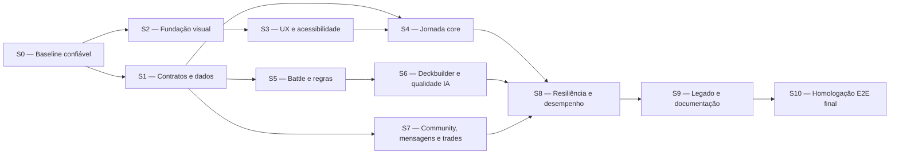

# Sprints canônicas de conclusão do produto ManaLoom

**Estado:** `ACTIVE / EXECUTION_REQUIRED`

**Atualizado em:** 2026-07-22

**Escopo:** produto Web + Android da beta gratuita; iOS somente quando entrar no
alvo declarado

**Autoridade:** este arquivo organiza a execução. O significado de `PASS`,
`PARTIAL`, `BLOCKED`, escrita live e conclusão continua definido por
`docs/MANALOOM_E2E_RELEASE_CONTRACT.md`.

O estado operacional, owners, arquivos pretendidos, gates e links de evidência
de cada task ficam em `docs/MANALOOM_PRODUCT_COMPLETION_TRACKER.md`.

## 1. Resultado que este plano precisa produzir

Concluir o ManaLoom como produto, não apenas como pacote de Store:

```text
descobrir/importar cartas
  -> criar e validar deck
  -> analisar e otimizar com diff seguro
  -> simular Battle e consultar replay
  -> jogar no Life Counter
  -> registrar o pós-jogo
  -> aprender sem perder dados ou inventar evidência
```

O plano termina somente quando lógica, funcionalidade, dados, segurança,
design, acessibilidade, desempenho e jornadas E2E da mesma revisão estiverem
provados. Um relatório histórico, build, teste isolado ou screenshot isolado
não fecha uma tarefa atual.

## 2. Estado inicial que não pode ser omitido

- o checkout observado em 2026-07-21 está dirty no SHA
  `2813152121c4d41069f9ebbb3334eb4c6b8b1110`;
- a rodada E2E mais recente terminou `8 PASS / 2 FAIL / 9 SKIP`;
- `full` e a suíte Flutter completa foram interrompidos por `errno 28`;
- `report-retention` encontrou 18 artefatos locais não governados;
- Battle, Deckbuilder e Life Counter têm bons gates locais, mas isso não prova
  o produto inteiro;
- os 16 testes do gate Lorehold provam o mecanismo sintético; o gate real segue
  `BLOCKED` e `promotion_allowed=false`;
- migrations 038–040, sync em dois clientes e jornada autenticada publicada
  continuam sem prova da revisão candidata;
- a auditoria automatizada de UI não substitui regressão visual autenticada de
  todas as telas;
- Scanner/OCR, Community/UGC e iOS precisam de decisão explícita de escopo.

## 3. Regras obrigatórias para qualquer pessoa ou agente

1. Ler, nesta ordem:
   - este plano;
   - `docs/CONTEXTO_PRODUTO_ATUAL.md`;
   - `docs/MANALOOM_E2E_RELEASE_CONTRACT.md`;
   - `app/doc/UI_TEST_SURFACE_MAP.md`;
   - o contrato específico do domínio alterado.
2. Trabalhar em uma única task ID por vez e declarar arquivos pretendidos antes
   de editar.
3. Não misturar checkout compartilhado com execução E2E. Durante um gate
   integrado, nenhum outro agente pode editar ou formatar o worktree.
4. Nunca apagar, reverter ou formatar mudança preexistente sem identificar o
   proprietário e o consumidor.
5. Rodar primeiro testes focados, depois o gate da sprint e somente então os
   gates integrados.
6. Um retry só é válido quando registra a primeira falha e demonstra a causa;
   retry silencioso não transforma flakiness em `PASS`.
7. `SKIP` não é `PASS`. Todo skip informa pré-requisito, motivo, owner e comando
   de ativação.
8. Nenhuma task muda para `PASS` sem evidência fresca do SHA atual.
9. PostgreSQL/backend é verdade de produto. Hermes/SQLite é cache,
   laboratório ou evidência.
10. Nenhuma escrita live, migration, cleanup de dados ou promoção de deck pode
    usar somente a autorização genérica do projeto. Deve seguir os tokens de
    confirmação e prechecks do contrato E2E para a execução específica.
11. Nenhuma carta/regra é promovida por nome de família genérico. Runtime
    executável exige adapter correspondente, testes focados e postcheck.
12. Resultado agregado de Battle não prova uma carta. A carta alterada precisa
    de exposição natural tipada ou teste focado positivo/negativo.
13. Não afirmar que a IA encontrou o “melhor deck” sem fechar legalidade,
    intenção, estrutura, estratégia, comparação pareada e replay/exposição.
14. Arte visual nova deve seguir a tese da seção 6; Brass identifica ação ou
    estado importante, não decoração.
15. Evidência bruta fica em `/tmp`. Somente resumo sanitizado, revisado e
    manifestado entra em `docs/`.
16. Exit code zero do E2E não basta: `PARTIAL` também retorna zero. Baseline
    local inventaria skips; fechamento exige `summary.json` com `result=pass` e
    failed/blocked/skipped iguais a zero.
17. `report-retention` roda no baseline e novamente depois de todos os
    produtores de Battle, Deep AI, Lorehold e E2E.

## 4. Estados, prioridade e Definition of Done

Estados permitidos:

- `TODO`: não iniciada;
- `READY`: dependências de entrada satisfeitas e sem owner ativo;
- `IMPLEMENTED_UNPROVEN`: há código/teste parcial, mas falta a evidência atual
  exigida; continua aberta e não desbloqueia dependências;
- `IN_PROGRESS`: um owner ativo e arquivos declarados;
- `BLOCKED`: existe dependência objetiva registrada;
- `PASS`: implementação, teste, integração e evidência concluídos;
- `DEFERRED_BY_SCOPE`: removida do alvo e inacessível no artefato candidato;
- `FAILED`: gate executado e vermelho.

Prioridades:

- `P0`: impede conclusão ou precisa ser removida do escopo;
- `P1`: impede qualidade ampla, confiança ou promoção definitiva;
- `P2`: refinamento posterior sem quebrar a promessa atual.

Uma task está `PASS` apenas quando:

- critérios funcionais e negativos foram testados;
- loading, empty, error, retry e offline foram tratados quando aplicáveis;
- contrato app/backend e persistência estão coerentes;
- acessibilidade, responsividade e localização foram verificadas quando há UI;
- teste focado e gate da área têm exit code zero;
- não surgiu regressão em consumidor adjacente;
- evidência contém SHA, ambiente, comando, resultado e cleanup;
- documentação canônica foi atualizada sem transformar hipótese em fato.

Cada evidência de task deve registrar:

```text
task_id, sprint, sha, branch, timestamp_utc, owner
arquivos_alterados, comandos, exit_codes, passed/failed/skipped
ambiente, banco/migration, screenshots, riscos_residuais
dados_criados, cleanup_status, rollback, decisão PASS/BLOCKED
```

## 5. Dependências e ordem de execução



S1 e S2 podem avançar em paralelo depois de S0. S5 e S7 podem avançar em
paralelo depois de S1. S6 não começa antes do runtime Battle estar confiável.
S10 é estritamente serial e congela edições no checkout durante todos os gates.

### Tracker executivo inicial

Na criação deste plano, nenhuma sprint recebeu crédito herdado. O owner deve
atualizar esta tabela e anexar a evidência de cada task ao iniciar e ao encerrar
uma sprint.

| Sprint | Estado inicial | Entrada obrigatória | Saída obrigatória |
|---|---|---|---|
| S0 | `READY` | autorização para organizar o checkout sem descartar mudanças | baseline reproduzível e aggregate sem falha |
| S1 | `TODO` | S0 `PASS` | contratos/dados/sessão íntegros |
| S2 | `TODO` | S0 `PASS` | padrão visual e imagens consistentes |
| S3 | `TODO` | S2 `PASS` | telas, viewports e acessibilidade aprovados |
| S4 | `TODO` | S1 + S3 `PASS` | jornada core integrada |
| S5 | `PASS` | S1 `PASS` | Battle/replay/regras executáveis confiáveis; evidência em `docs/qa/MANALOOM_SPRINT5_BATTLE_EVIDENCE_2026-07-22.md` |
| S6 | `PASS` | S5 `PASS` | Deckbuilder seguro; candidato Lorehold rejeitado, baseline 607 protegido; evidência em `docs/qa/MANALOOM_SPRINT6_DECKBUILDER_EVIDENCE_2026-07-22.md` |
| S7 | `TODO` | S1 `PASS` | social seguro ou removido do escopo |
| S8 | `TODO` | S4 + S6 + S7 decididos | resiliência/desempenho/recuperação aprovados |
| S9 | `TODO` | código funcional estabilizado | legado/documentação governados |
| S10 | `TODO` | S0–S9 sem P0 aberto | decisão GO/NO-GO da mesma SHA |

## 6. Tese visual obrigatória

**Tese visual:** uma mesa de jogo premium, calma e legível: superfícies
Obsidian/Frost, arte das cartas como informação e Brass somente para ação ou
estado decisivo.

**Plano de conteúdo:** orientação e ação principal primeiro; estado e prova em
seguida; detalhes progressivos sob demanda; nenhuma tela vira mosaico de cards
decorativos.

**Tese de interação:** transições curtas para mudança de contexto, feedback
claro de carregamento/aplicação e movimento reduzido quando o sistema pedir.
Animação nunca pode esconder estado, atrasar tarefa ou competir com a carta.

Regras mensuráveis:

- duas famílias tipográficas no máximo e uma escala única de spacing;
- alvo interativo mínimo de 48 × 48 px;
- uma ação primária visual por região;
- carta completa usa proporção 63:88; arte/capa usa recorte explicitamente
  definido e consistente, nunca `BoxFit` acidental;
- conteúdo desktop usa largura de leitura e gutters definidos; não estica uma
  carta até ocupar toda a viewport;
- texto deve sobreviver a 200% sem perda de ação ou dado;
- símbolos de mana usam o asset oficial interno/permitido com label semântico;
  letras soltas são somente fallback acessível, nunca apresentação principal;
- estados loading, empty, error, offline e retry têm o mesmo sistema visual;
- imagens possuem placeholder, erro, cache e posição focal determinísticos.

## 7. Sprints e tasks

### Sprint 0 — Recuperar uma baseline confiável

**Objetivo:** remover bloqueios do host, reconciliar o checkout e produzir uma
linha de base reproduzível antes de implementar funcionalidades.

| ID | Pri | Task | Critério de aceite e evidência |
|---|---:|---|---|
| S0-01 | P0 | Liberar capacidade segura do host | Espaço livre suficiente para duas execuções completas consecutivas; caches só são removidos após inventário; `df -h` registrado antes/depois. |
| S0-02 | P0 | Reconciliar worktree e owners | Cada arquivo dirty é atribuído a uma task/owner; nenhuma mudança desconhecida é descartada; diff base e SHA registrados. |
| S0-03 | P0 | Corrigir o status documental atual | Lorehold: “16/16 testes do mecanismo PASS, gate real BLOCKED”; auth: escopo correto de `/auth/me`; trade matches: shape documentado igual ao runtime. Guards dedicados passam. |
| S0-04 | P0 | Governar os 18 outputs de reports | Cada arquivo classificado como `active_consumer`, `manifest_only` ou removível com prova; `report-retention` passa. |
| S0-05 | P0 | Diagnosticar a queda do analysis server no aggregate | Causa reproduzida ou isolada; falha real continua vermelha; retry, se necessário, registra primeira tentativa; Battle passa dentro da ordem completa duas vezes. |
| S0-06 | P0 | Reexecutar baseline determinística | `full`, `deps`, `custom-lint`, `ui-audit`, `patrol-smoke`, `battle`, `server-target`, `report-retention` e `e2e` sem `FAIL/BLOCKED`; skips somente opt-in documentados. |
| S0-07 | P0 | Congelar o baseline de trabalho | SHA, SDK pinado, hashes dos resumos e inventário de skips registrados; nenhum “PASS” herdado de julho anterior. |

**Gate de saída S0:** zero falha no aggregate solicitado, zero artefato
`ungoverned`, Flutter `3.44.6`/Dart `3.12.2` e checkout controlado.

### Sprint 1 — Contratos, sessão e integridade de dados

**Objetivo:** fazer app, API e PostgreSQL concordarem em todos os estados
persistentes antes de ampliar UI e inteligência.

| ID | Pri | Task | Critério de aceite e evidência |
|---|---:|---|---|
| S1-01 | P0 | Fechar shapes app/backend | Testes de schema cobrem sucesso, vazio, inexistente, forbidden e erro para decks, cards, Battle replay, trade matches, comentários, reports, mensagens e privacidade; `deck_id`/`match_count` não divergem. |
| S1-02 | P0 | Fechar sessão e rate limit | `/auth/me` preserva sessão em 429/5xx/timeout/rede e encerra em 401; armazenamento local inválido tem comportamento e copy explícitos; buckets de login/register permanecem protegidos. |
| S1-03 | P0 | Provar migrations 038–040 isoladamente | Fresh schema, upgrade de clone anterior, reaplicação/idempotência, rollback e postcheck passam em PostgreSQL descartável. Nenhum apply live nesta task. |
| S1-04 | P0 | Provar sync e tombstones em dois clientes | `playSessionId`, notas, revisão, cursor, conflito, retry e exclusão não ressuscitam após reconexão; matriz server/local documentada por entidade. |
| S1-05 | P0 | Provar exportação e exclusão de conta | Export autenticado contém dados esperados; exclusão exige confirmação/senha, invalida sessão somente após sucesso e impede novo login; falha preserva conta/sessão. |
| S1-06 | P0 | Eliminar fanout e drift de identidade | Consumidores usam `card_intelligence_snapshot` ou agregam por `card_id`; aliases usam `card_identity_bridge`; contagens de `deck_cards` não multiplicam com tags/regras. |
| S1-07 | P1 | Definir dados possuídos, alocados, livres e faltantes | Uma semântica e contrato únicos alimentam Coleção, Deckbuilder e Trade; quantidades concorrentes e múltiplos decks têm testes. |
| S1-08 | P0 | Fechar recuperação e proteção da conta | Esqueci/troca de senha, token expirado/reutilizado, rate limit e revogação de sessões têm contrato e E2E; se UGC continuar, e-mail verificado ou proteção equivalente é gate explícito. |
| S1-09 | P0 | Tornar legal e consentimento acessíveis no ciclo de conta | Termos/privacidade podem ser consultados antes do login; cadastro registra versão/aceite quando exigido; falha não cria conta parcialmente nem prende o usuário em rota protegida. |

**Gate de saída S1:** testes focados app/server, migrations isoladas,
`pg-contract`, `server-target`, `full` e E2E determinístico da camada sem falhas.

### Sprint 2 — Fundação visual, imagens e símbolos

**Objetivo:** eliminar inconsistências sistêmicas antes de ajustar tela por tela.

| ID | Pri | Task | Critério de aceite e evidência |
|---|---:|---|---|
| S2-01 | P0 | Congelar tokens e padrões responsivos | Spacing, gutters, raios, tipografia, largura de leitura, breakpoints, cores e elevação têm fonte única; valores crus são inventariados/justificados; limites 599/600, 839/840, 1199/1200 e 1599/1600 têm testes. |
| S2-02 | P0 | Criar padrão único de carta e arte | Componentes distinguem `Gallery`, `Spotlight`, `RecentDeck`, `FullCard`, `ArtCrop` e `SetArt`; cada uso declara aspect ratio, `BoxFit`, alignment, clip, focal point, face dupla/split, alt text e fallback estável. |
| S2-03 | P0 | Corrigir detalhe de carta | Desktop usa largura máxima mensurável, carta 63:88 sem crop e metadados iniciais visíveis; mobile não tem overflow; fixtures cobrem imagem controlada, 404, ausente, dupla face, título/Oracle longos e 390/800/1440/1920. |
| S2-04 | P0 | Normalizar imagens dos decks | Lista e recentes usam variantes coerentes sem impor composição idêntica; nenhuma arte estica, corta por acaso ou invade texto; cinco origens de URL, nula/malformada/CDN desconhecida e double-faced têm golden. |
| S2-05 | P0 | Corrigir Home/Planeswalker | Bordas/clipping coincidem; focal point é aprovado em 320/390/768/1200/1440/1920; padding e texto 200% passam; animação respeita reduced motion. |
| S2-06 | P0 | Substituir letras por símbolos de mana | Componente e guard global cobrem W/U/B/R/G/C, genérico, híbrido, Phyrexian, snow, tap, energy e números; assets/pubspec e ordem semântica passam; símbolo suportado ausente falha no CI. |
| S2-07 | P1 | Dar representação visual às coleções | 100% dos sets resolvem para arte elegível ou ícone oficial; set futuro/sem carta usa ícone, e placeholder genérico só em falha terminal; retry/expiração de falha evitam cache negativo eterno. |
| S2-08 | P0 | Fechar QA de imagens | CI usa fixtures/pixel diff e smoke real usa rede/cache/404/lentidão; goldens P0 390×844, 1440×900 e 1920×1080; geometria 320, 412, boundaries, landscape e DPR 1/2/3; evidência registra SHA/renderer/fontes/dataset. |
| S2-09 | P0 | Identificar o artefato Web testado | Build `/app` registra SHA, hash do bundle, Flutter/renderer, DPR, viewport e dataset; harness rejeita bundle antigo salvo override explícito e documentado. |

**Gate de saída S2:** testes focados de Home, decks, card detail e sets,
goldens revisados conscientemente e `ui-audit` verde.

### Sprint 3 — UX tela a tela, responsividade e acessibilidade

**Objetivo:** provar cada superfície e cada estado, não apenas componentes
isolados.

| ID | Pri | Task | Critério de aceite e evidência |
|---|---:|---|---|
| S3-01 | P0 | Inventariar todas as superfícies | Rotas, tabs, sheets, dialogs, menus, transientes e `MaterialPageRoute` declaram job, owner, source of truth, estados, stable key, criticidade, ação/sucesso/recuperação e deep link. |
| S3-02 | P0 | Validar todos os estados | Loading, skeleton/progresso, partial, stale, loading-more, saving, optimistic, disabled, empty, erro, retry, offline, sessão expirada, permissão negada e sucesso têm apresentação/copy/a11y; erro preserva entrada e nunca expõe exception crua. |
| S3-03 | P0 | Fechar responsividade | Matriz inclui 320×568, 390×844, 412×915, 768×1024, 1024×768 landscape, boundaries, 1280×900, 1440×900 e 1920×1080, teclado virtual e texto 200%; nenhuma ação/conteúdo fica inacessível. |
| S3-04 | P0 | Fechar acessibilidade móvel | TalkBack/VoiceOver manual + semantics automático, ordem/labels/estado/busy/error/live-region, alvo 48 px, texto 200%, contraste WCAG AA 4.5:1 normal e 3:1 grande/controle; cor não é único indicador. |
| S3-05 | P0 | Fechar acessibilidade Web | Tab/Shift+Tab, Enter/Space/Escape, foco visível, trap/restoration de modal, browser back e reduced motion passam por automação e roteiro manual. |
| S3-06 | P0 | Fechar navegação e retomada | Query-tabs, deep links autenticados, back/forward, refresh `/app/#/...`, sessão expirada e formulário não salvo preservam contexto; Card Detail e Battle/Replays têm decisão de rota canônica. |
| S3-07 | P0 | Produzir regressão visual autenticada | Fixture seedada evita cadastro por run; build `/app` real em Web desktop/mobile e Android captura rotas P0 acima/abaixo da dobra, modais e sucesso/vazio/erro; pixel diff + aprovação humana, console limpo e teste ligado a cada print original. |
| S3-08 | P0 | Fechar onboarding e primeiro uso | Primeiro login, concluído/pulado, persistência falha/offline, retomada, logout/login, deep link, teclado/texto 200% e analytics idempotente têm comportamento único; telemetria não é source of truth. |

**Gate de saída S3:** `ui-audit`, suíte responsiva/acessibilidade e harness
visual autenticado verdes; checklist tela a tela 100% decidido.

### Sprint 4 — Jornada core Decks, Coleção, mesa e pós-jogo

**Objetivo:** fazer o ciclo de valor funcionar sem perda de contexto ou dados.

| ID | Pri | Task | Critério de aceite e evidência |
|---|---:|---|---|
| S4-01 | P0 | Criar/importar/editar/remover deck com segurança | Sucesso e falha atômicos; draft incompleto é explícito; quantidade, comandante, formato e singleton permanecem coerentes. |
| S4-02 | P0 | Fechar estados de validação | `unknown`, `draft`, `validated`, motivos e timestamp aparecem corretamente; qualquer mudança relevante invalida a validação anterior. |
| S4-03 | P0 | Fechar analyze/optimize/apply/rollback | Preview mostra diff, origem, função, risco e impacto; cancelar não muta; falha parcial converge; pós-apply revalida e rollback é possível. |
| S4-04 | P0 | Fechar jobs longos da IA | Progresso, cancelamento, timeout, retry idempotente e retomada após sair da tela; nenhuma espera de ~100 s sem estado acionável. |
| S4-05 | P0 | Integrar coleção ao deck | Possuo/livre/alocado/falta é consistente; impressão, idioma, foil e condição não alteram identidade jogável indevidamente. |
| S4-06 | P0 | Fechar deck → mesa → pós-jogo | Deck e versão entram na sessão; saída sem atividade não cria pós-jogo falso; atividade cria contexto; nota offline sincroniza sem duplicar. |
| S4-07 | P0 | Decidir Scanner/OCR | Ou feature é removida do alvo, permissões/dependências/rotas são coerentes e busca manual assume o fluxo; ou scanner passa prova física completa. Flag escondendo tela sozinha não fecha a task. |
| S4-08 | P1 | Fechar preço, moeda e dados ausentes | Sem-preço não vira zero; moeda/data/localização consistentes; refresh, cache e proveniência visível não bloqueiam o uso do deck. |
| S4-09 | P0 | Fechar Home como fluxo funcional | Loading, empty, erro, offline, sessão expirada, decks recentes e todos os atalhos têm dados reais, retry e destinos corretos; o hero visual não mascara falha de conteúdo. |

**Gate de saída S4:** core Flutter focado, `ai-bridge`, `patrol-smoke`,
`full` e jornada local autenticada completa sem falhas.

### Sprint 5 — Battle, replays, famílias e regras executáveis

**Objetivo:** provar que a simulação executa regras suportadas de forma
reproduzível e honesta.

| ID | Pri | Task | Critério de aceite e evidência |
|---|---:|---|---|
| S5-01 | P0 | Revalidar alinhamento canônico | Auditorias XMage, Deckbuilder e superfície operacional passam no SHA atual; docs/scripts não reativam builders históricos. |
| S5-02 | P0 | Inventariar cobertura por carta/família | Cartas alvo usam hierarquia XMage exato → Forge para gap estruturado → native para residual verificado; execução externa não cria linha PG; nenhuma cobertura é inferida por nome/Oracle parecido. |
| S5-03 | P0 | Fechar gaps executáveis dos decks alvo | Adapter nativo só é P0 para residual alvo sem execução externa adequada; promoção exige `logical_rule_key`, `oracle_hash`, teste positivo/negativo, precheck, rollback e postcheck; dívida native geral fica P1 e registry `shadow_only`. |
| S5-04 | P0 | Fechar determinismo e falhas de engine | Resultado registra `engine_source`, versão/commit, sidecar/build/process ID, seed, timeout/censoring e motivo de fallback; fallback é distinto da execução primária e timeout nunca vira resultado silencioso. |
| S5-05 | P0 | Fechar persistência e autorização de replay | POST, lista e detalhe usam o mesmo ID; falha de persistência falha fechado; dono indevido não lê; erro 500 é sanitizado. |
| S5-06 | P0 | Exigir evidência da carta alterada | Promoção exige evento positivo tipado ou teste focado positivo/negativo; ausência continua `unknown`; forced access é diagnóstico e nunca promoção. |
| S5-07 | P1 | Fechar priorização da fila de regras | Prioridade combina decks de produto, uso real, impacto e residual; user skeletons não são apagados/preenchidos; PostgreSQL continua canônico. |
| S5-08 | P0 | Executar gate Battle estático | `quality_gate.sh battle` passa duas vezes na mesma SHA, separado de qualquer E2E guardado ou claim semântico por carta. |
| S5-09 | P0 | Executar Battle isolado guardado | `manaloom_battle_product_gate.sh --isolated-e2e` usa identidade única, PostgreSQL descartável/guardado, replays duráveis, autorização negativa, cleanup e zero listener/processo órfão. |
| S5-10 | P1 | Auditar delta dos engines | `quality_gate.sh engine-delta` revisa upstream/pins em modo read-only; nenhuma atualização de pin ou promoção ocorre automaticamente. |

**Gate de saída S5:** Battle estático 2×, auditorias canônicas, engine delta e
Battle isolado guardado passam; persistência/autorização/replay têm cleanup e o
aggregate não contém falha ou promoção indevida.

### Sprint 6 — Deckbuilder e qualidade real da IA

**Objetivo:** separar deck legal, deck estruturalmente pronto e deck realmente
melhor.

| ID | Pri | Task | Critério de aceite e evidência |
|---|---:|---|---|
| S6-01 | P0 | Implementar/expor o planejamento completo | Diagnóstico cobre legalidade/bracket, intenção, win plans, mana/curva, card flow, interação, proteção, packages, combos, fontes, staples, same-lane cuts e iteração; metadado Hermes bruto nunca chega ao usuário. |
| S6-02 | P0 | Fechar proveniência e confiança | Oracle verificado, preço, popularidade, corpus, learned usage e sugestão de IA são distintos e sanitizados; fonte ausente reduz confiança, não inventa certeza ou expõe campos de laboratório. |
| S6-03 | P0 | Provar estrutura global Commander | Todos os decks de produto são classificados; decks incompletos preservam owner intent; core floors são diagnósticos e não autorização automática de rebuild. |
| S6-04 | P0 | Proteger anchors e cuts por lane | Adição compete com o mesmo papel ou carrega hipótese explícita; staples/engines usados não são cortados sem substituição de lane ou gate pareado. |
| S6-05 | P0 | Fechar geração/otimização com coleção e orçamento | Restrições são hard; lista permanece 100/legal; preço ausente aparece; aplicação parcial recalcula `post_analysis` somente dos swaps aceitos e revalida, sem descrever o preview integral. |
| S6-06 | P0 | Resolver o gate real Lorehold | A matriz histórica de 384 pares permanece `BLOCKED` e não é prova pareada porque XMage não controla o RNG por seed; saída válida é rejeitar candidato/manter 607 ou criar hipótese same-lane nova e reiniciar hashes, exposição e estatística com amostras independentes balanceadas, censura explícita e desenho compatível com a semântica do engine; relatório sempre traz `next_gate`. |
| S6-07 | P0 | Preservar baseline em bloqueio | Enquanto S6-06 não passar, deck 607 permanece protegido, nenhum candidato é aplicado automaticamente e UI/docs dizem “experimental/bloqueado”, não “melhor definitivo”. |
| S6-08 | P1 | Medir qualidade e latência global | Corpus held-out por cores, arquétipos e brackets, além de Lorehold, mede eval, goldfish/curva, validação, no-op, erro, p50/p95, cancelamento e custo por intensidade. |
| S6-09 | P0 | Executar E2E com provedor real | `generate → validate → save → analyze → optimize/rebuild → preview → apply parcial/total → revalidate → Battle/replay → rollback → cleanup`; chave ausente/inválida, 429, timeout, 5xx e mock produzem `can_apply=false`, zero promoção/aprendizado indevido. |

O gate Lorehold existente teve agregado candidato 138/384 contra baseline 95/384
e exposição natural registrada, mas continua bloqueado por timeouts e regressão
específica contra Lumra. Resultado agregado positivo não autoriza repetir a
mesma hipótese “até passar”; rejeitar ou formular um candidato novo são as
únicas continuações válidas.

**Gate de saída S6:** `ai-eval`, `ai-bridge`, testes do contrato Commander e
auditorias locais passam; `resolution`/`deep-ai` são gates PostgreSQL guardados
e entram somente após autorização específica. O status “IA definitiva” exige
novo candidato aprovado pelo gate descrito em S6-06; beta segura pode avançar
com rejeição explícita do candidato, S6-07 `PASS` e rótulo experimental.

### Sprint 7 — Community, mensagens, trades e segurança do usuário

**Objetivo:** permitir interação social somente com controles mínimos de
segurança, privacidade e consistência.

| ID | Pri | Task | Critério de aceite e evidência |
|---|---:|---|---|
| S7-01 | P0 | Reportar todas as superfícies UGC | Deck, comentário, perfil e mensagem têm denúncia acessível, motivo, confirmação, rate limit e prevenção de duplicata/abuso. |
| S7-02 | P0 | Bloquear usuário | Bloqueio corta feed, perfil interativo, mensagens/notificações e novas trades nos dois sentidos; desbloqueio é explícito e auditável. |
| S7-03 | P0 | Criar fluxo operacional de moderação | Fila, estado, evidência mínima, ação, SLA, auditoria e apelação definidos; conteúdo removido não reaparece por cache. |
| S7-04 | P0 | Fechar privacidade de conteúdo | Público/privado, binder, decks, localização e dados de contato usam allowlist; usuário B não acessa recursos privados do usuário A. |
| S7-05 | P0 | Fechar mensagens e notificações | Envio/erro/retry/idempotência, unread, poll/realtime, foreground/background e deep link têm provas; falha nunca perde rascunho silenciosamente. |
| S7-06 | P0 | Fechar máquina de estados de trade | Transições bilaterais e concorrentes são atômicas/autorizadas; resposta tem shape único; disponibilidade não duplica; aviso P2P aparece em criação e detalhe. |
| S7-07 | P1 | Fechar feed/follow/comentários | Paginação, refresh, exclusão, bloqueio, ordenação e empty/error têm contratos; nenhuma falha aparece como “sem conteúdo”. |
| S7-08 | P0 | Definir fallback de escopo | Se S7-01 a S7-06 não fecharem, Community/chat/trades ficam inacessíveis no artefato alvo e não são anunciados. Não basta esconder um botão isolado. |

**Gate de saída S7:** testes app/server de ownership, concorrência e shapes,
E2E com dois usuários, cleanup comprovado e decisão `PASS` ou
`DEFERRED_BY_SCOPE` para o conjunto inteiro.

### Sprint 8 — Resiliência, desempenho, segurança e observabilidade

**Objetivo:** provar que o produto continua utilizável fora do caminho feliz.

| ID | Pri | Task | Critério de aceite e evidência |
|---|---:|---|---|
| S8-01 | P0 | Matriz offline/reconexão | Todas as entidades mutáveis declaram cache, fila, retry, conflito e reconciliação; app não perde edição/nota/deck em queda de rede. |
| S8-02 | P0 | Orçamento de desempenho do core | Cold/warm start, home, listas, busca, detalhe, deck, optimize e Battle têm p50/p95 e limite aprovado em device alvo e Web. |
| S8-03 | P0 | Fechar memória e imagens | Scroll de decks/coleção não cresce sem limite; cache tem eviction; imagens grandes não decodificam em resolução desnecessária; falha mantém layout. |
| S8-04 | P0 | Fechar IA longa e cancelamento | Timeout total, heartbeat/progresso, cancelamento e retry idempotente; provider externo indisponível falha fechado e não retorna mock como sucesso. |
| S8-05 | P0 | Fechar observabilidade acionável | Sentry da mesma SHA, request ID app→API→erro, redaction de PII/secrets, health/readiness e alertas básicos provados. |
| S8-06 | P0 | Fechar notificações no alvo | FCM foreground, background e tap/deep link passam no artefato alvo; permissão é pedida no contexto de valor; token antigo é invalidado. |
| S8-07 | P0 | Fechar backup e recuperação | Backup fresco criptografado off-site, checksum, restore isolado e RPO/RTO registrados; rollback de migration/release executável. |
| S8-08 | P0 | Fechar segurança técnica | Dependências, SBOM/OSV, CORS, JWT, trusted proxies, rate limits, logs, secrets e permissões passam; token antigo é rejeitado. |
| S8-09 | P0 | Definir contrato offline honesto | Cada fluxo declara `offline_supported`, `cached_read_only` ou `online_required`; somente entidades com fila/reconciliação real são chamadas de offline; UI bloqueia/explica o restante sem perder entrada local. |

**Gate de saída S8:** carga/performance, falhas injetadas, observabilidade,
backup/restore, `deps`, `server-target`, segurança e `full` verdes.

### Sprint 9 — Organização, legado e documentação canônica

**Objetivo:** reduzir ruído sem remover evidência ou consumidor ativo.

| ID | Pri | Task | Critério de aceite e evidência |
|---|---:|---|---|
| S9-01 | P0 | Criar mapa keep/merge/archive/remove | Cada candidato tem consumidores, referências, substituto, hash, owner e retenção; nenhuma decisão usa somente idade/nome. |
| S9-02 | P0 | Consolidar status e backlogs | Um status corrente e este plano ficam canônicos; backlogs datados viram histórico; afirmações de deploy/PASS não se contradizem. |
| S9-03 | P0 | Enxugar contratos gigantes sem perder norma | Norma Commander/XMage permanece canônica; diário de pacotes/evidências é indexado/arquivado; links e auditores continuam válidos. |
| S9-04 | P0 | Remover código/rotas realmente mortos | `rg`, grafo de rotas/imports, testes e deep links provam zero consumidor; substituto existe; gates antes/depois verdes. `/market` compatível não é removido por engano. |
| S9-05 | P0 | Remover duplicatas e artefatos efêmeros | Duplicatas exatas, `.out`, `.diff`, caches, DBs temporários e logs só saem após a política; reports necessários mantêm manifest/rollback. |
| S9-06 | P0 | Atualizar documentação operacional | Produto, arquitetura, API/data map, testes, suporte e runbook apontam para código/rotas atuais; nenhum segredo ou autorização literal persistida. |

**Gate de saída S9:** `report-retention`, link/consumer audit, todos os gates
afetados e `git diff --check` verdes; redução de arquivos/tamanho registrada com
lista exata, sem limpeza em massa cega.

### Sprint 10 — Homologação E2E e assinatura de produto

**Objetivo:** executar a prova final da mesma SHA, sem edições concorrentes.

| ID | Pri | Task | Critério de aceite e evidência |
|---|---:|---|---|
| S10-01 | P0 | Congelar escopo e identidade | Plataforma, Scanner, Community, iOS e IA experimental/definitiva decididos; checkout limpo; versão e SHA únicas; nenhuma edição durante o run. |
| S10-02 | P0 | Rodar gates determinísticos pré-banco | `full`, `deps`, `custom-lint`, `ui-audit`, `patrol-smoke`, `ai-eval`, `ai-bridge`, `server-target`, `report-retention`, `battle`, `engine-delta`, `web` e E2E determinístico sem falha; `PARTIAL` só com skips guardados exatos inventariados. |
| S10-03 | P0 | Aplicar banco somente com autoridade específica | Backup fresco, precheck, autorização literal, migrations 038–040 em ordem, postcheck e rollback prontos; mesma SHA de backend. |
| S10-04 | P0 | Rodar gates PostgreSQL guardados e E2E completo | Após postcheck: `pg-contract`, `deep-ai`, `resolution` preflight/mutante, Battle isolado e perfis E2E solicitados usam aprovações específicas; `summary.json` exige `result=pass`, failed/blocked/skipped=0. |
| S10-05 | P0 | Percorrer Web autenticada | Cadastro/login/recuperação, Home, decks, coleção, optimize, Battle/replay, Life Counter, pós-jogo, social em escopo, perfil, export/delete e logout em desktop/móvel. |
| S10-06 | P0 | Percorrer artefato Android exato | Instalação limpa e upgrade, login, retomada, lifecycle, offline, push, core de decks, Battle e Life Counter em aparelho físico representativo. |
| S10-07 | P0 | Repetir regressão visual e acessibilidade | Capturas aprovadas nos viewports/dispositivos, teclado/Web e leitor de tela/texto 200%; zero problema conhecido sem disposition. |
| S10-08 | P0 | Provar dados entre clientes | Coleção/deck/pós-jogo/sessão/tombstone/export/delete convergem em dois clientes e não deixam resíduo indevido. |
| S10-09 | P0 | Validar falhas e recuperação | Rede lenta/offline, 401/429/5xx, engine/IA indisponível, imagem 404, processo interrompido e retry não corrompem estado. |
| S10-10 | P0 | Limpar QA e auditar estado final | Identidades/dados/processos/listeners temporários são removidos; `report-retention` roda após todos os produtores; status/diff/SHA final coincidem com o congelado e o manifest registra riscos. |
| S10-11 | P0 | Emitir decisão GO/NO-GO de produto | GO somente com todos P0 `PASS` ou `DEFERRED_BY_SCOPE` comprovadamente inacessível; qualquer P0 aberto produz NO-GO com owner e próxima ação. |

## 8. Matriz obrigatória da jornada final

Cada linha deve passar em desktop Web, Web 390×844 e Android físico quando a
superfície pertence ao alvo. iOS entra somente se declarado em S10-01.

| Jornada | Caminho feliz | Caminhos negativos mínimos |
|---|---|---|
| Conta | cadastro → login → retomar destino → logout | senha inválida, 401, 429, 5xx, timeout, sessão local inconsistente |
| Deck | criar/importar → editar → validar | duplicata, off-color, 99/101, falha atômica, retry |
| IA | analyze → optimize → preview → apply → validate | no-op, needs-repair, timeout, cancelar, provider indisponível, rollback |
| Coleção | buscar → detalhe → set → binder → alocar | sem imagem/preço, vazio, offline, impressão/idioma/foil |
| Battle | selecionar oponente → simular → replay | timeout, persistência falha, engine indisponível, acesso negado |
| Mesa | abrir deck → alterar vida/estado → fechar/reabrir | saída sem atividade, reload, storage falha, 2/4/6 jogadores |
| Pós-jogo | salvar offline → sincronizar → revisar/excluir | conflito, retry, cursor, tombstone, dois clientes |
| Social | publicar/comentar/reportar/bloquear | conteúdo privado, usuário B, duplicata, rate limit, abuso |
| Trade | criar → aceitar/rejeitar/cancelar | concorrência bilateral, carta indisponível, forbidden, idempotência |
| Perfil | editar → exportar → excluir | senha incorreta, backend falha, export parcial, login após delete |

## 9. Comandos canônicos de fechamento

Executar com o SDK pinado e registrar stdout/stderr/exit code. Não copiar tokens
ou segredos para a evidência. Os comandos abaixo não pertencem todos à mesma
classe de autoridade.

### Determinísticos ou externos read-only

```bash
git diff --check
./scripts/quality_gate.sh full
./scripts/quality_gate.sh deps
./scripts/quality_gate.sh custom-lint
./scripts/quality_gate.sh ui-audit
./scripts/quality_gate.sh patrol-smoke
./scripts/quality_gate.sh ai-eval
./scripts/quality_gate.sh ai-bridge
./scripts/quality_gate.sh server-target
./scripts/quality_gate.sh report-retention
./scripts/quality_gate.sh battle
./scripts/quality_gate.sh engine-capabilities
./scripts/quality_gate.sh engine-delta
./scripts/quality_gate.sh web
./scripts/quality_gate.sh e2e
```

`full` já inclui Web pública; `ai-bridge` já inclui partes de `ai-eval` e
`server-target`. A repetição individual é intencional para preservar evidência
por gate. No perfil determinístico, `e2e` pode terminar `PARTIAL` com exit zero;
o baseline só aceita skips guardados inventariados, nunca infere `PASS` pelo
exit code.

### PostgreSQL/mutação guardados

Executar somente após backup/precheck/migrations/postcheck e com a autorização
específica exigida pelo contrato:

```bash
./scripts/quality_gate.sh pg-contract
./scripts/quality_gate.sh deep-ai
VALIDATION_PREFLIGHT_ONLY=1 ./scripts/quality_gate.sh resolution
./scripts/quality_gate.sh resolution
./scripts/manaloom_battle_product_gate.sh --isolated-e2e
./scripts/quality_gate.sh e2e
```

Apesar do nome `VALIDATION_PREFLIGHT_ONLY`, o runner atual de `resolution`
exige as duas aprovações e usa `--write-approved`. O mesmo vale hoje para
`pg-contract` e `deep-ai`; até existir wrapper realmente read-only, tratá-los
como guardados.

No fechamento, localizar o `summary.json` emitido pelo E2E e validar o conteúdo,
não apenas o exit code:

```bash
jq -e '.result == "pass" and .summary.failed == 0 and .summary.blocked == 0 and .summary.skipped == 0' <summary.json>
```

As auditorias de Battle/Deckbuilder obrigatórias no SHA final são:

```bash
python3 docs/hermes-analysis/manaloom-knowledge/scripts/xmage_strategy_consistency_audit.py --output-prefix /tmp/xmage_strategy_final
python3 docs/hermes-analysis/manaloom-knowledge/scripts/deckbuilding_contract_surface_audit.py --out-prefix /tmp/deckbuilding_contract_final
python3 docs/hermes-analysis/manaloom-knowledge/scripts/operational_surface_alignment_audit.py --out-prefix /tmp/operational_surface_final
python3 docs/hermes-analysis/manaloom-knowledge/scripts/legacy_contamination_audit.py --out-prefix /tmp/legacy_contamination_final
```

O auditor PG/Hermes não deve ser chamado diretamente: usar o gate/wrapper
guardado canônico para garantir alvo, túnel e autoridade.

## 10. Critérios finais de conclusão

### Beta funcional segura

Pode receber GO quando:

- todos os P0 do escopo estão `PASS`;
- funcionalidades adiadas estão realmente inacessíveis e não pedem permissões
  ou prometem suporte;
- IA bloqueia promoção insegura e é identificada como experimental;
- nenhum gate solicitado tem `FAIL/BLOCKED`;
- todos os skips restantes pertencem a funcionalidade fora do escopo;
- jornada final e cleanup da mesma SHA passaram.

### Produto definitivo

Exige também:

- nenhum módulo principal depende de rótulo experimental;
- o gate real Lorehold e os gates Commander alvo passam com exposição natural;
- cobertura Battle dos decks alvo não possui residual silencioso;
- Community completa moderação/bloqueio/denúncia ou deixa de fazer parte do
  produto;
- todas as plataformas anunciadas passam runtime físico/publicado;
- métricas de desempenho, observabilidade e recuperação estão dentro dos
  limites aprovados.

### O que nunca autoriza “concluído”

- “buildou”;
- “passou isoladamente”;
- “o teste sintético passou”;
- “não falhou porque foi skip”;
- “funcionou na versão anterior”;
- “a tela parece boa em um único print”;
- “Hermes gerou o relatório”;
- “o candidato venceu no agregado sem exposição ou com batch censurado”.

## 11. Handoff para Store

Play Store/App Store começam somente depois do `GO` da Sprint 10. Metadados,
assinatura, políticas, screenshots de listing e submissão são outra trilha e
não podem ser usados para esconder P0 de produto.
