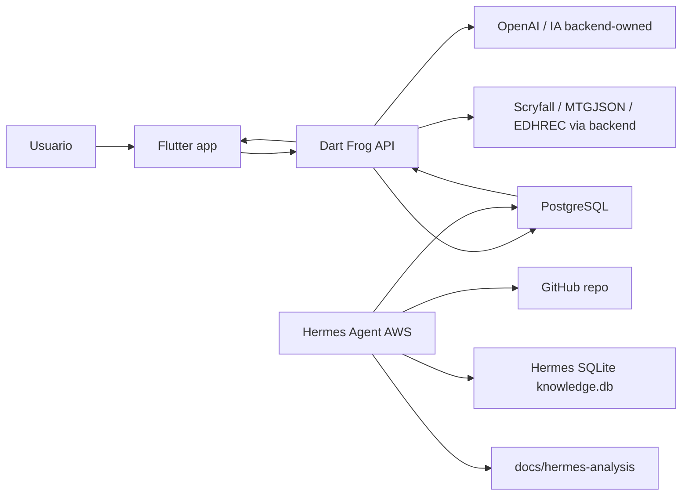

# ManaLoom Project Logic Full Report - 2026-06-11

> Relatorio canonico de arquitetura, logica de produto, banco, IA, Hermes,
> crons, regras e validacao do ManaLoom no estado atual do repositorio.
>
> Base local verificada: `master@b11456cf43c7aa5b8bfd2cd012816648afc64e78`.
> Este documento nao contem secrets, tokens, DSNs completos, JWTs ou connection
> strings. Quando houver conflito, validar contra o codigo vivo e contra
> `server/doc/API_CONTRACTS_AND_DATA_MAP.md`.

## 1. Visao geral do produto

ManaLoom e um companion Commander-first para Magic: The Gathering. O produto
combina deckbuilding, importacao de listas, busca de cartas, analise de deck,
otimizacao por IA, aprendizado por uso real, colecao, marketplace, trades,
mensagens, notificacoes e life counter.

O pensamento central do projeto e:

- O app Flutter entrega experiencia premium, navegacao e feedback visual.
- O backend Dart Frog e a fonte de verdade para dados, validacao, regras,
  contratos, IA e integracoes externas.
- O PostgreSQL guarda usuario, cartas, decks, colecao, trades, mensagens,
  tags semanticas, regras, telemetria e aprendizado.
- O Hermes Agent e uma camada residente de auditoria/aprendizado temporaria,
  conectada ao projeto por docs, crons, SQLite e sincronizacoes com PostgreSQL.
- Nenhum fluxo mobile deve depender diretamente de Scryfall, MTGJSON, EDHREC,
  OpenAI ou Hermes. O app consome somente a API ManaLoom.

### Escopo atual

| Area | Status | Papel |
|---|---|---|
| Deckbuilding Commander | Ativo | Criar, importar, validar, analisar, otimizar e salvar decks. |
| AI Generate/Optimize/Rebuild | Ativo/experimental | Geracao e otimizacao com validacao backend, cache, quality gate e fallback deterministico. |
| Commander learned decks | Ativo | Botao/app flow para usar decks aprendidos promovidos no backend. |
| Cards/Sets | Ativo | Busca, detalhes, printings, resolucao em lote, nomes localizados e catalogos. |
| Colecao/Binder | Ativo | Inventario do usuario, stats, wishlist/have, venda/troca. |
| Marketplace/Trades | Ativo | Propostas, status, timeline, mensagens e trust metrics. |
| Social/Community | Ativo | Perfis publicos, follows, decks publicos, feed. |
| Direct messages | Ativo | Conversas 1:1 com unread count e mark-read. |
| Notificacoes | Ativo | Lista, contador, read/read-all, triggers por follow/trade/message. |
| Life Counter | Ativo | Runtime de mesa e overlays nativos/Lotus. |
| Scanner/camera/OCR | Deferred | Codigo existe, mas nao e gate atual non-scanner. |

### Fontes principais consultadas

- `docs/CONTEXTO_PRODUTO_ATUAL.md`
- `docs/README.md`
- `server/manual-de-instrucao.md`
- `server/doc/API_CONTRACTS_AND_DATA_MAP.md`
- `app/doc/UI_TEST_SURFACE_MAP.md`
- `app/doc/APP_AUDIT_2026-04-29.md`
- `docs/hermes-analysis/PROJECT_MEMORY.md`
- `docs/hermes-analysis/TECHNICAL_MAP.md`
- `docs/hermes-analysis/IMPLEMENTATION_GAPS.md`
- `docs/hermes-analysis/PENDING_TASKS.md`
- `docs/hermes-analysis/BATTLE_SYSTEM_LOGIC.md`
- `docs/hermes-analysis/HERMES_CRON_VALUE_AND_MIGRATION_AUDIT_2026-06-11.md`
- `docs/hermes-analysis/HERMES_RUNTIME_CRON_ALIGNMENT_2026-06-11.md`
- `server/database_setup.sql`
- `server/bin/migrate.dart`
- `server/routes/**`
- `app/lib/features/**`
- `docs/hermes-analysis/manaloom-knowledge/scripts/**`

## 2. Arquitetura geral



### Camadas

| Camada | Local | Responsabilidade |
|---|---|---|
| App Flutter | `app/lib` | UX, estado local, providers, rotas, runtime visual, chamadas REST. |
| API Dart Frog | `server/routes`, `server/lib` | Auth, contratos, validacao, regras, IA, CRUD, sync, observabilidade. |
| Banco PostgreSQL | `server/database_setup.sql`, `server/bin/migrate.dart`, helpers `ensure*` | Fonte persistente app/backend. |
| Hermes Agent | `docs/hermes-analysis`, AWS `/opt/data` | Auditoria residente, crons, knowledge DB, reports, scorecards e aprendizado auxiliar. |
| Docs canonicas | `docs`, `server/doc`, `app/doc` | Historico, contratos, runbooks, handoffs, provas e matriz de riscos. |

### Deploy e health

Backend publico atual documentado:

- `https://evolution-cartinhas.8ktevp.easypanel.host`
- Rotas operacionais: `/health`, `/health/ready`, `/health/live`,
  `/health/metrics`, `/health/dashboard`.
- O `/health.git_sha` e usado como prova de deploy quando disponivel.

### Regra de propriedade

O app nunca deve ser fonte de verdade de regra MTG, legalidade, card database,
IA ou sincronizacao externa. O app envia intencao; o backend valida, resolve,
calcula e retorna payload app-facing.

## 3. Fluxo de inicializacao do app

### Entrada

O app inicia em `app/lib/main.dart`:

- `main()` chama `WidgetsFlutterBinding.ensureInitialized()`.
- `AppObservability.instance.bootstrap()` envolve o `runApp`.
- Firebase push/performance inicia depois do primeiro frame, com flags de
  desabilitacao por `dart-define`.
- `ManaLoomApp` cria providers principais e `GoRouter`.

### Flags importantes

| Flag | Uso |
|---|---|
| `API_BASE_URL` | URL principal da API. Em debug sem define usa fallback local; em release usa fallback publico. |
| `DISABLE_FIREBASE_STARTUP` | Desliga bootstrap Firebase em runtime/teste. |
| `DISABLE_PUSH_INIT` | Desliga inicializacao de push. |
| `DISABLE_FIREBASE_PERFORMANCE_INIT` | Desliga Firebase Performance. |
| `DEBUG_BOOT_INTO_LIFE_COUNTER` | Boot direto no life counter em debug. |

### Providers registrados

Em `MultiProvider`, o app registra:

- `AuthProvider`
- `DeckProvider`
- `CardProvider`
- `MarketProvider`
- `CommunityProvider`
- `SocialProvider`
- `BinderProvider`
- `TradeProvider`
- `MessageProvider`
- `NotificationProvider`

O listener de auth liga/desliga polling de notificacoes e limpa estado sensivel
dos providers no logout para evitar vazamento cross-account.

### Rotas app

O `GoRouter` protege rotas autenticadas e redireciona para `/login` quando nao
ha sessao. Rotas principais:

- `/home`
- `/decks`
- `/decks/generate`
- `/decks/import`
- `/decks/:id`
- `/cards`
- `/collection`
- `/community`
- `/profile`
- `/trades`
- `/messages`
- `/notifications`
- `/life-counter`

## 4. Modulos do app

### 4.1 Auth/Profile

| Item | Implementacao |
|---|---|
| Provider | `app/lib/features/auth/providers/auth_provider.dart` |
| Telas | `login_screen.dart`, `register_screen.dart`, `splash_screen.dart` |
| API | `/auth/login`, `/auth/register`, `/auth/me`, `/users/me`, `/users/me/fcm-token`, `/users/me/plan` |
| Tabelas | `users`, `user_plans`, `activation_funnel_events` |
| Estado | token em memoria via `ApiClient.setToken`, token em disco via `SharedPreferences`, status auth e user atual |
| Risco monitorado | stale state apos logout; ja existem guards de `clearAllState` nos providers principais |

### 4.2 Home

| Item | Implementacao |
|---|---|
| Tela | `app/lib/features/home/home_screen.dart` |
| Funcao | Entrada visual premium com hero, acesso rapido, decks recentes e atividade recente |
| Dependencias | `DeckProvider`, navegacao shell, assets visuais recentes |
| Validacao | Provas visuais iPhone e rubric premium em `docs/qa` e `app/doc/runtime_flow_proofs_*` |

### 4.3 Decks

| Item | Implementacao |
|---|---|
| Provider | `app/lib/features/decks/providers/deck_provider.dart` e suportes `deck_provider_support_*.dart` |
| Telas | `deck_list_screen.dart`, `deck_details_screen.dart`, `deck_generate_screen.dart`, `deck_import_screen.dart` |
| Widgets | `deck_analysis_tab.dart`, `deck_details_overview_tab.dart`, `deck_optimize_*`, dialogs e cards |
| API | `/decks`, `/decks/:id`, `/decks/:id/cards`, `/decks/:id/validate`, `/decks/:id/analysis`, `/decks/:id/ai-analysis`, `/decks/:id/pricing`, `/decks/:id/export`, `/import`, `/import/validate`, `/import/to-deck`, `/ai/generate`, `/ai/optimize`, `/ai/commander-learning` |
| Tabelas | `decks`, `deck_cards`, `cards`, `card_legalities`, `commander_learned_decks`, `deck_learning_events`, `commander_card_usage`, `ai_*`, semantic tables |
| Estado | lista de decks, deck selecionado, cache de detalhes, cache de analysis, loading/error, in-flight guard |
| Regras | backend preserva commander/main deck, aplica singleton, color identity, formato, CMC, legalidade e filtros IA |

### 4.4 Gerar deck

| Item | Detalhe |
|---|---|
| Tela | `app/lib/features/decks/screens/deck_generate_screen.dart` |
| Fluxo normal | prompt/formato/comandante opcional -> `/ai/generate` async -> polling -> preview -> salvar |
| Fluxo learned | usuario digita comandante -> `/ai/commander-learning` -> botao "Usar deck aprendido" -> preview -> salvar revisado |
| Dados de aprendizado | `commander_learned_decks` para decks promovidos; `deck_learning_events` e `commander_card_usage` para feedback app -> Hermes/backend |
| Validacao | deck Commander aprendido precisa ser 100 cartas, exatamente 1 commander e 99 main |

### 4.5 Buscar cartas

| Item | Implementacao |
|---|---|
| Provider | `app/lib/features/cards/providers/card_provider.dart` |
| Telas | `card_search_screen.dart`, `card_detail_screen.dart` |
| API | `/cards`, `/cards/:id/rulings`, `/cards/printings`, `/cards/resolve`, `/cards/resolve/batch` |
| Tabelas | `cards`, `sets`, `card_legalities`, `card_localized_names`, `card_rulings` |
| Estado | query atual, resultados, sets, paginacao, guard contra resposta stale |
| Regra | busca mobile deve ir ao backend; import localizado usa tabela/aliases backend |

### 4.6 Importacao

| Item | Implementacao |
|---|---|
| App | `deck_provider_support_import.dart`, `deck_import_screen.dart`, `deck_import_list_dialog.dart` |
| API | `/import`, `/import/validate`, `/import/to-deck` |
| Servicos | `server/lib/import_card_lookup_service.dart`, parser de lista, lookup localizado |
| Tabelas | `cards`, `card_localized_names`, `card_legalities`, `decks`, `deck_cards` |
| Regras | nomes em PT/idiomas via `card_localized_names`; aliases estaticos cobrem termos comuns; `replace_all=true` preserva commander existente quando a lista nao traz commander |

### 4.7 Deck Analysis

| Item | Implementacao |
|---|---|
| App | `deck_analysis_tab.dart`, `deck_analysis.dart`, `DeckProvider.fetchDeckAnalysis` |
| API | `GET /decks/:id/analysis`, `POST /decks/:id/ai-analysis` |
| Tabelas | `deck_cards`, `cards`, `card_legalities`, `card_function_tags`, `card_semantic_tags_v2`, `meta_decks` |
| Dados | curva, composicao, legalidade, functional tags, samples, preco, estatisticas, AI metrics |
| Regra | analysis usa `functional_tags` persistidas antes de semantic v2 e heuristica |

### 4.8 Colecao/Binder

| Item | Implementacao |
|---|---|
| Provider | `app/lib/features/binder/providers/binder_provider.dart` |
| Telas | `binder_screen.dart`, `marketplace_screen.dart`, editor |
| API | `/binder`, `/binder/:id`, `/community/binders/:userId`, `/community/marketplace` |
| Tabelas | `user_binder_items`, `cards`, `users`, `price_history`, tabelas de trade |
| Estado | itens, stats, filtros, marketplace, listas publicas |
| Risco | schema de binder nao esta todo no `database_setup.sql`; rotas e contratos sao a evidencia atual |

### 4.9 Market

| Item | Implementacao |
|---|---|
| Provider | `app/lib/features/market/providers/market_provider.dart` |
| Tela | `market_screen.dart` |
| API | `/market/movers`, `/market/card/:cardId` |
| Tabelas | `price_history`, `cards` |
| Estado | movers por periodo/tipo, cache TTL |

### 4.10 Trades

| Item | Implementacao |
|---|---|
| Provider | `app/lib/features/trades/providers/trade_provider.dart` |
| Telas | `trade_inbox_screen.dart`, `trade_detail_screen.dart`, `create_trade_screen.dart` |
| API | `/trades`, `/trades/:id`, `/trades/:id/respond`, `/trades/:id/status`, `/trades/:id/messages` |
| Tabelas | `trade_offers`, `trade_items`, `trade_messages`, `trade_status_history`, `user_binder_items`, `users` |
| Estado | inbox/lista, detalhe selecionado, timeline, mensagens, trust metrics |
| Regras | respond/status usam updates atomicos/locks para evitar TOCTOU |

### 4.11 Mensagens diretas

| Item | Implementacao |
|---|---|
| Provider | `app/lib/features/messages/providers/message_provider.dart` |
| Telas | `message_inbox_screen.dart`, `chat_screen.dart` |
| API | `/conversations`, `/conversations/:id/messages`, `/conversations/:id/read`, `/conversations/unread-count` |
| Tabelas | `conversations`, `direct_messages`, `users`, `notifications` |
| Estado | conversas, mensagens ativas, unread count, polling/refresh |
| Regras | conversa unica por par de usuarios; mark-read atualiza unread count |

### 4.12 Notificacoes

| Item | Implementacao |
|---|---|
| Provider | `app/lib/features/notifications/providers/notification_provider.dart` |
| Tela | `notification_screen.dart` |
| API | `/notifications`, `/notifications/count`, `/notifications/:id/read`, `/notifications/read-all` |
| Tabela | `notifications` |
| Triggers | follow, trade offer/respond/status/message, direct message |
| Estado | unread badge, lista paginada, polling, foreground refresh |

### 4.13 Social/Community

| Item | Implementacao |
|---|---|
| Providers | `community_provider.dart`, `social_provider.dart` |
| Telas | `community_screen.dart`, `community_deck_detail_screen.dart`, `user_profile_screen.dart`, `user_search_screen.dart` |
| API | `/community/users`, `/community/users/:id`, `/users/:id/follow`, `/users/:id/followers`, `/users/:id/following`, `/community/decks`, `/community/decks/following`, `/community/decks/:id` |
| Tabelas | `users`, `user_follows`, `decks`, `deck_cards`, `cards` |
| Estado | perfis, feed, filtros, paginacao, follow/unfollow |

### 4.14 Life Counter

| Item | Implementacao |
|---|---|
| Telas | `life_counter_screen.dart`, `lotus_life_counter_screen.dart` |
| Modulos | `app/lib/features/home/life_counter/**`, `app/lib/features/home/lotus/**` |
| Dados | sessao local, settings, historico, timers, appearance, commander damage |
| Persistencia | stores locais do app; nao e fluxo app/backend principal |
| Riscos | layout/overlays precisam prova visual continua porque e uma superficie grande e sensivel |

### 4.15 Scanner/OCR

| Item | Implementacao |
|---|---|
| Provider/telas | `scanner_provider.dart`, `card_scanner_screen.dart` |
| Servicos | OCR parser, fuzzy matcher, preprocessor, search service |
| Status | Deferred / not proven na rodada non-scanner |
| Backend compartilhado | `/cards`, `/cards/printings`, `/cards/resolve` |

## 5. Backend e contratos

O backend e Dart Frog. Rotas usam `Pool` via context e auth middleware que expoe
o `userId`. O arquivo `server/doc/API_CONTRACTS_AND_DATA_MAP.md` e a fonte
operacional de contrato app/backend.

### Dominios de rota

| Dominio | Rotas | Status |
|---|---|---|
| Auth | `/auth/login`, `/auth/register`, `/auth/me` | Stable |
| Users/Profile | `/users/me`, `/users/me/fcm-token`, `/users/me/plan`, follow/followers/following | Stable/experimental para plan |
| Cards | `/cards`, `/cards/resolve`, `/cards/resolve/batch`, `/cards/printings`, `/cards/:id/rulings` | Stable |
| Sets | `/sets` | Stable |
| Decks | `/decks`, `/decks/:id`, `/decks/:id/cards/*`, `/validate`, `/analysis`, `/ai-analysis`, `/pricing`, `/export`, `/recommendations`, `/simulate` | Stable/experimental |
| Import | `/import`, `/import/validate`, `/import/to-deck` | Stable |
| AI | `/ai/generate`, `/ai/generate/jobs/:id`, `/ai/optimize`, `/ai/optimize/jobs/:id`, `/ai/rebuild`, `/ai/explain`, `/ai/archetypes`, `/ai/commander-reference`, `/ai/commander-learning`, `/ai/simulate*` | Experimental |
| Binder | `/binder`, `/binder/:id` | Stable |
| Community | `/community/users`, `/community/decks`, `/community/binders`, `/community/marketplace` | Stable |
| Trades | `/trades`, `/trades/:id/*` | Stable |
| Conversations | `/conversations`, `/conversations/:id/messages`, `/read`, `/unread-count` | Stable |
| Notifications | `/notifications`, `/count`, `/read-all`, `/:id/read` | Stable |
| Health | `/health`, `/health/ready`, `/health/live`, `/health/metrics`, `/ready` | Internal/stable |

### Contrato global

- Protected routes exigem JWT.
- Mobile envia `Authorization: Bearer <JWT_REDACTED>`.
- Erros devem retornar mensagens genericas e nunca stack/SQL/secrets.
- Campos novos devem ser aditivos/opcionais.
- Rotas de lista usam `page`/`limit` com cap backend.
- Backend valida regras de deck via `DeckRulesService`.
- AI response e experimental: app deve tolerar campos extras e diferentes
  outcomes (`200`, `202`, `422`, job failed, rebuild guided, no-op seguro).

## 6. Banco de dados

### Validacao final do modelo de dados em 2026-06-15

A referencia operacional mais recente para tabelas, views, fanout,
Hermes/AWS, EasyPanel e fontes externas e
`docs/hermes-analysis/DATA_MODEL_FINAL_VALIDATION_2026-06-15.md`.

Resultado validado contra PostgreSQL real após a migration
`022_create_card_identity_and_intelligence_views`:

- Banco publico possui `71` relacoes no schema `public`.
- `cards=34.329`, `deck_cards=50.841`, `card_function_tags=112.563`,
  `card_semantic_tags_v2=24.181`, `card_battle_rules=3.158`,
  `commander_learned_decks=61` e `commander_reference_decks=121`.
- `card_identity_bridge`, `card_intelligence_snapshot` e
  `optimize_candidate_quality_summary` estao persistidas no banco publico.
  A rollback validation confirmou `305.905` aliases/identidades na bridge e
  `34.329` cartas nas duas views de inteligencia/candidate quality.
- Join direto `deck_cards -> card_battle_rules` multiplica linhas:
  `36.440` rows contra `35.992` linhas distintas de `deck_cards`, com
  `448` linhas extras. Portanto, consumidores de deckbuilding, optimize,
  weakness-analysis, recommendations e sync Hermes devem consumir snapshots
  agregados por `card_id`, nao joins brutos em tabelas multi-linha.
- `card_battle_rules` pode produzir fanout por `card_id` porque aliases/faces
  ou printings podem apontar para a mesma carta. Desde a migration `028`, o
  schema PostgreSQL e o cache SQLite Hermes persistem `logical_rule_key` e usam
  chave composta `(normalized_name, logical_rule_key)`, permitindo múltiplas
  regras executáveis para o mesmo nome normalizado sem sobrescrever linhas. O
  próximo slice não é mais persistência; é consumo multi-regra no battle runtime
  onde uma decisão precise compor efeitos em vez de usar apenas a regra
  primária de compatibilidade.
- `card_function_tags` preserva multiplas funcoes por carta; validadores devem
  contar papeis por membership, sem achatar a carta para uma unica funcao.
- `commander_learning_snapshot` foi adicionada como view interna backend-owned
  para agregar `commander_learned_decks`, `commander_card_usage` e
  `commander_card_synergy` por comandante. A view usa `card_identity_bridge`
  para nomes de uso quando possivel e nao expõe `metadata` bruto do Hermes para
  consumidores normais.
- Hermes AWS esta operacional, mas o workspace remoto estava dirty/out-of-sync
  na validacao. Hermes continua laboratorio/auditor; PostgreSQL/backend seguem
  fonte de verdade.

### Observacao sobre fonte de schema

O `server/database_setup.sql` contem o schema base historico e parte relevante
das tabelas atuais. Outras tabelas app-facing aparecem em migrações, helpers
`ensure*`, rotas e docs operacionais. Portanto, a leitura correta do banco e:

1. `server/database_setup.sql`
2. `server/bin/migrate.dart`
3. helpers backend que criam tabelas em runtime (`ensure*`)
4. rotas que consultam/escrevem tabelas
5. `server/doc/API_CONTRACTS_AND_DATA_MAP.md`

### Tabelas principais

| Tabela | Chave/colunas principais | Relacoes | Uso |
|---|---|---|---|
| `users` | `id`, `username`, `email`, `password_hash`, `display_name`, `avatar_url`, `created_at`, `updated_at`, campos profile/trade/FCM adicionados por migrations | Pai de decks, follows, binder, trades, messages, notifications | Auth, perfil, social, trades, notificacoes |
| `user_plans` | `user_id`, `plan_name`, `status`, `started_at`, `renews_at` | `user_id -> users.id` | Plano Free/Pro, limite IA |
| `cards` | `id`, `scryfall_id`, `oracle_id`, `layout`, `card_faces_json`, `name`, `mana_cost`, `cmc`, `type_line`, `oracle_text`, `colors`, `color_identity`, `power`, `toughness`, `keywords`, `image_url`, `set_code`, `rarity`, `price`, `price_usd`, `price_usd_foil`, `collector_number`, `foil` | Referenciada por deck, binder, legalities, semantic/rules | Fonte central de carta; `scryfall_id` deve representar printing id, enquanto `oracle_id` representa identidade canônica quando preenchida |
| `sets` | `code`, `name`, `release_date`, `type`, `block`, flags | `cards.set_code -> sets.code` por convencao | Catalogo/edicoes |
| `card_legalities` | `id`, `card_id`, `format`, `status`, unique `(card_id, format)` | `card_id -> cards.id` | Legalidade Commander/Standard/etc |
| `card_localized_names` | `scryfall_id`, `oracle_id`, `card_id`, `lang`, `printed_name`, `normalized_printed_name`, `canonical_name`, `set_code`, `collector_number`, `source` | `card_id -> cards.id` | Importacao por nomes localizados |
| `card_rulings` | `card_id`, textos de ruling, fonte/data | `card_id -> cards.id` | Explicacao e suporte semantico |
| `rules` | `id`, `title`, `description`, `category` | Independente | Consulta de regras/IA |
| `decks` | `id`, `user_id`, `name`, `format`, `description`, `is_public`, `archetype`, `bracket`, `synergy_score`, `strengths`, `weaknesses`, pricing, `deleted_at` | `user_id -> users.id` | Decks do usuario e comunidade |
| `deck_cards` | `id`, `deck_id`, `card_id`, `quantity`, `is_commander`, `condition`, unique `(deck_id, card_id)` | `deck_id -> decks.id`, `card_id -> cards.id` | Conteudo do deck |
| `deck_matchups` | `deck_id`, `opponent_deck_id`, `win_rate`, `notes` | decks x decks | Simulacoes/matchups |
| `battle_simulations` | `deck_a_id`, `deck_b_id`, `winner_deck_id`, `turns_played`, `game_log`, `simulation_type`, `metrics` | decks | Dataset de simulacao |
| `meta_decks` | `format`, `archetype`, `commander_name`, `partner_commander_name`, `shell_label`, `strategy_archetype`, `source_url`, `card_list`, `placement` | Fonte externa | Meta/Commander Reference/Hermes |
| `external_commander_meta_candidates` | fonte, URL, deck/comandante, lista, color identity, validation status, payload | Promove para `meta_decks` | Pesquisa externa controlada |
| `commander_learned_decks` | `commander_name`, normalized, `deck_name`, `source_system`, `source_ref`, `card_list`, `card_count`, score, wincons, legal status, metadata, `is_active`, `promoted_at` | Consumida por app/backend | Decks aprendidos promovidos |
| `deck_learning_events` | `deck_id`, `commander_name`, `format`, `card_count`, `source`, `event_data`, `synced_to_hermes` | app/backend -> Hermes | Feedback de decks criados/salvos |
| `commander_card_usage` | `commander_name_normalized`, `card_name_normalized`, `usage_count`, `last_used_at` | agregado por commander | Hot cards por uso real |
| `commander_learning_snapshot` | `commander_name_normalized`, counts de learned/usage/synergy, JSON seguro de decks ativos, top usage e top synergy, `source_coverage` | agrega learned/usage/synergy | View interna para leitura backend-owned de aprendizado por comandante; nao carregar `metadata` Hermes bruto |
| `format_staples` | `card_name`, `format`, `archetype`, `color_identity`, `edhrec_rank`, `category`, `scryfall_id`, `is_banned` | cartas por nome/id | Staples por formato |
| `sync_log` | tipo, formato, contadores, status, erro, timestamps | operacional | Auditoria de sync |
| `sync_state` | `key`, `value`, `updated_at` | operacional | Checkpoints |
| `activation_funnel_events` | `user_id`, `event_name`, `format`, `deck_id`, `source`, `metadata` | users/decks | Analytics de ativacao |
| `archetype_counters` | `archetype`, `hate_cards`, `priority`, `format`, `color_identity`, `effectiveness_score` | nomes de cartas | Hate/counter strategies |
| `deck_weakness_reports` | `deck_id`, `weakness_type`, `severity`, `description`, `recommendations`, `addressed` | decks | Relatorios de fraqueza |
| `ai_logs` | `user_id`, `deck_id`, `endpoint`, `model`, prompt/response summaries, tokens, success, latency | users/decks | Observabilidade IA |
| `ml_prompt_feedback` | `deck_id`, `user_id`, `archetype`, `commander_name`, accepted/rejected, score, prompt_version | users/decks | Feedback de prompts |
| `ai_optimize_fallback_telemetry` | user/deck/mode, recognized, triggered, applied, counts | optimize | Telemetria de fallback |
| `ai_optimize_jobs` | `id`, `deck_id`, `archetype`, `user_id`, status/stage/result/error/quality_error | optimize | Jobs async |
| `ai_generate_jobs` | `id`, user/deck/cache/status/result/error/timestamps | generate | Jobs async |
| `ai_user_preferences` | preferred archetype/bracket/colors/budget/playstyle | users | Preferencias IA |
| `ai_optimize_cache` | `cache_key`, `deck_signature`, `payload`, `expires_at` | users/decks | Cache optimize |
| `user_follows` | `follower_id`, `following_id`, unique pair | users | Social graph |
| `conversations` | `id`, `user_a_id`, `user_b_id`, `last_message_at`, unique unordered pair | users | DM inbox |
| `direct_messages` | `conversation_id`, `sender_id`, `content`, `read_at`, `created_at` | conversations/users | Chat direto |
| `notifications` | `user_id`, `type`, `reference_id`, `title`, `body`, `read_at`, `created_at` | users | Badge/lista/notificacoes |
| `user_binder_items` | usuario, carta, quantidade, condicao, foil, trade/sale, preco, notas, idioma, list_type | users/cards | Colecao/binder |
| `trade_offers` | sender/receiver, status, mensagem, shipping/tracking, timestamps | users | Oferta de troca |
| `trade_items` | trade, binder/card, direction, quantity | trades/binder/cards | Itens oferecidos/pedidos |
| `trade_messages` | trade, sender, content, created_at | trades/users | Chat de trade |
| `trade_status_history` | trade, status, actor, note, created_at | trades/users | Timeline/status |

### Tabelas semanticas e IA

| Tabela | Colunas principais | Papel |
|---|---|---|
| `card_function_tags` | `card_id`, `card_name`, `tag`, `confidence`, `source`, `evidence`, `updated_at`, PK `(card_id, tag, source)` | Multi-tag funcional persistido. Fonte principal para funcoes de deckbuilding. |
| `card_role_scores` | `card_id`, `role`, `score`, `format`, `subformat`, `bracket_scope`, `budget_tier`, `source` | Score por papel/formato/bracket. |
| `commander_card_synergy` | commander normalized, `card_id`, `role`, `score`, `evidence_count`, `source` | Sinergia carta-comandante. |
| `optimize_rejection_penalties` | card/commander/archetype/function, `penalty`, `reject_count`, `source` | Penaliza cartas rejeitadas em optimize. |
| `card_semantic_tags_v2` | `card_id`, `schema_version`, velocidade, eficiencia, advantage/interacao, flags `combo_piece/wincon/engine/payoff/enabler`, `protection_type`, `tags`, `source` | Camada semantica v2; atualmente sinal/diagnostico e suporte de gate parcial. |
| `card_battle_rules` | `normalized_name`, `logical_rule_key`, `card_id`, `card_name`, `effect_json`, `deck_role_json`, `source`, `confidence`, `review_status`, `rule_version`, hashes/notas | Regras executaveis/revisaveis para battle engine e Hermes. A chave primária é `(normalized_name, logical_rule_key)`, permitindo múltiplas regras por mesmo nome normalizado sem overwrite. |

### Diferenca essencial: function tags vs battle rules

`card_function_tags` responde: "qual papel esta carta exerce em deckbuilding?"
Exemplos: `ramp`, `draw`, `removal`, `wincon`, `protection`, `engine`.

`card_battle_rules` responde: "qual efeito executavel/revisavel o simulador
consegue aplicar ou reconhecer?" Exemplo: gerar mana, destruir permanente,
copiar spell, criar token, replacement/prevention.

Uma carta pode ter multiplas funcoes. O erro operacional recente mostrou que
`card_battle_rules` pode ter multiplas linhas para o mesmo `card_id` por faces
ou aliases e tambem pode ter multiplas regras para o mesmo `normalized_name`
quando os efeitos possuem `logical_rule_key` distintos. Portanto, qualquer join
com deck deve agregar por `card_id`; nunca multiplicar `deck_cards`, nem
escolher `LIMIT 1` como solucao final.

## 7. Deckbuilding e IA

### 7.1 Geracao

Fluxo:

1. App envia prompt/formato/bracket/comandante opcional para `/ai/generate`.
2. Backend aceita sync ou async. App usa async por padrao quando suportado.
3. Backend monta contexto com cartas, legalidades, Commander Reference, learned
   usage, semantic tags e fallback.
4. IA gera proposta.
5. Backend valida e repara quando possivel.
6. App recebe `generated_deck`, `validation`, warnings/diagnostics e mostra preview.
7. Ao salvar, backend cria `decks` e `deck_cards`.
8. Eventos de aprendizado alimentam `deck_learning_events` e `commander_card_usage`.

### 7.2 Optimize

Fluxo:

1. App chama `/ai/optimize` com `deck_id`, archetype, intensidade, bracket e flags.
2. Backend carrega deck ownership-scoped.
3. Carrega cartas com `functional_tags`, `semantic_tags_v2`, legalidade, CMC,
   type line, color identity e dados de candidato.
4. Usa cache quando permitido.
5. Gera sugestoes por IA/fallback deterministico.
6. Aplica filtros de identidade de cor, bracket, singleton, protecao de commander
   e qualidade.
7. `OptimizationValidator` calcula role delta e diagnostics.
8. Quality gate aprova, bloqueia, pede rebuild guided ou retorna no-op seguro.
9. App mostra preview selecionavel e aplica apenas swaps escolhidos.

Estado atual relevante:

- `functional_tags` persistidas tem prioridade sobre `semantic_tags_v2`.
- Semantic v2 partial pode bloquear perdas criticas em `draw/removal/ramp/wipe`
  quando a flag controlada estiver ativa.
- `protection` segue review-only em alguns fluxos para evitar falso bloqueio.
- `card_battle_rules` nao deve ser usado como join multiplicador de deck.

### 7.3 Importacao

Fluxo:

1. Parser app/backend le linhas `quantidade + nome`.
2. Backend resolve nome exato, nome limpo, split cards e aliases localizados.
3. Se existir `card_localized_names`, nomes em outras linguas usam
   `normalized_printed_name`.
4. Backend separa commander detectado e main deck.
5. `/import` cria deck novo.
6. `/import/to-deck` adiciona/substitui em deck existente.
7. `replace_all=true` preserva commander existente em Commander/Brawl quando a
   lista nao traz commander.

### 7.4 Deck aprendido Hermes

Fluxo:

1. Hermes/importadores geram ou promovem deck em `commander_learned_decks`.
2. Backend expõe `/ai/commander-learning`.
3. App detecta comandante digitado e mostra botao "Usar deck aprendido".
4. Preview mostra origem, score, legalidade, confianca, commander, 100 cartas e
   99 main.
5. Ao salvar, backend persiste como deck normal.

Guardrails:

- card_count deve ser 100.
- commander quantity deve ser 1.
- main deve ser 99.
- legal_status esperado e `commander_legal` ou equivalente validado.
- Decks incompletos promovidos devem ser ignorados pelo auto-sync.

## 8. Semantica de cartas

### Cadeia de prioridade

Para decisao funcional no core de decks:

1. `card_function_tags` persistido.
2. `card_semantic_tags_v2`.
3. Heuristica por `oracle_text`, `type_line`, `mana_cost`, `cmc` e keywords.

### Por que a camada existe

A IA so melhora consistentemente se receber contexto estruturado. O backend nao
deve depender apenas do modelo para "saber" que uma carta compra, protege,
remove, acelera ou finaliza. Tags persistidas reduzem drift entre:

- Deck Analysis.
- Optimize quality gate.
- Candidate quality.
- Rebuild guided.
- Hermes battle/optimizer.

### Multi-funcao

Uma carta pode ser:

- `draw` + `protection`
- `removal` + `board_wipe`
- `engine` + `payoff`
- `ramp` + `mana_fixing`
- `combo_piece` + `wincon`

O modelo correto e set/multi-tag. Expor apenas um `primaryRole` e permitido por
compatibilidade, mas a decisao de segurança deve preservar o conjunto de roles.

### Regra para joins

Qualquer consulta que junte deck com regras/cartas semanticas deve manter a
cardinalidade de `deck_cards`. Se uma tabela auxiliar tiver N linhas por carta,
ela deve ser agregada antes do join ou via lateral/subquery que retorna JSON.
Para identidade de carta, o contrato novo e aditivo é: preservar printing em
`cards.scryfall_id`, gravar identidade canônica em `cards.oracle_id`, persistir
`layout` e `card_faces_json` para faces/modos. Em 2026-06-12, a migração `021`
foi aplicada no PostgreSQL real e o backfill preencheu `oracle_id` em
`34325/34329` cartas; `layout`/`card_faces_json` permanecem parciais e só devem
ser usados quando presentes. Consumidores críticos ainda devem manter fallback
por nome normalizado para as 4 cartas sem `oracle_id` e tratar múltiplas
printings como ambíguas em vez de escolher `LIMIT 1`. `DeckRulesService` passou
a preferir `oracle_id` quando a coluna existir para aplicar singleton Commander
e impedir que a mesma identidade canônica do comandante entre no main deck; se
`oracle_id` estiver ausente, o fallback continua sendo o nome físico
normalizado.

Errado:

```sql
FROM deck_cards dc
LEFT JOIN card_battle_rules cbr ON cbr.card_id = dc.card_id
```

Correto:

```sql
LEFT JOIN LATERAL (
  SELECT jsonb_agg(...) AS battle_rules
  FROM card_battle_rules cbr
  WHERE cbr.card_id = dc.card_id
) cbr ON TRUE
```

ou uma agregacao previa por `card_id`.

## 9. Hermes Agent

### Papel

Hermes e um agente residente em AWS/EasyPanel que:

- le o repositorio;
- audita docs/codigo;
- roda crons de conhecimento;
- mantem `knowledge.db`;
- sincroniza aprendizados com PostgreSQL;
- gera reports em `docs/hermes-analysis`;
- ajuda Codex apos push via report-only.

Hermes nao substitui:

- iPhone Simulator;
- Android device real;
- prova visual;
- release build mobile;
- validacao de scanner/camera/OCR;
- decisao humana de merge para `master`.

### Branches

Modelo atual:

- `master`: codigo/produto canonico.
- `codex/hermes-analysis-docs`: memoria/analise Hermes.

Crons operacionais devem executar codigo de `master`. Crons de memoria/docs
podem trabalhar na branch de analise, mas nao devem alterar produto.

### Crons atuais por valor

Conforme `HERMES_CRON_VALUE_AND_MIGRATION_AUDIT_2026-06-11.md`, o runtime
Hermes foi reduzido para crons de maior valor:

| Cron | Funcao | Valor |
|---|---|---|
| `manaloom-master-watchdog` | Detecta avancos em `origin/master` | Reage a push enquanto nao ha webhook/CI final |
| `manaloom-pull-learning-events` | Puxa eventos app -> Hermes | Essencial para loop humano/IA |
| `lorehold-knowncards-validator` | Valida known cards | Qualidade do corpus |
| `manaloom-master-optimizer-preflight` | Sync/preflight antes de optimizer | Evita rodar optimizer com dados stale |
| `manaloom-knowledge-import` | Importa conhecimento em modo seguro | Consolida aprendizado |
| `manaloom-auto-sync-learned-decks` | Sincroniza learned decks promovidos | Alimenta botao no app |
| `manaloom-auto-promote-learned` | Promove learned decks elegiveis | Reduz trabalho manual |
| `manaloom-commander-knowledge-deep` | Padroes por comandante | Util, mas provider-dependent |
| `manaloom-knowledge-synthesis` | Converte achados em tasks | Util com triagem Codex |
| `manaloom-gamechanger-research` | Pesquisa gaps de gamechangers | Baixa cadencia |
| `manaloom-mana-base-validator` | Valida mana bases | Deterministico/script-only |
| `mtg-rules-auditor` | Audita regras MTG | Guardrail tecnico |
| `manaloom-cron-governor-report` | Audita saude das crons | Deterministico/script-only |

### Fluxo Codex + Hermes

1. Codex implementa e valida localmente.
2. Codex faz push para `master`.
3. Codex chama Hermes report-only contra o SHA.
4. Hermes retorna `PASS`, `FINDINGS`, `BLOCKED` ou `TIMEOUT`.
5. Codex le o retorno, valida contra codigo vivo e trata P0/P1.
6. Hermes atualiza somente docs de analise quando houver evidência real.

### Migração futura Hermes -> servidor

Os blocos que devem migrar para servidor ManaLoom:

- pull de learning events;
- auto-sync learned decks;
- auto-promote learned decks;
- mana-base validator;
- tag accuracy/semantic validation;
- battle conformance scorecards;
- cron governor como health interno;
- learned deck completeness checks.

## 10. Battle engine e regras

### Status

O battle engine ativo e `docs/hermes-analysis/manaloom-knowledge/scripts/battle_analyst_v9.py`, com runner/suite `test_battle_analyst_v10_3.py` e modulos
suporte `battle_*_support.py` / `battle_*_tests.py`.

Ele e um simulador Commander pratico, nao um judge engine completo.

### Cobertura atual

| Area | Status |
|---|---|
| Turn structure | Parcial/pratico |
| Priority/APNAP | Basico auditavel |
| State-based actions | Implementado para cenarios rastreados |
| Commander damage | Implementado |
| Commander tax/command zone | Parcial/pratico |
| Hybrid identity | Estrita conforme regra oficial |
| Vehicle/Spacecraft commander | Suporte minimo implementado |
| Warp/Station/Omen/Prepare/Paradigm | Suporte minimo/card-specific futuro |
| Flashback/exile recast | Basico |
| Multi-defender combat | Basico implementado |
| Ability words modernas | Telemetria, nao enforcement pesado |

### Regra de estrategia

Nao implementar "todas as Comprehensive Rules". O objetivo e robustez pratica:

- manter Commander legality correta;
- evitar recomendacoes ilegais/off-color;
- simular o suficiente para avaliar deckbuilding;
- adicionar regras card-specific somente com corpus/replay/teste.

## 11. Validacao e provas

### Backend

Comandos esperados:

```bash
cd /Users/desenvolvimentomobile/Documents/rafa/mtg/mtgia/server
dart analyze bin lib routes test
dart test
```

Testes focados frequentes:

- `test/deck_validation_test.dart`
- `test/decks_crud_test.dart`
- `test/import_to_deck_flow_test.dart`
- `test/cards_route_test.dart`
- `test/commander_eligibility_test.dart`
- `test/color_identity_test.dart`
- `test/mtg_rules_validation_test.dart`
- testes de optimize/generate/semantic tags.

### Flutter

Comandos esperados:

```bash
cd /Users/desenvolvimentomobile/Documents/rafa/mtg/mtgia/app
flutter analyze lib test --no-version-check
flutter test test --no-version-check
```

Runtime visual:

- iPhone 15 Simulator para fluxos app-facing e layout.
- SM135M/Android para device fisico quando pedido.
- Scanner/OCR exige device fisico/camera e segue separado.

### Hermes

Comandos/report-only:

```bash
/opt/data/scripts/manaloom-post-push-audit.sh smoke
/opt/data/scripts/manaloom-post-push-audit.sh normal <sha>
/opt/data/scripts/manaloom-post-push-audit.sh deep <sha>
```

Validações Hermes:

- `python3 -m py_compile` em scripts alterados.
- `python3 test_battle_analyst_v10_3.py`.
- governor report.
- mana-base validator.
- known cards validator.
- preflight optimizer.

### Segurança documental

Antes de commitar docs:

```bash
git diff --check
# Run the standard changed-line secret scan used by the project.
```

## 12. Pendencias priorizadas

### P0

Nenhum P0 ativo deve ser inferido deste relatório sem nova evidência runtime.
Se surgir P0, ele precisa ter:

- arquivo/linha ou runtime proof;
- impacto no usuario;
- reproduzir ou explicar com dados;
- validacao apos correção.

### P1

| Pendencia | Evidencia | Acao |
|---|---|---|
| Migrar sync/learning Hermes para backend jobs | Hermes ainda e ponte externa com crons e SQLite | Planejar jobs server-owned para learned decks, learning events, mana validator e governor |
| Reduzir gargalos de optimize | `server/routes/ai/optimize/index.dart` e `server/lib/ai/optimize_runtime_support.dart` seguem grandes | Continuar split incremental com testes por helper |
| Garantir multi-funcao sem multiplicar deck rows | bug recente em sync PG -> Hermes e risco de cross-product em views internas | Manter `card_intelligence_snapshot`, `optimize_candidate_quality_summary` e syncs Hermes com agregação por `card_id`; nunca escolher uma regra única quando a carta possui múltiplas funções |
| Manter docs Hermes sem conflito com master | historico de branch/docs conflitantes | Codex deve triagear achados antes de importar para master |
| Prova visual recorrente de layout | muitas telas ajustadas recentemente | manter iPhone Simulator como gate para UI |

### P2

| Pendencia | Acao |
|---|---|
| Converter crons provider-dependent restantes em scripts determinísticos | Reduzir `429`, ruido e custo |
| Schema app-facing fora do setup base | Consolidar migrations e documentar tabelas em fonte unica |
| Endpoints legacy/experimentais de recommendations/weakness-analysis | Alinhar semantic tags ou marcar como internal/experimental |
| Scanner/OCR | Rodada propria com device fisico quando voltar ao escopo |

### P3

| Pendencia | Acao |
|---|---|
| Docs historicas antigas | Manter arquivadas/historicas, nao usar como fonte ativa |
| Layout polish continuo | Tratar via rubric visual e provas vivas, sem misturar com battle gaps |
| Melhorar diagramas | Opcional: gerar ERD e fluxo Hermes separado |

## 13. Regras operacionais para proximos agentes

1. Leia este relatório antes de mexer em arquitetura.
2. Para contrato app/backend, confira `server/doc/API_CONTRACTS_AND_DATA_MAP.md`.
3. Para UX/runtime, confira `app/doc/UI_TEST_SURFACE_MAP.md` e provas recentes.
4. Para Hermes, confira `docs/hermes-analysis/HERMES_CRON_VALUE_AND_MIGRATION_AUDIT_2026-06-11.md`.
5. Para battle engine, confira `docs/hermes-analysis/BATTLE_SYSTEM_LOGIC.md` e `IMPLEMENTATION_GAPS.md`.
6. Nao use `card_battle_rules` como tabela de roles de deckbuilding.
7. Nao faça join N:1 sem agregação quando a tabela auxiliar puder ter multiplas linhas por card.
8. Nao versionar secrets.
9. Nao commitar em `master` a partir do Hermes.
10. Toda mudança app-facing precisa de teste ou prova runtime compatível com o risco.

## 14. Conclusao

O ManaLoom hoje esta estruturado como um produto mobile Commander-first com
backend forte, IA backend-owned, semantica persistida de cartas e Hermes como
laboratorio/auditor temporario. A arquitetura correta e manter o backend como
fonte de verdade, migrar gradualmente os aprendizados determinísticos do Hermes
para jobs/server tables, preservar multi-tags por carta sem quebrar
cardinalidade de deck e usar provas vivas para qualquer fluxo visual ou
app-facing.

O maior cuidado técnico atual nao e "adicionar mais IA"; e transformar o
conhecimento que Hermes e os scorecards estao descobrindo em dados versionados,
queries seguras, validadores determinísticos e contratos app/backend estáveis.
