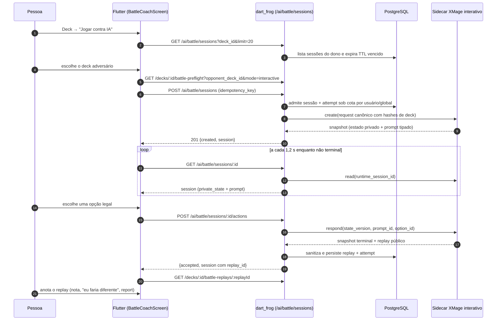

# Fluxo `battle_replay` — Jogar contra IA, coach, mesa ao vivo, replays e anotações

Estado: documentação de apoio, não autoritativa · gerado em 2026-09-21 sobre o commit d26f23a16 · **2ª leitura adversarial** sobre `b397f477b` (A3 e A8 refutados; A15–A18 acrescentados) · **3ª leitura adversarial em 2026-09-21 sobre `9a9ba66de`** (A19–A21 acrescentados; correções em A1/A15/A18 e nas seções 3.1, 4 e 9; ver 11.5–11.8) · verificação estática (nenhum teste foi executado em nenhuma das três rodadas)

> Convenção: todo caminho é relativo à raiz do repo (`/Users/desenvolvimentomobile/Documents/rafa/mtg/mtgia`). `arquivo:N` é linha lida neste commit. Distingo sempre **IMPLEMENTADO** (existe código), **ALCANÇÁVEL HOJE** (a política de capabilities deixa chegar lá) e **PROVADO** (existe teste que exercita comportamento).

---

## 1. Resumo e veredito

| Eixo | Veredito | Base factual |
| --- | --- | --- |
| IMPLEMENTADO | **sim** | 13 arquivos de rota no servidor (`server/routes/ai/battle/**`, `server/routes/decks/[id]/battle-*/**`, `server/routes/ai/simulate/index.dart`), 3 telas + 5 serviços no app (`app/lib/features/battle/**`, 16.825 linhas — conferido), **6** tabelas criadas nas migrações `052`–`056` (linhas `version:` em `server/bin/migrate.dart:2706,2809,3041,3362,3461`; a `057`, `migrate.dart:3847`, só amplia o CHECK de timeout de `battle_jobs`, e `battle_simulations` é pré-existente — números conferidos na 3ª rodada, a 1ª e a 2ª citavam ±1). Os contratos app↔servidor conferidos campo a campo batem (seção 4). |
| ALCANÇÁVEL HOJE | **não** | `server/config/release_capabilities.json:52-69` tem `battle_batch`, `battle_live` e `battle_coach` com `release_capability: "off"` / `allowed: false` — e as 29 capabilities estão `off`, inclusive `decks_private`, pré-requisito de qualquer `/decks/*`. O portão do servidor devolve **404 `capability_unavailable` antes do handler** (`server/routes/_middleware.dart:105-144` + `server/lib/release_capability_policy.dart:187-194`). Além disso, Jogar contra IA só existe no artefato se compilado com `--dart-define=ENABLE_INTERACTIVE_BATTLE=true` (`app/lib/core/config/launch_features.dart:31-36`, consumido em `app/lib/main.dart:107,675,690,704,713`) e o servidor exige `INTERACTIVE_BATTLE_ENABLED=true` + sidecar interativo isolado do sidecar batch (`server/lib/battle/interactive_battle_runtime_client.dart:29-83`). |
| PROVADO | **parcial** | Serviços e telas do app têm testes de comportamento com fakes (**37** `testWidgets` em `app/test/features/battle/screens/battle_replays_screen_test.dart`, **21** `testWidgets` + 1 `test` em `battle_coach_screen_test.dart` — contagens conferidas com `grep -o`); o serviço interativo do servidor tem **19** testes de comportamento com store/runtime falsos (`server/test/interactive_battle_service_test.dart`, `test(` em `:12,41,81,115,154,208,245,284,329,376,413,494,532,570,606,640,685,733,805`); replays, preflight e anotações têm teste que **invoca o handler** (`server/test/battle_replay_routes_security_test.dart`, `battle_replay_annotation_routes_test.dart`). Porém as rotas HTTP de `ai/battle/sessions/**` só têm teste que **lê o código-fonte como string** (`server/test/interactive_battle_route_contract_test.dart:9-87`), e os dois E2E reais (`server/test/play_vs_ai_real_xmage_e2e_test.dart:609`, `server/test/battle_product_e2e_test.dart:251`) são `skip` sem um conjunto de variáveis de ambiente de aprovação explícita. Nenhum teste de unidade/widget exercita caminho de erro de rede na tela Jogar contra IA (só o `integration_test`). |

Em uma frase: o fluxo está escrito de ponta a ponta e é coerente entre app e servidor, mas **nenhum usuário chega nele com a política vigente**, e a camada HTTP das sessões interativas só é exercitada de verdade por um E2E que não roda por padrão.

**"Mesa ao vivo" tem dois significados neste projeto e é preciso separá-los:**

1. A mesa do *Jogar contra IA* — o tabuleiro vivo que o usuário vê, alimentado por polling de `GET /ai/battle/sessions/:id` a cada 1,2 s (`app/lib/features/battle/screens/battle_coach_screen.dart:45,264-268`). **É produto.**
2. O *Battle Live Spectator* — `GET /ai/battle/jobs/:id/live` (`server/routes/ai/battle/jobs/[id]/live/index.dart`) + `BattleLiveSpectatorScreen` (1.736 linhas) + `BattleJobGateway.pollLive`. **Não é produto por decisão registrada**: nenhuma rota do app o constrói (nenhum `import` dele em `app/lib` fora do próprio arquivo) e um teste proíbe o roteador de construí-lo (`app/test/core/config/release_capability_surface_contract_test.dart:109-119`), coerente com `docs/status/CURRENT_PRODUCT_DECISION.md:64` e `docs/MAPA_OPERACIONAL_DO_PROJETO.md:49`.



---

## 2. Jornada passo a passo

| # | Passo | Tela/widget (arquivo:linha) | Provider/serviço/cliente (arquivo:linha) | Método + endpoint | Handler do servidor (arquivo:linha) | Serviço/repositório | Tabelas |
| --- | --- | --- | --- | --- | --- | --- | --- |
| 1 | Detalhe do deck oferece "Battle Lab" e "Jogar contra IA" | `app/lib/features/decks/screens/deck_details_screen.dart:406-413,775-776,932-934` | `ReleaseCapabilitiesProvider.isAllowed` (`app/lib/core/config/release_capabilities.dart:265-267`) | — | — | — | — |
| 2 | Navegação `/decks/:id/play-vs-ai` | `app/lib/main.dart:690-703` (rota só existe se `LaunchFeatures.interactiveBattleSupported`) | guard `ReleaseCapabilityRouteGuard.redirectFor` (`app/lib/core/config/release_capabilities.dart:403-407`), acoplado em `app/lib/main.dart:426-433` | — | — | — | — |
| 3 | Tela de boas-vindas busca mesa retomável | `battle_coach_screen.dart:79-96,455-475` (`battle-coach-loading-state`, `_BattleCoachWelcome`) | `InteractiveBattleService.list` (`app/lib/features/battle/services/interactive_battle_service.dart:91-128`) | `GET /ai/battle/sessions?deck_id=<uuid>&limit=20` | `server/routes/ai/battle/sessions/index.dart:27-73` | `InteractiveBattleService.list` (`server/lib/battle/interactive_battle_service.dart:157-167`) → `InteractiveBattleStore.list` (`server/lib/battle/interactive_battle_store.dart:511`) | `interactive_battle_sessions` |
| 4 | Retomar a mesa ativa | `battle_coach_screen.dart:193-220` (`_ActiveBattleSessionCard`, `battle_coach_screen.dart:939`) | `InteractiveBattleService.get` (`interactive_battle_service.dart:162-168`) | `GET /ai/battle/sessions/:id` | `server/routes/ai/battle/sessions/[id]/index.dart:14-52` | `.get` + `_expireIfNeeded` (`server/lib/battle/interactive_battle_service.dart:170-192,415-460`) | `interactive_battle_sessions`, `interactive_battle_records` |
| 5 | Escolher adversário (lista de decks) | `_BattleOpponentPickerDialog` (`app/lib/features/battle/screens/battle_replays_screen.dart:1322-1511`), aberto por `battle_coach_screen.dart:117-127` | `BattleReplayService.listOpponentDecks` (`app/lib/features/battle/services/battle_replay_service.dart:182-216`) | `GET /decks` **e** `GET /community/decks?page=1&limit=50` (falha de um lado é tolerada, `battle_replay_service.dart:196-200`) | `server/routes/decks/index.dart`, `server/routes/community/decks/index.dart` | — | `decks`, `deck_cards` |
| 6 | Preflight do par de decks | `_BattlePreflightSummary` (`battle_replays_screen.dart:1995-2050`: `battle-preflight-loading/-error/-idle/-ready/-blocked`) | `BattleReplayService.loadBattlePreflight` (`battle_replay_service.dart:461-485`), disparado em `battle_replays_screen.dart:1427-1465` | `GET /decks/:id/battle-preflight?opponent_deck_id=<uuid>&mode=interactive\|simulation` | `server/routes/decks/[id]/battle-preflight/index.dart:15-62` | `BattlePreflightService.inspect` (`server/lib/battle/battle_preflight_service.dart:130-245`), probe `checkInteractiveBattleCoverage` (`:541-600`) | `decks`, `deck_cards` (+ HTTP ao sidecar) |
| 7 | Criar a mesa | `battle_coach_screen.dart:129-157` | `InteractiveBattleService.create` (`interactive_battle_service.dart:130-160`) — idempotency key `battle-create:<requestId>` reaproveitada em retry (`:137-145`) | `POST /ai/battle/sessions` | `server/routes/ai/battle/sessions/index.dart:75-150` | `InteractiveBattleService.create` (`server/lib/battle/interactive_battle_service.dart:28-154`), admissão de deck Commander (`server/lib/battle/battle_deck_admission.dart:24-54`), cota por usuário/global (`interactive_battle_store.dart:286-295`) | `interactive_battle_sessions`, `battle_simulation_attempts`, `decks`, `deck_cards` |
| 8 | Polling do estado privado | `battle_coach_screen.dart:222-268` (`_schedulePoll`, 1,2 s) + barra `_BattleCoachStatusBar:1103` | `InteractiveBattleService.get` | `GET /ai/battle/sessions/:id` | idem passo 4 | `_applySnapshot` correlaciona `request_hash` (`server/lib/battle/interactive_battle_service.dart:299-311`) | `interactive_battle_sessions`, `interactive_battle_records` |
| 9 | Responder ao prompt (opção / inteiro / multi / delegar) | `_BattleCoachDecisionPanel` (`battle_coach_screen.dart:2257`), `_OwnHand:1551`, `_PromptOptionTile:2460` | `InteractiveBattleService.respond` (`interactive_battle_service.dart:170-202`), corpo em `:53-66` | `POST /ai/battle/sessions/:id/actions` | `server/routes/ai/battle/sessions/[id]/actions/index.dart:15-101` | `respond` + `reserveAction` (`server/lib/battle/interactive_battle_service.dart:196-243`, `interactive_battle_store.dart:540`) | `interactive_battle_sessions`, `interactive_battle_records` |
| 10 | Conceder | `battle_coach_screen.dart:315-360` (diálogo `battle-coach-concede-dialog`) | `InteractiveBattleService.concede` (`interactive_battle_service.dart:204-223`) | `POST /ai/battle/sessions/:id/concede` | `server/routes/ai/battle/sessions/[id]/concede/index.dart:15-107` | `concede` + `reserveConcede` (`server/lib/battle/interactive_battle_service.dart:247-296`) | `interactive_battle_sessions`, `battle_simulations` |
| 11 | Painel terminal → abrir replay / jogar de novo | `_BattleCoachTerminalPanel` (`battle_coach_screen.dart:2694`), `_openReplay:362-368`, `_playAgain:370-372` | navegação GoRouter para `/decks/:id/battle-replays?replay=<id>` | — | — | — | — |
| 12 | Battle Lab lista replays (com cursor) | `BattleReplaysScreen` (`battle_replays_screen.dart:69-130`, estados `battle-replays-loading-state:793`, `-error-state:802`, `-empty-state:957`) | `BattleReplayService.listReplayPage` (`battle_replay_service.dart:254-324`), carga em `battle_replays_screen.dart:190-253`, paginação em `:266-304` | `GET /decks/:id/battle-replays?limit=30[&cursor=]` | `server/routes/decks/[id]/battle-replays/index.dart:9-74` | `BattleReplayReadService.ownsDeck:38` + `.listReplayPage:68` | `battle_simulations`, `battle_simulation_attempts`, `decks` |
| 13 | Abrir um replay | `battle_replays_screen.dart:316-350` | `BattleReplayService.fetchReplay` (`battle_replay_service.dart:326-346`) | `GET /decks/:id/battle-replays/:replayId` | `server/routes/decks/[id]/battle-replays/[replayId]/index.dart:9-54` | `BattleReplayReadService.fetchReplay:195` | `battle_simulations`, `battle_simulation_attempts` |
| 14 | Anotações do replay (listar/criar/excluir) | `battle_replays_screen.dart:579-604,606-640,642-668` (nota, "eu faria diferente", mulligan, report, bookmark, helpful) | `BattleReplayService.listReplayAnnotations/createReplayAnnotation/deleteReplayAnnotation` (`battle_replay_service.dart:348-433`) | `GET/POST /decks/:id/battle-replays/:replayId/annotations`, `DELETE .../annotations/:annotationId` | `server/routes/decks/[id]/battle-replays/[replayId]/annotations/index.dart:15-158`, `.../[annotationId].dart:12-51` | `BattleReplayAnnotationService.list:59 / .create:104 / .delete:294`; normalização por `kind` em `:499-680` | `battle_replay_annotations`, `battle_simulations`, `battle_simulation_attempts` |
| 15 | Battle Lab roda simulação única (goldfish/battle) | `battle_replays_screen.dart:380-413,503-540` | `BattleReplayService.runGoldfishSimulation/runBattleTest` (`battle_replay_service.dart:435-447,487-510`) | `POST /ai/simulate` | `server/routes/ai/simulate/index.dart:39-140,273-290` | `BattleSimulationAttemptService`, `BattleExecutionRuntime`, `BattleSimulationPersistenceService` | `battle_simulations`, `battle_simulation_attempts`, `card_battle_rules` |
| 16 | Battle Lab roda série em lote (3/5/10) | `battle_replays_screen.dart:414-481` | `BattleJobSeriesRunner.run` (`app/lib/features/battle/services/battle_job_series_runner.dart:84-172`) sobre `BattleJobGateway` (`battle_job_gateway.dart:28-107`) | `POST /ai/battle/jobs`, `GET /ai/battle/jobs/:id`, `DELETE /ai/battle/jobs/:id` | `server/routes/ai/battle/jobs/index.dart:14-123`, `server/routes/ai/battle/jobs/[id]/index.dart:13-66` | `BattleJobService` + `BattleJobStore`, worker `server/bin/battle_job_worker.dart` | `battle_jobs`, `battle_simulation_attempts`, `battle_simulations` |
| 17 | Mesa ao vivo (espectador de job) | **sem porta de entrada**: `BattleLiveSpectatorScreen` (`app/lib/features/battle/screens/battle_live_spectator_screen.dart:24`) não é construída por nenhuma rota | `BattleJobGateway.pollLive` (`battle_job_gateway.dart:109-135`) | `GET /ai/battle/jobs/:id/live?limit&cursor` | `server/routes/ai/battle/jobs/[id]/live/index.dart:23-94` | `BattleLiveService` + `BattleLiveStore` + cursor assinado (`battle_live_cursor_contract.dart`) | `battle_job_live_records`, `battle_jobs` |

Observação sobre o passo 2: `/decks/:id/battle-coach` e `/decks/:id/battle-coach/:sessionId` continuam registradas apenas como **redirect** para a rota canônica `play-vs-ai` (`app/lib/main.dart:704-718`), com os helpers antigos marcados `@Deprecated` em `battle_coach_screen.dart:28-35`.

---

## 3. Capabilities e portões

### 3.1 Quem segura o quê

| Superfície | Capability no app | Onde | Capability no servidor | Onde | Nomes batem? |
| --- | --- | --- | --- | --- | --- |
| `/decks/:id/play-vs-ai[/:sessionId]` | `battle_coach` **+** build flag `ENABLE_INTERACTIVE_BATTLE` | `release_capabilities.dart:403-407`, `main.dart:675,690` | `battle_coach` para `/ai/battle/sessions` e `/ai/battle/sessions/*` | `release_capability_policy.dart:399-402` | **sim** |
| `/decks/:id/battle-replays` | `battle_batch` | `release_capabilities.dart:409-412`, `main.dart:664-666` | `battle_batch` para `/decks/{id}/battle-replays(/...)` | `release_capability_policy.dart:419-423` | **sim** |
| Preflight modo interativo | implícito (só é chamado dentro do Play vs AI) | `battle_replays_screen.dart:1436-1440` | `battle_coach` quando `mode=interactive\|coach`, senão `battle_batch` | `release_capability_policy.dart:413-418` | **sim** |
| Série em lote / `/ai/simulate` | `battle_batch` (`battleBatchEnabled`) | `main.dart:664-666`, `battle_replays_screen.dart:392,404,418` | `battle_batch` para `/ai/battle/jobs*` e `/ai/simulate` | `release_capability_policy.dart:406-412` | **sim** |
| Espectador ao vivo | `battle_live` existe no enum (`release_capabilities.dart:15`) mas **nenhuma rota do app o usa**; `ReleaseRouteBuildSupport.battleLive` fica `false` por omissão em `main.dart:104-109` | — | `battle_live` para `/ai/battle/jobs/{id}/live` **+** env `BATTLE_LIVE_SPECTATOR_ENABLED=true` | `release_capability_policy.dart:403-405`, `server/lib/battle/battle_live_service.dart:12-15` | sim, mas o lado do app é inerte |
| **Picker de deck adversário** (acrescentado na 3ª rodada) | nenhuma — a tela chama os dois endpoints sem consultar capability (`battle_replay_service.dart:186-193`) | `battle_replays_screen.dart:1322-1511` | `GET /decks` → `decks_private`; `GET /community/decks` → **`gallery_public`** | `release_capability_policy.dart:537-542` e `:467-470` | **não** — `gallery_public` nunca aparece no mapa deste fluxo e a falha é engolida (achado A19) |

**Correção da 3ª rodada à coluna "Nomes batem?".** Os nomes batem, a **exigência efetiva não**: o guard do app exige `decks_private` para **qualquer** `/decks/*` (`release_capabilities.dart:520-523`) *além* de `battle_batch`/`battle_coach`, enquanto o servidor classifica `/decks/{id}/battle-replays(/...)` e `/decks/{id}/battle-preflight` e **retorna antes** de chegar ao fallback `decks_private` (`release_capability_policy.dart:413-418,419-423` vs. `:537-542`). Ver achado A20.

### 3.2 Como o portão do servidor nega

`server/routes/_middleware.dart:105-144` resolve a capability **antes** de abrir conexão com o PostgreSQL e antes do handler. A decisão vem de `ReleaseCapabilityPolicy.decisionFor` (`server/lib/release_capability_policy.dart:158-196`):

- rota classificada mas capability `off` → **404** `{"error":"capability_unavailable","capability":"battle_coach",...}` (`:187-194`);
- rota **não classificada** → 404 `capability_route_unclassified` (`:172-177`) — fail-closed para rota nova;
- arquivo de política inválido/ausente → 503 `capability_policy_invalid` com todas as capabilities `off` (`:179-186,629-644`).

Ou seja: **negado vira 404, não 403.** Isso é deliberado (evita enumerar features), mas significa que o app não consegue distinguir "feature desligada" de "recurso inexistente" pelo status.

### 3.3 O que o usuário vê quando é negado

| Situação | O que acontece |
| --- | --- |
| `battle_coach` off (política atual) | O guard do roteador redireciona `/decks/:id/play-vs-ai` para `/decks/:id` (`release_capabilities.dart:403-407,552-555`). Como `decks_private` também está off, a segunda passada do redirect manda para `/home` (`:520-523`). O botão em Deck Details nem aparece (`deck_details_screen.dart:406-413`). |
| Build sem `ENABLE_INTERACTIVE_BATTLE` | A rota **não existe** no artefato (`main.dart:675,690`); o guard também redireciona por `buildSupport.battleCoach == false`. |
| `battle_batch` off | `/decks/:id/battle-replays` redireciona para o detalhe do deck (`release_capabilities.dart:409-412`). |
| Capability ligada no app, desligada no servidor | **Só acontece com snapshot velho** (ver 3.3.1): o app não tem política própria. Quando acontece, o 404 do middleware cai em `InteractiveBattleService._friendlyMessage` (`app/lib/features/battle/services/interactive_battle_service.dart:286-288`) e mostra "Jogar contra IA ainda não está habilitado neste ambiente." |
| Capability ligada, `INTERACTIVE_BATTLE_ENABLED` ausente no servidor | O próprio handler devolve 404 `interactive_battle_not_found` (`server/routes/ai/battle/sessions/index.dart:18-21`), e o app mostra "Jogar contra IA não está habilitado neste ambiente, ou esta mesa não existe mais." (`interactive_battle_service.dart:273-275`). |
| Sidecar interativo apontando para o mesmo host do sidecar batch | `InteractiveBattleConfiguration.fromEnvironment` lança `interactive_battle_runtime_not_isolated`; `interactiveBattleFeatureEnabled` engole a exceção e devolve `false` (`interactive_battle_runtime_client.dart:57-64,98-104`) → 404 silencioso, com o motivo real só visível no preflight (`battle_preflight_service.dart:349-366`). |

### 3.3.1 De onde o app tira as capabilities (faltava nesta seção)

O app **não tem política local**: `ReleaseCapabilitiesProvider` busca `GET /capabilities` (`app/lib/core/config/release_capabilities.dart:251` — `static const endpoint = '/capabilities'`) e parte de `ReleaseCapabilitiesSnapshot.denied()` (`:256`), com `isAllowed` exigindo `isValid && entry.allowed` (`:185-186`) e `isAllowed(capability, {buildSupported})` multiplicando pela trava de compilação (`:265-267`). Consequências que mudam a leitura do fluxo:

- app e servidor leem a **mesma** política; divergência real só existe em janela de snapshot velho (política trocada com o app aberto) ou falha de rede, porque o default é negar tudo;
- `/capabilities` passa pelo portão porque é requisição de control plane (`server/lib/release_capability_policy.dart:547-557`); se não fosse, o 404 do middleware derrubaria o próprio carregamento da política;
- o envelope é validado por lista branca fechada de chaves (`release_capabilities.dart:167-178,193-208`) e qualquer desvio vira `denied()` (`:115,124,132`): um campo novo no JSON do servidor invalida o snapshot inteiro e **desliga tudo no app** — fail-closed, mas também um ponto de quebra silenciosa em evolução de schema.

### 3.4 Autenticação e rate limit (portão anterior à lógica)

- `/ai/**`: `authMiddleware()` + classificação `polling` para `ai/battle/jobs*` e `ai/battle/sessions*` (`server/routes/ai/_middleware.dart:31-38,63-89`), o que aplica `_aiPollingRateLimiter` = **120 req/min por usuário** (`server/lib/rate_limit_middleware.dart:167`) em vez da cota cara de IA. O polling de 1,2 s do app gasta ~50 req/min desse teto.
- `/decks/**`: só `authMiddleware()` (`server/routes/decks/_middleware.dart:6-9`).
- 401 do backend dispara o handler global de expiração de sessão no app (`app/lib/core/api/api_client.dart:96-117,622-627`), porque a mensagem do middleware contém "Token".

---

## 4. Contrato app↔servidor (por endpoint)

| Endpoint | App envia (arquivo:linha) | Servidor aceita (arquivo:linha) | Servidor devolve | App lê | Veredito |
| --- | --- | --- | --- | --- | --- |
| `GET /ai/battle/sessions?deck_id&limit` | `deck_id`, `limit` (`interactive_battle_service.dart:96-99`) | apenas `{limit, deck_id}`, `limit` 1..50, `deck_id` UUID; qualquer outra chave → 422 (`sessions/index.dart:27-49`) | `{schema_version:"interactive_battle_session_list_v1", sessions:[session_v1]}` (`sessions/index.dart:58-66`) | valida `schema_version` da lista **e de cada item** (`interactive_battle_service.dart:107-125`) | **coerente** |
| `POST /ai/battle/sessions` | `schema_version`, `deck_id`, `opponent_deck_id`, `ttl_seconds:1800`, `prompt_timeout_seconds:90`, `idempotency_key` (`interactive_battle_service.dart:146-153`) | mesmo conjunto exato de chaves; ttl 60..7200; prompt 15..300 (`interactive_battle_contract.dart:166-240`, constantes `:18-23`) | 201/200 `{created, session}` (`sessions/index.dart:111-118`) | só lê `session`; **ignora `created`** (`interactive_battle_service.dart:154`) | coerente; `created` ignorado (ver achado A6) |
| `GET /ai/battle/sessions/:id` | — | GET, id UUID (`sessions/[id]/index.dart:14-19`) | **sessão no topo** (`:29`) | `_readSession(response)` sem `nested` (`interactive_battle_service.dart:163-167`) | **coerente** |
| `POST /ai/battle/sessions/:id/actions` | `schema_version`, `state_version`, `prompt_id`, um de `option_id`/`integer_value`/`multi_amount_values`/`delegate`, `idempotency_key` (`interactive_battle_service.dart:53-66`) | mesmas chaves, exatamente uma resposta, `prompt_id` `^p_[A-Za-z0-9_-]{16,64}$`, `option_id` `^o_...$` (`interactive_battle_contract.dart:277-400,37-42`) | `{accepted:true, session}` (`actions/index.dart:57-60`); 409 `interactive_battle_already_terminal` carrega a sessão (`:69-77`) | `nested: true` e trata o 409 terminal como sucesso (`interactive_battle_service.dart:231-235`) | coerente, **com um furo**: o atalho de 409 aceita qualquer mapa sob `session` **sem validar `schema_version`**, ao contrário do caminho feliz (`:242-248`) — achado A21 |
| `POST /ai/battle/sessions/:id/concede` | corpo `{idempotency_key}` (`interactive_battle_service.dart:213-216`) | corpo **só** pode ter `idempotency_key` (`concede/index.dart:31-45`) | `{accepted:true, session}` (`:69-72`) | `nested: true` | **coerente** |
| `GET /decks/:id/battle-preflight` | `opponent_deck_id`, `mode` (`battle_replay_service.dart:466-472`) | `mode ∈ {simulation, interactive}`, ambos UUID e diferentes (`battle-preflight/index.dart:19-35`) | `schema_version, mode, status, card_count, commander_count, validation_state, opponent{}, available_opponent_count, engine_coverage, selected_engine?, unsupported_cards, blockers, deck_snapshot_hash, deck_revision` (`battle_preflight_service.dart:215-244`) | lê **12** desses campos (`battle_test_setup.dart:89-120`: `status`, `card_count`, `commander_count`, `validation_state`, `available_opponent_count`, `engine_coverage`, `blockers`, `unsupported_cards`, `mode`, `selected_engine`, `deck_snapshot_hash`, `deck_revision`); **ignora** `opponent{}`, `validation_reasons`, `read_only`, `schema_version` | coerente; `selected_engine` ausente ⇒ `canStartInteractive == false` (`battle_test_setup.dart:86-87`) |
| `GET /decks/:id/battle-replays` | `limit=30`, `cursor?` (`battle_replay_service.dart:270-278`) | `limit` clampado 1..100 (`battle-replays/index.dart:76-79`) | `{data, source, pagination{schema_version:"battle_replay_cursor_v1", limit, has_more, next_cursor?}, advisory, simulation_contract}` (`:37-57`) | exige `pagination.schema_version` e coerência `has_more ⇔ next_cursor` (`battle_replay_service.dart:301-318`) | **coerente e estrito** |
| `GET /decks/:id/battle-replays/:replayId` | — | GET, UUIDs (`[replayId]/index.dart:14-22`) | `{replay:{...}}` (`:40`) | `_normalReplayPayload` desembrulha `replay`/`data`/`result` (`app/lib/features/battle/models/battle_replay.dart:750-757`) | **coerente** |
| `GET .../annotations?limit=100` | `limit` (`battle_replay_service.dart:353-355`) | `limit` clampado 1..100 (`annotations/index.dart:160`) | `{schema_version, data, immutable_replay}` (`:49-55`) | lê `data`, exige `schema_version` por item e filtra `replay_id`/`subject_deck_id` (`battle_replay_service.dart:357-383`, `battle_replay_annotation.dart:45-81`) | **coerente** |
| `POST .../annotations` | `kind`, `payload`, `event_ref?`, `snapshot_ref?`, `idempotency_key` (`battle_replay_annotation.dart:129-135`) | mesmas 5 chaves; `event:` / `snapshot:` com índice; payload normalizado por `kind` (`battle_replay_annotation_service.dart:424-495,499-680`) | 201/200 `{annotation, created}` (`annotations/index.dart:109-112`) | lê `annotation`, valida escopo (`battle_replay_service.dart:397-417`) | **coerente** (payloads do app conferem com `_normalizePayload`: `note{text,title}`, `would_do_differently{stance,reason}`, `mulligan_decision{choice,hand_size,mulligan_number}`, `event_report{reason_code,details}`, `helpful_feedback{helpful,surface}`) |
| `DELETE .../annotations/:annotationId` | — | DELETE, UUIDs (`[annotationId].dart:18-26`) | 204 sem corpo (`:37`) | trata 204 como `true` (`battle_replay_service.dart:430`) | **coerente** |
| `POST /ai/simulate` | **battle**: `deck_id`, `type:'battle'`, `opponent_deck_id`, `test_objective`, `focus_cards?`, `max_turns` (`battle_replay_service.dart:487-510` + `battle_test_setup.dart:49-53`). **goldfish**: só `deck_id`, `type:'goldfish'`, `simulations` — **sem** `test_objective` (`battle_replay_service.dart:436-445`), que o servidor então preenche com o default do parser (`ai/simulate/index.dart:393`) | parser por chave nomeada, **tolerante a chave extra** — não há lista branca (`server/lib/ai/battle_simulation_request_support.dart:33-80`); erro de campo vira 400 via `JsonObjectValidationException` (`ai/simulate/index.dart:431-433`) | `{..., replay_id, persistence:{status, replay_id}}` (`ai/simulate/index.dart:273-290`) | exige `persistence.status == "saved"` **e** `replay_id == persistence.replay_id`, senão erro (`battle_replay_service.dart:520-535`) | **coerente**, com exigência mais dura do lado do app |
| `POST /ai/battle/jobs` | `schema_version`, `deck_id`, `opponent_deck_id`, `test_objective`, `focus_cards?`, `max_turns`, `timeout_ms`, `seed`, `idempotency_key` (`battle_job.dart:631-640`) | lista branca de 15 chaves (`battle_job_contract.dart:193-209`) | `{job, created}` (`jobs/index.dart:90-93`) | `BattleJobCreation.fromJson` com **chaves exatas** `{job, created}` e `BattleJob.fromJson` com **chaves exatas** (`battle_job.dart:318-322,534-541,760-798`) | coerente hoje: todas as chaves de `BattleJob.toJson` (`battle_job_contract.dart:510-576`) estão em `_jobKeys`. Frágil (achado A5) |
| `GET /ai/battle/jobs/:id` | — | GET/DELETE (`jobs/[id]/index.dart:13-42`) | job no topo (GET) / `{job, accepted}` (DELETE 200/202) | `get` valida `job_id` igual ao pedido; `cancel` valida status vs. status code (`battle_job_gateway.dart:77-107`) | **coerente** |
| `GET /ai/battle/jobs` | `limit`, `status?`, `deck_id?` (`battle_job_gateway.dart:63-72`) | `parseBattleJobListFilter` (`jobs/index.dart:26-33`) | `{schema_version, jobs}` | `BattleJobList.fromJson` | **implementado, mas ninguém chama no app** (achado A4) |
| `GET /ai/battle/jobs/:id/live` | `limit`, `cursor?` (`battle_job_gateway.dart:118-125`) | `BattleLiveQuery.parse` (`live/index.dart:30-35`) | página com cursor assinado | `BattleLivePage.fromJson` + `session.apply` | **implementado, sem chamador alcançável** (achado A4) |

### Campos que um lado manda e o outro ignora (inventário)

- `session.terminal`, `deck_hashes`, `engine`, `engine_version/commit/build`, `ttl_seconds`, `last_activity_at`, `attempt_id`, **`started_at`, `finished_at`** e `created_at` (`interactive_battle_contract.dart:707-737`) não são lidos por `InteractiveBattleSession.fromJson` (`app/lib/features/battle/models/interactive_battle_session.dart:333-354`). O app recalcula terminalidade localmente (achado A2). `schema_version` **não** entra nessa lista: é lido e exigido em `_readSession` (`interactive_battle_service.dart:242-248`) e item a item na lista (`:107-125`). `started_at`/`finished_at` ausentes explicam por que o painel terminal não mostra duração da partida.
- Preflight: `opponent{}` (id, nome, hashes, revisão do deck adversário) e `validation_reasons` são produzidos (`battle_preflight_service.dart:229-238`) e descartados pelo app — a UI só consegue dizer "Battle bloqueada" genérica quando o problema está no deck adversário.
- `advisory` e `simulation_contract` da listagem de replays (`battle-replays/index.dart:47-56`) não são lidos por `listReplayPage`.

---

## 5. Dados (tabelas e migrações)

| Tabela | Criada em | Papel neste fluxo | Chaves/garantias relevantes |
| --- | --- | --- | --- |
| `battle_simulations` | pré-existente, alterada na `011` `update_battle_simulations` (`server/bin/migrate.dart:112`); espelho em `server/database_setup.sql:485` | Replay persistido (batch e interativo) | referenciada por attempts e anotações |
| `battle_simulation_attempts` | `052 version_battle_simulation_attempts` (`migrate.dart:2705`) | Tentativa auditável por execução; `replay_id` UNIQUE | `uq_battle_attempt_id_replay` (`migrate.dart:2812`), índices por usuário/deck/hash (`database_setup.sql:588-608`) |
| `battle_replay_annotations` | `053 create_battle_replay_annotations` (`migrate.dart:2809`) | Anotações imutáveis do replay | FK composta `(id, replay_id)` para o attempt (`database_setup.sql:631`), unicidade por `(user_id, replay_id)` para escolhas singleton (`:782`) |
| `battle_jobs` | `054 create_battle_jobs` (`migrate.dart:3041`) | Fila assíncrona do Battle batch | `uq_battle_jobs_user_idempotency` (`database_setup.sql:992`), índices de claim/lease (`:999-1003`) |
| `battle_job_live_records` | `055 create_battle_job_live_records` (`migrate.dart:3362`) | Eventos/snapshots do espectador interno | `(job_id, sequence)` (`database_setup.sql:1085`), cascade do job |
| `interactive_battle_sessions` | `056 create_interactive_battle_sessions` (`migrate.dart:3461`) | Mesa Jogar contra IA | `uq_interactive_battle_user_idempotency` (`database_setup.sql:1279`), `uq_interactive_battle_runtime_session` (`:1281`), CHECKs de schema/status/hashes/TTL/prompt (`:1143-1279`) |
| `interactive_battle_records` | `056` (mesma migração, `database_setup.sql:1303`) | Log append-only de snapshots/ações da mesa | cascade da sessão |
| `battle_jobs` (timeout) | `057 expand_battle_job_async_timeout` (`migrate.dart:3846`) | Amplia `chk_battle_job_timeout` | — |
| `card_battle_rules`, `deck_matchups` | anteriores | Aprendizado derivado de battle (fora do caminho da UI deste fluxo) | — |

Não existe diretório `server/migrations/`: o schema canônico vive em `server/bin/migrate.dart` (versões nomeadas) com espelho idempotente em `server/database_setup.sql`, usado pelo bootstrap dos gates (`scripts/manaloom_battle_product_gate.sh:343`).

---

## 6. Estados e erros

### Jogar contra IA (`battle_coach_screen.dart`)

| Estado | Tratado? | Onde |
| --- | --- | --- |
| Carregando a mesa | sim — `AppStatePanel.loading` com `key battle-coach-loading-state` | `:455-462` |
| Boas-vindas / vazio (sem mesa) | sim — `_BattleCoachWelcome` com CTA e banner alpha | `:463-475,636,698` |
| Lista de sessões carregando / com erro | sim — `sessionsLoading`/`sessionsError` com botão de retry | `:159-191`, consumido em `:470-474` |
| Erro de rede / 5xx / formato inesperado | **parcial** — `_BattleCoachErrorBanner` (com retry) só existe no ramo `_session != null` (`:482-483`); sem sessão carregada o erro vira texto solto `battle-coach-start-error` dentro do opt-in (achado A15) | `:482-483,1189-1200` vs. `:464-476,877` |
| 401 / sessão expirada | parcial — o banner mostra mensagem genérica; a expulsão vem do handler global do `ApiClient` | `api_client.dart:96-117,622-627` |
| 404 de capability / feature off | sim, com texto dedicado | `interactive_battle_service.dart:273-275,286-288` |
| 429 (cota de mesas) | sim — mensagem específica e recarga da mesa ativa | `interactive_battle_service.dart:268-269`, `battle_coach_screen.dart:152-155` |
| 429 (rate limit de polling) | **sim, distinguido** (correção da revisão adversarial): o limiter manda `message` própria e o app a exibe por `backendMessage` antes do fallback | `interactive_battle_service.dart:282-285` + `rate_limit_middleware.dart:461-466` |
| Ação obsoleta (409 stale) | sim — mensagem "a mesa avançou" e refresh | `interactive_battle_service.dart:270-272`, `battle_coach_screen.dart:288-295` |
| Validação local (multi-amount) | sim | `:298-313` |
| Duplo toque / reentrância | sim — `_submitting`, `_starting`, `_fetching` | `:118,228,273,317` |
| App em background | sim — cancela o polling e refaz ao voltar | `:98-106` |
| TTL/expiração da mesa | sim no servidor (`_expireIfNeeded`, `interactive_battle_service.dart:415-460`) e apresentado como painel terminal "Sessão expirada" | `interactive_battle_session.dart:42` |
| Offline persistente | **parcial**: sem backoff — o polling continua a cada 1,2 s indefinidamente mesmo em erro permanente | `:247-250,264-268` (achado A1) |
| Status desconhecido vindo do servidor | **não**: vira `unknown`, que não é terminal → polling infinito | `interactive_battle_session.dart:357-372,21-32` (achado A2) |

### Battle Lab (`battle_replays_screen.dart`)

Carregando (`:793`), erro (`:802`), vazio (`:957`), paginação com erro em snackbar (`:295-303`), execução em andamento (`_isRunning`/`_isRunningSeries`, `:732`), série cancelável/descartável (`:483-496`), anotação salvando/erro (`:606-640`), preflight nos cinco estados (`:1995-2050`), deck adversário sem preflight pronto bloqueia o submit (`:1487-1488,1539-1543`). Troca de deck na mesma rota invalida época de carga (`:132-158,159-189`).

### Servidor

- Corpo grande → 413 (`sessions/index.dart:79-86`, `actions/index.dart:23-29`, `annotations/index.dart:77-85`).
- JSON inválido → 422 (`sessions/index.dart:92-99`) ou 400 (`annotations/index.dart:92-93`) — **os dois padrões coexistem**.
- Runtime indisponível → 503 com `Retry-After: 2` (`sessions/index.dart:165-173`).
- Falha de start do motor → 503 com a sessão já finalizada localmente (`sessions/index.dart:135-140`, `interactive_battle_service.dart:127-153`).
- IDOR: job/replay/sessão de outro dono respondem igual a inexistente (`jobs/[id]/index.dart:43-46`, `live/index.dart:51-54`, `battle_replay_routes_security_test.dart:200`).
- Erro inesperado nunca vaza detalhe (`internalServerError` + `captureRouteException` em todas as rotas do fluxo).

---

## 7. Testes por passo

| # | Passo | Teste que exercita | O que de fato afirma |
| --- | --- | --- | --- |
| 1 | Entrada em Deck Details | `app/test/core/config/release_capability_surface_contract_test.dart:31-36` | **estático**: só verifica que a string `ReleaseCapability.battleBatch` aparece no arquivo da tela |
| 2 | Guard de rota | `app/test/core/config/release_capabilities_test.dart:356-371,415-429,527-561` | comportamento real: `redirectFor` devolve `/decks/deck-1` para `battle-replays` e `battle-coach` quando a capability está off, e `null` quando ligada |
| 3 | Listar sessões | `app/test/features/battle/services/interactive_battle_service_test.dart:36-51` | comportamento: monta `"/ai/battle/sessions?deck_id=...&limit=7"` e parseia a lista |
| 4 | Retomar mesa ativa | `app/test/features/battle/screens/battle_coach_screen_test.dart:214-281` | comportamento com fake gateway: oferece a mesa ativa antes de permitir criar outra |
| 5 | Escolher adversário | `battle_coach_screen_test.dart:282-314`, `battle_replays_screen_test.dart:1657-1701,2211-2305` | comportamento: copy de Play vs AI no picker, Enter seleciona o único filtrado e roda preflight, UUID técnico validado |
| 6 | Preflight | `battle_replays_screen_test.dart:1852-1952`, `server/test/battle_preflight_service_test.dart`, `server/test/battle_replay_routes_security_test.dart:106-184` | app: só executa após preflight `ready`, bloqueia com blocker; servidor: handler invocado, valida UUID/mode sem tocar no banco e esconde deck de outro dono |
| 7 | Criar mesa | `interactive_battle_service_test.dart:53-105,144-164` (app) e `server/test/interactive_battle_service_test.dart:41-113,245-283,329-375` | app: corpo e reuso de idempotency key; servidor: admissão atômica de sessão+attempt, rejeita mesma chave com decks diferentes, rejeita deck não validado antes de tocar no runtime |
| 8 | Polling | `battle_coach_screen_test.dart:549-588` + `app/integration_test/battle_coach_visual_runtime_proof_test.dart:88-138` | app: renderiza estado privado e nunca mostra mão adversária; integração: erro recuperável mostra `battle-coach-error-banner` |
| 9 | Responder prompt | `battle_coach_screen_test.dart:618-680,970-1015` | comportamento: envia exatamente o `option_id` tipado ao tocar a carta legal; falha fechada quando a carta é ambígua |
| 10 | Conceder | `battle_coach_screen_test.dart:1133-1170`, `server/test/interactive_battle_service_test.dart:532-569`, `integration_test:139-170` | app: semântica terminal por status; servidor: concessão persiste e liga o replay parcial |
| 11 | Abrir replay a partir da mesa | `battle_coach_screen_test.dart:549-588,1171-1227` | comportamento: botão de replay e "Jogar novamente" apontam para as rotas canônicas |
| 12 | Listar replays / paginar | `battle_replays_screen_test.dart:661-786,1241-1285`, `server/test/battle_replay_routes_security_test.dart:353-465` | app: renderiza lista e carrega próxima página com cursor opaco; servidor: lista e detalhe expõem o mesmo `replay_id` persistido |
| 13 | Abrir replay | `battle_replays_screen_test.dart:609-660`, `server/test/battle_replay_read_service_test.dart` | app: deep link por query param sobrevive a falha do histórico |
| 14 | Anotações | `battle_replays_screen_test.dart:981-1173`, `server/test/battle_replay_annotation_routes_test.dart:22-183`, `server/test/battle_replay_annotation_service_test.dart` | app: salva nota/reflexão/mulligan pelo gateway; servidor: handler invocado, UUID rejeitado antes do banco, idempotency key obrigatória, `PUT` não existe |
| 15 | `/ai/simulate` | `app/test/features/battle/services/battle_replay_service_test.dart` + `server/test/battle_simulation_attempt_service_test.dart` | app: exige `persistence.status == saved`; servidor: ciclo de attempt |
| 16 | Série em lote | `app/test/features/battle/services/battle_job_series_runner_test.dart`, `app/test/features/battle/services/battle_job_gateway_test.dart`, `server/test/battle_job_routes_contract_test.dart`, `server/test/battle_job_service_test.dart` | runner sequencial com cancelamento; gateway mapeia 401/403/404/409/422/429/5xx |
| 17 | Espectador ao vivo | `app/test/features/battle/screens/battle_live_spectator_screen_test.dart`, `server/test/battle_live_routes_contract_test.dart`, `server/test/battle_live_service_test.dart` | a tela é testada **fora** do produto; o contrato do app proíbe roteá-la (`release_capability_surface_contract_test.dart:109-119`) |

### Lacunas de teste (passos sem cobertura real)

1. **Rotas HTTP de `ai/battle/sessions/**`**: o único teste dedicado (`server/test/interactive_battle_route_contract_test.dart:9-87`) faz `File(...).readAsStringSync()` e procura substrings (`'interactiveBattleFeatureEnabled(Platform.environment)'`, `"'Cache-Control': 'no-store'"`). **Nenhum handler é invocado** — ao contrário de replays/anotações/preflight, que têm `RequestContext` falso. Um handler poderia ser reescrito para devolver 200 mantendo as strings e o teste passaria.
2. **Caminhos de erro do `BattleCoachScreen` em `app/test`**: nenhum dos **21** `testWidgets` faz o fake gateway lançar exceção; a única prova do banner de erro está em `app/integration_test/battle_coach_visual_runtime_proof_test.dart:113-138`, que só roda no gate de evidência de UI com device/emulador — e ela cobre apenas uma falha única com recuperação (`gateway.failNextGet = true`), com sessão já carregada; o estado "sessão nunca carregou" (A15) não tem prova nenhuma.
3. **E2E reais são `skip` por padrão**: `play_vs_ai_real_xmage_e2e_test.dart:29-40,609` exige 6 variáveis de ambiente e nome de banco `manaloom_s1_api_*`; `battle_product_e2e_test.dart:11,251` exige `RUN_BATTLE_PRODUCT_E2E=1`; `interactive_battle_store_live_test.dart:18-21` exige `RUN_INTERACTIVE_BATTLE_DB_TESTS=1`.
4. **`GET /ai/battle/jobs` (lista) e `GET /ai/battle/jobs/:id/live`** só são exercitados por testes de unidade do gateway/serviço; nenhum caminho de produto os cobre porque nenhum caminho de produto os chama.
5. **Sem teste de polling degradado**: não há teste que rode N ciclos do `Timer` com o gateway falhando para provar que o app não entra em laço de requisição.
6. `app/test/ui/ui_state_matrix_test.dart:100-125` é meta-teste: confere que o arquivo de teste existe e contém `test(`, não que o estado renderiza.

---

## 8. Achados

| # | Tipo | Severidade | Achado | Arquivo:linha | Como provar |
| --- | --- | --- | --- | --- | --- |
| A1 | bug provável | **alta** | **CONFIRMADO (com correção de cenário e de consequência).** Polling do Jogar contra IA **não tem backoff nem parada em erro permanente**: `_refresh` chama `_schedulePoll()` no `finally` (`:249`) e `_schedulePoll` só desiste se `!_appActive` ou `_session?.isTerminal == true` (`:264-268`). Com `_session == null` o laço nunca para. **Correções da 2ª rodada:** (a) o cenário "capability off" quase não é alcançável, porque o guard redireciona `/decks/:id/play-vs-ai` antes de construir a tela (`release_capabilities.dart:403-407`); (c) em 5xx o `ApiClient` repete o GET uma vez (`api_client.dart:186-190,327-330`). **Correções da 3ª rodada (a 2ª rodada errou o cenário dominante):** (b′) a afirmação "o usuário não fica com o banner de erro" vale **só** para `_session == null`. O cenário mais alcançável é o oposto — mesa já carregada e não terminal + rede caída/sidecar em 503 — e aí o laço infinito acontece **com** o `_BattleCoachErrorBanner` visível (`:482-483`), exatamente como a versão original do achado dizia; (d) na tela de boas-vindas **pura** (sem `widget.sessionId` e sem `_session`) **não existe laço**: `_refresh` sai na guarda `sessionId == null || sessionId.isEmpty` (`:223-230`) e o `finally` reagenda um timer que morre na mesma guarda. Ou seja, o laço exige `widget.sessionId` (deep link) ou uma sessão já criada. | `app/lib/features/battle/screens/battle_coach_screen.dart:249,264-268` (+`:463-475`, `:877`) | Teste de widget: `BattleCoachScreen(sessionId: 'x', gateway: fakeQueSempreLanca404, pollInterval: Duration(milliseconds: 10))`, `await tester.pump(Duration(seconds: 1))` e afirmar número limitado de chamadas (hoje ~100). Prova viva: abrir a tela com `INTERACTIVE_BATTLE_ENABLED=false` no servidor e contar `[🌐 ApiClient] GET /ai/battle/sessions/...` por 30 s. |
| A2 | estado não tratado | média | O app recalcula terminalidade a partir do enum local e **ignora o campo `terminal` que o servidor envia**. Um status novo no servidor vira `InteractiveBattleStatus.unknown`, que `isTerminal` classifica como **não terminal** → o app fica em polling eterno mostrando "Estado desconhecido". | app: `app/lib/features/battle/models/interactive_battle_session.dart:21-32,357-372`; servidor: `server/lib/battle/interactive_battle_contract.dart:711` | Teste de modelo: alimentar `InteractiveBattleSession.fromJson` com `{"status":"novo_status","terminal":true}` e afirmar `isTerminal == true` (hoje falha). |
| A3 | ~~incoerência app↔servidor~~ → **REFUTADO**, rebaixado a nota de UX (baixa) | ~~média~~ baixa | **A alegação original era falsa em dois pontos.** (1) As mensagens **não** coincidem: a cota devolve `error: interactive_battle_quota_exceeded` (`sessions/index.dart:130`), que casa com o `knownMessage` "Você já tem uma mesa ativa…" (`interactive_battle_service.dart:268-269`); o rate limiter devolve `message: 'Muitas atualizações em sequência. Aguarde alguns segundos.'` (`rate_limit_middleware.dart:461-466`) dentro de `buildRateLimitResponseBody` (`:103-121`), e o app exibe esse texto pelo ramo `backendMessage` (`interactive_battle_service.dart:282-285`), **antes** do fallback por status code. (2) O código de erro do limiter é `'Too Many AI Requests'`, não `rate_limit_exceeded` (`rate_limit_middleware.dart:527,550`) — o teste sugerido no documento original testaria um payload que o servidor nunca emite. **O que sobra (real):** o fallback `429 => 'O limite de mesas ativas foi atingido…'` (`:288`) é praticamente código morto (só alcançável em 429 sem `error` conhecido e sem `message`), e o app ignora `retry_after_seconds`/`Retry-After` em ambos os casos. | app: `app/lib/features/battle/services/interactive_battle_service.dart:268-269,282-285,286-292`; servidor: `server/lib/rate_limit_middleware.dart:103-121,461-466,527,550` | Teste de serviço com o payload **real** do limiter (`{'error':'Too Many AI Requests','message':'Muitas atualizações…','retry_after_seconds':60}`) e afirmar a mensagem do servidor + exposição do retry. |
| A4 | endpoint sem chamador | média | `GET /ai/battle/jobs` e `GET /ai/battle/jobs/:id/live` estão implementados, gateados e testados, mas **nenhum caminho de produto os chama**: `BattleJobGateway.list` não aparece em `app/lib` (só no teste) e `pollLive` só é usado pela `BattleLiveSpectatorScreen`, que nenhuma rota constrói. São ~2.400 linhas de app (spectator + cursor + modelos) mantidas sem consumidor. | app: `app/lib/features/battle/services/battle_job_gateway.dart:49-75,109-135`; `app/lib/features/battle/screens/battle_live_spectator_screen.dart:24`; servidor: `server/routes/ai/battle/jobs/[id]/live/index.dart` | `git grep -n "\.pollLive(\|jobGateway.list("` em `app/lib` retorna vazio. Decisão de produto (manter como infra interna vs. remover) precisa ser registrada; hoje só existe a proibição de rotear (`app/test/core/config/release_capability_surface_contract_test.dart:109-119`). |
| A5 | bug provável | média | `BattleJob.fromJson` usa `_requireOnlyKeys` (lista branca fechada). **Qualquer campo novo** em `BattleJob.toJson` no servidor derruba todo cliente publicado com `invalid_battle_job_response` — inclusive versões antigas do app. Hoje os conjuntos coincidem, então é risco de evolução, não falha atual. | app: `app/lib/features/battle/models/battle_job.dart:318-322,760-798`; servidor: `server/lib/battle/battle_job_contract.dart:510-576` | Teste de contrato cruzado: gerar `BattleJob.toJson` no servidor com um campo extra e afirmar que o parser do app ainda aceita (hoje lança). Alternativa: teste que compara as duas listas de chaves e falha só quando o servidor **remove** chave. |
| A6 | ux funcional | baixa | O app ignora `created` na resposta de `POST /ai/battle/sessions`. Quando o servidor devolve 200 (replay idempotente de uma mesa já existente), o usuário recebe a mesma tela de "mesa criada" sem qualquer sinal de que retomou uma sessão anterior. | app: `app/lib/features/battle/services/interactive_battle_service.dart:154`; servidor: `server/routes/ai/battle/sessions/index.dart:111-118` | Teste de serviço: `ApiResponse(200, {'created': false, 'session': ...})` e afirmar que a camada de UI distingue retomada de criação. |
| A7 | bug provável (hipótese) | baixa | O servidor **normaliza `deck_id` para minúsculas** ao criar e ao listar (`_uuid(...).toLowerCase()`, `query['deck_id']?.trim().toLowerCase()`), mas o app compara `session.deckId == widget.deckId` com o valor cru da rota. Se algum caminho levar um UUID com maiúsculas para `/decks/:id/play-vs-ai`, a mesa ativa é filtrada fora, o usuário vê "sem mesa", tenta criar e toma 429 de cota. Hipótese: hoje os ids vêm do Postgres como `::text` minúsculo, então provavelmente nunca dispara. | app: `app/lib/features/battle/screens/battle_coach_screen.dart:169-177`; servidor: `server/lib/battle/interactive_battle_contract.dart:765-774`, `server/routes/ai/battle/sessions/index.dart:38` | Teste de widget: gateway devolve sessão com `deck_id` minúsculo e o widget recebe `deckId` com maiúsculas; afirmar que a mesa ativa aparece. |
| A8 | ~~estado não tratado~~ → **REFUTADO** (fica só como nota de higiene) | baixa | O mecanismo descrito **não pode disparar**. `_scope` só lança `InteractiveBattleConfigurationException` (URL inválida, `interactive_battle_runtime_not_isolated` ou `interactive_battle_disabled`: `interactive_battle_runtime_client.dart:58-64,766-779`, `interactive_battle_request_scope.dart:19-26`) — e a **primeira** linha de `onRequest` já chama `interactiveBattleFeatureEnabled(Platform.environment)`, que engole exatamente essa exceção e devolve `false` → 404 fail-closed (`sessions/index.dart:19-21`, `interactive_battle_runtime_client.dart:98-104`). Como as duas leituras usam o mesmo `Platform.environment` (snapshot do processo), nenhuma requisição chega a `_scope` com configuração que lança. Sobra só higiene: o `scope` fora do `try` é o padrão em **todas** as quatro rotas (`sessions/index.dart:51,101`, `[id]/index.dart:20-23`, `actions/index.dart:43-46`, `concede/index.dart:59-62`), não um defeito de `_list`. | `server/routes/ai/battle/sessions/index.dart:19-21,51` | — (sem cenário reprodutível; qualquer teste aqui provaria o 404, não o 500) |
| A9 | doc defasada | baixa | `docs/MAPA_OPERACIONAL_DO_PROJETO.md:99` resume a jornada como "**não compilado no artefato**". Isso vale só para Jogar contra IA; `/decks/:id/battle-replays` é registrada **incondicionalmente** e depende apenas da capability `battle_batch`. | `app/lib/main.dart:656-674` vs. `docs/MAPA_OPERACIONAL_DO_PROJETO.md:99` | Ler as duas fontes; corrigir a linha da matriz para separar Battle Lab (capability) de Jogar contra IA (capability + trava de compilação). |
| A10 | doc defasada | baixa | `docs/LAYOUT_TEST_MAP.md` (134 linhas) não menciona **nenhuma** tela de Battle, embora existam testes de viewport 390px, 844x390 e escala de texto 200% para o Battle Lab e teste de larguras para o Play vs AI. | `docs/LAYOUT_TEST_MAP.md` (zero ocorrências de "battle") vs. `app/test/features/battle/screens/battle_replays_screen_test.dart:1337,1462,2306,2336` e `battle_coach_screen_test.dart:1016` | `grep -i battle docs/LAYOUT_TEST_MAP.md` retorna vazio. |
| A11 | capability | baixa | `ReleaseRouteBuildSupport` em `main.dart:104-109` declara `scanner`, `battleCoach` e `billingCheckout`, mas **não** `battleLive` — que fica `false` por default e nunca é consultado pelo guard. O campo existe no tipo sem consumidor. | `app/lib/core/config/release_capabilities.dart:339,345` e `app/lib/main.dart:104-109` | `git grep -n "buildSupport.battleLive"` retorna vazio (conferido). **Acréscimo:** a trava de compilação que de fato existe para Live é outra — `LaunchFeatures.battleLiveSpectatorSupported/Enabled` (`app/lib/core/config/launch_features.dart:20,25`), consumida só como default de `BattleLiveSpectatorScreen.featureEnabled` (`battle_live_spectator_screen.dart:30`) e travada em `false` por teste (`app/test/core/config/launch_features_test.dart:12,21`). Ou seja: o campo `ReleaseRouteBuildSupport.battleLive` é redundante com um flag que já existe e já é provado. |
| A12 | incoerencia-app-servidor | baixa | JSON inválido responde **422** nas rotas de sessão (`interactive_battle_json_invalid`) e **400** nas de anotação (`JSON invalido.`), para a mesma classe de erro. O app trata os dois como texto genérico, então o efeito hoje é só inconsistência de contrato. | `server/routes/ai/battle/sessions/index.dart:92-99` vs. `server/routes/decks/[id]/battle-replays/[replayId]/annotations/index.dart:92-93` | Teste de rota que envia `"{"` para as duas e compara os status. |
| A13 | passo sem teste | **alta** | As 4 rotas HTTP de `ai/battle/sessions/**` (passos 3, 4, 7, 9, 10) não têm nenhum teste que **invoque o handler**: o teste dedicado lê o arquivo-fonte e procura substrings. Um handler reescrito para devolver 200 mantendo as strings passaria no teste. As rotas de replay/anotação/preflight, por contraste, constroem `RequestContext` e chamam `onRequest`. | `server/test/interactive_battle_route_contract_test.dart:9-87` (comparar com `server/test/battle_replay_routes_security_test.dart:25-42`) | Escrever `server/test/interactive_battle_routes_behavior_test.dart` no molde de `battle_replay_routes_security_test.dart`: `RequestContext` falso com `Pool` e `String` (userId), asserções sobre status/corpo para 404 com feature off, 422 de query inválida, 429 de cota e 409 terminal. |
| A14 | passo sem teste | média | Nenhum teste de widget em `app/test` faz o gateway do Jogar contra IA falhar; o banner de erro, o retry e o comportamento em 401/404/429 só têm prova no `integration_test`, que depende de device/emulador e do gate de evidência de UI. | `app/test/features/battle/screens/battle_coach_screen_test.dart` (**21** `testWidgets`, nenhum com exceção no fake interativo — o único `throw` do arquivo é a guarda anti-simulação em `:151`) vs. `app/integration_test/battle_coach_visual_runtime_proof_test.dart:113-138` (usa `gateway.failNextGet = true`, **uma** falha seguida de recuperação — não prova laço nem estado sem sessão) | Adicionar `testWidgets` com fake gateway que lança `InteractiveBattleGatewayException('interactive_battle_not_found', ...)` e afirmar número limitado de chamadas (fecha A1 junto). Atenção: com `_session == null` o widget renderiza `battle-coach-start-error`, **não** `battle-coach-error-banner` (ver A15). |
| A15 | estado não tratado | **média** | **NOVO.** Deep link para `/decks/:id/play-vs-ai/:sessionId` cuja carga falha (404 de sessão inexistente/expurgada, rede caída) não tem estado próprio: `_buildBody` só trata `_loading && _session == null` (loading) e depois cai em `_BattleCoachWelcome` (`:456-475`), isto é, o usuário vê a tela de **opt-in para criar uma mesa nova**, com o erro reduzido ao texto `battle-coach-start-error` (`:877`) — enquanto o timer segue consultando a sessão quebrada a cada 1,2 s por trás. Não existe "mesa não encontrada", nem sugestão de voltar ao deck. **Precisão da 3ª rodada:** existe *um* botão de retry no opt-in (`battle-coach-retry-active-session-button`, `:861-868`), mas ele só é renderizado quando `sessionsError != null` (`:844-871`) e só refaz a **lista** (`onRetrySessions` → `_loadActiveSession`, `:159-190`); o GET da sessão quebrada — a causa do erro exibido — não tem retry manual nenhum. | `app/lib/features/battle/screens/battle_coach_screen.dart:456-476,844-871,877` (comparar com o ramo `_session != null`, `:482-483`) | `testWidgets` com `sessionId` e gateway que lança 404: afirmar um estado dedicado (`battle-coach-session-missing`) em vez de `battle-coach-welcome-state`. |
| A16 | estado não tratado | média | **NOVO.** `BattleJobSeriesRunner.run` não tem `try/catch` no laço de polling: um único `GET /ai/battle/jobs/:id` que falhe (429 do bucket `ai-poll`, 503, queda de rede) propaga a exceção, **aborta a série inteira** e deixa os jobs já criados rodando no servidor; a tela só mostra `_seriesError` (`battle_replays_screen.dart:466-479`). Não há retry nem backoff, e o `create` da próxima tentativa sofre do mesmo (uma falha na 3ª de 10 encerra tudo). O intervalo fixo é 2 s (`battle_job_series_runner.dart:69`). | `app/lib/features/battle/services/battle_job_series_runner.dart:142-148` (laço; o `get` sem guarda está em `:145`) e `:124-131` (create). O contraste está no próprio arquivo: o `cancel` **tem** `try/catch` explícito com comentário de "best effort" (`:153-160`) | Teste do runner com gateway que lança em um poll do meio e afirmar que a série continua (ou pelo menos retorna progresso parcial em vez de propagar). |
| A17 | passo sem mapa | baixa | **NOVO (lacuna do próprio documento).** A jornada de 17 passos não tem passo para o **relatório pós-partida**, que é o que o usuário de fato lê ao abrir um replay: `BattlePostReportService.build` (`app/lib/features/battle/services/battle_post_report_service.dart:7-39`) é chamado em `battle_replays_screen.dart:894` e renderizado por `_BattlePostReportPanel` (`:3204`, montado em `:3096`), com linha de base comparável entre replays (`:105,3689-3701` + `BattlePostReportService.compare`). São 966 linhas (serviço + modelo) com teste dedicado (`app/test/features/battle/services/battle_post_report_service_test.dart`) que o contrato lista mas a seção 7 não mapeia a passo nenhum. | `app/lib/features/battle/screens/battle_replays_screen.dart:894,3096,3204` | Acrescentar o passo 13.1 (derivação local, sem rede) e mapear o teste correspondente. |
| A18 | bug provável | baixa | **NOVO na 2ª rodada (amplifica A1), com números corrigidos na 3ª.** `ApiClient` repete **uma vez** qualquer GET que volte 500/502/503/504 (`api_client.dart:186-190,327-333`) **e também qualquer GET que lance** (`:335-341`) — a 2ª rodada citou só o ramo de 5xx. No polling de 1,2 s isso dobra o número de requisições durante indisponibilidade do sidecar (o handler devolve 503 com `Retry-After: 2`, `sessions/index.dart:165-173`) e o `Retry-After` é ignorado. **Correções numéricas:** o retry espera 150 ms (`api_client.dart:331`) e o timer só é reagendado **depois** da resposta (`battle_coach_screen.dart:249`), então o ciclo é ~1,35 s para 2 requisições → **~85 req/min**, não ~100. E o teto de 120/min (`rate_limit_middleware.dart:167`) vale **só em produção**: em desenvolvimento o mesmo bucket é 600/min (`:169-172`), de modo que a auto-limitação em 429 **não reproduz** numa prova viva local. | `app/lib/core/api/api_client.dart:186-190,327-341` + `battle_coach_screen.dart:249,264-267` | Contar requisições em teste de widget com gateway 503. A prova viva do passo 6 da seção 10.2 mede o laço, **não** o 429 (precisa de `ENVIRONMENT=production` no limiter para isso). |
| A19 | capability / ux funcional | média | **NOVO na 3ª rodada.** O picker de deck adversário chama **dois** endpoints com capabilities diferentes e o documento só mapeava um: `GET /decks` (→ `decks_private`, `release_capability_policy.dart:537-542`) e `GET /community/decks?page=1&limit=50` (→ **`gallery_public`**, `:467-470`). `gallery_public` nunca foi listado como capability deste fluxo. Pior: `_loadOpponentDecks` engole **qualquer** não-2xx e **qualquer** exceção (`catch (_) => _OpponentDeckLoadResult.failed()`), e `listOpponentDecks` só falha quando os **dois** lados falham. Com `battle_coach` + `decks_private` ligados e `gallery_public` off (rollout parcial plausível), o usuário perde metade do catálogo de adversários — decks públicos da comunidade — **sem nenhuma mensagem**, e a tela pode até dizer "nenhum adversário" se ele não tiver um segundo deck próprio. | app: `app/lib/features/battle/services/battle_replay_service.dart:186-193,218-246`; servidor: `server/lib/release_capability_policy.dart:467-470` | Teste de serviço: `/community/decks` devolvendo 404 `capability_unavailable` e `/decks` devolvendo 200 → afirmar que `listOpponentDecks` sinaliza degradação (hoje devolve a lista parcial silenciosamente). Acrescentar `gallery_public` à lista de capabilities do fluxo em `docs/project_logic_contracts.json`. |
| A20 | incoerência app↔servidor | média | **NOVO na 3ª rodada.** A tabela 3.1 dizia "Nomes batem? **sim**" para Battle Lab e preflight. Os nomes batem; a **exigência efetiva não**. O guard do app aplica `decks_private` a **qualquer** `/decks/*` (`release_capabilities.dart:520-523`) **além** de `battle_batch`/`battle_coach` (`:403-407,409-412`). O servidor, ao classificar `/decks/{id}/battle-replays(/...)` e `/decks/{id}/battle-preflight`, **retorna antes** (`release_capability_policy.dart:413-418,419-423`) e nunca alcança o fallback `decks_private` (`:537-542`). Consequência operacional: ligar **só** `battle_batch` abre a API de replays e anotações enquanto a tela continua inalcançável (redirect `/decks/:id/battle-replays` → `/decks/:id` → `/home`). Fail-closed no app, então não é furo de segurança — é uma pegadinha de rollout que a matriz de capabilities esconde. | app: `app/lib/core/config/release_capabilities.dart:403-412,520-523`; servidor: `server/lib/release_capability_policy.dart:413-423,537-542` | `release_capability_policy_test.dart` já prova o lado do servidor; falta um teste que afirme, para cada rota de `/decks/*` deste fluxo, que o **conjunto** de capabilities exigido pelo guard do app é o mesmo do servidor (hoje o app exige um superconjunto). |
| A21 | estado não tratado | baixa | **NOVO na 3ª rodada.** `_readSession` valida `schema_version == 'interactive_battle_session_v1'` no caminho feliz (`interactive_battle_service.dart:242-248`), mas o **atalho de resposta terminal não valida nada**: basta `payload['error'] == 'interactive_battle_already_terminal'` e um mapa sob `session` para o app aceitar (`:231-235`). Dois efeitos: (a) o atalho vale para **qualquer** status fora de 2xx, não só 409; (b) com `schema_version` ausente/errado o parser produz `id: ''` e `status: unknown` (`interactive_battle_session.dart:337-338,371`). Combinado com A2, a tela trava em "Estado desconhecido" e **nem repolla** — `_refresh` sai na guarda `sessionId.isEmpty` porque `_session!.id` é `''` (`battle_coach_screen.dart:223-230`), sem laço e sem saída. | `app/lib/features/battle/services/interactive_battle_service.dart:231-235` (comparar com `:242-248`) | Teste de serviço: `ApiResponse(409, {'error':'interactive_battle_already_terminal','session':{'id':'x'}})` sem `schema_version` — hoje passa; deve lançar `interactive_battle_response_invalid` como todo o resto. |

---

## 9. Divergências em relação aos contratos existentes

| Fonte declarada | O que diz | O que o disco mostra |
| --- | --- | --- |
| `docs/project_logic_contracts.json` → `flows[battle_replay].tests` | 28 entradas: 16 do servidor, 5 de sidecar/python, **7 do app** (6 em `app/test` + `app/integration_test/battle_coach_visual_runtime_proof_test.dart`) | Todos os 28 existem (conferido arquivo a arquivo). **Mas** a lista não distingue teste de comportamento de teste de string: `interactive_battle_route_contract_test.dart` entra como cobertura de rota e é `readAsStringSync` (`:9-87`). |
| `docs/project_logic_contracts.json` → `flows[battle_replay].entrypoints` | inclui `/ai/battle/jobs/{id}/live` e `/ai/simulate` como entrypoints do fluxo | `/ai/battle/jobs/{id}/live` não tem chamador alcançável no app (achado A4); `/ai/simulate` é chamado pelo Battle Lab, não pelo Jogar contra IA. |
| `docs/project_logic_contracts.json` → `implementation` | cita `app/lib/features/battle/screens/battle_live_spectator_screen.dart` como implementação do fluxo | Existe, mas é código sem rota; o contrato de superfície do app **proíbe** roteá-lo (`app/test/core/config/release_capability_surface_contract_test.dart:109-119`). A lista não marca isso. |
| `docs/project_logic_contracts.json` → `implementation` (35 arquivos) — **acrescentado na 3ª rodada** | lista as 4 rotas de `ai/battle/sessions/**` e `ai/simulate` | **Omite 6 dos 13 arquivos de rota do próprio fluxo**: `server/routes/ai/battle/jobs/index.dart`, `.../jobs/[id]/index.dart`, `.../jobs/[id]/live/index.dart`, `server/routes/decks/[id]/battle-preflight/index.dart`, `server/routes/decks/[id]/battle-replays/index.dart` e `.../[replayId]/index.dart` — todos citados como `entrypoints`. Do lado do app omite `battle_replay_service.dart`, `battle_job_series_runner.dart`, `battle_post_report_service.dart` e todos os modelos (`battle_job.dart`, `battle_replay.dart`, `battle_replay_annotation.dart`, `battle_test_setup.dart`). Um `implementation` que não cobre a rota que o `entrypoint` declara não serve de base para rastreabilidade. |
| `docs/project_logic_contracts.json` → `entrypoints` (15) — **acrescentado na 3ª rodada** | lista `/decks/{id}/battle-replays` e `/decks/{id}/battle-replays/{replayId}/annotations` | **Omite `GET /decks/{id}/battle-replays/{replayId}`** (passo 13, handler próprio em `server/routes/decks/[id]/battle-replays/[replayId]/index.dart`) e **`DELETE .../annotations/{annotationId}`** (passo 14, `.../annotations/[annotationId].dart`). Os dois estão implementados, roteados, gateados e testados — e fora do contrato. |
| `docs/project_logic_contracts.json` → capabilities do fluxo — **acrescentado na 3ª rodada** | o fluxo é descrito com `battle_coach`, `battle_batch`, `battle_live` e `decks_private` | Falta **`gallery_public`**, exigida pelo `GET /community/decks` que o picker de adversário chama (achado A19). |
| `docs/project_logic_contracts.json` → `storage` | lista 9 tabelas, incluindo `card_battle_rules` e `deck_matchups` | Corretas para o programa Battle como um todo; **nenhuma das duas é tocada** pelas rotas desta jornada (são consumidas pelo aprendizado/analysis). |
| `docs/MAPA_OPERACIONAL_DO_PROJETO.md:99` | "battle / jogar contra IA — **não compilado no artefato** — `battle_batch` + trava de compilação" | Meia verdade (achado A9): Battle Lab é compilado sempre e depende só de `battle_batch`; a trava de compilação é de `battle_coach`. |
| `docs/MAPA_OPERACIONAL_DO_PROJETO.md:362` (contradição C4) | já registra essa mesma imprecisão citando `main.dart:675,690,704,713` | As linhas continuam exatas neste commit — a contradição C4 **não foi fechada**. |
| `docs/status/CURRENT_PRODUCT_DECISION.md:64,84-107` | Battle `OFF` até a prova de partida real; rota canônica `/decks/:id/play-vs-ai`; Battle Coach é nome histórico | Confere com o disco: rotas canônicas em `main.dart:675-703`, redirects de compatibilidade em `:704-718`, helpers `@Deprecated` em `battle_coach_screen.dart:28-35`. |
| `docs/LAYOUT_TEST_MAP.md` | mapa "completo" de testes de layout | Não cita Battle (achado A10). |
| `docs/MANALOOM_E2E_RELEASE_CONTRACT.md` / `scripts/manaloom_play_vs_ai_e2e.sh` | E2E real como prova do fluxo | O teste correspondente é `skip` fora do script (`play_vs_ai_real_xmage_e2e_test.dart:609`); nenhuma evidência foi executada nesta rodada. |

---

## 10. Rodada 2: comandos e roteiro de prova viva

### 10.1 Comandos (rodar quando a máquina estiver livre — **não rodei nenhum**)

```bash
# 1) Contratos do servidor para este fluxo, sem tags live
cd /Users/desenvolvimentomobile/Documents/rafa/mtg/mtgia/server && \
  RUN_INTEGRATION_TESTS=0 JWT_SECRET=dev-secret-please-change \
  dart test --exclude-tags "live || live_backend || live_db_write || live_external" \
  --reporter compact test/battle_*_test.dart test/interactive_battle_*_test.dart

# 2) Portão de capability (mapeamento battle_* e negação 404 antes do handler)
cd /Users/desenvolvimentomobile/Documents/rafa/mtg/mtgia/server && \
  dart test --reporter compact test/release_capability_policy_test.dart

# 3) App: telas, serviços e modelos de battle + contratos de capability
cd /Users/desenvolvimentomobile/Documents/rafa/mtg/mtgia/app && \
  flutter test test/features/battle test/core/config/release_capabilities_test.dart \
  test/core/config/release_capability_surface_contract_test.dart \
  --no-pub --no-version-check --reporter compact --timeout 2m

# 4) Gate composto Battle Lab (servidor + app + gate de produto + evidência de UI)
cd /Users/desenvolvimentomobile/Documents/rafa/mtg/mtgia && ./scripts/quality_gate.sh battle-lab

# 5) Gate canônico de produto Battle (sobe PostgreSQL descartável; pesado)
cd /Users/desenvolvimentomobile/Documents/rafa/mtg/mtgia && ./scripts/quality_gate.sh battle

# 6) Store interativo contra PostgreSQL descartável (exige banco isolado)
cd /Users/desenvolvimentomobile/Documents/rafa/mtg/mtgia/server && \
  RUN_INTERACTIVE_BATTLE_DB_TESTS=1 DB_HOST=127.0.0.1 DB_PORT=5432 \
  DB_NAME=<banco_descartavel> DB_USER=<user> DB_PASS=<pass> \
  dart test --reporter compact test/interactive_battle_store_live_test.dart

# 7) E2E real de Jogar contra IA com XMage fixado (aprovação explícita; muito pesado)
cd /Users/desenvolvimentomobile/Documents/rafa/mtg/mtgia && ./scripts/manaloom_play_vs_ai_e2e.sh
```

Lembrete de ambiente: usar `MANALOOM_NODE_BIN=/opt/homebrew/opt/node@22/bin/node` quando o gate invocar hooks de commit; `scripts/quality_gate.sh` resolve `DART_BIN`/`FLUTTER_BIN` por conta própria (`scripts/quality_gate.sh:24-47`).

### 10.2 Roteiro curto de prova viva

**Pré-requisitos (nenhum deles vale hoje na política vigente — todos exigem ambiente descartável):**

1. Política de capabilities isolada com `decks_private`, `battle_batch` e `battle_coach` em `"on"`/`allowed: true`. O servidor só aceita arquivo isolado sob `MANALOOM_ISOLATED_RELEASE_CAPABILITIES_FILE` + `MANALOOM_E2E_ISOLATED_RUNTIME=1` + `MANALOOM_CONFIRM_ISOLATED_RELEASE_CAPABILITIES=I_UNDERSTAND_THIS_IS_DISPOSABLE_TEST_ONLY` + `ENVIRONMENT=development|test` e com o arquivo dentro do tmp resolvido (`server/lib/release_capability_policy.dart:346-375`).
2. Servidor com `INTERACTIVE_BATTLE_ENABLED=true`, `XMAGE_INTERACTIVE_SIDECAR_URL` **diferente** de `XMAGE_SIDECAR_URL` (senão o fluxo cai em 404 silencioso, `interactive_battle_runtime_client.dart:57-64`).
3. App compilado com `--dart-define=ENABLE_INTERACTIVE_BATTLE=true --dart-define=API_BASE_URL=http://127.0.0.1:<porta>`.
4. Usuário de teste com **dois decks Commander validados de exatamente 100 cartas e 1 comandante** (`server/lib/battle/battle_deck_admission.dart:24-54`) — sem isso o preflight devolve `blocked` e o botão nunca libera.

**Roteiro (web ou simulador iOS/Android):**

1. Login → Deck Details do deck A → confirmar que "Jogar contra IA" e "Battle Lab" aparecem (capability ligada).
2. Tocar "Jogar contra IA" → capturar o estado de boas-vindas (`battle-coach-welcome-state`) e a chamada `GET /ai/battle/sessions?deck_id=...`.
3. Escolher o deck B no picker → capturar `battle-preflight-ready` (se vier `battle-preflight-blocked`, anotar `blockers` e parar: é achado, não erro de roteiro).
4. Iniciar → capturar `201` de `POST /ai/battle/sessions`, a URL virando `/decks/<A>/play-vs-ai/<sessionId>` e o tabuleiro (`battle-coach-board`) com a mão própria e **sem** mão adversária.
5. Responder um prompt tocando uma carta legal → capturar `battle-coach-action-progress` e o `option_id` enviado.
6. **Prova do achado A1**: derrubar o sidecar interativo (ou parar o servidor) por ~30 s e contar as requisições `GET /ai/battle/sessions/:id` no log do servidor/DevTools. Esperado hoje: ~25 chamadas sem espaçamento crescente.
7. Conceder → capturar `battle-coach-terminal-panel` e o botão "Abrir replay".
8. Abrir o replay → Battle Lab com `?replay=<id>` → capturar detalhe, adicionar uma **nota** e um **"eu faria diferente"**, e confirmar `201` em `POST .../annotations`.
9. Recarregar a lista e paginar (se houver >30 replays) para exercitar o cursor.
10. **Prova do portão**: trocar a política isolada para `battle_coach: off`, reiniciar o servidor, e confirmar que `/decks/<A>/play-vs-ai` redireciona (app) e que a API devolve 404 `capability_unavailable` (servidor).

---

## 11. Verificação adversarial (11.1–11.4 = 2ª leitura; 11.5–11.6 = 3ª leitura)

Revisão feita sobre o commit `b397f477b` (o `d26f23a16` do cabeçalho é ancestral; `git diff --name-only d26f23a16..HEAD` não toca nenhum arquivo de `app/lib`, `server/routes`, `server/lib` ou `app/test` deste fluxo — só scripts, PNGs de evidência e `server/test/flutter_release_sdk_contract_test.dart`. Portanto as linhas do documento continuam válidas). **Nenhum teste foi executado** nesta rodada também: outra sessão estava capturando evidência de UI na mesma máquina.

### 11.1 Afirmações conferidas uma a uma

| Afirmação do documento | Conferência |
| --- | --- |
| `release_capabilities.json` com 29 capabilities `off` | **confere** — `python3` sobre o arquivo: 29 capabilities, 29 com `release_capability:"off"`, `allowed:true` em nenhuma |
| Portão do servidor nega com 404 antes do handler (`_middleware.dart:105-144`, `policy:187-194`) | **confere** — `decisionFor` em `:158-195`, `capability_unavailable` em `:191`; middleware devolve antes de abrir o Pool |
| Mapeamento `battle_coach`/`battle_live`/`battle_batch` das rotas | **confere** — `release_capability_policy.dart:399-401,403-404,406-411,413-418,419-422` |
| `/decks/:id/battle-replays` registrada sem `if` e Play vs AI sob `LaunchFeatures` | **confere** — `main.dart:657` (sem guarda) vs. `:675,690,704,713` |
| Guard redireciona play-vs-ai e battle-replays | **confere** — `release_capabilities.dart:403-407,409-412`; `decksPrivate → /home` em `:520-523` |
| `ReleaseRouteBuildSupport` não preenche `battleLive` | **confere** — `main.dart:105-108` tem 3 campos; `git grep buildSupport.battleLive` vazio |
| Servidor manda `terminal` e o app ignora | **confere** — `interactive_battle_contract.dart:711` vs. `interactive_battle_session.dart:333-354`; `_parseStatus` cai em `unknown` (`:357-372`) e `isTerminal` trata `unknown` como não terminal (`:21-32`) |
| `_requireOnlyKeys(_jobKeys)` com 37 chaves e `BattleJob.toJson` idêntico | **confere** — `battle_job.dart:318-322,760-798` (37 chaves) × `battle_job_contract.dart:510-576` (as mesmas 37) |
| `interactive_battle_route_contract_test.dart` é teste de string | **confere** — `File(...).readAsStringSync()` em `:9,19,39,43,47,64,77`; nenhum `onRequest` invocado. `git grep "import '.*routes/ai/battle"` em `server/test` só acha os testes de **jobs** (`battle_job_integrated_load_live_test.dart:15-16`), nunca `sessions` |
| E2E reais são `skip` | **confere** — `play_vs_ai_real_xmage_e2e_test.dart:29-40` (6 variáveis + regex `manaloom_s1_api_*`) e `skip:` em `:609-610`; `battle_product_e2e_test.dart:11,251-253`; `interactive_battle_store_live_test.dart:18-21` |
| `MAPA_OPERACIONAL:99` e contradição C4 em `:362` | **confere** — texto exato nas duas linhas |
| `LAYOUT_TEST_MAP.md` sem "battle" | **confere** — `grep -in battle` vazio em 134 linhas |
| `CURRENT_PRODUCT_DECISION.md:64` (Battle OFF, Live é infra interna) | **confere** |
| Contrato: `flows[battle_replay]` lista 28 testes, todos existem | **confere** (script de existência) |
| Cota/idempotência: sessão de outro dono some | **confere** — `interactive_battle_store.dart:496-508` filtra `user_id` no `WHERE`; `service.get` usa `_owned` (`interactive_battle_service.dart:170-173`) |
| Cursor de replay opaco e estrito | **confere** — servidor gera base64url **sem `=`** (`battle_replay_read_service.dart:748-763`) e o app exige `^[A-Za-z0-9_-]+$` + coerência `has_more ⇔ next_cursor` (`battle_replay_service.dart:301-318`); não há divergência |
| 401 vira expiração de sessão global | **confere** — `api_client.dart:96-117` (`signal.contains('token')`) e despacho em `:622-627` |
| Oponente pode ser deck público da comunidade | **confere, e é coerente dos dois lados** — picker mistura `/decks` + `/community/decks` (`battle_replay_service.dart:182-216`), e tanto o preflight (`battle_preflight_service.dart:147-151`, `allowPublic: true`) quanto o create (`interactive_battle_service.dart:45-49`, `allowPublic: true`) aceitam deck público como adversário |
| **"30 `testWidgets` em battle_replays" / "23 em battle_coach" / "14 testes de serviço"** | **FALSO** — são **37**, **21** e **19**. Corrigido na seção 1 |
| **"7 tabelas criadas nas migrações 052–057"** | **FALSO** — são 6 (052–056); a 057 só amplia um CHECK. Corrigido |
| **"lê 11 desses campos" (preflight)** | **FALSO** — são 12. Corrigido |
| **"8 testes do app" no contrato** | **FALSO** — são 7. Corrigido |
| **`surface_contract_test.dart:107-119`** | impreciso — o bloco começa em `:109`. Corrigido em 4 ocorrências |

### 11.2 O que caiu

- **A3 (429 indistinguível) — REFUTADO.** O limiter manda `message` própria e o app a exibe antes do fallback; a cota tem código de erro próprio com mensagem própria. Além disso o `error` do limiter é `'Too Many AI Requests'`, não `rate_limit_exceeded` — o teste proposto usava um payload inexistente. Rebaixado a nota de UX (retry ignorado + fallback morto).
- **A8 (scope fora do try → 500) — REFUTADO.** A única exceção possível (`InteractiveBattleConfigurationException`) já é engolida pelo guard da primeira linha do `onRequest`, que devolve 404. E o padrão é o mesmo nas quatro rotas, não um deslize de `_list`.
- **A1 — confirmado, mas com o cenário e a consequência errados**: "capability off" quase não é alcançável (o guard redireciona antes), e o usuário não fica com banner de erro, e sim na tela de opt-in (A15).
- **A7 — mantido como hipótese** (`plausível, não provado`): o servidor de fato normaliza para minúsculas (`sessions/index.dart:37`, `id.toLowerCase()` em `[id]/index.dart:27`, `actions:54`, `concede:66`) e `interactiveBattleUuidPattern` aceita maiúsculas (`interactive_battle_contract.dart:27-30`), então um deep link com UUID em caixa alta reproduziria o sintoma; nenhum caminho do app produz esse id hoje.

### 11.3 O que estava faltando (rastreado nesta rodada)

1. **De onde vêm as capabilities do app** (nova seção 3.3.1): `GET /capabilities` com default `denied()` e envelope de chaves fechadas. O documento discutia app × servidor sem dizer que é a **mesma** política.
2. **Estado "sessão não carregou"** (A15): rastreado `initState → _refresh → erro → _buildBody` e confirmado que o ramo `_session == null` cai no opt-in (`:456-475`), com erro em `battle-coach-start-error` (`:877`) e sem retry.
3. **Série em lote sem tolerância a falha** (A16): rastreado `_runBatchSeries → BattleJobSeriesRunner.run → while(...) _gateway.get` (`battle_job_series_runner.dart:142-147`), sem `try` interno.
4. **Relatório pós-partida sem passo na jornada** (A17): `BattlePostReportService` + `_BattlePostReportPanel` + baseline de comparação, 966 linhas com teste dedicado fora do mapa.
5. **Retry de GET em 5xx dobrando o polling** (A18): `api_client.dart:186-190,327-330`.
6. **`/ai/simulate` conferido de ponta a ponta**: parser sem lista branca (`battle_simulation_request_support.dart:33-80`), goldfish e battle persistem replay e devolvem `replay_id` + `persistence` (`ai/simulate/index.dart:274-284,419-428`), então a exigência dura do app (`persistence.status == 'saved'` e `replay_id == persistence.replay_id`) é satisfeita nos dois tipos.
7. **`DELETE .../annotations/:id` conferido**: 405 para método errado, 404 para UUID inválido antes do banco, 404 quando o `delete` não encontra, 204 sem corpo (`[annotationId].dart:18-37`), e o app trata 204 como `true` (`battle_replay_service.dart:428-432`). Nada a corrigir.

### 11.4 Confiança (após a 2ª rodada)

**Média-alta.** As citações `arquivo:linha` do documento original estão certas na esmagadora maioria (amostra de ~30 conferidas, desvios de ±2 linhas em poucos casos e erro real só nas **contagens**). Os dois achados de severidade alta (A1 e A13) se sustentam. Dois achados médios caíram (A3, A8). O que impede confiança "alta" é o de sempre: **nada foi executado** — nem os testes de contrato do servidor, nem `flutter test`, nem o E2E real.

---

### 11.5 Terceira leitura adversarial (2026-09-21, commit `9a9ba66de`)

Base: `git diff --name-only b397f477b..HEAD` toca **apenas** PNGs de golden runtime (`app/test/ui/goldens/runtime/android_emulator/*`) e `scripts/manaloom_battle_learning_visual_qa.sh`. Nenhum arquivo de `app/lib`, `server/routes`, `server/lib` ou `app/test` deste fluxo mudou desde a 2ª rodada, portanto todas as linhas citadas continuam válidas neste commit. **Nada foi executado nesta rodada também** (outra sessão captura evidência de UI na mesma máquina).

#### 11.5.1 Afirmações reconferidas na fonte (18)

| Afirmação | Veredito |
| --- | --- |
| 29 capabilities, todas `off`, `allowed:true` em nenhuma; `battle_batch`/`battle_live`/`battle_coach` em `release_capabilities.json:52,58,64` | **confere** (script `python3` sobre o JSON + `grep -n`) |
| `decisionFor` em `:158-196`; `capability_route_unclassified` em `:175`, `capability_policy_invalid` em `:183`, `capability_unavailable` em `:191` | **confere, linha a linha** — as faixas `:172-177`, `:179-186`, `:187-194` do documento estão exatas |
| Mapeamento de rota: sessions→`battle_coach` `:399-402`; live→`battle_live` `:403-405`; jobs+simulate→`battle_batch` `:406-412`; preflight `:413-418`; replays `:419-423` | **confere, todas exatas** |
| `_refresh` reagenda no `finally` (`:249`) e `_schedulePoll` só desiste em `!_appActive` ou `isTerminal` (`:264-267`) | **confere** (A1 se sustenta) |
| `_buildBody`: loading `:456-463`, welcome `:464-476`, banner de erro `:482-483` | **confere com correção de ±1** (o documento dizia `:463-475` e `:481-482`) |
| `battle-coach-start-error` em `:877` | **confere, exato** |
| `toPrivateJson` manda `'terminal': status.isTerminal` em `interactive_battle_contract.dart:711` | **confere, exato** |
| `fromJson` do app `:333-354` não lê `terminal`; `_parseStatus` `:357-372` cai em `unknown`; `isTerminal` `:21-32` trata `unknown` como não terminal | **confere** (A2 se sustenta) |
| `interactive_battle_route_contract_test.dart` tem 87 linhas e só `readAsStringSync` (`:9,19,39,43,47,64,77`) | **confere** (A13 se sustenta) |
| Nenhum teste do servidor importa `routes/ai/battle/sessions/**`; só `jobs` (`battle_job_integrated_load_live_test.dart:15-16`) e `routes/decks/**` (`battle_replay_routes_security_test.dart:8-13`, `battle_replay_annotation_routes_test.dart:8-10`) | **confere** |
| Contagens **37 / 21 / 19** (`battle_replays_screen_test`, `battle_coach_screen_test`, `server/test/interactive_battle_service_test`) | **confere** (`grep -c`) |
| `_releaseRouteBuildSupport` em `main.dart:104-109` com 3 campos; `ReleaseRouteBuildSupport.battleLive` em `release_capabilities.dart:339,345` | **confere, exato** (A11 se sustenta) |
| Battle Lab sem `if` em `main.dart:656-674`; Play vs AI e redirects sob `LaunchFeatures` em `:675,690,704,713` | **confere, exato** |
| `aiEndpointAccessPolicyForPath` classifica sessions/jobs como `polling` (`ai/_middleware.dart:31-38`) e o middleware compõe em `:63-89`; `_aiPollingRateLimiter` = 120/min em `rate_limit_middleware.dart:167` | **confere, exato** |
| Limiter emite `error:'Too Many AI Requests'` (`:527,550`) + `message` própria (`:461-466`) dentro de `buildRateLimitResponseBody` (`:103-120`) | **confere** — a refutação de A3 na 2ª rodada está certa |
| `MAPA_OPERACIONAL:99` ("não compilado no artefato") e contradição C4 em `:362` | **confere, exato** (A9/A10 se sustentam; `grep -i battle docs/LAYOUT_TEST_MAP.md` vazio em 134 linhas) |
| 16.825 linhas em `app/lib/features/battle`, 13 arquivos de rota, spectator com 1.736 linhas, `BattleLiveSpectatorScreen` sem nenhum `import` em `app/lib` | **confere, todos exatos** (A4 se sustenta) |
| `BattlePostReportService` (694) + `battle_post_report.dart` (272) = **966** linhas, usado em `battle_replays_screen.dart:894,3096,3204,3701` | **confere, exato** (A17 se sustenta) |
| Preflight: o app lê **12** campos (`battle_test_setup.dart:89-120`) e `canStartInteractive` exige `selected_engine == 'xmage'` (`:86-87`) | **confere** |

#### 11.5.2 Vereditos dos 18 achados anteriores

| Achado | Veredito da 3ª rodada |
| --- | --- |
| A1 polling sem backoff | **confirmado**, com a *correção da 2ª rodada corrigida* (ver A1 (b′) e (d)) |
| A2 `terminal` ignorado | **confirmado** |
| A3 429 indistinguível | **refutado** (mantida a refutação da 2ª rodada; conferi os payloads reais do limiter) |
| A4 endpoints sem chamador | **confirmado** |
| A5 lista branca fechada de `BattleJob` | **confirmado como fragilidade de evolução**, não como falha atual |
| A6 `created` ignorado | **confirmado** (`interactive_battle_service.dart:154`) |
| A7 UUID maiúsculo | **plausível, não provado** — o mecanismo existe (servidor normaliza em `sessions/index.dart:38`; o app compara cru em `:169-175`, tolerando só `deckId == null`), nenhum caminho do app produz o id em caixa alta |
| A8 `scope` fora do `try` | **refutado** (mantido) |
| A9 / A10 docs defasadas | **confirmados** |
| A11 `battleLive` sem consumidor | **confirmado** |
| A12 422 vs 400 para JSON inválido | **confirmado** — e o concede usa um terceiro código, `interactive_battle_concede_json_invalid` (422, `concede/index.dart:40-44`) |
| A13 rotas de sessão sem teste de handler | **confirmado** |
| A14 caminhos de erro sem teste de widget | **confirmado** |
| A15 deep link sem estado próprio | **confirmado**, com a precisão sobre o retry parcial |
| A16 série em lote sem tolerância a falha | **confirmado** — `get` nu em `:145`, enquanto o `cancel` do mesmo arquivo tem `try/catch` (`:153-160`) |
| A17 relatório pós-partida fora do mapa | **confirmado** |
| A18 retry de GET dobra o polling | **confirmado**, com números corrigidos (~85 req/min, não ~100; teto de 120/min só em produção) |

#### 11.5.3 O que a 3ª rodada encontrou de novo

Rastreei de ponta a ponta duas rotas e uma tela que as duas primeiras rodadas trataram por alto:

1. **`POST /ai/battle/sessions/:id/concede`** (lido inteiro, `concede/index.dart:15-107`): a rota é mais rígida do que a tabela 4 sugeria — exige `Idempotency-Key` válido **mesmo com corpo vazio** (`:52-58`, `interactiveBattleIdempotencyPattern`), rejeita corpo com qualquer chave além de `idempotency_key` (`:34-37`) e devolve **422** `interactive_battle_idempotency_mismatch` quando header e corpo divergem (`:46-51`). Nada disso é exercitado por teste de handler (reforça A13). O `_scope` também fica fora do `try` (`:59-62`), confirmando que o padrão de A8 é geral.
2. **`GET /community/decks`** no picker de adversário: capability `gallery_public` fora do mapa e falha engolida → **achado A19**.
3. **Tela `BattleCoachScreen`, ramo de erro**: a comparação linha a linha dos dois ramos de `_buildBody` mostrou que a "correção" da 2ª rodada ao A1 inverteu o cenário dominante (b′), e que o opt-in tem um retry que não retenta o que falhou (A15).

Disso saíram três achados novos — **A19** (capability `gallery_public` ausente e degradação silenciosa), **A20** (app exige `decks_private` a mais que o servidor nas mesmas rotas) e **A21** (`_readSession` não valida `schema_version` no atalho de 409 terminal) — e quatro divergências novas contra `docs/project_logic_contracts.json` (seção 9): `implementation` sem 6 dos 13 arquivos de rota, `entrypoints` sem duas rotas implementadas, e capabilities do fluxo sem `gallery_public`.

#### 11.5.4 O que **não** consegui derrubar

- O **veredito de três eixos** (IMPLEMENTADO sim / ALCANÇÁVEL HOJE não / PROVADO parcial) resiste inteiro: a política é 29/29 `off`, o portão nega com 404 antes do handler, e a camada HTTP das sessões só tem teste de string.
- A **tabela 2 (jornada de 17 passos)**: amostrei 11 células de `arquivo:linha` (passos 1, 2, 3, 6, 7, 8, 9, 10, 12, 16, 17) e todas apontam para o código que dizem apontar.
- A **seção 4 (contrato app↔servidor)**: das 16 linhas, conferi 9 na fonte; só a linha de `actions` precisou de ressalva (A21).
- A refutação de **A3** e a de **A8** continuam corretas depois de eu reler os payloads e os guardas envolvidos.

### 11.6 Confiança após a 3ª rodada

**Média-alta, inalterada — e pela mesma razão.** O documento é preciso onde se compromete: das ~48 afirmações `arquivo:linha` que conferi ao longo das duas leituras adversariais, os únicos erros reais foram **contagens** (corrigidas na 2ª rodada), **desvios de ±1 a ±2 linhas** em quatro citações (corrigidos aqui) e **uma inversão de cenário** no A1 (corrigida aqui). Nenhuma afirmação estrutural caiu.

O que continua impedindo "alta" não é o texto, é a ausência de execução: **nenhum teste rodou em nenhuma das três rodadas**, nem `dart test` de contrato, nem `flutter test`, nem o E2E real, nem prova viva. Todos os achados marcados "bug provável" são leitura de código, não observação. Enquanto os comandos da seção 10.1 não rodarem e o roteiro de 10.2 não for capturado, este documento é — e deve ser lido como — **verificação estática**.

Uma nota de método para a próxima rodada: a 2ª leitura "corrigiu" o A1 para um cenário mais raro e, ao fazer isso, **enfraqueceu um achado verdadeiro**. Ceticismo sobre o achado alheio precisa da mesma dose de ceticismo sobre a própria refutação — foi o que esta rodada teve de desfazer.
