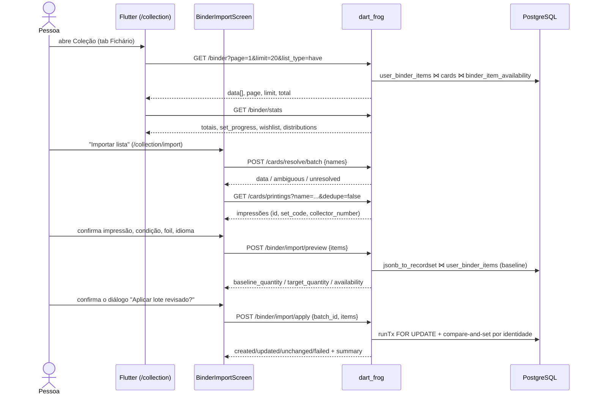

# Fluxo `binder_collection_scanner` — Fichário/coleção: importação em lote, editor, matches e scanner

Estado: documentação de apoio, não autoritativa · gerado em 2026-09-21 sobre o commit d26f23a16 · verificação estática (nenhum teste foi executado) · **revisado adversarialmente em 2026-09-21 — ver §11**: 11 achados confirmados, A6 rebaixado, A12 refutado, A3 corrigido, 7 achados novos (A15-A21) e 8 correções de arquivo:linha no corpo do documento.

---

## 1. Resumo e veredito

| Eixo | Veredito | Evidência |
| --- | --- | --- |
| **Implementado** | **sim** | 8 arquivos de app em `app/lib/features/binder` (8.443 linhas), 11 em `app/lib/features/scanner` (4.587 linhas), **6 handlers de rota de servidor + 1 middleware** (`server/routes/binder/index.dart`, `server/routes/binder/[id]/index.dart`, `server/routes/binder/import/preview/index.dart`, `server/routes/binder/import/apply/index.dart`, `server/routes/binder/_middleware.dart`, `server/routes/community/binders/[userId].dart`, `server/routes/community/trade-matches/index.dart`), views `collection_availability_snapshot` e `binder_item_availability` em `server/database_setup.sql:2144` e `:2218`. A jornada inteira — colar lista → resolver nome → escolher impressão → preview com baseline → apply compare-and-set → fichário paginado → editor → matches de troca → scanner contínuo — existe em código. |
| **Alcançável hoje** | **não** | `server/config/release_capabilities.json` tem as 29 capabilities com `release_capability: "off"` e `allowed: false`. `collection_private` off ⇒ o portão do app (`app/lib/core/config/release_capabilities.dart:470-476`) redireciona `/collection*` para `/home`, e o portão do servidor (`server/routes/_middleware.dart:105-144` + `server/lib/release_capability_policy.dart:176-183`) devolve **404 `capability_unavailable`** para todo `/binder*`. `scanner` off e `ENABLE_SCANNER_RELEASE` com `defaultValue: false` (`app/lib/core/config/launch_features.dart:8-11`) ⇒ o scanner nem é compilado na rota `/decks/:id/scan` (`app/lib/main.dart:607-613`). `trades` off ⇒ `/collection/matches` cai em `/collection?tab=0`, que por sua vez cai em `/home`. |
| **Provado** | **parcial** | Há prova real de comportamento no import (provider + tela + prova visual Web com `ApiClient` falso) e na resiliência da lista do fichário. Mas **toda a camada de rota do servidor deste fluxo é testada só por `contains()` em string de código-fonte** (`server/test/binder_route_test.dart`, `server/test/binder_import_contract_test.dart:118-143`), e dois testes de integração da coleção (`app/integration_test/collection_entrypoints_runtime_test.dart`, `app/integration_test/binder_dashboard_runtime_test.dart`) montam `CollectionScreen` **sem** `ReleaseCapabilitiesProvider` na árvore, o que hoje só pode renderizar a tela "Coleção indisponível nesta versão." — ver achado A1. |

Leitura curta: o código é denso e o contrato de concorrência do import (baseline/target com compare-and-set) é o melhor pedaço deste fluxo. O que falta é (a) prova viva de rota no servidor, (b) simetria de capability entre app e servidor em `/collection/import` **e em `/trades/create/:receiverId`** (achados A2 e A15), e (c) tratamento honesto de erro — que, olhando de perto, não é um problema de mapeamento e sim de **renderização**: `BinderProvider.error` é calculado em cinco pontos e não é lido por nenhuma tela (achado A16).

---

## 2. Jornada passo a passo



| # | Passo | Tela/widget (arquivo:linha) | Provider/serviço | Método + endpoint | Handler do servidor | Serviço/repositório | Tabelas |
| --- | --- | --- | --- | --- | --- | --- | --- |
| 1 | Abrir hub Coleção | `app/lib/main.dart:744-756` → `app/lib/features/collection/screens/collection_screen.dart:30-48` | `ReleaseCapabilitiesProvider` (`release_capabilities.dart:236-251`) | `GET /capabilities` | `server/routes/capabilities/index.dart:8-13` (a rota é isenta de DB por `_middleware.dart:248-255`) | `ReleaseCapabilityPolicy.load` | — (JSON de config) |
| 2 | Escolher tab Fichário (Tenho/Quero) | `collection_screen.dart:51-113` → `app/lib/features/binder/screens/binder_screen.dart:24-147` | — (TabController local) | — | — | — | — |
| 3 | Listar itens paginados | `binder_screen.dart:224-300` (`_fetchItems`) | `BinderProvider.fetchBinderDirect` (`binder_provider.dart:1080-1123`) | `GET /binder?page&limit=20&list_type&condition&search&for_trade&for_sale&set&rarity&language&foil&sort&order` | `server/routes/binder/index.dart:11-19` → `_listBinder:19-266` | SQL inline + `binder_item_availability` | `user_binder_items`, `cards`, `sets`, `deck_cards`, `decks`, `collection_availability_snapshot`, `binder_item_availability` |
| 4 | Barra de estatísticas / progresso | `binder_screen.dart:829-1110` (`_StatsBar`) | `BinderProvider.fetchStats` (`binder_provider.dart:894-927`) | `GET /binder/stats` | `server/routes/binder/[id]/index.dart:13` (`id == 'stats'`) → `_getStats:123-494` | 6 queries em `Future.wait` | `user_binder_items`, `cards`, `sets`, `decks`, `deck_cards`, `collection_availability_snapshot`, `binder_item_availability` |
| 5 | Adicionar carta pela busca | `binder_screen.dart:310-354` (`_openAddCard`) → `CardSearchScreen(mode:'binder')` → `BinderItemEditor.show` (`binder_item_editor.dart:58-80`) | `BinderProvider.addItem` (`binder_provider.dart:930-979`) | `POST /binder` `{card_id, quantity, condition, is_foil, for_trade, for_sale, price?, notes?, language, list_type}` | `server/routes/binder/index.dart:14` → `_addToBinder:306-437` | `readBinder*` (`server/lib/binder_item_contract.dart`) | `user_binder_items` (unique `uq_user_binder_items_physical_identity`, `database_setup.sql:1910`) |
| 6 | Editar item existente | `binder_item_editor.dart:288-356` (`_save`) | `BinderProvider.updateItem` (`binder_provider.dart:982-1043`) | `PUT /binder/:id` (corpo parcial por `containsKey`) | `server/routes/binder/[id]/index.dart:17` → `_updateBinderItem:532-719` | `pool.runTx` + `FOR UPDATE` + checagem de `trade_items` comprometidos | `user_binder_items`, `cards`, `trade_items`, `trade_offers` |
| 7 | Remover item | `binder_item_editor.dart:358+` (`_delete`) | `BinderProvider.removeItem` (`binder_provider.dart:1046-1071`) | `DELETE /binder/:id` | `server/routes/binder/[id]/index.dart:18` → `_deleteBinderItem:722-786` | `runTx` + `FOR UPDATE` + bloqueio por compromisso | `user_binder_items`, `trade_items`, `trade_offers` |
| 8 | Abrir importação em lote | `binder_screen.dart:408-414` (`_openBulkImport`) → `app/lib/main.dart:758-776` | `BinderImportProvider.initialize` (`binder_import_provider.dart:56-92`) | — (lê `SharedPreferences`) | — | `BinderImportDraftStore` (`binder_import_draft_store.dart:24-72`) | — (chave `manaloom.binder_import_draft.v1.<ownerId>`) |
| 9 | Colar texto e revisar | `binder_import_screen.dart:486` (`binder-import-source-field`), `:512` (botão revisar) | `parseBinderImportText` (`binder_import_models.dart:265-331`) + `BinderImportProvider.reviewSource` (`binder_import_provider.dart:99-190`) | `POST /cards/resolve/batch {names}` | `server/routes/cards/resolve/batch/index.dart:28-160` | `resolveDeckCardNameCandidates` | `cards` |
| 10 | Carregar impressões por candidato | `binder_import_screen.dart:154-181` (`_choosePrinting`) | `BinderImportProvider.fetchPrintings` (`binder_import_provider.dart:295-318`) / `_loadCandidatePrintings:541-602` | `GET /cards/printings?name=…&limit=50&dedupe=false` | `server/routes/cards/printings/index.dart:11-68` | `_queryPrintings` (+ sync opcional do Scryfall) | `cards`, `sets` |
| 11 | Preflight do lote | `binder_import_screen.dart:1088` (`binder-import-preview-button`) | `BinderImportProvider.previewBatch` (`binder_import_provider.dart:377-423`) + `buildBinderImportPlans` (`binder_import_models.dart:333-361`) | `POST /binder/import/preview {items[]}` | `server/routes/binder/import/preview/index.dart:16-213` | `readBinderImportItems(requireApplyPlan:false)` + `jsonb_to_recordset` | `user_binder_items`, `cards`, `sets`, `collection_availability_snapshot` |
| 12 | Confirmar e aplicar | `binder_import_screen.dart:115-150` (`_confirmAndApply`, diálogo `binder-import-apply-confirmation`) | `BinderImportProvider.applyBatch` (`binder_import_provider.dart:425-513`) | `POST /binder/import/apply {batch_id, items[baseline_quantity,target_quantity]}` | `server/routes/binder/import/apply/index.dart:15-98` → `_applyItem:100-240` | `pool.runTx` por item, `FOR UPDATE`, `ON CONFLICT DO NOTHING`, compare-and-set | `user_binder_items`, `cards`, `collection_availability_snapshot` |
| 13 | Retry parcial | `binder_import_screen.dart:1067` (`binder-import-retry-button`) | `BinderImportProvider.retryFailed` (`binder_import_provider.dart:515-528`) → `previewBatch` | reexecuta 11 e 12 | idem | idem | idem |
| 14 | Sessão de scanner para o lote | `binder_import_screen.dart:198-216` (`_openScannerSession`) → `card_scanner_screen.dart:18-38` | `ScannerProvider.processImage/processRecognitionResult` (`scanner_provider.dart:130-215`) → `ScannerCardSearchService` | `GET /cards?name=…`, `GET /cards/printings?name=…`, `POST /cards/resolve` | `server/routes/cards/index.dart`, `…/printings/index.dart`, `…/resolve/index.dart` | OCR local (`scanner_ocr_parser.dart`) + fuzzy (`fuzzy_card_matcher.dart`) | `cards`, `sets` |
| 15 | Enfileirar carta escaneada | `card_scanner_screen.dart:352-390` (`_addCardToDeck`, ramo binder) | `BinderImportProvider.addScannedCard` (`binder_import_provider.dart:246-293`) | — (só estado local + rascunho) | — | `BinderImportDraftStore.saveDraft` | — |
| 16 | Scanner direto no fichário | `binder_screen.dart:356-403` (`_openScanCard`) → `BinderItemEditor.show` | `BinderProvider.addItem` | `POST /binder` | idem passo 5 | idem | idem |
| 17 | Matches de troca | `binder_screen.dart:472` (`tradeMatchesRouteLocation()`) → `app/lib/main.dart:778-781` → `app/lib/features/trades/screens/trade_matches_screen.dart:34-44` | `CommunityProvider.fetchTradeMatchResult` (`community_provider.dart:519-575`) | `GET /community/trade-matches[?deck_id=…]` | `server/routes/community/trade-matches/index.dart:8-34` | `CommunityEngagementService.findTradeMatches` (`server/lib/community_engagement_service.dart:176-429`) | `collection_availability_snapshot`, `binder_item_availability`, `user_binder_items`, `cards`, `sets`, `users`, `user_follows`, `user_blocks`, `deck_cards` |
| 18 | Propor troca a partir de um match | `trade_matches_screen.dart:46-58` (`_openProposal`) | `createTradeRouteLocation` (`app/lib/features/trades/trade_route_contract.dart:37-65`) | navega `/trades/create/:receiverId?item=…&type=…&source=…` | `server/routes/trades/index.dart` (fora deste fluxo) | — | `trade_offers`, `trade_items` |
| 19 | Fichário público de outro jogador | `app/lib/features/social/...` (perfil) | `BinderProvider.fetchPublicBinder` / `fetchPublicBinderItemDirect` (`binder_provider.dart:1131-1248`) | `GET /community/binders/:userId?page&limit&list_type&item_id` | `server/routes/community/binders/[userId].dart:9-302` | SQL inline com regras de visibilidade e bloqueio | `user_binder_items`, `cards`, `sets`, `users`, `user_blocks`, `trade_offers`, `binder_item_availability` |

Observação sobre o passo 3: a lista visível **não** usa `BinderProvider.fetchMyBinder` (que existe em `binder_provider.dart:789-863` e tem tratamento de erro melhor). Ela usa `fetchBinderDirect`, que devolve `null` para qualquer falha — ver achado A4.

---

## 3. Capabilities e portões

### 3.1 Portão do app (`app/lib/core/config/release_capabilities.dart`)

| Rota do app | Capability exigida | Ordem de avaliação | Fallback visível |
| --- | --- | --- | --- |
| `/collection`, `/collection/**`, `/binder`, `/binder/**` | `collection_private` | `:470-476` (primeira regra a bater) | `redirect → /home` |
| `/collection/sets`, `/collection/sets/:code`, `/collection/latest-set` | `collection_private` **e depois** `catalog_private` | `:478-483` | `redirect → /collection?tab=0` |
| `/collection/matches` | `collection_private` **e depois** `trades` | `:490-493` | `redirect → /collection?tab=0` |
| `/collection?tab=1` | `collection_private` + `marketplace` | `:501-511` | `redirect → /collection?tab=0` |
| `/collection?tab=2` | `collection_private` + `trades` | `:501-511` | `redirect → /collection?tab=0` |
| `/collection?tab=3` | `collection_private` + `catalog_private` | `:501-511` | `redirect → /collection?tab=0` |
| `/decks/:id/scan` | `scanner` **e** `buildSupport.scanner` | `:391-395` | `redirect → /decks/:id/search` |
| `/collection/import` | **só** `collection_private` | `:470-476` | `redirect → /home` |

Além do router, há três portões *inline* dentro das telas:
- `collection_screen.dart:89-91` — cada tab só existe se sua capability estiver `allowed`; se nenhuma estiver, a tela é `_CollectionUnavailableScaffold` ("Coleção indisponível nesta versão.", `:284-311`).
- `binder_screen.dart:445-450` + `:470-479` — o botão de scanner só é renderizado quando `scanner` está `allowed` com `buildSupported`; `_openScanCard:356-363` revalida e **retorna em silêncio** se negado.
- `binder_import_screen.dart:198-206` + `:240-245` — mesmo padrão para a sessão contínua de scanner.

### 3.2 Portão do servidor (`server/routes/_middleware.dart:105-144`, mapa em `server/lib/release_capability_policy.dart`)

| Caminho do servidor | Capability | Linha |
| --- | --- | --- |
| `/binder`, `/binder/**` (inclui `/binder/stats`, `/binder/availability`, `/binder/import/preview`, `/binder/import/apply`) | `collection_private` | `:534-536` |
| `/cards`, `/cards/**`, `/sets`, `/sets/**` | `catalog_private` | `:525-533` |
| `/community/binders`, `/community/binders/**` | `binder_public` | `:505-508` |
| `/community/trade-matches`, `/community/trade-matches/**`, `/trades`, `/trades/**` | `trades` | `:509-513` |
| `/community/marketplace/**` | `marketplace` | `:514-517` |

Negação: **404** com corpo `{error: "capability_unavailable", capability, release_capability, policy_version, policy_digest_sha256, offer_mode}` (`release_capability_policy.dart:187-193`, resposta montada em `_middleware.dart:128-143`). Rota não classificada e fora do allowlist: **404 `capability_route_unclassified`** (`:168-178`). Config inválida: **503 `capability_policy_invalid`** (`:179-185`). *(Conferido na rodada 2: os três intervalos citados na versão anterior deste documento — `:176-183`, `:161-167`, `:169-175` — estavam deslocados ~8 linhas.)*

### 3.3 Os nomes batem dos dois lados?

Sim para os cinco nomes usados por este fluxo — `collection_private`, `catalog_private`, `binder_public`, `trades`, `scanner` são idênticos no enum do app (`release_capabilities.dart:9-31`) e no `releaseCapabilityKeys` do servidor (`release_capability_policy.dart:15-43`). `app/test/core/config/release_capability_surface_contract_test.dart:162-177` prova essa paridade de nomes lendo `../server/config/release_capabilities.json` e exigindo 29 chaves.

O que **não** bate é o *mapeamento rota→capability*: nenhum teste compara `ReleaseCapabilityRouteGuard.redirectFor` com `requiredCapabilityForRequest`. As assimetrias reais estão no achado A2.

### 3.4 Alcançável hoje?

Não. Todas as 29 entradas de `server/config/release_capabilities.json` estão `off`/`allowed:false`, com `policy_version: brewtact_free_beta_2026-08-13` e `live_verified_as_of: null`. Consequências concretas:

- O usuário que digitar `/collection` é redirecionado para `/home` antes de qualquer chamada HTTP.
- Se o snapshot do app ficar `denied()` por falha de rede (`release_capabilities.dart:302-306`), o efeito é o mesmo — fail-closed, correto.
- Se alguém ligar só `collection_private`, a tela do fichário abre e o import abre, mas `POST /cards/resolve/batch` e `GET /cards/printings` devolvem 404 `capability_unavailable` porque dependem de `catalog_private` — a fila fica inteira em `failed` com a mensagem "Falha de conexão. O rascunho foi preservado." (achado A2/A5).
- Scanner exige dois interruptores independentes: `ENABLE_SCANNER_RELEASE` no build (`launch_features.dart:8-11`, default `false`) **e** `scanner.allowed` no servidor.

---

## 4. Contrato app↔servidor (por endpoint)

| Endpoint | App (arquivo:linha) | Servidor (arquivo:linha) | Corpo/params enviados | Campos lidos da resposta | Divergências |
| --- | --- | --- | --- | --- | --- |
| `GET /binder` | `binder_provider.dart:1096-1116` (e `:818-843`) | `server/routes/binder/index.dart:19-251` | `page, limit, list_type, condition, search, for_trade, for_sale, set, rarity, language, foil, sort, order` | `data[]` → `BinderItem.fromJson` | Servidor aceita `min_price`/`max_price` (`index.dart:37-38,81-88`) e o alias `is_foil` (`:36`) que **o app nunca envia**. Servidor devolve `total` (`:250`) e `used_in_decks` (`:238`) que **o app nunca lê**; a paginação do app usa a heurística `res.length >= 20` (`binder_screen.dart:277`). Enums coincidem: `sort` ∈ {name,set,rarity,condition,language,foil,quantity,price,updated_at} (`index.dart:268-282`) e o app só manda valores desse conjunto. `limit` é clampado em 1..100 (`:26`) mas `page` **não** tem piso: `page=0` gera `OFFSET -20` (`:27,165-167`) e o Postgres recusa → 500. `search` vira `LIKE '%…%'` sem escapar `%`/`_` (`:61-63`) — ver achados A19/A20. |
| `GET /binder/stats` | `binder_provider.dart:896` | `server/routes/binder/[id]/index.dart:13,123-494` | — | todos os 20 campos de `BinderStats.fromJson` (`binder_provider.dart:394-441`) | Nenhuma divergência de campo. Rota é um caso especial de `[id]` — não existe arquivo `routes/binder/stats/…` no disco. |
| `POST /binder` | `binder_provider.dart:943-956` | `server/routes/binder/index.dart:306-437` | `card_id, quantity, condition, is_foil, for_trade, for_sale, language, list_type, price?, notes?` | só `statusCode == 201` (corpo ignorado, refetch) | O app **nunca envia `currency`** e o servidor **nunca lê nem escreve `currency`**, apesar de a coluna existir com `CHECK (currency IN ('BRL','USD'))` (`database_setup.sql:1892-1893`) e de o app exibir `item.currency` em `CurrencyFormatter.format`. Preço do usuário é sempre BRL na prática. 409 `binder_item_identity_conflict` (`:391-399`) não recebe tratamento específico no app. |
| `PUT /binder/:id` | `binder_provider.dart:984` | `server/routes/binder/[id]/index.dart:17,532-719` | mapa parcial vindo do editor (`binder_item_editor.dart:315-333`) | `statusCode == 200` | O servidor decide o SET por `body.containsKey` (`:549-601`); o editor sempre envia `price` (inclusive `null`, `:328`), o que **zera o preço** sempre que `for_sale` estiver desligado — comportamento intencional (`binder_item_editor.dart:297-300`) mas não documentado. Colisão de identidade física no UPDATE é capturada por `on ServerException` com `code == '23505'` e vira **409 `binder_item_identity_conflict`** (`[id]/index.dart:684-693`) — não é 500. Mas nem esse 409 nem o `binder_item_committed` (`:788-797`) chegam ao usuário: o editor descarta `provider.error` (achado A7) e `BinderProvider.error` não tem nenhum consumidor de UI (achado A16). |
| `DELETE /binder/:id` | `binder_provider.dart:1048` | `server/routes/binder/[id]/index.dart:18,722-786` | — | 200 ou 204 | Servidor devolve **204 sem corpo** (`:770`); app aceita os dois (`:1049`). Provado em `app/test/features/binder/providers/binder_provider_test.dart:254-271`. |
| `POST /binder/import/preview` | `binder_import_provider.dart:384-410` | `server/routes/binder/import/preview/index.dart:16-213` | `{items:[{input_id, card_id, quantity, condition, is_foil, language, list_type}]}` | `data[].{status,action,existing_id,baseline_quantity,target_quantity,card,availability}`, `summary` | App **não lê** `total_input`/`total_ready`/`total_rejected` (`:189-192`). Limite de 100 itens (`server/lib/binder_import_contract.dart:13,63-68`) **não é conhecido nem respeitado pelo cliente** — achado A3. |
| `POST /binder/import/apply` | `binder_import_provider.dart:432-501` | `server/routes/binder/import/apply/index.dart:15-98` | `{batch_id, items:[…, baseline_quantity, target_quantity]}` | `data[].{input_id,status,code,message}`, `summary`, `batch_id`, `total_applied`, `total_failed` | App **não lê** `partial_failure` nem `replay_safe` (`:76-77`). `batch_id` é validado (`binder_import_contract.dart:101-109`) mas **nunca persistido** — não existe livro-razão de idempotência no servidor; a idempotência vem do compare-and-set por identidade, não do batch. |
| `GET /community/trade-matches` | `community_provider.dart:527` | `server/routes/community/trade-matches/index.dart:8-34` | `deck_id?` | `matches[]`, `source`, `deck_id`, `message` | App **não envia `limit`**, servidor usa default 40 (`:17`). App **não lê** `match_count` (`community_engagement_service.dart:427`). Enum de `source` diverge: servidor só devolve `all_deck_missing_and_wishlist` (sem deck) ou `deck_missing_and_wishlist` (`community_engagement_service.dart:186,421-424`); o app fabrica `wishlist` tanto como default do caminho 200 (`community_provider.dart:539`) quanto nos dois caminhos de erro (`:546-548`, `:565-567`) — valor que o servidor **nunca** produz. Deck não pertencente ao usuário devolve **200** com `matches: []` e `message: "Deck nao encontrado."` (`:183-191`), sem `deck_id` nem `match_count`: no app isso vira o estado vazio (`trade_matches_screen.dart:110-123`), não um erro — e a frase sem acento é exibida literalmente ao usuário. |
| `GET /community/binders/:userId` | `binder_provider.dart:1138,1181,1217`; chamadores reais: `user_profile_screen.dart:166,1191` e `create_trade_screen.dart:151,739` | `server/routes/community/binders/[userId].dart:9-302` | `page, limit, list_type, item_id` | `owner{}`, `data[]` | `item_id` é validado como UUID e filtra por `bi.id` (`:27-34,60-63`) — o app depende disso para reconstruir rascunho de troca (`binder_provider.dart:1163-1193`). Para `list_type=have` o servidor exige `available_quantity > 0` (`:44-46`) e devolve **available_quantity no campo `quantity`** (`:197-200,259-260`), então a quantidade física real nunca é exposta. `userId` entra cru no SQL como `@userId`: um path parameter que não seja UUID vira `22P02` e **500** (`:295-301`), não 404. Servidor devolve `total` que o app ignora. Handler usa `print(...)` em vez de `Log.e` no catch (`:296`). |
| `POST /cards/resolve/batch` | `binder_import_provider.dart:128-149` | `server/routes/cards/resolve/batch/index.dart:28-160` | `{names:[…]}` | `data[].{input_name,matched_name}`, `ambiguous[].{input_name,candidates}`, `unresolved[]` | Limite de **200 nomes** (`:73-79`) desconhecido pelo cliente — achado A5. App ignora `total_input`/`total_resolved`. |
| `GET /cards/printings` | `binder_import_provider.dart:300-302`, `scanner_card_search_service.dart:52-55` | `server/routes/cards/printings/index.dart:11-68` | `name, limit, dedupe` | `data[]` | Servidor devolve `oracle_id`, `layout` e `card_faces` (`:274`, via `cardIdentitySelectSql`); `ScannerCardSearchService._cardFromJson` (`:119-145`) **descarta os três** — achado A8. |

**Endpoints chamados que não existem:** nenhum. Todos os 11 caminhos deste fluxo têm arquivo de rota no disco.

**Endpoints/expostos que ninguém neste fluxo chama:** `GET /binder/availability` (`server/routes/binder/[id]/index.dart:14,27-120`) só é consumido pela busca de cartas do deck (`app/lib/features/cards/providers/card_provider.dart:343`), não pelo fichário.

---

## 5. Dados (tabelas, migrações)

Não existe diretório `server/migrations`. O schema inteiro vive em **`server/database_setup.sql`**, aplicado por `server/bin/migrate.dart` (idempotente: `CREATE TABLE IF NOT EXISTS` + `ALTER … IF NOT EXISTS`).

| Objeto | Definição | Papel neste fluxo |
| --- | --- | --- |
| `user_binder_items` | `database_setup.sql:1881-1900` | Fonte da verdade da cópia física. `quantity > 0`, `condition ∈ {NM,LP,MP,HP,DMG}`, `currency ∈ {BRL,USD}`, `list_type ∈ {have,want}`. |
| `uq_user_binder_items_physical_identity` | `:1910-1913` | Índice único `(user_id, card_id, condition, is_foil, language, list_type)` — é o alvo dos `ON CONFLICT` do POST (`binder/index.dart:349-351`) e do apply (`apply/index.dart:170-172`). |
| `chk_user_binder_items_language` | `:1916-1919` | `language ~ '^[a-z]{2,3}(-[a-z0-9]{2,8})*$'` — espelha `_languagePattern` em `binder_item_contract.dart:18-20`. |
| `idx_binder_user`, `idx_binder_card`, `idx_binder_for_trade`, `idx_binder_for_sale` | `:1920-1925` | Suporte às consultas de listagem e de matches. |
| `collection_availability_snapshot` (VIEW) | `:2144-2216` | Calcula por identidade jogável (`COALESCE(oracle_id, id)`): `owned`, `allocated` (deck_cards de decks não deletados), `committed_trade_quantity` (trades `pending/accepted/shipped/delivered/disputed`), `free = owned − allocated − committed`, `missing = allocated − owned`, `wanted_missing`. |
| `binder_item_availability` (VIEW) | `:2218-2244` | Distribui `free_quantity` entre as cópias físicas por prioridade (`for_trade OR for_sale` primeiro, depois `updated_at`, `id`) e devolve `available_quantity` por item. Só considera `list_type = 'have'` — por isso itens de wishlist sempre chegam com `available_quantity = 0`. |
| `trade_offers` / `trade_items` | `:1927-1966` / `:1968-1980` (FK `binder_item_id` em `:1971` e redefinida em `:1983-1985`) | `binder_item_id` com `ON DELETE SET NULL`; consultados nas travas de update/delete (`binder/[id]/index.dart:634-647`, `:744-757`). |
| `cards`, `sets` | — | Impressão, `oracle_id`, `layout`, `card_faces_json`, `price_usd`/`price`, nome canônico do set. |
| `SharedPreferences` do dispositivo | `binder_import_draft_store.dart:20-22` | Rascunho (`manaloom.binder_import_draft.v1.<ownerId>`) e histórico (`…history.v1.<ownerId>`, teto de 10). **Não sincroniza com o servidor.** |

Nenhuma migração nova é exigida por este fluxo — coerente com `docs/MANALOOM_COLLECTION_INGESTION_CONTRACT.md` (`Status: accepted_phase_1_no_migration`).

---

## 6. Estados e erros

| Estado | Tratado? | Onde | Observação |
| --- | --- | --- | --- |
| Carregando (lista) | sim | `binder_screen.dart:547-554` (`binder-list-loading-<listType>`) | Só quando `_items` está vazio; paginação usa spinner de rodapé (`:718`). |
| Carregando (rascunho do import) | sim | `binder_import_screen.dart:280-286` (`binder-import-draft-loading`) | |
| Carregando (matches) | sim | `trade_matches_screen.dart:84-92` (`trade-matches-loading`) | |
| Vazio (lista) | sim | `binder_screen.dart:571` (`binder-list-empty-<listType>`) com CTAs importar/buscar/escanear | Distinto do estado de erro — provado em `binder_screen_resilience_test.dart:198-212`. |
| Vazio (matches) | sim | `trade_matches_screen.dart:110-123` (`trade-matches-empty`) | Também recebe o caso "deck não encontrado" do servidor (200 + message), o que é ambíguo. |
| Vazio (revisão do import) | sim | `binder_import_screen.dart:575` (`binder-import-empty-review`) | |
| Erro de rede (lista) | parcial | `binder_screen.dart:282-296` | Mensagem única "Verifique sua conexão e tente novamente." para 401/403/404/500/timeout — achado A4. |
| Erro de rede (matches) | sim | `trade_matches_screen.dart:95-108` + retry (`trade-matches-retry`) | |
| Erro de rede (import) | sim | `binder_import_provider.dart:172-186`, `:411-418`, `:502-508` | Mas usa `fromException` sobre um `StateError` sintético, perdendo o status — achados A3/A5. |
| 401 / sessão expirada | **sim** (auditado na rodada 2) | `api_client.dart:96-117` + `:623-627` dispara `_sessionExpiredHandler` uma única vez; o handler é `AuthProvider.expireSession` (`main.dart:282`) | Só dispara quando o corpo do 401 contém `token`/`invalid_session`/`authentication_required`/etc. O 401 de `/community/trade-matches` usa `'Autenticacao necessaria.'` (`community_request_auth.dart:18-23`), coberto por `signal.contains('autenticacao necessaria')` (`api_client.dart:113`). As rotas `/binder/**` passam por `authMiddleware` (`server/routes/binder/_middleware.dart:6`), cujos corpos são `'Token de autenticação não fornecido'` e `'Token inválido ou expirado'` (`server/lib/auth_middleware.dart:31,49`) — ambos casam com `signal.contains('token')` (`api_client.dart:109`). **Consequência para o achado A4**: um 401 na lista do fichário derruba a sessão globalmente e leva ao `/login`; a frase "Verifique sua conexão" só é o desfecho final para 404/500/timeout. |
| 403 de capability | n/a | — | O servidor **nunca** devolve 403 por capability; devolve 404. |
| 404 de capability | **mal tratado no mapper, invisível na tela** | `friendly_error_mapper.dart:261-322` | O corpo `{"error":"capability_unavailable"}` passa por `_looksTechnical` (`:345-368`) sem casar nenhum padrão e é devolvido **verbatim** pelo mapper. Mas neste fluxo nenhuma tela renderiza esse texto: `BinderProvider.error`/`marketError` não têm consumidor (A16) e o import usa `fromException` sobre `StateError`, não `fromApiResponse` — achados A6 (rebaixado) e A16. |
| Validação de entrada (editor) | sim | `binder_item_editor.dart:288-307` (card_id obrigatório, preço > 0 quando `for_sale`) | Provado em `binder_item_editor_validation_test.dart:184-255`, `:294-339`. |
| Validação de entrada (import) | sim | `binder_import_models.dart:277-303` (linhas inválidas isoladas), exibidas em `binder_import_screen.dart:1209` | |
| Validação do servidor | sim | `binder_item_contract.dart`, `binder_import_contract.dart` — códigos estáveis (`binder_quantity_invalid`, `binder_import_plan_mismatch`, …) | |
| Offline / retry | parcial | `FriendlyErrorMapper.offlineContractForContext` mapeia `binder → OfflineProductFlow.binderMutation` (`:254`) mas **nenhuma tela de binder ou collection consome esse contrato** (grep sem resultado em `app/lib/features/binder`, `.../collection`). O scanner **consome**: `scanner_error_mapper.dart:17-18` usa `offlineContractFor(OfflineProductFlow.cardCatalog)`. O import salva rascunho local, que é a mitigação real no fichário. |
| Concorrência — duplo toque no apply | sim | `canApply` fica `false` assim que `isApplying` ou assim que `plan.status` sai de `'ready'` (`binder_import_provider.dart:53-54`, `binder_import_models.dart:155-156`) | Dois diálogos empilhados são possíveis, mas o segundo `applyBatch` sai no guard. |
| Concorrência — inventário mudou entre preview e apply | sim | `apply/index.dart:219-221,242-255` devolve `binder_import_inventory_changed` com `current_quantity`; app marca o candidato como `failed` e mantém no rascunho | Provado em `binder_import_provider_test.dart:236-265`. |
| Concorrência — replay do mesmo plano | sim | `apply/index.dart:209-218` devolve `unchanged` quando `currentQuantity == targetQuantity` | |
| Concorrência — item comprometido em troca ativa | sim | `binder/[id]/index.dart:634-667` e `:744-761` → 409 `binder_item_committed` | |
| Concorrência — respostas fora de ordem na lista | sim | geração monotônica em `binder_screen.dart:236,268` e `binder_provider.dart:799,835` | Provado em `binder_screen_resilience_test.dart:255-306` e `binder_provider_test.dart:323-373`. |
| Falha de `fetchStats` | **não tratado** | `binder_provider.dart:924-926` engole a exceção sem estado de erro | A barra de estatísticas some (`binder_screen.dart:454-465` exige `hasStatsData`) e junto com ela o atalho de matches (`:993-995`), sem nenhum sinal ao usuário. |
| Permissão de câmera negada | sim | `card_scanner_screen.dart:82-95` com texto distinto para negação permanente | |
| Scanner negado por capability | parcial | botões escondidos (`binder_screen.dart:470,478`, `binder_import_screen.dart:308,343`); `_openScanCard:356-363` e `_openScannerSession:198-206` retornam em silêncio | Se a capability cair entre o build e o toque, nada é dito ao usuário. |

---

## 7. Testes por passo e lacunas

| # | Passo | Teste que exercita | O que de fato afirma |
| --- | --- | --- | --- |
| 1-2 | Hub + tabs | `app/test/features/collection/collection_screen_responsive_test.dart:128,144,168` | Monta `CollectionScreen` com capabilities semeadas, checa ausência de overflow em 3 larguras e que a URL canônica `/collection?tab=N` é preservada. Comportamento real. |
| 3 | Listagem paginada | `app/test/features/binder/screens/binder_screen_resilience_test.dart:198,214,255` | Distingue erro de vazio; falha de paginação preserva itens, para o spinner e oferece retry; filtro novo supera página em voo. Comportamento real e forte. |
| 3 | Listagem paginada | `app/test/features/binder/screens/binder_screen_overflow_test.dart:77,82,87` | Só layout (320/375/1280 px). |
| 4 | Estatísticas | `app/test/features/binder/providers/binder_provider_test.dart:142,220` | `BinderStats.fromJson` com moedas separadas e vocabulário owned/allocated/free/missing. Não exercita `fetchStats` nem a barra. |
| 5-7 | Add/update/delete | `binder_provider_test.dart:254,273,288,303` | 204 tratado como sucesso; `language` viaja no corpo; `list_type` altera a lista local. Comportamento real com `ApiClient` falso. |
| 5-7 | Editor | `app/test/features/binder/widgets/binder_item_editor_validation_test.dart:124,184,256,294,340,355,389,435` | Valida preço, preserva o formulário em falha de transporte, mantém o `card_id` recebido. Comportamento real. |
| 5-7 | Servidor | `server/test/binder_route_test.dart:7,43,64,75,84` | **Só `contains()` em string** de `routes/binder/index.dart` e `routes/binder/[id]/index.dart`. Nenhuma requisição, nenhum banco. |
| 5-7 | Servidor (validação) | `server/test/binder_item_contract_test.dart:6,16,34` | Exercita de verdade `readBinder*` (unidade pura). |
| 9 | Parser de texto | `app/test/features/binder/models/binder_import_models_test.dart:6,27,40,78` | Agrupa duplicatas, preserva hints de set/collector, `have`/`want`, round-trip do rascunho. Comportamento real. |
| 9-13 | Provider do import | `app/test/features/binder/providers/binder_import_provider_test.dart:160,192,236` | Sessão de scanner agrupa scans repetidos; exige impressão explícita; preview traz baseline; apply uma vez; falha parcial fica no rascunho e o retry recalcula o baseline. **O melhor teste do fluxo.** |
| 11-12 | Tela do import | `app/test/features/binder/screens/binder_import_screen_test.dart:198,264` | Nada é persistido antes do "Aplicar lote"; após confirmar, `applyCalls == 1`, resumo e histórico aparecem, e o onboarding é concluído. Comportamento real. |
| 11-12 | Contrato do import (servidor) | `server/test/binder_import_contract_test.dart:33,45,67,103` | Unidade real: normalização, `target == baseline + quantity`, duplicidade de identidade, lote > 100, `input_id`/`batch_id`. |
| 11-12 | Rotas do import (servidor) | `server/test/binder_import_contract_test.dart:119,131` | **Só `contains()`** em `routes/binder/import/preview/index.dart` e `…/apply/index.dart`. |
| 11-13 | Prova visual Web | `app/integration_test/binder_import_visual_runtime_proof_test.dart:311` | Roda a tela real com `ApiClient` falso e captura checkpoints (`binder_import_00_source` … histórico). Exercita revisão, duplicatas, linha inválida, preview, apply, retry parcial. Script: `scripts/manaloom_binder_import_visual_qa.sh`. |
| 14-16 | Scanner → coleção | `app/test/features/scanner/scanner_collection_session_contract_test.dart:6` | **Só `contains()`** em duas fontes. Não abre a câmera, não roda OCR, não prova o enfileiramento. |
| 17 | Matches | `app/test/features/trades/screens/trade_matches_screen_test.dart:53,96,135,199,224` | Renderiza matches, expõe a cópia exata, abre URL de proposta recuperável, estado vazio com CTA e estado de falha com retry. Comportamento real. |
| 17 | Matches (servidor) | `server/test/community_engagement_contract_test.dart:7,58,78` | **Só `contains()`** em `routes/community/trade-matches/index.dart` e no serviço. |
| — | Views de disponibilidade | `server/test/collection_availability_contract_test.dart:17,40,58,69` e `…_route_contract_test.dart:9-77` | Lêem `database_setup.sql` e arquivos de rota e comparam strings SQL normalizadas. Garantem vocabulário, **não** resultado. `collection_availability_live_test.dart:114` é o único com banco real, e roda sob tag `live`, excluída do perfil `full` do gate (`scripts/quality_gate.sh:89`). |
| — | Paridade de capability | `app/test/core/config/release_capability_surface_contract_test.dart:8,162,179` | Tokens obrigatórios por arquivo (string) + paridade de **nomes** entre enum e JSON (real). Não compara mapeamentos rota→capability. |

> **Nota da rodada 2 sobre o alcance do gate.** `scripts/quality_gate.sh:112-113` roda `"$FLUTTER_BIN" test` **sem alvo**, o que cobre só `app/test/`. Nada em `app/integration_test/` entra no gate — nem as provas visuais, nem os dois testes quebrados do achado A1. Do lado do servidor, o perfil `full` exclui `live || live_backend || live_db_write || live_external || historical_external_snapshot` (`:89`); o perfil `quick` (`:59-63`) roda `dart test` **sem** `--exclude-tags`.

### Passos sem nenhum teste (contagem: 6)

1. **Passo 3 com falha de capability/401** — nada exercita `fetchBinderDirect` devolvendo `null` por 404 `capability_unavailable` vs. timeout.
2. **Passo 4 (`fetchStats`) falhando** — nenhum teste cobre a barra sumindo silenciosamente.
3. **Passo 9 com > 200 nomes** (400 de `/cards/resolve/batch`).
4. **Passo 11 com > 100 identidades** (400 `binder_import_items_limit_exceeded`).
5. **Passo 14-16** — o scanner não tem nenhum teste de comportamento; só um `contains()` de 23 linhas.
6. **Passo 19** (`/community/binders/:userId`) — `fetchPublicBinderItemDirect` é testado contra um falso que **ignora** `item_id` (`binder_provider_test.dart:16-33`), então o filtro do servidor nunca é exercitado ponta a ponta.

### Testes que só verificam string/posição

- `server/test/binder_route_test.dart` (inteiro, 94 linhas) — 5 testes, 0 comportamento.
- `server/test/binder_import_contract_test.dart:118-143` — o grupo "route source guards".
- `server/test/community_engagement_contract_test.dart` (inteiro, 99 linhas).
- `server/test/collection_availability_contract_test.dart` e `collection_availability_route_contract_test.dart` — comparam SQL como texto.
- `app/test/features/scanner/scanner_collection_session_contract_test.dart` (inteiro).
- `app/test/core/config/release_capability_surface_contract_test.dart:8-160` — o primeiro teste é uma tabela de `contains()`.
- `app/test/features/binder/screens/binder_screen_overflow_test.dart` — só geometria.

---

## 8. Achados

| ID | Tipo | Sev. | Descrição | Arquivo:linha | Como provar |
| --- | --- | --- | --- | --- | --- |
| A1 | passo-sem-teste / bug-provável | **alta** | `collection_entrypoints_runtime_test.dart` e `binder_dashboard_runtime_test.dart` montam `CollectionScreen` **sem** `ReleaseCapabilitiesProvider` no `MultiProvider`. `collection_screen.dart:31-38` lê `context.watch<ReleaseCapabilitiesProvider?>()` → `null` → `sections` vazio → renderiza `_CollectionUnavailableScaffold`. Logo `find.widgetWithText(Tab, 'Fichário')` nunca resolve e `pumpUntilFound` estoura o timeout (`runtime_test_helpers.dart:41` → `fail`). Os dois testes não podem passar como estão. **Confirmado na rodada 2 por que ninguém percebeu**: o gate não executa `integration_test/` — `scripts/quality_gate.sh:112-113` roda `flutter test` sem alvo, ou seja, só o diretório `test/`. O padrão correto já existe no próprio repositório e é aplicado no teste de widget equivalente (`app/test/features/collection/collection_screen_responsive_test.dart:105,192` semeia `ReleaseCapabilitiesProvider.seeded(ReleaseCapability.values)`). | `app/integration_test/collection_entrypoints_runtime_test.dart:24-42`; `app/integration_test/binder_dashboard_runtime_test.dart:199-211`; provedores em `:322-330` | Rodar `flutter test integration_test/collection_entrypoints_runtime_test.dart` (ou o driver Web equivalente) e observar `Timeout waiting for …Fichário`. Correção: injetar `ReleaseCapabilitiesProvider.seeded({collectionPrivate, marketplace, trades, catalogPrivate})` como já fazem `visual_system_workspace_runtime_proof_test.dart:308` e `critical_overlays_states_runtime_proof_test.dart:454`. |
| A2 | incoerencia-app-servidor / capability | **alta** | `/collection/import` é protegido no app **só** por `collection_private` (`release_capabilities.dart:470-476`), mas a tela depende de `POST /cards/resolve/batch` e `GET /cards/printings`, que no servidor exigem `catalog_private` (`release_capability_policy.dart:525-533`). Com `collection_private=on` e `catalog_private=off` a tela abre, o usuário cola a lista, e **toda** a fila cai em `failed` com "Falha de conexão. O rascunho foi preservado." Assimetria oposta também existe: `/collection/matches` exige `collection_private` **e** `trades` no app, enquanto `/community/trade-matches` exige só `trades` no servidor. | `app/lib/core/config/release_capabilities.dart:470-493`; `app/lib/features/binder/providers/binder_import_provider.dart:128,300`; `server/lib/release_capability_policy.dart:509-536` | Escrever um teste de unidade que, para cada rota de app deste fluxo, compare o conjunto de capabilities do `ReleaseCapabilityRouteGuard` com o conjunto exigido por `requiredCapabilityForRequest` nos endpoints que a tela chama. Prova viva: subir o servidor com `MANALOOM_ISOLATED_RELEASE_CAPABILITIES_FILE` contendo `collection_private=on`, `catalog_private=off`, abrir `/collection/import` e colar `1 Sol Ring`. |
| A3 | bug-provável | **média** | O lote de import é limitado a **100 identidades físicas** no servidor (`binder_import_contract.dart:13,63-68`), limite que está escrito em `docs/MANALOOM_COLLECTION_INGESTION_CONTRACT.md:26`. O cliente não conhece esse número: `previewBatch` envia `_plans` inteiro (`binder_import_provider.dart:384-388`), recebe 400 `binder_import_items_limit_exceeded`, lança `StateError('preview returned 400')` (`:389-391`) e trata via `FriendlyErrorMapper.fromException` (`:411-418`). **Correção da rodada 2:** o texto final *não* é o fallback "Não foi possível montar o plano". `fromException` extrai o "400" da mensagem do `StateError` por regex (`friendly_error_mapper.dart:149-155`), chama `fromStatusCode(400, context: binder)` e cai no ramo explícito do fichário (`:72-73`), devolvendo **"Não foi possível atualizar o fichário. Revise os dados e tente novamente."** — uma frase de validação de formulário para um erro de tamanho de lote. A mensagem real do servidor ("Revise no máximo 100 cartas por lote.") é descartada do mesmo jeito, porque o corpo da resposta nunca chega ao mapper. | `app/lib/features/binder/providers/binder_import_provider.dart:384-418`; `server/lib/binder_import_contract.dart:63-68` | Teste de provider: `ApiClient` falso que devolve `ApiResponse(400, {'error':'Revise no máximo 100 cartas por lote.','code':'binder_import_items_limit_exceeded'})` para `/binder/import/preview`; hoje `provider.error` não contém "100". Correção: usar `FriendlyErrorMapper.fromApiResponse(response, …)` antes de lançar, e avisar na UI a partir de ~90 identidades. |
| A4 | ux-funcional / estado-nao-tratado | **média** | `BinderProvider.fetchBinderDirect` devolve `null` para **qualquer** desfecho não-200 e para qualquer exceção (`binder_provider.dart:1112-1122`), descartando `statusCode` e corpo. A lista visível (`_BinderListView`) usa essa função, então 401 (sessão expirada), 404 `capability_unavailable` e 500 viram a mesma frase: "Verifique sua conexão e tente novamente." (`binder_screen.dart:282-284`). O caminho "bom" existe e está sem uso: `fetchMyBinder` usa `FriendlyErrorMapper.fromApiResponse` (`:846-850`) — mas esse texto também não é renderizado por ninguém (A16), então a correção precisa ir até a tela. **Ressalva da rodada 2:** o caso 401 é o *menos* grave dos três, porque `ApiClient` detecta o 401 do `authMiddleware` pelo corpo (`api_client.dart:109`) e dispara `AuthProvider.expireSession` (`main.dart:282`), levando ao `/login`. Os desfechos que ficam mesmo presos em "Verifique sua conexão" são **404 `capability_unavailable`** e **500**. | `app/lib/features/binder/providers/binder_provider.dart:1080-1123`; `app/lib/features/binder/screens/binder_screen.dart:281-296` | Teste de widget com um `BinderProvider` falso que devolve 404 `capability_unavailable` e outro que devolve 500: hoje os dois mostram "Verifique sua conexão e tente novamente." Correção: fazer `fetchBinderDirect` devolver um resultado tipado (itens + erro amigável) e renderizá-lo em `binder-list-error-<listType>`. |
| A5 | bug-provável | **média** | `POST /cards/resolve/batch` aceita no máximo **200 nomes** (`server/routes/cards/resolve/batch/index.dart:73-79`). `reviewSource` manda todos os nomes únicos sem checar (`binder_import_provider.dart:124-130`), recebe 400, lança `StateError` e o `catch` marca **todos** os candidatos em `resolving` como `failed` com a mensagem **falsa** "Falha de conexão. O rascunho foi preservado." (`:173-178`). Um lote grande é reportado como problema de rede. | `app/lib/features/binder/providers/binder_import_provider.dart:124-186`; `server/routes/cards/resolve/batch/index.dart:73-79` | Teste de provider com fake devolvendo 400 em `/cards/resolve/batch`: assertar que a mensagem não diz "Falha de conexão". Complemento: `_loadCandidatePrintings` roda **uma requisição sequencial por nome** (`:152-170`), então 100 cartas distintas = 100 round-trips — medir latência na prova viva. |
| A6 | ux-funcional | **baixa** (rebaixado na rodada 2) | Quando uma capability é negada, o servidor responde 404 com `{"error":"capability_unavailable", "capability":"collection_private", "policy_version":…, "policy_digest_sha256":…}`. `FriendlyErrorMapper._messageFromBody` tenta o corpo antes de tudo para status < 500 (`friendly_error_mapper.dart:51-54`) e `_looksTechnical("capability_unavailable")` é `false` (`:345-368`), então a string de máquina é devolvida **verbatim** pelo mapper — o mesmo vale para `capability_route_unclassified`. **O que não se sustenta:** a afirmação de que "o usuário lê `capability_unavailable`". Os quatro pontos citados (`binder_provider.dart:846-850, 963-966, 1027-1030, 1055-1058`) gravam em `_error`, e `BinderProvider.error` **não tem nenhum consumidor de UI** (A16). É um defeito de contrato do mapper, não um vazamento observável hoje neste fluxo. | `app/lib/core/utils/friendly_error_mapper.dart:261-320`; `server/lib/release_capability_policy.dart:176-183`; `server/routes/_middleware.dart:128-137` | Teste de unidade: `FriendlyErrorMapper.fromStatusCode(404, body: {'error':'capability_unavailable'}, context: FriendlyErrorContext.binder)` — hoje devolve `capability_unavailable`. Correção: mapear explicitamente `capability_unavailable`/`capability_route_unclassified`/`capability_policy_invalid` para "Este recurso não está disponível nesta versão." |
| A7 | ux-funcional | **média** | O editor descarta a mensagem específica calculada pelo provider. `BinderProvider.addItem`/`updateItem`/`removeItem` gravam a mensagem amigável em `_error` e devolvem `false`; `BinderItemEditor._save` ignora `provider.error` e mostra o texto fixo "Não foi possível salvar esta carta. Revise os dados e tente novamente." (`binder_item_editor.dart:337-346`). Na prática o conflito 409 `binder_item_identity_conflict` ("Esta cópia física já existe no fichário.") **nunca chega ao usuário** — ele não descobre que a cópia já existe. | `app/lib/features/binder/widgets/binder_item_editor.dart:337-346`; `app/lib/features/binder/providers/binder_provider.dart:963-968`; `server/routes/binder/index.dart:391-399` | Teste de widget: `onSave` que devolve `false` após um 409 com o corpo do servidor; assertar que o texto do conflito aparece no `binder-editor-save-error`. |
| A8 | bug-provável | **baixa** | `ScannerCardSearchService._cardFromJson` não lê `oracle_id`, `layout` nem `card_faces`, embora `/cards/printings` e `/cards` devolvam os três (`server/routes/cards/printings/index.dart:274`, `server/routes/cards/index.dart:89-90`). Logo `_addCardToDeck` monta o mapa do binder com `'oracle_id': null`, `'layout': null`, `'card_faces': []` (`card_scanner_screen.dart:354-370`) e uma carta de duas faces escaneada entra na fila de revisão / no editor sem verso e sem identidade jogável. | `app/lib/features/scanner/services/scanner_card_search_service.dart:119-145`; `app/lib/features/scanner/screens/card_scanner_screen.dart:352-371` | Teste de unidade do serviço com um payload que contenha `oracle_id`/`layout`/`card_faces` e assertar que o `DeckCardItem` os preserva. Prova viva: escanear uma MDFC (ex.: um Modal DFC de ZNR) com a sessão contínua e ver a miniatura. |
| A9 | doc-defasada | **baixa** | O fluxo declarado `card_collection` em `docs/project_logic_contracts.json` não descreve esta superfície: `entrypoints` lista só `/collection`, `/collection/sets`, `/cards`, `/sets` (sem `/collection/import`, `/collection/matches`, `/decks/:id/scan`); `implementation` não cita nenhum arquivo de `features/binder`, `features/scanner` nem `server/routes/binder/**`; `tests` cita 3 arquivos, nenhum deles de binder/import/scanner; `storage` cita `user_binder_items` mas não as duas views. `docs/MAPA_OPERACIONAL_DO_PROJETO.md:93` atribui `card_collection` a `catalog_private`, quando o fichário é governado por `collection_private`. | `docs/project_logic_contracts.json` (flow `card_collection`); `docs/MAPA_OPERACIONAL_DO_PROJETO.md:93` | Comparar `entrypoints`/`implementation` com o grep de `GoRoute` em `app/lib/main.dart` e com `find server/routes/binder -type f`. |
| A10 | estado-nao-tratado | **baixa** | `BinderProvider.fetchStats` engole toda exceção (`binder_provider.dart:924-926`) e ignora status ≠ 200 (`:897`). Sem estatísticas, `showStats` é `false` (`binder_screen.dart:454-465`) e a barra inteira desaparece — junto com o atalho `binder-open-trade-matches-action` (`:993-1001`). O usuário perde o acesso aos matches sem qualquer sinal de erro. | `app/lib/features/binder/providers/binder_provider.dart:894-927`; `app/lib/features/binder/screens/binder_screen.dart:454-473` | Teste de widget com fake que devolve 500 em `/binder/stats`: assertar que existe um caminho visível para os matches (ou uma mensagem), hoje não existe. |
| A11 | incoerencia-app-servidor | **baixa** | A coluna `user_binder_items.currency` existe com `CHECK (currency IN ('BRL','USD'))` (`database_setup.sql:1892-1893`), é lida pelo app (`binder_provider.dart:185`) e usada para formatar preço, mas **nenhum endpoint a escreve**: nem `POST /binder` (`index.dart:343-367`) nem `PUT /binder/:id` (`[id]/index.dart:549-601`) tratam `currency`, e o editor não a envia (`binder_item_editor.dart:315-333`). Todo preço de usuário é BRL por default do banco; as estatísticas assumem isso (`[id]/index.dart:139-143`). | `server/routes/binder/index.dart:343-367`; `app/lib/features/binder/widgets/binder_item_editor.dart:315-333` | Decidir: remover a coluna do contrato público ou aceitar `currency` no corpo. Prova: `POST /binder` com `"currency":"USD"` e conferir no banco que ficou `BRL`. |
| A12 | segurança | ~~baixa~~ **REFUTADO na rodada 2** | A hipótese era que `ownerId: context.read<AuthProvider>().user?.id ?? ''` (`app/lib/main.dart:763`, não `:761`) pudesse cair no balde `anonymous` de `BinderImportDraftStore._key` (`binder_import_draft_store.dart:113-115`). A pré-condição não existe: `/collection/import` está na lista de rotas protegidas do redirect do router (`main.dart:339-357`, `/collection` em `:346`), que manda para `/` (splash) enquanto o auth está `loading`/`initial` e para `/login` quando não autenticado (`:389-393`); e `AuthStatus.authenticated` só é atingido com `_user` preenchido (`auth_provider.dart:98-131`), com `id` obrigatório em `User.fromJson` (`app/lib/features/auth/models/user.dart:39`). O `?? ''` é defensivo e inalcançável pela rota. **Fica o débito menor**: o store aceita `ownerId` vazio sem reclamar, o que é uma armadilha para um chamador futuro. | `app/lib/main.dart:757-776`; `app/lib/features/auth/providers/auth_provider.dart:98-131` | Se quiser blindar mesmo assim: `assert(ownerId.isNotEmpty)` no construtor de `BinderImportDraftStore` ou lançar em `_key`. |
| A13 | ux-funcional | **baixa** | `findTradeMatches` devolve **200** com `matches: []` e `message: "Deck nao encontrado."` quando o `deck_id` não pertence ao usuário (`community_engagement_service.dart:183-191`). O app mostra isso como estado vazio normal (`trade_matches_screen.dart:110-122`), com a mensagem do servidor no corpo. Não há diferença perceptível entre "nenhum match" e "deck inválido/alheio". Além disso, esse ramo não devolve `deck_id` nem `match_count`, quebrando a forma do payload de sucesso. | `server/lib/community_engagement_service.dart:183-191`; `app/lib/features/trades/screens/trade_matches_screen.dart:110-122` | Teste de serviço/rota com `deck_id` de outro usuário; decidir por 404 ou por um campo `status` explícito. |
| A14 | passo-sem-teste | **média** | Toda a camada de rota do servidor deste fluxo (`/binder`, `/binder/:id`, `/binder/stats`, `/binder/import/preview`, `/binder/import/apply`, `/community/binders/:userId`, `/community/trade-matches`) é "testada" apenas por `File(...).readAsStringSync()` + `contains()`. Nenhum teste monta um `RequestContext`, nenhum abre transação, nenhum valida status code. Uma refatoração que preserve as strings e quebre o comportamento passa no gate. | `server/test/binder_route_test.dart:1-94`; `server/test/binder_import_contract_test.dart:118-143`; `server/test/community_engagement_contract_test.dart:1-99` | Escrever testes de rota com `dart_frog` + banco de teste (já existe infraestrutura `live_db_write` em `server/test/collection_availability_live_test.dart`), cobrindo: 201/409 do POST, 404/409 do PUT/DELETE, 204 do DELETE, `unchanged` no replay do apply, `binder_import_inventory_changed` com baseline alterado por fora. |
| A15 | incoerencia-app-servidor / capability | **alta** | **Terceira assimetria, não listada em A2 e mais próxima do usuário.** O passo 18 (propor troca a partir de um match) navega para `/trades/create/:receiverId` (`trade_route_contract.dart:38-66`). No app essa rota é guardada **só** por `trades` (`release_capabilities.dart:485-488`). Mas a tela faz duas chamadas a `GET /community/binders/:userId` — `_restoreRequestedItem` (`create_trade_screen.dart:149-151`) e `_pickFromOtherUser` (`:739-743`) — e esse caminho exige **`binder_public`** no servidor (`release_capability_policy.dart:505-508`). Com `trades=on` e `binder_public=off`, o botão "Propor troca" abre uma tela onde o item nunca carrega e o app afirma ao usuário **"A oferta não está mais pública ou disponível. Escolha outra cópia para continuar."** (`create_trade_screen.dart:157-158`) — uma frase factualmente falsa, porque a oferta continua pública; quem está desligado é a capability. `fetchPublicBinderItemDirect` devolve `null` para qualquer não-200 (`binder_provider.dart:1182-1192`), então a tela não tem como distinguir. Assimetria na direção oposta no mesmo endpoint: `/community/user/:id` exige **seis** capabilities no app (`release_capabilities.dart:418-428`), inclusive `binder_public`. | `app/lib/core/config/release_capabilities.dart:485-488`; `app/lib/features/trades/screens/create_trade_screen.dart:149-158,739-743`; `server/lib/release_capability_policy.dart:505-508` | Estender o teste proposto em A2 para cobrir `/trades/create/:receiverId` → `/community/binders/:userId`. Prova viva: política isolada com `trades=on`, `binder_public=off`, abrir um match e tocar em "Propor troca". |
| A16 | ux-funcional / bug-provável | **média** | **`BinderProvider.error` e `BinderProvider.marketError` não têm nenhum consumidor de UI no app inteiro.** O getter `error` existe (`binder_provider.dart:753`) e é alimentado por `FriendlyErrorMapper` em cinco pontos (`:846-850`, `:963-966`, `:1027-1030`, `:1055-1058`, `:1296-1300`), mas: `binder_screen.dart` só renderiza o `_error` local do `_BinderListView` (`:558`, texto fixo); `binder_item_editor.dart` mostra texto fixo (`:343-346`); `marketplace_screen.dart:254-264` testa `provider.marketError != null` e descarta o texto, exibindo "Não conseguimos carregar as ofertas agora." Nenhum outro arquivo de `app/lib` lê esses getters. Ou seja: toda a camada de mensagem amigável do fichário é computada e jogada fora. Esse é o achado-raiz que A4, A6 e A7 tocam por fora. | `app/lib/features/binder/providers/binder_provider.dart:753,846-850,963-966,1027-1030,1055-1058,1296-1300`; `app/lib/features/binder/screens/binder_screen.dart:556-568`; `app/lib/features/binder/widgets/binder_item_editor.dart:337-346`; `app/lib/features/binder/screens/marketplace_screen.dart:254-264` | Teste de widget por tela: injetar um provider com `error` preenchido e assertar que o texto aparece. Correção mínima: `binder-list-error-<listType>` e `binder-editor-save-error` passarem a ler o erro do provider. |
| A17 | bug-provável / eficiência | **média** | Cada adição de carta dispara **duas** listagens de `/binder`, uma delas descartada. `BinderProvider.addItem` chama `fetchMyBinder(reset: true)` (`binder_provider.dart:959`), que preenche `_items` — lista que **nenhuma tela renderiza**, porque a lista visível é o `_items` local do `_BinderListView` (`binder_screen.dart:271-278`). Em paralelo, o `onSave` do editor chama `_fetchItems(reset: true)` (`binder_screen.dart:346`, `:397`). Resultado por adição: `POST /binder` + `GET /binder` inútil + `GET /binder/stats` + `GET /binder` útil. `fetchMyBinder` e `applyFilters` (`:866-891`) não têm nenhum outro chamador em `app/lib` — só testes. | `app/lib/features/binder/providers/binder_provider.dart:789-863,890,959`; `app/lib/features/binder/screens/binder_screen.dart:346,397` | Contar requisições num `ApiClient` falso durante um `addItem`; hoje são duas listagens. Correção: remover o `fetchMyBinder` de `addItem` ou unificar a lista visível no provider. |
| A18 | bug-provável | **baixa** | `GET /community/binders/:userId` usa o path parameter cru como `@userId` nas três consultas (`[userId].dart:37,135,161`) sem validar UUID — só `item_id` é validado (`:29-34`). Um `userId` não-UUID vira `22P02` no Postgres, cai no `catch` genérico (`:295-301`) e responde **500 "Erro ao buscar binder público"** em vez de 404. O mesmo padrão existe em `findTradeMatches`, que faz `CAST(@deckId AS uuid)` (`community_engagement_service.dart:203,440`) e devolve 500 pela rota (`trade-matches/index.dart:28-33`) para um `deck_id` malformado. | `server/routes/community/binders/[userId].dart:29-37,295-301`; `server/lib/community_engagement_service.dart:431-445` | `curl /community/binders/abc` e `curl /community/trade-matches?deck_id=abc`. Correção: aplicar `_uuidPattern` ao `userId`/`deck_id` e devolver 400/404. |
| A19 | estado-nao-tratado | **baixa** | `GET /binder` clampa `limit` em 1..100 (`index.dart:26`) mas **não** dá piso a `page`: `page=0` produz `offset = -20` (`:27`), usado direto em `LIMIT @limit OFFSET @offset` (`:165-167`). O Postgres recusa OFFSET negativo e a rota responde 500 (`:252-265`). O app nunca envia `page<1`, então é alcançável só por URL/cliente externo — mas é uma rota autenticada devolvendo 5xx para entrada inválida, o que polui a telemetria do Sentry (`captureRouteException` em `:253-259`). | `server/routes/binder/index.dart:25-27,165-167` | `GET /binder?page=0`. Correção: `page.clamp(1, …)`. |
| A20 | ux-funcional | **baixa** | O filtro de busca da lista vira `LOWER(c.name) LIKE LOWER('%' || @search || '%')` sem escapar os curingas do SQL (`index.dart:61-63`): digitar `%` na caixa de busca casa com tudo e `_` casa com qualquer caractere. Não é injeção (a query é parametrizada), é resultado errado silencioso. O mesmo vale para o filtro do marketplace. | `server/routes/binder/index.dart:61-63` | Buscar por `%` no campo `binderSetFilterField`/busca e conferir que o resultado ignora o termo. Correção: `ESCAPE` explícito ou `replaceAll` dos curingas. |
| A21 | ux-funcional | **baixa** | Mensagens de servidor sem acento chegam cruas à tela. `findTradeMatches` devolve `'Deck nao encontrado.'` (`community_engagement_service.dart:189`) e `trade_matches_screen.dart:115-117` exibe `result.message` como corpo do estado vazio, sob o título "Nenhum match público agora". O usuário lê uma frase em português capenga e contraditória com o título. | `server/lib/community_engagement_service.dart:189`; `app/lib/features/trades/screens/trade_matches_screen.dart:110-123` | Teste de widget com `message: 'Deck nao encontrado.'`; decidir entre traduzir no app por `code` ou corrigir a string do servidor (ver também A13). |

---

## 9. Divergências em relação aos contratos existentes

1. **`docs/project_logic_contracts.json` → flow `card_collection`.** Declara `entrypoints: ["/collection","/collection/sets","/cards","/sets"]`. No disco, `app/lib/main.dart` registra também `/collection/import` (`:758`), `/collection/matches` (`:778`), `/collection/latest-set` (`:783`), `/collection/sets/:code` (`:787-795`) e `/decks/:id/scan` (`:607-613`). Cinco entrypoints não declarados.
2. **Mesmo flow, `implementation`.** Lista 5 arquivos (`card_provider.dart`, `sets_catalog_screen.dart`, `server/routes/cards/index.dart`, `server/routes/sets/index.dart`, `server/lib/collection_availability_contract.dart`), nenhum de `features/binder`, `features/scanner` ou `server/routes/binder/**`. São **13.030 linhas de app** (8.443 em `features/binder` + 4.587 em `features/scanner`, medidos com `wc -l`) e 6 handlers de servidor fora do contrato declarado.
3. **Mesmo flow, `tests`.** Lista `card_provider_search_test.dart`, `sets_catalog_screen_test.dart` e `collection_availability_contract_test.dart`. Os testes que realmente cobrem o fichário (`binder_import_provider_test.dart`, `binder_screen_resilience_test.dart`, `binder_import_screen_test.dart`, `binder_provider_test.dart`, `trade_matches_screen_test.dart`, `binder_import_contract_test.dart`, `binder_route_test.dart`) não aparecem.
4. **Mesmo flow, `storage`.** Cita `user_binder_items` mas omite as views `collection_availability_snapshot` e `binder_item_availability`, que são o coração do cálculo de disponibilidade e de matches.
5. **Mesmo flow, `sequence`.** Descreve só "Pessoa → Flutter → Cards API → PostgreSQL". Não menciona o preflight `/binder/import/preview` nem o apply com compare-and-set, que é a parte com contrato de concorrência real.
6. **`docs/MAPA_OPERACIONAL_DO_PROJETO.md:93`.** A linha `| card_collection | sim | não | catalog_private |` atribui a jornada a `catalog_private`. O fichário, o import e o editor são governados por `collection_private` (`release_capability_policy.dart:534-536`); só o catálogo de edições e a resolução de nome/impressão dependem de `catalog_private`. A jornada tem **duas** capabilities, e essa é exatamente a assimetria do achado A2.
7. **`docs/MANALOOM_COLLECTION_INGESTION_CONTRACT.md:24`** (não `:26`). Declara "A importação aceita até 100 identidades físicas revisadas por lote". O limite existe no servidor (`binder_import_contract.dart:13,63-68`) mas não é comunicado, avisado nem enforced no cliente (achado A3). Nenhum dos dois documentos menciona o **outro** teto, de 200 nomes em `/cards/resolve/batch` (`:75-79`), que na prática dispara **antes** do de 100: com 250 linhas distintas o usuário bate no limite da resolução, não no do lote.
8. **`docs/LAYOUT_TEST_MAP.md:133`.** Registra "binder_screen (1628 linhas) sem teste de widget dedicado". Hoje `binder_screen.dart` tem **2097** linhas e existem dois testes de widget dedicados (`binder_screen_resilience_test.dart`, `binder_screen_overflow_test.dart`). Documento defasado em ambos os sentidos.
9. **`docs/MANALOOM_E2E_RELEASE_CONTRACT.md`.** Um grep por `binder|collection|import|scanner` não retorna nada — o contrato E2E de release não menciona este fluxo.

---

## 10. Rodada 2: comandos e roteiro de prova viva

### 10.1 Comandos exatos (rodar depois, com a máquina livre)

Backend (a partir de `server/`; os testes usam caminhos relativos como `routes/binder/index.dart`):

```
cd /Users/desenvolvimentomobile/Documents/rafa/mtg/mtgia/server && RUN_INTEGRATION_TESTS=0 JWT_SECRET=test-secret dart test test/binder_route_test.dart test/binder_item_contract_test.dart test/binder_import_contract_test.dart test/collection_availability_contract_test.dart test/collection_availability_route_contract_test.dart test/community_engagement_contract_test.dart test/release_capability_policy_test.dart
```

App — unidade e widget (a partir de `app/`, com o Flutter fixado):

```
cd /Users/desenvolvimentomobile/Documents/rafa/mtg/mtgia/app && MANALOOM_FLUTTER_BIN="$HOME/.manaloom/toolchains/flutter-3.44.6/bin/flutter" "$HOME/.manaloom/toolchains/flutter-3.44.6/bin/flutter" test --no-pub --reporter compact test/features/binder test/features/collection test/features/scanner test/features/trades/screens/trade_matches_screen_test.dart test/features/trades/trade_route_contract_test.dart test/features/community/providers/community_provider_test.dart test/core/config/release_capabilities_test.dart test/core/config/release_capability_surface_contract_test.dart
```

Gate amplo (só quando nenhuma outra sessão estiver capturando UI):

```
cd /Users/desenvolvimentomobile/Documents/rafa/mtg/mtgia && ./scripts/quality_gate.sh full
```

Prova visual do import (Web real, Chrome + chromedriver; exclusivo da máquina):

```
cd /Users/desenvolvimentomobile/Documents/rafa/mtg/mtgia && ./scripts/manaloom_binder_import_visual_qa.sh
```

Integração com backend vivo (requer servidor e Postgres de pé, e capabilities ligadas — ver 10.2):

```
cd /Users/desenvolvimentomobile/Documents/rafa/mtg/mtgia/app && "$HOME/.manaloom/toolchains/flutter-3.44.6/bin/flutter" test integration_test/binder_dashboard_runtime_test.dart integration_test/collection_entrypoints_runtime_test.dart integration_test/binder_marketplace_trade_runtime_test.dart
```

(Esses dois primeiros vão falhar por A1 até que `ReleaseCapabilitiesProvider` seja injetado.)

### 10.2 Roteiro curto de prova viva

**Pré-requisitos**

1. Postgres com `server/database_setup.sql` aplicado (`dart run bin/migrate.dart` a partir de `server/`), com pelo menos `Sol Ring`, `Rhystic Study` e `Command Tower` em `cards`, e `sets` populada para CMM e LTC.
2. Arquivo de política isolado com as capabilities deste fluxo ligadas — `collection_private`, `catalog_private`, `trades`, `marketplace`, `scanner` com `release_capability: "on"` e `allowed: true` — exportado via
   `MANALOOM_ISOLATED_RELEASE_CAPABILITIES_FILE=<caminho>` **e**
   `MANALOOM_CONFIRM_ISOLATED_RELEASE_CAPABILITIES=I_UNDERSTAND_THIS_IS_DISPOSABLE_TEST_ONLY`
   (`server/lib/release_capability_policy.dart:7-13,205-230`). Sem a segunda variável a política vira inválida e tudo responde 503.
3. Usuário de teste com e-mail verificado (`server/routes/binder/_middleware.dart:6` exige `verifiedEmailForMutations`).
4. Para o scanner: build iOS com `--dart-define=ENABLE_SCANNER_RELEASE=true` e permissão de câmera concedida. No Web o scanner não existe.

**Roteiro (Web, Chrome — 8 passos)**

1. Login → `/collection`. Conferir que as 4 tabs aparecem (Fichário, Ofertas, Trocas, Edições) e que a URL vira `/collection?tab=0`. Capturar.
2. Tab Fichário → sub-tab "Tenho" vazia. Conferir `binder-list-empty-have` com os CTAs "Importar lista" e "Buscar carta". Capturar.
3. "Importar lista" → `/collection/import`. Colar exatamente:
   `1 Sol Ring (CMM) 396` / `2 Sol Ring (CMM) 396` / `1 Rhystic Study` / `linha sem quantidade`.
   Conferir: 2 candidatos, o primeiro com quantidade 3 e marcado como duplicata, 1 linha inválida listada. Capturar.
4. Resolver a impressão de Rhystic Study pelo seletor → "Revisar lote". Conferir `binder-import-plan-summary` com `baseline 0 → target 3` e `0 → 1`. Capturar. **Nada pode ter sido gravado ainda** — abrir `/collection` em outra aba e confirmar fichário vazio.
5. "Aplicar lote" → confirmar o diálogo. Conferir 2 itens criados, `binder-import-availability-summary` e o histórico. Capturar.
6. Reaplicar o **mesmo** plano (voltar à revisão e aplicar de novo): o esperado é `unchanged`, sem somar cópias. Confirmar em `/collection` que `Sol Ring` continua com 3.
7. Voltar a `/collection?tab=0`, abrir o editor de `Sol Ring`, marcar "à venda" sem preço → conferir o erro inline "Informe um preço válido maior que zero."; depois tentar criar **outra** cópia idêntica (mesma condição/foil/idioma) e observar a mensagem — hoje ela é genérica (achado A7). Capturar.
8. Marcar `Command Tower` como `want`, então abrir "Ver matches para faltantes" (`/collection/matches`). Com outro usuário público oferecendo a carta, conferir o card de match e o botão de proposta; sem ele, conferir `trade-matches-empty`. Capturar.

**Roteiro extra (iOS, só se o scanner estiver compilado — 3 passos)**

9. `/collection/import` → botão `binder-import-scanner-session-button` → escanear duas vezes a mesma carta: a sessão **não** pode fechar entre os scans e a fila deve agrupar em quantidade 2 (`binder_import_provider.dart:257-272`).
10. Escanear uma carta de duas faces e conferir se o verso aparece na miniatura (achado A8).
11. `/collection?tab=0` → `binder-scan-card-action` → escanear → o editor abre com a impressão pré-selecionada e salva com `POST /binder`.

**Cenários negativos que valem captura**

- Desligar `catalog_private` mantendo `collection_private` e abrir `/collection/import`: registrar a mensagem que aparece (achado A2/A5).
- Desligar `binder_public` mantendo `trades` e tocar em "Propor troca" a partir de um match: registrar se aparece "A oferta não está mais pública ou disponível." (achado A15).
- Derrubar o servidor no meio da lista paginada: conferir `binder-pagination-error-have` com retry e itens preservados.
- Expirar o token e recarregar `/collection`: o esperado **hoje** é ir para `/login` pelo `expireSession`, não ficar em "Verifique sua conexão" (ressalva do achado A4). Para provar A4 de verdade, use um 404 `capability_unavailable` ou um 500.

---

## 11. Verificação adversarial (rodada 2)

Revisão cética feita sobre o mesmo commit (`d26f23a16`), **sem executar nada** — só leitura de código, `grep`, `wc` e `python3` para ler JSON. A regra de ouro aplicada: separar IMPLEMENTADO (existe código), ALCANÇÁVEL HOJE (a política de capabilities deixa chegar lá) e PROVADO (existe teste que exercita).

### 11.1 Afirmações conferidas arquivo:linha

| Afirmação do documento | Confere? | Nota |
| --- | --- | --- |
| `collection_screen.dart:31-38` lê `context.watch<ReleaseCapabilitiesProvider?>()` e cai em `_CollectionUnavailableScaffold` | **sim** | `:31` watch, `:36-38` retorno, scaffold em `:284-310`. O título do scaffold é "Coleção", então `find.text('Coleção')` passa e só `find.widgetWithText(Tab, 'Fichário')` estoura — o timeout é no `pumpUntilFound` do passo seguinte. |
| Os dois testes de integração não injetam `ReleaseCapabilitiesProvider` | **sim** | `collection_entrypoints_runtime_test.dart:24-31` e `binder_dashboard_runtime_test.dart:322-330`: cinco/seis providers, nenhum de capability. |
| Guardas do app em `release_capabilities.dart:470-476 / 478-483 / 490-493 / 501-511 / 391-395` | **sim** | Todos os cinco intervalos batem linha a linha. |
| Mapa servidor `:505-508 / :509-513 / :514-517 / :525-533 / :534-536` | **sim** | Todos batem. |
| Corpo da negação em `release_capability_policy.dart:176-183` | **não** | `capability_unavailable` está em `:187-193`; `capability_route_unclassified` em `:168-178`; `capability_policy_invalid` em `:179-185`. Corrigido na §3.2. |
| Limite de 100 identidades em `binder_import_contract.dart:13,63-68` | **sim** | Constante em `:13`, exceção `binder_import_items_limit_exceeded` em `:63-68`. |
| Limite de 200 nomes em `cards/resolve/batch/index.dart:73-79` | **sim** | Guard em `:75-79`. |
| A3: a mensagem final é o fallback "Não foi possível montar o plano" | **não** | `fromException` extrai o 400 por regex (`friendly_error_mapper.dart:149-155`) e devolve o ramo `binder` de 400 (`:72-73`). Corrigido. |
| A5: os candidatos ficam com "Falha de conexão. O rascunho foi preservado." | **sim** | String literal em `binder_import_provider.dart:176`, dentro do `catch` genérico `:172-185`. |
| `fetchBinderDirect` devolve `null` para tudo | **sim** | `binder_provider.dart:1112-1122`. |
| `fetchStats` engole exceção e ignora status ≠ 200 | **sim** | `:894-927` (o `catch` mudo em `:924-926`, o filtro de status em `:897`); sem stats, `showStats` é falso (`binder_screen.dart:454-461`) e some com `binder-open-trade-matches-action` (`:997`) — o fallback `_CompactCollectionActions` (`:475-480`) **não** tem atalho de matches. |
| Editor mostra texto fixo e ignora `provider.error` | **sim** | `binder_item_editor.dart:337-346`. |
| `ScannerCardSearchService._cardFromJson` descarta `oracle_id`/`layout`/`card_faces` | **sim** | `:119-145`. Agravante que o documento não disse: `DeckCardItem.fromJson` **lê os três** (`deck_card_item.dart:262,274,275`); o serviço monta o objeto pelo construtor em vez de usar o `fromJson` que já existe. |
| Coluna `currency` nunca é escrita | **sim** | `POST /binder` em `index.dart:343-367` e `PUT` em `[id]/index.dart:549-601` não tratam `currency`; a leitura está em `binder_provider.dart:185`. |
| `findTradeMatches` devolve 200 + "Deck nao encontrado." sem `deck_id`/`match_count` | **sim** | `community_engagement_service.dart:185-190` vs. payload de sucesso em `:420-428`. |
| Contrato `card_collection` omite 5 entrypoints, binder/scanner e as duas views | **sim** | Conferido lendo o JSON com `python3`. |
| `MAPA_OPERACIONAL_DO_PROJETO.md:93` atribui `card_collection` a `catalog_private` | **sim** | Linha 93 exata. |
| `LAYOUT_TEST_MAP.md:133` diz "binder_screen (1628 linhas) sem teste de widget dedicado" | **sim** | Linha 133 exata; hoje são 2.097 linhas e dois testes dedicados. |
| `MANALOOM_COLLECTION_INGESTION_CONTRACT.md:26` declara o limite de 100 | **não** | A frase está em `:24`. |
| `MANALOOM_E2E_RELEASE_CONTRACT.md` não menciona o fluxo | **sim** | `grep -in "binder\|collection\|import\|scanner"` no arquivo de 229 linhas: zero ocorrências. |
| 29 capabilities `off`/`allowed:false`, `policy_version brewtact_free_beta_2026-08-13`, `live_verified_as_of: null` | **sim** | Lido com `python3`: 29 chaves, nenhuma fora de `off`. Veredito "alcançável hoje = não" **mantido**. |
| "5 arquivos de rota de servidor" | **não** | `server/routes/binder` tem 5 arquivos, dos quais 4 são handlers e 1 é middleware; com os dois de `community` são 6 handlers + 1 middleware. Corrigido. |
| `trade_items`/`trade_offers` definidos em `:1971`/`:1985` | **não** | Essas são as linhas da FK `binder_item_id`. As tabelas estão em `:1927` e `:1968`. Corrigido. |
| "nenhuma tela de binder/collection/scanner consome o contrato offline" | **parcial** | Verdadeiro para binder e collection; **falso para o scanner** (`scanner_error_mapper.dart:17-18`). Corrigido. |
| `GET /capabilities` é servido por `_middleware.dart:249` | **não** | `:248-255` é só `isDatabaseIndependentHealthPath`. O handler é `server/routes/capabilities/index.dart:8-13`. Corrigido. |

### 11.2 Veredito por achado

| Achado | Veredito | Base |
| --- | --- | --- |
| A1 (integração sem capability provider) | **confirmado** | Código conferido dos dois lados; mais: o gate nunca roda `integration_test/` (`quality_gate.sh:112-113`), o que explica a regressão passar despercebida. |
| A2 (`/collection/import` só com `collection_private`) | **confirmado** | Guarda do app `:470-476` vs. `catalog_private` do servidor `:525-533`, com as duas chamadas em `binder_import_provider.dart:128,300`. |
| A3 (limite de 100 desconhecido pelo cliente) | **confirmado com correção** | O defeito existe; a mensagem resultante descrita estava errada. |
| A4 (`fetchBinderDirect` perde status) | **confirmado com ressalva** | Verdadeiro para 404/500. Para 401 o app reage globalmente via `expireSession` (`api_client.dart:109,623-627` + `main.dart:282`), então o exemplo escolhido para "como provar" era o pior possível. |
| A5 (limite de 200 nomes vira "Falha de conexão") | **confirmado** | `binder_import_provider.dart:124-130,172-185`. |
| A6 (`capability_unavailable` verbatim) | **plausível, não provado** | O mapper devolve mesmo a string (`friendly_error_mapper.dart:51-54,317-318,345-368`), mas nenhuma tela deste fluxo renderiza esse texto (A16). Rebaixado de média para baixa. |
| A7 (editor descarta a mensagem do provider) | **confirmado e ampliado** | `binder_item_editor.dart:337-346`; e o destino da mensagem (`BinderProvider.error`) não é lido por ninguém (A16). |
| A8 (scanner perde `oracle_id`/`layout`/`card_faces`) | **confirmado** | `scanner_card_search_service.dart:119-145` é a única fonte de `DeckCardItem` do `ScannerProvider` (`scanner_provider.dart:28,49-50`), e o mapa do binder é montado em `card_scanner_screen.dart:355-372`. |
| A9 (contrato defasado) | **confirmado** | JSON e docs conferidos, com uma linha corrigida (`:24`, não `:26`). |
| A10 (`fetchStats` some com o atalho de matches) | **confirmado** | `binder_screen.dart:454-480`: o caminho alternativo existe mas não tem `onMatches`. |
| A11 (`currency` nunca escrita) | **confirmado** | Ver 11.1. |
| A12 (rascunho em balde `anonymous`) | **refutado** | O router não deixa `/collection/import` renderizar sem sessão (`main.dart:339-357,389-393`) e `AuthStatus.authenticated` implica `_user != null` (`auth_provider.dart:98-131`). |
| A13 (deck alheio vira estado vazio) | **confirmado** | `community_engagement_service.dart:185-190` + `trade_matches_screen.dart:110-123`. |
| A14 (rotas de servidor testadas só por `contains()`) | **confirmado** | `binder_route_test.dart` inteiro (94 linhas, 5 testes de string), `binder_import_contract_test.dart:118-143`, `community_engagement_contract_test.dart` (99 linhas), `scanner_collection_session_contract_test.dart` (23 linhas). |

### 11.3 O que o documento não viu (achados novos)

Três rastreamentos próprios, escolhidos entre o que o documento tratou de forma superficial:

1. **Endpoint `GET /community/binders/:userId` (passo 19).** O documento cita o arquivo de rota mas não os chamadores nem as regras. Rastreado: `user_profile_screen.dart:166,1191` e `create_trade_screen.dart:151,739`. Achados: **A15** (assimetria `trades` × `binder_public` com mensagem falsa ao usuário), **A18** (`userId` não-UUID → 500) e a observação de que, para `list_type=have`, `quantity` no payload público é na verdade `available_quantity` (`[userId].dart:197-200,259-260`).
2. **Endpoint `GET /binder` (passo 3).** O documento cobre bem a forma da resposta; não cobre a validação de entrada. Achados **A19** (`page=0` → 500) e **A20** (`LIKE` com curingas não escapados). Conferido em contrapartida que **não** há injeção: todas as cláusulas usam `Sql.named` com parâmetros.
3. **Tela `BinderItemEditor` + provider (passos 5-7).** O documento diz que o 409 `binder_item_committed` "chega legível ao usuário"; rastreando os consumidores de `BinderProvider.error` em `app/lib` inteiro, **não há nenhum** — achado **A16**, que é a raiz comum de A4, A6 e A7, e que contradiz a própria §4. No caminho, refutei uma hipótese própria: o `PUT /binder/:id` **não** devolve 500 em colisão de identidade física, porque existe `on ServerException` com `code == '23505'` → 409 (`[id]/index.dart:684-693`). Achado **A17** (duas listagens `/binder` por adição) saiu desse mesmo rastreamento.

### 11.4 Nível de confiança

| Eixo | Confiança | Por quê |
| --- | --- | --- |
| Veredito "implementado = sim" | **alta** | Arquivos, rotas e views conferidos um a um. |
| Veredito "alcançável hoje = não" | **alta** | `server/config/release_capabilities.json` lido programaticamente: 29/29 `off`. |
| Veredito "provado = parcial" | **alta** | Os testes de string foram lidos na íntegra; os de comportamento têm as linhas certas. |
| Tabela app↔servidor (§4) | **média-alta** | 11 endpoints conferidos; 3 células tinham erro (PUT, trade-matches, community/binders) e foram corrigidas. |
| Achados A1-A14 | **média** | 11 confirmados, 1 rebaixado, 1 refutado, 1 confirmado com correção de conteúdo. **Nenhum foi executado** — continuam sendo leitura estática. |
| Achados A15-A21 | **média** | Mesma limitação: código lido, nada rodado. A15 e A16 são os que mais merecem prova viva. |

**Limite duro desta rodada**: nenhum teste, build, servidor ou simulador foi executado (outra sessão estava capturando evidências de UI na mesma máquina). Tudo aqui é verificação estática com arquivo:linha. Os comandos da §10.1 continuam sendo o caminho para transformar "plausível" em "provado".
