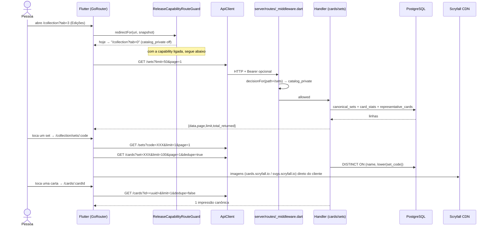

# Fluxo `card_catalog` — Catálogo de cartas, sets, impressões, rulings e regras

Estado: documentação de apoio, não autoritativa · gerado em 2026-09-21 sobre o commit d26f23a16 · verificação estática (nenhum teste foi executado) · **revisado adversarialmente em 2026-09-21 — ver seção 11**

---

## 1. Resumo e veredito

| Eixo | Veredito | Evidência |
| --- | --- | --- |
| **Implementado** | **sim** | 6 rotas de app, 7 arquivos de rota de servidor, 2 tabelas canônicas (`cards`, `sets`) mais `card_rulings`/`rules`/`card_legalities`. Todo o caminho tela → provider → HTTP → handler → SQL existe e fecha. |
| **Alcançável hoje** | **não** | `server/config/release_capabilities.json` tem `catalog_private.allowed=false` (**linha 16-21**; 22-27 é `decks_private`). O portão do servidor devolve **404 `capability_unavailable`** antes de tocar o PostgreSQL (**`server/lib/release_capability_policy.dart:187-193`**; `:179-186` é o ramo `capability_policy_invalid`/503) e o portão do app redireciona todas as rotas do catálogo para `/home` ou `/collection?tab=0` (`app/lib/core/config/release_capabilities.dart:470-531`). |
| **Provado** | **parcial** | Há prova viva real com artefato em disco: `docs/qa/ui-live/current/ux-pack-01-catalog-web/` contém `sets_catalog.png`, `sets_catalog_route.png`, `latest_set.png`, `set_detail_tst.png`, `card_detail_success.png`, `card_detail_error.png`, e `docs/qa/ui-live/current/ux-pack-01-card-printing-web/` contém `card_search_printing_picker.png` e `card_search_printing_selected.png` — capturados por `app/integration_test/app_existing_user_visual_audit_test.dart` (bloco do catálogo em `:823-871`, bloco da busca em `:720-791`) contra backend descartável com as capabilities forçadas em `on` (`scripts/manaloom_authenticated_visual_qa_isolated.sh:297-339`). **Ressalvas (A19):** os dois blocos são ramos mutuamente exclusivos do mesmo teste (`_auditCheckpoint`, com `return` em `:738`, `:756`, `:790`), não uma jornada única; `card_search_empty` e `card_search_results` **não têm PNG em lugar nenhum de `docs/`**; e o manifesto do pacote de catálogo é de `2026-08-03`, perfil único `web_mobile_390x844`. O que **não** está provado: paginação/`loadMore`, filtro de status, falha de rede, 401, negação de capability na UI, `/cards/:id/rulings` e `/rules`. |

**Frase curta:** o catálogo funciona quando alguém liga a chave; hoje ninguém ligou, e os dois pontos mais frágeis são (a) a busca de cartas engole exceção de rede e mostra "nenhuma carta encontrada", e (b) o `GET /cards/printings?sync=true` escreve no banco e chama a Scryfall **sem autenticação**.

### Diagrama da jornada principal



---

## 2. Jornada passo a passo

Seguido por imports e chamadas reais, não por nome de arquivo.

| # | Passo | Tela / widget (arquivo:linha) | Provider / cliente (arquivo:linha) | Método + endpoint | Handler (arquivo:linha) | Serviço / SQL | Tabelas |
| --- | --- | --- | --- | --- | --- | --- | --- |
| P1 | Entrar no hub de coleção, aba "Edições" | `app/lib/features/collection/screens/collection_screen.dart:30-48` (filtra seções por capability) e `:70-75` (`sets` → `catalogPrivate`), conteúdo em `:107-110` | `ReleaseCapabilitiesProvider` (`app/lib/core/config/release_capabilities.dart:236-330`) | `GET /capabilities` (no boot) | `server/routes/capabilities/index.dart:8-14` | `ReleaseCapabilityPolicy.toPublicJson()` | — (arquivo de config) |
| P2 | Listar/buscar coleções | `app/lib/features/collection/screens/sets_catalog_screen.dart:73-139` (`_loadFirstPage`/`_fetchPage`), busca com debounce 350 ms em `:64-71`, scroll infinito em `:167-173` | `ApiClient.get` (`app/lib/core/api/api_client.dart:240-300`) | `GET /sets?limit=50&page=N[&q=…]` (`sets_catalog_screen.dart:105-107`) | `server/routes/sets/index.dart:8-172` | CTEs `filtered_sets` → `canonical_sets` (1 linha por `LOWER(code)`) → `paged_sets` → `card_stats` → `representative_cards`; `EndpointCache` 60 s (`:24-33`, `:150-155`) | `sets`, `cards` |
| P3 | Abrir uma coleção | tile em `sets_catalog_screen.dart:541`, navegação em `:175-191` → rota `/collection/sets/:code` (`app/lib/main.dart:786-798`) → `SetCardsScreen` | `app/lib/features/collection/screens/set_cards_screen.dart:60-89` | `GET /sets?code=<code>&limit=1&page=1` (`:91-116`) | mesmo handler de P2 | `WHERE LOWER(code)=LOWER(@code)` (`sets/index.dart:39-42`), `normalizeSetCodeFilter` faz `toUpperCase` (`server/lib/sets_catalog_contract.dart:17-21`) | `sets` |
| P4 | Carregar as cartas da coleção | `set_cards_screen.dart:118-160`, scroll infinito em `:201-207` | `ApiClient.get` | `GET /cards?set=<code>&limit=100&page=N&dedupe=true` (`:128-130`) | `server/routes/cards/index.dart:9-137` | `CardDedupeMode.set` → `DISTINCT ON (c.name, LOWER(c.set_code))` (`:321-358`); `EndpointCache` 45 s (`:49-54`, `:124-128`) | `cards`, `sets` |
| P5 | "Última Edição" | `app/lib/features/collection/screens/latest_set_collection_screen.dart:11-14` → `SetCardsScreen(loadLatest: true)`; rota em `main.dart:782-785` | `set_cards_screen.dart:92-94` | `GET /sets?limit=1&page=1` | `sets/index.dart` | ordena `release_date DESC NULLS LAST` (`:83`) — **inclui sets futuros** | `sets`, `cards` |
| P6 | Detalhe da carta | `app/lib/features/cards/screens/card_detail_screen.dart:33-135` (`CardDetailRouteScreen`) e `:137-722` (`CardDetailScreen`); rota `/cards/:cardId` em `main.dart:727-735`, com `extra` opcional (`DeckCardItem`) | `CardProvider.fetchCardById` (`app/lib/features/cards/providers/card_provider.dart:369-401`) | `GET /cards?id=<uuid>&limit=1&dedupe=false` | `cards/index.dart:164-167` (`c.id::text = @id`) e `:360-373` (`CardDedupeMode.none`, `SELECT c.*`) | — | `cards`, `sets` |
| P7 | Busca de cartas (entrada pelo deck) | `app/lib/features/cards/screens/card_search_screen.dart:95-117` (debounce 350 ms, mínimo 3 letras), resultados em `:486-591`; rota `/decks/:id/search` em `main.dart:599-606` | `CardProvider.searchCards` (`card_provider.dart:74-113`) → `_fetchPage` (`:175-244`) | `GET /cards?name=…&limit=50&page=N&dedupe=identity\|false[&commander_format=commander\|brawl]` (`card_provider.dart:190-193`) | `cards/index.dart:281-319` (`CardDedupeMode.identity`: `ROW_NUMBER() OVER (PARTITION BY oracle_id…)`), filtro de comandante em `:199-203` via `server/lib/commander_eligibility.dart` | window function antes de `LIMIT/OFFSET` | `cards`, `sets` |
| P8 | Disponibilidade na coleção nos resultados | chips em `card_search_screen.dart:1040` | `CardProvider._fetchCollectionAvailability` (`card_provider.dart:330-367`) | `GET /binder/availability?card_ids=<csv>` | `server/routes/binder/[id]/index.dart:11-19` (`id == 'availability'`) e `:27-95` | join por `COALESCE(c.oracle_id, c.id)` contra `collection_availability_snapshot` | `user_binder_items`, `cards` |
| P9 | Paginação | `card_search_screen.dart:83-93` (`_onScroll`) | `CardProvider.loadMore` (`card_provider.dart:159-173`) | mesmo `GET /cards?...&page=N+1` | idem P7 | `_hasMore = results.length == limit` (`card_provider.dart:243`) | — |
| P10 | Escolher impressão antes de adicionar | `app/lib/features/cards/widgets/card_printing_picker.dart:21-47`, chamado por `card_search_screen.dart:143-151` | `CardProvider.fetchPrintingsByName` (`card_provider.dart:509-521`); variante com sync em `:525-540` usada por `app/lib/features/decks/screens/deck_details_screen.dart:1794,1850` e `app/lib/features/binder/widgets/binder_item_editor.dart:166-173` | `GET /cards/printings?name=…&limit=50&dedupe=false[&sync=true]` | `server/routes/cards/printings/index.dart:10-69` | `DISTINCT ON (LOWER(set_code))` quando `dedupe≠false` (`:170-222`); `sync=true` faz **upsert** em `cards`/`sets` a partir da Scryfall (`:309-484`) | `cards`, `sets` |
| P11 | Aba "Coleções" dentro da busca | `card_search_screen.dart:417-441` (TabBar "Cartas"/"Coleções") e `:458-466` (embute `SetsCatalogScreen(showAppBar:false)`) | mesmo de P2 | `GET /sets` | `sets/index.dart` | — | `sets`, `cards` |

**Superfícies adjacentes que consomem o mesmo catálogo** (fora da jornada principal, mas no mesmo portão `catalog_private`): scanner (`app/lib/features/scanner/services/scanner_card_search_service.dart:23,53,96` → `/cards`, `/cards/printings`, `POST /cards/resolve`), importação de fichário (`app/lib/features/binder/providers/binder_import_provider.dart:128,301` → `POST /cards/resolve/batch`, `/cards/printings`) e geração de deck (`app/lib/features/decks/providers/deck_provider_support_generation.dart:175,1074`).

**Endpoints sem nenhum consumidor no app:** `GET /cards/:id/rulings` (`server/routes/cards/[id]/rulings/index.dart`) e `GET /rules` (`server/routes/rules/index.dart`) — `grep -rn "rulings\|/rules" app/lib` não retorna nada. `server/doc/API_CONTRACTS_AND_DATA_MAP.md:128,130` já os classifica como "no current mobile consumer proven" / "internal", então isso é coerente com o contrato, não surpresa.

**Imagens não passam pelo backend:** `app/lib/core/widgets/cached_card_image.dart:127-134` e `app/lib/core/utils/scryfall_image_helper.dart:15-21` fazem o cliente buscar arte direto em `cards.scryfall.io` e `api.scryfall.com/cards/named`; o ícone do set vem de `svgs.scryfall.io` (`server/lib/sets_catalog_contract.dart:68-74`, fallback em `app/lib/features/collection/models/mtg_set.dart:62-70`). Ou seja: **arte continua carregando mesmo com a capability fechada**, porque não passa pelo portão.

---

## 3. Capabilities e portões

### 3.1 Portão do servidor (fail-closed)

`server/routes/_middleware.dart:100-141` chama `ReleaseCapabilityPolicy.decisionFor` antes de conectar ao banco. `server/lib/release_capability_policy.dart:525-532`:

```dart
if (normalizedPath == '/cards' ||
    normalizedPath.startsWith('/cards/') ||
    normalizedPath == '/sets' ||
    normalizedPath.startsWith('/sets/') ||
    normalizedPath == '/rules' ||
    normalizedPath.startsWith('/rules/') ||
    normalizedPath.startsWith('/market/')) {
  return 'catalog_private';
}
```

Hoje `catalog_private.allowed = false` (**`server/config/release_capabilities.json:16-21`**), então a resposta é **404** com corpo `{error: "capability_unavailable", capability: "catalog_private", release_capability: "off", policy_version, policy_digest_sha256, offer_mode}` (**`release_capability_policy.dart:187-193`** + `_middleware.dart:129-141`). Não é 403: a política esconde a existência do recurso. Vale registrar o terceiro ramo, que o corpo desta seção omitia: se o arquivo de política for inválido, `decisionFor` devolve **503 `capability_policy_invalid`** (`release_capability_policy.dart:179-186`), e o app cairia no mesmo caminho de texto cru do A2 com um código diferente.

Detalhe de governança: **`/market/card/:id` e `/market/movers` andam no mesmo `catalog_private`** (mesma condição, `server/routes/market/card/[cardId].dart`, `server/routes/market/movers/index.dart`), e `/cards/printings` devolve `price`, `price_source`, `price_updated_at` (`server/routes/cards/printings/index.dart:294-299`). Abrir o catálogo abre preço junto. Isso já está registrado como contradição C12 em `docs/MAPA_OPERACIONAL_DO_PROJETO.md:370`, mas a parte de `/cards/printings` não está.

### 3.2 Portão do app (fail-closed, mas com composição diferente)

`app/lib/core/config/release_capabilities.dart`, chamado em `app/lib/main.dart:425-434`:

| Rota do app | Capability exigida | Para onde vai quando negado | Linha |
| --- | --- | --- | --- |
| `/collection` (qualquer subrota) e `/binder*` | `collection_private` | `/home` | `:470-476` |
| `/collection/sets`, `/collection/sets/*`, `/collection/latest-set` | `collection_private` **e depois** `catalog_private` | `/home` se faltar `collection_private`; `/collection?tab=0` se só faltar `catalog_private` | `:478-483` |
| `/collection?tab=3` | `collection_private` (guarda de `/collection`) **e depois** `catalog_private` | `/home` ou `/collection?tab=0`, pela mesma razão | `:501-512` |
| `/decks/:id/search` | `catalog_private` **e depois** `decks_private` | `/decks/:id` (catálogo) ou `/home` (decks) | **`:397-401`** e `:520-523` |
| `/cards`, `/cards/*`, `/sets`, `/sets/*` | `catalog_private` | `/home` | **`:525-531`** |

Correção de precisão: a coluna "para onde vai" tem **dois** destinos por linha nas duas primeiras, porque a guarda de `/collection/*` roda antes. É por isso que `release_capabilities_test.dart:385-386` espera `/collection/sets/fin` → `/home` e `/collection/latest-set` → `/home` (snapshot com tudo negado), e não `/collection?tab=0`.

**Os nomes batem** (`catalog_private` dos dois lados; o enum do app em `:11` declara `catalogPrivate('catalog_private')`). **A composição não bate:** o servidor protege `/sets` e `/cards` só com `catalog_private`; o app exige `collection_private` **antes** para qualquer `/collection/*`, inclusive `/collection/sets`. Ligar apenas `catalog_private` abre a API e mantém a tela inalcançável (vai para `/home`). Ver achado A6.

Para a jornada completa ficar alcançável hoje seria preciso: `catalog_private` (API + `/cards/:cardId` + tab 3) **+** `collection_private` (chegar em `/collection/sets*`) **+** `decks_private` (chegar em `/decks/:id/search`) **+** `collection_private` de novo para os chips de disponibilidade (`/binder/availability`). Todas estão `off`.

### 3.3 O que o usuário vê quando negado

- **Rota bloqueada pelo app:** redirect silencioso. `/collection/sets` → `/home`. Nenhuma mensagem, nenhum "indisponível nesta versão" — a tela simplesmente não abre.
- **Hub de coleção com tudo fechado:** `_CollectionUnavailableScaffold` (`collection_screen.dart:284-311`), título "Coleção", corpo "Coleção indisponível nesta versão.".
- **Chamada HTTP negada (política mudou no meio da sessão, snapshot do app envelhecido):** a tela de sets mostra o **código bruto** `capability_unavailable` como mensagem de erro. Ver achado A2.

---

## 4. Contrato app↔servidor

| Endpoint | Chamador no app (arquivo:linha) | Query/corpo enviado | Handler | Campos lidos pelo app | Divergências |
| --- | --- | --- | --- | --- | --- |
| `GET /cards` | `card_provider.dart:190-193` (busca), `:376` (por id), `set_cards_screen.dart:128-130` (por set), `scanner_card_search_service.dart:23-27`, `deck_provider_support_generation.dart:1074` | `name`, `id`, `set`, `limit`, `page`, `dedupe=identity\|false\|true`, `commander_format`, `include_tokens` | `server/routes/cards/index.dart:20-54` | `data[]`, e por carta `id`, `oracle_id`, `name`, `mana_cost`, `type_line`, `oracle_text`, `power`, `toughness`, `colors`, `color_identity`, `image_url`, `layout`, `card_faces`, `set_code`, `set_name`, `set_release_date`, `rarity`, `is_reserved`, `printing_count`, `collector_number`, `foil` (`card_provider.dart:403-437`) | O servidor devolve `page`, `limit`, `total_returned` (`:117-122`) e **o app ignora os três**: usa `results.length == limit` para decidir `hasMore` (`card_provider.dart:243`, `set_cards_screen.dart:158`). O servidor devolve `scryfall_id` e o app nunca lê. Em `dedupe=false` o `set_code` **não** é minúsculo (`SELECT c.*`, `:360-373`) enquanto nos outros modos é (`:298`, `:339`) — A13. |
| `GET /cards/printings` | `card_provider.dart:512` e `:531`, `scanner_card_search_service.dart:53-56`, `binder_import_provider.dart:301` | `name` (obrigatório), `limit`, `dedupe=false`, `sync=true` | `server/routes/cards/printings/index.dart:19-31` | `data[]` com `id`, `oracle_id`, `name`, `image_url`, `layout`, `card_faces`, `set_code`, `set_name`, `set_release_date`, `rarity`, `is_reserved`, `collector_number`, `foil`, `price`, `price_currency`, `price_source`, `price_updated_at` (`card_printing_picker.dart:62-120`) | Handler devolve `name` e `total_returned` (`:66-68`) que o app ignora; **não** devolve `limit` (já documentado em `server/doc/API_CONTRACTS_AND_DATA_MAP.md:127`). `sync=true` é um **GET que escreve** — A9. |
| `POST /cards/resolve` | `scanner_card_search_service.dart:96-99` | `{name, include_tokens?}` | `server/routes/cards/resolve/index.dart:22-140` | `data[]` (mesmo mapeamento reduzido em `scanner_card_search_service.dart:117-140`) | O handler pode devolver `409` com `candidates` (documentado em `API_CONTRACTS_AND_DATA_MAP.md:125`); o scanner trata qualquer `status != 200` como lista vazia (`:100-102`) — perde a desambiguação. |
| `POST /cards/resolve/batch` | `binder_import_provider.dart:128`, `deck_provider_support_generation.dart:175` | `{names: [...]}` (máx. 200) | `server/routes/cards/resolve/batch/index.dart:27-77` | `data[]`, `unresolved`, `ambiguous` | Handler devolve `total_input`, `total_resolved`, `total_ambiguous`; conferir por chamador se são lidos. |
| `GET /cards/:id/rulings` | **nenhum** | — | `server/routes/cards/[id]/rulings/index.dart:19-92` | — | Endpoint sem consumidor. `CAST(@id AS uuid)` sem validação → id inválido vira 500 (A11). |
| `GET /sets` | `sets_catalog_screen.dart:105-107`, `set_cards_screen.dart:92-94` | `limit`, `page`, `q`, `code` | `server/routes/sets/index.dart:17-22` | `data[]` com `code`, `name`, `release_date`, `type`, `block`, `is_online_only`, `is_foreign_only`, `card_count`, `representative_image_url`, `icon_svg_uri`, `status` (`app/lib/features/collection/models/mtg_set.dart:28-42`) | `page`/`limit`/`total_returned` ignorados pelo app. Headers `Server-Timing`, `X-ManaLoom-Sets-Cache/Total-Ms/Query-Ms` (`server/lib/sets_catalog_contract.dart:76-96`) não são lidos por nenhum consumidor do app. `card_count` conta linhas cruas de `cards`, o que não bate com o que a tela de detalhe lista — A5. |
| `GET /rules` | **nenhum** | — | `server/routes/rules/index.dart:5-73` | — | Endpoint sem consumidor. Sem `meta`, devolve **lista JSON pura** (`:59`), fora do envelope `{data,…}` usado no resto da API. |
| `GET /binder/availability` | `card_provider.dart:342-344` | `card_ids` (CSV, ≤100 no servidor) | `server/routes/binder/[id]/index.dart:14,27-95` | `data[].card_id`, `playable_card_id`, `owned_quantity`, `allocated_quantity`, `committed_trade_quantity`, `free_quantity`, `missing_quantity` (`card_provider.dart:19-36`) | Capability diferente (`collection_private`, `release_capability_policy.dart:533-535`) — degrada em silêncio quando negado (`card_provider.dart:345-366`), o que está correto e testado. |

Nenhum endpoint chamado pelo app deste fluxo está ausente no servidor. Os dois endpoints sem chamador são `GET /cards/:id/rulings` e `GET /rules`.

---

## 5. Dados

Não existe pasta `server/migrations`: o schema base vive em `server/database_setup.sql` e as migrações versionadas em `server/bin/migrate.dart`.

| Tabela | Origem | Colunas relevantes para este fluxo | Observação |
| --- | --- | --- | --- |
| `cards` | `server/database_setup.sql:119-147` (+ `ALTER … ADD COLUMN IF NOT EXISTS` em `:149-167`) | `id uuid PK`, `scryfall_id uuid UNIQUE NOT NULL`, `oracle_id uuid`, `name`, `mana_cost`, `type_line`, `oracle_text`, `colors text[]`, `color_identity text[]`, `power`, `toughness`, `image_url`, `set_code`, `rarity`, `is_reserved bool NOT NULL`, `layout`, `card_faces_json jsonb`, `price/price_usd/price_source/price_updated_at`, `collector_number`, `foil` | `oracle_id`, `layout` e `card_faces_json` são aditivos: o servidor confere presença em runtime (`server/lib/card_identity_support.dart:16-33`) e degrada para `NULL::text` quando faltam (`:36-49`). Índices em `:171-181`, incluindo `LOWER(split_part(name,' // ',1))`. |
| `sets` | `server/database_setup.sql:206-218` | `code text PK`, `name`, `release_date date`, `type`, `block`, `is_online_only`, `is_foreign_only` | PK é case-sensitive, por isso todas as consultas deduplicam por `LOWER(code)` com `ROW_NUMBER()` (`sets/index.dart:60-70`, `cards/index.dart:216-236`, `printings/index.dart:90-108`). `card_count`, `status`, `representative_image_url` e `icon_svg_uri` são **derivados**, não colunas. |
| `card_legalities` | `server/database_setup.sql:222-228` | `card_id`, `format`, `status` | Usado pelo filtro `commander_format` via `server/lib/commander_eligibility.dart`, não devolvido por `/cards`. |
| `card_rulings` | migração `016` em `server/bin/migrate.dart:426-451`; `035` acrescenta `ruling_source` (`:1188-1195`) | `oracle_id text NOT NULL`, `source`, `published_at date`, `comment`, `comment_hash`, único por `(oracle_id, comment_hash)` | Populada só por `server/bin/sync_rulings.dart`. Consumida só por `/cards/:id/rulings`, que não tem consumidor no app. |
| `rules` | `server/database_setup.sql:296-306` | `id`, `title`, `description`, `category` | Consumida só por `/rules`, sem consumidor no app. |
| `user_binder_items` + view `collection_availability_snapshot` | `server/lib/collection_availability_contract.dart` | — | Entra no fluxo só no passo P8. |

---

## 6. Estados e erros

| Estado | Tratado? | Onde |
| --- | --- | --- |
| Carregando (sets) | sim | `sets_catalog_screen.dart:255-261` (`Key('sets-catalog-loading')`); `set_cards_screen.dart:60-88` |
| Carregando (busca de cartas) | sim | `card_search_screen.dart:493-500` (`Key('card-search-loading')`) |
| Carregando (detalhe) | sim | `card_detail_screen.dart:118-123` (`AppStatePanel.loading`) |
| Vazio (busca < 3 letras / sem resultado) | sim | `card_search_screen.dart:518-542` |
| Vazio (coleção sem cartas locais / coleção futura) | sim | `set_cards_screen.dart:496-521` — texto distinto para `status == 'future'` |
| Vazio (catálogo de sets filtrado) | sim, **mas vira beco sem saída** | `sets_catalog_screen.dart:276-292` — ver A3 |
| Erro HTTP ≥ 400 (sets) | sim | `sets_catalog_screen.dart:109-116` + `FriendlyErrorMapper` |
| Erro HTTP ≥ 400 (busca de cartas) | sim, com texto fixo | `card_provider.dart:204-209` — não usa `FriendlyErrorMapper`, ignora o corpo |
| **Erro de rede / offline na busca de cartas** | **não** | `card_provider.dart:107-112` não tem `catch`; `ApiClient.get` relança (`api_client.dart:318-345`). Resultado: exceção não tratada + tela de "nenhuma carta encontrada". **A1** |
| Erro de rede / offline nas telas de set | sim | `sets_catalog_screen.dart:84-92` e `set_cards_screen.dart:74-81` chamam `FriendlyErrorMapper.fromException`, que mapeia para `offlineContractForContext(cardCatalog)` (`friendly_error_mapper.dart:274-277`, contrato em `app/lib/core/resilience/offline_capability.dart:111-123`) |
| 401 / expiração de sessão | parcial | `ApiClient._parseResponse` dispara `_sessionExpiredHandler` só quando o corpo casa com heurística de token (`api_client.dart:96-116`, `:626`). O catálogo é **anônimo no servidor** (não há `_middleware.dart` sob `routes/cards`, `routes/sets`, `routes/rules`), então 401 nunca deveria vir daqui. |
| 403 | não ocorre | a política devolve 404, nunca 403 |
| 404 de capability | **mal apresentado** | vira texto bruto `capability_unavailable` nas telas de set — **A2** |
| Validação (dedupe/commander_format inválidos) | sim no servidor, não exercitado pelo app | `cards/index.dart:26-41` devolve 400; o app só emite valores válidos (`card_provider.dart:322-328`) |
| Retry | parcial | `ApiClient` repete **uma vez** GET em 500/502/503/504 e em falha de transporte (`api_client.dart:186-190`, `:307-345`). Retry manual existe em todas as telas de erro. |
| Concorrência — troca de busca no meio (cartas) | sim | `card_provider.dart:196-202` e `:225-231` (`_isCurrentRequest`) |
| Concorrência — troca de busca no meio (sets) | **não** | `sets_catalog_screen.dart:73-139` não tem guarda de geração — **A4** |
| Concorrência — duplo toque no resultado | não | `card_search_screen.dart:138-178` abre `showCardPrintingPicker` sem trava de reentrância |
| Job assíncrono em andamento | n/a | este fluxo é síncrono; o único efeito colateral longo é `sync=true` (A9) |

---

## 7. Testes por passo

| Passo | Teste que exercita | O que de fato afirma |
| --- | --- | --- |
| P1 (capabilities) | `app/test/core/config/release_capabilities_test.dart:360-404` | Comportamento real: tabela de 30 rotas negadas → destino do redirect, incluindo `/collection/sets/fin` → `/home`, `/collection/latest-set` → `/home`, `/cards/card-1` → `/home`, `/collection?tab=3` → `/home`. `:488-522` prova a composição `collection_private` + `catalog_private` para a tab 3. |
| P1 (servidor) | `server/test/release_capability_policy_test.dart:185-230` | Comportamento real: `GET /cards` e `GET /sets` → `catalog_private`. **Não** cobre `/rules`, `/cards/printings`, `/cards/resolve`, `/cards/:id/rulings` (só ficam cobertos pelo prefixo). |
| P2 (lista de sets) | `app/test/features/collection/sets_catalog_screen_test.dart:149-185` | Comportamento real com `ApiClient` falso: renderiza `MSH`/`TMT`, chip "Futura", "14 cartas", arte vs. ícone de fallback, e confirma que digitar "soc" dispara `q=soc`. |
| P2 (contrato puro) | `server/test/sets_route_test.dart:10-100` | Funções puras reais (`resolveSetStatus`, `normalizeSetCodeFilter`, `mapSetCatalogRow`, `buildSetIconSvgUri`, headers de timing). |
| P2 (rota) | `server/test/sets_route_test.dart:102-112` | **Só grep de string** no fonte (`contains('paged_sets AS')`, `isNot(contains('ARRAY_AGG'))`). Não executa `onRequest`, não toca SQL. |
| P3/P4 (detalhe do set) | `sets_catalog_screen_test.dart:187-214` | Comportamento real: `SetCardsScreen(initialSet: ECC)` chama `/cards?set=ECC…` e renderiza "Aberrant Return". |
| P4 (estado futuro/vazio) | `sets_catalog_screen_test.dart:366-389` | Comportamento real: OM2 sem cartas → "Dados parciais de coleção futura". |
| P2/P4 (erro) | `sets_catalog_screen_test.dart:391-437` | Comportamento real, mas **só para 500**: garante que "RequestOptions" e "500" não vazam. Não cobre 404 de capability. |
| P5 (latest-set) | `app/test/features/collection/collection_screen_responsive_test.dart:144-166` | Só geometria/overflow. Não afirma qual set é escolhido. |
| P6 (detalhe da carta) | `app/test/features/cards/providers/card_provider_search_test.dart:324-334` | Comportamento real: `fetchCardById('card/id')` monta `/cards?id=card%2Fid&limit=1&dedupe=false` e rejeita id divergente. |
| P6 (layout) | `app/test/features/cards/screens/card_detail_screen_responsive_test.dart:57-224` | Geometria, arte faltante, carta dupla-face, 200% de texto. Não toca rede. |
| P7 (busca) | `card_provider_search_test.dart:205-297` | Comportamento real: preserva `card_faces`/`layout`, colapsa por identidade (`dedupe=identity`), preserva impressões físicas (`dedupe=false`), monta `commander_format=commander`. |
| P8 (disponibilidade) | `card_provider_search_test.dart:229-239` | Comportamento real: 503 em `/binder/availability` **não** bloqueia a busca. |
| P8 (servidor) | `server/test/collection_availability_route_contract_test.dart:27-39` | **Só grep de string** no fonte da rota. |
| P9 (paginação) | **nenhum** | `loadMore()` e `_hasMore` não têm teste em `app/test` nem em `server/test`. |
| P10 (printing picker) | `app/test/features/cards/widgets/card_printing_picker_test.dart:66-260` | Comportamento real: opções, finish físico vs. catálogo, recuperação de falha de carga. `card_provider_search_test.dart:297-323` prova as duas URLs (`dedupe=false` e `…&sync=true`). |
| P10 (servidor) | `server/test/cards_route_test.dart:56-120` | **Só grep de string** no fonte de `routes/cards/printings/index.dart` e `routes/cards/resolve/index.dart`. |
| P7/P11 (tela de busca) | `app/test/features/cards/screens/card_search_screen_test.dart:239-737` | Comportamento real com providers falsos: escolha obrigatória de impressão, aba "Coleções" abrindo o detalhe do set (`:371-413`), grid/lista responsiva, chips de disponibilidade, contagem de impressões, estados vazio/erro (`:594-634`). **O estado de erro é injetado** via `_FixedCardProvider(errorMessageOverride:)` — nunca passa pelo `CardProvider` real. |
| Jornada inteira (prova viva) | `app/integration_test/app_existing_user_visual_audit_test.dart:720-872` | Comportamento real contra backend descartável: `/decks/:id/search` com "Sol Ring", printing picker, `/collection?tab=3`, `/collection/sets`, `/collection/latest-set`, `/collection/sets/TST`, `/cards/<uuid>` e `/cards/0000…0000` (estado de erro). |
| Jornada inteira (runtime isolado) | `app/integration_test/sets_catalog_runtime_test.dart`, `sets_search_catalog_runtime_test.dart` | Comportamento real contra backend vivo, **mas montando a tela diretamente** — não passa por `GoRouter` nem pelo portão de capability. |
| `GET /cards/:id/rulings` | `server/test/api_contracts_data_map_guard_test.dart:15` | Só verifica que a linha existe na documentação. |
| `GET /rules` | `server/test/error_contract_test.dart` (citado em `API_CONTRACTS_AND_DATA_MAP.md:130`) | Contrato de erro sanitizado; nenhum teste de resultado. |

### Lacunas (passos sem teste nenhum)

1. **P9 — paginação/`loadMore`** em `CardProvider` e em ambas as telas de set: nenhum teste.
2. **Falha de rede na busca de cartas** (A1): nenhum teste — e o comportamento atual está errado.
3. **404 de capability na UI** (A2): nenhum teste.
4. **Filtro de status do catálogo de sets** (A3): `sets_catalog_screen_test.dart:238-266` só verifica que os chips cabem na tela, nunca que filtrar produz a lista certa nem que a paginação continua.
5. **Corrida de busca no catálogo de sets** (A4): nenhum teste.
6. **`card_count` vs. cartas listadas** (A5): nenhum teste liga os dois lados.
7. **Composição `catalog_private` sem `collection_private`** (A6): a tabela de `release_capabilities_test.dart:488-522` cobre `privateOnly` e `withCatalog`, nunca "catálogo ligado, coleção desligada".
8. **Handlers de servidor deste fluxo nunca são executados em teste**: `cards_route_test.dart`, `sets_route_test.dart:102`, `collection_availability_route_contract_test.dart` e `printing_identity_flow_contract_test.dart` afirmam `File(...).readAsStringSync()` + `contains('string')`. Uma refatoração que preservasse as strings e quebrasse o comportamento passaria verde.

---

## 8. Achados

| # | Tipo | Sev. | Achado | Arquivo:linha | Como provar |
| --- | --- | --- | --- | --- | --- |
| A1 | bug-provável | **alta** | Exceção de rede na busca de cartas escapa sem tratamento e a tela mostra "Nenhuma carta encontrada" em vez do estado offline. `searchCards` tem `try/finally` sem `catch`; `ApiClient.get` relança `SocketException`/`TimeoutException`; `_onSearchChanged` chama sem `await` e sem `catch`. O contrato offline `card_catalog` existe mas nunca é usado por esse caminho. | `app/lib/features/cards/providers/card_provider.dart:107-112` e `:190-209`; `app/lib/core/api/api_client.dart:318-345`; `app/lib/features/cards/screens/card_search_screen.dart:111-115`; contrato em `app/lib/core/resilience/offline_capability.dart:111-123` | Teste de unidade: `ApiClient` falso cujo `get` lança `SocketException`; esperar `provider.errorMessage != null` e nenhuma exceção não tratada. Teste de widget: mesmo fake + `expect(find.byKey(Key('card-search-error')), findsOneWidget)` e `tester.takeException() == null`. Prova viva: desligar a rede no simulador com a busca aberta. |
| A2 | ux-funcional | média | Negação de capability vira texto técnico na tela: o corpo `{"error":"capability_unavailable"}` passa por `_messageFromBody`, não bate em nenhuma heurística e não é considerado "técnico", então é devolvido cru e exibido sob "Falha ao carregar coleções". **A prova decisiva (ausente na versão anterior) é a ordem em `fromStatusCode`:** para qualquer status < 500 o corpo é consultado **antes** do switch de status, então o ramo 404 `setsCatalog → 'Não encontramos essas coleções.'` nunca é alcançado. O código ainda sobrevive ao segundo passe: as telas embrulham em `Exception(...)` e chamam `fromException`, que também devolve o texto cru. | **`app/lib/core/utils/friendly_error_mapper.dart:51-54`** (`final specific = statusCode < 500 ? _messageFromBody(...)`; `if (specific != null) return specific;`) + **`:317-319`** (`if (!_looksTechnical(text)) return text;`) + `:189-191` (mesmo efeito em `fromException`) + `:95-104` (ramo 404 inalcançável); consumido em `app/lib/features/collection/screens/sets_catalog_screen.dart:109-116` e `set_cards_screen.dart:96-103` | Teste de widget: `ApiClient` falso devolvendo `ApiResponse(404, {'error':'capability_unavailable','capability':'catalog_private', …})`; hoje aparece "capability_unavailable"; deveria aparecer mensagem de produto. Reproduz de verdade quando o snapshot do app envelhece e a política fecha no meio da sessão. |
| A3 | bug-provável | média | Filtro de status do catálogo de sets é beco sem saída: `_visibleSets` filtra **só as páginas já carregadas**; quando o filtro esvazia a lista, a tela troca o `ListView` por um `AppStatePanel`, o `ScrollController` fica sem clientes, `_onScroll` nunca dispara e `_loadMore` nunca roda. A própria mensagem manda "role a lista geral", mas não existe lista para rolar. Com ordenação por `release_date DESC`, filtrar "Antiga" na primeira página costuma dar vazio. | `app/lib/features/collection/screens/sets_catalog_screen.dart:42-46`, `:167-173`, `:276-292`, `:294-339` | Teste de widget: fake devolvendo 50 sets `future`/`current` na página 1 e sets `old` só na página 2; selecionar o chip "Antiga"; hoje fica preso no estado vazio. |
| A4 | bug-provável | média | Busca de sets sem guarda de geração: duas chamadas a `_loadFirstPage` em voo podem terminar fora de ordem e a resposta antiga sobrescreve a nova. O `CardProvider` resolve isso com `_isCurrentRequest`; o catálogo de sets não tem equivalente. | `app/lib/features/collection/screens/sets_catalog_screen.dart:64-71`, `:73-99`, `:101-139` — comparar com `app/lib/features/cards/providers/card_provider.dart:246-254` | Teste de widget com fake que atrasa a resposta de "a" mais que a de "ab"; asserir que a lista final corresponde a "ab". |
| A5 | incoerência-app-servidor | média | `card_count` do tile e a lista da tela de detalhe contam coisas diferentes: `/sets` faz `COUNT(c.id)` sobre todas as linhas de `cards` daquele set (inclui tokens e todas as variantes), enquanto `/cards?set=…&dedupe=true` exclui tokens e deduplica por `(name, lower(set_code))`. O tile promete "N cartas" e a tela entrega menos. | `server/routes/sets/index.dart:86-93` vs. `server/routes/cards/index.dart:195-197` e `:321-358`; exibido em `app/lib/features/collection/screens/sets_catalog_screen.dart:572` | Teste de servidor com PostgreSQL de fixture: set com 1 token + 2 variantes da mesma carta; comparar `card_count` de `/sets?code=` com `total_returned` de `/cards?set=…&dedupe=true`. |
| A6 | incoerência-app-servidor | média | Composição de capability diverge entre os dois lados: o servidor protege `/sets` e `/cards` **só** com `catalog_private`; o app exige `collection_private` antes para qualquer `/collection/*`, inclusive `/collection/sets` e `/collection/latest-set`. Abrir só `catalog_private` libera a API e mantém as telas em `/home`. | `app/lib/core/config/release_capabilities.dart:470-482` (ordem das verificações) vs. `server/lib/release_capability_policy.dart:525-532` | Teste de unidade: `redirectFor('/collection/sets', snapshot com apenas catalogPrivate)` — hoje devolve `/home`; decidir se deve devolver `null`. |
| A7 | ux-funcional | baixa | Dentro de `/decks/:id/search` a aba "Coleções" embute o catálogo, mas tocar um set navega para `/collection/sets/:code`, que exige mais capabilities (`collection_private`) do que a tela de origem. Com `catalog_private`+`decks_private` ligados e `collection_private` desligado, o toque joga o usuário em `/home` no meio de uma montagem de deck. | `app/lib/features/cards/screens/card_search_screen.dart:458-466`; navegação em `app/lib/features/collection/screens/sets_catalog_screen.dart:175-191`; guarda em `app/lib/core/config/release_capabilities.dart:470-476` | Teste de widget com `GoRouter` real e snapshot `{catalogPrivate, decksPrivate}`; asserir que o toque não sai da árvore de decks. |
| A8 | ux-funcional | baixa | "Última Edição" resolve para o set com `release_date` mais recente **sem filtrar futuros**, então costuma abrir uma coleção ainda não lançada e cair no estado "Dados parciais de coleção futura". | `app/lib/features/collection/screens/set_cards_screen.dart:92-94` (`/sets?limit=1&page=1`) + `server/routes/sets/index.dart:83` (`ORDER BY release_date DESC NULLS LAST`); estado em `set_cards_screen.dart:504-518` | Teste de servidor/fixture com um set futuro e um lançado; asserir qual sai em `/sets?limit=1`. Hipótese sobre a intenção do produto — o código é inequívoco, o desejado não. |
| A9 | segurança | **alta** | `GET /cards/printings?sync=true` é um GET **anônimo, write-capable e com chamada externa**: não há `_middleware.dart` sob `server/routes/cards` (confirmei a lista inteira: os 16 `_middleware.dart` do servidor cobrem `ai`, `auth`, `binder`, `community`, `content-reports`, `conversations`, `decks`, `health`, `import`, `moderation`, `notifications`, `trades`, `users` — nenhum cobre `cards`, `sets` ou `rules`), e o handler faz até 30 `INSERT … ON CONFLICT DO UPDATE` em `cards` (`:408-451`) mais `INSERT … ON CONFLICT DO NOTHING` em `sets` (`:466-477`), depois de duas chamadas à `api.scryfall.com` (`:318`, `:330`). **Correção de escopo:** o sync só dispara quando a busca local devolve `data.length <= 1` (`:44`) — o doc anterior omitia essa guarda. Ela **não** neutraliza o achado: um nome ainda não indexado localmente satisfaz a guarda por definição. **Agravante novo (A23):** para uma carta de impressão única a guarda continua verdadeira para sempre, então **toda** requisição re-sincroniza; e as duas `http.get` não têm `.timeout()`, nem a rota tem `EndpointCache`. | `server/routes/cards/printings/index.dart:23`, `:44-64`, `:309-484`; ausência de `server/routes/cards/_middleware.dart` | Prova viva com backend local: `curl -i 'http://localhost:8080/cards/printings?name=Sol+Ring&sync=true'` sem `Authorization` e conferir `SELECT count(*) FROM cards WHERE name='Sol Ring'` antes/depois. Repetir o mesmo curl com uma carta de impressão única e contar as chamadas de saída. Teste a escrever: contrato que exija sessão (ou chave de ops) para `sync=true`. |
| A10 | doc-defasada | **alta** (era média) | `public_api_paths` declara só `/sets` como público entre as rotas do catálogo, mas `/cards`, `/cards/printings`, `/cards/resolve`, `/cards/resolve/batch`, `/cards/:id/rulings` e `/rules` também são anônimos na prática. **Correção: a afirmação "nenhum código consome `public_api_paths`" era falsa.** O gerador de OpenAPI consome a lista e usa exatamente a ausência dela para carimbar `security: bearerAuth`. Resultado: o spec publicado **afirma que essas rotas exigem token**, o que é o oposto da verdade — ver A20. | `docs/project_logic_contracts.json:302-317`; consumidor em **`tools/project_logic/lib/project_logic_generator.dart:3642-3645`** e **`:3677-3680`**; ausência de `_middleware.dart` sob `routes/cards`, `routes/sets`, `routes/rules` | Escrever um gate que derive a superfície anônima de `server/routes` (pastas sem `_middleware.dart`) e a compare com `public_api_paths` **e** com `security` em `docs/generated/openapi.generated.json`. |
| A11 | estado-não-tratado | baixa | `/cards/:id/rulings` faz `CAST(@id AS uuid)` sem validar; id não-UUID levanta erro do PostgreSQL, cai no `catch` genérico e devolve **500** em vez de 400/404. Contraste que reforça o achado: `/cards?id=` faz `c.id::text = @id` (`cards/index.dart:165`), comparação textual que nunca estoura — logo a inconsistência é entre duas rotas do mesmo fluxo. | **`server/routes/cards/[id]/rulings/index.dart:38`** (o `CAST`, dentro do SQL de `:35-40`) e **`:85-91`** (o `catch` genérico) | Teste de rota com PostgreSQL de fixture: `GET /cards/nao-e-uuid/rulings` → hoje 500. |
| A12 | bug-provável | baixa | Busca por `id` nunca encontra token: `/cards` aplica `NOT ILIKE '%Token%'` sempre que `include_tokens` não é `true`, e `fetchCardById` nunca envia esse parâmetro. **Correção de alcance:** tocar um resultado **não** reproduz, porque `openCardDetailRoute` passa `extra: card` (`card_detail_screen.dart:24`) e `CardDetailRouteScreen` usa o card recebido sem chamar a rede (`:54-57`). O defeito aparece só quando não há `extra`: deep link colado, reload de URL no web, restauração de estado e `back/forward` do navegador. Nesses casos a tela cai em "Carta indisponível". | `server/routes/cards/index.dart:195-197` + `app/lib/features/cards/providers/card_provider.dart:375-377`; alcance em `app/lib/features/cards/screens/card_detail_screen.dart:24` e `:54-57` | Teste de rota: inserir um token, pedir `/cards?id=<uuid>&dedupe=false` → `data` vazio. Prova viva: escanear um token, abrir o detalhe (funciona) e **recarregar a URL** (quebra). |
| A13 | incoerência-app-servidor | baixa | `set_code` volta minúsculo em `dedupe=identity`/`true` (`LOWER(c.set_code) AS set_code`) e na caixa original em `dedupe=false` (`SELECT c.*`). Hoje fica mascarado porque a UI faz `toUpperCase()` (`cardEditionCodeLabel`), mas qualquer consumidor que compare strings quebra. | `server/routes/cards/index.dart:298`, `:339` vs. `:360-373`; normalização de exibição em `app/lib/features/cards/widgets/card_edition_metadata.dart:5-7` | Teste de rota comparando `set_code` dos três modos para a mesma carta. |
| A14 | passo-sem-teste | média | Os testes de servidor deste fluxo não executam nenhum handler: são `File(...).readAsStringSync()` + `expect(source, contains('...'))`. Uma refatoração que preservasse as strings e quebrasse o SQL passaria verde. Conferido caso a caso. | `server/test/cards_route_test.dart:27-54` (grep em `routes/cards/index.dart`) e `:56-120` (grep em `printings` e `resolve`) — mas `:8-25` são testes reais de função pura; **`server/test/sets_route_test.dart:106-116`** (não `:102-112`); `server/test/collection_availability_route_contract_test.dart:27-39`. **Retirado da lista:** `server/test/printing_identity_flow_contract_test.dart:7-34` faz grep em `routes/binder/index.dart`, `routes/community/marketplace/index.dart` e `routes/community/binders/[userId].dart` — é do fichário/marketplace, não do catálogo. | Substituir por testes que chamem `onRequest` com um `Pool` de fixture (ou um contrato de SQL parametrizado) e afirmem o corpo da resposta. |
| A15 | outro | baixa | `/cards` faz duas consultas de introspecção (`to_regclass('public.sets')` e `information_schema.columns`) **antes** de checar o cache, então mesmo um cache hit paga 2 round-trips ao banco. | `server/routes/cards/index.dart:17-18` vs. `:51-54` | Medir com `Server-Timing`/log de query; mover a introspecção para depois do cache ou memoizá-la por processo. |
| A16 | estado-não-tratado | baixa | Depois de uma página que falhou por exceção (A1), `_hasMore` continua `true` (foi setado em `searchCards` antes do fetch) e `_errorMessage` continua `null`, então cada rolagem dispara um `loadMore()` que falha de novo em silêncio. | `app/lib/features/cards/providers/card_provider.dart:99`, `:159-173`, `:204-209` | O mesmo teste de A1, rolando a lista depois da falha e contando chamadas ao fake. |
| A17 | ~~passo-sem-teste~~ → **bug-provável no teste** | média | **Deixou de ser hipótese: o mecanismo está fechado no código, e a conclusão anterior estava errada.** `collection_entrypoints_runtime_test.dart:23-38` monta `CollectionScreen` com cinco providers e **nenhum** `ReleaseCapabilitiesProvider`. `collection_screen.dart:31` faz `context.watch<ReleaseCapabilitiesProvider?>()` → `null`, e `_CollectionSection.isAllowed` devolve `capabilities?.isAllowed(capability) ?? false` (`:89-91`) → **null significa negado**, `sections` fica vazio e a tela cai em `_CollectionUnavailableScaffold` (`:284-311`). O `find.text('Coleção')` da linha 40 passa pelo AppBar errado, mas a linha 41 (`find.widgetWithText(Tab, 'Fichário')`) **não "passa pelo motivo errado": ela falha**, porque `pumpUntil` chama `fail('Timeout waiting for …')` ao esgotar as tentativas (`runtime_test_helpers.dart:44`). Ou seja: este teste está quebrado hoje, não frouxo — e ninguém percebe porque nenhum gate roda `integration_test/` (ver A25). | `app/integration_test/collection_entrypoints_runtime_test.dart:23-41`; `app/lib/features/collection/screens/collection_screen.dart:31`, `:89-91`, `:284-311`; `app/integration_test/runtime_test_helpers.dart:31-45` | Rodar o teste (rodada 2) para registrar a mensagem exata de falha, e corrigi-lo injetando um `ReleaseCapabilitiesProvider` com as capabilities do fluxo + `expect(find.byKey(Key('collection-tab-sets')), findsOneWidget)`. |
| A18 | capability | média | `catalog_private` é um portão largo demais: cobre `/cards*`, `/sets*`, `/rules*` **e** `/market/*`, e `/cards/printings` devolve `price`/`price_source`/`price_updated_at`. Abrir o catálogo de cartas abre preço e movers junto, o que colide com a decisão de produto "preço/plano/checkout fora do escopo". Detalhe que reforça: `/cards` **não** vaza preço — o mapeamento de `:84-114` escolhe campo a campo e não inclui `price`, mesmo no modo `dedupe=false`, que faz `SELECT c.*`. O vazamento é específico de `/cards/printings`. | `server/lib/release_capability_policy.dart:525-532`; `server/routes/cards/printings/index.dart:294-299`; `server/routes/market/card/[cardId].dart`, `server/routes/market/movers/index.dart`; decisão em `docs/status/CURRENT_PRODUCT_DECISION.md:60` | Decisão de governança + teste de política: separar `catalog_private` de um `pricing_read`, com caso esperando 404 em `/market/movers` e 200 em `/cards` quando só o catálogo estiver ligado. |

### 8.1 Achados acrescentados pela revisão adversarial

| # | Tipo | Sev. | Achado | Arquivo:linha | Como provar |
| --- | --- | --- | --- | --- | --- |
| A19 | doc-defasada | média | A prova viva do catálogo é mais estreita e mais velha do que a seção 1 dizia. O manifesto declara `generated_at: 2026-08-03T21:13:52Z`, `profile: web_mobile_390x844`, perfil único, e lista 14 `required_checkpoints` que **não incluem** `card_search_empty` nem `card_search_results` — nenhum PNG desses dois existe em `docs/`. Além disso os blocos "busca" e "catálogo" do teste são ramos mutuamente exclusivos de `_auditCheckpoint`, com `return` em `:738`, `:756` e `:790`: nenhuma execução única percorre a jornada inteira. A evidência é de ~7 semanas antes do commit auditado. | `docs/qa/ui-live/current/ux-pack-01-catalog-web/capture-manifest.json`; `app/integration_test/app_existing_user_visual_audit_test.dart:720-791` e `:823-871` | Regerar com `scripts/manaloom_authenticated_visual_qa_isolated.sh` no commit atual e conferir o `source_digest` do manifesto; acrescentar `card_search_empty`/`card_search_results` aos `required_checkpoints` de algum pacote. |
| A20 | segurança | **alta** | O OpenAPI gerado **mente sobre a superfície anônima**: declara `security: [{bearerAuth: []}]` para `/cards`, `/cards/printings`, `/cards/resolve`, `/cards/{id}/rulings` e `/rules`, que não têm `_middleware.dart` de autenticação. A regra é `if (!publicPaths.contains(apiPath)) 'security': [...]` — ou seja, **a omissão em `public_api_paths` vira uma afirmação positiva de que a rota é autenticada**. Qualquer revisão de segurança, geração de SDK ou auditoria que leia o spec conclui que `/cards/printings?sync=true` exige token. Verificado no artefato em disco. | `tools/project_logic/lib/project_logic_generator.dart:3677-3680`; `docs/generated/openapi.generated.json` (`/cards`, `/cards/printings`, `/cards/resolve`, `/cards/{id}/rulings`, `/rules` → `security: bearerAuth`; `/sets` → sem `security`) | `python3 -c "import json;d=json.load(open('docs/generated/openapi.generated.json'));print({k:[m.get('security') for m in d['paths'][k].values()] for k in ['/cards','/rules']})"` e comparar com a lista de `_middleware.dart`. Gate: derivar a superfície anônima do disco e falhar quando o spec divergir. |
| A21 | bug-provável | média | `CardDetailRouteScreen._load` colapsa **todas** as causas de falha em um único estado "Carta indisponível — … Verifique a conexão e tente novamente", por causa de um `catch (_)` mudo. As três causas distintas que `fetchCardById` produz — HTTP ≠ 200 com mensagem já traduzida (`card_provider.dart:378-386`), `StateError('Carta não encontrada.')` por lista vazia ou id divergente (`:390-399`) e exceção de transporte relançada pelo `ApiClient` — ficam indistinguíveis. Consequências concretas: (a) a mensagem construída por `FriendlyErrorMapper.fromApiResponse` em `card_provider.dart:380-384` é **código morto neste caminho**; (b) carta inexistente (ou token, A12) é apresentada como problema de rede, com um botão "Tentar novamente" que nunca vai funcionar. | `app/lib/features/cards/screens/card_detail_screen.dart:83-86` (o `catch (_)`), `:124-132` (o painel único) vs. `app/lib/features/cards/providers/card_provider.dart:378-399` | Teste de widget com `CardProvider` falso: um caso lançando `StateError('Carta não encontrada.')` e outro lançando `SocketException`; asserir títulos/mensagens diferentes. Hoje os dois produzem o mesmo texto. |
| A22 | outro | média | `EndpointCache` é um `Map` de processo **sem teto**, e `clearExpired()` **não é chamado por ninguém** no servidor (`grep -rn clearExpired server/` só encontra a definição). Entradas só são removidas quando alguém pede a **mesma** chave depois do TTL. Como a chave de `/cards` e `/sets` é a query string crua (`'cards:${context.request.uri.query}'`, `'sets:${…}'`), um cliente anônimo que varie `q=`/`name=` gera chaves que nunca mais são lidas e nunca são removidas: a memória do processo cresce sem limite. Combina com A9/A10 (superfície anônima). | `server/lib/endpoint_cache.dart:13` (o `Map` sem teto), `:32-35` (`clearExpired`, sem chamador); chaves em `server/routes/cards/index.dart:49` e `server/routes/sets/index.dart:23` | Prova viva: laço de `curl` com `q=` aleatório contra o backend local e medir RSS do processo dart. Correção: teto de entradas (LRU) ou `Timer.periodic` chamando `clearExpired`. |
| A23 | segurança | média | Reforço de A9, na parte que o doc anterior não viu: as duas chamadas a `api.scryfall.com` em `_syncPrintingsFromScryfall` **não têm `.timeout()`**, e `/cards/printings` é a única rota do fluxo **sem `EndpointCache`**. Somado à guarda `data.length <= 1` (`:44`), uma carta de impressão única mantém a condição verdadeira para sempre: **cada** requisição refaz os 2 hops externos e os até 30 upserts. Não é um custo de primeira vez, é amplificação permanente contra um terceiro. | `server/routes/cards/printings/index.dart:44`, `:318-321`, `:330-333`; ausência de `import '../../../lib/endpoint_cache.dart'` em `:1-8` | Backend local: repetir 10× `curl 'http://localhost:8080/cards/printings?name=<carta de 1 impressão>&sync=true'` e contar as saídas para `api.scryfall.com`. |
| A24 | estado-não-tratado | baixa | `/rules` clampa só o teto do `limit`: `final safeLimit = (limit > 100) ? 100 : limit;` — sem piso. `?limit=-1` produz `LIMIT -1`, que o PostgreSQL rejeita, cai no `catch` genérico e devolve **500** com `{"error":"Failed to search rules"}`. `/cards` e `/sets` fazem a coisa certa (`limit.clamp(1, 200)` em `cards/index.dart:46`; `safeSetCatalogLimit` em `sets/index.dart:20`), então é inconsistência dentro do mesmo portão `catalog_private`. | `server/routes/rules/index.dart:25` | Teste de rota com PostgreSQL de fixture: `GET /rules?limit=-1` → hoje 500; esperado 400 ou clamp para 1. |
| A25 | passo-sem-teste | média | Nenhum gate executa `integration_test/`. `scripts/quality_gate.sh` descreve `full` como "dart test + flutter analyze + flutter test" (`:369`) e não há nenhuma ocorrência de `integration_test` no arquivo; `flutter test` sem alvo roda apenas `app/test/`. Logo `sets_catalog_runtime_test.dart`, `sets_search_catalog_runtime_test.dart`, `collection_entrypoints_runtime_test.dart` e `app_existing_user_visual_audit_test.dart` só rodam por scripts dedicados, fora do gate. É por isso que A17 pode estar quebrado sem sinal. | `scripts/quality_gate.sh:369` (e ausência de `integration_test` no arquivo inteiro) | `grep -c integration_test scripts/quality_gate.sh` → 0. Decisão: ou o gate passa a chamar os scripts de prova viva, ou o mapa para de tratar `integration_test/` como coberto pelo gate. |
| A26 | ux-funcional | baixa | O botão "voltar" do detalhe da carta atravessa fronteira de capability: `_goBack` faz `router.go('/collection')` quando não há pilha (`card_detail_screen.dart:96`), e `/collection` exige `collection_private` (`release_capabilities.dart:470-476`). Com só `catalog_private` ligado — exatamente a composição discutida em A6 —, abrir `/cards/<id>` por deep link e tocar "Voltar" leva a `/home`, não ao catálogo. O destino coerente seria `/collection/sets` ou `/home` explícito. | `app/lib/features/cards/screens/card_detail_screen.dart:89-100`; guarda em `app/lib/core/config/release_capabilities.dart:470-476` | Teste de widget com `GoRouter` real, sem pilha, snapshot só com `catalogPrivate`: asserir o destino do "Voltar". |

---

## 9. Divergências em relação aos contratos existentes

| Contrato | O que declara | O que o disco mostra |
| --- | --- | --- |
| `docs/project_logic_contracts.json` → `flows[].id == "card_collection"`, `entrypoints` | `/collection`, `/collection/sets`, `/cards`, `/sets` | `/cards` e `/sets` **não existem como rotas do app** — `app/lib/main.dart` só tem `/cards/:cardId` (`:727-735`) e nenhuma `/sets`. Faltam nos entrypoints: `/cards/:cardId`, `/collection/sets/:code`, `/collection/latest-set` e `/decks/:id/search` (que é onde a busca de cartas realmente mora, `main.dart:599-606`). |
| mesmo contrato, `implementation` | 5 arquivos | Incompleto para a jornada real: faltam `app/lib/features/collection/screens/set_cards_screen.dart`, `app/lib/features/cards/screens/card_detail_screen.dart`, `app/lib/features/cards/screens/card_search_screen.dart`, `app/lib/features/cards/widgets/card_printing_picker.dart`, `server/routes/cards/printings/index.dart`, `server/routes/cards/resolve/index.dart`, `server/routes/cards/resolve/batch/index.dart`, `server/lib/card_query_contract.dart`, `server/lib/sets_catalog_contract.dart`. `server/lib/collection_availability_contract.dart` está listado mas pertence ao passo de fichário. |
| mesmo contrato, `storage` | `cards`, `sets`, `card_legalities`, `user_binder_items` | Faltam `card_rulings` (migração `016`, `server/bin/migrate.dart:426-451`) e `rules` (`server/database_setup.sql:296-306`), que são a parte "rulings e regras" do nome deste fluxo. |
| mesmo contrato, `tests` | 3 arquivos | Dos três, `server/test/collection_availability_contract_test.dart` cobre o fichário, não o catálogo. Não lista `server/test/cards_route_test.dart`, `server/test/sets_route_test.dart`, `app/test/features/cards/screens/card_search_screen_test.dart`, `app/test/features/cards/widgets/card_printing_picker_test.dart`, `app/test/features/cards/screens/card_detail_screen_responsive_test.dart`, nem a prova viva `app/integration_test/app_existing_user_visual_audit_test.dart`. |
| mesmo contrato, `sequence` | "Cards API → PostgreSQL: resolver printing e identidade" | Coerente, mas omite dois atores reais: o **portão de capability** antes do banco (`server/routes/_middleware.dart:100-141`) e a **Scryfall** (dois hops: `sync=true` no servidor e as imagens direto do cliente). |
| mesmo contrato, `gates` | `scripts/quality_gate.sh` | Correto, mas o gate roda `dart test`/`flutter test` — nenhum teste executa os handlers deste fluxo (A14). O gate verde não diz nada sobre o SQL do catálogo. |
| `docs/project_logic_contracts.json:302-317` → `public_api_paths` | Só `/sets` é público entre as rotas do catálogo (a lista tem 14 entradas: raiz, health, auth, `/sets`, `/reports/{id}`, `/billing/webhook`) | `/cards*` e `/rules` também são anônimos. **Corrigido:** a lista **é** consumida — `tools/project_logic/lib/project_logic_generator.dart:3642-3680` — e a omissão vira `security: bearerAuth` no OpenAPI gerado, que passa a afirmar o contrário da realidade (A10, A20). |
| `docs/MAPA_OPERACIONAL_DO_PROJETO.md:93` | `card_collection` — implementado sim, alcançável não, segurado por `catalog_private` | **Confere.** Preciso e atual. Falta só a nuance de que o app também exige `collection_private` e `decks_private` para as entradas reais (A6/A7). |
| `docs/MAPA_OPERACIONAL_DO_PROJETO.md:370` (C12) | `/market/card/:id` e `/market/movers` andam sob `catalog_private` | **Confere**, e é ainda mais largo: `/cards/printings` também devolve preço (A18). |
| `server/doc/API_CONTRACTS_AND_DATA_MAP.md:124-130` | Descreve os 7 endpoints do catálogo com precisão, inclusive "`sync=true` é write-capable", "`/cards/:id/rulings` sem consumidor móvel provado" e "`/rules` sem consumidor de UI provado" | **Confere.** É o documento mais fiel ao disco neste fluxo. |
| `docs/MANALOOM_E2E_RELEASE_CONTRACT.md` | — | Não menciona `/cards` nem `/sets`. **Precisão:** a palavra "catálogo" aparece uma vez, em `:89`, mas como ressalva semântica ("catálogo não é prova semântica de uma carta"), não como contrato de fluxo. A conclusão continua: este fluxo não tem contrato E2E declarado. |
| `docs/LAYOUT_TEST_MAP.md` | — | Não lista nenhum teste de layout do catálogo (`grep` só acha o overlay de busca do Life Counter). Os testes responsivos do catálogo existem (`sets_catalog_screen_test.dart:216-365`, `card_detail_screen_responsive_test.dart`) mas estão fora do mapa. |
| `docs/status/CURRENT_PRODUCT_DECISION.md:60` | "Catálogo read-only … `OFF_UNTIL_P0_RECEIPT`" | **Confere** com `release_capabilities.json`. Mas "read-only" é impreciso: `GET /cards/printings?sync=true` escreve em `cards` e `sets` (A9). |

---

## 10. Rodada 2 — comandos e roteiro de prova viva

### 10.1 Comandos exatos (rodar quando a máquina estiver livre; **não rodados aqui**)

```bash
# --- Servidor (determinístico, sem banco) ---
cd /Users/desenvolvimentomobile/Documents/rafa/mtg/mtgia/server
RUN_INTEGRATION_TESTS=0 JWT_SECRET=dev-secret dart test \
  test/cards_route_test.dart \
  test/sets_route_test.dart \
  test/card_query_contract_test.dart \
  test/card_identity_support_test.dart \
  test/card_resolution_support_test.dart \
  test/printing_identity_flow_contract_test.dart \
  test/collection_availability_route_contract_test.dart \
  test/collection_availability_contract_test.dart \
  test/release_capability_policy_test.dart \
  test/cards_reserved_schema_contract_test.dart

# --- App (unidade + widget) ---
cd /Users/desenvolvimentomobile/Documents/rafa/mtg/mtgia/app
flutter test \
  test/features/cards/providers/card_provider_search_test.dart \
  test/features/cards/screens/card_search_screen_test.dart \
  test/features/cards/screens/card_detail_screen_responsive_test.dart \
  test/features/cards/widgets/card_printing_picker_test.dart \
  test/features/collection/sets_catalog_screen_test.dart \
  test/features/collection/collection_screen_responsive_test.dart \
  test/features/collection/set_icon_svg_cache_test.dart \
  test/core/config/release_capabilities_test.dart \
  test/core/config/release_capability_surface_contract_test.dart \
  test/core/widgets/card_artwork_test.dart \
  test/core/widgets/cached_card_image_test.dart \
  test/core/widgets/card_image_source_policy_guard_test.dart

# --- App (integração contra backend vivo; exige API local + capabilities ligadas) ---
cd /Users/desenvolvimentomobile/Documents/rafa/mtg/mtgia/app
flutter test integration_test/sets_catalog_runtime_test.dart
flutter test integration_test/sets_search_catalog_runtime_test.dart
flutter test integration_test/collection_entrypoints_runtime_test.dart   # confirmar A17

# --- Prova viva completa (sobe PostgreSQL descartável, força capabilities on, captura PNG) ---
cd /Users/desenvolvimentomobile/Documents/rafa/mtg/mtgia
./scripts/manaloom_authenticated_visual_qa_isolated.sh

# --- Gate amplo, se for necessário fechar a rodada ---
MANALOOM_NODE_BIN=/opt/homebrew/opt/node@22/bin/node ./scripts/quality_gate.sh full
```

### 10.2 Roteiro curto de prova viva

**Pré-requisitos**

1. PostgreSQL descartável com `server/database_setup.sql` aplicado + `dart run bin/migrate.dart` (pelo menos até a `016`).
2. Fixtures mínimas: ≥2 linhas em `sets` (uma com `release_date` no passado, uma no futuro), ≥1 carta com ≥2 impressões do mesmo `oracle_id` em sets diferentes, ≥1 token, ≥1 linha em `card_rulings` ligada ao `oracle_id` dessa carta.
3. Capabilities: arquivo isolado com `catalog_private`, `collection_private` e `decks_private` em `allowed: true`, via `MANALOOM_ISOLATED_RELEASE_CAPABILITIES_FILE` + `MANALOOM_CONFIRM_ISOLATED_RELEASE_CAPABILITIES=I_UNDERSTAND_THIS_IS_DISPOSABLE_TEST_ONLY` (padrão já implementado em `scripts/manaloom_authenticated_visual_qa_isolated.sh:297-345`). **Nunca** editar `server/config/release_capabilities.json`.
4. Usuário autenticado com ≥1 deck e ≥1 item de fichário (para os chips de disponibilidade).

**Roteiro (Web ou simulador iOS)**

| # | Ação | O que observar |
| --- | --- | --- |
| 1 | Abrir `/collection?tab=3` | Tab "Edições" existe; lista carrega; o tile mostra "N cartas", chip de status e arte/ícone. |
| 2 | Digitar o código de um set na busca | Uma única requisição `q=` por pausa de digitação; lista troca corretamente. **Teste de A4:** digitar rápido "e"→"ec"→"ecc" e conferir que o resultado final é o de "ecc". |
| 3 | Selecionar o chip "Antiga" | **Teste de A3:** se a lista ficar vazia, confirmar que não há como carregar mais páginas sem limpar o filtro. |
| 4 | Abrir o set do passo 2 | **Teste de A5:** contar as cartas listadas e comparar com o "N cartas" do tile. |
| 5 | Abrir `/collection/latest-set` | **Teste de A8:** conferir se o set aberto é o futuro e se cai no estado "Dados parciais de coleção futura". |
| 6 | Tocar uma carta → `/cards/:cardId` | Detalhe carrega com arte, mana, tipo, texto. Recarregar a URL direto (deep link) para exercitar `fetchCardById`. |
| 7 | Abrir `/decks/<id>/search`, buscar "Sol Ring" | Resultados com contagem de impressões e chips de disponibilidade. |
| 8 | **Desligar a rede** e buscar outro nome | **Teste de A1:** hoje aparece "Nenhuma carta encontrada"; o correto é a mensagem offline do contrato `card_catalog`. |
| 9 | Religar a rede, tocar "Escolher impressão" | Picker abre com todas as variantes físicas, preço e collector number. |
| 10 | Rolar a lista de resultados até o fim | **Teste de P9 (sem teste automatizado):** a página 2 chega, não duplica e não reinicia a lista. |
| 11 | Com a sessão aberta, fechar `catalog_private` no arquivo isolado e reiniciar só o servidor; voltar ao catálogo de sets | **Teste de A2:** hoje a tela exibe o texto cru `capability_unavailable`. |
| 12 | `curl -i 'http://localhost:8080/cards/printings?name=Sol+Ring&sync=true'` sem `Authorization` | **Teste de A9:** 200 + linhas novas em `cards`/`sets` provam o GET anônimo write-capable. |
| 13 | Repetir o passo 12 **10 vezes** com uma carta de impressão única, contando as saídas para `api.scryfall.com` | **Teste de A23:** 20 hops externos (2 por requisição) provam que a guarda `data.length <= 1` não é um custo de primeira vez. |
| 14 | `curl -i 'http://localhost:8080/rules?limit=-1'` | **Teste de A24:** hoje 500 com `{"error":"Failed to search rules"}`. |
| 15 | Laço de `curl` em `/sets?q=<aleatório>` por alguns minutos, medindo o RSS do processo dart | **Teste de A22:** memória cresce monotonicamente porque `clearExpired()` nunca roda. |
| 16 | Abrir `/cards/<uuid válido>` por deep link (URL colada, sem `extra`), depois `/cards/<uuid inexistente>`, e tocar "Voltar" nos dois | **Teste de A21** (os dois erros mostram o mesmo painel) **e de A26** (o "Voltar" sai para `/home` quando só `catalog_private` está ligado). |

---

## 11. Verificação adversarial

Segunda leitura, cética, sobre o mesmo commit `d26f23a16`. Objetivo: derrubar o documento. Método: abrir cada `arquivo:linha` citado, procurar guardas a montante que refutassem cada achado, e rastrear de ponta a ponta duas rotas de servidor e uma tela que a versão anterior tratou por cima. **Nenhum teste foi executado** (outra sessão estava capturando evidência de UI na mesma máquina); tudo abaixo é leitura de código e de artefato em disco.

### 11.1 O que caiu

| O que o doc afirmava | Situação | Correção aplicada |
| --- | --- | --- |
| `catalog_private.allowed=false` em `release_capabilities.json:22-27` | **Falso** | É `:16-21`. `:22-27` é `decks_private`. Corrigido na seção 1 e na 3.1. |
| O 404 `capability_unavailable` vem de `release_capability_policy.dart:178-184` | **Falso** | `:179-186` é o ramo `capability_policy_invalid` → **503**. O 404 está em `:187-193`. Corrigido, e o terceiro ramo (503) foi acrescentado à seção 3.1. |
| A guarda de `/decks/:id/search` está em `release_capabilities.dart:403-408` | **Falso** | Está em `:397-401`; `:403-408` é Play-vs-AI / Battle Coach. A ordem "catálogo antes de decks" que o doc descreve continua certa. |
| "Nenhum código consome `public_api_paths`" (A10) | **Falso, e o erro escondia algo pior** | `tools/project_logic/lib/project_logic_generator.dart:3642-3680` consome. A ausência na lista vira `security: bearerAuth` no spec gerado, que passa a **afirmar** que `/cards`, `/cards/printings`, `/cards/resolve`, `/cards/{id}/rulings` e `/rules` são autenticados. Verificado em `docs/generated/openapi.generated.json`. A10 subiu para severidade alta e virou também o A20. |
| A prova viva captura `card_search_empty`, `card_search_results` e `card_search_printing_picker` em `:820-872` | **Falso em dois eixos** | Os checkpoints de busca vivem em `:720-791`, em ramo **mutuamente exclusivo** do bloco de catálogo (`return` em `:738`, `:756`, `:790`). E `card_search_empty`/`card_search_results` não têm PNG em `docs/`. Virou A19. |
| A17 era hipótese, e o teste "passaria pelo motivo errado" | **Mecanismo confirmado, consequência errada** | `isAllowed` devolve `false` para provider nulo (`collection_screen.dart:89-91`) e `pumpUntil` chama `fail()` no estouro (`runtime_test_helpers.dart:44`): o teste **falha**, não passa frouxo. Reclassificado. |
| A9 descrevia o `sync=true` sem nenhuma guarda | **Incompleto** | Existe `data.length <= 1` em `printings/index.dart:44`. Não refuta o achado (um nome não indexado satisfaz a guarda), mas precisava estar escrito — e levou ao A23, que é pior: para carta de impressão única a guarda é permanentemente verdadeira. |
| A12: "abrir `/cards/:cardId` de um token resolvido pelo scanner mostra 'Carta indisponível'" | **Alcance exagerado** | `openCardDetailRoute` passa `extra: card` (`card_detail_screen.dart:24`) e a tela usa o card sem rede (`:54-57`). O defeito de servidor é real; o caminho do usuário é deep link / reload / back-forward, não o toque. |
| A14 listava `printing_identity_flow_contract_test.dart` entre os testes deste fluxo | **Arquivo errado** | Esse teste faz grep em `routes/binder/index.dart`, `routes/community/marketplace/index.dart` e `routes/community/binders/[userId].dart` — fichário/marketplace. Retirado da lista; o resto de A14 se sustenta. |
| Citações com deriva de poucas linhas | **Imprecisas, não falsas** | `friendly_error_mapper.dart:313-317` → `:317-319`; `rulings/index.dart:33-41` e `:79-86` → `:38` e `:85-91`; `sets_route_test.dart:102-112` → `:106-116`; `release_capabilities.dart:524-530` → `:525-531`; `:478-482` → `:478-483`; `:501-511` → `:501-512`; `sets/index.dart` cache `set` em `:150-155` → `:159-163`. Todas corrigidas. |
| "`MANALOOM_E2E_RELEASE_CONTRACT.md` não menciona catálogo (`grep` vazio)" | **Quase** | A palavra aparece em `:89`, como ressalva semântica. A conclusão (sem contrato E2E) não muda. |

### 11.2 O que resistiu

Confirmado lendo o código em volta, procurando a guarda que salvaria e não achando:

- **A1** — `card_provider.dart:107-112` é `try`/`finally` sem `catch`; `_fetchPage` (`:190`) faz `await _apiClient.get` como primeira instrução, antes de qualquer verificação de status; `ApiClient.get` relança (`api_client.dart:~303`) e `_getWithTransientRetry` relança na segunda tentativa; `card_search_screen.dart:111-115` chama sem `await` e sem `catch`, dentro de um callback de `Timer`. Não há zona de erro intermediária. O painel de erro existe e tem chave (`card-search-error`, `:502`), só nunca é alcançado por esse caminho.
- **A2** — reforçado. A prova decisiva não estava no doc: `fromStatusCode:51-54` consulta o corpo **antes** do switch de status para qualquer `< 500`, então o ramo 404 de `setsCatalog` é inalcançável. E o segundo passe (`fromException:189-191`) devolve o mesmo texto cru.
- **A3** — `_visibleSets` (`:42-46`) filtra a lista em memória; lista vazia troca o `ListView`/`GridView` por `AppStatePanel` (`:276-292`); `_onScroll` retorna em `if (!_scrollController.hasClients) return;` (`:168`). Beco sem saída confirmado, inclusive a mensagem "role a lista geral" em `:281`.
- **A4** — `_loadFirstPage` (`:73-99`) e `_fetchPage` (`:101-139`) só checam `mounted`; não há token de geração. Além do debounce de 350 ms, o botão de recarregar (`:245`) e o `RefreshIndicator` (`:296`) chamam `_loadFirstPage` diretamente, o que torna a corrida alcançável sem depender de digitação rápida.
- **A5** — `sets/index.dart:86-93` conta `COUNT(c.id)` sobre todas as linhas de `cards` do set, sem excluir token; `/cards?set=…&dedupe=true` exclui token (`cards/index.dart:195-197`) e deduplica por `(c.name, LOWER(c.set_code))` (`:326`). Os dois números medem coisas diferentes por construção.
- **A6** — a guarda de `/collection/*` (`:470-476`) roda antes da de `/collection/sets` (`:478-483`); `release_capabilities_test.dart:489-522` cobre `privateOnly` e `withCatalog`, nunca "catálogo ligado, coleção desligada".
- **A7** — `CardSearchScreen` é construído em `main.dart:601-605` sem `setsApiClient`, então `widget.apiClient == null` dentro do `SetsCatalogScreen` embutido (`card_search_screen.dart:462-465`) e `_openSet` toma o ramo `context.push('/collection/sets/…')` (`sets_catalog_screen.dart:176-180`). Confirmado para produção.
- **A8** — `sets/index.dart:83` ordena por `release_date DESC NULLS LAST` sem filtrar futuro, e `set_cards_screen.dart:93` pede `/sets?limit=1&page=1`. O código é inequívoco; **o que continua sendo hipótese é a intenção de produto**, então mantive como plausível.
- **A9, A10, A11, A13, A14, A15, A16, A18** — confirmados como descritos, com as correções de citação acima.

### 11.3 Rastreamento independente (o que o doc tratou por cima)

**`GET /rules`** (`server/routes/rules/index.dart`) — o doc o descartou em uma linha ("sem consumidor"). Lendo inteiro: `onRequest` (`:5-10`) só aceita GET; `_searchRules` (`:18-76`) aceita `q`, `limit`, `meta`. Sem `meta`, devolve **lista JSON pura** (`:59`), fora do envelope `{data,…}`; com `meta=true`, devolve `{meta, data}` — duas formas de resposta na mesma rota, o que já seria um contrato ruim para um cliente futuro. E `:25` clampa só o teto (`limit > 100 ? 100 : limit`), sem piso → `?limit=-1` vira 500 (**A24**). Não usa `EndpointCache`.

**`GET /cards/printings`** (`server/routes/cards/printings/index.dart`) — o doc cobria o `sync=true`, mas não o custo de regime. A rota é a única do fluxo **sem cache**; paga duas consultas de introspecção (`:16-17`) em toda requisição; as `http.get` de `:318` e `:330` não têm timeout; e a guarda `data.length <= 1` (`:44`) transforma carta de impressão única em re-sync perpétuo (**A23**). O `printsUri` usado em `:331` vem do corpo da resposta anterior da Scryfall, sem validação de host — risco baixo por ser um terceiro confiável, mas vale registrar que é uma URL externa não validada alimentando um `http.get` do servidor.

**`CardDetailRouteScreen`** (`app/lib/features/cards/screens/card_detail_screen.dart:33-135`) — o doc tratou a tela como "P6, detalhe da carta, estado de erro tratado". É a tela mais frouxa do fluxo em tratamento de erro: `catch (_)` em `:83-86` apaga a distinção entre "não existe", "sem rede" e "servidor recusou", e torna morta a mensagem que `card_provider.dart:380-384` monta com o `FriendlyErrorMapper` (**A21**). O `_goBack` (`:89-100`) sai para `/collection`, que exige uma capability que a tela não exige (**A26**). O lado bom, que confirma o doc: `didUpdateWidget` (`:61-72`) trata troca de `cardId` e `_load` descarta resposta de id divergente (`:81`).

### 11.4 Separação que o projeto costuma confundir

- **Implementado:** sim, e a revisão não achou buraco de implementação na jornada principal. Tela → provider → HTTP → handler → SQL fecha nos 11 passos.
- **Alcançável hoje:** não, e a revisão **reforça** o "não": além de `catalog_private` estar `off` (`release_capabilities.json:16-21`), a jornada real precisa de `collection_private` e `decks_private` (A6, A7), as três `off`.
- **Provado:** parcial, e **menos** do que o doc anterior dizia. A evidência de catálogo existe em disco, mas é de um perfil só, de `2026-08-03`, sem os dois checkpoints de busca; nenhum teste de servidor deste fluxo executa handler (A14); e nenhum gate roda `integration_test/` (A25), de modo que o único teste de runtime das entradas de coleção pode estar quebrado sem ninguém ver (A17).

### 11.5 Confiança

**Média.** O esqueleto do documento resistiu: veredito, jornada, tabela app↔servidor, dados e a maioria dos 18 achados conferem com o disco. O que exige cautela ao usá-lo: (a) várias citações `arquivo:linha` estavam deslocadas, algumas apontando para um ramo de código com semântica diferente (o caso do 503 vs. 404 é o mais grave, porque muda o que a seção 3.1 afirma sobre o portão); (b) a seção 1 superestimava a prova viva; (c) A10 continha uma afirmação factualmente falsa que escondia um defeito maior. Depois destas correções, as afirmações sobre servidor e capabilities estão conferidas linha a linha; as afirmações sobre **comportamento em execução** continuam não provadas — nada foi rodado, e a rodada 2 da seção 10 continua sendo o único caminho para fechar A1, A3, A4, A17 e A19.
