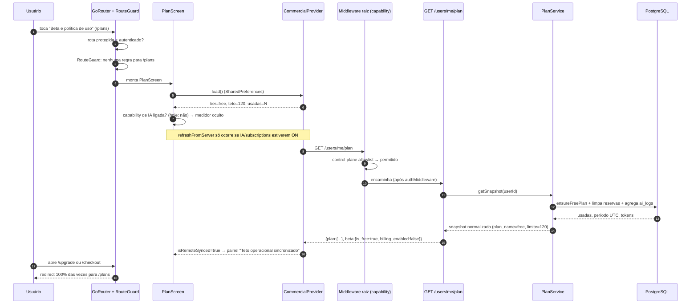

# Fluxo `commercial_plans` — Comercial: planos, upgrade, checkout, cobrança e cotas de IA

Estado: documentação de apoio, não autoritativa · gerado em 2026-09-21 sobre o commit d26f23a16 · verificação estática (nenhum teste foi executado)

> **Revisão adversarial aplicada em 2026-09-21** (commit b397f477b). As correções estão marcadas com **[corrigido]** ao longo do texto e resumidas na seção 11. Achados novos: A17–A23.

---

## 1. Resumo e veredito

Este fluxo **não existe em `docs/project_logic_contracts.json`** (as chaves `flows` declaram apenas `auth_session`, `card_collection`, `deck_lifecycle`, `deck_ai`, `battle_replay`, `life_counter_post_game`, `social_trade`, `release_operations`; `traceability` não contém nenhuma ocorrência de `plan`, `commercial`, `billing`, `checkout` ou `quota`). Foi reconstruído do código.

O nome do fluxo é enganoso em relação ao que o código faz. **Não existe comércio.** O que existe é:

1. uma **tela informativa** (`/plans`) que explica a beta gratuita e, quando a IA está liberada, mostra um medidor de cota;
2. duas **rotas de compatibilidade** (`/upgrade`, `/checkout`) que hoje **nunca renderizam suas próprias telas** — o guard as redireciona para `/plans`;
3. um **sistema real de cota de IA** server-authoritative (reserva atômica em PostgreSQL) que é a única parte com lógica de negócio de verdade;
4. dois **endpoints de billing fail-closed** (`POST /users/me/plan/checkout`, `POST /billing/webhook`) que **nenhum cliente chama** e que a política de capability transforma em 404 antes de chegarem ao handler.

| Eixo | Veredito | Evidência |
| --- | --- | --- |
| **Implementado** | **parcial** | `/plans` implementado e funcional (`app/lib/features/commercial/screens/plan_screen.dart:13`). Cota de IA implementada de ponta a ponta (`server/lib/plan_service.dart:132-253`, `server/lib/plan_middleware.dart:42-186`). Upgrade/checkout **implementados apenas como aviso**, sem qualquer ação (`upgrade_screen.dart:14`, `checkout_screen.dart:13`). Cobrança **deliberadamente não implementada** (`server/lib/billing/payment_provider.dart:21-59`). |
| **Alcançável hoje** | **parcial** | `/plans` é alcançável: não há regra de capability para ela em `ReleaseCapabilityRouteGuard` (`app/lib/core/config/release_capabilities.dart:350-534`) e `GET /users/me/plan` está no allowlist de plano de controle do servidor (`server/lib/release_capability_policy.dart:613`). `docs/MAPA_OPERACIONAL_DO_PROJETO.md:77` lista `/plans` entre as 10 rotas alcançáveis. **`/upgrade` e `/checkout` não são alcançáveis** (`release_capabilities.dart:514-518` + `main.dart:108`). O **medidor de cota não aparece** porque `ai_analyze_optimize_advisory` e `ai_generate_rebuild` estão `off` em `server/config/release_capabilities.json` — as 29 capabilities estão `allowed=false`. **A cota de IA, portanto, não é exercitável hoje por nenhum usuário.** |
| **Provado** | **parcial, e fraco onde importa** | 27 testes tocam o fluxo, mas a maioria dos testes de servidor são **asserções sobre strings do código-fonte**, não sobre comportamento (`server/test/plan_checkout_contract_test.dart:6-73`, `server/test/plan_service_test.dart:63-95`). **Nenhum teste chama o handler `GET /users/me/plan`**, **nenhum teste HTTP cobre `POST /users/me/plan/checkout` nem `POST /billing/webhook`**, e o único teste que exercita a contabilidade real de cota contra PostgreSQL (`server/test/ai_postgres_atomicity_live_test.dart:286-289`) está `skip` sem `MANALOOM_CONFIRM_POSTGRES_WRITES`. |

**Frase curta:** a tela existe e é alcançável; o motor de cota existe e é bem construído, mas está desligado e não tem prova viva; o "comercial" do nome do fluxo é um conjunto de rotas mortas que a documentação de evidência visual ainda declara como se renderizassem.

---

## 2. Jornada passo a passo

| # | Passo | Tela/widget (arquivo:linha) | Provider/cliente (arquivo:linha) | Método + endpoint | Handler (arquivo:linha) | Serviço/repositório | Tabelas |
| --- | --- | --- | --- | --- | --- | --- | --- |
| 1 | Usuário abre Perfil e toca "Beta e política de uso" | `app/lib/features/profile/profile_screen.dart:1037-1042` (`profile-open-plans-button`) | `context.push('/plans')` | — | — | — | — |
| 2 | Router decide se pode entrar | `app/lib/main.dart:353` (`/plans` é rota protegida), `:389-396` (sem auth → `/login`) | `AuthProvider` | — | — | — | — |
| 3 | Guard de capability é consultado | `app/lib/main.dart:426-434` → `ReleaseCapabilityRouteGuard.redirectFor` (`release_capabilities.dart:350`) | — | — | — | — | — |
| 4 | `/plans` monta | `app/lib/main.dart:723-726` → `PlanScreen` (`plan_screen.dart:13`) | `context.watch<CommercialProvider>()` (`plan_screen.dart:18`); `provider.load()` chamado dentro do `build` (`:27-29`) | — | — | — | — |
| 5 | Estado local do plano é lido | — | `CommercialProvider._load` (`commercial_provider.dart:65-75`) lê `manaloom.commercial.plan`, `...ai_usage_period`, `...ai_usage_count` (`:18-20`) | — | — | `SharedPreferences` | — (armazenamento local) |
| 6 | Medidor de cota é exibido **ou não** | `AiUsageMeter` (`ai_usage_meter.dart:10`), condicionado em `plan_screen.dart:20-26` e `ai_usage_meter.dart:17-25` | `ReleaseCapabilitiesProvider.isAllowed(aiAnalyzeOptimizeAdvisory \|\| aiGenerateRebuild)` | `GET /capabilities` (já carregado no boot, `release_capabilities.dart:251,273-304`) | `server/routes/capabilities/index.dart:8-14` | `ReleaseCapabilityPolicy.load` (`server/lib/release_capability_policy.dart:221-280`) | — (lê `server/config/release_capabilities.json`) |
| 7 | Sincronização autoritativa do plano | painel `_RemotePlanStatusPanel` (`plan_screen.dart:83-122`), só aparece se `isRemoteSynced \|\| lastRemoteError != null` (`:63-67`) | `CommercialProvider.refreshFromServer` (`commercial_provider.dart:77-133`), disparada em `main.dart:1061-1073` **só se** AI ou `subscriptions` estiverem ligadas, e em `ai_usage_gate.dart:37,52` | `GET /users/me/plan` (`commercial_provider.dart:103`) | `server/routes/users/me/plan/index.dart:8-36` | `PlanService.getSnapshot` (`server/lib/plan_service.dart:124-130`) | `user_plans`, `ai_logs` |
| 8 | Usuário dispara uma ação de IA | `deck_generate_screen.dart:357`, `deck_details_screen.dart:1707,1742,2231,2313`, `deck_analysis_tab.dart:90` | `reserveAiActionOrShowPaywall` (`ai_usage_gate.dart:9-34`) → autenticado usa `_checkAuthoritativeQuota` (`:36-41`); não autenticado debita contador local (`commercial_provider.dart:135-143`) | `GET /users/me/plan` | `server/routes/users/me/plan/index.dart:8` | `PlanService.getSnapshot` | `user_plans`, `ai_logs` |
| 9 | Servidor reserva a ação antes de executá-la | — | — | `POST /ai/generate` \| `/ai/optimize` \| `/ai/explain` \| `/ai/rebuild` \| `/ai/archetypes` (`server/routes/ai/_middleware.dart:13-19`; qualquer rota nova cai em metered por padrão, `:48-50`). **[corrigido]** exceção não documentada antes: `plan_middleware.dart:45-47` devolve o handler **sem reservar nada** quando o header `X-Internal-AI-Request-Token` casa (`internal_ai_request_token.dart:8-12`) — ver A17 | `aiPlanLimitMiddleware` (`server/lib/plan_middleware.dart:42-186`) | `PlanService.reserveAiAction` (`plan_service.dart:132-192`) com `pg_advisory_xact_lock` (`:146-154`) | `ai_logs` (linha `plan-reservation:*`, `success=false`) |
| 10 | Liquidação da reserva | — | `refreshAiUsageAfterAction` (`ai_usage_gate.dart:43-53`) refaz `GET /users/me/plan` | resposta da rota de IA | `plan_middleware.dart:142-169`: sucesso → `finalizeAiActionReservation` (`plan_service.dart:194-222`); erro → `releaseAiActionReservation` (`:224-239`); `202` com `settlementDeferred` → adiado (`plan_middleware.dart:23-25`) | — | `ai_logs` (renomeia para `plan:*`, `success=true`) |
| 11 | Cota esgotada | `AiQuotaLimitDialog` (`ai_usage_gate.dart:55-108`, key `ai-quota-limit-dialog`) | app: `canUseAi == false` (`commercial_provider.dart:51`) | — | servidor: `402` `Limite do plano atingido` (`plan_middleware.dart:96-117`) | — | — |
| 12 | Usuário abre `/upgrade` ou `/checkout` (link antigo) | `UpgradeScreen` (`upgrade_screen.dart:14`) / `CheckoutScreen` (`checkout_screen.dart:13`) — **nenhuma das duas renderiza hoje** | guard `release_capabilities.dart:514-518` → redirect `/plans` | — | — | — | — |
| 13 | Rotas de cobrança do servidor | — | **nenhum chamador no app** (grep por `users/me/plan/checkout` em `app/lib` retorna zero) | `POST /users/me/plan/checkout`, `POST /billing/webhook` | `server/routes/users/me/plan/checkout/index.dart:7-37`, `server/routes/billing/webhook/index.dart:6-14` | `ManaLoomPaymentProvider` (`server/lib/billing/payment_provider.dart:24-59`) | — |
| 14 | Atalho legal | `_LegalShortcutPanel` (`plan_screen.dart:124-159`, botão `plans-open-legal-button` `:150-154`) | `context.push('/legal')` | — | `/legal` é rota pública e boot-safe (`main.dart:369,471-476`) | — | — |
| 15 | Logout | — | `_clearAllProvidersState` → `_commercialProvider.clearRemoteSnapshot()` (`main.dart:1169`; impl. `commercial_provider.dart:145-174`) | — | — | zera tier, período e contador em `SharedPreferences` | — |

### Diagrama da jornada principal



---

## 3. Capabilities e portões

### Nomes dos dois lados

| Capability | App (`release_capabilities.dart`) | Servidor (`release_capability_policy.dart`) | Batem? |
| --- | --- | --- | --- |
| `billing_checkout` | `ReleaseCapability.billingCheckout` (`:29`) | chave `:37`; mapeada em `:519-523` | **sim** |
| `subscriptions` | `ReleaseCapability.subscriptions` (`:30`) | chave `:38` | nome sim, **uso não** — ver abaixo |
| `ai_analyze_optimize_advisory` | `:12` | `:21`, mapeada em `:431-442` | sim |
| `ai_generate_rebuild` | `:13` | `:22`, mapeada em `:425-430` | sim |

### O que cada portão faz neste fluxo

**Servidor** (`server/routes/_middleware.dart:105-144`):

- `GET /users/me/plan` → `requiredCapabilityForRequest` devolve `null` e o request está no allowlist exato de plano de controle (`release_capability_policy.dart:613`) → **sempre permitido**, mesmo com tudo `off`.
- `POST /users/me/plan/checkout` e `POST /billing/webhook` → capability `billing_checkout` (`:519-523`), que está `allowed=false` em `server/config/release_capabilities.json` → **404 `capability_unavailable`** com corpo `{error, capability, release_capability:'off', policy_version, policy_digest_sha256, offer_mode}` (`_middleware.dart:128-143`). O handler nunca roda.
- `GET /users/me/plan/checkout` e `GET /billing/webhook` → capability `null` e **fora** do allowlist → **404 `capability_route_unclassified`** (`release_capability_policy.dart:172-177`). Confirmado pelo teste `server/test/release_capability_policy_test.dart:344-368`.
- `GET /health/commercial` está no allowlist (`:598`) mas é protegido por chave de operação (`server/routes/health/_middleware.dart:5-12`) — não é superfície de usuário.
- Config inválida → 503 `capability_policy_invalid` com as 29 forçadas `off` (`release_capability_policy.dart:179-186,629-644`).

**App** (`ReleaseCapabilityRouteGuard`, `release_capabilities.dart:350-534`):

- `/plans` → **nenhuma regra**. Não é bloqueada por capability nenhuma. É bloqueada apenas por autenticação (`main.dart:353,389-396`).
- `/upgrade` e `/checkout` → `:514-518` exige **`buildSupport.billingCheckout` E `capabilities.isAllowed(billingCheckout)`**. `buildSupport.billingCheckout = CommercialLaunchPolicy.paidCheckoutEnabled` (`main.dart:108`), que é `const false` sem flag de build (`commercial_launch_policy.dart:7`). **Logo, as duas rotas redirecionam para `/plans` incondicionalmente, mesmo que o servidor um dia ligue `billing_checkout`.**
- Snapshot default é `denied()` e qualquer falha de refresh volta a `denied()` (`release_capabilities.dart:256,313-317`) — backend inalcançável equivale a tudo desligado.

### É alcançável hoje?

| Superfície | Alcançável | Por quê |
| --- | --- | --- |
| `/plans` | **sim** | sem regra de guard; `GET /users/me/plan` é plano de controle |
| medidor de cota em `/plans` e no Perfil | **não** | `ai_analyze_optimize_advisory` e `ai_generate_rebuild` `off` (`plan_screen.dart:20-26`, `profile_screen.dart:1010`) |
| painel "Teto operacional sincronizado" | **praticamente não** | `refreshFromServer` no boot exige IA ou `subscriptions` ON (`main.dart:1061-1073`); `PlanScreen` nunca chama `refreshFromServer` por conta própria |
| `/upgrade`, `/checkout` | **não** | redirect para `/plans` |
| `POST /users/me/plan/checkout`, `POST /billing/webhook` | **não** | 404 pela política |
| diálogo de cota esgotada | **não** | depende de uma ação de IA, que está `off` |

### O que o usuário vê quando é negado

- `/upgrade` / `/checkout`: **redirect silencioso** para `/plans`. Não há mensagem, não há explicação. O teste de integração confirma isso e verifica explicitamente que os avisos próprios dessas telas **não** aparecem (`app/integration_test/app_existing_user_visual_audit_test.dart:1055,1063`).
- Endpoints de billing: **404** com corpo JSON de política. Como nenhum cliente os chama, o usuário nunca vê isso.
- Cota esgotada com IA ligada: diálogo `AiQuotaLimitDialog` com texto "Não existe compra, upgrade ou paywall nesta fase" (`ai_usage_gate.dart:90-96`).

---

## 4. Contrato app↔servidor

| Endpoint | Chamador no app | Método/caminho conferem? | Corpo enviado | Campos lidos pela resposta | Campos ignorados | Veredito |
| --- | --- | --- | --- | --- | --- | --- |
| `GET /users/me/plan` | `commercial_provider.dart:103` | **sim** — handler aceita só GET (`plan/index.dart:9-11`) | nenhum | `plan.plan_name`, `plan.ai_requests_used`, `plan.ai_monthly_limit`, `plan.usage_period_start` (`commercial_provider.dart:192-206`) | `plan.status`, `plan.ai_requests_remaining`, `plan.estimated_cost_usd`, `plan.estimated_cost_pricing_version`, `plan.estimated_cost_coverage_ratio`, `plan.usage_period_end`, e **todo o objeto `beta.{is_free,billing_enabled,purchase_available,message}`** (`plan/index.dart:21-27`) | **coerente, com desperdício** — 7 campos enviados e ignorados |
| `GET /capabilities` | `release_capabilities.dart:251,281` | sim | nenhum | envelope completo validado com chaves exatas (`release_capabilities.dart:193-208`) e 29 entradas (`:118-121`) | — | coerente |
| `POST /users/me/plan/checkout` | **nenhum** | n/a | `{plan_name}` opcional, default `'pro'` (`checkout/index.dart:21`) | n/a | n/a | **endpoint sem chamador** |
| `POST /billing/webhook` | n/a (é entrada de provedor externo) | — | ignora o corpo por completo (`webhook/index.dart:11`) | n/a | n/a | **endpoint sem produtor real**; retorna 410 por design, mas é 404 pela política |
| Headers `X-Plan-Name` / `X-Plan-Limit` / `X-Plan-Used` | **nenhum** | — | — | o app não lê nenhum desses headers (grep em `app/lib` retorna zero) | todos | **emitidos em toda resposta de IA (`plan_middleware.dart:176-183`) e descartados** |
| `402 Limite do plano atingido` | **nenhum tratamento específico** | — | — | **[corrigido]** os chamadores reais das rotas *metered* são `deck_provider_support_ai.dart:104` (`/ai/optimize`) e `:216` (`/ai/rebuild`), `deck_provider_support_generation.dart:311,484` (`/ai/generate`), `deck_provider_support_mutation.dart:200` (`/ai/archetypes`) e `card_provider.dart:466` (`/ai/explain`). Todos caem no `throw Exception(FriendlyErrorMapper.fromApiResponse(...))` (ex.: `deck_provider_support_ai.dart:161-166`), que **lê `body['error']`** (`friendly_error_mapper.dart:51-54,261-322`) e devolve a string `Limite do plano atingido` | `beta_mode`, `billing_enabled`, `purchase_available`, `ai_requests_remaining`, `plan_name`, `ai_monthly_limit`, `ai_requests_used` | **o corpo estruturado montado em `plan_middleware.dart:96-116` é descartado — só a string `error` sobrevive.** A citação anterior (`deck_provider.dart:1055,1074`) estava **errada**: aquelas linhas chamam `/ai/commander-learning`, rota `authOnly` (`server/routes/ai/_middleware.dart:39-41`) que **nunca** passa pelo `aiPlanLimitMiddleware` e portanto jamais devolve 402 |

### Divergências de enum e de semântica

- **`plan_name`**: o servidor sempre devolve `'free'` (`plan_service.dart:259`), mas a tabela aceita `'free' | 'pro'` (`database_setup.sql:44`). O app normaliza qualquer string para `free` (`manaloom_plan.dart:19`). Coerente **por normalização em ambos os lados**, não por contrato.
- **`status`**: o servidor sempre devolve `'active'` (`plan_service.dart:260`), então o ramo `402 Plano inativo` de `plan_middleware.dart:81-94` é **código morto inalcançável**.
- **Teto 120**: duplicado em `ManaLoomPlan.operationalAiMonthlyCeiling = 120` (`manaloom_plan.dart:33`) e `PlanService.freeBetaAiMonthlyOperationalLimit = 120` (`plan_service.dart:94`). **Nenhum teste liga os dois.**

---

## 5. Dados: tabelas e migrações

| Tabela | Definição | Papel neste fluxo | Escrita por |
| --- | --- | --- | --- |
| `user_plans` | `server/database_setup.sql:36-46` (CHECK de `plan_name` em `:44`, `renews_at` em `:42`); migração `create_user_plans` (v011) em `server/bin/migrate.dart:260-289`; verificação em `server/bin/verify_schema.dart:28-34` | PK `user_id`, `plan_name TEXT DEFAULT 'free'` com CHECK `IN ('free','pro')`, `status TEXT DEFAULT 'active'` com CHECK `IN ('active','canceled')`, `started_at`, `renews_at`, `updated_at`. Índice `idx_user_plans_plan_status` | **[corrigido]** dois escritores, não um: `PlanService._ensureFreePlan` (`plan_service.dart:105-114`, `INSERT ... ON CONFLICT DO NOTHING` com `'free'`/`'active'`) **e o backfill da própria migração 011** (`migrate.dart:278-283`, `INSERT ... SELECT u.id,'free','active' FROM users u`). Nenhum código escreve `'pro'`. Também é **lida** por `CommercialMetricsService._planMix` (`commercial_metrics_service.dart:337-347`) |
| `ai_logs` | `server/database_setup.sql:1668-1684`; migração em `server/bin/migrate.dart:34-53` | **é o ledger de cota.** Colunas usadas: `user_id`, `endpoint`, `model`, `success`, `latency_ms`, `input_tokens`, `output_tokens`, `created_at` | reserva: `INSERT` com `endpoint='plan-reservation:<método>:<path>'`, `model='application_action'`, `success=FALSE` (`plan_service.dart:166-185`); liquidação: `UPDATE` que renomeia para `plan:*` e marca `success=TRUE` (`:200-214`); liberação: `DELETE` (`:228-235`) |
| `activation_funnel_events`, `shared_deck_reports`, `post_game_notes`, `users` | — | lidas por `CommercialMetricsService` para `/health/commercial` (`server/lib/commercial_metrics_service.dart:197,365,386,411`) | não escritas por este fluxo |
| **[corrigido]** `ai_logs` e `user_plans` pelo lado de operação | — | `CommercialMetricsService` também lê `ai_logs` (`:100,244,299,311`) e `user_plans` (`:342`); `_aiActionUsage` (`:293-335`) reproduz a convenção `plan:%` / `plan-reservation:%` e o TTL de 10 min **em SQL literal**, sem constante compartilhada com `PlanService` (ver A20) | não escritas |

**Como a cota é contada** (`plan_service.dart:263-292`): `COUNT(*)` sobre `ai_logs` do mês UTC corrente onde (`endpoint LIKE 'plan:%' AND success = TRUE`) **ou** (`endpoint LIKE 'plan-reservation:%' AND success = FALSE AND created_at >= NOW() - 600s`). O período é `date_trunc('month', NOW() AT TIME ZONE 'UTC')`. Reservas expiradas (TTL 10 min, `:97`) são apagadas na leitura e na reserva (`:241-253`).

**Concorrência**: a reserva roda dentro de `pool.runTx` com `pg_advisory_xact_lock(hashtext('manaloom_ai_plan'), hashtext(userId))` (`:147-154`) — duas requisições simultâneas do mesmo usuário serializam. Esse é o ponto mais bem construído do fluxo.

**Não há migração alguma de billing**: nenhuma tabela de assinatura, cobrança, invoice ou evento de webhook existe. `renews_at` em `user_plans` está órfã (nunca escrita).

---

## 6. Estados e erros

| Estado | Tratado? | Onde |
| --- | --- | --- |
| **Carregando (local)** | parcial | `PlanScreen` chama `provider.load()` dentro do `build` (`plan_screen.dart:27-29`) e renderiza imediatamente com valores default (`free`, 120, 0). Não há skeleton nem spinner — o usuário pode ver "0 de 120" por um frame antes do valor real |
| **Carregando (remoto)** | **exposto mas não usado** | `isRefreshingRemote` existe (`commercial_provider.dart:42,98`) e **nenhuma tela o lê**. Nenhum indicador de sincronização |
| **Vazio** | n/a | a tela é informativa, não tem lista |
| **Erro de rede no plano** | parcial | `catch` genérico → `lastRemoteError = 'Plano remoto indisponível.'` (`commercial_provider.dart:122-126`) → painel amarelo com `cloud_off` (`plan_screen.dart:63-67`, `:92-121`). **Sem botão de tentar de novo.** O usuário não tem ação |
| **Resposta 200 com corpo inválido** | sim | `lastRemoteError = 'O servidor retornou um plano inválido.'` (`:112-115`); o teste `commercial_provider_test.dart:142-177` prova que um snapshot antes sincronizado é invalidado |
| **401 / sessão expirada** | **duas camadas, e a interna é silenciosa** | `CommercialProvider` trata 401/403 apagando `isRemoteSynced` **sem mensagem** (`:116-117`) → o painel não aparece. Em paralelo, `ApiClient.isSessionInvalidatingUnauthorized` casa com o corpo `'Token inválido ou expirado'` de `server/lib/auth_middleware.dart:47-49` e dispara o handler global de logout (`api_client.dart:96-117,623-627`). Resultado prático: o app desloga; o silêncio do provider é inofensivo mas também inútil |
| **403 de capability** | não ocorre neste fluxo | a política devolve **404**, não 403 (`release_capability_policy.dart:187-194`) |
| **404 de capability** | **não tratado** | `CommercialProvider._refreshFromServer` cai no `else` genérico → `'Não foi possível sincronizar o plano agora.'` (`:118-121`). O app não distingue "capability desligada" de "erro transitório". Como `GET /users/me/plan` é plano de controle, isso não acontece hoje |
| **402 limite de plano** | **não tratado como cota** | grep por `402` em `app/lib` retorna zero e grep por `X-Plan-` retorna zero. **[corrigido]** o app **não** mostra um erro genérico: `FriendlyErrorMapper._messageFromBody` (`friendly_error_mapper.dart:261-322`) repassa `body['error']`, então o usuário lê exatamente `Limite do plano atingido`. O que falta é o tratamento de cota: nenhum `ai-quota-limit-dialog`, nenhuma leitura de `ai_requests_remaining` nem dos headers `X-Plan-*`, e a mensagem sai como exceção genérica de erro no fluxo de deck |
| **Validação** | sim, no servidor | `POST /users/me/plan/checkout` valida JSON (`checkout/index.dart:14-19`) e rejeita plano ≠ `pro` com 400 (`:22-24`). Inalcançável hoje |
| **Offline / retry** | **não** | não há fila, não há retry, não há botão. `refreshFromServer` é fire-and-forget (`main.dart:1072`, `unawaited`) |
| **Duplo toque / concorrência no app** | sim | `refreshFromServer` deduplica por `_remoteRefreshFuture` (`commercial_provider.dart:82-92`), provado em `commercial_provider_test.dart:107-140`. `clearRemoteSnapshot` incrementa `_remoteRefreshGeneration` e descarta respostas em voo (`:146-157,97,104,123`), provado em `:179-245`. **Efeito colateral:** dois toques concorrentes em uma ação de IA compartilham o **mesmo snapshot** — ambos leem `remaining=1` e ambos passam. A serialização real fica com o `pg_advisory_xact_lock` do servidor, e o segundo recebe 402 sem tratamento |
| **Job assíncrono em andamento** | sim, no servidor | `settlementDeferred` + `202` adia a liquidação até o resultado terminal (`plan_middleware.dart:16-29`), com contrato testado em `server/test/ai_plan_async_settlement_contract_test.dart:8-100` |
| **Crash do handler durante uma ação de IA** | sim | `catch` libera a reserva e re-lança (`plan_middleware.dart:130-140`) |
| **Falha do próprio `reserveAiAction`** | sim | 503 `Plano temporariamente indisponível` (`plan_middleware.dart:68-78`) |

---

## 7. Testes por passo

| # | Passo | Testes que exercitam | O que de fato afirmam |
| --- | --- | --- | --- |
| 1 | Botão do Perfil → `/plans` | **nenhum** | `profile-open-plans-button` não aparece em nenhum arquivo de teste |
| 2 | Guard de auth em `/plans` | `app/test/features/commercial/legal_account_cycle_test.dart:159` | lê o **fonte** de `main.dart` para conferir que `/legal` e `/verify-email` ficam fora do conjunto protegido — não exercita `/plans` |
| 3 | Guard de capability (`/upgrade`, `/checkout` → `/plans`) | `app/test/core/config/release_capabilities_test.dart:388-389` e `:453-460` | **comportamento real**: chama `redirectFor` e confirma `/plans` tanto com capability negada quanto com capability concedida mas sem suporte de build. Bom teste |
| 4 | Render de `PlanScreen` | `app/test/features/commercial/commercial_screens_responsive_test.dart:13-54` | confirma presença de `beta-free-access-panel`, ausência de `R$`, de `plan-pro-upgrade-button` e do medidor; checa larguras. **Só posição e string** — não exercita provider nem rede |
| 5 | Leitura local de plano/uso | `app/test/features/commercial/commercial_provider_test.dart:19-71` | **comportamento real**: 120 consumos, bloqueio no 121º, normalização de `'pro'` legado, rollover de período |
| 6 | Medidor sob capability | `app/test/features/commercial/ai_usage_meter_test.dart:28-100` | **comportamento real**: com política toda `off`, o medidor some **e `load()` não é chamado** (`loadCalls == 0`). Ótimo teste |
| 7 | `GET /users/me/plan` — lado app | `commercial_provider_test.dart:73-245`, `ai_usage_gate_test.dart:73-133` | **comportamento real** com `MockClient`: teto remoto de 2500 é rebaixado para 120; dedup de requisições concorrentes; invalidação por corpo malformado; reset de sessão descarta resposta em voo; ação autenticada não debita localmente |
| 7 | `GET /users/me/plan` — lado servidor | **nenhum** | não existe teste que invoque `onRequest` de `server/routes/users/me/plan/index.dart`, nem que valide o corpo `{plan, beta}` |
| 8 | Diálogo de cota esgotada | `ai_usage_gate_test.dart:22-71` | **comportamento real**: para os 5 `AiUsageKind`, o diálogo aparece com o rótulo certo e o texto "Não existe compra, upgrade ou paywall" |
| 9 | Classificação de rota metered | `server/test/ai_middleware_order_contract_test.dart:11-141` | **7 testes, todos por leitura de string do fonte**: ordem `authMiddleware` antes de `aiPlanLimitMiddleware`, conjunto de paths metered, fallback de rota nova. Não sobe handler nenhum |
| 9/10 | Reserva/liquidação de cota em PostgreSQL | `server/test/ai_postgres_atomicity_live_test.dart` | **único teste de comportamento real contra o banco** — e está `skip` sem `MANALOOM_CONFIRM_POSTGRES_WRITES` (`:286-289`) |
| 10 | Liquidação adiada de job assíncrono | `server/test/ai_plan_async_settlement_contract_test.dart:8-100` | 3 testes de **função pura** (`aiPlanReservationSettlementDirective`, `aiPlanUsedAfterRequest`) + 1 por string do fonte |
| 11 | Cota 402 | **nenhum teste de app** | nenhum arquivo em `app/test` menciona 402 |
| 12 | `/upgrade` e `/checkout` como telas | `checkout_screen_test.dart:6-18`, `commercial_screens_responsive_test.dart:133-231`, `manaloom_commercial_ui_audit_test.dart:55-73` | testam as telas **fora do router**, montando o widget direto. Provam que não há botão de pagamento. **Nenhum deles prova que o usuário chega lá — e ele não chega** |
| 12 | Redirect real, em runtime | `app/integration_test/app_existing_user_visual_audit_test.dart:1050-1064` | **comportamento real**: navega para `/upgrade` e `/checkout` e afirma `expect(find.byKey(Key('upgrade-beta-notice')), findsNothing)`. Confirma o redirect |
| 13 | Checkout / webhook fail-closed | `server/test/payment_provider_url_test.dart:15-30` | **único teste de comportamento** do lado billing: chama `createCheckout` e `verifyWebhook` direto e confere 403/410. Não passa por HTTP nem pelo middleware |
| 13 | Checkout / webhook — contrato | `server/test/plan_checkout_contract_test.dart:6-73` | **3 testes 100% por `readAsStringSync` + `contains`**. Provam que certas strings existem ou não existem nos arquivos. Não executam nada |
| 13 | Capability de billing | `server/test/release_capability_policy_test.dart:221,278-285,344-368` | **comportamento real** de `requiredCapabilityForRequest` e do allowlist: `POST` mapeia para `billing_checkout`, `GET` não é plano de controle |
| 14 | Atalho `/legal` a partir de `/plans` | **nenhum** | `plans-open-legal-button` não aparece em nenhum teste |
| 15 | Limpeza no logout | `commercial_provider_test.dart:247-284` | **comportamento real**: reset apaga tier, uso e persiste |
| — | Painel `_RemotePlanStatusPanel` na tela | **nenhum** | nenhum teste renderiza `PlanScreen` com `isRemoteSynced=true` ou com `lastRemoteError` preenchido; as strings "Teto operacional sincronizado" e "Não foi possível confirmar o teto" não aparecem em `app/test` |
| — | Métricas comerciais | `server/test/commercial_metrics_service_test.dart:7-98` | 6 testes de normalização de janela e de predicado SQL compartilhado. Não tocam a jornada do usuário |
| — | **[corrigido]** Âncora e baseline da matriz visual | `app/test/ui/ui_authenticated_visual_matrix_test.dart:151-209` e `:301-343` | **Arquivo que a versão anterior deste documento omitiu.** `:151-209` valida que os 54 checkpoints — incluindo `upgrade_success` e `checkout_success` — têm rota, âncora e `source` existente, mas a âncora é conferida por `contains` no **texto-fonte** (`:196`), nunca por render; `:301-343` confere que cada um dos 4 perfis declarados tem exatamente um PNG por checkpoint. Por isso a deriva do A3 passa |
| — | **[corrigido]** Classificação de toda rota de servidor | `server/test/release_capability_policy_test.dart:309-343` | Outro teste omitido: assegura que **todo** arquivo de rota está classificado por capability ou explicitamente no plano de controle. É o que garante que `/users/me/plan`, `/users/me/plan/checkout` e `/billing/webhook` não escapem da política — mas não diz nada sobre o corpo de nenhuma resposta |

**Passos sem teste nenhum: 5** — entrada pelo Perfil (1), handler `GET /users/me/plan` no servidor (7-servidor), tratamento de 402 no app (11), atalho legal a partir de `/plans` (14), e o painel de status remoto de `/plans`.

**Testes que só verificam string/posição sem exercitar comportamento: 13** — os 3 de `plan_checkout_contract_test.dart`, 2 de `plan_service_test.dart` (`:45`, `:63`; o de `:79` também é leitura de fonte, mas recorta o bloco de `activatePro`), 7 de `ai_middleware_order_contract_test.dart`, e o de `legal_account_cycle_test.dart:159`. Somados ao `payment_provider_url_test.dart:7`, são 14 de ~27 testes do fluxo.

**[corrigido]** essa contagem subestimava o inventário: faltavam `app/test/ui/ui_authenticated_visual_matrix_test.dart` (6 testes, 2 relevantes a este fluxo) e `server/test/release_capability_policy_test.dart:309-343`. Os dois acrescentados são de comportamento real, mas nenhum deles exercita o handler `GET /users/me/plan` nem o render de `/upgrade` e `/checkout`, então o veredito "provado fraco onde importa" não muda.

---

## 8. Achados

| # | Severidade | Tipo | Achado | Arquivo:linha | Como provar |
| --- | --- | --- | --- | --- | --- |
| A1 | ~~alta~~ **média** **[corrigido]** | acoplamento deliberado (não é bug latente) | **Elevar o teto de IA no servidor deixa o usuário travado no app.** `_applyRemotePlan` faz `limit = (reportedLimit ?? 120).clamp(0, 120)` (`:197-198`) e depois `used = used.clamp(0, limit)` (`:201`). Com `ai_monthly_limit: 500, ai_requests_used: 200` o app grava `limit=120, used=120` → `remainingAiActions == 0` (`:49-51`) → `_checkAuthoritativeQuota` devolve `false` (`ai_usage_gate.dart:40`) → `AiQuotaLimitDialog` bloqueia a ação que o servidor autorizaria. **Correção da revisão:** isto **não** é um defeito não visto — é comportamento *fail-closed* declarado e já assertado por `app/test/features/commercial/commercial_provider_test.dart:73-104` ("legacy remote Pro snapshot cannot raise the beta ceiling"), que fixa `monthlyAiLimit == 120`, `usedAiActions == 120` e `remainingAiActions == 0` para um snapshot remoto de 2500/2499. O risco real é de **forward-compatibility**: subir o teto no servidor exige release do app, e nada no repositório registra esse acoplamento | `app/lib/features/commercial/providers/commercial_provider.dart:197-201`; gate em `ai_usage_gate.dart:36-41`; teste que fixa o comportamento em `commercial_provider_test.dart:73-104` | O teste que a versão anterior deste doc propunha **já existe** e assegura o oposto do que ela sugeria. O que falta provar é a intenção: registrar em contrato que `operationalAiMonthlyCeiling` é um teto de cliente e que elevar o servidor sem release do app trava o usuário |
| A2 | **alta** | passo-sem-teste | **O handler `GET /users/me/plan` não tem teste nenhum.** É o único endpoint deste fluxo que o app realmente chama e o único alcançável hoje. Nada garante o shape `{plan:{...}, beta:{...}}` nem o 500 do `catch` | `server/routes/users/me/plan/index.dart:8-36` | Escrever `server/test/users_me_plan_route_test.dart` que monte um `RequestContext` com `Pool` de teste e assegure as 10 chaves de `plan` e as 4 de `beta`. Ou live test contra PG aprovado |
| A3 | **alta** | doc-defasada | **A matriz de evidência visual declara âncoras que nunca renderizam.** `ui_authenticated_visual_matrix.json` registra `upgrade_success` com `anchor: "upgrade-beta-notice"` (`:218-224`) e `checkout_success` com `anchor: "checkout-beta-notice"` (`:226-232`), mas o próprio teste de runtime afirma `findsNothing` para as duas e captura a tela `/plans`. **[corrigido] a duplicidade é maior do que a versão anterior deste doc registrou**: as três capturas são byte-idênticas em **quatro** perfis — `web_mobile` (`d44590a35fb66968f11d2382a2b8adf7`), `web_desktop` (`5b03326aa1e9ec234e8f5085e71d7e68`), `web_wide` (`37dbc6a58a2927a4700decb607bee41b`) e `android_emulator` (`c444643119b6d8aacc49d7b94a9e9973`) | `app/test/ui/fixtures/ui_authenticated_visual_matrix.json:218-232` vs `app/integration_test/app_existing_user_visual_audit_test.dart:1055,1063` | Já provado por `md5` nos quatro perfis. **[corrigido] a explicação anterior estava errada:** a deriva não passa "porque só o Pack 08 valida âncora". Existe sim um teste que valida a âncora de **todos os 54** checkpoints da matriz — `app/test/ui/ui_authenticated_visual_matrix_test.dart:151-209` (arquivo que a versão anterior deste doc nem citava). Ele passa porque a checagem é `source.readAsStringSync().contains(anchor)` (`:196`): `upgrade_screen.dart:38` e `checkout_screen.dart:37` **contêm** as strings, embora as telas nunca sejam montadas em runtime. A âncora é validada como texto de fonte, nunca como render |
| A4 | **média** | estado-nao-tratado | **O app não trata `402` como cota.** O servidor monta um corpo completo (`beta_mode`, `billing_enabled`, `purchase_available`, `plan_name`, `ai_monthly_limit`, `ai_requests_used`, `ai_requests_remaining`) e headers `X-Plan-*`; o app não lê nada disso e não mostra `ai-quota-limit-dialog`. **[corrigido] a citação e a consequência estavam erradas na versão anterior:** (a) `deck_provider.dart:1055,1074` chama `/ai/commander-learning`, rota `authOnly` que **nunca** é *metered* (`server/routes/ai/_middleware.dart:39-41`) e portanto jamais devolve 402; (b) o usuário **não** vê um "erro genérico" — `FriendlyErrorMapper` repassa `body['error']`, então a tela mostra literalmente `Limite do plano atingido`. O defeito é a ausência do caminho de cota (diálogo, saldo, headers), não a ausência de mensagem | `server/lib/plan_middleware.dart:96-116,176-183` vs `app/lib/features/decks/providers/deck_provider_support_ai.dart:161-166`, `deck_provider_support_generation.dart:311,484`, `deck_provider_support_mutation.dart:200`, `card_provider.dart:466`; mapeamento em `app/lib/core/utils/friendly_error_mapper.dart:51-54,261-322`; grep por `402` e por `X-Plan-` em `app/lib` = 0 | Teste de widget em `deck_generate_screen` ou provider test em `deck_provider_support_ai`: `MockClient` devolvendo 402 com esse corpo; hoje sai a string do servidor como exceção, **não** `ai-quota-limit-dialog` |
| A5 | **média** | bug-provavel | **O `402 Plano inativo` é código morto inalcançável.** `plan_middleware.dart:81` testa `snapshot.status != 'active'`, mas `_loadSnapshot` fixa `const status = activeOfferStatus` = `'active'` (`plan_service.dart:260`, com `activeOfferStatus = 'active'` em `:96`). Nenhuma linha de `user_plans` com `status='canceled'` consegue produzir esse 402 — o CHECK da tabela aceita `'canceled'` (`database_setup.sql:45`), mas a leitura normaliza antes de qualquer decisão. **[corrigido] há um segundo ramo morto idêntico**: `plan_service.dart:158` (`if (snapshot.status != 'active' \|\| ...)`) também nunca nega por status | `server/lib/plan_middleware.dart:81-94` e `server/lib/plan_service.dart:158` vs `server/lib/plan_service.dart:96,259-260` | Teste de função: construir um `UserPlanSnapshot` com `status:'canceled'` e verificar que `PlanService._loadSnapshot` nunca o produz. Ou remover os dois ramos e observar que nenhum teste quebra (`plan_service_test.dart:63-77` só assegura as constantes, não o ramo) |
| A6 | **média** | capability | **`/upgrade` e `/checkout` são inalcançáveis por constante de build, não por política.** Mesmo que o servidor ligue `billing_checkout`, `buildSupport.billingCheckout` é `const false` e o redirect continua. A capability do servidor vira decorativa para essas rotas | `app/lib/core/config/release_capabilities.dart:514-518`; `app/lib/main.dart:108`; `app/lib/features/commercial/models/commercial_launch_policy.dart:7` | Já provado por `app/test/core/config/release_capabilities_test.dart:453-460`, que assegura `/plans` mesmo com `billingCheckout` concedido. É design deliberado (comentado em `commercial_launch_policy.dart:1-5`), mas **não está registrado em nenhum contrato** |
| A7 | **média** | incoerencia-app-servidor | **`POST /billing/webhook` responde 404, não 410.** A política intercepta antes do handler. Se um provedor de pagamento real for apontado para essa URL, ele verá "endpoint inexistente" em vez do 410 `beta_free_only` que a documentação (`server/doc/API_CONTRACTS_AND_DATA_MAP.md:86`) e o teste unitário descrevem | `server/lib/release_capability_policy.dart:519-523` + `server/routes/_middleware.dart:110-143` vs `server/lib/billing/payment_provider.dart:49-59` | Teste de integração HTTP do dart_frog batendo em `POST /billing/webhook` com a config corrente: espera-se 404 `capability_unavailable`, não 410 |
| A8 | **média** | passo-sem-teste | **O painel de status remoto de `/plans` não tem teste.** É a única realimentação visual de erro do fluxo e nenhum teste o renderiza em estado sincronizado nem em estado de erro | `app/lib/features/commercial/screens/plan_screen.dart:63-67,83-122` | `testWidgets` montando `PlanScreen` com um `CommercialProvider` fake com `isRemoteSynced=true` e depois com `lastRemoteError` preenchido; assertar os dois textos e a cor do ícone |
| A9 | **baixa** | incoerencia-app-servidor | **Sete campos da resposta são enviados e ignorados**, incluindo o objeto `beta` inteiro, que é justamente a declaração "não há cobrança" que a tela reproduz **hardcoded** em português. A tela mostra texto constante em vez do texto autoritativo do servidor (`beta.message`) | `server/routes/users/me/plan/index.dart:21-27` vs `app/lib/features/commercial/providers/commercial_provider.dart:191-212`; texto fixo em `free_beta_notice.dart:110` | Grep já basta. Para provar o risco: mudar `beta.message` no servidor e observar que a tela não muda |
| A10 | **baixa** | bug-provavel | **O período local de cota usa mês local, não UTC.** `_periodFrom(_now())` com `_now = DateTime.now` (local), enquanto `_applyRemotePlan` grava o mês **UTC** do servidor e o texto do produto promete "por mês UTC". Em UTC-3, na virada do mês, `_rolloverIfNeeded` pode zerar o contador local antes/depois do servidor | `app/lib/features/commercial/providers/commercial_provider.dart:15,70,177,206,220-224` vs `manaloom_plan.dart:62` e `docs/status/CURRENT_PRODUCT_DECISION.md:39` | Teste com `now: () => DateTime(2026,8,31,22,0)` em fuso local negativo e um snapshot remoto com `usage_period_start` de setembro UTC; assertar `periodKey`. Hipótese: só afeta o contador local (não autenticado) |
| A11 | **baixa** | ux-funcional | **Erro de sincronização do plano não oferece ação.** O painel mostra "Plano remoto indisponível." sem botão de tentar de novo, e `PlanScreen` nunca chama `refreshFromServer` por conta própria — o usuário não tem como sair desse estado sem sair da tela | `app/lib/features/commercial/screens/plan_screen.dart:83-122`; `commercial_provider.dart:122-126` | Teste de widget confirmando ausência de qualquer botão dentro de `_RemotePlanStatusPanel` |
| A12 | **baixa** | outro | **Capability `subscriptions` é órfã no servidor.** Existe nas 29 chaves e é consultada pelo app (`main.dart:1069`) para decidir se busca o plano remoto, mas **não guarda nenhuma rota** — `requiredCapabilityForRequest` nunca a devolve | `server/lib/release_capability_policy.dart:38` (só a chave); `app/lib/main.dart:1069` | Grep: `subscriptions` aparece 1× em `server/lib`, 0× em `server/routes`. Se ligada isoladamente, faria o app buscar o plano sem liberar nada |
| A13 | **baixa** | doc-defasada | **`renews_at` em `user_plans` não é lida nem escrita por código de produção** — é resíduo do modelo pago, como o CHECK que ainda aceita `plan_name='pro'` (`database_setup.sql:44`). **[corrigido] mas não é "órfã" no sentido de removível:** `server/bin/verify_schema.dart:28-34` declara `renews_at` (`:33`) como coluna **obrigatória** de `user_plans`, e a migração 011 a cria (`migrate.dart:269`). Apagar a coluna quebraria o verificador de schema | `server/database_setup.sql:42`; `server/bin/migrate.dart:269`; `server/bin/verify_schema.dart:33` | Grep por `renews_at`: 4 ocorrências no `server/` — `database_setup.sql:42`, `migrate.dart:269`, `verify_schema.dart:33` e `plan_checkout_contract_test.dart:47` (este último afirma a **ausência** da string no `plan_service.dart`). Zero em `server/lib` de produção e zero em `server/routes` |
| A14 | **baixa** | outro | **Teto 120 duplicado sem contrato.** `ManaLoomPlan.operationalAiMonthlyCeiling` e `PlanService.freeBetaAiMonthlyOperationalLimit` são constantes independentes com o mesmo valor. Combinado com A1, divergi-las quebra o usuário silenciosamente | `app/lib/features/commercial/models/manaloom_plan.dart:33` e `server/lib/plan_service.dart:94` | Nenhum teste cruza os dois. Prova: alterar um dos dois e rodar as suítes — tudo passa |
| A15 | **baixa** | outro | **`consumeAiAction` debita antes de saber se a ação deu certo** (caminho não autenticado). Como as rotas de IA exigem JWT, esse caminho só existe pré-login, mas o contador local é gravado mesmo assim | `app/lib/features/commercial/widgets/ai_usage_gate.dart:21-23`; `commercial_provider.dart:135-143` | Teste: `ApiClient.resetForTesting()` sem token, chamar `reserveAiActionOrShowPaywall` e conferir que `usedAiActions` incrementou sem nenhuma chamada HTTP |
| A16 | **baixa** | seguranca | **Não é achado de vulnerabilidade, é confirmação:** o caminho de billing é fail-closed em três camadas independentes (política de capability → 404; constante de build do app; provider sem escape de ambiente). `plan_checkout_contract_test.dart:22-24` verifica explicitamente a ausência de `MANALOOM_INTERNAL_CHECKOUT_ENABLED`, `ALLOW_INTERNAL_PRO_ACTIVATION` e `MANALOOM_PRO_CHECKOUT_URL` | `server/lib/billing/payment_provider.dart:16-20`; `server/lib/plan_service.dart:116-122` | Já provado pelos testes citados |

### Achados acrescentados pela revisão adversarial

| # | Severidade | Tipo | Achado | Arquivo:linha | Como provar |
| --- | --- | --- | --- | --- | --- |
| A17 | **média** | capability / estado-nao-tratado | **A cota de IA tem um bypass por header que nenhum contrato registra.** `aiPlanLimitMiddleware` devolve o handler imediatamente, **antes de qualquer reserva**, quando o request traz `X-Internal-AI-Request-Token` válido. O token é um segredo aleatório por processo (`Random.secure()`, 24 bytes), então não é uma vulnerabilidade externa — mas é um caminho real dentro do processo: `optimize_route_internal.dart:56` e `ai/generate/index.dart:1601` emitem esse header em chamadas internas, e o mesmo bypass existe no rate limit (`rate_limit_middleware.dart:476`). Consequência: trabalho de IA alcançado por um salto interno **não debita cota**, e a afirmação de produto "o backend é a autoridade do saldo autenticado" (`docs/status/CURRENT_PRODUCT_DECISION.md:44`) tem uma exceção não escrita | `server/lib/plan_middleware.dart:45-47`; `server/lib/internal_ai_request_token.dart:6-12`; emissores em `server/lib/ai/optimize_route_internal.dart:56` e `server/routes/ai/generate/index.dart:1601` | Teste de contrato que monte o middleware com o header e assegure que `reserveAiAction` não foi chamado; hoje só existe uma asserção de string sobre a existência da linha (`server/test/ai_generate_provider_abort_test.dart:123`). Prova viva: disparar um generate assíncrono e conferir se o salto interno cria uma segunda linha `plan-reservation:*` em `ai_logs` (esperado: não cria) |
| A18 | **média** | doc-defasada | **O contrato declara `/billing/webhook` como rota pública e omite `/capabilities`.** `docs/project_logic_contracts.json:316` inclui `/billing/webhook` entre os 14 `public_api_paths`; `/capabilities` **não** está lá. Essa lista alimenta o gerador de OpenAPI (`tools/project_logic/lib/project_logic_generator.dart:3641-3682`), que só emite `security: bearerAuth` para caminhos **fora** da lista (`:3678-3682`). Resultado no artefato gerado: `POST /billing/webhook` sai **sem** `security` (declarado público) embora em runtime morra em 404 `capability_unavailable`; e `GET /capabilities` sai **com** `bearerAuth` embora não exista `server/routes/capabilities/_middleware.dart` e a rota seja plano de controle servida sem token (`release_capability_policy.dart:592,613`) | `docs/project_logic_contracts.json:302-317`; `docs/generated/openapi.generated.json` (`/capabilities` → `security: [{bearerAuth: []}]`; `/billing/webhook` → `security` ausente); gerador em `tools/project_logic/lib/project_logic_generator.dart:3641-3682` | `python3 -c "import json;d=json.load(open('docs/generated/openapi.generated.json'));print(d['paths']['/capabilities']['get'].get('security'), d['paths']['/billing/webhook']['post'].get('security'))"` → `[{'bearerAuth': []}] None`. Já rodado nesta revisão |
| A19 | **baixa** | passo-sem-teste | **O próprio artefato gerado confirma A2.** `docs/generated/openapi.generated.json` registra `x-manaloom-tests` com **zero** entradas para `GET /users/me/plan` e para `POST /users/me/plan/checkout`, enquanto `/capabilities` tem 1 e `/health/commercial` tem 2. A ausência de teste de rota não é uma leitura deste documento: é um dado publicado pelo gerador | `docs/generated/openapi.generated.json` (operações de `/users/me/plan` e `/users/me/plan/checkout`) | Mesmo comando do A18, lendo `x-manaloom-tests`. Já rodado |
| A20 | **baixa** | outro | **A convenção de ledger da cota está duplicada em SQL literal entre dois serviços.** `PlanService` define `_reservationTtl = Duration(minutes: 10)` (`plan_service.dart:97`) e injeta o valor como parâmetro; `CommercialMetricsService._aiActionUsage` refaz a mesma janela como `INTERVAL '10 minutes'` **escrito à mão** (`commercial_metrics_service.dart:310-314`) e extrai a ação com `SUBSTRING(endpoint FROM 6)` (`:297`), que codifica o comprimento do prefixo `plan:`. Mudar o TTL ou o prefixo em `PlanService` faz o painel `/health/commercial` divergir silenciosamente. Mesma classe do A14 | `server/lib/plan_service.dart:97,136,162` vs `server/lib/commercial_metrics_service.dart:297,300,310-314` | Alterar `_reservationTtl` para 5 minutos e rodar as duas suítes: nenhum teste cruza os valores. `server/test/commercial_metrics_service_test.dart` cobre `normalizeWindowDays` e o predicado de provider, não o TTL nem o prefixo |
| A21 | **média** | bug-provavel / ux-funcional | **O medidor de IA pode exibir um saldo falso de `0 de 120`.** `AiUsageMeter` lê `provider.usageSnapshot` e só chama `load()` (local, `ai_usage_meter.dart:29-32`); nunca chama `refreshFromServer`. Para um usuário **autenticado**, o contador local nunca é incrementado — `consumeAiAction` só roda no ramo não autenticado (`ai_usage_gate.dart:21-23`) — então o medidor mostra o valor remoto **apenas** se um sync tiver ocorrido. Os únicos gatilhos são o boot (`main.dart:1071-1072`, `unawaited`, fire-and-forget) e `refreshAiUsageAfterAction` depois de uma ação. Se o sync de boot falhar, o medidor do Perfil (`profile_screen.dart:1010-1012`) exibe `0 de 120` e `0%` sem nenhum sinal de erro: o painel `_RemotePlanStatusPanel` que sinalizaria a falha só existe em `/plans` (`plan_screen.dart:63-67`) | `app/lib/features/commercial/widgets/ai_usage_meter.dart:27-32,110-118`; `app/lib/features/profile/profile_screen.dart:1010-1012`; `app/lib/main.dart:1060-1073`; `app/lib/features/commercial/widgets/ai_usage_gate.dart:21-23` | Teste de widget: `ReleaseCapabilitiesProvider` com IA ligada, `CommercialProvider` real com `MockClient` que falha em `/users/me/plan`, montar Perfil e assertar que `ai-usage-remaining-label` diz `0 de 120` sem nenhum indicador de erro. Prova viva: no runtime isolado da Prova B, derrubar a API depois do login e reabrir o Perfil |
| A22 | **baixa** | doc-defasada | **Capturas obsoletas de `/upgrade` e `/checkout` seguem no repositório e contradizem o runtime atual.** `app/test/ui/goldens/runtime/android/` e `.../android_physical/` não constam em `platforms` nem em `required_profile_counts` da matriz, e o teste de baseline só confere os 4 perfis declarados (`ui_authenticated_visual_matrix_test.dart:326-342`). Em `android/`, `upgrade_success.png` (`7b82ae8a…`) e `checkout_success.png` (`9a0fb880…`) são **diferentes** de `plans_success.png` (`2f109ac9…`) — são de `b642b9870`, 2026-07-29, quando as telas ainda renderizavam. Qualquer leitor que abrir essas imagens conclui que `/upgrade` e `/checkout` funcionam | `app/test/ui/goldens/runtime/android/{plans,upgrade,checkout}_success.png`; matriz em `app/test/ui/fixtures/ui_authenticated_visual_matrix.json` (chave `platforms`); teste em `app/test/ui/ui_authenticated_visual_matrix_test.dart:326-342` | `git log -1 --format=%h\ %ad -- app/test/ui/goldens/runtime/android/upgrade_success.png` → `b642b9870 2026-07-29`; `md5` dos três mostra hashes distintos. Já provado nesta revisão |
| A23 | **baixa** | doc-defasada | **`server/doc/API_CONTRACTS_AND_DATA_MAP.md:85` lista como prova de `GET /users/me/plan` seis testes que nunca invocam o handler** (`ai_middleware_order_contract_test.dart`, `plan_service_test.dart`, `ai_plan_async_settlement_contract_test.dart`, `ai_postgres_atomicity_live_test.dart`, `plan_checkout_contract_test.dart`, `commercial_provider_test.dart`, `ai_usage_gate_test.dart`). Os dois do app usam `MockClient` — provam o cliente, não o servidor; os do servidor são asserções de string ou função pura, e o único de banco está `skip`. A linha apresenta cobertura que não existe para o endpoint | `server/doc/API_CONTRACTS_AND_DATA_MAP.md:85` vs `server/test/ai_middleware_order_contract_test.dart`, `server/test/plan_service_test.dart:45-95`, `server/test/ai_postgres_atomicity_live_test.dart:286-289` | Abrir cada teste citado e procurar uma chamada a `onRequest` de `server/routes/users/me/plan/index.dart`: não existe nenhuma. Corroborado por A19 |

---

## 9. Divergências em relação aos contratos existentes

| Contrato | Divergência |
| --- | --- |
| `docs/project_logic_contracts.json` | **O fluxo não existe.** Nenhuma das chaves `flows` cobre `/plans`, `/upgrade`, `/checkout`, `GET /users/me/plan`, `POST /users/me/plan/checkout`, `POST /billing/webhook`, `GET /health/commercial`, `PlanService` ou `aiPlanLimitMiddleware`. `traceability` tem zero ocorrências de `plan`/`commercial`/`billing`/`checkout`/`quota`. Isso é especialmente grave porque a **cota de IA é pré-condição de `deck_ai`**, que *está* declarado |
| `docs/MAPA_OPERACIONAL_DO_PROJETO.md:77` | Coerente: lista `/plans` entre as 10 rotas alcançáveis. Mas a tabela "Estado por jornada" (`:90-104`) **não tem linha para o comercial**, e a linha de `deck_ai` não menciona que a cota é um segundo portão além da capability |
| `docs/status/CURRENT_PRODUCT_DECISION.md:37-47,68` | Coerente com o código: "sem preço, plano Pro, assinatura, checkout, renovação, anúncio ou paywall", teto de 120 por mês UTC, billing `OFF`. **Divergência sutil:** o documento diz "mês UTC" e o contador local do app usa mês local (A10) |
| `server/doc/API_CONTRACTS_AND_DATA_MAP.md:85-86` | Diz que `POST /users/me/plan/checkout` "sempre falha fechado com 403 `beta_free_only`" e que a UI comercial deve mostrar a beta. **Na prática o request morre em 404 antes do handler** (A7). A linha também lista `plan_checkout_contract_test.dart` como prova sem registrar que é teste de string |
| `server/doc/FULL_BACKEND_DATA_FLOW_AUDIT_2026-05-15.md:56-63,94` | **[corrigido]** a versão anterior deste doc dizia que a auditoria "afirma que `/users/me/plan` não tem consumidor mobile". Ela **não afirma isso**: o texto real é uma recomendação condicional — "Status recommendation: `experimental` until a mobile consumer and tests are proven" (`:62-63`) — e a linha `:94` repete "add a lightweight route test **if app will consume it**". O app hoje consome (`commercial_provider.dart:103`) e o route test **continua não existindo** (A2/A19). A deriva real, que a versão anterior não viu, está em `:60-61`: a auditoria documenta o shape da resposta como contendo **`upgrade_offer.pro`**, campo que o handler atual não devolve e cuja ausência é explicitamente travada por `server/test/plan_checkout_contract_test.dart:33` (`isNot(contains("'upgrade_offer'"))`) |
| **[novo]** `docs/project_logic_contracts.json:302-317` (`public_api_paths`) | Declara `/billing/webhook` como caminho público (`:316`) e **não** declara `/capabilities`. Isso propaga para `docs/generated/openapi.generated.json` via `tools/project_logic/lib/project_logic_generator.dart:3641-3682`: webhook sem `security` (falsamente público, na prática 404) e `/capabilities` com `bearerAuth` (falsamente autenticado, na prática sem middleware algum). Ver A18 |
| `app/test/ui/fixtures/ui_authenticated_visual_matrix.json:218-231` | Declara `upgrade_success` / `checkout_success` como estados `success` com âncoras próprias. O runtime prova o contrário (A3) |
| `docs/design/visual-audit-2026-09-21/audit.json:3529` e `README.md:2367` | **Já registram** a duplicidade byte-idêntica das três capturas e apontam `release_capabilities.dart:514-517`. A auditoria visual viu; a matriz de evidência não foi corrigida |
| `docs/MANALOOM_E2E_RELEASE_CONTRACT.md:40` | Menciona "smoke comercial" na camada `live-smoke`, mas não existe nenhum smoke que exercite `/plans` nem `GET /users/me/plan` ao vivo |
| `docs/LAYOUT_TEST_MAP.md` | Nenhuma menção a `/plans`, `/upgrade` ou `/checkout` |

### O que precisaria entrar no contrato

Proposta de entrada `commercial_plans` em `docs/project_logic_contracts.json`:

- **entrypoints**: `app/lib/main.dart:723-726` (`/plans`), `:736-743` (`/upgrade`, `/checkout` — marcar `reachable: false`), `app/lib/features/profile/profile_screen.dart:1037-1042`
- **implementation**: `app/lib/features/commercial/**`, `app/lib/core/config/release_capabilities.dart:514-518`, `server/routes/users/me/plan/index.dart`, `server/routes/users/me/plan/checkout/index.dart`, `server/routes/billing/webhook/index.dart`, `server/routes/health/commercial/index.dart`, `server/lib/plan_service.dart`, `server/lib/plan_middleware.dart`, `server/lib/billing/payment_provider.dart`
- **storage**: `user_plans`, `ai_logs` (convenção de `endpoint`: `plan:*` liquidado, `plan-reservation:*` pendente com TTL 600s), `SharedPreferences` (`manaloom.commercial.*`)
- **gates**: `billing_checkout` (servidor) **E** `CommercialLaunchPolicy.paidCheckoutEnabled` (build do app, sempre `false`); `GET /users/me/plan` como plano de controle; cota de IA como **segundo portão** depois da capability, aplicada em `server/routes/ai/_middleware.dart:71-74`
- **sequence**: os 15 passos da seção 2
- **known_limits**: nenhuma implementação de cobrança; `subscriptions`, `ads`, `art_paywall` sem rota; `renews_at` órfã; teto 120 duplicado entre app e servidor
- **traceability**: apontar o vínculo `deck_ai` → `commercial_plans` (toda ação metered de IA passa por `aiPlanLimitMiddleware`)

---

## 10. Rodada 2: comandos e roteiro de prova viva

### Comandos de teste (rodar depois, com a máquina livre)

```bash
# App — núcleo do fluxo comercial
cd /Users/desenvolvimentomobile/Documents/rafa/mtg/mtgia/app && flutter test test/features/commercial/

# App — guard de rota (/upgrade, /checkout -> /plans)
# [corrigido] release_capability_surface_contract_test.dart NÃO toca este fluxo:
# grep por plans/upgrade/checkout/billingCheckout nele retorna zero. Só o primeiro importa.
cd /Users/desenvolvimentomobile/Documents/rafa/mtg/mtgia/app && flutter test test/core/config/release_capabilities_test.dart

# App — âncoras e baseline da matriz visual (achado A3, A22)
cd /Users/desenvolvimentomobile/Documents/rafa/mtg/mtgia/app && flutter test test/ui/ui_authenticated_visual_matrix_test.dart

# App — goldens e acessibilidade das telas comerciais
cd /Users/desenvolvimentomobile/Documents/rafa/mtg/mtgia/app && flutter test test/ui/manaloom_commercial_ui_audit_test.dart

# App — política de evidência visual (pega a deriva de âncora do achado A3)
cd /Users/desenvolvimentomobile/Documents/rafa/mtg/mtgia/app && flutter test test/ui/ui_live_evidence_policy_test.dart

# Servidor — plano, billing e política de capability
cd /Users/desenvolvimentomobile/Documents/rafa/mtg/mtgia/server && dart test test/plan_service_test.dart test/plan_checkout_contract_test.dart test/payment_provider_url_test.dart test/commercial_metrics_service_test.dart test/commercial_quality_gate_contract_test.dart

# Servidor — portão de capability e ordem de middleware de IA
cd /Users/desenvolvimentomobile/Documents/rafa/mtg/mtgia/server && dart test test/release_capability_policy_test.dart test/ai_middleware_order_contract_test.dart test/ai_plan_async_settlement_contract_test.dart

# Servidor — ÚNICA prova real de contabilidade de cota (exige PG aprovado)
cd /Users/desenvolvimentomobile/Documents/rafa/mtg/mtgia/server && MANALOOM_CONFIRM_POSTGRES_WRITES=<frase-aprovada> dart test test/ai_postgres_atomicity_live_test.dart

# Integração — captura runtime que prova o redirect de /upgrade e /checkout
cd /Users/desenvolvimentomobile/Documents/rafa/mtg/mtgia/app && flutter test integration_test/app_existing_user_visual_audit_test.dart -d chrome
```

### Roteiro curto de prova viva

**Pré-requisitos**

- Usuário de beta já existente e verificado (o cadastro está `off`: `account_registration` `allowed=false`, e o router manda `/register` → `/login`, `main.dart:320-329`).
- API alvo com `server/config/release_capabilities.json` **na configuração vigente** (tudo `off`) para a prova A; e com uma cópia isolada em `/tmp` com `ai_analyze_optimize_advisory` `on` para a prova B — usando **exclusivamente** o mecanismo aprovado `MANALOOM_ISOLATED_RELEASE_CAPABILITIES_FILE` + `MANALOOM_CONFIRM_ISOLATED_RELEASE_CAPABILITIES=I_UNDERSTAND_THIS_IS_DISPOSABLE_TEST_ONLY` + `MANALOOM_E2E_ISOLATED_RUNTIME=1` + `ENVIRONMENT=development|test` (`server/lib/release_capability_policy.dart:346-375`). **Não editar o arquivo commitado.**
- Nenhuma fixture de deck é necessária para a prova A.

**Prova A — estado de hoje (5 minutos, política vigente)**

1. Login no app (web ou simulador iOS). Ir em Perfil.
2. Confirmar que o medidor de IA **não** aparece (`access.aiUsage` falso, `profile_screen.dart:1010`) e que o botão "Beta e política de uso" aparece.
3. Tocar no botão → `/plans`. Capturar. Esperado: só o painel `beta-free-access-panel` e o atalho Legal; **sem** medidor, **sem** painel de status remoto.
4. Navegar manualmente para `/upgrade` e depois `/checkout` (barra de endereço no web, deep link no iOS). Capturar as duas. Esperado: **a mesma tela `/plans`** nas três capturas — é a confirmação viva de A3.
5. Com DevTools/Network aberto, confirmar que **nenhuma** requisição a `/users/me/plan` sai ao abrir `/plans` (é a confirmação viva de que o painel de sincronização nunca aparece hoje).
6. `curl -i -X POST <API>/billing/webhook -H 'content-type: application/json' -d '{}'` → esperado **404 `capability_unavailable`**, não 410 (achado A7).
7. `curl -i <API>/users/me/plan -H "Authorization: Bearer <jwt>"` → esperado **200** com `plan.plan_name=free`, `plan.ai_monthly_limit=120` e o bloco `beta`.

**Prova B — cota de IA (só com runtime isolado)**

1. Subir a API com o arquivo de capability isolado, com `ai_analyze_optimize_advisory` `on`.
2. Reabrir `/plans`: agora o medidor `ai-usage-meter` deve aparecer e o painel `cloud_done` "Teto operacional sincronizado com o servidor." deve surgir após o `GET /users/me/plan`. Capturar.
3. Rodar uma análise de deck; após o resultado, confirmar que o medidor subiu em 1 e que a resposta trouxe `X-Plan-Used`. Capturar antes/depois.
4. Para atingir o limite sem 120 chamadas reais: inserir 120 linhas `ai_logs` com `endpoint='plan:post:/ai/optimize'`, `success=true`, `created_at=NOW()` para o usuário de teste, **em banco descartável**. Reabrir `/plans` e disparar uma ação → esperado `ai-quota-limit-dialog`. Capturar.
5. Verificar o que o app mostra se a chamada de IA voltar 402 direto (derrubar a reserva do lado servidor) — é a prova do achado A4. **[corrigido]** esperado hoje: a string `Limite do plano atingido` vinda do servidor, apresentada como erro do fluxo de deck, **não** o diálogo `ai-quota-limit-dialog`.
6. **[novo]** Prova do A21: depois do login com IA ligada, derrubar a API e reabrir o Perfil. Esperado: `ai-usage-remaining-label` mostrando `0 de 120` e `0%` sem nenhum indicador de erro.
7. **[novo]** Prova do A17: disparar um generate assíncrono e contar as linhas `plan-reservation:*` em `ai_logs` para o usuário. Esperado: **uma** linha por ação do usuário, mesmo que o servidor faça saltos internos com `X-Internal-AI-Request-Token`.

---

## 11. Verificação adversarial

Revisão cética feita em 2026-09-21 sobre o commit `b397f477b`, somente leitura, sem executar nenhum teste, build, servidor ou simulador (outra sessão estava capturando evidência de UI na mesma máquina).

### O que foi conferido abrindo o arquivo

| Afirmação do documento | Resultado |
| --- | --- |
| `commercial_provider.dart:196-201` — clamp do teto remoto | **confere** (linhas exatas: `197-198` e `201`) |
| `ai_usage_gate.dart:36-41` — `_checkAuthoritativeQuota` | **confere** |
| `plan_service.dart:260` — `const status = activeOfferStatus` | **confere**; e há um segundo ramo morto em `:158` que o doc não citava |
| `plan_middleware.dart:81-94` / `:96-117` — 402 inativo e 402 de cota | **confere** (o segundo bloco fecha em `:116`) |
| `release_capabilities.dart:514-518` — guard de `/upgrade` e `/checkout` | **confere** (`514-517`, fecha em `518`) |
| `main.dart:108` + `commercial_launch_policy.dart:7` — `paidCheckoutEnabled` const `false` | **confere**, e é mais forte do que "sem flag": o comentário `:1-5` declara que **não existe** flag de build |
| `release_capability_policy.dart:519-523,613,598,38` — billing, allowlist, `subscriptions` | **confere** nas quatro |
| `server/config/release_capabilities.json` — 29 capabilities, todas `allowed=false` | **confere** |
| `main.dart:353,389-396,426-434,723-726,736-743,1061-1073,1169,320-329` | **conferem todas** |
| `profile_screen.dart:1010` e `:1037-1042` | **conferem** |
| `app_existing_user_visual_audit_test.dart:1055,1063` — `findsNothing` | **confere** literalmente |
| `ui_authenticated_visual_matrix.json:218-231` — âncoras declaradas | **confere** (`218-232`) |
| md5 idêntico das três capturas | **confere e é maior**: idêntico em 4 perfis, não só `web_mobile` |
| `plan_checkout_contract_test.dart:22-26,47` — env vars e `renews_at` | **confere** (as três env vars em `:22-24`; `renews_at` em `:47`) |
| `release_capability_policy_test.dart:221,278-285,344-368` | **conferem as três** |
| `ai_postgres_atomicity_live_test.dart:286-289` — `skip` | **confere** |
| `database_setup.sql:42,44`; `verify_schema.dart:28` | **conferem** |
| `CURRENT_PRODUCT_DECISION.md:39` — "por mês UTC" | **confere** |
| `MANALOOM_E2E_RELEASE_CONTRACT.md:40` — "smoke comercial" | **confere** |
| `LAYOUT_TEST_MAP.md` sem `/plans`, `/upgrade`, `/checkout` | **confere** (grep = 0) |
| `audit.json:3529` e `README.md:2367` — duplicidade já registrada | **confere** |
| `free_beta_notice.dart:110` — texto fixo | **confere** |
| `docs/project_logic_contracts.json` não declara o fluxo | **confere** (8 flows, nenhum comercial; `traceability` com 12 entradas e zero menção) |
| `MAPA_OPERACIONAL_DO_PROJETO.md:77` e tabela `:90-104` | **conferem** |
| `API_CONTRACTS_AND_DATA_MAP.md:85-86` — 403 `beta_free_only` | **confere** (a linha do webhook 410 é `:87`, não `:86`) |

### O que caiu ou foi rebaixado

1. **A4 — citação errada e consequência errada.** `deck_provider.dart:1055,1074` chama `/ai/commander-learning`, rota `authOnly` que jamais é *metered*; e o app **não** mostra erro genérico — `FriendlyErrorMapper` repassa `body['error']`, então o usuário lê `Limite do plano atingido`. O achado sobrevive com escopo menor: falta o caminho de cota, não a mensagem.
2. **A3 — explicação errada.** A deriva não passa "porque só o Pack 08 valida âncora". Existe `app/test/ui/ui_authenticated_visual_matrix_test.dart:151-209`, que valida a âncora dos 54 checkpoints e que o documento nem citava. Ela passa porque confere `contains` no texto-fonte (`:196`), não o render. O fato observado continua de pé e é maior (4 perfis byte-idênticos).
3. **A1 — rebaixado de alta para média e reclassificado.** O comportamento já é assertado como intencional por `commercial_provider_test.dart:73-104`. Não é um defeito não visto: é um acoplamento *fail-closed* deliberado sem registro de contrato.
4. **A13 — "órfã" overstated.** `verify_schema.dart:33` exige `renews_at`; remover a coluna quebraria o verificador de schema.
5. **§9, linha do `FULL_BACKEND_DATA_FLOW_AUDIT`** — o documento atribuía à auditoria uma afirmação que ela não faz. A deriva real é o campo `upgrade_offer.pro` em `:60-61`.
6. **§5** — `user_plans` tem dois escritores (o backfill da migração 011 em `migrate.dart:278-283`), e `user_plans`/`ai_logs` também são lidas pelo `CommercialMetricsService`.
7. **§10** — `release_capability_surface_contract_test.dart` não toca este fluxo (grep = 0).
8. **§2, passo 9** — faltava o bypass por `X-Internal-AI-Request-Token` (A17).

Nenhum achado foi refutado por completo: todos os 16 originais têm base no código. Os ajustes acima são de severidade, de citação e de explicação.

### Rastreamento independente feito nesta revisão

- **`GET /health/commercial` (endpoint 1).** Rota em `server/routes/health/commercial/index.dart:9-27`, `days` parseado com fallback 30 e **clampado 1..90** em `CommercialMetricsService.normalizeWindowDays` (`:19,57`). Está no allowlist de plano de controle (`release_capability_policy.dart:598`), então a política **não** o bloqueia; a proteção real é `server/routes/health/_middleware.dart:5-12` → `operationalAdminMiddleware` (`admin_access_support.dart:100-129`), que exige ou uma `MANALOOM_OPS_API_KEY` de no mínimo 32 caracteres (`:28-29`) ou um usuário admin autenticado. `isPublicHealthPath` (`:14-22`) cobre apenas `/health`, `/health/live` e `/health/ready` — `/health/commercial` **não** é público. Confirmação positiva: o veredito do documento estava certo, e agora tem mecanismo.
- **`GET /capabilities` (endpoint 2).** `server/routes/capabilities/index.dart:8-22`. Não existe `server/routes/capabilities/_middleware.dart` — a rota não passa por `authMiddleware`. O root middleware a trata como *process liveness* (`routes/_middleware.dart:249-250`), servindo-a **sem PostgreSQL**. Ela está no allowlist exato (`release_capability_policy.dart:592`). Devolve 503 quando a política é inválida (`:18`). **Divergência encontrada:** o OpenAPI gerado declara `bearerAuth` para ela (A18).
- **Medidor de IA no Perfil (tela).** `profile_screen.dart:1010-1012` → `AiUsageMeter(compact: true)` (`ai_usage_meter.dart:10-123`). Portão duplo: capability de IA (`:17-25`, retorna `SizedBox.shrink()` antes de tocar o provider) e presença do `CommercialProvider` (`:28`). Os textos vêm de `usageSnapshot` (`:32`), com keys `ai-usage-meter`, `ai-usage-used-label`, `ai-usage-progress`, `ai-usage-remaining-label` e o botão `ai-usage-open-plans-button` → `/plans`. **Achado novo A21:** o widget nunca dispara `refreshFromServer`, e o contador local nunca sobe para usuário autenticado, então o medidor é verdadeiro apenas depois de um sync bem-sucedido — e uma falha de sync é invisível fora de `/plans`. Os goldens de `manaloom_commercial_ui_audit_test.dart` não cobrem isso: `_CommercialProviderFixture` (`:187-214`) sobrescreve `usageSnapshot` mas **não** `isRemoteSynced` nem `lastRemoteError`, então o `_RemotePlanStatusPanel` nunca aparece em nenhum golden — o que confirma A8 por um segundo caminho.

### Confiança no documento

**Alta.** As afirmações estruturais (rotas, guards, política de capability, esquema, convenção do ledger, ausência de testes de rota) resistiram à conferência linha a linha; os erros encontrados são de citação pontual, de severidade e de explicação causal, não de diagnóstico. O veredito de três eixos — implementado parcial, alcançável parcial, provado fraco onde importa — permanece correto e ficou mais bem sustentado depois de A17–A23.
