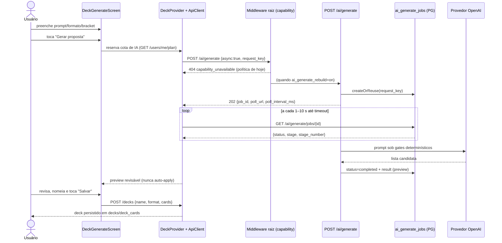

# Fluxo `deck_ai` — IA de deck: gerar, otimizar, completar, rebuild, explicar, análise, simulação

Estado: documentação de apoio, não autoritativa · gerado em 2026-09-21 sobre o commit d26f23a16 · verificação estática (nenhum teste foi executado) · **revisado adversarialmente em 2026-09-21 — ver §11; correções marcadas no texto**

---

## 1. Resumo e veredito

| Eixo | Veredito | Base |
| --- | --- | --- |
| **IMPLEMENTADO** | **sim** | Existe código ponta a ponta para gerar (sync + job assíncrono + retomada + cancelamento), otimizar (sync/async, preview, seleção parcial, apply, rollback), completar (`mode=complete`), rebuild guiado (draft clone), explicar carta, análise determinística e análise de sinergia por provedor. `server/routes/ai/` tem 22 arquivos `.dart`, sendo 1 `_middleware.dart` e 21 handlers; **7 deles são de Battle** (`ai/battle/**`) e `ai/simulate` pertence ao fluxo de Battle, então **13 handlers de IA são deste fluxo**, mais 5 rotas de deck relacionadas. (Corrigido na rodada adversarial: a versão anterior dizia "21 rotas" sem descontar Battle.) |
| **ALCANÇÁVEL HOJE** | **não** | `server/config/release_capabilities.json` tem as **29 capabilities com `release_capability: "off"` e `allowed: false`** — inclusive `ai_generate_rebuild`, `ai_analyze_optimize_advisory`, `legacy_ai_routes`, `learning_reads`, `learning_writes` e até `decks_private`. O middleware raiz (`server/routes/_middleware.dart:105-144`) responde **404 `capability_unavailable`** antes de tocar no PostgreSQL, e o guard do app (`app/lib/core/config/release_capabilities.dart:368-371, 520-523`) redireciona `/decks/generate → /decks → /home`. Nenhuma superfície deste fluxo é acessível com a política commitada. |
| **PROVADO** | **parcial, e fraco no que importa** | Há boa cobertura unitária de *parsing*, *clamp* de polling, montagem de payload e montagem do plano de apply. Mas os dois testes ponta a ponta que o contrato declara como prova do fluxo (`server/test/ai_generate_create_optimize_flow_test.dart`, `server/test/ai_optimize_flow_test.dart`) são `@Tags(['live', ...])` e o portão largo os **exclui explicitamente** (`scripts/quality_gate.sh:88-90`). Zero teste cobre a negação de capability chegando ao usuário, e zero teste cobre o passo de *apply* atravessando `PUT /decks/:id`. |

Uma frase: **o fluxo existe e é sofisticado; hoje ele é inalcançável por política, e a parte provada por teste determinístico é a periferia (parsers e mensagens), não a espinha (HTTP real, capability, apply).**

---

## 2. Jornada passo a passo

Legenda de capability: `GEN` = `ai_generate_rebuild`, `ADV` = `ai_analyze_optimize_advisory`, `DECK` = `decks_private`, `REPL` = `deck_replace_all`, `LR` = `learning_reads`.

| # | Passo do usuário | Tela/widget (arquivo:linha) | Provider/cliente (arquivo:linha) | Método + endpoint | Handler do servidor (arquivo:linha) | Serviço/repo | Tabelas |
| --- | --- | --- | --- | --- | --- | --- | --- |
| G0 | Abre `/decks/generate` | `app/lib/main.dart:551` → `DeckGenerateScreen` | guard `app/lib/core/config/release_capabilities.dart:368` | — | — | — | — |
| G1 | Tela restaura rascunho e retoma job pendente | `deck_generate_screen.dart:180-221` | `deck_provider.dart:1038` → `deck_provider_support_generation.dart:439` | `GET /ai/generate/jobs/latest?active=true` | `server/routes/ai/generate/jobs/[id].dart:18,29` | `AiGenerateJobStore.latestForUser` (`server/lib/ai_generate_job.dart:166`) | `ai_generate_jobs` |
| G2 | (Commander) vê atalho "deck aprendido" | `deck_generate_screen.dart:280-300, 1338` | `deck_provider.dart:1042,1072` | `GET /ai/commander-learning[?commander=]` | `server/routes/ai/commander-learning/index.dart:15` | `loadActiveCommanderLearnedDeck` | `commander_learned_decks` |
| G3 | Preenche formato/bracket/comandante/prompt/coleção/orçamento | `deck_generate_screen.dart:1109,1135,1205,1240,1258,1271,1285` | validação local `deck_generate_screen.dart:322-355` + `deck_provider_support_generation.dart:270-301` | — | — | — | — |
| G4 | Toca **Gerar proposta** → reserva de cota | `deck_generate_screen.dart:1307` | `ai_usage_gate.dart:9` → `CommercialProvider` | `GET /users/me/plan` (refresh) | `server/routes/users/me/plan/index.dart` | `PlanService` | `user_plans` |
| G5 | Envia pedido assíncrono | `deck_generate_screen.dart:382` | `deck_provider_support_generation.dart:311` | `POST /ai/generate` (`async: true`) | `server/routes/ai/generate/index.dart:47,72` | `AiGenerateJobStore.createOrReuse` (`server/lib/ai_generate_job.dart:55`); quota em `server/lib/plan_middleware.dart:41` | `ai_generate_jobs`, `user_plans`, `ai_plan_reservations` |
| G6 | Vê progresso por estágio | `deck_generate_screen.dart:1356-1361`, `deck_progress_indicator.dart` | poll `deck_provider_support_generation.dart:511-680` | `GET {poll_url}` a cada 1–10 s | `server/routes/ai/generate/jobs/[id].dart:10` | `AiGenerateJobStore.get` | `ai_generate_jobs` |
| G7 | Cancela geração | `deck_generate_screen.dart:2127` → `:550` | `deck_provider.dart:1035` → `deck_provider_support_generation.dart:451` | `DELETE /ai/generate/jobs/{id}` | `server/routes/ai/generate/jobs/[id].dart:36,46` | `AiGenerateJobStore.cancel` | `ai_generate_jobs` |
| G8 | Revê a proposta (preview, nunca auto-apply) | `deck_generate_screen.dart:413-439` (`_previewKey`) | gate de revisão `deck_provider_support_generation.dart:724-799` | — | — | — | — |
| G9 | Nomeia e toca **Salvar** | `deck_generate_screen.dart:1400,1422` → `:880` | `deck_provider.createDeck` → `deck_provider_support_mutation.dart:42` | `POST /decks` | `server/routes/decks/index.dart` | `DeckRulesService` | `decks`, `deck_cards` |
| G10 | É levado para `/decks` (ou `/home` no onboarding) | `deck_generate_screen.dart:910-917` | — | — | — | — | — |
| A1 | Abre `/decks/:id`; com `ADV` ligada a tela passa de 2 para 4 abas | `deck_details_screen.dart:150,160-174` | — | — | — | — | — |
| A2 | Aba **Análise** carrega funções do deck (determinístico) | `deck_analysis_tab.dart:121-128,171-180` | `deck_provider.dart:298` → `deck_provider_support_fetch.dart:143` | `GET /decks/{id}/analysis` | `server/routes/decks/[id]/analysis/index.dart:19` | preferencialmente `card_intelligence_snapshot` | `decks`, `deck_cards`, `card_intelligence_snapshot`, `card_function_tags`, `card_semantic_tags_v2`, `battle_simulations` |
| A3 | Toca **Gerar análise** (sinergia por provedor) | `deck_analysis_tab.dart:226-230` → `:88` | `deck_provider.dart:934` → `deck_provider_support_fetch.dart:295` | `POST /decks/{id}/ai-analysis` `{force}` | `server/routes/decks/[id]/ai-analysis/index.dart:33` | provedor OpenAI + fallback heurístico não persistido | `decks` (`synergy_score`, `strengths`, `weaknesses`) |
| S1 | Testa mão de 7 / mulligan London | `sample_hand_widget.dart:34-78` (também em `deck_details_overview_tab.dart:327`) | **nenhum** — `Random` local sobre `DeckDetails` | — | — | — | — |
| O1 | Abre a folha de otimização | `deck_details_screen.dart:1731-1785` | `deck_provider.fetchOptimizationOptions` → `deck_provider_support_mutation.dart:200` | `POST /ai/archetypes` `{deck_id}` | `server/routes/ai/archetypes/index.dart:21` | perfil de referência do comandante ou provedor | `decks`, `deck_cards`, `cards`, `commander_reference_*` |
| O2 | Escolhe intensidade / bracket / manter tema / coleção / orçamento | `deck_optimize_sections.dart:712` (`OptimizationSheetBody`), estado em `deck_details_screen.dart:2616-2683` | `buildOptimizeRecommendationContext` (`deck_optimize_flow_support.dart:12`) | — | — | — | — |
| O3 | Toca aplicar estratégia → reserva de cota → pedido | `deck_details_screen.dart:2681` → `:2305` | `deck_provider.dart:627` → `deck_provider_support_ai.dart:104` | `POST /ai/optimize` | `server/routes/ai/optimize/index.dart:422` | `optimize_route_request`, `optimization_quality_gate`, `optimize_cache_support` | `decks`, `deck_cards`, `ai_optimize_jobs`, `ai_optimize_cache` |
| O4 | (só `intensity=aggressive`) acompanha job | `deck_details_screen.dart:2334` (`showOptimizeProgressLoading`) | `deck_provider.dart:818` → `deck_provider_support_ai.dart:251` | `GET /ai/optimize/jobs/{id}` | `server/routes/ai/optimize/jobs/[id].dart:20` | `OptimizeJobStore` | `ai_optimize_jobs` |
| O5 | Vê o diff e seleciona trocas | `deck_optimize_dialogs.dart:140` → `deck_optimize_sheet_widgets.dart:685,1131` | `buildOptimizeApplyPlan` (`deck_optimize_flow_support.dart:1004`), contexto em `:885` | — | — | — | — |
| O6a | Aplica (modo `optimize`) | `deck_details_screen.dart:2530-2546` | `deck_provider.dart:1258` → `deck_provider_support_mutation.dart:288` | **`PUT /decks/{id}`** com `mutation_context.type=optimization_apply` | `server/routes/decks/[id]/index.dart:177,238-250,482` | `DeckOptimizationHistoryService`, `DeckRulesService(strict)` | `decks`, `deck_cards`, `deck_optimization_events` |
| O6b | Aplica (modo `complete`) | `deck_details_screen.dart:2522-2529` | `deck_provider.dart:855` → `deck_provider_support_mutation.dart:95` | `POST /decks/{id}/cards/bulk` | `server/routes/decks/[id]/cards/bulk/index.dart` | — | `deck_cards` |
| O7 | Vê sucesso + ação **Desfazer** | `deck_details_screen.dart:2466-2505` | `deck_provider.rollbackOptimization` → `deck_provider_support_mutation.dart:303` | `POST /decks/{id}/optimizations/{eventId}/rollback` | `server/routes/decks/[id]/optimizations/[eventId]/rollback/index.dart:12` | rollback transacional com `FOR UPDATE` | `decks`, `deck_cards`, `deck_optimization_events` |
| O8 | Aba **Oficina** lista o histórico | `deck_details_screen.dart:940-970` (`DeckWorkshopTab`) | `deck_provider.dart:1165` → `deck_provider_support_mutation.dart:341` | `GET /decks/{id}/optimizations` | `server/routes/decks/[id]/optimizations/index.dart:10` | `DeckOptimizationHistoryService` | `deck_optimization_events` |
| O9 | Retoma otimização pendente ao reabrir o deck | `deck_details_screen.dart:226-263` | `deck_provider.dart:1211` → `deck_provider_support_ai.dart:339` | `GET /ai/optimize/jobs/latest?deck_id=&active=true` | `server/routes/ai/optimize/jobs/[id].dart:39` | `OptimizeJobStore.latestForUser` | `ai_optimize_jobs` |
| R1 | Optimize devolve `needs_repair` → diálogo de rebuild guiado | `deck_details_screen.dart:2190-2212` | `deck_optimize_flow_support.dart:789-800, 1267` | — | — | — | — |
| R2 | Confirma rebuild guiado | `deck_details_screen.dart:2219-2255` | `deck_provider.dart:778` → `deck_provider_support_ai.dart:216` | `POST /ai/rebuild` | `server/routes/ai/rebuild/index.dart:16` | `RebuildGuidedService.build` + `createDraftClone` | `decks` (novo draft), `deck_cards` |
| R3 | É levado para o deck draft criado | `deck_details_screen.dart:2266-2277` (`router.go('/decks/{draft}')`) | — | — | — | — | — |
| E1 | Abre carta no deck e pede explicação | `deck_details_screen.dart:1690` → `:1698` | `card_provider.dart:463` | `POST /ai/explain` | `server/routes/ai/explain/index.dart:25` | cache em `cards.ai_description` | `cards` |

**Simulação:** o passo "simulação" do título do fluxo **não tem superfície de app**. A "mão de exemplo" (S1) é 100% local. As rotas de simulação (`/decks/{id}/simulate`, `/ai/simulate-matchup`) não têm nenhum chamador no app (ver §4.3). `/ai/simulate` é chamado, mas pelo fluxo de Battle (`app/lib/features/battle/services/battle_replay_service.dart:440,503`), não por este.

### Diagrama da jornada principal (gerar → revisar → salvar)



---

## 3. Capabilities e portões

### 3.1 Os dois portões

**Servidor** — `server/routes/_middleware.dart:105-144` chama `ReleaseCapabilityPolicy.decisionFor` (`server/lib/release_capability_policy.dart:158-196`) **antes** de conectar ao PostgreSQL. Resultados possíveis:

- capability desconhecida para a rota e rota não é plano de controle → **404 `capability_route_unclassified`** (`release_capability_policy.dart:175-176`);
- política inválida → **503 `capability_policy_invalid`** (`:183-184`);
- capability `off` → **404 `capability_unavailable`** (`:191-192`), com `capability`, `release_capability`, `policy_version`, `policy_digest_sha256`, `offer_mode` no corpo.

Verificado na rodada adversarial: **não existe validação de dependência entre capabilities**. `isAllowed` (`release_capability_policy.dart:150-152`) só olha a entrada individual, e nenhum código valida combinações. Logo a combinação `ai_analyze_optimize_advisory=on` + `deck_replace_all=off` do Achado A1 é representável e legal.

**App** — `ReleaseCapabilityRouteGuard.redirectFor` (`app/lib/core/config/release_capabilities.dart:350-534`), mais guardas locais de widget. O snapshot vem de `GET /capabilities` e é *fail-closed*: `ReleaseCapabilitiesSnapshot.denied()` se o envelope não bater exatamente (`:112-142`), e `allowed` tem de ser igual a `release_capability == 'on'` (`:83`).

### 3.2 Mapeamento rota → capability (servidor) vs guarda equivalente (app)

| Rota do servidor | Capability (`release_capability_policy.dart`) | Guarda no app | Nomes batem? |
| --- | --- | --- | --- |
| `POST /ai/generate`, `/ai/generate/jobs/*`, `POST /ai/rebuild`, `/ai/commander-reference` | `ai_generate_rebuild` (:425-430) | `/decks/generate` → `/decks` (`release_capabilities.dart:368`); `?optimize=rebuild` removido (:377-380); `_canUseGenerateRebuild` (`deck_details_screen.dart:107`) | **sim** |
| `POST /ai/optimize`, `/ai/optimize/jobs/*`, `POST /ai/archetypes`, `POST /ai/explain`, `GET /decks/:id/analysis`, `POST /decks/:id/ai-analysis`, `/decks/:id/optimizations/**` | `ai_analyze_optimize_advisory` (:431-442) | abas 3 e 4 só existem com a capability (`deck_details_screen.dart:166`); folha de otimização retorna `SizedBox.shrink()` (:2618-2623); `_showAiExplanation` (:1702) | **sim** |
| `GET /ai/commander-learning` | `learning_reads` (:443-445) | `_isLearningReadsAllowed` (`deck_generate_screen.dart:280`) | **sim** |
| `POST /ai/commander-learning` | `learning_writes` (:444) | nenhum chamador no app | n/a |
| `/ai/ml-status`, `/ai/simulate-matchup`, `/ai/weakness-analysis`, `/ai/optimize/telemetry`, `/decks/:id/recommendations`, `/decks/:id/simulate` | `legacy_ai_routes` (:446-454) | nenhum chamador no app | n/a |
| **`PUT /decks/:id`**, `POST /decks/:id/cards/replace`, `POST /import/to-deck` | **`deck_replace_all`** (:389-397) | apenas no diálogo de importar lista (`deck_details_screen.dart:1654,1660`) — **não** no apply de otimização | **não** (ver Achado A1) |
| `POST /decks`, `POST /decks/:id/cards/bulk`, `POST /decks/:id/validate` | `decks_private` (:537-542) | `/decks*` → `/home` (`release_capabilities.dart:520-523`) | sim |

### 3.3 Alcançabilidade hoje

`server/config/release_capabilities.json` (`policy_version: brewtact_free_beta_2026-08-13`): **29/29 capabilities `off`**, `live_verified_as_of: null` em todas. Portanto:

- `POST /ai/generate` → 404 `capability_unavailable`;
- `GET /decks/:id/analysis` → 404 `capability_unavailable`;
- `PUT /decks/:id` → 404 `capability_unavailable`;
- `/decks/generate` no app → redireciona para `/decks`, que por sua vez redireciona para `/home` (`decks_private` também `off`). A `AiUsageMeter` desaparece (`ai_usage_meter.dart:18-25`), a aba de análise não é construída, o botão "Gerar com IA" some.

O único caminho hoje para exercitar o fluxo é o arnês isolado: `scripts/manaloom_authenticated_visual_qa_isolated.sh:300-339` gera um JSON temporário com `ai_analyze_optimize_advisory`, `ai_generate_rebuild`, `learning_reads`, `legacy_ai_routes` e `deck_replace_all` em `on`, e o injeta via `MANALOOM_ISOLATED_RELEASE_CAPABILITIES_FILE` (só aceito em `/tmp` resolvido, com `MANALOOM_E2E_ISOLATED_RUNTIME=1` e a frase de aprovação — `server/lib/release_capability_policy.dart:346-375`).

### 3.4 O que o usuário vê quando é negado

| Situação | O que aparece |
| --- | --- |
| Rota bloqueada pelo guard do app | Redirect silencioso; nenhuma mensagem. `/decks/generate` → `/decks` → `/home`. |
| Superfície bloqueada dentro da tela | Sumiço silencioso: abas 3/4 não existem, `AiUsageMeter` vira `SizedBox.shrink()`, `onShowAiExplanation: null`. |
| Divergência app-permite / servidor-nega (404 `capability_unavailable` ou `capability_route_unclassified`) | **Texto cru "capability_unavailable" em SnackBar** (ver Achado A1 e A2). Confirmado percorrendo a cadeia inteira: `ensureSuccessfulDeckMutationResponse` (`deck_provider_support_common.dart:396-410`) → `FriendlyErrorMapper.fromApiResponse` → `_messageFromBody` (`:261-322`) devolve a string; o `throw Exception(...)` vira `Exception: capability_unavailable`, e `showOptimizeApplyErrorSnackBar` (`deck_optimize_dialogs.dart:249-261`) chama `fromException`, que remove o prefixo `Exception:` (`friendly_error_mapper.dart:142-145`) e devolve a string outra vez. |
| Política inválida (503 `capability_policy_invalid`) | **Não vaza.** `fromStatusCode` só consulta `_messageFromBody` quando `statusCode < 500` (`friendly_error_mapper.dart:51-54`); em 503 o usuário vê "Servidor indisponível no momento. Tente novamente em instantes." (Correção da rodada adversarial: a versão anterior do Achado A2 afirmava que o 503 também vazava.) |

---

## 4. Contrato app↔servidor

### 4.1 Tabela por endpoint

| # | Método + caminho | App (arquivo:linha) | Handler (arquivo:linha) | Corpo enviado | Campos lidos da resposta | Coerência |
| --- | --- | --- | --- | --- | --- | --- |
| 1 | `POST /ai/generate` | `deck_provider_support_generation.dart:311` (async) e `:484` (fallback sync) | `server/routes/ai/generate/index.dart:47` | `prompt`, `format`, `async:true`, `request_key`, `bracket?`, `commander_name?`, `generation_constraints{prefer_collection,collection_only,budget_limit_brl}?` | 202: `job_id`, `poll_url`, `status`, `poll_interval_ms`, `job_timeout_ms`; 200: `generated_deck.cards`, `validation.is_valid/errors/invalid_cards`, `provider_repair.eligible`, `warnings`, `stats.invalid_cards`, `is_mock`, `generation_mode`, `can_save` | **OK** — campos batem com `server/routes/ai/generate/index.dart:968-990,1275,1767-1802` |
| 2 | `GET /ai/generate/jobs/{id}` | `deck_provider_support_generation.dart:426,537` | `server/routes/ai/generate/jobs/[id].dart:10` | — | `status`, `stage`, `stage_number`, `total_stages`, `result`, `result_status_code`, `request_key` | OK (`server/lib/ai_generate_job.dart:436-464`) |
| 3 | `GET /ai/generate/jobs/latest?active=` | `deck_provider_support_generation.dart:439` | mesmo handler, ramo `id == 'latest'` (:18,29) | — | `job_id`, `request_key` | OK |
| 4 | `DELETE /ai/generate/jobs/{id}` | `deck_provider_support_generation.dart:447-453` | mesmo handler (:36,46) | — | só aceita 200 | **OK por acidente** (corrigido na rodada adversarial). O servidor devolve **409 `ai_job_not_cancellable`** (`server/routes/ai/generate/jobs/[id].dart:46-56`) com `error` já em português: "Este job ja terminou e nao pode mais ser cancelado.". `_generateFriendlyException` (`:987-1020`) cai no ramo `statusCode >= 400` e usa `_friendlyBackendMessage` (`:1022-1039`), que **devolve essa frase**. O usuário vê a mensagem certa (sem acentos), não um genérico. Ver A10 rebaixado |
| 5 | `POST /ai/optimize` | `deck_provider_support_ai.dart:104` | `server/routes/ai/optimize/index.dart:422` | `deck_id`, `archetype`, `bracket?`, `keep_theme`, `intensity`, `recommendation_context?`, `request_key?` | 200: `mode`, `outcome_code`, `can_apply`, `apply_blockers`, diff, `quality_error`; 202: `job_id`, `poll_interval_ms`, `job_timeout_ms`, `total_stages`, `idempotency.request_key`; 422: `quality_error.code/message` | **OK**; as 7 chaves de `recommendation_context` do app (`deck_optimize_flow_support.dart:20-29`) são exatamente as 7 conhecidas pelo servidor (`optimize_route_request_support.dart:274-282`) |
| 6 | `GET /ai/optimize/jobs/{id}` | `deck_provider_support_ai.dart:251` | `server/routes/ai/optimize/jobs/[id].dart:20` | — | `status`, `stage`, `stage_number`, `total_stages`, `result`, `quality_error`, `error` | OK. O app **ignora** o `poll_url` devolvido no 202 e monta a URL na mão (`:251`) — funciona, mas é acoplamento duplicado |
| 7 | `GET /ai/optimize/jobs/latest?deck_id=&active=` | `deck_provider_support_ai.dart:339` | mesmo handler (:39) | — | `job_id`, `archetype` | OK — `OptimizeJob.toJson` expõe `archetype` (`server/lib/ai/optimize_job.dart:538`) |
| 8 | `DELETE /ai/optimize/jobs/{id}` | `deck_provider_support_ai.dart:316-328` | mesmo handler (:47,64) | — | só aceita 200 | **OK por acidente**, mesmo raciocínio do item 4: `FriendlyErrorMapper.fromApiResponse(409, ...)` → `_messageFromBody` devolve o `error` em português do servidor |
| 9 | `POST /ai/archetypes` | `deck_provider_support_mutation.dart:200` | `server/routes/ai/archetypes/index.dart:21` | `deck_id` | `options[]` | OK (`:447,511`) |
| 10 | `POST /ai/rebuild` | `deck_provider_support_ai.dart:216` | `server/routes/ai/rebuild/index.dart:16` | `deck_id`, `archetype?`, `theme?`, `bracket?`, `rebuild_scope`, `save_mode`, `must_keep?`, `must_avoid?` | `draft_deck_id`, `rebuild_scope_selected` | OK, mas `must_keep`/`must_avoid` **nunca são preenchidos pela UI** (`deck_optimize_flow_support.dart:852-858` não os monta) |
| 11 | `POST /ai/explain` | `card_provider.dart:466` | `server/routes/ai/explain/index.dart:25` | `card_id`, `card_name`, `oracle_text`, `type_line` | `explanation` | OK (`:100,142,297,305`) |
| 12 | `GET /decks/{id}/analysis` | `deck_provider_support_fetch.dart:143` | `server/routes/decks/[id]/analysis/index.dart:19` | — | `DeckAnalysisData.fromJson` (composição, curva, funções, `battle_learning_evidence`) | OK |
| 13 | `POST /decks/{id}/ai-analysis` | `deck_provider_support_fetch.dart:295` | `server/routes/decks/[id]/ai-analysis/index.dart:33` | `force` | `synergy_score`, `strengths`, `weaknesses` | OK. O servidor lê `force` (`:43`, `readOptionalJsonBool(body, 'force');` — retorno descartado) mas **não o usa para nada**. A rota tem `_middleware.dart` próprio com `aiPlanLimitMiddleware()`, então **consome cota de IA** |
| 14 | `GET /decks/{id}/optimizations` | `deck_provider_support_mutation.dart:341` | `server/routes/decks/[id]/optimizations/index.dart:10` | — | `events[]` | OK |
| 15 | `POST /decks/{id}/optimizations/{eventId}/rollback` | `deck_provider_support_mutation.dart:303` | `.../rollback/index.dart:12` | `{}` | 200 | OK |
| 16 | **`PUT /decks/{id}`** (apply de otimização) | `deck_provider_support_mutation.dart:288` | `server/routes/decks/[id]/index.dart:177,238` | `cards[]`, `mutation_context{type:optimization_apply, expected_deck_signature, swap_integrity, apply_authorization, ...}` | `validation`, `optimization_event.id` | **Capability divergente** — servidor exige `deck_replace_all`; app só checa `ai_analyze_optimize_advisory`. Ver Achado A1 |
| 17 | `POST /decks/{id}/cards/bulk` (apply modo `complete`) | `deck_provider_support_mutation.dart:95` | `server/routes/decks/[id]/cards/bulk/index.dart` | `cards[]`, `mutation_context` | 200 | OK (`decks_private`) |
| 18 | `GET /ai/commander-learning` | `deck_provider.dart:1054,1073` | `server/routes/ai/commander-learning/index.dart:15` | — | `available`, `commanders[]`, `promoted_deck`, `recommended_deck`, `legal_status` | OK, mas há **um terceiro portão**: `MANALOOM_PROMOTED_COMMANDER_LEARNED_DECK_READS=1` (`server/lib/ai/commander_learned_deck_support.dart:28-33`); sem ele, 503 mesmo com `learning_reads=on` |

### 4.2 Campos que um lado manda e o outro ignora

- `deck_provider.dart:637-639` — `optimizeDeck` aceita `preferCollection`, `collectionOnly` e `budgetLimitBrl` e **nunca os usa**: não são repassados a `requestOptimizeDeck` (`:650-658`). `prefer_collection` e `budget_limit_brl` chegam ao servidor por outro caminho (`recommendation_context`, `deck_optimize_flow_support.dart:20-28`), mas **`collection_only` não tem representação nenhuma no contrato de otimização**: não está nas 7 chaves conhecidas do servidor (`optimize_route_request_support.dart:275-282`) nem existe controle de UI na folha de otimização (`grep collectionOnly app/lib/features/decks/` só encontra o fluxo de geração). Parâmetros mortos que convidam a bug futuro.
- `POST /decks/{id}/ai-analysis` `{force}` — lido e descartado no servidor (`server/routes/decks/[id]/ai-analysis/index.dart:43`). O app decide `force` a partir de `hasAiSummary` (`deck_analysis_tab.dart:229`) e espera um efeito que não existe.
- `must_keep` / `must_avoid` em `/ai/rebuild` — servidor lê (`server/lib/ai/rebuild_route_request_support.dart:71,76`), app nunca preenche.
- `poll_url` do 202 de `/ai/optimize` — servidor manda (`server/lib/ai/optimize_route_async_support.dart:86,160`), app ignora.

### 4.3 Endpoints existentes sem nenhum chamador no app

Verificado por grep em `app/` (só `.dart`): **zero ocorrências** de
`/ai/ml-status`, `/ai/simulate-matchup`, `/ai/weakness-analysis`, `/ai/optimize/telemetry`, `/ai/commander-reference`, `/decks/:id/recommendations`, `/decks/:id/simulate`.

São 7 rotas que só aparecem em testes de servidor e scripts. Recontado na rodada adversarial: **4.153 linhas** de handler (ml-status 230, simulate-matchup 689, weakness-analysis 1013, optimize/telemetry 366, commander-reference 1225, decks/:id/recommendations 363, decks/:id/simulate 267) — a versão anterior dizia "≈3.700" e subestimava. `/ai/commander-reference` inclusive é declarado como **entrypoint** do fluxo em `docs/project_logic_contracts.json`.

### 4.4 Endpoint chamado que não existe

Nenhum. `/ai/generate/jobs/latest` e `/ai/optimize/jobs/latest` parecem rotas inexistentes mas são tratadas como `id == 'latest'` dentro de `[id].dart` (`:18,29` e `:28,39`). Coerente.

---

## 5. Dados

### 5.1 Tabelas

| Tabela | Papel neste fluxo | Definição | Migração |
| --- | --- | --- | --- |
| `decks` | deck do usuário; recebe `synergy_score`, `strengths`, `weaknesses`, `archetype`, `bracket` | `server/database_setup.sql` | — |
| `deck_cards` | lista; substituída no apply | idem | — |
| `ai_generate_jobs` | job assíncrono de geração; índice único parcial `(user_id, request_key)` | `server/database_setup.sql:1772-1801` | `create_ai_generate_jobs` (`server/bin/migrate.dart:349`), `close_ai_job_lifecycle` (:2377) |
| `ai_optimize_jobs` | job assíncrono de otimização | `server/database_setup.sql:1740-1769` | `create_ai_optimize_jobs` (`migrate.dart:315`) |
| `ai_optimize_cache` | cache de proposta por deck/usuário | `server/database_setup.sql:1820-1838` | `create_ai_optimize_v2_tables` (`migrate.dart:193`) |
| `deck_optimization_events` | ledger de apply/rollback (antes/depois, diff, contexto) | — | `create_deck_optimization_events` (`migrate.dart:1024`) |
| `deck_learning_events` | eventos de aprendizado (quarentenados; escrita `off`) | `server/database_setup.sql:1506-1520` | `create_commander_learning_snapshot` (`migrate.dart:653`) |
| `commander_learned_decks` | decks aprendidos promovidos | `server/database_setup.sql:1477-1502` | idem |
| `commander_card_usage` | cartas "quentes" por comandante para o prompt | `server/database_setup.sql:1525-1534` | idem |
| `commander_reference_*` | perfis/corpus de referência Commander | — | `create_commander_reference_tables` (`migrate.dart:1062`) |
| `card_intelligence_snapshot` | visão 1-linha-por-carta preferida pela análise | — | `create_card_identity_and_intelligence_views` (`migrate.dart:608`) |
| `user_plans` | cota de 120 ações de IA/mês | — | `create_user_plans` (`migrate.dart:262`) |

### 5.2 Integridade

- **Concorrência do apply:** `PUT /decks/:id` exige `mutation_context.expected_deck_signature`, lê `deck_cards ... FOR UPDATE` e recusa se a assinatura mudou (`server/routes/decks/[id]/index.dart:238-250`). O app também compara localmente antes de enviar (`deck_provider.dart:1269-1277`).
- **Idempotência de job:** `ON CONFLICT (user_id, request_key) DO NOTHING` + comparação de `request_fingerprint` (`server/lib/ai_generate_job.dart:64-116`). O índice único **não filtra por status** (`server/database_setup.sql:1799-1801`), então uma `request_key` usada por um job já terminado continua reservada.
- **Rollback:** transacional, só aceita evento `optimize_apply` do próprio dono (`.../rollback/index.dart:42-60`).

---

## 6. Estados e erros

| Estado | Tratado? | Onde |
| --- | --- | --- |
| Carregando (geração) | **sim** | `deck_generate_screen.dart:374-379,1356-1361`; progresso por estágio vindo do job |
| Carregando (otimização) | **sim** | `showOptimizeProgressLoading` (`deck_details_screen.dart:2334`) com `FlowProgressState` |
| Carregando (análise funcional) | **sim** | `_deckAnalysisLoading` (`deck_provider.dart:317`) → `deck-analysis-functional-loading` |
| Vazio (sem análise de IA ainda) | **sim** | `hasAiSummary == false` → estado "pendente" (`deck_analysis_tab.dart:167-170,243`) |
| Vazio (histórico de oficina) | **sim** | `DeckWorkshopTab` recebe `events` vazio |
| Vazio (sem estratégias) | **sim** | `parseOptimizationOptionsResponse` lança mensagem própria (`deck_provider_support_mutation.dart:181`) |
| Erro de rede / offline | **sim** | `FriendlyErrorMapper._looksLikeNetworkError` + `offlineContractForContext` (`friendly_error_mapper.dart:157,232-259`) |
| Timeout HTTP (GET/POST) | **sim** | `ApiClient.timeoutForEndpoint` dá 2 min a `/ai/*`, `/ai-analysis` e `/recommendations` (`api_client.dart:192-203`); usado em `get` (`:245`) e `post` (`:363`); `TimeoutException` vira texto amigável |
| **Timeout HTTP no apply (`PUT`) e no cancelamento (`DELETE`)** | **NÃO** | `ApiClient.put` (`api_client.dart:421`) e `ApiClient.delete` (`:533`) **ignoram `timeoutForEndpoint`** e cravam `.timeout(const Duration(seconds: 15))` (`:436` e `:555`). O apply da otimização — a única mutação que muda o deck — tem 15 s de orçamento. Achado A13 |
| 401 / sessão expirada | **sim** | `ApiClient.isSessionInvalidatingUnauthorized` (`api_client.dart:96-115`) casa com as mensagens do `authMiddleware` (`server/lib/auth_middleware.dart:29,48`); `_generateFriendlyException` trata 401/403 (`:995`) |
| 402 / cota de plano esgotada | **parcial** | O servidor responde **402** (`server/lib/plan_middleware.dart:82,93`). O `FriendlyErrorMapper` **não tem ramo para 402** (`friendly_error_mapper.dart:45-127`); salva-se porque o corpo traz `error` legível em português e `_messageFromBody` o devolve. Frágil por acidente, não por desenho. O caminho normal é o pré-gate `reserveAiActionOrShowPaywall` (`ai_usage_gate.dart:9-34`) |
| 404 de capability | **NÃO** | vira o texto cru `capability_unavailable` (Achado A2). O 503 `capability_policy_invalid` **não** tem esse problema (vira "Servidor indisponível...") |
| 429 (rate limit de IA) | **sim** | backoff no poll de geração (`deck_provider_support_generation.dart:544-566`); mensagem dedicada em `friendly_error_mapper.dart:118` |
| 422 / quality gate | **sim** | `deck_provider_support_ai.dart:146-160` extrai `quality_error.code/message`; `describeDeckAiFailure` classifica em `needsRepair` / `nearPeak` / `noSafeUpgradeFound` / genérico (`deck_optimize_flow_support.dart:789-836`) |
| 409 idempotência (`ai_job_idempotency_conflict`) | **NÃO** | mensagem crua "request_key ja foi usada com outro pedido." chega ao usuário (Achado A3) |
| Validação de entrada | **sim** | prompt vazio/longo, bracket, orçamento 0–100.000 (`deck_generate_screen.dart:322-355`, `deck_provider_support_generation.dart:270-301`) |
| Duplo toque em "Gerar" | **sim** | `_isGenerating` desabilita o botão (`deck_generate_screen.dart:1308`) e `_generateCancellation?.cancel()` invalida a chamada anterior (:363) |
| Duplo toque em "Otimizar" | **sim** | diálogo modal bloqueante + `_activeOptimizeRequestKey` reaproveitado (`deck_provider.dart:643-648`) |
| Job em andamento ao reabrir a tela | **sim** | retoma por rascunho ou por `jobs/latest` (`deck_generate_screen.dart:215-220`; `deck_details_screen.dart:226-263`) |
| Cancelamento com job já terminado | **sim, por acidente** | Corrigido na rodada adversarial: o 409 do servidor traz `error` em português e chega ao usuário como "Este job ja terminou e nao pode mais ser cancelado." (SnackBar no `catch` de `_cancelGeneration`, `deck_generate_screen.dart:572-580`). O que sobra é cosmético: falta de acentuação e ausência de ramo dedicado por `error_code` |
| Falha no cancelamento deixa a tela presa? | **não, mas por sorte** | O `catch` de `_cancelGeneration` (`deck_generate_screen.dart:572-574`) zera só `_isCancellingGeneration`; `_isGenerating` e `_activeGenerateJobId` continuam. Quem sai do estado é o loop de poll, que vê `completed` e entrega o preview |
| **Optimize síncrono estourando 2 min** | **NÃO** | `intensity` light/focused/rebuild roda síncrono (`server/lib/ai/optimize_payload_support.dart:93-104`, o app nunca manda `async`). Não há job para retomar; o trabalho se perde. Achado A4 |
| Job de geração `cancelled` visto pelo poll | **parcial** | `_isFailedGenerateStatus` trata `cancelled` como falha (`deck_provider_support_generation.dart:943`) e mostra mensagem de erro em vez de "cancelado" |

---

## 7. Testes por passo

| Passo | Teste que exercita | O que de fato afirma | Veredito |
| --- | --- | --- | --- |
| G1 retomar job | `app/test/features/decks/screens/deck_flow_entry_screens_test.dart:749` | monta a tela com rascunho, espera o texto "Retomando geração em andamento...", toca cancelar e **verifica `deleteCalls == ['/ai/generate/jobs/job-resume']`** e a limpeza do rascunho | **comportamento real** |
| G2 learned deck | idem `:505` e `:543` | com `learning_reads` OFF não há nenhuma chamada a `/ai/commander-learning`; com ON aparece o botão | **comportamento real, inclui capability** |
| G3 validação | `deck_flow_entry_screens_test.dart:331,687,715` | formato inicial, bracket e formato restaurados | comportamento |
| G5 corpo do pedido | `app/test/features/decks/providers/deck_provider_support_test.dart:1711` | captura o corpo de `POST /ai/generate` e afirma `request_key`, `bracket` e `generation_constraints` | **comportamento real** |
| G6 polling | `app/test/features/decks/providers/deck_provider_test.dart:526-591` | 202 → poll → completed; afirma `postCalls == ['/ai/generate']` e dois GETs no `poll_url` | **comportamento real** |
| G6 clamps | `app/test/features/decks/providers/deck_provider_ai_runtime_contract_test.dart:24-62` | só aritmética de `poll_interval_ms` / `job_timeout_ms` | unitário estreito |
| G6 429 | `deck_provider_test.dart:716-753` | backoff no rate limit | comportamento |
| G8 gate de revisão | `deck_provider_support_test.dart:1877,1904` | 422 e 200 inválido viram exceção amigável | comportamento |
| G9 salvar | `deck_flow_entry_screens_test.dart:934` (usa `deck-generate-save-button`) | salvamento a partir do preview | comportamento |
| A2 análise funcional | `app/test/features/decks/widgets/deck_analysis_tab_test.dart:602,751` | renderiza contagens de tags funcionais e amostras | comportamento de UI |
| A3 análise de sinergia | `deck_analysis_tab_test.dart:558` | **nenhum POST antes do toque**; depois do toque, exatamente `POST /decks/deck-auto-ai/ai-analysis` com `{force:false}` | **comportamento real, o melhor teste do fluxo** |
| S1 mão de exemplo | `app/test/features/decks/widgets/sample_hand_widget_test.dart` (422 linhas) | sorteio, mulligan London, decisão | comportamento |
| O1 estratégias | `deck_provider_support_test.dart:1990` | corpo `{deck_id}` e parsing de `options[]` | comportamento |
| O3 pedido de otimização | `deck_provider_support_test.dart:1411,1433,1459,1478` | 200 / 202 / 422 / `rebuild_guided` | comportamento |
| O4 polling | `deck_provider_support_test.dart:1609-1682` | `completed`, `failed`, `cancelled`, `latest`, cancelamento | comportamento |
| O5 plano de apply | `app/test/features/decks/widgets/deck_optimize_flow_support_test.dart:441-748` | 14 testes de `buildOptimizeApplyPlan`: modo bulk, seleção parcial, seleção despareada, preview bloqueado, contexto de validação | **muito bom, mas puro** |
| O5→O6 orquestração | `deck_optimize_flow_support_test.dart:966` | `executeOptimizeFlow` com executores falsos | comportamento de orquestração |
| **O6a apply via `PUT /decks/:id`** | **nenhum teste de app** | — | **LACUNA** — nenhum teste cobre a chamada HTTP real do apply nem a capability `deck_replace_all` |
| O7 rollback | `deck_provider_support_test.dart:1558` e `app/test/features/decks/widgets/deck_workshop_tab_test.dart:118,144` | endpoint exato de rollback; recusa de rollback após edição posterior | comportamento |
| O8 histórico | `deck_provider_support_test.dart:2211` | parsing de `events[]` | comportamento |
| R2 rebuild | `deck_provider_support_test.dart:1506,1584` e `deck_provider_test.dart:1449` | corpo do `POST /ai/rebuild`, sucesso com `draft_deck_id`, 422 | comportamento |
| E1 explicar | `app/test/features/cards/providers/card_provider_ai_test.dart:17,44,59,71,86` e `app/test/features/decks/widgets/deck_details_dialogs_test.dart:84,457` | afirma o endpoint exato `/ai/explain`, o parse de `explanation` e os caminhos de erro; o teste de diálogo cobre carregando/erro na UI | **comportamento real — a versão anterior deste documento errou ao chamar isto de LACUNA** |
| Portão do app (rota) | `app/test/core/config/release_capabilities_test.dart:361-443` | `/decks/generate` negado → `/decks`; `?optimize=rebuild` removido; permitido quando ON | **comportamento real** |
| Portão do servidor (rota→capability) | `server/test/release_capability_policy_test.dart:195-203` | tabela `'POST /ai/generate' → 'ai_generate_rebuild'`, `'PUT /decks/deck' → 'deck_replace_all'` etc. | comportamento |
| Quality gate | `server/test/optimization_quality_gate_test.dart` (1694 linhas, **0** `readAsStringSync`) | unidade real do gate | **bom** |
| Ciclo de vida de job | `server/test/ai_job_lifecycle_test.dart` | sem tag live | unidade |
| Geração→criação→otimização ponta a ponta | `server/test/ai_generate_create_optimize_flow_test.dart:1` | `@Tags(['live','live_backend','live_db_write','live_external'])` — **excluído pelo portão largo** (`scripts/quality_gate.sh:88-90`) | **não roda** |
| Otimização ponta a ponta | `server/test/ai_optimize_flow_test.dart:1` | idem | **não roda** |
| Pipeline de aprendizado | `server/test/optimize_learning_pipeline_test.dart` | 4 `readAsStringSync` — casa **strings de código-fonte** | **teste de string** |
| Contenção legada | `server/test/experimental_deck_ai_authorization_source_test.dart` | **27** `readAsStringSync`; afirma `contains('final userId = context.read<String>()')` etc. | **teste de string, não de comportamento** |
| `/ai/commander-reference` read-only | `server/test/commander_reference_read_only_contract_test.dart:9` | 1 `readAsStringSync` | teste de string |

### Passos sem nenhum teste

1. **O6a — apply da otimização atravessando `PUT /decks/:id`** (a mutação que de fato muda o deck). Nem a chamada HTTP nem a capability `deck_replace_all` são exercitadas. Atenção à armadilha: `app/test/core/config/release_capability_surface_contract_test.dart:36` afirma que a string `'ReleaseCapability.deckReplaceAll'` **aparece** em `deck_details_screen.dart` — é teste de presença de string, e a ocorrência que ele satisfaz é a do diálogo de importar lista (`:1654,1661`), não o apply.
2. **Qualquer negação de capability chegando ao usuário** (404 `capability_unavailable` em qualquer chamada deste fluxo).
3. **402 de cota** no caminho de resposta do servidor (só o pré-gate local é coberto).
4. **409 `ai_job_idempotency_conflict`** (o 409 `ai_job_not_cancellable` continua sem teste, mas o comportamento observado é aceitável — ver A10).
5. **Timeout do optimize síncrono** (light/focused) sem job para retomar.
6. **Timeout de 15 s no `PUT /decks/:id` do apply** (Achado A13).
7. `/ai/commander-learning` com `learning_reads=on` mas flag de ambiente desligada (503).

**Contagem: 7 passos da jornada sem teste** (E1/explain saiu da lista após a verificação adversarial; A13 entrou).

---

## 8. Achados

| ID | Tipo | Severidade | Achado | Arquivo:linha | Como provar |
| --- | --- | --- | --- | --- | --- |
| A1 | incoerência app↔servidor | **alta** | O apply de otimização usa `PUT /decks/{id}`, que no servidor exige **`deck_replace_all`**, mas o app só verifica `ai_analyze_optimize_advisory` antes de liberar todo o fluxo. Com a combinação legal `ai_analyze_optimize_advisory=on` + `deck_replace_all=off`, o usuário atravessa estratégia → preview → seleção de trocas e só descobre no clique final que a ação é impossível. | app: `deck_provider_support_mutation.dart:288`, guarda em `deck_details_screen.dart:2538`; servidor: `server/lib/release_capability_policy.dart:389-392` | Teste de widget: montar `_OptimizationSheet` com `ReleaseCapabilitiesSnapshot.forTesting({aiAnalyzeOptimizeAdvisory})` (sem `deckReplaceAll`), completar o preview, tocar `optimize-preview-apply-button` e afirmar que **nenhum** `PUT /decks/...` sai e que aparece mensagem de indisponibilidade. Prova viva: subir o arnês isolado com `deck_replace_all` fora da allowlist de `scripts/manaloom_authenticated_visual_qa_isolated.sh:300-327`. |
| A2 | bug-provável / ux-funcional | **alta** | A negação de capability do servidor vaza como texto técnico cru para o usuário. `404 {"error":"capability_unavailable"}` passa por `_messageFromBody` (`friendly_error_mapper.dart:261-322`), não casa nenhum ramo de `_looksTechnical` (`:345-368` — nenhuma das 23 marcas casa com a palavra) e é devolvido literalmente. A segunda passagem, pelo `fromException` do SnackBar, também devolve: o prefixo `Exception:` é removido em `:142-145` antes do teste. O SnackBar mostra **"capability_unavailable"**. Vale também para `capability_route_unclassified` (404). **Correção da rodada adversarial: NÃO vale para `capability_policy_invalid`**, que é 503 e não chega a `_messageFromBody` (`:51-54`). | `app/lib/core/utils/friendly_error_mapper.dart:265-266,317-319,345-368`; produtor em `server/routes/_middleware.dart:105-144` | Teste unitário puro: `expect(FriendlyErrorMapper.fromApiResponse(ApiResponse(404, {'error':'capability_unavailable','capability':'ai_generate_rebuild'}), context: FriendlyErrorContext.deckOptimize), isNot(contains('capability')))`. Hoje falha. |
| A3 | estado-não-tratado | **media** | `request_key` persistido no rascunho não é limpo em falhas não terminais (rede, timeout, 5xx): `_activeGenerateRequestKey` só é zerado em sucesso e em `GenerateDeckTerminalFailureException` (`deck_generate_screen.dart:426-427,452-453`). Se o usuário editar o prompt e tentar de novo, o `request_fingerprint` muda com a mesma `request_key` → **409** com a mensagem crua "request_key ja foi usada com outro pedido." O índice único não filtra status, então a chave fica presa até a retenção. | app: `deck_generate_screen.dart:365-369,440-456`; servidor: `server/lib/ai_generate_job.dart:104-110`, `server/routes/ai/generate/index.dart:1405-1412`, índice em `server/database_setup.sql:1799-1801` | **Repro corrigida na rodada adversarial**: um erro de rede no 1º `POST /ai/generate` **não** reproduz nada, porque nesse caso nenhuma linha é criada em `ai_generate_jobs` e reutilizar a chave é o comportamento correto. O cenário real é: o POST chega ao servidor e devolve 202 (linha criada, `request_fingerprint` gravado); depois o poll falha de forma **não terminal** (rede cai, 5xx transitório) — `GenerateDeckTerminalFailureException` é o único caminho que limpa a chave. Teste de widget: 202 no 1º POST, falha de rede no `GET /ai/generate/jobs/{id}`, editar o prompt, afirmar que o 2º POST leva `request_key` diferente. |
| A4 | bug-provável | **media** | Optimize em `light`/`focused` (o padrão) roda **síncrono**: `shouldUseAsyncOptimizeExecutor` só devolve `true` para `aggressive` ou `async:true` explícito (`server/lib/ai/optimize_payload_support.dart:93-104`), e o app nunca manda `async` (`deck_provider_support_ai.dart:47-67`). O timeout HTTP do app para `/ai/*` é de **2 minutos** (`api_client.dart:197-202`). Se o servidor demorar mais, o app aborta, não há job em `ai_optimize_jobs` para retomar e a cota já foi reservada. `fetchLatestOptimizeJob` não acha nada. | `app/lib/core/api/api_client.dart:197-202`; `server/lib/ai/optimize_payload_support.dart:93-104` | Teste de servidor com relógio falso medindo o caminho síncrono, ou prova viva: rodar `POST /ai/optimize` com `intensity=focused` em deck Commander de 100 cartas com provedor real e medir o tempo de parede. |
| A5 | bug-provável | **media** | Ao retomar um job de geração, o deck é salvo com o **formato que está no formulário**, não com o formato do job. `_resumeGenerateJob` copia apenas `bracket` do resultado (`deck_generate_screen.dart:514-523`) e nunca ajusta `_selectedFormat`; `_saveGeneratedDeck` envia `format: _selectedFormat.toLowerCase()` (`:882`). `_resumeLatestGenerateJobIfAvailable` (`:474-490`) retoma **qualquer** job ativo do usuário, inclusive um iniciado em outra sessão com outro formato. Resultado: lista gerada para Standard salva como Commander (ou vice-versa) — o `DeckRulesService` recusa ou, pior, aceita uma lista incoerente. O `catch (_) { return; }` de `:487` ainda esconde qualquer falha nessa retomada. | `app/lib/features/decks/screens/deck_generate_screen.dart:474-490,514-523,882` | Teste de widget: rascunho com `format: 'Commander'`; `_FakeApiClient` responde `GET /ai/generate/jobs/latest?active=true` com um job cujo `format` é `standard` e resultado completo; afirmar que o `POST /decks` subsequente **não** leva `format: 'commander'` (ou que a tela avisa a divergência). Hoje leva. |
| A6 | passo-sem-teste | **media** | Os dois testes que o contrato declara como prova do fluxo são `live` e o portão largo os exclui. Ou seja, **nenhuma execução determinística do repositório prova a jornada `deck_ai` ponta a ponta**. | `server/test/ai_generate_create_optimize_flow_test.dart:1`, `server/test/ai_optimize_flow_test.dart:1`, exclusão em `scripts/quality_gate.sh:88-90` | Já está provado por leitura. Correção: teste de rota com `RequestContext`/`Pool` falsos (como `server/test/deck_simulate_route_adapter_test.dart` faz) cobrindo `POST /ai/generate` → 202 → `GET jobs/{id}` → `completed`. |
| A7 | doc-defasada | **media** | `docs/project_logic_contracts.json` (fluxo `deck_ai`) lista `/ai/commander-reference` como entrypoint e `commander_reference_read_only_contract_test.dart` como prova, mas **nenhum código de app chama essa rota**; e omite da lista `implementation` o arquivo que de fato faz a mutação final (`server/routes/decks/[id]/index.dart`) e a capability `deck_replace_all`. | `docs/project_logic_contracts.json`, chave `flows[].id == "deck_ai"` | `grep -rn "commander-reference" app/ --include='*.dart'` devolve vazio (verificado). |
| A8 | outro / código morto | **baixa** | `DeckProvider.optimizeDeck` declara `preferCollection`, `collectionOnly` e `budgetLimitBrl` e nunca os usa. | `app/lib/features/decks/providers/deck_provider.dart:637-639,650-659` | `dart analyze` não pega (são parâmetros nomeados). Remover e ver que nada quebra. |
| A9 | outro | **baixa** | `POST /decks/{id}/ai-analysis` lê `force` e descarta. O app calcula `force` a partir de `hasAiSummary` esperando forçar recálculo. | `server/routes/decks/[id]/ai-analysis/index.dart:42`; app `deck_analysis_tab.dart:229` | Teste de rota: dois POSTs com `force:true` e `force:false` devem hoje produzir o mesmo caminho. |
| A10 | ~~estado-não-tratado~~ → **outro (cosmético)** | **baixa** (rebaixado na rodada adversarial) | **A afirmação original está REFUTADA.** O app não transforma o 409 em genérico: o corpo do servidor traz `error: 'Este job ja terminou e nao pode mais ser cancelado.'` (`server/routes/ai/generate/jobs/[id].dart:46-56`), e os dois caminhos do app o repassam — `_generateFriendlyException` (`deck_provider_support_generation.dart:987-1020`) cai em `statusCode >= 400` e usa `_friendlyBackendMessage` (`:1022-1039`), que aprova a frase; o caminho de optimize (`deck_provider_support_ai.dart:316-328`) passa por `_messageFromBody`, que também aprova. O que resta é cosmético: a frase chega **sem acentuação** e o `error_code` é ignorado, então o app nunca poderá reagir ao estado (p.ex. mostrar o preview pronto em vez de um erro). | app `deck_provider_support_generation.dart:447-453,987-1039` e `deck_provider_support_ai.dart:316-328`; servidor `server/routes/ai/generate/jobs/[id].dart:46-56` | Teste unitário do provider com `ApiResponse(409, {'error':'Este job ja terminou...','error_code':'ai_job_not_cancellable'})` — hoje **passa** se a expectativa for "mensagem específica". Um teste útil afirmaria um ramo por `error_code`, que não existe. |
| A11 | ux-funcional | **baixa** | Todas as negações de capability no app são **silenciosas**: redirect sem aviso, abas que somem, `AiUsageMeter` que vira `SizedBox.shrink()`. Com a política de hoje o usuário não tem como saber que a IA existe e está desligada. | `app/lib/core/config/release_capabilities.dart:368-371`; `deck_details_screen.dart:166`; `ai_usage_meter.dart:25` | Decisão de produto, não bug. Prova viva: abrir o app contra a política commitada e verificar que `/decks/generate` some sem explicação. |
| A12 | capability | **baixa** | `GET /ai/commander-learning` tem **três** portões independentes (capability `learning_reads`, flag de ambiente `MANALOOM_PROMOTED_COMMANDER_LEARNED_DECK_READS`, e a existência de deck promovido). O app só conhece o primeiro; os outros dois viram 503/`available:false` sem distinção para o usuário. | `server/routes/ai/commander-learning/index.dart:27-29`, `server/lib/ai/commander_learned_deck_support.dart:28-33`; app `deck_generate_screen.dart:280-300` | Rodar o servidor com `learning_reads=on` e sem a variável; observar 503. |
| **A13** *(novo — rodada adversarial)* | bug-provável | **alta** | **O apply da otimização tem 15 segundos de orçamento HTTP, não 2 minutos.** `ApiClient.timeoutForEndpoint` só concede 2 min a `/ai/*`, `/ai-analysis` e `/recommendations` (`api_client.dart:192-203`) e é consultado apenas por `get` (`:245`) e `post` (`:363`). `ApiClient.put` **ignora a função** e crava `.timeout(const Duration(seconds: 15))` (`:436`); `delete` faz o mesmo (`:555`). O apply (`PUT /decks/{id}`, passo O6a) substitui a lista inteira, roda `DeckRulesService` estrito, escreve o ledger `deck_optimization_events` e usa `SELECT ... FOR UPDATE` — tudo em 15 s. Se estourar, o cliente levanta `TimeoutException` (→ "A conexão demorou mais que o esperado.") **enquanto a transação do servidor pode ter comitado**. O usuário vê erro numa troca que aconteceu, o estado local fica velho e a retentativa é barrada pelo `expected_deck_signature` (`server/routes/decks/[id]/index.dart:238-250`) com "O deck mudou desde que a otimização foi gerada" (`deck_provider.dart:1270-1276`) — beco sem saída. O mesmo vale para `POST /decks/{id}/cards/bulk` (modo `complete`), que passa por `post` mas não casa nenhum prefixo de IA. | `app/lib/core/api/api_client.dart:192-203,421,436,533,555` | Teste unitário: `expect(ApiClient.timeoutForEndpoint('/decks/abc'), const Duration(seconds: 15))` — passa hoje e documenta o problema. Prova de comportamento: `_FakeApiClient`/`http` falso que atrasa o `PUT` 16 s e afirmar que o provider levanta `TimeoutException` mesmo com o servidor respondendo 200. Prova viva: aplicar otimização em deck Commander de 100 cartas com 40+ trocas e cronometrar o `PUT` no DevTools. |
| **A14** *(novo — rodada adversarial)* | doc-defasada | **media** | O contrato `docs/project_logic_contracts.json` declara `implementation` com **18** arquivos (a versão anterior deste documento dizia 17) e nenhum deles é `server/routes/decks/[id]/index.dart`. Além disso o `status` declarado do fluxo é `experimental_guarded`, mas as duas capabilities que o sustentam têm `implementation_status` diferentes em `server/config/release_capabilities.json`: `ai_analyze_optimize_advisory` = `experimental_p0_open`, `ai_generate_rebuild` = `experimental_guarded`. Um status único para dois eixos esconde que Analyze/Optimize está mais perto de abrir do que Generate/Rebuild. | `docs/project_logic_contracts.json` (`flows[].id == "deck_ai"`); `server/config/release_capabilities.json` | `python3 -c "import json;d=json.load(open('docs/project_logic_contracts.json'));f=[x for x in d['flows'] if x['id']=='deck_ai'][0];print(len(f['implementation']))"` → 18 (verificado). |
| **A15** *(novo — rodada adversarial)* | outro | **baixa** | Uma jornada de otimização consome **pelo menos 2** das 120 ações de IA/mês, e nada na UI diz isso. `/ai/archetypes` e `/ai/optimize` estão ambos em `meteredAiActionPaths` (`server/routes/ai/_middleware.dart:13-19`, aplicado pelo `costlyAiHandler` com `aiPlanLimitMiddleware()`) e o app reserva cota duas vezes: ao **abrir a folha** (`deck_details_screen.dart:1740-1747`, `AiUsageKind.deckAnalysis`) e ao **pedir a otimização** (`:2310-2317`). O usuário que abre a folha e desiste já pagou uma ação. Mitigação parcial no servidor: `aiPlanUsedAfterRequest` (`server/lib/plan_middleware.dart:30-39`) só debita em status de sucesso. | `server/routes/ai/_middleware.dart:13-19`; `app/lib/features/decks/screens/deck_details_screen.dart:1740-1747,2310-2317` | Teste de rota do servidor contando reservas em `user_plans` para a sequência `POST /ai/archetypes` + `POST /ai/optimize`. |

---

## 9. Divergências em relação aos contratos existentes

| Contrato | O que diz | O que o disco mostra |
| --- | --- | --- |
| `docs/project_logic_contracts.json` → `flows.deck_ai.entrypoints` | inclui `/ai/commander-reference` | zero chamadores no app (§4.3) |
| idem → `implementation` | **18** arquivos (recontado; a versão anterior deste documento dizia 17), nenhum deles a rota de mutação | o apply real passa por `server/routes/decks/[id]/index.dart` sob `deck_replace_all`; falta na lista |
| idem → `tests` | 13 arquivos como prova | 2 deles (`ai_generate_create_optimize_flow_test.dart`, `ai_optimize_flow_test.dart`) são `live` e excluídos do portão; `optimize_learning_pipeline_test.dart` e `commander_reference_read_only_contract_test.dart` casam strings de fonte, não comportamento |
| idem → `storage` | 8 tabelas | falta `deck_optimization_events` (o ledger do apply/rollback), `commander_reference_*` e `user_plans` |
| idem → `sequence` | "AI API → Flutter: preview, diagnóstico e diff; sem auto-apply" | **confirmado** — geração exige toque em Salvar (`deck_generate_screen.dart:1422`), otimização exige o diálogo de preview (`deck_optimize_dialogs.dart:140`) |
| idem → `gates` | 3 scripts declarados | **claim anterior REFUTADO na rodada adversarial.** A versão anterior dizia "nenhum deles é chamado por `scripts/quality_gate.sh` — são portões manuais". Falso: os três (mais `manaloom_deck_quality_gate.sh`) têm função e modo próprios no portão — `run_ai_prompt_eval` (`:226-229`, modo `ai-eval` em `:497-499`), `run_deck_quality_gate` (`:231-234`, modo `deck-quality` em `:500-502`), `run_deep_ai_alignment` (`:258-261`, modo `deep-ai` em `:515-517`), `run_deck_ai_learning_gate` (`:263-267`, modo `deck-ai-learning` em `:518-520`). O que é verdade — e é o ponto que importa — é que **nenhum deles roda nos modos `quick` nem `full`** (`:459-469`), os dois que formam o portão largo do dia a dia |
| idem → `status: experimental_guarded` | — | a política real registra `ai_analyze_optimize_advisory` como `experimental_p0_open` e `ai_generate_rebuild` como `experimental_guarded`; o fluxo mistura os dois (Achado A14) |
| `docs/MAPA_OPERACIONAL_DO_PROJETO.md:372` (contradição C14) — **linha corrigida na rodada adversarial: a tabela C14 está em :372, não em :127; :127-131 é só o parágrafo "Gaps entre código e decisão"** | "`deck_replace_all` e `legacy_ai_routes` são portões reais sem motivo documentado" | **confirmado e agravado**: `deck_replace_all` não é só indocumentado, é um portão que o app do fluxo `deck_ai` não observa (Achado A1) |
| `docs/status/CURRENT_PRODUCT_DECISION.md:62-63` (linhas corrigidas) | Analyze/Optimize `OFF_UNTIL_P0_RECEIPT`, Generate/Rebuild `OFF` | confere com `server/config/release_capabilities.json` (29/29 `off`, `allowed:false`, `live_verified_as_of:null` — reverificado) |
| idem, matriz de escopo | não menciona `deck_replace_all` nem `legacy_ai_routes` | 7 rotas de IA vivem sob `legacy_ai_routes` sem nenhum chamador de produto |
| `docs/BREWTACT_DECKBUILDER_AI_CURRENT_FLOW_2026-08-12.md` §2 | "`GET /decks/:id/analysis` ... não depende de provider de IA" | **verdade técnica, mas** a rota é classificada sob `ai_analyze_optimize_advisory` (`release_capability_policy.dart:436`), então a análise determinística cai junto com a IA generativa. Abrir deck sem abrir IA deixa o usuário sem as abas Análise e Oficina |
| `docs/LAYOUT_TEST_MAP.md:72` | mapeia `optimize-preview-dialog` e `optimize-preview-apply-button` a `deck_optimize_dialogs_test.dart` | chaves existem em `deck_optimize_sheet_widgets.dart:685,1131` — coerente |
| `docs/LAYOUT_TEST_MAP.md` | não tem linha para a tela `/decks/generate` | as chaves `deck-generate-*` existem e são testadas em `deck_flow_entry_screens_test.dart`; o mapa está incompleto |

---

## 10. Rodada 2: comandos e roteiro de prova viva

### 10.1 Comandos exatos (rodar depois, com a máquina livre)

App (a partir de `/Users/desenvolvimentomobile/Documents/rafa/mtg/mtgia/app`):

```
flutter test test/features/decks/providers/deck_provider_ai_runtime_contract_test.dart
flutter test test/features/decks/providers/deck_provider_support_test.dart
flutter test test/features/decks/providers/deck_provider_test.dart
flutter test test/features/decks/providers/deck_recommendation_context_payload_test.dart
flutter test test/features/decks/widgets/deck_optimize_flow_support_test.dart
flutter test test/features/decks/widgets/deck_optimize_dialogs_test.dart
flutter test test/features/decks/widgets/deck_optimize_post_game_evidence_test.dart
flutter test test/features/decks/widgets/deck_analysis_tab_test.dart
flutter test test/features/decks/widgets/deck_workshop_tab_test.dart
flutter test test/features/decks/widgets/sample_hand_widget_test.dart
flutter test test/features/decks/screens/deck_flow_entry_screens_test.dart
flutter test test/features/decks/screens/deck_details_screen_smoke_test.dart
flutter test test/features/decks/screens/deck_runtime_widget_flow_test.dart
flutter test test/features/commercial/ai_usage_meter_test.dart
flutter test test/core/config/release_capabilities_test.dart
flutter test test/core/config/release_capability_surface_contract_test.dart
flutter test test/core/api/api_client_request_id_test.dart
flutter test test/ui/manaloom_deck_analysis_ui_audit_test.dart
```

Servidor (a partir de `/Users/desenvolvimentomobile/Documents/rafa/mtg/mtgia/server`, com `JWT_SECRET` do gate):

```
RUN_INTEGRATION_TESTS=0 dart test --exclude-tags "live || live_backend || live_db_write || live_external" \
  test/release_capability_policy_test.dart \
  test/optimization_quality_gate_test.dart \
  test/optimize_cache_support_test.dart \
  test/optimize_learning_pipeline_test.dart \
  test/ai_job_lifecycle_test.dart \
  test/ai_generate_learning_boundary_test.dart \
  test/ai_generate_performance_support_test.dart \
  test/ai_generate_bracket_support_test.dart \
  test/ai_generate_constraints_support_test.dart \
  test/ai_generate_structural_quality_support_test.dart \
  test/ai_explain_runtime_contract_test.dart \
  test/ai_middleware_order_contract_test.dart \
  test/ai_optimize_telemetry_contract_test.dart \
  test/ai_optimize_semantic_enforcement_route_contract_test.dart \
  test/ai_plan_async_settlement_contract_test.dart \
  test/commander_learned_deck_support_test.dart \
  test/commander_reference_read_only_contract_test.dart \
  test/commander_deckbuilding_contract_support_test.dart \
  test/commander_deckbuilding_route_wiring_test.dart \
  test/deck_optimization_history_service_test.dart \
  test/deck_optimization_history_route_contract_test.dart \
  test/deck_recommendations_route_adapter_test.dart \
  test/deck_simulate_route_adapter_test.dart \
  test/production_ai_mock_fallback_policy_test.dart \
  test/experimental_deck_ai_authorization_source_test.dart \
  test/deck_rules_service_test.dart \
  test/generated_deck_validation_service_test.dart
```

Live (só com backend dedicado e aprovação explícita — **não** rodar no portão padrão):

```
RUN_INTEGRATION_TESTS=1 MANALOOM_CONFIRM_LIVE_MUTATIONS=I_HAVE_EXPLICIT_APPROVAL \
  TEST_API_BASE_URL=http://127.0.0.1:8082 \
  dart test test/ai_generate_create_optimize_flow_test.dart test/ai_optimize_flow_test.dart \
            test/ai_archetypes_flow_test.dart test/deck_optimization_apply_rollback_live_test.dart
```

Portões do fluxo:

```
./scripts/manaloom_deck_ai_learning_gate.sh
./scripts/manaloom_deep_ai_alignment_tester.sh
./scripts/manaloom_ai_prompt_eval.sh
./scripts/manaloom_deck_quality_gate.sh
```

### 10.2 Roteiro de prova viva

**Pré-requisitos**

1. PostgreSQL migrado (`dart run bin/migrate.dart`) com `cards`, `card_legalities` e, de preferência, `card_intelligence_snapshot` populados.
2. `OPENAI_API_KEY` presente — sem ela, `/ai/optimize` responde **503 `provider_unavailable`** (`server/routes/ai/optimize/index.dart:506-517`) e `/ai/generate` só entrega mock não salvável (`generatedDeckSaveBlockingReasons` bloqueia `is_mock`).
3. Política de capability com IA aberta. Caminho autorizado: `scripts/manaloom_authenticated_visual_qa_isolated.sh`, que gera o JSON temporário e exporta `MANALOOM_E2E_ISOLATED_RUNTIME=1`, `MANALOOM_CONFIRM_ISOLATED_RELEASE_CAPABILITIES=I_UNDERSTAND_THIS_IS_DISPOSABLE_TEST_ONLY` e `MANALOOM_ISOLATED_RELEASE_CAPABILITIES_FILE`. Precisa de `account_registration`, `decks_private`, `catalog_private`, `ai_generate_rebuild`, `ai_analyze_optimize_advisory` e **`deck_replace_all`** ligadas.
4. Usuário com plano ativo e cota de IA disponível (`user_plans`), senão o pré-gate abre o paywall antes de qualquer chamada.
5. Para o atalho de deck aprendido: `learning_reads=on` **e** `MANALOOM_PROMOTED_COMMANDER_LEARNED_DECK_READS=1` **e** uma linha ativa em `commander_learned_decks`.

**Roteiro (simulador iOS, ~12 passos)**

1. Login; confirmar que a Home mostra o atalho de IA (se sumiu, a capability não subiu).
2. `/decks/generate`: confirmar que a tela abre (não redirecionou) e que a `AiUsageMeter` compacta aparece.
3. Formato Commander, bracket 3, comandante "Talrand, Sky Summoner", prompt de spellslinger. Capturar `04_generate_screen`.
4. Tocar **Gerar proposta**; cronometrar o primeiro feedback (o teste de integração imprime `ASYNC_GENERATE_INITIAL_FEEDBACK_MS`). Capturar o progresso.
5. **Matar o app durante o job** e reabrir `/decks/generate`: deve aparecer "Retomando geração em andamento..." (prova de G1/G7).
6. Tocar **Cancelar geração** e confirmar o SnackBar "Geração cancelada com segurança."; tocar cancelar de novo no mesmo job para observar o 409 — a expectativa **corrigida** é ver "Este job ja terminou e nao pode mais ser cancelado." (sem acentos), não um erro genérico (A10 rebaixado).
7. Gerar de novo até o preview; nomear e **Salvar**; confirmar o deck em `/decks`.
8. Abrir o deck; confirmar **4 abas**. Na aba Análise, confirmar que **nada** foi chamado até o toque em "Gerar análise" (prova de A3).
9. Testar mão de exemplo com 2 mulligans (prova de S1, offline — pode desligar a rede aqui).
10. Aba Oficina → **Otimizar**: escolher `focused`, marcar orçamento, aplicar uma estratégia; cronometrar o `POST /ai/optimize` (Achado A4). No preview, **desmarcar metade das trocas** e aplicar (prova de seleção parcial) — e **cronometrar separadamente o `PUT /decks/{id}` do apply**, que tem só 15 s de orçamento (Achado A13). Use um Commander de 100 cartas com muitas trocas para o pior caso.
11. Tocar **Desfazer** no SnackBar de sucesso e confirmar que o histórico registra o rollback.
12. **Prova do Achado A1/A2:** reiniciar o servidor com o mesmo JSON isolado mas `deck_replace_all` em `off`. Repetir o passo 10 até o clique em aplicar e capturar a tela — a expectativa é um SnackBar com o texto cru `capability_unavailable`.

**Prova viva mínima no web** (mais barata que o simulador): itens 2, 3, 4, 8 e 12, com DevTools aberto na aba Network para registrar método, caminho e status de cada chamada — é exatamente o que falta como evidência hoje.

---

## 11. Verificação adversarial

Segunda passagem, cética, sobre o commit `d26f23a16`. Mesma restrição: **somente leitura, nenhum teste executado** (outra sessão estava capturando evidências de UI na mesma máquina). Tudo abaixo é verificação estática de código, não prova viva.

### 11.1 Afirmações conferidas abrindo o arquivo

| Afirmação do documento | Resultado |
| --- | --- |
| `PUT /decks/:id` → `deck_replace_all` (`release_capability_policy.dart:389-392`) | **confere** — `:389-392`, `RegExp(r'^/decks/[^/]+$')` com método `PUT` |
| App só checa `ai_analyze_optimize_advisory` no apply (`deck_details_screen.dart:2538`) | **confere** — `:2538` é `if (!_canUseAnalyzeOptimize) return Future<bool>.value(false);` dentro de `applyWithIds`. `deckReplaceAll` aparece no app em apenas 3 pontos (`:421,1654,1661`), todos do diálogo de importar lista |
| Middleware raiz nega antes do PostgreSQL (`server/routes/_middleware.dart:105-144`) | **confere** — `decisionFor` em `:105-109`, `return Response.json` em `:128-137`, tudo antes do bloco `try` que conecta |
| 29/29 capabilities `off`, `allowed:false`, `live_verified_as_of:null` | **confere** — verificado por leitura do JSON; zero entradas divergentes |
| Guard do app: `/decks/generate` → `/decks` (`release_capabilities.dart:368`) e `/decks*` → `/home` (`:520-523`) | **confere**, linhas exatas |
| `_looksTechnical` não casa `capability_unavailable` (`friendly_error_mapper.dart:345-368`) | **confere** — nenhuma das 23 marcas casa |
| `shouldUseAsyncOptimizeExecutor` só é `true` em `aggressive`/`async:true` (`optimize_payload_support.dart:93`) | **confere** — a função vai de `:93` a `:111` (o documento dizia `:93-104`) |
| App nunca manda `async` em `/ai/optimize` (`deck_provider_support_ai.dart:47-67`) | **confere** — `buildOptimizeRequestPayload` monta 7 chaves, nenhuma é `async` |
| `_resumeLatestGenerateJobIfAvailable` retoma qualquer job ativo e engole falhas (`deck_generate_screen.dart:474-490`, `catch (_)` em `:487`) | **confere**, linhas exatas; `_restoreDraft` chama isso incondicionalmente em `:220`, no ramo em que o rascunho não tem `active_job_id` |
| `_saveGeneratedDeck` envia `format: _selectedFormat.toLowerCase()` (`:882`) | **confere**, linha exata |
| Índice único `idx_ai_generate_jobs_user_request_key` não filtra status (`database_setup.sql:1799-1801`) | **confere** — o `WHERE` só exige `user_id`/`request_key` não nulos |
| 409 de idempotência com "request_key ja foi usada com outro pedido." (`server/routes/ai/generate/index.dart:1405-1412`) | **confere**, linhas exatas |
| Os dois testes ponta a ponta são `live` e o portão largo os exclui (`quality_gate.sh:88-90`) | **confere** — ambos abrem com `@Tags(['live','live_backend','live_db_write','live_external'])`; a exclusão também cobre `historical_external_snapshot` |
| `/ai/commander-reference` sem chamadores no app | **confere** — grep vazio em `app/ --include='*.dart'` para os 7 caminhos listados |
| `POST /decks/{id}/ai-analysis` lê e descarta `force` | **confere**, mas em **`:43`**, não `:42` |
| As 7 chaves de `recommendation_context` batem (app `:20-28` / servidor `:275-282`) | **confere**, conjunto idêntico |
| `optimizeDeck` tem 3 parâmetros mortos (`deck_provider.dart:637-639` vs `:650-658`) | **confere** |
| C14 do `MAPA_OPERACIONAL_DO_PROJETO.md` | **linha errada** — a tabela C14 está em `:372`; `:127-131` é o parágrafo "Gaps entre código e decisão" |
| `LAYOUT_TEST_MAP.md:72` mapeia `optimize-preview-dialog`/`optimize-preview-apply-button`; sem linha para `/decks/generate` | **confere** nas duas pontas (chaves em `deck_optimize_sheet_widgets.dart:685,1131`; grep por `deck-generate` no mapa devolve vazio) |
| Citações de linha em `deck_provider.dart` (298, 627, 778, 818, 855, 934, 1035, 1038, 1165, 1258), `deck_provider_support_*` (311, 484, 200, 216, 251, 339, 143, 295) e nos testes citados | **conferem** (amostra de 23 ponteiros; só `deck_provider.dart:1211` aponta para `}) async {`, 3 linhas depois da assinatura) |

### 11.2 O que caiu

1. **A10 refutado e rebaixado.** A afirmação "o app transforma o 409 `ai_job_not_cancellable` em erro genérico" é falsa nos dois caminhos. O corpo do servidor traz `error` em português e tanto `_friendlyBackendMessage` (`deck_provider_support_generation.dart:1022-1039`) quanto `_messageFromBody` (`friendly_error_mapper.dart:261-322`) o aprovam e devolvem. Sobra um defeito cosmético (sem acentos, `error_code` ignorado).
2. **Metade do Achado A2 caiu.** `capability_policy_invalid` é **503**, e `fromStatusCode` só consulta o corpo quando `statusCode < 500` (`friendly_error_mapper.dart:51-54`). O vazamento vale só para os dois 404 (`capability_unavailable`, `capability_route_unclassified`).
3. **A divergência "os gates são manuais" caiu.** Os três scripts declarados no contrato — e um quarto — têm função e modo dedicados em `scripts/quality_gate.sh` (`:226-267`, dispatch em `:497-520`). O que sobrevive é a versão mais estreita: eles não rodam em `quick` nem em `full`.
4. **A LACUNA de teste do passo E1 (`/ai/explain`) caiu.** `app/test/features/cards/providers/card_provider_ai_test.dart` afirma o endpoint exato, o parse de `explanation` e os caminhos de erro; `deck_details_dialogs_test.dart:84,457` cobre o diálogo. A contagem de "passos sem teste" foi recomposta (A13 entrou no lugar).
5. **Três números errados corrigidos:** "21 rotas `server/routes/ai/*`" (são 21 handlers, mas 7 são de Battle e `/ai/simulate` também — 13 são deste fluxo); "17 arquivos" em `implementation` (são 18); "≈3.700 linhas" de rotas sem chamador (são 4.153).
6. **A repro do A3 estava errada.** Um erro de rede no primeiro `POST /ai/generate` não cria linha em `ai_generate_jobs`, logo reutilizar a `request_key` é o comportamento correto; o cenário real exige 202 seguido de falha **não terminal** no poll. O achado em si sobrevive, com a receita trocada.

### 11.3 O que o documento não tinha visto

- **A13 (alta)** — `ApiClient.put` e `ApiClient.delete` ignoram `timeoutForEndpoint` e cravam 15 s (`api_client.dart:436,555`). O apply da otimização, a única mutação que muda o deck, roda sob esse teto, e um estouro deixa cliente e servidor divergentes sem caminho de retentativa (o `expected_deck_signature` barra). O documento discutia o timeout de 2 min do `/ai/optimize` (A4) e passou ao largo do timeout da mutação.
- **A14 (media)** — o `status: experimental_guarded` do fluxo esconde que as duas capabilities têm `implementation_status` distintos (`experimental_p0_open` vs `experimental_guarded`), e a lista `implementation` tem 18 arquivos, não 17.
- **A15 (baixa)** — uma jornada de otimização gasta ao menos 2 das 120 ações de IA/mês: `/ai/archetypes` e `/ai/optimize` estão ambos em `meteredAiActionPaths` (`server/routes/ai/_middleware.dart:13-19`) e o app reserva cota em `deck_details_screen.dart:1740-1747` **e** em `:2310-2317`.
- **`collection_only` é mais morto do que o documento dizia**: além de não ser repassado por `optimizeDeck`, não existe nas 7 chaves do `recommendation_context` nem em controle de UI da folha de otimização. Só o fluxo de geração o envia (`deck_provider_support_generation.dart:507`).
- **A ausência de validação de dependência entre capabilities** é o que torna o A1 possível, e não estava escrito: `isAllowed` (`release_capability_policy.dart:150-152`) é puramente por entrada.
- **Armadilha de cobertura**: `release_capability_surface_contract_test.dart:36` afirma que a string `'ReleaseCapability.deckReplaceAll'` aparece em `deck_details_screen.dart`. É teste de presença de string e é satisfeito pelo diálogo de importar lista — pode ser lido por engano como prova de que o apply checa a capability.

### 11.4 Rastreamento próprio (2 endpoints + 1 tela)

- **`POST /ai/explain`** — app `card_provider.dart:463-495` manda `card_id`, `card_name`, `oracle_text`, `type_line`. O servidor, quando recebe `card_id`, **descarta os três campos do app** e relê `name/type_line/oracle_text` de `cards` (`server/routes/ai/explain/index.dart:68-86`), devolvendo `404 'Carta não encontrada'` se o id não existir. Só exige `card_name` quando `card_id` é nulo (`:118-122`). Há cache em `cards.ai_description` com identidade versionada (`aiExplainCacheVersion = 'ai_explain_v2_20260716'`) e, sem `OPENAI_API_KEY`, `503` em produção ou explicação mock fora dela (`:129-150`). Coerente com o app; nada a corrigir além de tirar E1 da lista de lacunas.
- **`POST /decks/{id}/cards/bulk`** (apply em modo `complete`) — ao contrário do que se poderia supor, **também grava o evento de otimização**: `server/routes/decks/[id]/cards/bulk/index.dart:350` devolve `'optimization_event': event`, e o arquivo importa `optimization_apply_authorization_support.dart` (`:10`), o mesmo do `PUT`. Logo o "Desfazer" funciona também para o modo `complete`. A linha 17 da tabela §4.1 está certa.
- **Tela: pré-gates de cota de IA** — todos os três pontos de entrada de IA da tela de deck reservam cota antes da chamada: `_refreshAi` (`deck_analysis_tab.dart:88-93`), `_showAiExplanation` (`deck_details_screen.dart:1707-1717`) e `_showOptimizationOptions` (`:1740-1747`). Do lado do servidor, `aiPlanLimitMiddleware` (`server/lib/plan_middleware.dart:41`) responde **402** em duas situações distintas — plano inativo (`:80-82`) e cota estourada (`:93-95`) — e `aiPlanUsedAfterRequest` (`:30-39`) só debita em status de sucesso. Detalhe menor: o corpo do 402 traz `error` (rótulo curto: "Limite do plano atingido") e `message` (frase completa), e `_messageFromBody` prefere `error`, descartando a frase melhor.

### 11.5 Confiança

**Média-alta.** A espinha do documento resiste: o veredito dos três eixos (implementado / inalcançável hoje / provado só na periferia) está correto e bem ancorado; A1, A2 (na parte 404), A3, A4, A5, A6, A7, A8, A9, A11 e A12 sobreviveram à tentativa de refutação com arquivo:linha conferido. O que derrubou pontos foi sempre a mesma falha de método: **inferir o texto final que o usuário vê sem percorrer as duas passagens do `FriendlyErrorMapper`** (isso custou A10 e metade de A2), e **afirmar ausência por não ter procurado** (o teste de `explainCard`, os modos do `quality_gate.sh`). Contagens (17 vs 18 arquivos, 21 rotas, 3.700 linhas) foram consistentemente aproximadas para baixo. Nada disso foi executado: **PROVADO continua significando "lido no código", não "rodado"**.
