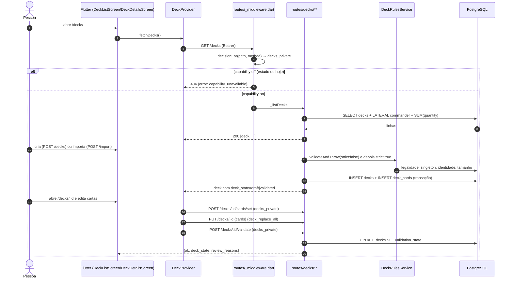

# Fluxo `deck_lifecycle` — ciclo de vida do deck (listar, criar, importar, detalhe, editar cartas, validar, exportar, preço)

Estado: documentação de apoio, não autoritativa · gerado em 2026-09-21 sobre o commit d26f23a16 · verificação estática (nenhum teste foi executado)

---

## 1. Resumo e veredito

| Eixo | Veredito | Base |
| --- | --- | --- |
| **Implementado** | **sim** | 13 rotas de servidor e 4 telas de app com o caminho completo escrito; toda mutação **de cartas** passa por `DeckRulesService` dentro de `runTx`. *(Corrigido na verificação adversarial: a frase original dizia "toda mutação". Não é verdade — `POST /decks/:id/pricing` escreve `UPDATE cards` (`pricing/index.dart:152`) e `UPDATE decks` (`:217`) **sem `runTx` e sem `DeckRulesService`**, e um `PUT /decks/:id` que só carrega `{is_public}` ou `{description}` não entra em nenhum dos dois ramos de validação de `routes/decks/[id]/index.dart:176-533`.)* |
| **Alcançável hoje** | **não** | `server/config/release_capabilities.json:22-27` tem `decks_private.allowed = false`. Com a política vigente toda rota `/decks*` e `/import*` devolve **404 `capability_unavailable`** em `server/routes/_middleware.dart:105-144`, e o app redireciona `/decks` → `/home` em `app/lib/core/config/release_capabilities.dart:520-523`. |
| **Provado** | **parcial, e fraco no servidor** | No app existe cobertura de widget e de provider real (fake `ApiClient`). No servidor **nenhum teste que roda no portão executa um handler de deck de verdade**: em `full`, `scripts/quality_gate.sh:89` exclui as tags `live \|\| live_backend \|\| live_db_write \|\| live_external \|\| historical_external_snapshot`; em `quick`, `:62` roda `dart test` **sem** `--exclude-tags`, mas com `RUN_INTEGRATION_TESTS=0`, o que faz os mesmos arquivos se auto-pularem (`decks_crud_test.dart:24-25`). Efeito líquido idêntico nos dois modos. Os testes de deck que sobram são unitários de suporte ou testes que fazem `grep` no código-fonte da rota. |

Três afirmações que precisam ser separadas e que a documentação atual mistura:

1. **Implementado ≠ coerente.** A superfície de escrita do deck está fatiada em **duas** capabilities no servidor (`decks_private` e `deck_replace_all`), e o app só conhece essa separação em 2 dos 5 pontos onde ela vale (achados A1 e A2).
2. **Alcançável ≠ política.** Além de `decks_private`, o fluxo completo de detalhe depende de `catalog_private` (adicionar carta), `gallery_public` (tornar público / relatório) e `ai_analyze_optimize_advisory` (aba de análise). Todas `off`.
3. **Provado ≠ existe arquivo de teste com o nome certo.** Dois dos quatro testes que `project_logic_contracts.json` declara para este fluxo (`deck_validation_state_route_contract_test.dart` e parte de `deck_rules_service_test.dart`) são asserções de `contains(...)` sobre o texto do arquivo da rota; um terceiro (`import_to_deck_flow_test.dart`) exige duas variáveis de ambiente e nunca roda no portão.

### Diagrama da jornada principal



---

## 2. Jornada passo a passo

Legenda de capability: a coluna mostra a capability que o **servidor** exige (`server/lib/release_capability_policy.dart:377-545`).

| # | Passo | Tela / widget | Provider / cliente | Método + endpoint | Handler | Serviço / repositório | Tabelas | Capability (servidor) |
| --- | --- | --- | --- | --- | --- | --- | --- | --- |
| 1 | Listar decks | `app/lib/features/decks/screens/deck_list_screen.dart:48-79` (`initState` → `_refreshDecksIfVisible`) e `:603-607` (rebuild quando a capability chega) | `deck_provider.dart:391-444` → `deck_provider_support_fetch.dart:177-180` | `GET /decks` | `server/routes/decks/index.dart:29-31,37-302` | SQL inline (4 variantes conforme colunas existentes) | `decks`, `deck_cards`, `cards` | `decks_private` |
| 2 | Enriquecer cor de identidade (background) | — (disparado de `deck_provider.dart:411-413`) | `deck_provider_support_fetch.dart:182-207` — **1 GET por deck, em série** | `GET /decks/:id` (N vezes) | `server/routes/decks/[id]/index.dart:599-853` | — | `decks`, `deck_cards`, `cards`, `sets` | `decks_private` |
| 3 | Criar deck (modal) | `deck_list_screen.dart:94-528`; submit em `:407-516`; botão trava em `:2662-2668` | `deck_provider.dart:447-528` → `deck_provider_support_mutation.dart:31-53` | `POST /decks` | `server/routes/decks/index.dart:24-26,305-597` | `DeckRulesService.validateAndThrow` (`:453-467`) + `buildDeckReadinessContract` | `decks`, `deck_cards`, `card_legalities` | `decks_private` |
| 4 | Importar lista como deck novo — revisar | `app/lib/features/decks/screens/deck_import_screen.dart:148-187` (`_previewImport`) | `deck_provider.dart:1494-1507` → `deck_provider_support_import.dart:105-118` | `POST /import/validate` | `server/routes/import/validate/index.dart:11-16,20-363` | `parseImportLines`, `resolveImportCardNames`, `DeckRulesService` (somente leitura) | `cards`, `card_localized_names`, `card_legalities` | `decks_private` |
| 5 | Importar lista como deck novo — gravar | `deck_import_screen.dart:267-390` (`_importDeck`; exige preview antes, `:282-285`) | `deck_provider.dart:1446-1492` → `deck_provider_support_import.dart:60-79` | `POST /import` | `server/routes/import/index.dart:38-43,45-412` | `DeckRulesService` (soft + strict) + `buildDeckImportReviewContract` | `decks`, `deck_cards` | `decks_private` |
| 6 | Abrir detalhe | `app/lib/features/decks/screens/deck_details_screen.dart:146-160`, corpo em `:609-721` | `deck_provider.dart:227-296` → `deck_provider_support_fetch.dart:115-121` | `GET /decks/:id` | `server/routes/decks/[id]/index.dart:26-28,599-853` | agrupa por tipo, curva, cores, `buildDeckSnapshotHash` | `decks`, `deck_cards`, `cards`, `sets` | `decks_private` |
| 7 | Adicionar carta (busca) | FAB `deck_details_screen.dart:1487-1513` → rota `/decks/:id/search` → `app/lib/features/cards/screens/card_search_screen.dart:249,287` | `deck_provider.dart:563-620` → `deck_provider_support_mutation.dart:67-82` | `POST /decks/:id/cards` | `server/routes/decks/[id]/cards/index.dart:11-439` | `validateMainDeckCardEligibility`, `isCommanderEligibleCard`, `DeckRulesService` | `deck_cards`, `card_legalities` | `decks_private` (**mas a tela de busca precisa de `catalog_private`**, ver 3.3) |
| 8 | Editar carta (quantidade, condição, edição, comandante) | `deck_details_screen.dart:1838-1876` → `deck_card_edit_dialog.dart` | `deck_provider.dart:188-224` → `deck_provider_support_mutation.dart:135-155` | `POST /decks/:id/cards/set` | `server/routes/decks/[id]/cards/set/index.dart:21-246` | `DeckRulesService` | `deck_cards` | `decks_private` |
| 9 | Trocar só a edição | `deck_details_screen.dart:1787-1832` (**não checa capability**) | `deck_provider.dart:912-926` → `deck_provider_support_mutation.dart:375-389` | `POST /decks/:id/cards/replace` | `server/routes/decks/[id]/cards/replace/index.dart:14-228` | `DeckRulesService` | `deck_cards` | **`deck_replace_all`** |
| 10 | Remover carta (swipe) | `deck_details_screen.dart:1161-1209` (**não checa capability**) | `deck_provider.dart:165-186` → `deck_provider_support_mutation.dart:121-133` | `PUT /decks/:id` com `{cards:[...]}` | `server/routes/decks/[id]/index.dart:30-32,77-596` | `DeckRulesService`; `DELETE FROM deck_cards` + batch `INSERT` (`:386-416`) | `deck_cards`, `decks` | **`deck_replace_all`** |
| 11 | Adicionar em lote (aplicar sugestões) | `deck_details_screen.dart:2522-2529` (**gate do app = `ai_analyze_optimize_advisory`**, `:2523`) | `deck_provider.dart:855-879` → `deck_provider_support_mutation.dart:84-100` | `POST /decks/:id/cards/bulk` | `server/routes/decks/[id]/cards/bulk/index.dart:16-396` | `mergeBulkCardIncrementsPreservingCondition`, `DeckRulesService` | `deck_cards`, `decks` | `decks_private` (app é mais restritivo — A20) |
| 11b | **Aplicar otimização (removals + additions)** | `deck_details_screen.dart:2530-2539` (**gate do app = `ai_analyze_optimize_advisory`**, `:2538`) | `deck_provider.dart:1258-1400` → `deck_provider_support_mutation.dart:275-...` (`persistDeckCardsPayloadRequest`) | `PUT /decks/:id` com `{cards, mutation_context}` | `server/routes/decks/[id]/index.dart:77-596` | `DeckRulesService`; `expected_deck_signature` conferida (único caminho que confere) | `deck_cards`, `decks` | **`deck_replace_all`** (divergente — A20) |
| 12 | Colar lista dentro do deck | `deck_details_screen.dart:1653-1683` (gate duplo correto) + `deck_import_list_dialog.dart:361` | `deck_provider.dart:1509-1527` → `deck_provider_support_import.dart:159-174` | `POST /import/to-deck` | `server/routes/import/to-deck/index.dart:16-355` | `mergeImportToDeckCards`, `DeckRulesService` | `deck_cards` | **`deck_replace_all`** |
| 13 | Validar deck (manual e automático) | manual `deck_details_screen.dart:1582-1600`; automático `:712-720` + `:1516-1534` | `deck_provider.dart:909-910` → `deck_provider_support_mutation.dart:221-227` | `POST /decks/:id/validate` | `server/routes/decks/[id]/validate/index.dart:10-90` | `DeckRulesService(strict: true)` + `deckValidationMark{Success,Failure}Sql` | `decks` (grava `validation_state`) | `decks_private` |
| 14 | Exportar / copiar / compartilhar texto | `deck_details_screen.dart:1559-1580` → `deck_details_actions.dart:67-109` | `deck_provider.dart:1591-1597` → `deck_provider_support_import.dart:223-229` | `GET /decks/:id/export` | `server/routes/decks/[id]/export/index.dart:7-108` | montagem de texto em memória | `decks`, `deck_cards`, `cards` | `decks_private` |
| 15 | Custo estimado | `deck_details_screen.dart:1635` + `:1878-...` → `deck_details_actions.dart:172-194` | `deck_provider.dart:927-932` → `deck_provider_support_mutation.dart:266-275` | `POST /decks/:id/pricing` | `server/routes/decks/[id]/pricing/index.dart:21-275` | HTTP externo para `api.scryfall.com` (`:277-322`), grava preço | `decks`, `deck_cards`, `cards` | `decks_private` |
| 16 | Tornar público / privado | `deck_details_screen.dart:515-528,1538-1550` (gate = `gallery_public`) | `deck_provider.dart:1555-1588` → `deck_provider_support_import.dart:212-221` | `PUT /decks/:id` com `{is_public}` | `server/routes/decks/[id]/index.dart:77-596` | — | `decks` | **`deck_replace_all`** (o app gateia por `gallery_public`) |
| 17 | Relatório compartilhável | `deck_details_screen.dart:2144-2168` (gate = `gallery_public`) | `ApiClient` direto (não passa pelo provider) | `POST /decks/:id/reports` | `server/routes/decks/[id]/reports/index.dart:10-47` | `ShareableReportService.createForDeck` | `decks`, tabela de relatórios | `gallery_public` |
| 18 | Excluir deck | `deck_list_screen.dart` (diálogo) / `deck_details_screen.dart` | `deck_provider.dart:531-560` → `deck_provider_support_fetch.dart:243-249` | `DELETE /decks/:id` | `server/routes/decks/[id]/index.dart:34-36,43-74` | `deleteDeckAfterBattleGuard` (`server/lib/battle/interactive_battle_deck_lifecycle.dart:13-67`) | `decks` (**hard delete**), cascata em `deck_cards` | `decks_private` |

---

## 3. Capabilities e portões

### 3.1 Os dois portões fail-closed

**Servidor** — `server/routes/_middleware.dart:105-144`. Antes de qualquer handler e antes mesmo de conectar no banco (`:147-161`), a política decide:

- `decks_private` para `/decks`, `/decks/*`, `/import`, `/import/*` (`release_capability_policy.dart:537-542`);
- **exceções que sobem para `deck_replace_all`**: `PUT /decks/:id` (`:389-392`), `POST /decks/:id/cards/replace` e `POST /import/to-deck` (`:393-397`);
- `gallery_public` para `POST /decks/:id/reports` (`:474-476`);
- `ai_analyze_optimize_advisory` para `/decks/:id/analysis`, `/decks/:id/ai-analysis`, `/decks/:id/optimizations*` (`:431-442`);
- `battle_batch` para `/decks/:id/battle-replays*` (`:419-423`).

Rota não classificada devolve **404 `capability_route_unclassified`** (`:168-178`); política inválida devolve **503 `capability_policy_invalid`** (`:179-186`); capability desligada devolve **404 `capability_unavailable`** (`:187-194`). Corpo: `{error, capability, release_capability, policy_version, policy_digest_sha256, offer_mode}`.

**App** — `app/lib/core/config/release_capabilities.dart:350-534`, chamado no `redirect` do router em `app/lib/main.dart:426-434`:

- `/decks` e `/decks/*` sem `decks_private` → `/home` (`:520-523`);
- `/decks/generate` sem `ai_generate_rebuild` → `/decks` (`:368-371`);
- `/decks/:id/search` sem `catalog_private` → `/decks/:id` (`:397-401`);
- `/decks/:id/scan` sem `scanner` → `/decks/:id/search` (`:391-395`).

### 3.2 Os nomes batem?

Sim no **vocabulário**: `app/test/core/config/release_capability_surface_contract_test.dart:162-177` compara o enum `ReleaseCapability` com as chaves de `server/config/release_capabilities.json` e exige exatamente 29 (verificado: as 29 estão `off`/`allowed:false`). Esse teste roda no portão **apenas em `full`** — `run_frontend_full` (`quality_gate.sh:139-144`) chama `flutter test` sem filtro de caminho; `run_frontend_quick` (`:95-98`) só roda `flutter analyze`, sem nenhum teste.

Não no **mapeamento rota→capability**. O servidor tem esse mapa testado (`server/test/release_capability_policy_test.dart:192-212`, incluindo `'PUT /decks/deck': 'deck_replace_all'`). O app **não tem nenhum teste equivalente** que verifique que a ação da UI é guardada pela mesma capability da rota que ela chama. Resultado: **quatro** ações divergem (achados A1, A2, A3 e A20).

### 3.3 É alcançável hoje?

Não. Todas as 29 capabilities de `server/config/release_capabilities.json` estão `release_capability: "off"` / `allowed: false`. Para o fluxo ficar utilizável de ponta a ponta são necessárias **cinco**:

| Capability | Libera | Sem ela |
| --- | --- | --- |
| `decks_private` | listar, criar, importar, detalhe, `cards`, `cards/set`, `cards/bulk`, validar, exportar, preço, excluir | tela `/decks` inteira redireciona para `/home` |
| `deck_replace_all` | remover carta, trocar edição, colar lista, renomear/descrição/estratégia, tornar público, **aplicar otimização** | as ações ficam visíveis e falham em runtime (A1, A2, A3, A20) |
| `catalog_private` | `/decks/:id/search` (adicionar carta) | o FAB "Buscar carta" continua visível e o toque não sai do lugar (A4) |
| `gallery_public` | tornar público, relatório compartilhável | itens de menu somem — comportamento correto |
| `ai_analyze_optimize_advisory` | abas de análise/oficina no detalhe | `_replaceTabController(2)` reduz para 2 abas — comportamento correto |

### 3.4 O que a pessoa vê quando está negado

| Situação | O que acontece | Arquivo |
| --- | --- | --- |
| `decks_private` off, tenta `/decks` | redirect para `/home`, **sem mensagem** | `release_capabilities.dart:520-523` |
| `decks_private` off, já dentro de `/decks` (ex.: shell) | painel "Decks indisponíveis / Esta versão ainda não liberou o acesso aos decks privados" (`Key('deck-list-capability-unavailable')`) — **este é o bom padrão** | `deck_list_screen.dart:636-646` |
| `deck_replace_all` off, remove carta | snackbar com o texto literal **`capability_unavailable`** (via `FriendlyErrorMapper.fromException`, que remove o prefixo `Exception:` em `friendly_error_mapper.dart:142-145` e então devolve a string crua em `:317-319`) | achado A5 |
| `deck_replace_all` off, aplica otimização | igual — mas depois de a cota de IA já ter sido consumida | achado A20 |
| Excluir deck em partida ativa | snackbar com o código literal **`deck_has_active_interactive_battle`**; a frase em português do servidor é descartada | achado A21 |
| `catalog_private` off, toca "Buscar carta" | nada visível (redirect de volta para a mesma rota) | achado A4 |
| Capabilities ainda carregando ou `/capabilities` falhou | idêntico a "desligado": redirect silencioso para `/home`, sem retentativa de rota | achado A6 |

---

## 4. Contrato app↔servidor

| Endpoint | Método | O app manda | O servidor lê | O servidor devolve | O app lê | Divergência |
| --- | --- | --- | --- | --- | --- | --- |
| `/decks` | GET | — | `userId` do token | **array cru**, sem envelope nem paginação (`routes/decks/index.dart:290`); a rota **já resolve `color_identity` em uma única query agregada** para todos os decks e marca `color_identity_known: true` (`:247-278`) | `parseDeckListResponse` faz `response.data as List` (`support_fetch.dart:147-157`) | **Sem paginação nos dois lados** (nenhum `LIMIT`/`OFFSET` nas 4 variantes do SQL; os `LIMIT 1` em `:83,118,154,189` são das subconsultas LATERAL de comandante). O N+1 de hidratação existe (`support_fetch.dart:189-201`) mas **não é o caminho normal** — só dispara quando a query agregada de cor falha (`catch` em `:279-285` marca todos os decks com `color_identity_known:false`). Ver A7 corrigido. |
| `/decks` | POST | `name, format, description, archetype?, bracket?, is_public, cards[]` (`support_mutation.dart:42-51`) | todos (`routes/decks/index.dart:320-338`) | **status 200** (não 201) com o mapa do deck + `deck_state/requires_review/review_reasons` | aceita 200 ou 201 (`support_mutation.dart:10`) | Resposta **não traz** `description`, `card_count`, `commander_name`; o app compensa com `copyWith` e um `fetchDecks(silent:true)` de fundo (`deck_provider.dart:482-497`). `cards[i].condition` não é lido pelo servidor. |
| `/decks/:id` | GET | — | `userId`, `deckId` | `deckInfo` + `deck_snapshot_hash`, `deck_version_at`, `color_identity`, `stats`, `commander`, `main_board`, `all_cards_flat` | `DeckDetails.fromJson` | `deck_version_at` é `DateTime.now()` a cada request (`routes/decks/[id]/index.dart:831`) — não serve como versão para concorrência otimista. |
| `/decks/:id` | PUT | `{cards}` ou `{is_public}` ou `{description}` ou `{archetype,bracket}` ou `{cards,mutation_context}` | tudo opcional (`routes/decks/[id]/index.dart:93-126`) | `{success:true, deck, optimization_event?, post_analysis?, validation?}` | `parseDeckMutationResponse` só olha o status; `persistDeckCardsPayloadRequest` lê `validation` e `optimization_event` | **`optimization_event`, `post_analysis` e `validation` só existem quando há `mutation_context`** (`:553-567`). Fora disso o app faz um segundo `POST /validate` (`support_mutation.dart:243-246`). A resposta vem de `SELECT *` e **inclui `user_id` e `deleted_at`** (`:537-541`). |
| `/decks/:id` | DELETE | — | `userId`, `deckId` | 204 / 404 / **409 `{error:'deck_has_active_interactive_battle', message:'Este deck está em uso por uma partida em andamento…'}`** (`routes/decks/[id]/index.dart:60-67`) | aceita 200 ou 204 (`support_fetch.dart:232-241`); 409 cai em `FriendlyErrorMapper.fromApiResponse(response)` **sem contexto** (`:238`) | **DIVERGÊNCIA (A21).** *Corrigido na verificação adversarial — a versão anterior deste documento afirmava que a mensagem em português "chega ao usuário" e que "funciona, mas por acidente". É o contrário:* `_messageFromBody` lê `body['error'] ?? body['message']` (`friendly_error_mapper.dart:266`), então pega o **código** `deck_has_active_interactive_battle`, que não casa com nenhum padrão de `_looksTechnical` (`:345-368`) e é devolvido cru. A frase em português escrita no servidor nunca é lida. |
| `/decks/:id/cards` | POST | `card_id, quantity, is_commander, condition` | todos | `{ok, deck_id, card_id, card_name, quantity, is_commander, condition, total_cards}` | **nada** — só o status (`support_mutation.dart:55-65`) | O app descarta `total_cards` e refaz `GET /decks/:id`. Deck inexistente devolve **500**, não 404 (A8). |
| `/decks/:id/cards/set` | POST | `card_id, quantity, replace_same_name, condition, is_commander` | todos | `{ok, deck_id, card_id, name, quantity, is_commander, condition, replace_same_name}` | payload guardado em `DeckMutationResult` e **descartado** | `quantity` deve ser `> 0` (`set/index.dart:55-60`) — **não existe caminho "setar 0 para remover"**, por isso a remoção precisa do PUT. Deck inexistente → 500 (A8). |
| `/decks/:id/cards/bulk` | POST | `cards[]`, `mutation_context?` | idem | `{ok, total_cards, ...}` ou **409** com `error_code` | só status | `is_commander: true` é rejeitado com 400 (`bulk/index.dart:83-90`) — o app nunca manda. Deck inexistente → 500 (A8). |
| `/decks/:id/cards/replace` | POST | `old_card_id, new_card_id` | idem | `{ok, changed, name, old_card_id, new_card_id}` | só status | Servidor exige mesmo **nome** (`replace/index.dart:112-116`). Deck inexistente → 500 (A8). |
| `/decks/:id/validate` | POST | `{}` | `userId`, `deckId` | 200 `{ok:true, format, deck_id, deck_state, requires_review, review_reasons, validation_updated_at}`; 400 `{ok:false, error, deck_state, review_reasons, card_name?}`; **404 `{ok:false, error_code:'deck_not_found'}`**; **500 `{ok:false, error_code:'deck_validation_internal_error'}`** | `parseDeckValidationResponse` devolve o corpo sempre que `ok == false` (`support_mutation.dart:204-219`) | **404 e 500 viram "Deck inválido" na UI** (A9). |
| `/decks/:id/export` | GET | — | `userId`, `deckId` | `{deck_name, format, text, card_count}` | só `text` e `error` (`deck_details_actions.dart:33-45`) | `deck_name`, `format` e `card_count` são ignorados. Além disso `card_count` conta **linhas únicas**, não cópias (`export/index.dart:98`) — o campo já está errado e ninguém percebe porque ninguém lê. |
| `/decks/:id/pricing` | POST | `{force}` (`support_mutation.dart:262-264`) | `force` e `refresh_missing` (`pricing/index.dart:32-33`) | 14 campos, incluindo `pricing_status`, `cache_status`, `known_price_cards`, `total_cards`, `refreshed_price_cards`, `failed_refresh_rows`, `deferred_refresh_rows`, `price_source`, `pricing_updated_at` (`:250-266`) | apenas `estimated_total_usd`, `missing_price_cards`, `items[].unit_price_usd`, `items[].line_total_usd` | O app **ignora todo o sinal de frescor** (A10). *Correção da verificação adversarial: a versão anterior listava "o app nunca manda `refresh_missing`" como defeito — é factual mas inofensivo, porque o default do servidor é `true` (`body['refresh_missing'] != false`, `:33`). O defeito real que estava faltando é o **teto de 10 linhas por chamada** (`requestedRefreshRows = cardsToFetch.take(10)`, `:239`): o resto vira `deferred_refresh_rows`, e o app nunca re-pede — ver A22.* |
| `/decks/:id/reports` | POST | `title, description, payload` | via `ShareableReportService` | **201** `{report, public_url}` | exige exatamente 201 (`deck_details_screen.dart:2160-2161`) | Shape coerente, **tratamento de erro não** (A23): qualquer status ≠ 201 vira `null` e `catch (_) { return null; }` (`:2166`) engole tudo — sem snackbar, sem log. Além disso `public_url` cai no fallback `https://brewtact.com` quando o ambiente não define `MANALOOM_PUBLIC_SITE_URL`/`NEXT_PUBLIC_SITE_URL` (`server/lib/public_site_url.dart:1,22,25-28`) — A24. |
| `/import/validate` | POST | `format, list, commander?` | idem | `found_cards, not_found_lines, localized_matches, localized_matches_count, warnings, total_cards, total_unique, commander_detected, missing_commander` | todos (`support_import.dart:81-103`) | coerente. Handler **não usa `userId`** embora esteja sob `authMiddleware`. |
| `/import` | POST | `name, format, list, description?, commander?` | idem | `deck, cards_imported, not_found_lines, localized_matches(_count), is_partial, deck_state, requires_review, validation, commander_detected, missing_commander, warnings?` | todos | Erro 400 devolve `not_found` **e** `not_found_lines`; o app só lê `not_found` (`support_import.dart:52-54`) — funciona hoje, mas depende de um campo duplicado. |
| `/import/to-deck` | POST | `deck_id, list, replace_all` | idem | `success, deck_id, cards_imported, total_cards, not_found_lines, localized_matches(_count), warnings, commander_detected, missing_commander, commander_preserved`; **409 `import_deck_changed`** | todos | coerente. |

**Endpoint que ninguém chama neste fluxo:** `GET /decks/:id/reports` não existe (só POST). `POST /decks/:id/recommendations` e `GET /decks/:id/simulate` não têm consumidor Flutter (já registrado em `docs/BREWTACT_DECKBUILDER_AI_CURRENT_FLOW_2026-08-12.md:363,366`).

---

## 5. Dados

### Tabelas

`server/database_setup.sql:309-410`.

**`decks`** — `id uuid pk`, `user_id → users(id) ON DELETE CASCADE`, `name`, `format`, `description`, `is_public bool default false`, `validation_state text not null default 'unknown'`, `validation_reasons jsonb not null default '["validation_not_recorded"]'`, `validation_updated_at`, `archetype`, `bracket int`, `synergy_score`, `strengths`, `weaknesses`, `pricing_currency/total/missing_cards/source/updated_at`, `created_at`, **`deleted_at`**.

Invariantes reais no schema (`:358-392`):
- `chk_decks_validation_state`: `validation_state IN ('unknown','draft','validated')`;
- `chk_decks_validation_reasons_array`: `jsonb_typeof(validation_reasons) = 'array'`;
- `chk_decks_validation_state_payload`: tripla acoplada — `unknown` ⇒ razões `["validation_not_recorded"]` e `validation_updated_at IS NULL`; `draft` ⇒ ≥1 razão e timestamp não nulo; `validated` ⇒ 0 razões e timestamp não nulo;
- `chk_decks_commander_bracket` (`server/bin/migrate.dart:1245-1247`): `bracket IS NULL OR BETWEEN 1 AND 5`;
- índice parcial `idx_decks_user_validation_state ... WHERE deleted_at IS NULL`.

**`deck_cards`** — `id uuid pk`, `deck_id → decks(id) ON DELETE CASCADE`, `card_id → cards(id) ON DELETE CASCADE`, `quantity int default 1`, `is_commander bool default false`, `condition text default 'NM'`, **`UNIQUE(deck_id, card_id)`**, `chk_deck_cards_condition CHECK (condition IN ('NM','LP','MP','HP','DMG'))`.

**`card_legalities`** — lida por `DeckRulesService._loadLegalities` (`server/lib/deck_rules_service.dart:455-472`) e diretamente pelas rotas `cards/index.dart:109-132` e `import/validate/index.dart:286-308`.

### Trigger

São **dois** pares função/trigger (nomes conferidos um a um; a versão anterior deste documento misturava o nome da função de um com o nome do trigger do outro):

| Função | Trigger | Quando | Linhas |
| --- | --- | --- | --- |
| `manaloom_mark_deck_cards_changed()` | `manaloom_deck_cards_require_review` | `AFTER INSERT OR DELETE OR UPDATE OF deck_id, card_id, quantity, is_commander ON deck_cards`, **`FOR EACH ROW`** | `database_setup.sql:414-448` |
| `manaloom_mark_deck_format_changed()` | `manaloom_deck_format_require_review` | `BEFORE UPDATE OF format ON decks`, `FOR EACH ROW` | `database_setup.sql:450-468` |

Mexer em `deck_cards` ou trocar `format` rebaixa o deck para `draft` automaticamente (`validation_reasons = ["deck_cards_changed_since_validation"]` ou `["deck_format_changed_since_validation"]`). **Esse é o mecanismo que impede o `validated` de ficar velho** — não está documentado em nenhum dos contratos de partida.

Consequência que o documento original não registrou: o trigger de `deck_cards` é **`FOR EACH ROW`** e faz `UPDATE decks ... WHERE id = ANY(affected_deck_ids)` a cada linha (`:429-434`). Um `PUT /decks/:id` num Commander de 100 cartas apaga 100 linhas e insere 100 (`routes/decks/[id]/index.dart:385-416`) → **~200 `UPDATE` na mesma linha de `decks` dentro de uma transação**. Ver A25.

### Observações de dado

1. **`decks.deleted_at` é escrito por ninguém neste fluxo.** `DELETE /decks/:id` faz `DELETE FROM decks` de verdade (`interactive_battle_deck_lifecycle.dart:54-62`). Verificado por `git grep 'deleted_at' -- server/routes/decks/` = **zero ocorrências** (nem leitura, nem escrita). As duas escritas de `deleted_at` no servidor ficam em `user_data_privacy_service.dart:840` (tabela `privacy_deleted_deck_tombstones`) e `:947` (tabela `users`). Ao mesmo tempo `GET /decks` e `GET /decks/:id` **não filtram `deleted_at IS NULL`**, enquanto `routes/community/decks/index.dart:33` e `routes/binder/index.dart:116` filtram. Soft-delete existe no schema e não existe no comportamento (A11).
2. **`condition` é assimétrico.** `POST /decks` insere sem a coluna (`routes/decks/index.dart:500-504`) e ignora `condition` do corpo; `POST /import` também (`import/index.dart:326-329`). Todos os outros escritores preenchem. Resultado: deck criado/importado nasce com o default `'NM'` — consistente por acaso, não por contrato.
3. **`is_public` e `archetype`/`bracket` não são aceitos no import.** `import/index.dart:295-305` insere só `user_id, name, format, description`.

---

## 6. Estados e erros

| Estado | Tratado? | Onde |
| --- | --- | --- |
| Carregando lista | sim | `deck_list_screen.dart:662-670` — painel só quando a lista está vazia; recarga com lista cheia é silenciosa |
| Lista vazia | sim | `deck_list_screen.dart:690-698` (`_DeckEmptyState` com criar/gerar/importar) |
| Erro de rede na lista | sim | `deck_list_screen.dart:673-687`; `_decks` **não** é limpo em erro (`deck_provider.dart:435`), então cache visual sobrevive |
| Carregando detalhe | sim | `deck_details_screen.dart:624-632` |
| Detalhe: 401 | sim, com ação dedicada | `deck_details_screen.dart:634-658` → logout + `/login`; `_detailsStatusCode` vem de `support_fetch.dart:93-103` |
| Detalhe: deck nulo | sim | `deck_details_screen.dart:661-670` |
| Sessão expirada global | sim | `ApiClient.isSessionInvalidatingUnauthorized` (`api_client.dart:97-117`) dispara o handler uma única vez (`:623-627`) e **não** dispara para `invalid_password` |
| Offline / retry | **parcial** | GET tem 1 retentativa para 500/502/503/504 (`isTransientGetStatus`, `api_client.dart:186-190`) e para exceções (`:307-346`); POST/PUT/DELETE **não têm retry** (correto, evita escrita duplicada). Não há persistência em disco da lista: `_deckDetailsCache` é memória (`deck_provider.dart:77`), então boot offline mostra erro, não a última lista. *Nuance que faltava: a dependência de persistência já existe e já é usada no mesmo fluxo — `DeckEntryDraftStore` grava rascunho de import/geração em `SharedPreferences` (`app/lib/features/decks/services/deck_entry_draft_store.dart:3,5-9`). A ausência de cache de lista é escolha, não falta de infraestrutura (A19)* |
| Validação de regra (400) | sim | `DeckRulesException` → 400 com mensagem em português em todas as rotas de escrita; o app repassa via `_messageFromBody` |
| 403 de capability | **não ocorre** | o middleware usa 404, nunca 403 (`_middleware.dart:187-194`) |
| 404 de capability | **mal tratado** | vaza `capability_unavailable` cru (A5) |
| 404 de deck inexistente no `/validate` | **mal tratado** | vira "Deck inválido" (A9) |
| Deck inexistente nas rotas `cards*` | **mal tratado** | 500 em vez de 404 (A8) |
| 409 de partida ativa ao excluir | **mal tratado** | o app mostra o código cru `deck_has_active_interactive_battle` e descarta a frase em português do servidor (A21) |
| Falha ao criar relatório compartilhável (passo 17) | **não tratado** | `catch (_) → null`, sem mensagem e sem log (A23) |
| Preço parcial / adiado (> 10 cartas sem cache) | **não tratado** | `deferred_refresh_rows > 0` nunca é re-pedido; o total nunca converge pela UI (A22) |
| Duplo toque em "Criar" | sim | `isSubmitting` desabilita ambos os botões (`deck_list_screen.dart:2662-2668`) |
| Duplo toque em "Validar" | sim | diálogo bloqueante em `executeDeckValidation` (`deck_details_actions.dart:122`) + guarda `_isValidating` na versão silenciosa (`deck_details_screen.dart:1517`) |
| Duplo toque em "Importar" | sim | `busy = _isImporting \|\| _isPreviewing` desabilita o CTA (`deck_import_screen.dart:1255,1268`) |
| Validação automática repetida | sim | flag `_validationAutoLoaded` (`deck_details_screen.dart:713-720`) |
| Concorrência entre dispositivos / abas | **não** | `PUT /decks/:id` só exige `expected_deck_signature` quando há `mutation_context` (`routes/decks/[id]/index.dart:236-252`). Remoção manual é *last-write-wins* e apaga o que outro cliente adicionou (A12) |
| Concorrência com job assíncrono (otimização em andamento) | parcial | o job de otimização é rastreado no provider (`_activeOptimizeJobId`), mas nada impede uma remoção manual durante o job; quem paga é a assinatura na hora do apply → 409 `optimization_preview_stale` |
| Import concorrente | sim | `import/to-deck` trava a linha do deck com `FOR UPDATE` e devolve 409 `import_deck_changed` se o formato mudou (`to-deck/index.dart:213-231,340-348`) |
| Excluir deck em partida ativa | **no servidor sim, na UI não** | o guard é correto (409 com lock de ciclo de vida, `interactive_battle_deck_lifecycle.dart:17-31`), mas a mensagem que chega à pessoa é o código cru (A21) |
| Capabilities ainda carregando | **não** | indistinguível de "desligado" (A6) |

---

## 7. Testes por passo e lacunas

`scripts/quality_gate.sh` em modo `full` (`run_backend_full`, `:65-93`) exclui `live || live_backend || live_db_write || live_external || historical_external_snapshot` na linha `:89`. Em modo `quick` (`run_backend_quick`, `:59-63`) não há `--exclude-tags`, mas `RUN_INTEGRATION_TESTS=0` faz cada arquivo `live` se auto-pular no próprio `skip:` (ex.: `decks_crud_test.dart:24-25`, `import_to_deck_flow_test.dart:11-20`). Tudo marcado como *live* abaixo **não roda** em nenhum dos dois modos.

| # | Passo | Teste que exercita | O que ele de fato afirma | Veredito |
| --- | --- | --- | --- | --- |
| 1 | Listar | `app/test/features/decks/providers/deck_provider_test.dart` (4 refs a `fetchDecks`); `app/test/features/decks/screens/deck_list_responsive_test.dart`; servidor: `server/test/deck_fetch_hydration_contract_test.dart` | app: comportamento real do provider com fake `ApiClient`. **Servidor: `contains('context.request.method == HttpMethod.get')` no texto do arquivo** — não executa SQL nem handler | app ok · servidor **grep** |
| 2 | Enriquecimento de cor | `deck_provider_support_test.dart` (`fetchMissingDeckColorIdentities`) | parsing | parcial |
| 3 | Criar | `deck_provider_test.dart:212-449` (5 casos: falha de resolve, nome não resolvido, nome ambíguo, sucesso); `deck_list_responsive_test.dart:884,913` (comandante enviado atomicamente / limpo ao trocar formato); servidor: `server/test/deck_create_bulk_insert_contract_test.dart` | app: comportamento. **Servidor: `contains('INSERT INTO deck_cards (deck_id, card_id, quantity, is_commander)')`** | app bom · servidor **grep** |
| 4 | `/import/validate` | `deck_provider_support_test.dart:2156-2160`; `server/test/import_list_service_test.dart`, `import_parser_test.dart` | app: fixture inventada `{'found_cards': []}` (`:2023`). Servidor: parsing puro, sem rota | parcial |
| 5 | `/import` | `deck_import_screen_test.dart:284` (diálogo de import parcial); `deck_flow_entry_screens_test.dart:889` (limpa rascunho); servidor: `server/test/deck_import_review_contract_test.dart` (contrato puro) | app: comportamento de UI. Servidor: só a função de contrato, não a rota | parcial |
| 6 | Detalhe | `deck_details_screen_smoke_test.dart` (16 `testWidgets`); `deck_provider_test.dart` (12 refs a `fetchDeckDetails`) | comportamento real, inclusive estados de loading/erro/vazio | bom |
| 7 | Adicionar carta | `deck_provider_test.dart:1916` (cardCount 39); `deck_provider_support_test.dart:2087-2094` | comportamento; servidor: `server/test/deck_manual_mutation_route_contract_test.dart:7-22` é **grep** de strings de resposta | app ok · servidor **grep** |
| 8 | Editar carta | `deck_provider_test.dart:1843-1882` ("edition and quantity update use one atomic set request", verifica corpo e que houve **um só** POST) | comportamento forte | bom |
| 9 | Trocar edição | `deck_provider_support_test.dart:2136-2141` (só chama, sem asserção de resultado); servidor: **grep** (`deck_manual_mutation_route_contract_test.dart:43-66`) | fraco | **lacuna** |
| 10 | **Remover carta (PUT)** | `deck_provider_support_test.dart:2113-2119` + `expect(removeResult.isSuccess, isTrue)` contra um `putHandler` que devolve `{}` | não verifica o corpo enviado, nem a preservação de `condition`, nem o caminho de erro | **lacuna** |
| 11 | Bulk | `deck_provider_support_test.dart:2095-2101`; `server/test/deck_cards_bulk_support_test.dart` (merge puro) | parcial | parcial |
| 12 | `/import/to-deck` | `app/test/features/decks/widgets/deck_import_list_dialog_test.dart` (3 refs); `server/test/import_to_deck_merge_support_test.dart`; `server/test/import_to_deck_flow_test.dart` (**live, duplo gate de env: `RUN_INTEGRATION_TESTS=1` + `MANALOOM_CONFIRM_LIVE_MUTATIONS=I_HAVE_EXPLICIT_APPROVAL`**, `:11-20`) | o único teste que exercita a rota de verdade nunca roda | parcial |
| 13 | Validar | `deck_details_actions_test.dart` (2 refs); `deck_runtime_widget_flow_test.dart:663` (`expect(postCalls, contains('/decks/deck-1/validate'))`); `server/test/deck_validation_route_support_test.dart` (funções de corpo); `server/test/deck_validation_state_route_contract_test.dart` (**grep**, `:30-39`); `server/test/deck_validation_test.dart` (**tautológico**, ver A13) | nenhum teste executa o handler `validate` | **lacuna no servidor** |
| 14 | Exportar | `deck_details_actions_test.dart` (`exportDeckAsText`); servidor: `deck_pricing_export_community_contract_test.dart` (**grep**) | app ok · servidor **grep** | parcial |
| 15 | Preço | `deck_details_actions_test.dart`; `deck_provider_support_test.dart:2107-2111` com fixture `{'total': 42}` — **chave que o servidor não devolve** | A asserção `expect(pricing['total'], 42)` passa com um contrato inventado (A14) | **lacuna** |
| 16 | Tornar público | `deck_provider_support_test.dart:2167-2171`; `deck_details_actions_test.dart` | só status | parcial |
| 17 | Relatório | nenhum | — | **sem teste — e sem tratamento de erro (A23)** |
| 18 | Excluir | `deck_provider_test.dart:1957-1990`; `deck_list_responsive_test.dart:590` (diálogo); servidor: `decks_crud_test.dart` (**live**) | app ok; guarda de partida ativa em `server/test/battle_deck_admission_test.dart` | parcial |

### Passos sem nenhum teste

- **Passo 17** (`POST /decks/:id/reports` a partir do preview de otimização).
- **Passo 9** e **passo 10** no servidor: nenhum teste in-process; só `grep` de fonte e testes `live` excluídos.

### Testes que só olham string/posição (não exercitam comportamento)

- `server/test/deck_validation_state_route_contract_test.dart` — 4 testes, todos `File(...).readAsStringSync()` + `contains(...)`; **declarado como teste do fluxo em `project_logic_contracts.json`**.
- `server/test/deck_manual_mutation_route_contract_test.dart` — idem, inclusive `source.indexOf(...)` comparando posições de texto (`:71-80`).
- `server/test/deck_fetch_hydration_contract_test.dart`, `deck_create_bulk_insert_contract_test.dart`, `deck_pricing_export_community_contract_test.dart` — idem.
- `server/test/deck_rules_service_test.dart` — 4 testes: 3 unitários de `parseDeckRulesCmcValue` e 1 `grep` anti-`print`. **Nenhum exercita legalidade, singleton, identidade de cor ou tamanho**, que é o que o contrato declara como fonte de verdade do fluxo.

### O contraste que fecha o argumento

`server/test/battle_replay_routes_security_test.dart:8-13` **importa e chama** os handlers de `routes/decks/[id]/battle-replays/**` e `routes/decks/_middleware.dart` in-process. A técnica está disponível no repositório e simplesmente não foi aplicada a nenhuma rota do ciclo de vida do deck.

---

## 8. Achados

| id | Tipo | Sev. | Achado | Arquivo:linha | Como provar |
| --- | --- | --- | --- | --- | --- |
| **A1** | incoerência app↔servidor | **alta** | **Remover carta não é gateada por `deck_replace_all` no app.** O swipe chama `removeCardFromDeck` → `PUT /decks/:id {cards}`, e o servidor classifica esse PUT como `deck_replace_all`. Com `decks_private` ON e `deck_replace_all` OFF (combinação que a política permite e que a decisão de produto não documenta), a pessoa abre o deck, arrasta a carta, o item some da lista otimista e a operação falha com 404. | app: `deck_details_screen.dart:1161-1209`, `deck_provider.dart:165-186`, `deck_provider_support_mutation.dart:121-133` · servidor: `release_capability_policy.dart:389-392` | Teste de widget: montar `DeckDetailsScreen` com `ReleaseCapabilitiesProvider.seeded({decksPrivate})` e afirmar que o `Dismissible` de exclusão não é construído (ou fica desabilitado). Prova viva: ligar só `decks_private`, arrastar uma carta, observar o 404 no log. |
| **A2** | incoerência app↔servidor | **alta** | **Trocar edição não é gateada.** `onShowEditionPicker` é sempre passado (incondicional, ao contrário de `onShowAiExplanation` logo acima, que é `null` sem a capability) e `_replaceEdition` chama `POST /decks/:id/cards/replace`, que exige `deck_replace_all`. Mesmo cenário de A1. | app: `deck_details_screen.dart:1693` (era "1694" — off-by-one corrigido), `:1787-1797` (`_showEditionPicker`), `:1800-1831` (`_replaceEdition`) · servidor: `release_capability_policy.dart:393-397` | Mesmo teste de widget, afirmando que o item "Trocar edição" do diálogo de carta não aparece sem `deckReplaceAll`. |
| **A3** | incoerência app↔servidor | média | **"Tornar Público" é gateado por `gallery_public` no app, mas a rota exige `deck_replace_all`.** Com `gallery_public` ON e `deck_replace_all` OFF o item de menu aparece e a ação falha. | app: `deck_details_screen.dart:515-528,1538-1550`, `deck_provider_support_import.dart:212-221` · servidor: `release_capability_policy.dart:389-392` | Teste unitário de mapeamento: uma tabela `ação da UI → endpoint → capability` comparada com `requiredCapabilityForRequest`. É a peça que falta no app. |
| **A4** | ux-funcional | média | **FAB "Buscar carta" vira no-op silencioso sem `catalog_private`.** O menu não consulta `catalogPrivate`; o `context.go('/decks/:id/search')` é interceptado pelo guard e volta para a mesma rota. Nenhuma mensagem. | `deck_details_screen.dart:1487-1513` vs `release_capabilities.dart:397-401` | Teste de widget com `seeded({decksPrivate})`: tocar o FAB e afirmar que a rota não mudou **e** que algo foi comunicado. Hoje o segundo `expect` falha. |
| **A5** | ux-funcional / seguranca | **alta** | **Erro interno de política vaza cru para a pessoa.** O corpo do 404 de capability é `{"error":"capability_unavailable"}`; `_messageFromBody` não reconhece a string como técnica e a devolve como mensagem final. A pessoa lê literalmente **"capability_unavailable"** no snackbar / diálogo. Vale também para `capability_route_unclassified`. O app não menciona `capability_unavailable` em lugar nenhum (`git grep` em `app/` = 0 ocorrências). | `app/lib/core/utils/friendly_error_mapper.dart:261-322` (retorno cru em `:317-319`); origem em `server/routes/_middleware.dart:128-143` | Teste unitário direto: `FriendlyErrorMapper.fromStatusCode(404, body: {'error':'capability_unavailable'}, context: FriendlyErrorContext.deckSave)` — hoje retorna `'capability_unavailable'`; deve retornar uma frase de produto. |
| **A6** | estado-nao-tratado | média | **"Carregando capabilities" é indistinguível de "desligado".** `ReleaseCapabilityRouteGuard.redirectFor` recebe só o `snapshot` (que é `denied()` enquanto `loadState` é `loading`/`unavailable`) e nunca o `loadState`. Deep link para `/decks/:id` durante a janela de carregamento manda para `/home`; quando a política chega, o router é notificado mas **não volta** para a rota pedida. | `release_capabilities.dart:273-317,350-356`; consumo do `loadState` só em `main.dart:1017` | Teste de router: `GoRouter` real com `ReleaseCapabilitiesProvider` cujo `refresh` resolve depois; navegar para `/decks` antes da resolução e afirmar o destino final. Hipótese quanto à frequência em produção — o caminho de boot normal passa pela splash. |
| **A7** | bug-provavel / eficiencia | **baixa** *(rebaixado de média na verificação adversarial)* | **Listagem sem paginação (confirmado) + N+1 de detalhe só no caminho degradado (a versão anterior estava errada).** Sem paginação: verdadeiro — nenhuma das 4 variantes do SQL tem `LIMIT`/`OFFSET` e a rota devolve o array inteiro. **O N+1 NÃO é o caminho normal**: `GET /decks` já resolve `color_identity` de todos os decks numa única query agregada e escreve `color_identity_known = true` em cada linha (`routes/decks/index.dart:247-278`); `Deck.fromJson` lê essa chave (`deck.dart:92-94`) e `decksMissingColorIdentity` filtra por `!colorIdentityKnown && cardCount > 0` (`support_fetch.dart:78-80`), então `fetchMissingColorIdentities` sai em `if (missing.isEmpty) return;` (`deck_provider.dart:352-353`). **Não existem "decks legados sem `color_identity`"** — o campo é calculado por request, não armazenado. O N+1 serial só dispara quando a query agregada lança e o `catch` marca todos com `color_identity_known:false` (`:279-285`): aí uma falha vira N requisições sequenciais de 15 s. É um amplificador de falha, não um custo de rotina. | `server/routes/decks/index.dart:247-290` · `deck_provider_support_fetch.dart:182-201`, disparado em `deck_provider.dart:410-412` | Teste de provider com fake `ApiClient` devolvendo a lista **com** `color_identity_known:true` → deve contar **1** `get`; e com `false` → conta N+1. Hoje nenhum dos dois casos é testado. |
| **A8** | bug-provavel / seguranca | média | **Deck inexistente ou de outro dono devolve 500 nas quatro rotas de `cards`.** Elas lançam `Exception('Deck not found or permission denied.')` e o `catch` genérico responde 500 com `{'error': e.toString()}` — status errado **e** vazamento da mensagem interna na rede. `PUT /decks/:id` trata o mesmo caso corretamente (`:589-594` mapeia para 404). | `cards/index.dart:59-61` + `:432-438`; `cards/set/index.dart:76-78` + `:239-245`; `cards/bulk/index.dart:109-111` + `:389-395`; `cards/replace/index.dart:58-60` + `:221-227` | Teste in-process no estilo de `battle_replay_routes_security_test.dart`: chamar `onRequest` com um `deckId` de outro usuário e afirmar 404 com corpo estável. |
| **A9** | bug-provavel | média | **`/validate` transforma 404 e 500 em "Deck inválido".** `parseDeckValidationResponse` devolve o corpo sempre que `ok == false`, sem olhar o status; os corpos de "deck não encontrado" e "erro interno" também têm `ok:false`. A UI então mostra `'Deck inválido'` (`deck_details_actions.dart:128-132`) para um deck apagado ou para o servidor fora do ar. Agravante confirmado: o mesmo corpo é repassado a `onValidationResult` (`deck_details_actions.dart:127`), e o 404 não tem `deck_state` nem `review_reasons`, então o painel de diagnóstico do detalhe é preenchido com um resultado vazio. | `deck_provider_support_mutation.dart:203-218` (era "204-219") vs `server/lib/deck_validation_route_support.dart:60-66` (404) e **`:96-102`** (500 — a versão anterior citava "93-99", que cai no fim do corpo de erro de regra, não no de erro interno) | Teste unitário: `parseDeckValidationResponse(ApiResponse(404, {'ok':false,'error_code':'deck_not_found'}))` deve lançar/ sinalizar "não encontrado", não retornar sucesso de domínio. |
| **A10** | ux-funcional | média | **O total de preço é mostrado sem sinal de frescor.** O servidor devolve `pricing_status`, `cache_status` (`cached`/`refreshed`/`partial_refresh`/`stale_or_missing`, calculado em `pricing/index.dart:241-249`), `deferred_refresh_rows` e `failed_refresh_rows`; o app lê apenas `estimated_total_usd` e `missing_price_cards`. Um total calculado com 10 de 100 cartas atualizadas aparece igual a um total completo. *Removido da versão anterior: "o app nunca manda `refresh_missing`" era apresentado como defeito, mas o default do servidor é `true` (`:33`), então a omissão não muda comportamento nenhum. O defeito de verdade virou A22.* | servidor `pricing/index.dart:241-266` · app `deck_details_aux_widgets.dart:41-42`, `deck_details_dialogs.dart:725-726`, `deck_details_overview_tab.dart:624` | Teste de widget com payload `cache_status:'partial_refresh'` afirmando que a UI exibe o aviso. Hoje não há nada para afirmar. |
| **A11** | doc-defasada / dado | baixa | **Soft-delete existe no schema e não no código.** `decks.deleted_at` e o índice `WHERE deleted_at IS NULL` existem; `DELETE /decks/:id` faz hard delete; `GET /decks` e `GET /decks/:id` não filtram `deleted_at`, enquanto as rotas de comunidade e binder filtram. `docs/BREWTACT_DECKBUILDER_AI_CURRENT_FLOW_2026-08-12.md:376` lista "soft-delete" como pendência — está correto, mas o schema sugere o contrário. | `database_setup.sql:337`; `interactive_battle_deck_lifecycle.dart:55-63`; `routes/decks/index.dart:86`; contraste em `routes/community/decks/index.dart:34` | Migration de teste que marca um deck com `deleted_at` e verifica se ele some de `GET /decks`. Hoje não some. |
| **A12** | bug-provavel / concorrencia | média | **Atualização perdida em edição manual.** `PUT /decks/:id {cards}` apaga todas as linhas de `deck_cards` e reinsere a lista do cliente. A verificação de `expected_deck_signature` **só roda quando há `mutation_context`** (caminho de otimização). Duas sessões (web + celular) no mesmo deck: A abre o detalhe, B adiciona uma carta, A remove outra carta → a adição de B desaparece sem aviso. | `routes/decks/[id]/index.dart:236-252` (condicional) e `:386-416` (delete+insert) · cliente `deck_provider.dart:165-186` | Teste in-process: montar o deck, capturar a assinatura, simular escrita concorrente e chamar o PUT com a lista antiga. Prova viva: dois clientes no mesmo deck. `deck_version_at` já existe no GET (`:831`) mas é `DateTime.now()`, inútil como token. |
| **A13** | passo-sem-teste | média | **`server/test/deck_validation_test.dart` é tautológico — e pior do que a versão anterior descrevia.** O arquivo **não importa nada do servidor** (`import 'package:test/test.dart';` é o único import, `:1`) e reimplementa a regra dentro do próprio teste: `final limit = (format == 'commander' \|\| format == 'brawl') ? 1 : 4; expect(limit, equals(1));`. O cabeçalho afirma validar "a lógica implementada em routes/decks/[id]/index.dart" (`:5`). Além do que já estava registrado, **três testes do arquivo (404 linhas) são literalmente `expect(true, isTrue)`** — `:354` (CASCADE), `:391` (atomicidade do UPDATE), `:401` (atomicidade do DELETE) — e o grupo "Legality Status Validation" (`:259-299`) só compara strings consigo mesmas (`expect(status == 'banned', isTrue)`). Ele passa mesmo se a rota for apagada. | `server/test/deck_validation_test.dart:1,5,14-56,259-299,354,391,401` | Apagar `routes/decks/[id]/index.dart` e rodar o arquivo: ele continua verde. |
| **A14** | passo-sem-teste | média | **Fixtures de app inventam o contrato do servidor.** O smoke de requests usa `'/decks/deck-1/validate' → {'valid': true}` e `'/decks/deck-1/pricing' → {'total': 42}`; o servidor devolve `ok` (`deck_validation_route_support.dart:43-57`) e `estimated_total_usd` (`pricing/index.dart:254`). Nenhuma das duas chaves existe na resposta real. O teste passa e não protege contra quebra de contrato. | `app/test/features/decks/providers/deck_provider_support_test.dart:1998,2001,2188,2189` | Substituir as fixtures por capturas reais e rodar: `expect(validation['valid'], isTrue)` e `expect(pricing['total'], 42)` quebram. |
| **A15** | capability | **alta** *(elevado de média na verificação adversarial)* | **Nenhum teste no app amarra ação de UI a capability de rota — e o teste que existe dá falsa sensação de cobertura.** O único contrato testado é o vocabulário (enum vs JSON, `release_capability_surface_contract_test.dart:162-177`) e a presença de tokens em arquivos (`:9-88`, que é `grep`). **A prova de que o `grep` não serve para gating está no próprio teste**: `:31-37` exige que `deck_details_screen.dart` contenha a string `'ReleaseCapability.deckReplaceAll'` — e ela está lá (`:421`), usada apenas no item de menu "Colar lista" (`:466`) e no `onImportList` (`:780`). O teste passa **enquanto três outros pontos da mesma tela que chamam rotas `deck_replace_all` continuam sem portão** (A1, A2, A20). O servidor tem o mapa testado de verdade (`server/test/release_capability_policy_test.dart:192-212`); o app não tem equivalente. Agravante: `deck_runtime_widget_flow_test.dart` monta um `GoRouter` próprio sem o guard (`:168-221`) e semeia **todas** as capabilities, inclusive `deckReplaceAll` (`:496-503`) — nenhum teste do app roda com a capability desligada. | `app/test/core/config/release_capability_surface_contract_test.dart:31-37,162-177` | Escrever `app/test/core/config/deck_action_capability_map_test.dart` com tabela explícita `ação → método+caminho → capability` conferida contra `requiredCapabilityForRequest`, mais um teste de widget com `ReleaseCapabilitiesProvider.seeded({ReleaseCapability.decksPrivate})` (a assinatura aceita `Iterable`, `release_capabilities.dart:244`). |
| **A16** | seguranca | baixa | **`PUT /decks/:id` devolve `SELECT *` da linha, incluindo `user_id` e `deleted_at`.** É o próprio dono, então o impacto é baixo, mas é superfície gratuita e diverge de `GET /decks/:id`, que seleciona colunas explicitamente. | `routes/decks/[id]/index.dart:537-541` | Teste in-process afirmando o conjunto exato de chaves da resposta. |
| **A17** | doc-defasada | média | **`docs/MAPA_OPERACIONAL_DO_PROJETO.md:94` resume o fluxo como guardado por `decks_private`.** São cinco capabilities (§3.3). O próprio documento registra em `:127` e `:372` (C14) que `deck_replace_all` é um portão real sem motivo documentado — a tabela da §2 é que não reflete isso. | `docs/MAPA_OPERACIONAL_DO_PROJETO.md:94,127,372` | Atualizar a tabela; a verificação é a §3 deste documento. |
| **A18** | ux-funcional | baixa | **`GET /decks/:id/export` devolve `card_count` contando linhas únicas, não cópias** (`commanders.length + mainCards.length`). O app ignora o campo, então o erro está latente. | `routes/decks/[id]/export/index.dart:98` | Teste in-process com um deck de 1 carta × 4 cópias: hoje devolve 1, deveria devolver 4. |
| **A19** | estado-nao-tratado | baixa | **Sem leitura offline da lista de decks.** O cache é `Map` em memória (`deck_provider.dart:77`, `_cacheDuration = 5 min`); não há persistência. Boot sem rede mostra o painel de erro (`deck_list_screen.dart:671-686`, que exige `hasError && decks.isEmpty`) mesmo tendo a lista aberta minutos antes. A infraestrutura de persistência já existe e já é usada neste fluxo para rascunhos (`deck_entry_draft_store.dart`, `SharedPreferences`). | `deck_provider.dart:66-78`; `deck_provider_support_fetch.dart:8-29` | Teste de provider com `ApiClient` que lança `SocketException` no primeiro `get`, após um boot: hoje `decks` fica vazio. |

### Achados acrescentados pela verificação adversarial

| id | Tipo | Sev. | Achado | Arquivo:linha | Como provar |
| --- | --- | --- | --- | --- | --- |
| **A20** | incoerência app↔servidor | **alta** | **Quarta divergência de gating, que o documento original não viu: "Aplicar otimização".** `applyWithIds` e `addBulk` são gateados no app por `ReleaseCapability.aiAnalyzeOptimizeAdvisory` (`_canUseAnalyzeOptimize`, `deck_details_screen.dart:2100`). Mas `applyOptimizationWithIds` termina em `_persistDeckCardsPayload(... mutationContext: {...})` (`deck_provider.dart:1377-1387`) → `PUT /decks/:id`, que o servidor classifica como **`deck_replace_all`** (`release_capability_policy.dart:389-392`). Com `ai_analyze_optimize_advisory` ON e `deck_replace_all` OFF, o preview de otimização roda inteiro, a pessoa aceita, e o apply morre em 404 `capability_unavailable` — depois de já ter gasto a cota de IA. A divergência espelhada também existe: `addBulk` (`:2522-2529`) exige `aiAnalyzeOptimizeAdvisory` no app enquanto o servidor só pede `decks_private` para `POST /decks/:id/cards/bulk` — aqui o app é **mais** restritivo que a política. | app: `deck_details_screen.dart:2523,2530-2539`, `deck_provider.dart:1258,1377-1387` · servidor: `release_capability_policy.dart:389-392` | Incluir a linha `aplicar otimização → PUT /decks/:id → deck_replace_all` na tabela de A15 e afirmar que o gate do app confere. Prova viva: ligar `decks_private` + `ai_analyze_optimize_advisory`, deixar `deck_replace_all` off, rodar Analyze → aplicar. |
| **A21** | ux-funcional / bug-provavel | **alta** | **A precedência `error` > `message` no mapper descarta as mensagens de produto que o servidor escreve.** `_messageFromBody` faz `final value = body['error'] ?? body['message'];` (`friendly_error_mapper.dart:266`). Toda resposta que põe um **código** em `error` e o **texto humano** em `message` perde o texto. Caso concreto e verificado neste fluxo: o 409 de exclusão com partida ativa devolve `{error:'deck_has_active_interactive_battle', message:'Este deck está em uso por uma partida em andamento. Tente novamente quando ela terminar.'}` (`routes/decks/[id]/index.dart:60-67`), e a pessoa lê **`deck_has_active_interactive_battle`**. É a mesma raiz de A5, mas A5 tratava só do corpo de capability; aqui o servidor até escreveu a frase certa e ela é jogada fora. | `app/lib/core/utils/friendly_error_mapper.dart:266,317-319,345-368` · `server/routes/decks/[id]/index.dart:60-67` · consumo em `deck_provider_support_fetch.dart:232-241` | Teste unitário: `FriendlyErrorMapper.fromStatusCode(409, body: {'error':'deck_has_active_interactive_battle','message':'Este deck está em uso...'})` deve devolver a frase, não o código. Hoje devolve o código. |
| **A22** | bug-provavel | média | **O preço nunca converge para um deck com muitas cartas sem cache.** `requestedRefreshRows = cardsToFetch.take(10).length` (`pricing/index.dart:239`) limita o refresh a **10 linhas por chamada**; o excedente vira `deferred_refresh_rows` (`:240`) e o `cache_status` vai para `partial_refresh`/`stale_or_missing` (`:241-249`). O app não lê nenhum dos dois e não reemite a chamada. Um Commander com 40 cartas sem preço em cache precisaria de 4 toques manuais no custo estimado para fechar o total — e nada na UI diz isso. | servidor `pricing/index.dart:239-249,250-266` · app `deck_provider_support_mutation.dart:255-272` (só `{force}`), `deck_details_actions.dart:172-193` | Teste de provider: payload com `deferred_refresh_rows: 30` → afirmar que o app re-solicita ou avisa. Hoje não faz nem uma coisa nem outra. |
| **A23** | estado-nao-tratado | média | **O passo 17 (relatório compartilhável) engole qualquer falha em silêncio.** `_createOptimizationShareLink` devolve `null` para qualquer status ≠ 201 (`:2160-2163`) e tem `catch (_) { return null; }` (`:2166`). Capability negada, 404 de deck, 500 do `ShareableReportService`: o resultado visível é idêntico ao de "não gerei link". Não há snackbar, não há log, não há captura de exceção. O documento original marcou este passo apenas como "sem teste"; o problema é anterior ao teste. | `app/lib/features/decks/screens/deck_details_screen.dart:2144-2167` · servidor `routes/decks/[id]/reports/index.dart:31,41-46` | Teste de widget com `ApiClient` fake devolvendo 500: afirmar que algo é comunicado. Hoje não há nada para afirmar. |
| **A24** | bug-provavel | baixa | **`public_url` do relatório cai em `https://brewtact.com` em qualquer ambiente sem `MANALOOM_PUBLIC_SITE_URL`.** `resolvePublicSiteBaseUrl` percorre `MANALOOM_PUBLIC_SITE_URL` e `NEXT_PUBLIC_SITE_URL` e, se nenhuma for válida, retorna `currentPublicSiteFallbackUrl` (`public_site_url.dart:1,22`). Em desenvolvimento/homologação o servidor devolve um link de produção que não resolve o relatório recém-criado — e o app copia/compartilha esse link sem verificar. | `server/lib/public_site_url.dart:1,3-23,25-28` · `routes/decks/[id]/reports/index.dart:33-36` | Teste in-process com `environment` vazio: hoje devolve `https://brewtact.com/reports/<id>`. |
| **A25** | bug-provavel / eficiencia | média | **O trigger `FOR EACH ROW` multiplica escritas na linha do deck.** `manaloom_deck_cards_require_review` dispara por linha em `AFTER INSERT OR DELETE OR UPDATE ... ON deck_cards` e cada disparo executa `UPDATE decks SET validation_state='draft', ... WHERE id = ANY(affected_deck_ids)` (`database_setup.sql:429-434,443-448`). O `PUT /decks/:id` apaga tudo e reinsere (`routes/decks/[id]/index.dart:385-389,392-416`), então um Commander de 100 cartas gera **~200 versões da mesma linha de `decks`** em uma transação. Interage com A12: a remoção de uma carta paga o custo de reescrever o deck inteiro. | `server/database_setup.sql:414-448` · `server/routes/decks/[id]/index.dart:385-416` | Prova viva: `EXPLAIN (ANALYZE, BUFFERS)` no `PUT` de um deck de 100 cartas, ou `SELECT n_tup_upd FROM pg_stat_user_tables WHERE relname='decks'` antes e depois. |
| **A26** | seguranca | baixa | **O 404 "correto" do `PUT /decks/:id` também vaza a mensagem interna.** O documento original citou `:589-594` como o caminho que "trata o mesmo caso corretamente" em contraste com A8. O **status** está certo (404), mas o corpo é `notFound(e.toString())` (`:591`), ou seja `"Exception: Deck not found or permission denied."`. O app não mostra isso ao usuário só porque a string contém `exception` e `_looksTechnical` a barra (`friendly_error_mapper.dart:347`) — proteção acidental, não contrato. | `server/routes/decks/[id]/index.dart:588-594` | Teste in-process afirmando corpo estável (`{'error':'deck_not_found'}`) em vez de `e.toString()`. |
| **A27** | passo-sem-teste | baixa | **`POST /decks/:id/pricing` escreve fora de transação.** A rota faz `UPDATE cards` para o cache de preço (`pricing/index.dart:152`) e depois `UPDATE decks` para o snapshot (`:217`) sem nenhum `runTx` — `git grep runTx` no arquivo = zero. Entre as duas escritas há chamadas HTTP externas à Scryfall (`:277-322`). Uma queda no meio deixa `cards` atualizado e o snapshot de `decks` velho. Também é a única mutação do fluxo que não passa por `DeckRulesService`, o que contradiz a afirmação original da §1. | `server/routes/decks/[id]/pricing/index.dart:152,217,277-322` | Teste in-process que injeta falha depois do `UPDATE cards` e afirma que `decks.pricing_*` não fica inconsistente. |

---

## 9. Divergências em relação aos contratos existentes

| Contrato | O que diz | O que o disco mostra |
| --- | --- | --- |
| `docs/project_logic_contracts.json` → `flows[deck_lifecycle].entrypoints` | `["/decks", "/decks/generate", "/decks/import", "/import"]` | `/decks/generate` é o fluxo `deck_ai` (capability `ai_generate_rebuild`), não este. `/import` **não é uma rota do app** (`app/lib/main.dart` não tem `GoRoute` com esse path) — é um endpoint de servidor. Faltam `/decks/:id`, `/decks/:id/search` e `/decks/:id/scan`, que são onde toda a edição acontece. |
| idem → `implementation` | 5 arquivos | Faltam os **cinco escritores restantes** que decidem o estado do deck: `server/routes/decks/[id]/index.dart`, `.../cards/index.dart`, `.../cards/set/index.dart`, `.../cards/bulk/index.dart`, `.../cards/replace/index.dart`, além de `.../validate/index.dart`. Do lado do app faltam os quatro `deck_provider_support_*.dart` e as quatro telas. |
| idem → `storage` | `decks`, `deck_cards`, `card_legalities` | Correto, mas omite o **trigger** `manaloom_mark_deck_cards_changed` / `manaloom_deck_format_require_review` (`database_setup.sql:414-471`), que é quem rebaixa o deck para `draft` e sustenta a invariante de `validation_state`. |
| idem → `tests` | 4 arquivos | `deck_validation_state_route_contract_test.dart` é `grep` de fonte; `deck_rules_service_test.dart` cobre um parser de CMC e um anti-`print`, não as regras; `import_to_deck_flow_test.dart` é `live` com duplo gate de env e **não roda no portão**. Sobra `app/test/.../deck_runtime_widget_flow_test.dart`, que é bom mas monta um `GoRouter` próprio **sem** `ReleaseCapabilityRouteGuard` (`:168-222`) — ou seja, não prova o portão do app. |
| idem → `sequence` | "Deck API → DeckRulesService → PostgreSQL → draft, validated ou erro recuperável" | Correto na forma. Omite o passo real que antecede tudo: `routes/_middleware.dart` decide **antes** do handler e antes do banco, e a saída de negação é 404, não 403. |
| `docs/MAPA_OPERACIONAL_DO_PROJETO.md:94` | `deck_lifecycle` · capability `decks_private` | São cinco (§3.3). Ver A17. |
| `docs/MAPA_OPERACIONAL_DO_PROJETO.md:371` (C13) | `/decks/:id/reports` exige `gallery_public` | **Confirmado** em `release_capability_policy.dart:474-476`, e o app gateia pela mesma capability (`deck_details_screen.dart:2147`). Coerente. |
| `docs/MAPA_OPERACIONAL_DO_PROJETO.md:372` (C14) | `deck_replace_all` é portão real sem motivo documentado | **Confirmado e agravado**: além de não ter motivo, o app só o conhece em 2 dos 5 pontos onde ele vale (A1, A2, A3). |
| `docs/BREWTACT_DECKBUILDER_AI_CURRENT_FLOW_2026-08-12.md:94-107` | "A jornada é funcional" · código principal em 4 arquivos | "Funcional" aqui significa *implementado*. Com a política vigente a jornada é **inalcançável**. A lista de "código principal" cita `import/to-deck` e omite `routes/decks/[id]/index.dart`, que é o escritor mais usado da edição manual. |
| `docs/BREWTACT_DECKBUILDER_AI_CURRENT_FLOW_2026-08-12.md:376` | "criar/importar/editar · sim, em PostgreSQL · impede declarar final: revision, ledger, artifact, soft-delete e session epoch" | Consistente com A11 e A12. A ausência de revision/OCC não é só uma pendência de arquitetura: é o bug de atualização perdida descrito em A12. |
| `docs/LAYOUT_TEST_MAP.md` | mapa de testes de layout | Não cobre `DeckListScreen`, `DeckImportScreen` nem `DeckDetailsScreen` por chave de widget; cobre `DeckCard`, `DeckDiagnosticPanel` e diálogos de otimização (`:24,27,72,75`). A chave `deck-list-capability-unavailable` (o bom padrão de negação) não está mapeada. |
| `docs/MANALOOM_E2E_RELEASE_CONTRACT.md:38-39` | perfis `isolated-mutating` e `isolated-play-vs-ai` criam e removem decks | Existem, mas nenhum dos dois perfis está no caminho de `scripts/quality_gate.sh`; ambos exigem aprovação explícita. Nada do ciclo de vida do deck roda no portão contra um servidor real. |

---

## 10. Rodada 2: comandos e roteiro de prova viva

> Nada abaixo foi executado. Rodar apenas quando a máquina estiver livre (há outra sessão capturando evidência de UI).

### 10.1 Determinístico (sem banco, sem servidor)

```bash
# Servidor — suporte e contratos do fluxo
cd /Users/desenvolvimentomobile/Documents/rafa/mtg/mtgia/server
RUN_INTEGRATION_TESTS=0 JWT_SECRET="$BACKEND_TEST_JWT_SECRET" dart test \
  --exclude-tags "live || live_backend || live_db_write || live_external" \
  test/deck_rules_service_test.dart \
  test/deck_rules_service_identity_test.dart \
  test/deck_request_support_test.dart \
  test/deck_format_support_test.dart \
  test/deck_readiness_contract_test.dart \
  test/deck_validation_state_support_test.dart \
  test/deck_validation_route_support_test.dart \
  test/deck_validation_state_route_contract_test.dart \
  test/deck_manual_mutation_route_contract_test.dart \
  test/deck_fetch_hydration_contract_test.dart \
  test/deck_create_bulk_insert_contract_test.dart \
  test/deck_cards_bulk_support_test.dart \
  test/deck_pricing_export_community_contract_test.dart \
  test/deck_import_review_contract_test.dart \
  test/deck_snapshot_contract_test.dart \
  test/deck_card_eligibility_test.dart \
  test/import_list_service_test.dart \
  test/import_parser_test.dart \
  test/import_to_deck_merge_support_test.dart \
  test/release_capability_policy_test.dart

# App — provider, telas e contrato de capability
cd /Users/desenvolvimentomobile/Documents/rafa/mtg/mtgia/app
MANALOOM_NODE_BIN=/opt/homebrew/opt/node@22/bin/node flutter test \
  test/features/decks/ \
  test/core/config/release_capabilities_test.dart \
  test/core/config/release_capability_surface_contract_test.dart \
  test/core/utils/friendly_error_mapper_test.dart
```

### 10.2 Live (exigem PostgreSQL + API e aprovação explícita — **não rodar sem autorização do dono**)

```bash
cd /Users/desenvolvimentomobile/Documents/rafa/mtg/mtgia/server
RUN_INTEGRATION_TESTS=1 \
MANALOOM_CONFIRM_LIVE_MUTATIONS=I_HAVE_EXPLICIT_APPROVAL \
TEST_API_BASE_URL=http://127.0.0.1:8082 \
JWT_SECRET="$BACKEND_TEST_JWT_SECRET" \
dart test --tags live_db_write \
  test/decks_crud_test.dart \
  test/decks_incremental_add_test.dart \
  test/deck_crud_atomicity_live_test.dart \
  test/import_to_deck_flow_test.dart \
  test/deck_validation_state_live_test.dart \
  test/deck_pricing_live_test.dart
```

### 10.3 Testes a escrever antes da rodada 2 (fecham os achados)

| Achado | Teste |
| --- | --- |
| A5, **A21** | `app/test/core/utils/` — `FriendlyErrorMapper.fromStatusCode(404, body:{'error':'capability_unavailable'})` não pode retornar a string crua; e `fromStatusCode(409, body:{'error':'deck_has_active_interactive_battle','message':'Este deck está em uso...'})` tem de devolver a `message`, não o `error`. |
| A1, A2, A3, A15, **A20** | `app/test/core/config/deck_action_capability_map_test.dart` — tabela `ação → método+caminho → capability` conferida contra o mapa do servidor, incluindo a linha `aplicar otimização → PUT /decks/:id → deck_replace_all`. |
| A8 | `server/test/deck_cards_routes_not_found_test.dart` — in-process, no molde de `battle_replay_routes_security_test.dart`, afirmando 404 nas quatro rotas de `cards`. |
| A9 | `parseDeckValidationResponse` com 404/500 `ok:false`. |
| A12 | `server/test/deck_update_lost_write_test.dart` — PUT com lista velha depois de uma escrita concorrente. |
| A14 | trocar as fixtures de `deck_provider_support_test.dart` por capturas reais de `/validate` e `/pricing`. |
| A7 | contagem de `getCalls` do provider **nos dois cenários**: lista com `color_identity_known:true` (esperado: 1) e com `false` (esperado: N+1). |
| **A22** | provider recebendo `deferred_refresh_rows > 0` → afirmar re-pedido ou aviso. |
| **A23** | widget com `POST /decks/:id/reports` devolvendo 500 → afirmar que algo é comunicado. |
| **A25** | `pg_stat_user_tables.n_tup_upd` de `decks` antes/depois de um `PUT` com 100 cartas. |

### 10.4 Roteiro de prova viva

**Pré-requisitos**

1. PostgreSQL com `database_setup.sql` aplicado e `cards` + `card_legalities` populadas para `commander` (sem isso o import resolve zero linhas e o passo 4 falha por motivo errado).
2. Cópia **descartável** de `server/config/release_capabilities.json` com `allowed: true` e `release_capability: "on"` para `decks_private`, `deck_replace_all`, `catalog_private`, `gallery_public`. Usar a via isolada (`MANALOOM_ISOLATED_RELEASE_CAPABILITIES_FILE` + `MANALOOM_CONFIRM_ISOLATED_RELEASE_CAPABILITIES=I_UNDERSTAND_THIS_IS_DISPOSABLE_TEST_ONLY`, `release_capability_policy.dart:8-13`). **Não editar o arquivo do repositório.**
3. Conta de teste com email verificado (`account_registration` está `off`; criar direto no banco ou reaproveitar uma conta existente).
4. App: `flutter run -d <simulador iOS \| chrome> --dart-define=API_BASE_URL=http://127.0.0.1:8082`.

**Roteiro (capturar print em cada marco)**

| # | Ação | O que observar |
| --- | --- | --- |
| 1 | Login → `/decks` | Lista carrega; contar os `GET /decks/:id` no log do servidor (A7). |
| 2 | Criar deck Commander com comandante escolhido | Retorna 200; `deck_state` deve ser `draft`; o card aparece antes do refresh de fundo. |
| 3 | Abrir o deck, FAB → "Buscar carta", adicionar 1 carta | `POST /decks/:id/cards` → 200; `condition` persistida como `NM`. |
| 4 | Editar a carta (quantidade + condição + edição) | Exatamente **um** `POST /decks/:id/cards/set` no log. |
| 5 | Arrastar para excluir a carta | `PUT /decks/:id` com a lista completa; conferir no banco que `condition` das demais **não** virou `NM`. |
| 6 | Menu → "Colar lista de cartas", colar 5 linhas, `replace_all = false` | `POST /import/to-deck` → 200 com `commander_preserved`. |
| 7 | Menu → "Validar Deck" | `deck_state` vai para `validated` quando 100 cartas; conferir `validation_reasons = []` no banco. |
| 8 | Menu → "Exportar" | Texto com cabeçalho `// nome (formato)` e seções `// Commander` / `// Main Board`. |
| 9 | Tocar no custo estimado | `POST /decks/:id/pricing`; cronometrar (chama Scryfall, até 10 em paralelo × 4 s). Ver se a UI indica `cache_status` (hoje não — A10). |
| 10 | **Desligar `deck_replace_all`** na cópia descartável, reiniciar o servidor, refrescar o app, arrastar para excluir uma carta | **É a prova de A1 e A5**: o item continua arrastável e o snackbar mostra `capability_unavailable`. |
| 11 | **Desligar `catalog_private`**, tocar no FAB → "Buscar carta" | **Prova de A4**: nada acontece, sem mensagem. |
| 12 | **Desligar `decks_private`**, navegar para `/decks` | Redirect para `/home`. Abrir `/decks` pelo shell inferior: painel `deck-list-capability-unavailable` (o padrão correto). |
| 13 | Abrir o mesmo deck em duas janelas (web + simulador), adicionar carta em A, remover outra em B | **Prova de A12**: a adição de A some. |
| 14 | Excluir o deck | 204; sumir da lista; conferir no banco que a linha foi **removida** (não marcada com `deleted_at`) — prova de A11. |
| 15 | Iniciar uma partida com o deck e, sem encerrá-la, tentar excluí-lo | **Prova de A21**: 409 no servidor e a frase em português no corpo; conferir que o snackbar mostra `deck_has_active_interactive_battle`. |
| 16 | Com `ai_analyze_optimize_advisory` ON e `deck_replace_all` OFF: Analyze → aceitar sugestões | **Prova de A20**: o preview roda, a cota de IA é consumida e o apply falha em 404. |
| 17 | Deck com ≥ 20 cartas sem preço em cache: tocar no custo estimado duas vezes seguidas | **Prova de A22**: o total sobe em degraus de até 10 cartas e a UI não indica que faltam linhas. |
| 18 | Antes e depois do passo 5: `SELECT n_tup_upd FROM pg_stat_user_tables WHERE relname='decks'` | **Prova de A25**: ~200 atualizações da mesma linha por `PUT` de deck Commander cheio. |

**Limpeza:** apagar a conta e os decks de teste, remover a cópia descartável da política, confirmar que `server/config/release_capabilities.json` continua com as 29 capabilities `off` (`git status` limpo).

---

## 11. Verificação adversarial

Segunda passagem, cética, sobre o commit `d26f23a16`. Método: abrir cada arquivo citado e conferir a linha; tentar **refutar** cada achado lendo guardas, middlewares e testes ao redor; e rastrear por conta própria dois endpoints e uma tela que a primeira passagem tratou de raspão. Nada foi executado (há outra sessão capturando evidência de UI na mesma máquina) — os vereditos abaixo são de leitura de código, não de execução.

### 11.1 Afirmações `arquivo:linha` conferidas uma a uma

| # | Afirmação | Confere? | Nota |
| --- | --- | --- | --- |
| 1 | `release_capabilities.json:22-27` = bloco `decks_private`, `allowed:false` | **sim** | exato; e as 29 capabilities estão todas `off`/`allowed:false` (conferido por `json.load` + varredura) |
| 2 | `_middleware.dart:105-144` decide antes do handler e antes de conectar no DB (`:147-161`) | **sim** | `decisionFor` em `:104-108`, negação em `:110-143`, `_db.connect()` em `:151`; corpo com os 6 campos confere |
| 3 | `release_capability_policy.dart:168-178 / 179-186 / 187-194` = `capability_route_unclassified` 404 / `capability_policy_invalid` 503 / `capability_unavailable` 404 | **sim** | as três faixas batem linha a linha |
| 4 | `:389-392` `PUT /decks/:id` → `deck_replace_all`; `:393-397` `cards/replace` + `/import/to-deck`; `:474-476` `reports` → `gallery_public`; `:537-542` fallback `decks_private` | **sim** | todos exatos |
| 5 | `release_capabilities.dart:520-523` `/decks*` → `/home`; `:397-401` `search` → `catalog_private`; `:368-371` `generate`; `:391-395` `scan` | **sim** | o guard de `scan` também exige `buildSupport.scanner`, o que o texto original omitia |
| 6 | `main.dart:426-434` passa só `snapshot` ao guard; `loadState` só é lido em `:1017` | **sim** | `git grep loadState -- app/lib` confirma uma única leitura fora da própria classe |
| 7 | `friendly_error_mapper.dart:317-319` devolve o texto cru quando `!_looksTechnical` | **sim, exato** | `_looksTechnical` (`:345-368`) não casa `capability_unavailable`; e `fromStatusCode` consulta o corpo **antes** do switch de status (`:51-53`), então o 404 nunca chega à frase de produto |
| 8 | `deck_details_screen.dart:1161-1209` `Dismissible` sem checagem de capability | **sim** | `canUseDeckReplaceAll` existe (`:420-422`) e é usado **só** em `:466` e `:780` |
| 9 | `deck_details_screen.dart:1694` `onShowEditionPicker` | **não (off-by-one)** | é `:1693`; corrigido no documento |
| 10 | `cards/index.dart:59-61` + `:432-438` → 500 com `e.toString()`; idem `set:77`, `bulk:110`, `replace:59` | **sim, exato** | os quatro pontos conferidos individualmente |
| 11 | `routes/decks/[id]/index.dart:236-252` assinatura só sob `mutation_context`; `:385-416` delete+insert; `:537-539` `SELECT *`; `:831` `deck_version_at = DateTime.now()` | **sim** | `isOptimizationMutation` definido em `:176` |
| 12 | `export/index.dart:98` `card_count = commanders.length + mainCards.length` | **sim, exato** | |
| 13 | `pricing/index.dart:254` `estimated_total_usd` | **sim, exato** | |
| 14 | `deck_provider_support_mutation.dart:204-219` `parseDeckValidationResponse` | **não (off-by-one)** | é `:203-218`; a lógica descrita está certa |
| 15 | `deck_validation_route_support.dart:60-66` (404) e `93-99` (500) | **parcial** | `60-66` exato; o corpo de erro interno é `:96-102`, não `93-99` |
| 16 | `deck_provider_support_test.dart:1998, 2001, 2188, 2189` (fixtures `valid`/`total` inventadas) | **sim, exato** | as quatro linhas batem; e as demais citações desse arquivo (`2087-2094`, `2095-2101`, `2107-2111`, `2113-2119`, `2136-2141`, `2156-2160`, `2167-2171`) também |
| 17 | `deck_validation_test.dart` tautológico, único import é `package:test/test.dart` | **sim, e subestimado** | três testes são `expect(true, isTrue)` (`:354`, `:391`, `:401`) |
| 18 | `quality_gate.sh:88-91` exclui as tags live | **parcial** | correto para `run_backend_full` (`:89`); `run_backend_quick` (`:62`) não usa `--exclude-tags` — o efeito é o mesmo por `RUN_INTEGRATION_TESTS=0`, mas a citação era incompleta |
| 19 | `database_setup.sql:337` `deleted_at`; índice parcial `WHERE deleted_at IS NULL` | **sim** | |
| 20 | `community/decks/index.dart:34` e `binder/index.dart:116` filtram `deleted_at` | **parcial** | binder exato; community é `:33` |
| 21 | `MAPA_OPERACIONAL_DO_PROJETO.md:94, 127, 372` | **sim** | linha 94 = `\| deck_lifecycle \| sim \| não \| decks_private \|` |
| 22 | `project_logic_contracts.json` → entrypoints/implementation/storage/tests conforme descrito | **sim** | lido via `json.load`; as 4 listas batem palavra por palavra |
| 23 | `/import` não é rota do app | **sim** | `grep "path: '/decks"` em `main.dart` → única ocorrência `:531`; as filhas são `generate:550`, `import:567`, `:id:585`, `search:598`, `scan:606` |
| 24 | `battle_replay_routes_security_test.dart:8-13` importa handlers in-process | **sim, exato** | |
| 25 | `deck_runtime_widget_flow_test.dart:168-222` monta `GoRouter` sem o guard | **sim** | `:168-221`; e semeia **todas** as capabilities (`:496-503`), incluindo `deckReplaceAll` |
| 26 | `deck_provider_test.dart:1843` "one atomic set request", `:1916` addCard, `:1957` delete, `:212` grupo createDeck | **sim** | |
| 27 | `card_search_screen.dart:249,287` chamam `addCardToDeck` | **sim, exato** | |
| 28 | `MANALOOM_E2E_RELEASE_CONTRACT.md:38-39`, `BREWTACT…:94-107`, `:376`, `LAYOUT_TEST_MAP.md:24,27` | **sim** | `grep capability-unavailable` em `LAYOUT_TEST_MAP.md` = zero, como afirmado |

**Placar**: 28 afirmações escolhidas, **21 exatas**, **5 com imprecisão de linha ou de escopo** (corrigidas no texto), **2 falsas** (itens 9 e 15 são off-by-one; as falsas de verdade estão em 11.3).

### 11.2 Vereditos sobre os achados originais

| Achado | Veredito | Base |
| --- | --- | --- |
| A1 remover carta sem gate | **confirmado** | `canUseDeckReplaceAll` existe na mesma `build` e não é consultado no `Dismissible` |
| A2 trocar edição sem gate | **confirmado** | `onShowEditionPicker` incondicional em `:1693`, enquanto `onShowAiExplanation` (`:1690-1692`) mostra que o padrão de gate era conhecido |
| A3 "Tornar Público" com capability errada | **confirmado** | menu em `:515-527` sob `galleryPublic`; rota é `PUT /decks/:id` → `deck_replace_all` |
| A4 FAB sem `catalog_private` | **confirmado** | `case 'search'` (`:1498-1500`) sem checagem, contra `case 'scan'` (`:1501-1508`) que tem |
| A5 vazamento de `capability_unavailable` | **confirmado** | e reforçado: o caminho por `fromException` também vaza, porque `:142-145` remove o prefixo `Exception:` antes de `_looksTechnical` |
| A6 loading indistinguível de off | **confirmado** no mecanismo; **plausível-não-provado** na frequência | `refresh()` põe `denied()` em `:275` e o guard nunca vê `loadState`; o router é notificado (`refreshListenable`, `main.dart:305-308`) mas a localização já é `/home`. A frequência em boot real depende da splash, como o próprio documento admitia |
| A7 paginação + N+1 | **paginação: confirmado · N+1: refutado como caminho normal** | `GET /decks` resolve cor em uma query agregada e marca `color_identity_known:true` (`:247-278`); `decksMissingColorIdentity` filtra por essa chave; o laço só roda no `catch` de `:279-285`. Rebaixado para baixa e reescrito |
| A8 500 nas quatro rotas `cards` | **confirmado** | quatro `throw Exception('Deck not found or permission denied.')` e quatro `catch` genéricos com `e.toString()`. Contraste real: `export/index.dart:24-29` faz 404 com corpo estável |
| A9 404/500 viram "Deck inválido" | **confirmado** | os dois corpos têm `ok:false` (`:60-66`, `:96-102`) e `parseDeckValidationResponse` não olha status |
| A10 preço sem sinal de frescor | **confirmado no essencial · uma sub-afirmação removida** | os campos existem e o app não os lê. "Nunca manda `refresh_missing`" é inofensivo: o default do servidor é `true` (`:33`) |
| A11 soft-delete fantasma | **confirmado** | `git grep deleted_at -- server/routes/decks/` = zero ocorrências |
| A12 atualização perdida no PUT | **confirmado** | `if (isOptimizationMutation)` em `:236` guarda a única checagem de assinatura; delete+insert em `:385-416` |
| A13 `deck_validation_test.dart` tautológico | **confirmado e agravado** | três `expect(true, isTrue)` |
| A14 fixtures inventadas | **confirmado, linhas exatas** | |
| A15 nenhum teste amarra UI a capability | **confirmado e elevado para alta** | o teste de tokens exige `'ReleaseCapability.deckReplaceAll'` em `deck_details_screen.dart` (`:31-37`) e a string está lá pelo item "Colar lista" — o `grep` passa enquanto três pontos ficam sem portão |
| A16 `SELECT *` no PUT | **confirmado** | `:537-539`; a linha inclui `user_id` e `deleted_at` (schema em `database_setup.sql:311,337`) |
| A17 `MAPA:94` desatualizado | **confirmado** | são cinco capabilities; com A20, `deck_replace_all` fica ainda mais central |
| A18 `card_count` do export conta linhas | **confirmado, linha exata** | |
| A19 sem leitura offline | **confirmado** | painel de erro exige `decks.isEmpty` (`deck_list_screen.dart:671-686`); a nuance do `DeckEntryDraftStore` foi acrescentada |

Resumo: **17 confirmados**, **1 confirmado com frequência apenas plausível** (A6), **1 parcialmente refutado e rebaixado** (A7), **1 com sub-afirmação removida** (A10). Nenhum achado caiu por inteiro.

### 11.3 Afirmações do documento que caíram

1. **§4, linha `DELETE /decks/:id`** — dizia que a mensagem em português do 409 "chega ao usuário via `_messageFromBody`; funciona, mas por acidente". **É o contrário**: `_messageFromBody` lê `body['error'] ?? body['message']` (`friendly_error_mapper.dart:266`) e devolve o código cru. Virou o achado **A21** e o estado correspondente na §6 foi reclassificado.
2. **§1, "toda mutação passa por `DeckRulesService` dentro de transação"** — falso para `POST /decks/:id/pricing` (duas escritas sem `runTx` e sem regras) e para `PUT /decks/:id` com apenas `{is_public}` ou `{description}`. Virou **A27**.
3. **A7, "40 decks legados disparam até 40 requests logo após abrir a aba"** — não existe deck "legado sem `color_identity`", porque o campo é calculado por request.
4. **A10, "o app nunca manda `refresh_missing`"** — factual, mas não é defeito.
5. **§5, "`manaloom_mark_deck_cards_changed` / `manaloom_deck_format_require_review`"** — misturava o nome da função de um par com o nome do trigger do outro. São dois pares distintos, agora tabelados.
6. **§3.2, "Esse teste roda no portão"** — só em `full`; `quick` não roda teste de Flutter nenhum.
7. **§7, preâmbulo** — atribuía a exclusão de tags ao portão inteiro; `run_backend_quick` não usa `--exclude-tags`.

### 11.4 O que rastreei por conta própria

**Endpoint 1 — `POST /decks/:id/reports` (passo 17).** Middleware de auth em `routes/decks/_middleware.dart:7-9` (só `authMiddleware()`, nada de capability — quem gateia é `routes/_middleware.dart`). Handler em `reports/index.dart:10-46`: corpo tolerante a JSON inválido (`:19-23`), `ShareableReportService.createForDeck`, `null` → 404 (`:31`), sucesso → 201 com `public_url` de `buildPublicReportUrl` (`:33-36`). No app, `_createOptimizationShareLink` (`deck_details_screen.dart:2144-2167`) gateia por `galleryPublic` (`:2147`) — coerente com `policy:474-476` — mas **descarta silenciosamente qualquer falha** (A23), e o `public_url` tem fallback de produção (A24). O documento original tinha marcado esta linha como "coerente".

**Endpoint 2 — `POST /decks/:id/pricing` (passo 15).** `force` e `refresh_missing` lidos em `:32-33` (o segundo com default `true`); ownership em `:36-44`; refresh limitado a 10 linhas (`:239`) com `deferred_refresh_rows` no resto (`:240`); `cache_status` derivado em `:241-249`; resposta de 14 campos em `:250-266`. Escreve `UPDATE cards` (`:152`) e `UPDATE decks` (`:217`) **sem `runTx`**, com chamadas HTTP à Scryfall no meio (`:277-322`). Daí saíram **A22** (nunca converge) e **A27** (escrita não transacional, mutação fora de `DeckRulesService`).

**Tela — `DeckImportScreen` (`/decks/import`, passos 4-5).** Registrada em `main.dart:567-584`. `_previewImport` (`:148-186`) exige lista não vazia e usa uma assinatura de entrada (`_previewInputSignature`) para descartar respostas obsoletas — bom padrão que o documento não registrou. `_importDeck` (`:267-...`) exige preview atual (`:281-284`) e desabilita o CTA por `busy`. A tela **não consulta capability nenhuma** (`grep ReleaseCapabilit` = zero) — coerente, porque `/decks/import` e `POST /import` ficam ambos sob `decks_private`. Persiste rascunho em `SharedPreferences` via `DeckEntryDraftStore` — o que contrasta com A19 e foi anotado lá.

### 11.5 Confiança

**Média-alta.** As citações do documento original são inusualmente precisas — 21 de 28 batem linha a linha, e os desvios são majoritariamente off-by-one. Os vereditos "implementado = sim" e "alcançável hoje = não" se sustentam integralmente (as 29 capabilities conferidas `off`, os dois portões conferidos fail-closed). O veredito "provado = parcial e fraco no servidor" também se sustenta, e ficou mais forte depois de A13 e A15.

O que puxa a confiança para baixo de "alta":

- **Nada foi executado.** Todos os achados novos e antigos são de leitura. A1, A2, A3, A20, A21 e A5 têm caminho de código inequívoco, mas a prova viva da §10.4 continua pendente.
- **A6 e A25** dependem de comportamento de runtime (janela de boot; contagem de tuplas) que só um teste ou um servidor real resolve.
- **A7 mostrou que uma leitura só do lado do cliente engana.** O achado só caiu porque conferi o lado do servidor. Achados de "o app não lê X" (A10, A22) foram conferidos nos dois lados; achados sobre frequência não.
- **Não reexaminei** `DeckRulesService` por dentro (legalidade, singleton, identidade), `import_list_service`/`import_parser`, nem as telas de otimização. As afirmações do documento sobre essas áreas continuam com a confiança da primeira passagem.
