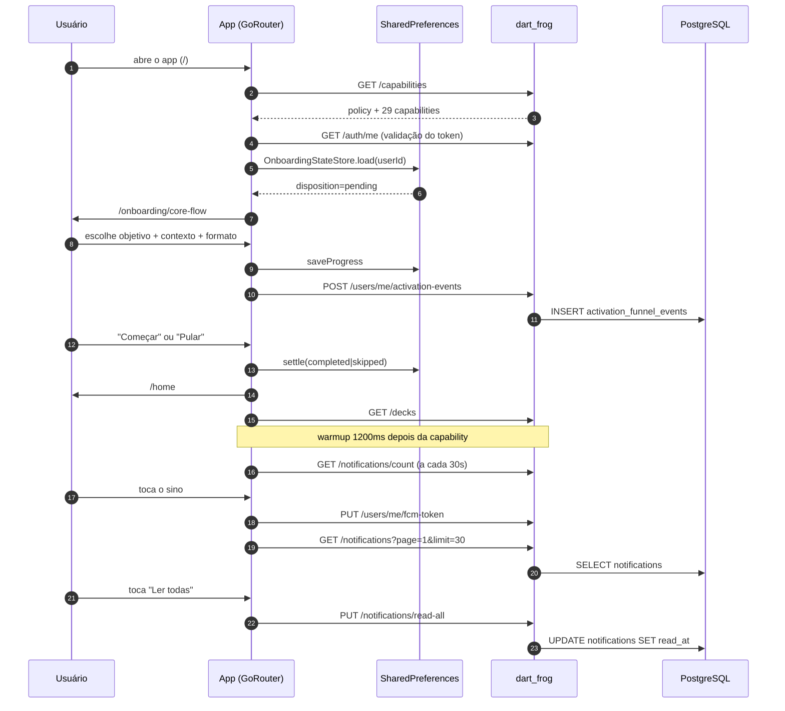

# Fluxo `home_onboarding_notifications` — Home, onboarding, notificações e retenção

Estado: documentação de apoio, não autoritativa · gerado em 2026-09-21 sobre o commit d26f23a16 · verificação estática (nenhum teste foi executado)

---

## 1. Resumo e veredito

| Eixo | Veredito | Base |
| --- | --- | --- |
| **IMPLEMENTADO** | **sim** para Home + onboarding + notificações; **não** para "retenção/growth" como jornada própria | Home `app/lib/features/home/home_screen.dart:25-756`; onboarding `app/lib/features/home/onboarding_core_flow_screen.dart:14-569`; notificações `app/lib/features/notifications/` + `server/routes/notifications/*`. O diretório `app/lib/features/retention/` só contém a tela de pós-jogo (`post_game_notes_screen.dart`), que pertence ao fluxo já declarado `life_counter_post_game`; `app/lib/features/growth/` só é consumido pela tela de Comunidade (`app/lib/features/community/screens/community_screen.dart:398`), não pela Home. |
| **ALCANÇÁVEL HOJE** | **parcial** | `/home` e `/onboarding/core-flow` são alcançáveis (nenhuma regra em `ReleaseCapabilityRouteGuard` as bloqueia — `app/lib/core/config/release_capabilities.dart:350-534`), mas **vazias de função**: com as 29 capabilities `off` em `server/config/release_capabilities.json`, a Home cai em `_BetaPreparationState` (`home_screen.dart:629-641`) e o onboarding fica sem nenhum objetivo selecionável (`onboarding_core_flow_screen.dart:403-417`). `/notifications` **não é alcançável**: o guard redireciona para `/home` quando `social_push` está negada (`release_capabilities.dart:465-468`) e o servidor responde 404 `capability_unavailable` (`server/routes/_middleware.dart:110-144` + `server/lib/release_capability_policy.dart:496-504`). |
| **PROVADO** | **parcial** | Há captura viva P0 `PASS_RUNTIME` para `home_top`, `onboarding_core_flow` e `notifications` em 5 perfis (`docs/qa/ui-live/current/p0-matrix/*.json`, goldens em `app/test/ui/goldens/runtime/*/`), **mas com datas diferentes**: os 3 perfis web são de `2026-09-21T23:15Z`; `android_emulator_manaloom_api34` é de **2026-08-25T20:48Z** e `android_physical_sm_a135m` de **2026-08-24T15:14Z** — a evidência Android é de ~1 mês atrás. `home_quick_actions_scrolled` **só existe nos perfis com largura < 900** (`app_existing_user_visual_audit_test.dart:123`; exclusão explícita em `ui_authenticated_visual_matrix_test.dart:328-329`), isto é, não há esse checkpoint em `web_desktop` nem em `web_wide`. Os estados capturados, segundo a fixture `app/test/ui/fixtures/ui_authenticated_visual_matrix.json`, são `empty/above_fold` só para `onboarding_core_flow` e `notifications` (âncora `notifications-empty`); `home_top` é `success/above_fold` e `home_quick_actions_scrolled` é `success/below_fold`. Tudo sob configuração **isolada** que liga 24 capabilities (`scripts/manaloom_authenticated_visual_qa_isolated.sh:297-338`). O comportamento de ler/marcar/paginar notificações só tem teste de widget; o polling, o push e o ciclo de vida em `main.dart` **não têm teste algum**. |

**Veredito de uma frase:** o fluxo existe e é coerente na estrutura, mas hoje a jornada inteira desemboca em telas informativas; o contrato app↔servidor tem **uma incoerência real** (4 nomes de evento de ativação que o servidor rejeita com 400), **uma lacuna funcional real** (paginação de notificações nunca usada pelo app) e — achado da revisão adversarial — **um portão de rota que nega tudo durante cada refresh de capabilities** (A14), que expulsa o usuário de `/notifications` a cada retomada do app.

---

## 2. Jornada passo a passo



| # | Passo | Tela / widget | Provider / serviço | Método + endpoint | Handler servidor | Serviço / repositório | Tabelas |
| --- | --- | --- | --- | --- | --- | --- | --- |
| 1 | Boot: carrega política de release | `SplashScreen` via `main.dart:440-444` | `ReleaseCapabilitiesProvider.refresh` `release_capabilities.dart:273-304`, disparado em `main.dart:298` | `GET /capabilities` (`release_capabilities.dart:251`) | `server/routes/capabilities/index.dart:8-14` | `ReleaseCapabilityPolicy.toPublicJson` `server/lib/release_capability_policy.dart:198-211` | nenhuma (lê `server/config/release_capabilities.json`) |
| 2 | Boot: valida sessão salva | `SplashScreen` | `AuthProvider._initializeFromDisk` `app/lib/features/auth/providers/auth_provider.dart:82-120` | `GET /auth/me` | `server/routes/auth/me.dart` | `AuthService` | `users` |
| 3 | Boot: decide destino autenticado | `main.dart:414-424` (`resolveAuthenticatedLocation`) | `AuthProvider.defaultAuthenticatedLocation` `auth_provider.dart:48-50` + `_loadOnboardingDecision` `auth_provider.dart:560-578` | — (leitura local) | — | `OnboardingStateStore.load` `app/lib/features/home/services/onboarding_state_store.dart:113-160` | SharedPreferences `manaloom.onboarding.v1.user.<id>` |
| 4 | Abre onboarding | `OnboardingCoreFlowScreen` `main.dart:518-529` → `onboarding_core_flow_screen.dart:400-569` | `_loadState` `onboarding_core_flow_screen.dart:83-139` | — | — | `OnboardingStateStore.load` | SharedPreferences |
| 5 | Evento "iniciou o guia" | idem | `ActivationFunnelService.trackOnce('core_flow_started')` `onboarding_core_flow_screen.dart:118-129` | `POST /users/me/activation-events` (`app/lib/core/services/activation_funnel_service.dart:130-136`) | `server/routes/users/me/activation-events/index.dart:35-90` | insert direto | `activation_funnel_events` |
| 6 | Escolhe objetivo / contexto / modo / formato | `_GoalRail` / `_JourneyComposer` `onboarding_core_flow_screen.dart:760-1216` | `_selectGoal/_selectExperience/_selectBuildMode/_selectFormat` `onboarding_core_flow_screen.dart:141-183` → `_queueProgressWrite:185-238` | `POST /users/me/activation-events` com `onboarding_goal_selected`, `onboarding_experience_selected`, `onboarding_build_mode_selected`, `format_selected` | mesmo handler | `OnboardingStateStore.saveProgress:163-181` | SharedPreferences + `activation_funnel_events` |
| 7 | "Começar" → rota da tarefa | botão em `_JourneyComposer` | `_startTask` `onboarding_core_flow_screen.dart:240-296`; rota em `_taskRoute:298-326` | `POST /users/me/activation-events` (`onboarding_task_started`) | mesmo handler | — | SharedPreferences |
| 8 | "Pular por enquanto" | `onboarding-skip-action` `onboarding_core_flow_screen.dart:541-558` | `_settle(skipped)` `:328-373` → `AuthProvider.markOnboardingSettled` `auth_provider.dart:553-558` | `POST /users/me/activation-events` (`onboarding_skipped`) | mesmo handler | `OnboardingStateStore.settle:184-209` | SharedPreferences |
| 9 | Home monta e lê o plano local | `HomeScreen` `main.dart:508-517` → `home_screen.dart:608-755` | `_loadOnboardingState` `home_screen.dart:65-74` | — | — | `OnboardingStateStore.load` | SharedPreferences |
| 10 | Home busca decks recentes | `_RecentDecksRail` `home_screen.dart:709-746` | `DeckProvider.fetchDecks` `app/lib/features/decks/providers/deck_provider.dart:391-441`, disparado em `home_screen.dart:95-103` | `GET /decks` | `server/routes/decks/index.dart` | `DeckProvider`/`deck_*_support` | `decks`, `deck_cards` |
| 11 | Ação primária do hero | `home-primary-action` `home_screen.dart:1333` | `_runHomePrimaryAction` `home_screen.dart:358-482`; conclusão pendente em `_completePendingHomeIntent:311-356` | `POST /users/me/activation-events` (`onboarding_completed`) | mesmo handler | `OnboardingStateStore.settle` | SharedPreferences |
| 12 | Atalhos rápidos | `_QuickActions` `home_screen.dart:1411-1520` (lista de ações em `:1432-1475`) | `context.go` para `/community` (`:1444`), `/onboarding/core-flow` **só se `ai_generate_rebuild` estiver on**, senão `/decks` (`:1452`), `/decks` (`:1459`), `/collection` (`:1466`) e `/collection?tab=2` (`:1473`, só com `collection_private` + `trades`) | — | — | — | — |
| 13 | Sino e badge na barra | `ShellAppBarActions` `app/lib/core/widgets/shell_app_bar_actions.dart:56-83`, montado na Home em `home_screen.dart:1179-1183` e no onboarding em `onboarding_core_flow_screen.dart:429` | `NotificationProvider.unreadCount` | — (valor vem do polling) | — | — | — |
| 14 | Warmup pós-login: polling + push | `_ManaLoomAppState._scheduleAuthenticatedWarmup` `main.dart:1041-1083` | `NotificationProvider.startPolling` `app/lib/features/notifications/providers/notification_provider.dart:69-75` (30 s) | `GET /notifications/count` (`notification_provider.dart:99`) | `server/routes/notifications/count.dart:8-26` | SQL direto | `notifications` |
| 15 | Registro do token FCM | `_initializeCapabilityAllowedPush` `main.dart:1085-1123` | `PushNotificationService.registerIfAuthorized` `app/lib/core/services/push_notification_service.dart:142-159` → `_sendTokenToServer:255-262` | `PUT /users/me/fcm-token` | `server/routes/users/me/fcm-token/index.dart:22-68` | UPDATE direto | `users.fcm_token` (`server/database_setup.sql:23`) |
| 16 | Abrir `/notifications` | `NotificationPermissionBoundary(child: NotificationScreen())` `main.dart:866-871` | `requestPermissionAndRegister` `push_notification_service.dart:163-194` (post-frame, `notification_permission_boundary.dart:26-36`) | `PUT /users/me/fcm-token` | idem | idem | `users.fcm_token` |
| 17 | Listar notificações | `NotificationScreen` `app/lib/features/notifications/screens/notification_screen.dart:60-181`, timer de 25 s em `:23-34` | `NotificationProvider.fetchNotifications` `notification_provider.dart:124-176` | `GET /notifications?page=1&limit=30[&unread_only=true]` | `server/routes/notifications/index.dart:8-70` | SQL direto | `notifications` |
| 18 | Marcar uma como lida | `_NotificationTile.onTap` `notification_screen.dart:166-172` | `NotificationProvider.markAsRead` `notification_provider.dart:198-233` | `PUT /notifications/:id/read` | `server/routes/notifications/[id]/read.dart:8-33` | SQL direto | `notifications` |
| 19 | Marcar todas como lidas | `notifications-read-all-button` `notification_screen.dart:86-99` | `markAllAsRead` `notification_provider.dart:236-301` | `PUT /notifications/read-all` | `server/routes/notifications/read-all.dart:8-29` | SQL direto | `notifications` |
| 20 | Navegar para o contexto | `_navigateToContext` `notification_screen.dart:184-205` | `context.push('/community/user/:id' \| '/trades/:id' \| '/messages/:id')` | — | — | — | — |
| 21 | Push em foreground / toque | `PushNotificationService.onForegroundMessage/onMessageTap` `main.dart:913-930` | `RealtimeNotificationCoordinator.handleForegroundData/handleMessageTapData` `app/lib/core/services/realtime_notification_coordinator.dart:59-99` | `GET /notifications/count` + `GET /notifications` | rotas acima | `NotificationProvider.handleRealtimeEvent:179-195` | `notifications` |
| 22 | Origem da notificação (escrita) | — | — | side-effect de `POST /trades`, `PUT /trades/:id/respond`, `PUT /trades/:id/status`, `POST /trades/:id/messages`, `POST /conversations/:id/messages`, `POST /users/:id/follow` | `server/routes/trades/index.dart:616`, `server/routes/trades/[id]/respond.dart:160`, `server/routes/trades/[id]/status.dart:274`, `server/routes/trades/[id]/messages.dart:340`, `server/routes/conversations/[id]/messages.dart:351`, `server/routes/users/[id]/follow/index.dart:96` | `NotificationService.createFromActorDeferred` `server/lib/notification_service.dart:70-150` + `PushNotificationService.sendToUser` `server/lib/push_notification_service.dart:195-292` | `notifications`, `users.fcm_token` |
| 23 | Ciclo de vida (pausar/retomar) | `didChangeAppLifecycleState` `main.dart:1133-1155` | para/retoma polling e refaz warmup | `GET /capabilities` no `resumed` | — | — | — |
| 24 | Logout | `AuthProvider` → `_onAuthChanged` `main.dart:986-1006` | `stopPolling`, `_disablePushForSession:1125-1131`, `_clearAllProvidersState:1159-1170` | `DELETE /users/me/fcm-token` | `server/routes/users/me/fcm-token/index.dart:71-92` | UPDATE | `users.fcm_token` |

---

## 3. Capabilities e portões

### Portão do app (`ReleaseCapabilityRouteGuard`, `app/lib/core/config/release_capabilities.dart:350-534`)

| Rota | Regra no guard | Negado → o usuário vê |
| --- | --- | --- |
| `/home` | **nenhuma regra** | sempre entra. Se `decks_private`, `collection_private` e `life_counter_local` estiverem off, a própria tela troca todo o corpo por `_BetaPreparationState` — "Beta em preparação / Os recursos desta versão ainda não foram liberados para uso." (`home_screen.dart:629-641`, `:758-796`) |
| `/onboarding/core-flow` | **nenhuma regra** | sempre entra. `availableGoals` fica vazio (`onboarding_core_flow_screen.dart:403-405`), `canStart=false` (`:416-417`), e só resta "Pular por enquanto" (`:541-558`) |
| `/notifications` | `social_push` off → `'/home'` (`release_capabilities.dart:465-468`) | redirect silencioso para a Home; nenhuma mensagem |
| destinos das notificações (`/trades/:id`, `/messages/:id`, `/community/user/:id`) | `trades` → `/collection?tab=0` (`:485-488`); `direct_messages` → `/home` (`:460-463`); conjunto `profiles_public+follows+gallery_public+binder_public+direct_messages+trades` → `/home` (`:419-429`) | redirect silencioso |

O sino (`ShellAppBarActions`) só é renderizado quando `social_push` está `allowed` (`shell_app_bar_actions.dart:18-23`), então na política vigente **não existe entrada de UI para `/notifications`** — a rota é acessível apenas por URL direta no web, e mesmo assim redireciona.

`MainScaffold` (`app/lib/core/widgets/main_scaffold.dart:38-67`) **não tem destino de notificações** — a única forma de chegar lá é o ícone da AppBar.

### Portão do servidor (`server/routes/_middleware.dart:105-144`)

| Requisição | Capability exigida | Origem |
| --- | --- | --- |
| `GET /notifications`, `GET /notifications/count`, `PUT /notifications/:id/read`, `PUT /notifications/read-all` | `social_push` | `server/lib/release_capability_policy.dart:496-503` |
| `PUT /users/me/fcm-token` | `social_push` | `release_capability_policy.dart:498-503` |
| `DELETE /users/me/fcm-token` | **nenhuma** (control-plane) | `release_capability_policy.dart:499-501` e `:617` |
| `POST /users/me/activation-events`, `GET /users/me/activation-events` | **nenhuma** (control-plane) | `release_capability_policy.dart:615-616` |
| `GET /capabilities` | **nenhuma** (control-plane, e `isDatabaseIndependentHealthPath`) | `release_capability_policy.dart:592`, `_middleware.dart:248-255` |
| `GET /decks` (consumido pela Home) | `decks_private` | `release_capability_policy.dart:537-542` |

Negado → **404** com corpo `{error: 'capability_unavailable', capability, release_capability, policy_version, policy_digest_sha256, offer_mode}` (`_middleware.dart:128-143`). Política inválida → **503** `capability_policy_invalid` (`release_capability_policy.dart:179-186`).

### Os nomes batem dos dois lados?

Sim. `ReleaseCapability.socialPush.wireName == 'social_push'` (`release_capabilities.dart:25`) é exatamente a chave em `releaseCapabilityKeys` (`release_capability_policy.dart:33`) e em `server/config/release_capabilities.json`. O app valida o envelope com chaves **exatas** (`release_capabilities.dart:114-134, 193-208`) e o servidor emite exatamente essas 10 chaves de topo + 29 capabilities (`release_capability_policy.dart:198-211`); qualquer divergência derruba o snapshot inteiro para `denied()`.

### Alcançável hoje?

**Não, para notificações.** `server/config/release_capabilities.json` (`policy_version: brewtact_free_beta_2026-08-13`) tem as 29 capabilities com `allowed=false` / `release_capability="off"` — verificado lendo o arquivo. **Sim, para Home e onboarding**, mas em estado degradado, como descrito acima.

---

## 4. Contrato app↔servidor (por endpoint)

| Método + caminho | Chamador no app | Handler | Corpo enviado | Resposta do handler | Campos lidos pelo app | Divergência |
| --- | --- | --- | --- | --- | --- | --- |
| `GET /capabilities` | `release_capabilities.dart:281` | `server/routes/capabilities/index.dart:8-14` | — | `toPublicJson()` (10 chaves + 29 entradas) `release_capability_policy.dart:198-211` | todas, com validação de chaves exatas (`release_capabilities.dart:167-208`) | **nenhuma** |
| `GET /notifications?page&limit&unread_only` | `notification_provider.dart:138-140` | `server/routes/notifications/index.dart:8-70` | — | `{data[], page, limit, total}` (`:65-70`) | **só `data`** (`notification_provider.dart:147`) | **`page`, `limit` e `total` são ignorados**; o app nunca pede `page=2` nem `unread_only=true` em produção (o parâmetro existe em `notification_provider.dart:127` mas nenhum chamador passa `unreadOnly: true`). Com >30 notificações o usuário não alcança as antigas. |
| `GET /notifications/count` | `notification_provider.dart:99` | `server/routes/notifications/count.dart:8-26` | — | `{unread: int}` | `unread` (`:105`) | **nenhuma** |
| `PUT /notifications/:id/read` | `notification_provider.dart:201` | `server/routes/notifications/[id]/read.dart:8-33` | `{}` (corpo vazio) | 200 `{ok:true}` ou **404** `{error}` quando 0 linhas afetadas (`:26-31`) | apenas `statusCode` (`:203-205`) | **semântica frouxa**: o handler devolve 404 tanto para "não existe" quanto para "já estava lida" (`WHERE ... AND read_at IS NULL`, `:21`). O app não distingue e simplesmente não atualiza a UI. |
| `PUT /notifications/read-all` | `notification_provider.dart:261` | `server/routes/notifications/read-all.dart:8-29` | `{}` | `{marked_read: int, unread: 0}` | `unread` (`:283`); ignora `marked_read` | `marked_read` ignorado (inofensivo) |
| `PUT /users/me/fcm-token` | `push_notification_service.dart:257` | `server/routes/users/me/fcm-token/index.dart:22-68` | `{token}` | `{ok:true}` / 400 | **nada** — o app não inspeciona a resposta (`:257-258`) | falha silenciosa: token rejeitado (400 "token muito longo", `:44-49`) não gera nenhum estado no app |
| `DELETE /users/me/fcm-token` | `push_notification_service.dart:205` | `index.dart:71-92` | — | `{ok:true}` | `statusCode` para log (`:207-217`) | **nenhuma** |
| `POST /users/me/activation-events` | `activation_funnel_service.dart:130-136` | `server/routes/users/me/activation-events/index.dart:35-90` | `{event_name, format?, deck_id?, source, metadata}` | 201 `{ok:true}` ou **400 `event_name inválido`** (`:50-52`) | só faixa 2xx (`:137`) | **INCOERÊNCIA REAL** — ver §8 A1: 4 de 8 nomes emitidos pelo onboarding não estão em `_allowedEvents` (`:10-22`) |
| `GET /decks` | `deck_provider.dart:399` | `server/routes/decks/index.dart` | — | lista de decks | `decks`, `statusCode` (`deck_provider.dart:405-418`) | fora do escopo deste fluxo |

**Endpoint chamado que não existe:** nenhum neste fluxo.
**Endpoint que ninguém chama:** `GET /users/me/activation-events` (`activation-events/index.dart:92-124`) — nenhum consumidor no app (`grep` em `app/lib` só encontra o `POST`). É usado apenas por relatórios de servidor.

---

## 5. Dados (tabelas e migrações)

| Tabela | DDL | Papel no fluxo | Observação |
| --- | --- | --- | --- |
| `notifications` | `server/database_setup.sql:2282-2295` | fonte de verdade da lista e do badge | `type` tem `CHECK` com exatamente 9 valores: `new_follower`, `trade_offer_received`, `trade_accepted`, `trade_declined`, `trade_shipped`, `trade_delivered`, `trade_completed`, `trade_message`, `direct_message`. Bate 1:1 com os `case` da tela (`notification_screen.dart:188-204`, `:314-336`) e com `PushNotificationPayload` (`realtime_notification_coordinator.dart:30-40`). |
| índices de `notifications` | `server/database_setup.sql:2296-2299` e `server/database_indexes.sql:179-184` | paginação e contagem | Existem **quatro** índices sobrepostos para o mesmo padrão (`idx_notifications_user`, `idx_notifications_user_created`, `idx_notifications_unread`, `idx_notifications_user_unread_created`). Redundância, não bug. |
| `activation_funnel_events` | `server/database_setup.sql:1585-1599` | telemetria de onboarding | `event_name TEXT` **sem CHECK** — a validação é só no handler (`activation-events/index.dart:50-52`). |
| `users.fcm_token` | `server/database_setup.sql:23` e `:62` (`ALTER TABLE ... ADD COLUMN IF NOT EXISTS`) | destino do push | Limpo no logout e quando o FCM devolve `invalidRegistration` (`server/lib/push_notification_service.dart:279-292`). O `PUT` grava sem checar `affectedRows` (`fcm-token/index.dart:52-61`), devolvendo `{ok:true}` mesmo se nenhuma linha casar — assimetria deliberada? não documentada — em relação a `/notifications/:id/read`, que devolve 404 nesse caso. |
| SharedPreferences `manaloom.onboarding.v1.user.<userId>` | `onboarding_state_store.dart:99`, `:253` | estado do onboarding | **Não existe no servidor.** Troca de dispositivo, limpeza de dados ou navegação anônima ⇒ o onboarding reaparece. Valor malformado ou de versão futura volta a `pending` por desenho (`:122-130`). |
| SharedPreferences `manaloom.analytics.receipt.v1.<key>` | `activation_funnel_service.dart:27`, `:92` | dedupe de evento de ativação | Só grava o recibo quando o POST responde 2xx (`:110-117`). |

Não há arquivo de migração incremental para `notifications` — o repositório usa `server/database_setup.sql` idempotente. Isso significa que o `CHECK` de `type` **não é alterável** por um novo tipo sem um `ALTER TABLE` manual que não existe no repo.

---

## 6. Estados e erros

| Estado | Tratado? | Onde |
| --- | --- | --- |
| Carregando (notificações) | **sim**, com live-region | `AppStatePanel.loading` em `notification_screen.dart:117-124` |
| Carregando (decks na Home) | **parcial** | `_DecksLoadingState` `home_screen.dart:2159-2190` é um `CircularProgressIndicator` cru, **sem** `AppStatePanel.loading` e **sem** `Semantics(liveRegion:)`; o âncora `home-decks-loading-state` não está na lista obrigatória de `app/test/ui/ui_state_matrix_test.dart:126-145` |
| Carregando (onboarding) | **sim** | `LinearProgressIndicator` com `Semantics(liveRegion: true)` `onboarding_core_flow_screen.dart:459-468` |
| Vazio (notificações) | **sim** | `notifications-empty` `notification_screen.dart:139-148` |
| Vazio (decks) | **sim** | `_EmptyDecksState` `home_screen.dart:745`, `:1915-1990` |
| Erro de rede (notificações) | **sim**, com retry | `notifications-error` `notification_screen.dart:126-137` |
| Erro de rede (decks na Home) | **sim**, com cache visível | `_CachedDecksStatus` / `_DecksErrorState` `home_screen.dart:721-745` |
| 401 / sessão expirada | **sim, global** | `ApiClient.isSessionInvalidatingUnauthorized` `app/lib/core/api/api_client.dart:96-117` casa com os corpos do servidor (`server/lib/auth_middleware.dart:29-31`, `:47-49`, ambos contêm "Token") → `AuthProvider.expireSession` (`main.dart:282`). Na Home há estado dedicado `_DecksSessionExpiredState` (`home_screen.dart:719-720`). **Na tela de notificações não há**: 401 cai no texto genérico "Verifique sua conexão" (`notification_screen.dart:132`) até o router reagir. |
| 403/404 de capability | **parcialmente** | Redirect do guard cobre a navegação; mas se a capability cair **durante** a sessão, a resposta 404 do middleware vira o mesmo texto genérico de rede (`notification_provider.dart:154`) — nenhuma menção a "recurso desligado". `fetchUnreadCount` simplesmente ignora qualquer status ≠ 200 (`notification_provider.dart:104`), mantendo o badge antigo. |
| Validação (onboarding) | **sim** | Formato inválido lança `OnboardingPersistenceException` (`onboarding_state_store.dart:243-251`); objetivo não permitido bloqueia com mensagem "Este caminho ainda não está disponível nesta versão da beta." (`onboarding_core_flow_screen.dart:245-251`) |
| Storage local indisponível | **sim, explícito** | `_write` lança quando `setString` devolve `false` (`onboarding_state_store.dart:226-230`); a falha vira `_persistenceError` com retry (`onboarding_core_flow_screen.dart:223-236`, `:469-475`) e `AuthProvider` roteia para `/onboarding/core-flow?storage=unavailable` (`auth_provider.dart:48-50`, `:566-570`). A Home, ao contrário, **engole** a falha em silêncio (`home_screen.dart:70-73`) e apenas perde a personalização. |
| Offline / retry | **parcial** | `GET` tem retry transitório (`api_client.dart:252-257`); `PUT` **não** (`api_client.dart:434-436`). Marcar como lida offline falha silenciosamente. |
| Concorrência — duplo toque em "Ler todas" | **sim** | Operação única compartilhada em `markAllAsRead` (`notification_provider.dart:236-248`) + flag `_isMarkingAll` na tela (`notification_screen.dart:42-47`) |
| Concorrência — poll x mutação | **sim** | `fetchUnreadCount` desiste enquanto há `markAllAsRead` em voo (`notification_provider.dart:94`) e `_unreadFetchGeneration++` invalida contagens anteriores (`:260`) |
| Concorrência — troca de conta | **sim** | `_stateGeneration` no provider (`notification_provider.dart:305`) e `_authenticatedAccountId` em `main.dart:957-977` |
| Concorrência — duplo toque no onboarding | **sim** | `_working` bloqueia `_startTask`/`_settle` (`onboarding_core_flow_screen.dart:243`, `:329`) e a fila `_selectionWrites` serializa gravações (`:193`) |
| **Não tratado** — dois timers de notificação | a tela cria um `Timer.periodic(25s)` próprio (`notification_screen.dart:28-32`) que **não é cancelado** quando o app vai para background; `didChangeAppLifecycleState` só para o polling do provider (`main.dart:1151-1152`) |
| **Não tratado** — permissão de push negada | `requestPermissionAndRegister` só faz `debugPrint('[Push] Permissão negada pelo usuário')` (`push_notification_service.dart:184-187`); a tela de notificações **não mostra nada** ao usuário que negou. O `NotificationPermissionBoundary` repete o pedido a cada visita (`notification_permission_boundary.dart:29-35`). |

---

## 7. Testes por passo

| Passo | Teste | O que de fato afirma |
| --- | --- | --- |
| 1 (capabilities) | `app/test/core/config/release_capabilities_test.dart` | Parse estrito do envelope e `redirectFor` para 29 rotas negadas, incluindo `'/notifications': '/home'` (`:378`). Exercita comportamento real. |
| 3, 8 (decisão de destino) | `app/test/features/auth/providers/auth_provider_onboarding_test.dart:90-166` | `defaultAuthenticatedLocation` com onboarding pendente/concluído e falha de storage; `markOnboardingSettled`. Comportamento real. |
| 4, 6, 7, 8 (onboarding) | `app/test/features/home/onboarding_core_flow_screen_test.dart:194-586` (8 casos) | Retoma formato a 320x568/200%; **falha de escrita bloqueia navegação e mantém pendente** (`:254`); import/manual/play abrem a rota exata; falha de leitura expõe retry sem inferir conclusão; ordem de foco por teclado. Cobertura boa e comportamental. |
| 4 (persistência) | `app/test/features/home/services/onboarding_state_store_test.dart` (8 casos) | Pending por omissão, isolamento por usuário, versão futura/malformada → pending, usuário inválido rejeitado. Comportamental. |
| 5, 6, 7 (eventos) | `app/test/core/services/activation_funnel_service_test.dart` (3 casos) | Não chama produção sem token; dedupe por recibo. **Não verifica nome nenhum de evento contra o servidor.** |
| 5, 6, 7 (contrato de eventos) | `server/test/activation_events_contract_test.dart:7-35` | **Só `contains` de string** em três arquivos (rota, `deck_provider.dart`, `onboarding_core_flow_screen.dart`). Confere 6 literais no fonte da rota — `optimize_preview_received` (`:18`), `deck_optimized` (`:19`), `deck_generated` (`:22`), `deck_rebuild_created` (`:25`), `onboarding_completed` (`:33`), `onboarding_skipped` (`:34`) — e 5 no app. **Não confere** `onboarding_goal_selected`, `onboarding_experience_selected`, `onboarding_build_mode_selected`, `onboarding_task_started`, `core_flow_started`, `format_selected`. É exatamente o buraco que deixa passar o achado A1. |
| 9-12 (Home) | `app/test/features/home/home_screen_test.dart` (21 casos) | Estados de deck (vazio/carregando/erro/cache/401), intents pendentes e concluídos, entrada de jogo, rotas canônicas dos atalhos, baselines visuais SM A135M/desktop/wide, 200% de texto. Comportamental e forte. |
| 13 (sino) | `app/test/ui/ui_keyboard_focus_matrix_test.dart:419` | Monta `ShellAppBarActions` num `Scaffold` só para checar ordem de foco. **Não** testa a regra `social_push` de `shell_app_bar_actions.dart:18-23`. |
| 14, 15, 23, 24 (warmup, push, ciclo de vida, logout) | **nenhum** | `_scheduleAuthenticatedWarmup`, `_initializeCapabilityAllowedPush`, `_disablePushForSession`, `didChangeAppLifecycleState` e `_onReleaseCapabilitiesChanged` vivem em `_ManaLoomAppState` (`main.dart:1009-1155`) e não são exercitados por teste algum. |
| 16 (permissão) | `app/test/features/notifications/widgets/notification_permission_boundary_test.dart:6-27` | Afirma que a permissão é pedida **uma vez** após abrir a superfície. Comportamental, mas escopo minúsculo. |
| 17, 18, 19 (provider) | `app/test/features/notifications/models/notification_models_test.dart:124-378` | `fromJson` de todos os 9 tipos, defaults, `markAsRead`/`markAllAsRead` atualizando badge, dedupe de `markAllAsRead`, erro de backend. Comportamental. **Não cobre paginação** (`page`/`total`). |
| 17, 19 (tela) | `app/test/features/notifications/screens/notification_screen_test.dart:50-128` | Erro de fetch mostra `notifications-error` e não `notifications-empty`; retry refaz o GET; largura ≤390 e ≤840; falha de "Ler todas" mostra snackbar e mantém não-lida. Comportamental. |
| 20 (navegação por tipo) | **nenhum teste de widget** — só a captura visual do estado vazio | `_navigateToContext` (`notification_screen.dart:184-205`) não é exercitado. |
| 21 (push realtime) | `app/test/core/services/realtime_notification_coordinator_test.dart:46-166` (6 casos) | Parse do payload mínimo, mapeamento tipo→rota, payload sem tipo ignorado. Comportamental, mas **não** cobre `_canHandleRealtimeData` de `main.dart:932-951` (o filtro de capability). |
| 22 (escrita da notificação) | `server/test/push_notification_service_test.dart`, `server/test/social_runtime_schema_contract_test.dart` | Envio FCM e schema. Os handlers que criam notificação são testados sob o fluxo `social_trade`, não aqui. |
| rotas do servidor | `server/test/error_contract_test.dart:1175-1287` | 401 sem token e 405 em método errado para `/notifications`, `/notifications/count`, `/notifications/read-all` **e também `/notifications/:id/read`** (401 em `:1249`, 405 em `:1263`, 404 com erro em `:1276`). **Correção do mecanismo:** `skipIntegration` (`:11-14`) só fica não-nulo quando `RUN_INTEGRATION_TESTS=0`; o que realmente mantém o arquivo fora da rodada padrão é `server/dart_test.yaml` — ele não está no `paths:` de topo, é marcado `@Tags(['live','live_backend','live_db_write'])` (`error_contract_test.dart:1`) e só entra no preset `live` (`dart_test.yaml:75`). |
| política do servidor | `server/test/release_capability_policy_test.dart:217` | Mapeia `'POST /users/me/fcm-token' → social_push`. **Mas a rota real não aceita POST** (`fcm-token/index.dart:17-19` só trata PUT e DELETE). O teste prova a função de classificação, não a rota. Também **não testa** `GET /notifications` nem `PUT /notifications/read-all`. |
| superfície de capability | `app/test/core/config/release_capability_surface_contract_test.dart:10-86` | `contains` de tokens em arquivos. Exige `'ReleaseCapability.socialPush'` em `main.dart`. String, não comportamento. |
| estados acessíveis | `app/test/ui/ui_state_matrix_test.dart:126-170` | Exige `AppStatePanel.loading` perto de 17 âncoras, incluindo `notifications-loading`. **`home-decks-loading-state` não está na lista.** String/vizinhança, não comportamento. |
| evidência viva | **produtor**: `app/integration_test/app_existing_user_visual_audit_test.dart:1007-1012` (aceita `notifications-empty` **ou** `notifications-list`); **portão**: `app/test/ui/ui_authenticated_visual_matrix_test.dart` sobre a fixture `app/test/ui/fixtures/ui_authenticated_visual_matrix.json`; **recibo**: `docs/qa/ui-live/current/p0-matrix/*.json` | Captura real de `home_top`, `onboarding_core_flow`, `notifications` nos 5 perfis; `home_quick_actions_scrolled` só em `web_mobile`, `android_emulator` e `android_physical` (largura < 900). `status: PASS_RUNTIME`. Datas: web `2026-09-21T23:15Z`, android_emulator `2026-08-25T20:48Z`, android_physical `2026-08-24T15:14Z`. Estados declarados na fixture: `notifications` = `empty/above_fold`, âncora `notifications-empty`; `onboarding_core_flow` = `empty/above_fold`; `home_top` = `success/above_fold`; `home_quick_actions_scrolled` = `success/below_fold`. O arquivo `ui_authenticated_visual_matrix_test.dart` **não contém a string `notifications`** — ele valida a fixture, não captura nada. |
| integração viva | `app/integration_test/onboarding_first_run_runtime_test.dart` | Login real → retoma formato após restart → "Pular" → Home → relogin sem reabrir onboarding. Exige `MANALOOM_ONBOARDING_EMAIL/PASSWORD` e servidor vivo. |
| integração viva | `app/integration_test/realtime_notifications_runtime_test.dart:207-348` (único `testWidgets`) | Registra 2 usuários, cria conversa, dispara `handleForegroundData`, verifica badge e navegação para chat e trade. **Monta um router próprio** em `_runtimeApp` (`:349-404`, `GoRouter(` em `:357`) que **não passa pelo `ReleaseCapabilityRouteGuard`** e cujo `MultiProvider` (`:386-393`) **nem sequer registra `ReleaseCapabilitiesProvider`**; precisa de `account_registration`, `direct_messages`, `trades` ligadas — impossível com a política commitada. |

**Passos sem teste nenhum:** 14, 15, 20, 23, 24 (5 passos de 24).

---

## 8. Achados

| # | Tipo | Severidade | Arquivo:linha | Descrição | Como provar |
| --- | --- | --- | --- | --- | --- |
| **A1** | incoerência-app-servidor | **alta** | `app/lib/features/home/onboarding_core_flow_screen.dart:146,155,170,284` vs `server/routes/users/me/activation-events/index.dart:10-22` | O app emite `onboarding_goal_selected`, `onboarding_experience_selected`, `onboarding_build_mode_selected` e `onboarding_task_started`. O allowlist do servidor tem só `core_flow_started`, `format_selected`, `base_choice_generate`, `base_choice_import`, `deck_created`, `deck_generated`, `deck_optimized`, `optimize_preview_received`, `deck_rebuild_created`, `onboarding_completed`, `onboarding_skipped`. Os 4 viram **400 `event_name inválido`**. Pior: `_send` devolve `false` (`activation_funnel_service.dart:137`), então `_trackOnce` **não grava o recibo** (`:110`) e o app reenvia o mesmo evento condenado em toda execução futura. O funil de ativação perde os 4 eventos intermediários do onboarding — exatamente os que medem abandono no meio do guia. | Teste de servidor: `POST /users/me/activation-events` com `{"event_name":"onboarding_goal_selected", ...}` e esperar 201. Hoje falha com 400. Alternativa estática: estender `server/test/activation_events_contract_test.dart` para extrair **todos** os literais passados como `eventName:`/2º argumento de `trackOnce` em `app/lib/**` e exigir que cada um esteja em `_allowedEvents`. |
| **A2** | passo-sem-teste | **alta** | `app/lib/main.dart:1041-1083`, `:1085-1123`, `:1125-1131`, `:1133-1155` | Todo o motor de retenção — quando o polling de notificações começa e para, quando o push é inicializado, quando o token FCM é removido, o que acontece no `resumed`/`paused` — está em `_ManaLoomAppState` e não tem um único teste. É código com 4 flags de estado (`_hadAuthenticatedSession`, `_authenticatedAccountId`, `_pushWasEnabledForSession`, `_authenticatedWarmupTimer`) e um timer de 1200 ms. | Extrair a lógica para uma classe testável (ex.: `AuthenticatedWarmupController`) e escrever testes com `fakeAsync`: (a) capability `social_push` on ⇒ `startPolling` após 1200 ms; (b) capability desligada no meio ⇒ `stopPolling` + `unregister`; (c) `paused` ⇒ para tudo; (d) troca de conta ⇒ limpa estado antes de religar. |
| **A3** | bug-provável | **média** | `app/lib/main.dart:1125-1131` + `:1015-1021` | `_disablePushForSession()` só chama `PushNotificationService().unregister()` quando `_pushWasEnabledForSession == true`, e essa flag só é ligada em `_initializeCapabilityAllowedPush` (`:1091`) **dentro do processo atual**. Cenário: usuário registra o token numa execução com `social_push` on; a capability é desligada no servidor; na execução seguinte `_pushWasEnabledForSession` nasce `false`, então o `DELETE /users/me/fcm-token` **nunca acontece**. O token fica em `users.fcm_token` e o servidor continua entregando push (o envio em `server/lib/push_notification_service.dart:195-292` **não consulta `social_push`**) para um app que redireciona `/notifications` para `/home`. Hipótese: não consegui observar runtime. | Teste de integração com política isolada: ligar `social_push`, logar, confirmar `users.fcm_token` preenchido; desligar `social_push`; reiniciar o app; verificar se `fcm_token` continua preenchido. Ou teste unitário sobre o controller extraído em A2. |
| **A4** | ux-funcional | **média** | `app/lib/features/notifications/providers/notification_provider.dart:124-176` vs `server/routes/notifications/index.dart:17-19,65-70` | O servidor pagina (`page`, `limit` até 50, `total`) mas o app fixa `page=1, limit=30` e descarta `page`/`limit`/`total`. Não há "carregar mais", nem `RefreshIndicator` que avance página (`notification_screen.dart:150-152` refaz sempre a página 1). A partir da 31ª notificação o histórico é **inalcançável** — esta é a parte sólida do achado. *Ressalva da revisão adversarial:* a comparação "badge vs. lista" que a versão anterior deste documento fazia é fraca, porque o badge conta **não lidas** (`/notifications/count`) e a lista mostra **todas** (lidas + não lidas), então os dois números nunca foram equivalentes; além disso o rótulo do badge satura em `99+` (`shell_app_bar_actions.dart:63-66`). | Teste de widget: semear 45 notificações via `ApiClient` falso paginado, abrir a tela, rolar até o fim e esperar que a 31ª apareça. Hoje falha. |
| **A5** | estado-nao-tratado | **média** | `app/lib/core/services/push_notification_service.dart:184-187` + `app/lib/features/notifications/widgets/notification_permission_boundary.dart:26-36` | Quando o usuário nega a permissão do SO, o app só faz `debugPrint`. A tela de notificações fica idêntica à de quem autorizou — nenhum aviso de "você não vai receber alertas" e nenhum caminho para as configurações do sistema. E o `NotificationPermissionBoundary` refaz o pedido em **toda** montagem da rota. | Teste de widget com `requestPermission` injetado que simula negação e espera um aviso renderizado. Hoje não existe aviso nenhum para afirmar. |
| **A6** | incoerencia-app-servidor | **média** | `server/routes/notifications/[id]/read.dart:21,26-31` | `UPDATE ... WHERE id=@id AND user_id=@userId AND read_at IS NULL` + 404 quando `affectedRows == 0` mistura três casos distintos: id inexistente, notificação de outro usuário e notificação já lida. O app trata os três igual (`notification_provider.dart:203-205`: retorna sem mudar nada). Numa corrida entre o toque e o polling de 25 s, o usuário pode tocar numa notificação já marcada e a UI não reagir. | Teste de servidor: marcar a mesma notificação duas vezes e esperar 200 idempotente na segunda (ou 404 com código de erro distinto de "não encontrada"). Hoje as duas situações devolvem o mesmo corpo. |
| **A7** | capability | **média** | `server/lib/release_capability_policy.dart:496-504` vs `server/lib/notification_service.dart:16-68` | `social_push` guarda apenas a **leitura** (`/notifications*`) e o **registro** do token. A **escrita** da notificação e o **envio FCM** acontecem dentro das rotas de `trades`/`direct_messages`/`follows` sem consultar `social_push`. Com `trades=on` e `social_push=off` o banco acumula linhas em `notifications` que o dono nunca conseguirá ler (`/notifications` → 404 e redirect) e o push sai se houver token antigo. Hipótese quanto ao impacto real — depende de qual combinação de flags for usada num beta. | Teste de política: com um `ReleaseCapabilityPolicy` de teste (`trades=on, social_push=off`), chamar `POST /trades` e verificar se uma linha entra em `notifications`. Depois decidir: ou `NotificationService.create` consulta `social_push`, ou o contrato passa a declarar que `trades ⇒ social_push`. |
| **A8** | ux-funcional | **baixa** | `app/lib/features/notifications/screens/notification_screen.dart:184-205` | `_navigateToContext` faz `context.push` para `/trades/:id`, `/messages/:id` e `/community/user/:id` sem consultar as capabilities. Se `trades`/`direct_messages`/`follows` estiverem off, o `ReleaseCapabilityRouteGuard` (`release_capabilities.dart:419-488`) sequestra a navegação para `/collection?tab=0` ou `/home` **sem explicação**: o usuário toca num aviso de trade e aparece na Coleção. | Teste de widget com `GoRouter` real + `ReleaseCapabilitiesProvider.seeded({socialPush})`: tocar num tile `trade_offer_received` e afirmar que o usuário recebe uma mensagem, não um redirect mudo. |
| **A9** | estado-nao-tratado | **baixa** | `app/lib/features/notifications/providers/notification_provider.dart:104` | `fetchUnreadCount` ignora silenciosamente qualquer status ≠ 200. Um 404 de capability ou um 500 deixam o badge congelado no último valor conhecido, sem nenhum sinal. | Teste unitário: `ApiClient` falso devolvendo 200 com `unread: 5`, depois 404; afirmar que o provider expõe algum estado de indisponibilidade em vez de manter `5`. |
| **A10** | ux-funcional | **baixa** | `app/lib/features/notifications/screens/notification_screen.dart:23-34` | Timer de 25 s criado na tela, em paralelo ao timer de 30 s do provider (`notification_provider.dart:72`), e cancelado só no `dispose` (`:37-40`). Em background o app continua chamando `GET /notifications` enquanto a tela estiver montada, embora `didChangeAppLifecycleState` (`main.dart:1151-1152`) pare o polling do provider. | Teste de widget com `fakeAsync`: montar a tela, simular `AppLifecycleState.paused`, avançar 60 s e contar as chamadas. Hoje continuam. |
| **A11** | ux-funcional / acessibilidade | **baixa** | `app/lib/features/home/home_screen.dart:2159-2190` | `_DecksLoadingState` é um `CircularProgressIndicator` sem `AppStatePanel.loading` e sem `Semantics(liveRegion:)` — o leitor de tela não anuncia o carregamento da seção principal da Home. O âncora `home-decks-loading-state` não consta da lista obrigatória de `app/test/ui/ui_state_matrix_test.dart:127-144`, então o gate não pega. | Adicionar `home-decks-loading-state` a `requiredAnchors` em `ui_state_matrix_test.dart:127` e rodar o teste: ele passa a falhar até a Home usar `AppStatePanel.loading`. |
| **A12** | doc-defasada | **média** | `docs/project_logic_contracts.json` (chave `flows`) | Os 8 fluxos declarados são `auth_session`, `card_collection`, `deck_lifecycle`, `deck_ai`, `battle_replay`, `life_counter_post_game`, `social_trade`, `release_operations`. **Nenhum** cobre `/home`, `/onboarding/core-flow`, `/notifications`, `activation_funnel_events`, `users.fcm_token` nem os 5 arquivos de rota de notificação. `docs/MAPA_OPERACIONAL_DO_PROJETO.md:2` já registra "99 de 120 arquivos de rota do servidor não nomeados em nenhum fluxo declarado" — este fluxo é parte dessa lacuna. Ver §9 para o que precisa entrar. | Não é bug de código: é entrada de contrato a escrever. Provável via gate de rastreabilidade que exija que toda rota do servidor pertença a pelo menos um `flows[].implementation`. |
| **A13** | doc-defasada | **baixa** | `server/test/release_capability_policy_test.dart:217` | O teste afirma `'POST /users/me/fcm-token' → social_push`, mas o handler real só aceita `PUT` e `DELETE` (`server/routes/users/me/fcm-token/index.dart:17-19`). O teste está classificando um verbo que não existe, e **não** cobre `GET /notifications`, `GET /notifications/count`, `PUT /notifications/:id/read` nem `PUT /notifications/read-all` — `grep -n notifications server/test/release_capability_policy_test.dart` não retorna nenhuma linha. | Trocar `POST` por `PUT` e acrescentar as 4 rotas de notificação ao mapa `expected` do teste. |
| **A14** *(novo — revisão adversarial)* | bug-provável | **alta** | `app/lib/main.dart:422-431` + `:303-306` + `app/lib/core/config/release_capabilities.dart:273-277` | **O portão de rota do app nega tudo durante cada refresh de capabilities.** `ReleaseCapabilitiesProvider.refresh()` faz, *antes* da chamada HTTP: `_snapshot = denied(); _loadState = loading; _notifyIfMounted();` (`release_capabilities.dart:274-277`). O `GoRouter` tem `refreshListenable: Listenable.merge([_authProvider, _releaseCapabilitiesProvider])` (`main.dart:303-306`), então esse `notifyListeners` **reavalia o `redirect` imediatamente**, e o `redirect` chama `ReleaseCapabilityRouteGuard.redirectFor(capabilities: _releaseCapabilitiesProvider.snapshot, …)` (`main.dart:422-426`) **sem consultar `loadState`**. Como `denied()` tem `isValid=false`, `isAllowed` devolve `false` para as 29 capabilities (`release_capabilities.dart:185-187`). Consequência: durante todo o round-trip de `GET /capabilities`, `/notifications` → `/home`, `/decks` → `/home`, `/collection` → `/home`, `/trades` → `/collection?tab=0`, `/messages` → `/home`. E `refresh()` roda **em toda retomada do app** (`didChangeAppLifecycleState` `resumed` → `_refreshCapabilitiesAndWarmup` `main.dart:1136-1143` → `:1032`), no boot (`:298`), depois do login (`:977`) e no logout (`:1003`). Quem estiver lendo `/notifications`, põe o app em background e volta, **aterrissa em `/home` e nunca é devolvido** — o redirect é destrutivo, não é reavaliado quando o snapshot válido chega. Que os autores conheciam essa janela está provado em `main.dart:1017-1019`, onde `_disablePushForSession()` é explicitamente protegido por `loadState != loading` — a mesma proteção **não** existe no router. | Teste de widget com `GoRouter` real, `ReleaseCapabilitiesProvider` com `fetcher` controlado por `Completer`: começar em `/notifications` com `social_push` on, chamar `refresh()` sem completar o `Completer`, bombear, e afirmar que a rota continua `/notifications` (hoje vira `/home`). Correção provável: no `redirect`, devolver `null` quando `loadState == loading` e a rota atual já estava liberada, ou manter o último snapshot válido durante o refresh em vez de publicar `denied()`. |
| **A15** *(novo — revisão adversarial)* | bug-provável | **média** | `server/routes/notifications/index.dart:17,19` | `page` **não é validado**: `final page = int.tryParse(params['page'] ?? '1') ?? 1;` e `final offset = (page - 1) * limit;`. `limit` é protegido com `.clamp(1, 50)` (`:18`), `page` não. `GET /notifications?page=0` produz `OFFSET -30`; o PostgreSQL responde `ERROR: OFFSET must not be negative`, o `catch` da rota (`:71-84`) devolve **500** `{'error': 'Erro ao listar notificações'}` e ainda dispara `captureRouteException` — ou seja, entrada de cliente vira erro de servidor e ruído de observabilidade. O repositório já tem o helper certo para isso (`safeSetCatalogPage`, `server/lib/sets_catalog_contract.dart:28`, usado em `server/routes/sets/index.dart:21`), mas 14 rotas paginadas repetem o padrão sem clamp (`grep -rn "params\['page'\]" server/routes`). | Teste de rota/contrato: `GET /notifications?page=0` e `?page=-5` devem devolver 400 ou tratar como página 1 — hoje devolvem 500. Correção: `final page = (int.tryParse(...) ?? 1).clamp(1, 100000);`. |
| **A16** *(novo — revisão adversarial)* | incoerencia-app-servidor | **baixa** | `app/lib/core/services/activation_funnel_service.dart:108` vs `server/routes/users/me/activation-events/index.dart:58-81` | O app envia `metadata: {…, 'idempotency_key': dedupeKey}` em **todo** evento de `trackOnce`, mas o servidor nunca lê essa chave: ele só faz `jsonEncode(metadata)` e insere (`:79`). `activation_funnel_events` também **não tem constraint de unicidade** (`server/database_setup.sql:1585-1594`; só dois índices não únicos em `:1596-1599`). Resultado: a deduplicação do funil é **100% local** (`SharedPreferences manaloom.analytics.receipt.v1.*`, `activation_funnel_service.dart:92,114`). Limpar dados do app, reinstalar ou ter `SharedPreferences` indisponível (o código engole a falha em `:99-101` e `:115-117`) duplica silenciosamente os eventos, e nenhum relatório consegue distinguir "usuário repetiu" de "app reenviou". | Teste de servidor: POST do mesmo `event_name` + mesmo `metadata.idempotency_key` duas vezes e afirmar uma única linha em `activation_funnel_events`. Alternativa: declarar no contrato que a dedupe é best-effort local e parar de enviar a chave. |
| **A17** *(novo — revisão adversarial)* | ux-funcional | **baixa** | `app/lib/features/notifications/providers/notification_provider.dart:129` + `app/lib/features/notifications/screens/notification_screen.dart:150-152` | `fetchNotifications` começa com `if (_isLoading) return;`. O `RefreshIndicator` da tela usa exatamente esse future (`onRefresh: () => provider.fetchNotifications()`), então **se o timer de 25 s (ou o realtime) já tiver um fetch em voo, o puxar-para-atualizar devolve na hora, o spinner some e nenhuma requisição é feita** — o usuário lê isso como "atualizei e não veio nada". O mesmo curto-circuito engole o refresh de lista disparado por push: `handleRealtimeEvent` (`:191-194`) faz `await fetchUnreadCount()` e só então chama `fetchNotifications()`, que pode cair no `return` e deixar a lista velha até o próximo tique de 25 s, mesmo com o badge já atualizado. | Teste de widget com `fakeAsync` e um `ApiClient` falso de resposta lenta: disparar o poll, puxar para atualizar e contar os `GET /notifications` — hoje fica em 1. |

---

## 9. Divergências em relação aos contratos existentes

1. **Fluxo ausente do contrato.** `docs/project_logic_contracts.json` não declara `home_onboarding_notifications`. Para fechar a lacuna, a entrada precisaria conter, no mínimo:
   - `entrypoints`: `/home`, `/onboarding/core-flow`, `/notifications` (+ o ícone de sino em `ShellAppBarActions`).
   - `implementation` (app): `app/lib/features/home/home_screen.dart`, `app/lib/features/home/onboarding_core_flow_screen.dart`, `app/lib/features/home/services/onboarding_state_store.dart`, `app/lib/features/notifications/**`, `app/lib/core/widgets/shell_app_bar_actions.dart`, `app/lib/core/widgets/main_scaffold.dart`, `app/lib/core/services/activation_funnel_service.dart`, `app/lib/core/services/push_notification_service.dart`, `app/lib/core/services/realtime_notification_coordinator.dart`, e o bloco de warmup/ciclo de vida de `app/lib/main.dart:1009-1155`.
   - `implementation` (servidor): `server/routes/notifications/index.dart`, `server/routes/notifications/count.dart`, `server/routes/notifications/read-all.dart`, `server/routes/notifications/[id]/read.dart`, `server/routes/notifications/_middleware.dart`, `server/routes/users/me/fcm-token/index.dart`, `server/routes/users/me/activation-events/index.dart`, `server/lib/notification_service.dart`, `server/lib/push_notification_service.dart`.
   - `storage`: `notifications`, `activation_funnel_events`, `users.fcm_token`, e as duas chaves de SharedPreferences (`manaloom.onboarding.v1.user.*`, `manaloom.analytics.receipt.v1.*`) — hoje nenhum contrato registra estado de produto que vive **só no dispositivo**.
   - `gates`: `social_push` para notificações; **nenhuma** para `/home` e `/onboarding/core-flow` (é preciso declarar explicitamente que são rotas sem portão, senão o portão fail-closed do servidor não tem contraparte declarada no app).
   - `traceability`: a regra "o onboarding só sai de `pending` quando a gravação local confirma" (`onboarding_state_store.dart:226-230` + `onboarding_core_flow_screen.dart:270-279`), hoje testada mas não declarada.

2. **`docs/MAPA_OPERACIONAL_DO_PROJETO.md:2` — "Rotas alcançáveis hoje: 10"** inclui `/home` e `/onboarding/core-flow`. Confirmado pelo código, **com a ressalva** de que "alcançável" aqui significa "o router deixa entrar", não "a tela tem função": ambas caem em estado informativo com as 29 capabilities off. O mapa não faz essa distinção.

3. **`docs/MAPA_OPERACIONAL_DO_PROJETO.md:2` — "Destinos de navegação renderizados: 2 de 5 (Início, Perfil)"** confere com `main_scaffold.dart:38-67`. Vale acrescentar que **notificações nunca foi um destino** do `MainScaffold`, em nenhuma política — é só um ícone de AppBar.

4. **`server/test/activation_events_contract_test.dart` descreve-se como "backend accepts all activation events emitted by app deck flows"**, mas verifica 5 nomes escolhidos a dedo por `contains` de string. O nome do teste promete uma cobertura que ele não entrega, e é por isso que A1 sobreviveu.

5. **`app/integration_test/realtime_notifications_runtime_test.dart`** constrói um `GoRouter` próprio em `_runtimeApp` (`:349-404`, `GoRouter(` em `:357`) sem `ReleaseCapabilityRouteGuard` e sem `ReleaseCapabilitiesProvider` no `MultiProvider` (`:386-393`). Ele prova o coordenador de push, **não** prova que a jornada real de notificações funciona sob a política vigente. Nenhum documento de evidência diz isso.

6. **`docs/status/CURRENT_PRODUCT_DECISION.md`** (citado em `MAPA_OPERACIONAL:1`) declara oferta de beta gratuita sem menção a push/notificações. `social_push` é um portão real sem motivo documentado — a política nem sequer tem campo `reason` (`release_capability_policy.dart:58-63`), o mesmo gap já registrado no mapa para `deck_replace_all` e `legacy_ai_routes`.

---

## 10. Rodada 2: comandos e roteiro de prova viva

### 10.1 Comandos de teste (rodar depois, com a máquina livre)

```bash
# App — unidade e widget deste fluxo
cd /Users/desenvolvimentomobile/Documents/rafa/mtg/mtgia/app && flutter test \
  test/features/home/home_screen_test.dart \
  test/features/home/onboarding_core_flow_screen_test.dart \
  test/features/home/services/onboarding_state_store_test.dart \
  test/features/auth/providers/auth_provider_onboarding_test.dart \
  test/features/notifications/models/notification_models_test.dart \
  test/features/notifications/screens/notification_screen_test.dart \
  test/features/notifications/widgets/notification_permission_boundary_test.dart \
  test/core/services/activation_funnel_service_test.dart \
  test/core/services/realtime_notification_coordinator_test.dart \
  test/core/services/push_notification_service_test.dart \
  test/core/widgets/main_scaffold_test.dart

# App — portões de capability e matrizes de UI
cd /Users/desenvolvimentomobile/Documents/rafa/mtg/mtgia/app && flutter test \
  test/core/config/release_capabilities_test.dart \
  test/core/config/release_capability_surface_contract_test.dart \
  test/ui/ui_state_matrix_test.dart \
  test/ui/ui_authenticated_visual_matrix_test.dart \
  test/ui/ui_live_evidence_policy_test.dart \
  test/ui/ui_keyboard_focus_matrix_test.dart

# Servidor — contratos que tocam este fluxo
cd /Users/desenvolvimentomobile/Documents/rafa/mtg/mtgia/server && dart test \
  test/activation_events_contract_test.dart \
  test/release_capability_policy_test.dart \
  test/push_notification_service_test.dart \
  test/social_runtime_schema_contract_test.dart \
  test/data_model_migration_test.dart

# Servidor — contrato de erro das rotas de notificação (exige API viva)
# CORRIGIDO na revisão adversarial: o arquivo lê TEST_API_BASE_URL (padrão
# http://127.0.0.1:8082), não MANALOOM_API_BASE_URL; RUN_INTEGRATION_TESTS=1
# não liga nada (só RUN_INTEGRATION_TESTS=0 desliga, error_contract_test.dart:11-14);
# e o arquivo é @Tags(['live',…]), fora do paths: padrão de server/dart_test.yaml.
cd /Users/desenvolvimentomobile/Documents/rafa/mtg/mtgia/server && \
  TEST_API_BASE_URL=http://127.0.0.1:8082 \
  dart test test/error_contract_test.dart --tags live --name notifications
```

### 10.2 Roteiro de prova viva

**Pré-requisitos (obrigatórios — sem eles a jornada não sai da tela "Beta em preparação"):**
1. Runtime isolado com política de capability sobrescrita: `scripts/manaloom_authenticated_visual_qa_isolated.sh` já faz isso (`:300-338`) via `MANALOOM_ISOLATED_RELEASE_CAPABILITIES_FILE` + `MANALOOM_CONFIRM_ISOLATED_RELEASE_CAPABILITIES=I_UNDERSTAND_THIS_IS_DISPOSABLE_TEST_ONLY` + `ENVIRONMENT=development|test` e arquivo sob `$TMPDIR` (`server/lib/release_capability_policy.dart:346-375`). Capabilities necessárias: `social_push`, `decks_private`, `collection_private`, `life_counter_local`, `direct_messages`, `trades`, `follows`, `account_registration`.
2. PostgreSQL descartável com `server/database_setup.sql` aplicado (tabelas `notifications`, `activation_funnel_events`, coluna `users.fcm_token`).
3. Dois usuários semeados via API autenticada (nunca produção): `user_A` (o observado) e `user_B` (o emissor de follow/trade/mensagem).
4. `SharedPreferences` limpo no dispositivo antes de começar, senão o onboarding não aparece (`onboarding_state_store.dart:113-119`).
5. Para push real: Android/iOS com `firebase-service-account.json` no servidor (`server/lib/push_notification_service.dart:34-38`). **Em web o push é desligado por desenho** (`app/lib/core/services/push_notification_service.dart:78-83`) — o roteiro de web cobre só polling.

**Roteiro — web (Chrome, 390x844 e 1440x900):**
1. Login com `user_A` limpo ⇒ esperar aterrissar em `/onboarding/core-flow` (não `/home`). Capturar. *Prova o passo 3.*
2. Escolher objetivo, contexto e formato `modern` ⇒ **abrir o DevTools e conferir a resposta de cada `POST /users/me/activation-events`**. Esperado hoje: 201 para `core_flow_started` e `format_selected`, **400 para `onboarding_goal_selected`, `onboarding_experience_selected`, `onboarding_build_mode_selected`**. Isto é a prova direta de A1.
3. Recarregar a página ⇒ o formato deve voltar como `modern`. *Prova a persistência local.*
4. "Começar" ⇒ conferir a rota exata (`/decks/generate?format=modern&from=onboarding`) e o `POST` de `onboarding_task_started` (esperado 400 hoje). *Prova A1 de novo e o passo 7.*
5. Voltar para `/home` ⇒ conferir que o sino aparece na AppBar com badge zerado. *Prova o passo 13.*
6. Com `user_B`, seguir `user_A` e abrir uma proposta de trade via API ⇒ esperar até 30 s e conferir o badge subir sem recarregar. *Prova o passo 14 (polling).*
7. Tocar no sino ⇒ lista com 2 itens, estados de lido/não-lido distintos. Capturar. *Prova o passo 17 — hoje só existe golden do estado vazio.*
8. Tocar no item de trade ⇒ deve abrir `/trades/:id`. Com `trades` desligada na política isolada, repetir e observar o redirect mudo para `/collection?tab=0`. *Prova A8.*
9. "Ler todas" ⇒ badge para 0 e nenhum item não-lido. Derrubar a rede antes de tocar para conferir o snackbar de falha. *Prova o passo 19 e o caminho de erro.*
10. Criar 40 notificações via API e reabrir a tela ⇒ contar os itens (esperado: 30) contra o badge (esperado: 40). *Prova A4.*
11. Desligar `social_push` no arquivo isolado, reiniciar o servidor, e no app já aberto navegar para `/notifications` ⇒ observar o redirect para `/home` e a saída do sino. *Prova o portão do app.*

**Roteiro — Android (emulador, 411x914, release):**
12. Repetir 1–9. No passo 7, ao abrir `/notifications` pela primeira vez, esperar o diálogo de permissão do SO (`POST_NOTIFICATIONS`). **Negar**, e verificar que a tela não dá nenhum retorno ao usuário. *Prova A5.*
13. Com a permissão concedida numa segunda conta, conferir `SELECT fcm_token FROM users WHERE id = '<user_A>'` preenchido. Depois deslogar e conferir que virou `NULL`. *Prova os passos 15 e 24.*
14. Com o token preenchido, desligar `social_push`, reiniciar o app e conferir se `fcm_token` continua preenchido. *Prova A3.*
15. Com o app em foreground, disparar um trade a partir de `user_B` e conferir se o badge e a lista atualizam sem toque. *Prova o passo 21.*

**Nada disto deve rodar contra produção.** Toda a rodada exige o runtime isolado descrito acima; a política commitada (`server/config/release_capabilities.json`) mantém as 29 capabilities off e responderia 404 a todas as chamadas de notificação.

**Acrescentar ao roteiro (achados novos):**
- **Passo 16 (prova de A14):** com `social_push` ligada, abrir `/notifications`, mandar o app para background e trazer de volta (no web: trocar de aba e voltar, ou chamar `didChangeAppLifecycleState`). Esperado hoje: aterrissa em `/home`. Repetir em `/decks` e `/collection`.
- **Passo 17 (prova de A15):** `curl -H "Authorization: Bearer <token>" "$API/notifications?page=0"`. Esperado hoje: 500.
- **Passo 18 (prova de A16):** `POST /users/me/activation-events` duas vezes com o mesmo `metadata.idempotency_key` e conferir `SELECT count(*) FROM activation_funnel_events WHERE event_name=…`. Esperado hoje: 2.

---

## 11. Verificação adversarial (rodada de refutação, 2026-09-21)

Revisão feita **só com leitura** (Read/Grep/Glob e `python3` para ler JSON). **Nenhum teste foi executado** — a máquina estava ocupada com captura de evidência de UI. Tudo abaixo é verificação estática de `arquivo:linha`.

### 11.1 O que foi conferido linha a linha (e confere)

| Afirmação do documento | Veredito |
| --- | --- |
| `_allowedEvents` não contém os 4 nomes do onboarding (`activation-events/index.dart:10-22`) e o app os emite em `onboarding_core_flow_screen.dart:146,155,170,284` | **confere** (`grep` dos literais bate exatamente nessas linhas) |
| `_send` devolve `false` fora de 2xx (`activation_funnel_service.dart:137`) e `_trackOnce` não grava recibo (`:110`) | **confere** |
| Guard do app: `/notifications` → `/home` em `release_capabilities.dart:465-468`; `/messages` em `:460-463`; `/trades` em `:485-488`; `/community/user/` em `:419-429` | **confere, todas as 4** |
| Política do servidor: `social_push` em `release_capability_policy.dart:496-503`; `DELETE /users/me/fcm-token` fora do portão (`:499-501` + `:617`); activation-events control-plane (`:615-616`); `GET /capabilities` (`:592`); `/decks` → `decks_private` (`:537-542`) | **confere, todas** |
| Middleware fail-closed: 404 `capability_unavailable` (`_middleware.dart:105-143`), 503 `capability_policy_invalid` (`release_capability_policy.dart:179-185`), `isDatabaseIndependentHealthPath` (`_middleware.dart:248-255`) | **confere** |
| Envelope: 10 chaves de topo em `toPublicJson` (`release_capability_policy.dart:198-211`) = `_topLevelKeys` do app (`release_capabilities.dart:167-178`), validação exata (`:112-133`, `_hasValidEnvelope` `:193-207`) e queda para `denied()` | **confere** |
| `_entryKeys` não tem campo `reason` (`release_capability_policy.dart:58-63`) | **confere** |
| Home cai em `_BetaPreparationState` com decks+collection+life-counter off (`home_screen.dart:629-641`) | **confere**, linha exata |
| Onboarding fica sem objetivo: `availableGoals` (`:403-405`), `canStart` (`:416-417`), `_goalIsAllowed` (`:378-398`) | **confere** |
| Sino só com `social_push` (`shell_app_bar_actions.dart:18-23`, ícone em `:56-83`); `MainScaffold` sem destino de notificações (`main_scaffold.dart:37-67`) | **confere**; acrescento: a barra inferior só aparece em rota-raiz (`main_scaffold.dart:122`), então `/notifications` também não mostra navegação |
| Motor de retenção em `main.dart`: `_scheduleAuthenticatedWarmup:1041-1083`, `_initializeCapabilityAllowedPush:1085-1123` (flag em `:1091`), `_disablePushForSession:1125-1131`, `didChangeAppLifecycleState:1133-1155`, `_clearAllProvidersState:1159-1170` | **confere, todas as 5 faixas** |
| Rota `/notifications` em `main.dart:866-871`; handlers de push em `:913-930`; filtro de capability em `:932-951`; `setSessionExpiredHandler` em `:282`; `refresh()` de boot em `:298`; `resolveAuthenticatedLocation` em `:414-424` | **confere, todas** |
| DDL: `notifications` (`database_setup.sql:2282-2295`, 9 valores no CHECK), 4 índices sobrepostos, `activation_funnel_events` sem CHECK (`:1585-1594`), `users.fcm_token` (`:23`, `:62`) | **confere** |
| `GET /users/me/activation-events` não tem consumidor no app | **confere** (`grep -rn activation-events app/lib` só acha o POST em `activation_funnel_service.dart:130`) |
| Nenhum dos 8 fluxos de `docs/project_logic_contracts.json` cobre este | **confere**: `json.dumps(contratos).count('notifications') == 0`, idem `fcm`, `activation`, `onboarding` |
| `release_capability_policy_test.dart:217` classifica `POST /users/me/fcm-token`, verbo que a rota não aceita (`fcm-token/index.dart:17-19`) | **confere** |

### 11.2 O que caiu ou foi corrigido

| # | O que o documento dizia | O que o código diz |
| --- | --- | --- |
| 1 | "captura viva P0 em **2026-09-21** … em 3 perfis web + Android" | Só os 3 perfis web são de 2026-09-21. `android_emulator_manaloom_api34.json` é de **2026-08-25** e existe ainda um quinto perfil, `android_physical_sm_a135m.json`, de **2026-08-24**. A evidência Android está ~1 mês defasada. |
| 2 | captura de `home_quick_actions_scrolled` nos 3 perfis web | Esse checkpoint **não existe** em `web_desktop_1440x900` nem em `web_wide_1920x1080` (53 screenshots contra 54). Ele é condicional a largura < 900 (`app_existing_user_visual_audit_test.dart:123`) e explicitamente excluído em `ui_authenticated_visual_matrix_test.dart:328-329`. |
| 3 | "só nos estados **empty/above_fold**" | Vale para `notifications` e `onboarding_core_flow`. `home_top` é `success/above_fold` e `home_quick_actions_scrolled` é `success/below_fold` (fixture `app/test/ui/fixtures/ui_authenticated_visual_matrix.json`). |
| 4 | evidência viva atribuída a `app/test/ui/ui_authenticated_visual_matrix_test.dart` | Esse arquivo **não contém a string `notifications`**; ele valida a fixture. Quem captura é `app/integration_test/app_existing_user_visual_audit_test.dart:1007-1012`, que aceita `notifications-empty` **ou** `notifications-list`. |
| 5 | `error_contract_test.dart:1175-1231`, "pulados por padrão por `skip: skipIntegration`" | A faixa vai até `:1287` e cobre também `/notifications/:id/read` (401 `:1249`, 405 `:1263`, 404 `:1276`). E `skipIntegration` só é não-nulo com `RUN_INTEGRATION_TESTS=0`; o que exclui o arquivo da rodada padrão é `server/dart_test.yaml` (fora do `paths:`, tags `live*`, só no preset `live`, `:75`). |
| 6 | comando `RUN_INTEGRATION_TESTS=1 MANALOOM_API_BASE_URL=http://127.0.0.1:8080 …` | Variável errada e porta errada: o arquivo lê `TEST_API_BASE_URL` com padrão `http://127.0.0.1:8082` (`error_contract_test.dart:16-17`); `RUN_INTEGRATION_TESTS=1` não liga nada. |
| 7 | `realtime_notifications_runtime_test.dart:110-200` monta o router; teste em `:203-344` | O `_runtimeApp` está em `:349-404` (`GoRouter(` em `:357`) e o `testWidgets` em `:207-348`. As linhas `110-200` são helpers HTTP. A substância (router sem guard) continua certa — e é pior: o `MultiProvider` (`:386-393`) nem registra `ReleaseCapabilitiesProvider`. |
| 8 | `activation_events_contract_test.dart` "verifica 5 nomes" | Verifica 6 literais no fonte da rota (inclui `deck_optimized`, `:19`) e 5 no app. A conclusão (cobertura escolhida a dedo) continua válida. |
| 9 | A4: "o badge passa a divergir visivelmente da lista" | Comparação inválida: badge = **não lidas** (`/notifications/count`), lista = **todas**. Nunca foram o mesmo número, e o rótulo satura em `99+` (`shell_app_bar_actions.dart:63-66`). Rebaixado a ressalva; o núcleo de A4 (histórico após o item 30 inalcançável) permanece confirmado. |
| 10 | `_QuickActions` em `home_screen.dart:1435-1520`, rotas `/onboarding/core-flow, /decks, /collection, /community` | A classe começa em `:1411`; falta `/collection?tab=2` (`:1473`) e `/onboarding/core-flow` só é usado quando `ai_generate_rebuild` está on, senão vai para `/decks` (`:1452`). |
| 11 | limpeza de `fcm_token` em `push_notification_service.dart:277-288` | É `:279-292`. |

Nenhum achado de A1 a A13 foi **refutado**. A3 e A7 permanecem como estavam rotulados (hipótese quanto ao efeito em runtime), com o mecanismo confirmado no código: `_disablePushForSession` de fato só desregistra com `_pushWasEnabledForSession==true` (`main.dart:1125-1126`), flag ligada só em `:1091`; e `NotificationService.create` (`notification_service.dart:16-68`) / `createFromActorDeferred` (`:70-151`) / `PushNotificationService._sendToUser` (`push_notification_service.dart:234-296`) não consultam a política de release em lugar nenhum — nem há import de `release_capability_policy.dart` nesses dois arquivos.

### 11.3 O que o documento não viu

Quatro achados novos, todos entraram na §8: **A14** (o router nega todas as capabilities durante cada `refresh()` e expulsa o usuário de `/notifications` a cada retomada do app — severidade alta), **A15** (`page` sem validação em `GET /notifications` → 500), **A16** (`idempotency_key` enviado e ignorado; funil sem unicidade), **A17** (`if (_isLoading) return` transforma o pull-to-refresh e o refresh por push em no-op silencioso).

A14 é o mais grave porque contradiz o veredito de "ALCANÇÁVEL HOJE" implícito no documento: mesmo com `social_push` ligada numa política isolada, a tela de notificações não sobrevive a um ciclo background→foreground.

### 11.4 Confiança

**Média-alta.** As referências `arquivo:linha` do documento original são, no geral, de qualidade incomum: das mais de 40 que conferi, as do código de produção (`main.dart`, `release_capabilities.dart`, `release_capability_policy.dart`, `home_screen.dart`, `onboarding_core_flow_screen.dart`, `notification_provider.dart`, `notification_screen.dart`, DDL) bateram **todas**. Os erros se concentraram em dois lugares: (a) a leitura da evidência viva (datas, perfis, estados, autor da captura) e (b) as referências a testes de integração e ao mecanismo de skip — exatamente onde o documento afirmava mais do que tinha lido. O rebaixamento para "média" vem de: nenhum teste foi executado nesta rodada, A3/A7/A14 dependem de comportamento de runtime não observado, e a conclusão sobre paginação/estados vazios foi tirada de fixtures e não de imagens inspecionadas.
