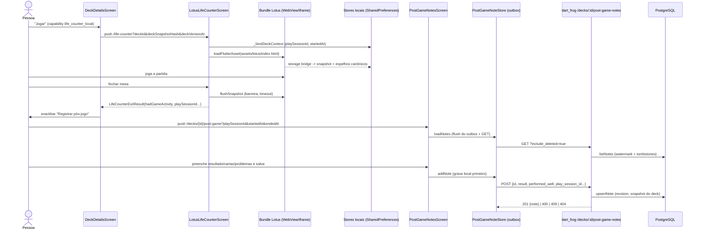

# Fluxo `life_counter_post_game` — Contador de vida e pós-jogo

Estado: documentação de apoio, não autoritativa · gerado em 2026-09-21 sobre o commit d26f23a16 · verificação estática (nenhum teste foi executado)

> **Revisado adversarialmente em 2026-09-21** (mesma árvore, somente leitura). Linhas corrigidas, dois achados rebaixados e três achados novos (A16, A17, A18) acrescentados. Ver seção 11.

---

## 1. Resumo e veredito

| Eixo | Veredito | Base |
| --- | --- | --- |
| **Implementado** | **sim** | Tela, host, stores locais, outbox, 3 rotas de servidor, serviço com tombstone/watermark e tabelas existem no disco. |
| **Alcançável hoje** | **não** | `server/config/release_capabilities.json` traz `life_counter_local.allowed=false` e `decks_private.allowed=false` (confirmado: as 5 capabilities do fluxo estão `allowed=false`, `release_capability:"off"`, `policy_version=brewtact_free_beta_2026-08-13`). Os dois portões fail-closed negam: o app redireciona `/life-counter` e `/decks/:id/post-game` para `/home` (`app/lib/core/config/release_capabilities.dart:363-366` e `:520-523`) e o servidor responde **404 `capability_unavailable`** (`server/lib/release_capability_policy.dart:187-193`). |
| **Provado** | **parcial** | O outbox do app tem teste de comportamento real (11 casos em `app/test/features/retention/post_game_note_store_test.dart`). O servidor **não tem nenhum teste de comportamento offline**: `server/test/post_game_note_sync_contract_test.dart:1-104` é só `expect(fonte, contains('string'))` — lê o arquivo `.dart` como texto e nunca chama o serviço. A única prova real do servidor é `server/test/post_game_two_client_live_test.dart`, que exige API viva. Nenhum teste cobre a travessia contador → pós-jogo de ponta a ponta. |

O que mais importa neste fluxo: **o contador de vida é local e não fala com o servidor**; o que cruza a rede é só o pós-jogo, e ele cruza por um *outbox* que **engole todo erro de transporte e todo erro de validação do servidor** (`app/lib/features/retention/services/post_game_note_store.dart:174-177,198-201`). Existem pelo menos três caminhos concretos em que o servidor rejeita permanentemente uma nota (409 de sessão duplicada, 400 de carta fora da revisão, 404 de capability) e o app fica reenviando para sempre, mostrando ao usuário "será sincronizada em breve".

E há um defeito acima de todos esses, que a primeira rodada não viu: **o seletor de cartas — o coração do pós-jogo — está desligado na prática na travessia que vem do contador**. `GET /decks/{id}` devolve `deck_version_at` = `DateTime.now()` a cada requisição (`server/routes/decks/[id]/index.dart:831`), e a tela compara esse valor com o que veio na query usando `isAtSameMomentAs` (`post_game_notes_screen.dart:299-306`). Os dois nunca coincidem depois que o cache de 5 minutos do `DeckProvider` expira (`deck_provider.dart:77`) — ou seja, depois de qualquer partida de verdade. Detalhe em **A16**.

O contador **não é Flutter nativo**. É um bundle web preservado (`app/assets/lotus/index.html` + `js/app.min.js`, 2,6 MB) hospedado em WebView (iOS/Android) ou `<iframe>` (Web), com folhas (bottom sheets) nativas em Flutter por cima. Detalhe na seção 2.

---

## 2. Jornada passo a passo



Cada passo abaixo segue o código de verdade (imports e chamadas), não o nome do arquivo.

| # | Tela/widget | Provider/serviço/cliente | Método + endpoint | Handler do servidor | Serviço/repositório | Tabela |
| --- | --- | --- | --- | --- | --- | --- |
| 1 | `home_screen.dart:111-...` `_openPlayEntry` ("Jogar agora"); `:240-263` `_openLifeCounterAndPauseOnReturn` (retomar sessão armazenada) | `LifeCounterSessionStore` (`life_counter_session_store.dart:16-39`, pref `life_counter_session_v1` via `legacyLifeCounterSessionPrefsKey`) | — (local) | — | — | — |
| 2 | `deck_details_screen.dart:304-314` "Jogar" com o deck | `openLifeCounterRoute` (`life_counter_route.dart:82-101`) monta `?deckId&deckName&deckSnapshotHash&deckVersionAt` | — | — | — | — |
| 3 | Router `main.dart:491-501` (`GoRoute` em `lifeCounterRoutePath`) | Guard `ReleaseCapabilityRouteGuard.redirectFor` (`main.dart:426-434`) | — | — | — | — |
| 4 | `lotus_life_counter_screen.dart:334-341` `_captureEntryGameState` (fingerprint de entrada) e `:343-425` `_bindDeckContext` | `LifeCounterSessionStore`, `LifeCounterHistoryStore` (`life_counter_history_v1`) | — | — | — | — |
| 5 | Host: nativo `lotus_host_controller.dart:698,711-753` (`WebViewWidget` + `loadFlutterAsset('assets/lotus/index.html')`, `lotus_runtime_flags.dart:37`); web `lotus_default_host_web.dart:66-74` (`<iframe sandbox="allow-scripts allow-same-origin allow-downloads allow-modals">`) | — | — | — | — | — |
| 6 | Jogo dentro do bundle; pontes JS `lotus_js_bridges.dart:78-118` (`FlutterClipboardBridge`, `FlutterAppReviewBridge`, `FlutterManaLoomShellBridge`, `FlutterManaLoomStorageBridge`) + script injetado `lotus_native_surface_bridge.dart:10-120` que troca toques do DOM por mensagens `open-native-*` | Folhas **nativas Flutter**: `lotus_life_counter_screen.dart:737-870` → `life_counter_native_*_sheet.dart` (14 folhas: settings, history, card search, turn tracker, game timer, game modes, dice, commander damage, player appearance/counter/state, set life, table state, day/night) | — | — | — | — |
| 7 | Persistência do bundle | `LotusStorageSnapshotStore` (`life_counter_lotus_local_storage_v1`) + espelhos canônicos em `LifeCounterSessionStore`/`HistoryStore`/`SettingsStore`/`GameTimerStateStore`/`DayNightStateStore` (`lotus_host_controller.dart:57-100`) | — | — | — | — |
| 8 | Saída `lotus_life_counter_screen.dart:476-547` (`_exitLifeCounter`): flush com timeout → recarrega sessão/histórico → `hadGameActivity` = fingerprint mudou **ou** contagem de eventos do jogo atual cresceu | `LifeCounterExitResult` (`life_counter_route.dart:7-33`) | — | — | — | — |
| 9a | `deck_details_screen.dart:315-353`: sem atividade → snackbar "Mesa fechada sem registrar"; com atividade → snackbar + ação "Registrar pós-jogo" que faz `context.push('/decks/{id}/post-game?...')` | — | — | — | — | — |
| 9b | `home_screen.dart:265-302` `_endStoredLifeCounterSession` "Encerrar e registrar": limpa a sessão e faz `push` direto para o pós-jogo (exige `decks_private`; sem deck vira "Partida rápida encerrada"). Só manda `deckSnapshotHash`/`deckVersionAt` quando `hasCompleteVersion` (`:287-291`) | — | — | — | — | — |
| 9c | **(faltava na v1)** `deck_details_screen.dart:443` — item "pós-jogo" do menu ⋮ faz `context.push('/decks/{id}/post-game')` **sem query nenhuma**. É a **única** entrada em que o seletor de cartas funciona hoje (ver A16) | — | — | — | — | — |
| 9d | **(faltava na v1)** `battle_replays_screen.dart:932-946` `onCreatePostGameEvidence` → `/decks/{id}/post-game?playSessionId=battle-replay:{id}&deckSnapshotHash&deckVersionAt={summary.createdAt}`. Exige `battle_batch`; o `deckVersionAt` é a data de criação do replay, então o seletor de cartas fica **sempre** bloqueado nessa entrada (A16) | — | — | — | — | — |
| 10 | `main.dart:615-655` monta `PostGameNotesScreen` com `playSessionId/startedAt/endedAt/deckSnapshotHash/deckVersionAt` | `post_game_notes_screen.dart:76-84` `initState` dispara `_load()` e `_loadDeck()`; o `deckLoader` chama `DeckProvider.fetchDeckDetails` (`main.dart:630-635`) | `GET /decks/{id}` (detalhe do deck) | `server/routes/decks/[id]/index.dart` | — | `decks`, `deck_cards` |
| 11 | `_load` (`post_game_notes_screen.dart:122-159`) | `PostGameNoteStore.loadNotes` (`post_game_note_store.dart:101-140`): 1) `_flushPendingOperations` (deletes depois upserts) 2) GET 3) merge por id 4) grava local | `GET /decks/{id}/post-game-notes?include_deleted=true` (`post_game_note_store.dart:36-39`) | `server/routes/decks/[id]/post-game-notes/index.dart:19-55` | `PostGameNoteService.listNotes` (`:57-93`) com `_reserveSyncWatermark` (`:513-529`) | `post_game_notes`, `post_game_sync_state` |
| 12 | Formulário `post_game_notes_screen.dart:492-520` + `_PostGameForm:1213`, `_DeckCardEvidencePicker:1360` (cartas da revisão, ciclo preservar/revisar em `_cycleCardSignal:351-360`) | `_selectedEvidence:332-349` monta `PostGameCardEvidence` com `card_id`, `image_url`, `set_code` | — | — | — | — |
| 13 | `_saveNote` (`:161-221`) → `PostGameNoteStore.addNote` (`:162-178`): grava local, enfileira upsert, tenta POST, desenfileira em sucesso | `POST /decks/{id}/post-game-notes` (`post_game_note_store.dart:68-76`) com `PostGameNote.toJson` (`post_game_note.dart:243-268`) | `server/routes/decks/[id]/post-game-notes/index.dart:57-99` | `PostGameNoteService.upsertNote` (`:218-444`), canonização de cartas (`:700-763`), snapshot do deck (`:531+`) | `post_game_notes` |
| 14 | `_deleteNote` (`:223-245`) → `PostGameNoteStore.deleteNote` (`:180-202`): remove local, grava tombstone no outbox, tenta DELETE | `DELETE /decks/{id}/post-game-notes/{noteId}` (`post_game_note_store.dart:79-86`) | `server/routes/decks/[id]/post-game-notes/[noteId].dart:9-70` | `PostGameNoteService.deleteNote` (`:446-507`) — soft delete que zera o conteúdo e mantém `deleted_at` | `post_game_notes` |
| 15 | CTA de evolução `_openOptimize` (`:362-380`) faz `context.go('/decks/{id}?optimize=post_game&postGameNoteId={id}')` | `deck_optimize_flow_support.dart:17-28` envia `post_game_note_id` | `POST /ai/optimize` | `server/routes/ai/optimize/index.dart:518-543` | `PostGameNoteService.loadOptimizeEvidence` (`:150-216`) | `post_game_notes`, `deck_cards`, `cards` |

**O que é nativo, o que é bundle, quais são as pontes** (pedido explícito da tarefa):

- **Bundle web hospedado**: a mesa em si — `app/assets/lotus/index.html` (29 linhas, casca), `app/assets/lotus/js/app.min.js` (165.798 bytes), `flutter_bootstrap.js` (17.458 bytes, injeta a ponte de storage), CSS/fontes/imagens. Total 2,6 MB declarados em `app/pubspec.yaml:109-114`.
- **Host nativo (mobile/desktop)**: `LotusHostController` com `webview_flutter`; carrega por `loadFlutterAsset` (`lotus_host_controller.dart:731`).
- **Host web**: `LotusWebHostController` com `<iframe>` same-origin sandbox (`lotus_default_host_web.dart:66-74`) e `postMessage` assinado por token (`:382-385` na saída, `:411` na validação de entrada; token gerado em `:65`). O `localStorage` do bundle é substituído pela ponte; o snapshot em si vai para o `localStorage` **do app** (`:489,600-604,678-679`).
- **Pontes JS**: 4 canais (`lotus_js_bridges.dart:78-81`). O canal de storage é serializado por uma fila (`LotusStorageMessageQueue:15-73`) e a saída usa `flushSnapshot` avaliado por JS com barreira (`lotus_host_controller.dart:766-809`).
- **Nativo Flutter**: casca, overlays de loading/erro (`lotus_host_overlays.dart`), as 14 bottom sheets, os stores canônicos, o cálculo de saída e toda a tela de pós-jogo.

---

## 3. Capabilities e portões

| Superfície | Capability no app | Capability no servidor | Nomes batem? | Estado hoje |
| --- | --- | --- | --- | --- |
| `/life-counter` | `life_counter_local` (`release_capabilities.dart:363-366`) → redirect `/home` | **nenhuma rota de servidor** (o contador é 100% local) | n/a — nada a divergir | `allowed=false` (`server/config/release_capabilities.json`) |
| `/decks/:id/post-game` (tela) | `decks_private` pela regra genérica `/decks/` (`release_capabilities.dart:520-523`) → redirect `/home` | — | — | `allowed=false` |
| `GET/POST /decks/{id}/post-game-notes` | `decks_private` (cliente não checa antes de chamar) | `decks_private` pelo catch-all `/decks/` (`release_capability_policy.dart:537-542`) | **sim** | `allowed=false` → 404 |
| `DELETE /decks/{id}/post-game-notes/{noteId}` | idem | `decks_private` | sim | 404 |
| `GET /decks/{id}/post-game-timeline` | **ninguém chama** | `decks_private` | — | 404 |
| CTA "Otimizar" a partir do pós-jogo | `ai_analyze_optimize_advisory` / `aiGenerateRebuild` + `decks_private` (`post_game_notes_screen.dart:362-370`) | `ai_analyze_optimize_advisory` para `/ai/optimize` (`release_capability_policy.dart:431-442`) | sim | `allowed=false` |

**O que o usuário vê quando negado:**

- App: **redirect silencioso para `/home`**, sem mensagem. Não há tela de "indisponível" para este fluxo; o botão some/não faz nada porque `home_screen.dart:113,122` e `deck_details_screen.dart:305-307` fazem `return` sem feedback.
- Servidor: **HTTP 404** com corpo `{"error":"capability_unavailable","capability":"decks_private","release_capability":"off","policy_version":…,"policy_digest_sha256":…,"offer_mode":…}` (`server/routes/_middleware.dart:128-143`). É 404 de propósito (fail-closed antes de tocar no PostgreSQL), e não 403.
- Consequência para o cliente: o 404 do GET cai no `catch` do store e vira "só dados locais"; o 404 do POST mantém a nota pendente; o 404 do DELETE é tratado como **sucesso** (ver achado A3).

O portão do servidor roda **antes** do `authMiddleware` de decks (`server/routes/_middleware.dart:105-144` vs `server/routes/decks/_middleware.dart`), então com a capability OFF nem chega a validar token.

---

## 4. Contrato app↔servidor

| Endpoint | App envia | Servidor lê | App lê da resposta | Servidor devolve | Divergências |
| --- | --- | --- | --- | --- | --- |
| `GET /decks/{id}/post-game-notes?include_deleted=true` | só a query `include_deleted` (`post_game_note_store.dart:37-39`) | `include_deleted`, `since` (`index.dart:27-36`) | `data[]`, `is_deleted`/`deleted_at`, `sync_cursor` (`:44-64`) | `{data:[…], sync_cursor}` | **`since` nunca é enviado**; `sync_cursor` é parseado na linha 63 e **nunca lido** (grep `syncCursor` em `app/lib` dá exatamente 3 ocorrências, todas na definição/atribuição). A consulta do servidor **não tem `LIMIT` nem paginação** (`post_game_note_service.dart:70-90`): cada abertura da tela baixa o histórico inteiro + todos os tombstones. |
| `GET /decks/{id}` (carregar a revisão para o seletor de cartas) | nada além do id (`main.dart:630-635` → `DeckProvider.fetchDeckDetails`, cache de 5 min em `deck_provider.dart:77`) | — | `deck_snapshot_hash`, `deck_version_at` (`deck_details.dart:128-129`) | `deck_snapshot_hash` = hash estável do conteúdo; **`deck_version_at` = `DateTime.now()` a cada requisição** (`server/routes/decks/[id]/index.dart:826-831`) | **Divergência grave (A16)**: a tela exige `isAtSameMomentAs` entre o `deckVersionAt` da query e o da resposta (`post_game_notes_screen.dart:299-306`). Como o servidor não tem versão estável, a igualdade só ocorre por acidente de cache. |
| `POST /decks/{id}/post-game-notes` | `id, deck_id, created_at, result, table_level, notes, performed_well[], underperformed[], issues[], revision` + opcionais `play_session_id, session_started_at, session_ended_at, deck_snapshot_hash, deck_version_at` (`post_game_note.dart:243-268`) | `id, created_at, result, table_level, notes, performed_well, underperformed, issues, play_session_id, session_started_at, session_ended_at, deck_snapshot_hash, deck_version_at, base_revision` (`post_game_note_service.dart:223-272`) | **nada além do `statusCode`** (`post_game_note_store.dart:73-75`) | `201 {note:{…}}`, `400`, `404`, `409 {error:'post_game_conflict', current_note}` | `deck_id` e `revision` são enviados e **ignorados** pelo servidor. `base_revision` é lido pelo servidor e **nunca enviado** pelo app → o controle otimista de concorrência é código morto do lado do cliente. O corpo `{note}` (com cartas canonizadas, `image_url` e `revision` novos) é descartado. |
| `DELETE /decks/{id}/post-game-notes/{noteId}` | nenhum corpo, **sem `If-Match`** (`post_game_note_store.dart:79-86`) | header `If-Match` opcional (`[noteId].dart:53-70`) | `statusCode` | `204`, `404`, `409` | `If-Match` nunca é enviado → o 409 de delete é inalcançável pelo app. **`404` é tratado como sucesso** pelo cliente (`:83-85`). |
| `GET /decks/{id}/post-game-timeline` | — | — | — | agregado `{match_count, issue_counts, dominant_issues, top_performers, review_candidates, weekly_activity, diagnostics, next_actions, timeline}` (`post_game_note_service.dart:99-143`) | **Órfão do lado do app**: zero chamadas em `app/` (grep em todo o repo). **Correção da v1:** não é verdade que "só aparece em docs e no manifesto" — ele é chamado por `scripts/manaloom_product_smoke.sh:205` (curl com token) e verificado por `server/test/community_engagement_contract_test.dart:78-96` (teste de string). O app recalcula o equivalente localmente em `DeckEvolutionSummary.fromNotes` (`post_game_note.dart:402-428`) — e os dois cálculos divergem: o servidor não produz `suggestions`, o app não produz `weekly_activity`/`diagnostics`/`next_actions`. |
| `POST /ai/optimize` (consumidor) | `post_game_note_id` = id **local** da nota (`post_game_notes_screen.dart:376`) | `loadOptimizeEvidence` exige a linha no PostgreSQL (`post_game_note_service.dart:150-216`) | — | `422 post_game_evidence_not_found` se não existir (`server/routes/ai/optimize/index.dart:530-542`) | Nota ainda pendente no outbox → CTA habilitado → 422. |

Enum de `issues`: o app serializa `mana|draw|removal|win_condition|speed|protection` (`post_game_note.dart:4-11`) e o servidor só valida tamanho (`_boundedList`, `:653-656`) — grava qualquer string. Na volta, `PostGameIssueLabel.fromId` (`:37-42`) faz `orElse: () => PostGameIssue.mana`, ou seja **qualquer valor desconhecido vira "Mana" silenciosamente**.

---

## 5. Dados (tabelas, migrações)

Não existe diretório de migrations neste repositório; o schema vive em `server/database_setup.sql` (o código cita "migration 038" em `post_game_note_service.dart:525`, mas essa migration não existe como arquivo).

| Objeto | Definição | Observações |
| --- | --- | --- |
| `post_game_notes` | `server/database_setup.sql:2304-2328` | PK `id TEXT` (o app gera `microsecondsSinceEpoch`), `user_id`/`deck_id` com `ON DELETE CASCADE`, `revision BIGINT CHECK (revision > 0)`, `deleted_at` (tombstone), `updated_at`, CHECK `session_ended_at >= session_started_at`. |
| Índices | `:2330-2341` | `(deck_id, created_at DESC)`, `(user_id, updated_at DESC)`, `(user_id, updated_at, revision)`, parcial de tombstones, e **`uq_post_game_notes_play_session` UNIQUE (user_id, deck_id, play_session_id) WHERE play_session_id IS NOT NULL AND deleted_at IS NULL** (`:2339-2341`) — origem do achado A1. |
| `post_game_sync_state` | `:2345-2361` | Uma linha (`id=1`) com `watermark`; `_reserveSyncWatermark` (`post_game_note_service.dart:513-529`) faz `UPDATE … GREATEST(clock_timestamp(), watermark + 1µs) RETURNING` em toda leitura e toda mutação. Serializa leitores e escritores, mas também **serializa globalmente todo o tráfego de pós-jogo de todos os usuários numa única linha** (contenção sob carga; hipótese, não medida). |
| Armazenamento local (app) | `life_counter_session_v1`, `life_counter_history_v1`, `life_counter_lotus_local_storage_v1` (`lotus_storage_snapshot.dart:5-6`), `manaloom.post_game_notes.{deckId}`, `manaloom.post_game_notes.pending_upserts.{deckId}`, `manaloom.post_game_notes.pending_deletes.{deckId}` (`post_game_note_store.dart:346-350`) | O contrato declara `local:post_game_outbox`; no disco o outbox são **duas** chaves por deck. |

---

## 6. Estados e erros

| Estado | Tratado? | Onde |
| --- | --- | --- |
| Carregando (contador) | sim | Overlay próprio do host (`lotus_host_controller.dart` + `lotus_host_overlays.dart`), com timeout de 6 s e dispensa em 80 % de progresso (`lotus_runtime_flags.dart:35-37`). |
| Falha ao abrir o bundle | sim | `errorMessage` → overlay com "Tente carregar novamente"; retry re-chama `loadBundle` (`lotus_host_controller.dart:711-753`). Coberto por teste (`lotus_life_counter_screen_test.dart:155`). |
| Saída sem atividade | sim | `hadGameActivity=false` → snackbar "Mesa fechada sem registrar uma nova partida" (`deck_details_screen.dart:317-326`). |
| Flush de storage travado na saída | **não, de fato** | `timeout(_exitStorageFlushTimeout, onTimeout: () => false)` (`lotus_life_counter_screen.dart:504-506`); a saída acontece mesmo assim, com `storageFlushed=false` — **e esse campo não é usado por ninguém no destino** (`deck_details_screen.dart:315-327` e `home_screen.dart:254-262` só olham `hadGameActivity`). Pior: `hadGameActivity` é calculado a partir da sessão/histórico **recarregados depois do flush** (`:526-535`), então um flush que estourou o timeout produz um falso negativo silencioso e a partida some com a frase "Mesa fechada sem registrar uma nova partida". É o mecanismo concreto por trás de A8. |
| Carregando (pós-jogo) | sim | `AppStatePanel.loading` key `post-game-loading` (`post_game_notes_screen.dart:400-406`). |
| Vazio (pós-jogo) | sim | `_EmptyHistoryPanel` (`:591-592,1687`). |
| Erro de carga | sim | `AppStatePanel` key `post-game-load-error` + "Tentar novamente" (`:407-417`). Só dispara se o **local** falhar: o erro remoto é engolido em `post_game_note_store.dart:137-139`. |
| Erro ao salvar/excluir | **parcial** | `_OperationErrorPanel` com retry (`:554-576`), mas só é alcançado se `addNote`/`deleteNote` **lançarem** — e eles nunca lançam por falha remota (`post_game_note_store.dart:174-177,198-201`). Na prática o painel só aparece em falha de `SharedPreferences`. |
| Offline / retry | sim (transporte) | Outbox + `_flushPendingOperations` a cada `loadNotes` (`:255-277`); painel `post-game-pending-sync` (`:916-946`). |
| Rejeição definitiva do servidor (400/409/404) | **não** | Indistinguível de offline: fica pendente para sempre e a UI afirma "A sincronização com sua conta será…" (`:945-947`). Achados A1–A3. |
| 401 / sessão expirada | parcial | `ApiClient.isSessionInvalidatingUnauthorized` (`api_client.dart:96-117`) dispara o handler global de logout; **o store do pós-jogo não vê nada** — a operação vira "pendente" e o usuário é deslogado por outro caminho. |
| 403/404 de capability | ver seção 3 | Redirect silencioso no app; 404 no servidor. |
| Validação | **assimétrica** | App só exige "algo preenchido" (`:163-174`). O servidor valida tamanhos, ISO-8601, par `deck_snapshot_hash`+`deck_version_at`, `card_id` UUID e pertencimento da carta ao deck — e o app nunca mostra a mensagem de validação, porque descarta a resposta. |
| Concorrência — duplo toque | sim | `if (_isSaving) return` (`:162`) e `_deletingNoteIds` (`:224`); no store, `_serializeDeckOperation` (`:225-247`) serializa por deck entre instâncias (fila estática). |
| Concorrência — dois dispositivos | parcial no servidor (revision + `FOR UPDATE` + watermark), **nulo no cliente** (não envia `base_revision` nem `If-Match`). |
| Job assíncrono em andamento | n/a neste fluxo (só no Optimize, fora do escopo). |
| Revisão do deck mudou | **falso positivo permanente** | `_requestedRevisionCannotBeConfirmed` (`:289-308`) bloqueia a seleção de cartas com mensagem explícita (`:310-317`). O hash bate (é conteúdo), mas o `deck_version_at` não bate nunca depois do cache de 5 min — ver **A16**. Também não cobre o caso do achado A2 (deck alterado **depois** da seleção). |

---

## 7. Testes por passo

| Passo | Teste | O que de fato afirma |
| --- | --- | --- |
| 1 (home) | `app/test/features/home/home_screen_test.dart:711-753` | Real: monta a home com sessão salva, toca "Encerrar e registrar" e verifica `path == '/decks/deck-active/post-game'` + `playSessionId` + `deckSnapshotHash`. |
| 2 (deck details → contador) | **nenhum** | `deck_details_screen.dart:304-354` (inclusive o snackbar "Registrar pós-jogo") não é exercitado por nenhum teste — grep por `openLifeCounterRoute`/`LifeCounterExitResult` só acha `life_counter_route_test.dart` e `lotus_life_counter_screen_test.dart`. |
| 3 (rota + query) | `app/test/features/home/life_counter_route_test.dart:8-59` | Real, mas só de URL: montagem/normalização da query e `duration` do `ExitResult`. `:82+` prova que abrir o contador limpa a fila de snackbars. |
| 4 (bind do deck) | `app/test/features/home/lotus_life_counter_screen_test.dart:235,286` | Real: "binds deck context before loading the Lotus bundle" e "a changed version of the same deck starts a clean game session". |
| 5–6 (host, bundle, pontes) | `lotus_life_counter_screen_test.dart:127,155,204`; `lotus_host_controller_*_test.dart`; `lotus_js_bridges_test.dart`; `lotus_native_surface_bridge_test.dart`; ~50 smokes em `app/integration_test/life_counter_*` | Amplo e real (overlay, retry de bundle, espelhos canônicos, cada folha nativa). É a parte mais coberta do fluxo. |
| 7 (persistência/espelhos) | `lotus_storage_bridge_state_test.dart`, `lotus_storage_snapshot_store_test.dart`, `life_counter_session_store_test.dart`, `life_counter_history_store_test.dart` | Real. |
| 8 (saída) | `lotus_life_counter_screen_test.dart:581,638,681` | Real: timeout da barreira de flush, fallback para `/home` em rota direta. **Não** há teste que afirme o cálculo de `hadGameActivity` (fingerprint vs. contagem de eventos). |
| 9 (travessia → pós-jogo) | **nenhum além do home** | O caminho do deck details (snackbar + ação) não tem teste. |
| 10 (montagem da tela) | `post_game_notes_screen_responsive_test.dart`, `app/integration_test/app_existing_user_visual_audit_test.dart:798-801` | O visual audit navega para `/decks/{id}/post-game` e verifica a âncora `post-game-responsive-frame` — é prova de layout, não de comportamento. |
| 11 (load + merge + outbox) | `app/test/features/retention/post_game_note_store_test.dart:12,42,52,82,124,170,193,218,243,262,305` (11 casos) | Real e bom: merge remoto/local, payload corrompido, preservação de metadados de sessão, preservação de arte local, retry automático de upsert, tombstone que sobrevive a falha, tombstone do servidor que apaga nota local, endpoint exato do GET, corrida entre dois stores. **Ressalva encontrada na revisão adversarial:** o caso `:305` chama-se "simultaneous deletes cannot resurrect notes or lose tombstones", mas o fake (`deleteFailuresRemaining`) **lança**. Nenhum teste exercita `ApiPostGameNoteRemoteClient` de verdade, e portanto a regra "404 é sucesso" (`post_game_note_store.dart:83-85`) — a causa real de ressurreição, A3 — não é coberta por nada. |
| 12–13 (formulário e salvar) | `post_game_notes_screen_resilience_test.dart:61,73,94`; `post_game_card_evidence_test.dart:18,62,146` | Real, porém com store **fake**: "save failure keeps the form and retry completes the note" injeta uma falha que **lança**, cenário que o store de produção nunca produz em falha remota. Nenhum teste exercita 400/409/404 reais do servidor. |
| 14 (excluir) | `post_game_notes_screen_resilience_test.dart:134` | Real, mesma ressalva. |
| 15 (CTA otimizar) | `post_game_optimization_cta_contract_test.dart:6` | **Teste de string**: lê o arquivo da tela e procura trechos. Não monta widget nem verifica navegação. |
| Servidor — todos os passos | `server/test/post_game_note_sync_contract_test.dart:1-104` | **Só `contains` sobre o texto-fonte** de 3 arquivos. Passa com o serviço quebrado desde que as strings existam. |
| Servidor — prova real | `server/test/post_game_two_client_live_test.dart:1-361` | Real e bom (registra 2 usuários, cria deck, `If-Match`, tombstone, `since`), mas é `@Tags(['live','live_backend','live_db_write'])` e exige API em `TEST_API_BASE_URL`. Não roda no gate determinístico. |

**Passos sem teste nenhum: 5** (eram 3; a revisão adversarial achou mais dois) — (a) travessia deck details → contador → pós-jogo com `LifeCounterExitResult` (grep por `openLifeCounterRoute`/`LifeCounterExitResult` em `app/test` + `app/integration_test` só acha `life_counter_route_test.dart` e `lotus_life_counter_screen_test.dart`; nada toca `deck_details_screen.dart:304-354`); (b) cálculo de `hadGameActivity`; (c) qualquer comportamento do servidor de pós-jogo em suíte determinística; (d) **a confirmação de revisão do seletor de cartas** (`_requestedRevisionCannotBeConfirmed`) — é o que deixou A16 passar; (e) **as entradas `deck_details_screen.dart:443` (menu ⋮) e `battle_replays_screen.dart:932-946`** (A18).

**Testes que só verificam string/posição:** `server/test/post_game_note_sync_contract_test.dart` (inteiro) e `app/test/features/retention/post_game_optimization_cta_contract_test.dart`.

---

## 8. Achados

| # | Tipo | Sev. | Arquivo:linha | Descrição | Como provar |
| --- | --- | --- | --- | --- | --- |
| A1 | bug-provável | **alta** | `server/database_setup.sql:2339` + `server/lib/retention/post_game_note_service.dart:438-443` + `app/lib/features/retention/services/post_game_note_store.dart:174-177` | O índice único `(user_id, deck_id, play_session_id)` impede **duas notas da mesma partida**. A tela mantém `widget.playSessionId` fixo e o formulário continua aberto e limpo depois de salvar (`post_game_notes_screen.dart:189,198-207`), então registrar a segunda partida da mesma mesa gera `23505` → `409`. O app engole o erro: a nota fica no outbox e é reenviada em toda abertura, sempre 409, enquanto a UI diz "será sincronizada em breve". | Teste de servidor (unitário com PG de teste): `upsertNote` duas vezes com `id` diferente e o mesmo `play_session_id` → esperar `PostGameConflictException`. Teste de app: fake que devolve 409 e asserir que a UI informa rejeição definitiva. Prova viva: salvar duas notas seguidas na mesma tela de pós-jogo e observar `post-game-pending-sync` travado em 1. |
| A2 | bug-provável | **média** (era alta) | `server/lib/retention/post_game_note_service.dart:700-764` (throw em `:751-755`) + `app/lib/features/retention/services/post_game_note_store.dart:269-276` | `_canonicalizeDeckCardEvidence` rejeita com 400 (`contém carta fora da revisão atual do deck`) qualquer `card_id` que não esteja **hoje** em `deck_cards`. Uma nota salva offline com cartas selecionadas e sincronizada depois de o usuário editar o deck é rejeitada para sempre — mensagem envenenada no outbox, retry infinito. **Rebaixado na revisão adversarial:** o mecanismo está confirmado no servidor, mas a porta de entrada é estreita. Por causa de **A16**, a travessia contador → pós-jogo não consegue selecionar carta nenhuma; `performed_well`/`underperformed` com `card_id` só nascem pela entrada `deck_details_screen.dart:443` (menu ⋮, sem query). Fora dela o payload vai vazio e o 400 nunca acontece. | Teste de servidor: inserir nota com `performed_well=[card_id]`, remover a carta do deck, reenviar → 400. Teste de app: fake que devolve 400 e asserir que o outbox não retenta indefinidamente. |
| A3 | bug-provável | **alta** | `app/lib/features/retention/services/post_game_note_store.dart:83-85` | `deleteNote` trata **404 como sucesso** e remove o tombstone (`:199-200`). Mas 404 também é a resposta de `capability_unavailable` (`server/routes/_middleware.dart:128`), de `Deck nao encontrado` (`[noteId].dart:23`) e de nota ainda não sincronizada. Resultado: o usuário apaga a nota, o servidor mantém a linha, o tombstone some e o próximo `loadNotes` **ressuscita a nota**. | Teste de app: fake HTTP que devolve 404 no DELETE e devolve a nota no GET seguinte → asserir que a nota **não** reaparece. Prova viva: apagar uma nota com a capability OFF e reabrir a tela. |
| A4 | estado-não-tratado | **alta** | `app/lib/features/retention/services/post_game_note_store.dart:137-139,174-177,198-201,262-275` | Todo `catch (_)` vazio: o app não distingue "sem rede" de "servidor recusou". O único sinal é a contagem de pendentes, e o texto do painel (`post_game_notes_screen.dart:945-947`) afirma que a sincronização vai acontecer. É a causa raiz comum de A1, A2 e A3. | Introduzir classificação de erro (transporte vs. 4xx definitivo) e um teste que asserte estado "rejeitado" na UI. |
| A5 | incoerência-app-servidor | média | `app/lib/features/retention/models/post_game_note.dart:258` vs `server/lib/retention/post_game_note_service.dart:272` | O app envia `revision` (ignorado) e nunca envia `base_revision` (o que o servidor lê). O controle otimista de concorrência do servidor é inalcançável a partir do app; a última escrita vence. Idem `If-Match` no DELETE (`post_game_note_store.dart:79-86` vs `[noteId].dart:53-70`). | Teste de contrato que faça o cliente real montar o corpo e asserir presença de `base_revision`; hoje `post_game_two_client_live_test.dart` prova o servidor, não o cliente. |
| A6 | incoerência-app-servidor | média | `app/lib/features/retention/services/post_game_note_store.dart:36-39,63` + `server/lib/retention/post_game_note_service.dart:70-90` | `sync_cursor` é parseado e nunca usado; `since` nunca é enviado. Cada abertura da tela baixa todo o histórico **mais todos os tombstones** (`include_deleted=true` fixo), que nunca são coletados. Reforço da revisão adversarial: a consulta do servidor **não tem `LIMIT` nem cláusula de paginação**, então não há teto nem do lado dele — o custo é O(todas as notas + todos os tombstones do deck) por abertura de tela. | Medir o payload do GET depois de N criações+exclusões; ou teste que asserte que a segunda carga envia `?since=`. |
| A7 | doc-defasada | média | `docs/project_logic_contracts.json` (flow `life_counter_post_game`) | O contrato aponta `app/test/features/home/lotus_life_counter_screen_test.dart`, `post_game_note_store_test.dart` e `post_game_note_sync_contract_test.dart` como os testes do fluxo. O terceiro **não exercita nada** (só `contains` de string) e o contrato não menciona o teste que de fato prova o servidor (`post_game_two_client_live_test.dart`). Também declara `storage: local:post_game_outbox` (singular) quando são duas chaves por deck. | Abrir os dois arquivos lado a lado; já verificado aqui. |
| A8 | passo-sem-teste | média | `app/lib/features/decks/screens/deck_details_screen.dart:304-354` | A travessia "fechei a mesa → snackbar → Registrar pós-jogo" não tem nenhum teste; e `hadGameActivity` (`lotus_life_counter_screen.dart:532-535`), que decide se o CTA aparece, também não. Um falso negativo aqui perde a partida inteira sem erro visível. | `testWidgets` que monte o deck details com um `openLifeCounterRoute` fake devolvendo `LifeCounterExitResult(hadGameActivity: true, …)` e asserte o `push` para `/decks/{id}/post-game` com a query correta. |
| A9 | bug-provável | média | `app/lib/features/retention/screens/post_game_notes_screen.dart:376` + `:432-447` + `server/routes/ai/optimize/index.dart:530-542` | O CTA "Otimizar" envia o `id` **local** da nota. Se a nota ainda está no outbox (offline, ou A1/A2/A3), o servidor responde `422 post_game_evidence_not_found`. Confirmado que a única guarda do botão é `optimizeEvidence == null` (`:441-447`), ou seja, "existe nota local" — `_pendingSyncCount` é exibido no painel mas **não** entra na condição. A evidência escolhida é `_lastSavedEvidence ?? _notes.first` (`:432-434`), que logo após um salvamento é exatamente a nota recém-criada, a mais provável de ainda estar pendente. | Teste de widget: store fake com 1 pendente → asserir CTA desabilitado/avisado. Prova viva: salvar offline, voltar a ter rede sem recarregar a tela e tocar "Otimizar". |
| A10 | incoerência-app-servidor | baixa | `server/routes/decks/[id]/post-game-timeline/index.dart:7-27` | Endpoint sem nenhum chamador no app. **Correção da v1:** ele não está totalmente abandonado — `scripts/manaloom_product_smoke.sh:205` bate nele com curl e `server/test/community_engagement_contract_test.dart:78-96` verifica (por string) que `buildTimeline`, `dominant_issues`, `next_actions` e `weekly_activity` existem. O app recalcula localmente em `DeckEvolutionSummary.fromNotes` e os dois agregados divergem (servidor não gera `suggestions`; app não gera `weekly_activity`/`diagnostics`/`next_actions`). | Decidir: consumir no app ou remover (e então ajustar o smoke). Prova: grep já feito; confirmar em runtime com log de acesso. |
| A11 | bug-provável (hipótese) | baixa | `app/lib/features/retention/models/post_game_note.dart:182` | O `id` da nota é `DateTime.microsecondsSinceEpoch`. **Na Web, `DateTime` tem precisão de milissegundo**, então o id cai em baldes de 1 ms e não é escopado por usuário; a PK de `post_game_notes` é global (`database_setup.sql:2305`). Uma colisão entre dois usuários faz o upsert achar a linha alheia (`SELECT … WHERE id = @id` sem filtro de usuário, `post_game_note_service.dart:296-304`) e devolver 404 → nota inssincronizável para sempre. Web é plataforma do candidato (`docs/status/CURRENT_PRODUCT_DECISION.md`). | Gerar o id com UUID v4 (ou prefixo por usuário) e teste que asserte unicidade. Prova: no servidor, inserir nota do usuário A com id X e tentar upsert do usuário B com o mesmo id → 404. |
| A12 | estado-não-tratado | baixa | `app/lib/main.dart:426-434` + `app/lib/core/config/release_capabilities.dart:256,275-276` | Enquanto `/capabilities` não responde, o snapshot é `denied()` (campo inicializado em `:256`; `refresh()` volta a `denied()` em `:275-276` **antes** do fetch). Um deep link para `/life-counter` (ou `/decks/:id/post-game`) nesse intervalo é redirecionado para `/home` e **o destino é perdido**. O router *é* reavaliado quando as capabilities chegam (`main.dart:306-309`, `Listenable.merge` inclui `_releaseCapabilitiesProvider`), mas a reavaliação acontece sobre a localização **atual** (`/home`), então não há como voltar. Confirmado no código; só morde quando a capability estiver ON. | Teste de router com `ReleaseCapabilitiesProvider` em `loading` → navegar → completar o fetch → asserir que a rota original é restaurada. |
| A13 | ux-funcional | baixa | `app/lib/features/retention/screens/post_game_notes_screen.dart:379` | `_openOptimize` usa `context.go`, que **substitui** a pilha: depois de otimizar não há "voltar" para o pós-jogo. Os demais CTAs da mesma tela usam `push` (`:845`). | Trocar por `push` e asserir com `testWidgets` que `canPop()` continua verdadeiro. |
| A14 | seguranca | baixa | `app/lib/features/home/lotus/lotus_default_host_web.dart:64-73` | Na Web o bundle roda em `<iframe sandbox="allow-scripts allow-same-origin …">` — a combinação `allow-scripts`+`allow-same-origin` anula o isolamento do sandbox em relação à origem do app. O comentário do código assume o bundle como confiável e o `localStorage` é substituído por uma ponte com token, o que mitiga, mas não isola. Risco baixo **hoje** porque o bundle é versionado no repositório; vira alto se algum dia for servido remotamente. | Revisão de ameaça + teste que asserte que o bundle nunca é carregado de origem remota. |
| A15 | capability | baixa | `app/lib/main.dart:357` | O contador é 100 % local, mas `/life-counter` está na lista de rotas protegidas: **exige login** para usar um contador que não toca o servidor. Decisão de produto, não bug — registrar para não ser "descoberto" de novo. | — |
| **A16** | **bug-provável (novo)** | **alta** | `server/routes/decks/[id]/index.dart:831` + `app/lib/features/retention/screens/post_game_notes_screen.dart:299-306` + `app/lib/features/decks/providers/deck_provider.dart:77` | **O seletor de cartas do pós-jogo está morto na travessia que vem do contador.** `GET /decks/{id}` devolve `'deck_version_at': DateTime.now().toUtc().toIso8601String()` — um carimbo novo **a cada requisição**; não existe nenhuma outra origem desse campo no servidor (grep: só essa linha o produz). A tela exige `loadedVersion.isAtSameMomentAs(requestedVersion)`; o `requestedVersion` veio da query, que veio de um `GET /decks/{id}` anterior. O `DeckProvider` cacheia detalhes por 5 minutos (`deck_provider.dart:77`), então: partida curta (<5 min, cache quente) → mesmo objeto, passa; **partida de verdade (>5 min) → refetch → carimbo novo → `_requestedRevisionCannotBeConfirmed = true`** → `_deckCards` devolve lista vazia (`:267-271`) e a UI acusa o usuário: "Esta partida usa outra revisão do deck…" (`:310-317`) mesmo com o deck intocado. Nas três entradas: `deck_details_screen.dart:329-342` e `home_screen.dart:287-296` → quebra depois de 5 min; `battle_replays_screen.dart:932-946` → **quebra sempre** (manda `summary.createdAt`); `deck_details_screen.dart:443` (menu ⋮, sem query) → funciona. Consequência de produto: o pós-jogo vira formulário de texto e o `POST /ai/optimize` recebe `selected_card_count: 0`. | `testWidgets` montando `PostGameNotesScreen` com `deckVersionAt: T0` e um `deckLoader` que devolve `DeckDetails(deckVersionAt: T0 + 1s)` → asserir que o seletor continua habilitado (falha hoje). Correção: derivar `deck_version_at` de `decks.updated_at` no servidor, ou comparar só `deck_snapshot_hash` na tela. Prova viva: jogar 6 minutos, fechar a mesa, abrir o pós-jogo — o seletor vem bloqueado. |
| **A17** | **seguranca (novo)** | média | `server/lib/retention/post_game_note_service.dart:324-330` | Ao **criar** uma nota, o servidor aceita o `deck_snapshot_hash` e o `deck_version_at` enviados pelo cliente e **descarta o snapshot que ele mesmo acabou de calcular** (`currentDeckSnapshot`, linha 277-281), sem nunca comparar os dois. A única validação é de formato (`^[0-9a-f]{64}$`, `:641`). Resultado: o campo que `loadOptimizeEvidence` usa para decidir `deck_revision.matches_current` (`:207-213`) é conteúdo não verificado do cliente. Um cliente pode gravar qualquer hash e fazer a evidência do Optimize alegar que bate (ou não bate) com a revisão atual. | Teste de servidor: `upsertNote` com `deck_snapshot_hash` de 64 zeros num deck real → hoje grava; esperado seria 400 ou sobrescrita pelo hash calculado. |
| **A18** | **doc-defasada (novo)** | média | `app/lib/features/decks/screens/deck_details_screen.dart:443` e `app/lib/features/battle/screens/battle_replays_screen.dart:932-946` | A v1 deste documento mapeou **duas** entradas para `/decks/{id}/post-game` (deck details pós-contador e home "Encerrar e registrar") e existem **quatro**. As duas que faltavam mudam as conclusões: a do menu ⋮ é a única em que o seletor de cartas funciona (logo, a única em que A2 é alcançável), e a do replay de batalha exige `battle_batch` e cai direto no falso positivo de A16. Nenhuma das duas aparece no contrato do fluxo nem tem teste. | `grep -rn "/post-game" app/lib` (já feito nesta rodada). Cada entrada precisa de um `testWidgets` próprio. |

---

## 9. Divergências em relação aos contratos existentes

1. **`docs/project_logic_contracts.json` → `flows[life_counter_post_game].tests`** lista `server/test/post_game_note_sync_contract_test.dart` como prova do servidor. O arquivo é um teste de texto (`File(...).readAsStringSync()` + `contains`), não exercita o serviço e não conhece o PostgreSQL. O teste que realmente prova (`server/test/post_game_two_client_live_test.dart`) **não está no contrato**.
2. **`…flows[…].implementation`** cita 5 arquivos e omite peças obrigatórias do caminho: `app/lib/features/home/life_counter_route.dart`, `app/lib/features/home/lotus/lotus_host_controller.dart` (e a variante web), `app/lib/features/retention/screens/post_game_notes_screen.dart`, `server/routes/decks/[id]/post-game-notes/[noteId].dart` e `server/routes/decks/[id]/post-game-timeline/index.dart`.
3. **`…flows[…].storage`** diz `local:life_counter_session` e `local:post_game_outbox`. No disco: `life_counter_session_v1`, `life_counter_history_v1`, `life_counter_lotus_local_storage_v1`, e o outbox são **duas** chaves por deck (`pending_upserts`, `pending_deletes`).
4. **`…flows[…].sequence`** afirma "Post-game → PostgreSQL: sync com tombstone e watermark". Verdadeiro no servidor; **do lado do cliente o watermark não existe** (`since`/`sync_cursor` não usados) e o tombstone é perdido no caso A3.
5. **`traceability` → "Pós-jogo offline converge por id, tombstone e watermark sem ressuscitar nota"**: a regra é contrariada por A3 (404 tratado como sucesso ressuscita nota) e não é provada pelos testes citados.
6. **`docs/MAPA_OPERACIONAL_DO_PROJETO.md:369` (C11)** já registra que este fluxo funde um contador client-only com um sync bloqueado. Este documento confirma e detalha: as duas metades têm capabilities diferentes (`life_counter_local` e `decks_private`), estados de prova diferentes e modos de falha diferentes. Continuar tratando como um fluxo só esconde que a metade local está bem coberta e a metade remota não.
7. **`server/doc/API_CONTRACTS_AND_DATA_MAP.md:206`** descreve `GET /decks/:id/post-game-timeline` como "post-game screen" consumer. Nenhuma tela do app chama esse endpoint (A10).
8. **`post_game_note_service.dart:525`** instrui "aplique a migration 038"; não existe diretório de migrations — o objeto vem de `server/database_setup.sql:2345`.
9. **(novo)** **`…flows[…].entrypoints`** lista `/life-counter` e `/decks/{id}/post-game` como se houvesse um caminho só até a tela de pós-jogo. São **quatro** entradas no app (A18), com capabilities diferentes (`decks_private` nas três primeiras, mais `battle_batch` na do replay) e comportamento diferente do seletor de cartas.
10. **(novo)** O contrato e este documento tratavam "revisão exata do deck" como garantia funcionando. Não é: o servidor não tem versão estável de deck (`deck_version_at` = `now()` em `server/routes/decks/[id]/index.dart:831`) e o hash que fica gravado na nota é o que o cliente mandou, sem conferência (`post_game_note_service.dart:324-330`). A16 e A17.

---

## 10. Rodada 2: comandos e roteiro de prova viva

### 10.1 Comandos de teste (rodar quando a máquina estiver livre — **não rodar agora**)

Pré-requisito de ambiente: `export MANALOOM_NODE_BIN=/opt/homebrew/opt/node@22/bin/node` e Flutter pinado 3.44.6 (o `flutter` do PATH reescreve `pubspec.lock`).

```bash
# App — unit/widget do fluxo (mais barato primeiro)
cd app && flutter test --no-pub test/features/retention/
cd app && flutter test --no-pub test/features/home/life_counter_route_test.dart
cd app && flutter test --no-pub test/features/home/lotus_life_counter_screen_test.dart
cd app && flutter test --no-pub test/features/home/home_screen_test.dart
cd app && flutter test --no-pub test/features/decks/screens/deck_details_screen_smoke_test.dart
cd app && flutter test --no-pub test/core/config/release_capabilities_test.dart test/core/config/release_capability_surface_contract_test.dart

# Servidor — determinístico (o de sync é só string; roda em segundos)
cd server && RUN_INTEGRATION_TESTS=0 JWT_SECRET="$BACKEND_TEST_JWT_SECRET" dart test test/post_game_note_sync_contract_test.dart
cd server && RUN_INTEGRATION_TESTS=0 JWT_SECRET="$BACKEND_TEST_JWT_SECRET" dart test test/release_capability_policy_test.dart

# Servidor — prova real de dois clientes (exige API viva + PostgreSQL de teste)
cd server && TEST_API_BASE_URL=http://127.0.0.1:8082 dart test test/post_game_two_client_live_test.dart

# Gate amplo (última coisa, demorado)
./scripts/quality_gate.sh full
```

### 10.2 Roteiro curto de prova viva

**Pré-requisitos**

1. Capabilities `life_counter_local`, `decks_private` (e `ai_analyze_optimize_advisory` para o passo 7) em `allowed=true` numa cópia **isolada** da política — via `MANALOOM_E2E_ISOLATED_RUNTIME=1` + arquivo em `$TMPDIR` (`server/lib/release_capability_policy.dart:346-375`). Nunca editar `server/config/release_capabilities.json` da árvore.
2. Servidor local com PostgreSQL contendo `post_game_notes` e a linha `post_game_sync_state(id=1)`.
3. Usuário semeado, autenticado, com 1 deck Commander com cartas (o seletor de cartas depende de `deck_cards` + `cards`).
4. App apontado para o backend local: `--dart-define=API_BASE_URL=http://127.0.0.1:8082`.

**Roteiro (Web `flutter run -d chrome` e/ou simulador iOS)**

1. Home → "Jogar agora" → escolher o deck. Capturar a mesa carregada. Esperado: overlay de loading some, bundle renderiza.
2. Alterar vida de ao menos um jogador (garante `hadGameActivity`) e abrir uma folha nativa (ex.: histórico) para provar a ponte JS → Flutter.
3. Fechar a mesa pelo botão do bundle. Capturar. Esperado: snackbar com ação **"Registrar pós-jogo"**.
4. Tocar a ação. Capturar `/decks/{id}/post-game`. Esperado: hero da sessão com `playSessionId`, duração e hash da revisão. **Corrigido:** o seletor de cartas **vem bloqueado** se a partida durou mais de 5 minutos, com a mensagem "Esta partida usa outra revisão do deck…" — é a prova viva de **A16**, não um erro do roteiro. Para ver o seletor funcionando, abrir o pós-jogo pelo menu ⋮ do deck details (`/decks/{id}/post-game` sem query).
4b. **Reproduzir A16 de forma determinística**: abrir o pós-jogo a partir de um replay de batalha (`battle_replays_screen`), que manda `deckVersionAt = summary.createdAt`. O seletor bloqueia 100 % das vezes, com o deck intocado.
5. Marcar 1 carta como "preservar", 1 problema, escrever o resultado e salvar. Capturar. Esperado: nota no histórico, **sem** painel `post-game-pending-sync`. Confirmar no PostgreSQL: `SELECT id, revision, play_session_id FROM post_game_notes ORDER BY updated_at DESC LIMIT 1`.
6. **Reproduzir A1**: sem sair da tela, preencher e salvar uma segunda nota. Capturar. Esperado hoje: aparece `post-game-pending-sync = 1` e o `SELECT` continua com 1 linha (409 silencioso). É a prova do achado.
7. **Reproduzir A3**: derrubar o backend (ou desligar a capability), apagar uma nota, religar o backend e recarregar a tela. Esperado hoje: a nota **volta**.
8. CTA "Otimizar" com a nota sincronizada → capturar o deck details com `?optimize=post_game&postGameNoteId=…`. Repetir com nota pendente para observar o 422 (A9).
9. Fechar tudo, reabrir o app e voltar ao pós-jogo: confirmar que o histórico persiste (local + remoto convergem).

Capturas sugeridas: `life_counter_initial`, `life_counter_exit_snackbar`, `post_game_empty`, `post_game_saved`, `post_game_pending_sync`, `post_game_delete_resurrect`, `post_game_card_picker_blocked`. As três últimas são evidência de bug, não de sucesso.

---

## 11. Verificação adversarial (2026-09-21, segunda passada)

Somente leitura na árvore em `d26f23a16`; nenhum teste, build, servidor ou emulador foi executado (outra sessão estava capturando evidência de UI na mesma máquina).

### 11.1 O que foi aberto e conferido

| Afirmação da v1 | Resultado |
| --- | --- |
| `release_capabilities.dart:361-364` (guarda de `/life-counter`) | **errada por 2 linhas** → o `if` está em `363-366`. Corrigido. |
| `release_capabilities.dart:518-521` (regra genérica `/decks/`) | **errada por 2 linhas** → `520-523`. Corrigido. |
| `home_screen.dart:114,123` (`return` silencioso) | **errada por 1 linha** → os `return` estão em `113` e `122`. Corrigido. |
| `lotus_runtime_flags.dart:38` (`lotusFlutterAssetEntry`) | **errada** → `:37`; a linha 38 é `lotusMissingFlutterAssetEntry`. Corrigido. |
| `lotus_default_host_web.dart:70-73` = "localStorage substituído por ponte com token" | **errada** → `70-73` é o `setAttribute('sandbox', …)`. A ponte com token está em `:65`, `:382-385`, `:411`. Corrigido. |
| `main.dart:426-434`, `:357`, `:491-501`, `:615-655`, `:630-635` | **corretas, linha a linha.** |
| `release_capability_policy.dart:187-193`, `:431-442`, `:537-542` | **corretas.** |
| `server/routes/_middleware.dart:128-143` | **correta**; o corpo tem também `offer_mode`, que a v1 omitiu. Corrigido. |
| `database_setup.sql:2304-2341` (tabela, índices, `uq_post_game_notes_play_session` em `2339-2341`) e `:2345` | **corretas.** |
| `post_game_note_store.dart:83-85` (404 = sucesso), `:137-139`, `:174-177`, `:198-201`, `:255-277`, `:346-350` | **corretas.** |
| `post_game_note_service.dart:272` (`base_revision`), `:296-304` (`WHERE id = @id` sem filtro de usuário), `:382-385` (404), `:438-443` (23505 → 409), `:513-529`, `:525`, `:700-764` | **corretas.** |
| `post_game_note.dart:182` (`microsecondsSinceEpoch`), `:4-11`, `:37-42`, `:243-268`, `:402-428` | **corretas.** |
| `post_game_notes_screen.dart:162`, `:189`, `:198-207`, `:289-317`, `:376`, `:379`, `:492-520`, `:554-576`, `:591-592`, `:845`, `:945-947`, `:1213`, `:1360`, `:1687` | **corretas.** |
| `deck_details_screen.dart:304-354` e `:317-326` | **corretas.** |
| `lotus_life_counter_screen.dart:476-547`, `:504-506`, `:532-535` | **corretas.** |
| `ai/optimize/index.dart:518-543` e `:530-542` | **corretas.** |
| `life_counter_route.dart:7-33` e `:82-101`; `lotus_js_bridges.dart:78-81`; `lotus_host_controller.dart:698,711,731,766` | **corretas.** |
| `pubspec.yaml:109-114`, `app.min.js` = 165.798 B, `flutter_bootstrap.js` = 17.458 B, `index.html` = 29 linhas, 2,6 MB no total | **corretas** (conferidas com `ls -l`, `wc -l`, `du -sh`). |
| `MAPA_OPERACIONAL_DO_PROJETO.md:369` (C11) e `API_CONTRACTS_AND_DATA_MAP.md:206` | **corretas.** |
| "o contrato aponta `post_game_note_sync_contract_test.dart` como prova do servidor e ele é só `contains`" | **correta** — o arquivo inteiro (104 linhas) faz `File(...).readAsStringSync()` + `expect(..., contains(...))`; nunca instancia `PostGameNoteService`. |
| "`sync_cursor` é parseado e nunca usado" | **correta** — grep em `app/lib` devolve 3 ocorrências, todas na declaração/atribuição de `PostGameNoteSyncPage`. |

### 11.2 Veredito por achado da v1

| # | Veredito | Por quê |
| --- | --- | --- |
| A1 (409 de sessão duplicada) | **confirmado** | Índice único em `database_setup.sql:2339-2341`; `23505 → PostGameConflictException` em `:438-441`; rota devolve 409 em `index.dart:80-81`; a tela mantém `widget.playSessionId` (`:189`) e limpa o formulário (`:198-207`); o `catch (_) {}` de `:174-177` engole. Cadeia completa. |
| A2 (400 de carta fora da revisão) | **confirmado no servidor, rebaixado para média** | O `throw` existe (`:751-755`), mas A16 fecha a porta: pela travessia do contador não se consegue selecionar carta alguma. Só é alcançável pela entrada do menu ⋮. |
| A3 (404 tratado como sucesso no DELETE) | **confirmado** | `post_game_note_store.dart:83-85` não lança em 404 → `:200` apaga o tombstone; 404 é também `capability_unavailable` (`_middleware.dart:128`) e "Deck nao encontrado" (`[noteId].dart:23`). Nenhum teste cobre esse caminho (o caso "cannot resurrect" usa fake que lança). |
| A4 (erros remotos engolidos) | **confirmado** | Quatro `catch (_)` vazios, todos abertos e lidos. |
| A5 (`base_revision`/`If-Match` nunca enviados) | **confirmado** | `toJson` (`:243-268`) manda `revision` e nunca `base_revision`; `deleteNote` (`:79-86`) não monta header nenhum. |
| A6 (sem `since`, sem cursor) | **confirmado e agravado** | O servidor também não tem `LIMIT` (`post_game_note_service.dart:70-90`). |
| A7 (contrato desatualizado) | **confirmado** | Contrato lido via `python3`; `tests` tem os 3 arquivos citados, `storage` tem `local:post_game_outbox` no singular, `implementation` tem 5 arquivos. |
| A8 (travessia sem teste) | **confirmado** | Grep confirma zero testes sobre `deck_details_screen.dart:304-354`. Mecanismo detalhado: o flush com timeout (`:504-506`) pode falsear `hadGameActivity`. |
| A9 (CTA Otimizar com nota pendente) | **confirmado** | Guarda do botão é só `optimizeEvidence == null` (`:441-447`). |
| A10 (timeline órfão) | **parcialmente refutado** | Órfão no app, sim; mas é chamado por `scripts/manaloom_product_smoke.sh:205` e verificado por `community_engagement_contract_test.dart:78-96`. A frase "só aparece em docs e no manifesto" era falsa. Corrigida. |
| A11 (colisão de id na Web) | **plausível, não provado** | Os dois fatos estão confirmados no código (`post_game_note.dart:182`; `WHERE id = @id` sem `user_id` em `:296-304` → 404 em `:382-385`). O que não foi provado é a premissa de precisão de milissegundo na Web, que exigiria rodar no navegador. Mantido como hipótese. |
| A12 (deep link perdido durante o load de capabilities) | **confirmado no código, inalcançável hoje** | `denied()` inicial em `release_capabilities.dart:256` e de novo em `:275-276`; `refreshListenable` inclui o provider (`main.dart:306-309`), mas reavalia a rota atual. A referência `:235-243` da v1 estava errada. |
| A13 (`context.go` no CTA Otimizar) | **confirmado** | `:379` usa `go`; `:845` (botão do replay, mesma tela) usa `push`. |
| A14 (sandbox `allow-scripts`+`allow-same-origin`) | **confirmado como fato de código** | Atributo exato em `lotus_default_host_web.dart:70-73`. A avaliação de risco ("baixa hoje, alta se servido remoto") continua sendo julgamento, não prova. |
| A15 (contador local atrás de login) | **confirmado** | `main.dart:357`. |

Nenhum achado da v1 foi **refutado por inteiro**; dois foram corrigidos (A10 na afirmação factual, A2 na severidade/alcance) e um continua explicitamente como hipótese (A11).

### 11.3 O que a v1 não viu (rastreado nesta rodada)

Dois endpoints e uma tela rastreados de ponta a ponta por conta própria:

1. **`GET /decks/{id}`** (o `deckLoader` da tela de pós-jogo, que a v1 despachou numa célula de tabela): produz `deck_version_at = DateTime.now()` a cada chamada. → **A16**, severidade alta, o defeito mais caro do fluxo.
2. **`POST /decks/{id}/post-game-notes`, ramo de criação**: o servidor calcula o snapshot do deck e então o descarta em favor do que o cliente mandou, sem comparar. → **A17**.
3. **Tela `/decks/{id}/post-game`, mapa de entradas**: são quatro, não duas, com comportamento divergente do seletor de cartas. → **A18**.

### 11.4 Confiança

**Média.** A espinha dorsal do documento (arquitetura, portões, contrato app↔servidor, achados A1–A9) resistiu ao ataque: os 40+ pares arquivo:linha conferidos bateram, com cinco erros de 1–2 linhas e uma afirmação factual falsa (A10). O que baixa a confiança de alta para média não é o que está escrito, e sim o que faltava: o fluxo foi descrito como se a "revisão exata do deck" funcionasse, quando ela não funciona (A16) e nem é verificável (A17), e um terço das entradas da tela estava fora do mapa (A18). Tudo aqui continua sendo verificação **estática**: nada neste documento foi provado por execução — nem os testes citados, nem o roteiro de prova viva da seção 10.
