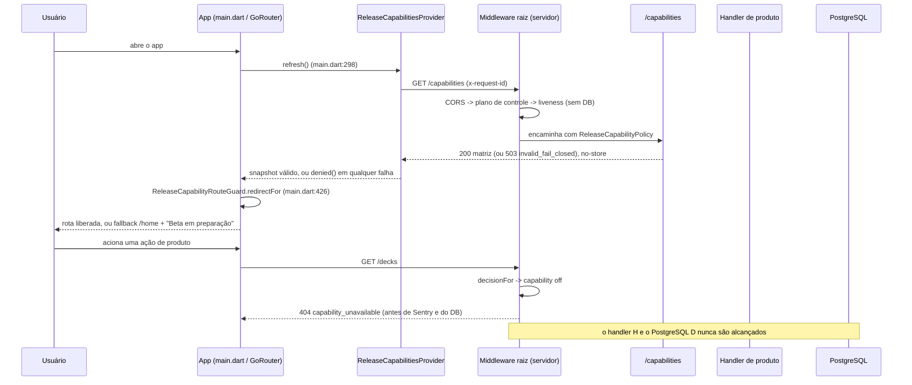

# Fluxo `release_operations` — Política de capabilities, middleware, health/ready, observabilidade e operações de release

Estado: documentação de apoio, não autoritativa · gerado em 2026-09-21 sobre o commit d26f23a16 · verificação estática (nenhum teste foi executado)

> Nota de procedência: o `HEAD` da árvore no momento da leitura é `b397f477b` ("fix(BT-UIEV-001): pin ChromeDriver in one place and recapture the UI evidence"), **dois commits à frente** de `d26f23a16`. Conferido com `git diff --name-only d26f23a16..HEAD` (115 arquivos): o delta é quase todo golden/evidência de UI e scripts de ChromeDriver. Dos arquivos citados neste documento, **nenhum** mudou, exceto `docs/MAPA_OPERACIONAL_DO_PROJETO.md`, que ganhou 22 linhas — todas após a linha 374, na seção 8 ("Contradições registradas"). As citações que faço desse documento são das seções 1, 2 e 5 (linhas 39-131), **antes** do ponto de divergência, então valem nos dois commits. Todas as linhas citadas neste documento são as do disco em `b397f477b`.
>
> **Atualização da 2ª rodada adversarial (mesmo dia):** o `HEAD` avançou para `9a9ba66de` ("fix(BT-UIEV-001): capture the Android P0 profile"). `git diff --name-only b397f477b..9a9ba66de` = 57 arquivos, **todos** golden PNG / evidência de UI sob `app/test/ui/goldens/` e fixtures. **Nenhum** arquivo de código, teste, script ou documento citado aqui mudou: todas as linhas continuam válidas em `9a9ba66de`. Ver §11.6.

---

## 1. Resumo e veredito

| Eixo | Veredito | Base |
| --- | --- | --- |
| **Implementado** | **sim** | Portão do servidor em `server/routes/_middleware.dart:105-144`, política em `server/lib/release_capability_policy.dart:123-344`, endpoint público em `server/routes/capabilities/index.dart:8-22`, portão do app em `app/lib/core/config/release_capabilities.dart:350-534` ligado em `app/lib/main.dart:426-434`. Health/ready em `server/routes/health/*` e `server/routes/ready/index.dart`. Scripts de build/deploy/SBOM/migração todos existem no disco. |
| **Alcançável hoje** | **sim** (é o único fluxo que é) | As rotas deste fluxo estão na allowlist de plano de controle (`server/lib/release_capability_policy.dart:590-620`): `GET /`, `GET /capabilities`, `GET /ready`, `GET /health`, `GET /health/live`, `GET /health/ready`, `GET /health/metrics`, `GET /health/dashboard`, `GET /health/commercial`, `GET /health/ai-history`. Nenhuma capability as segura. |
| **Provado** | **parcial** | O núcleo da política tem teste de comportamento forte (`server/test/release_capability_policy_test.dart`, 565 linhas, invoca o middleware de verdade). Os **handlers** de `/health`, `/health/live`, `/health/ready`, `/ready`, `/health/metrics` e `/health/dashboard` **não são invocados por nenhum teste** — a cobertura deles é grep de fonte (`server/test/root_liveness_contract_test.dart:20-42`, `server/test/health_readiness_support_test.dart:549-590`). No app, o guard de rota tem teste de comportamento (`app/test/core/config/release_capabilities_test.dart:352-576`), mas o contrato de superfície é grep (`app/test/core/config/release_capability_surface_contract_test.dart:8-160`). |

**O que este fluxo decide para o resto do produto.** As 29 capabilities de `server/config/release_capabilities.json` estão **todas** com `release_capability: "off"` e `allowed: false`, e `live_verified_as_of: null` no topo e em cada entrada. Consequência mecânica: toda rota classificada volta **404 `capability_unavailable`** antes do handler, antes do Sentry e antes do PostgreSQL (`server/routes/_middleware.dart:105-144` roda antes de `:146-161`). No app, o snapshot inicial é `denied()` e qualquer falha de `GET /capabilities` volta a `denied()` (`app/lib/core/config/release_capabilities.dart:256`, `:299-303`, `:313-317`).

**Os três portões são coerentes entre si.** Os 29 nomes de wire do enum do app (`app/lib/core/config/release_capabilities.dart:7-41`) batem exatamente com `releaseCapabilityKeys` do servidor (`server/lib/release_capability_policy.dart:15-45`) e com as chaves do JSON — e isso é verificado por `app/test/core/config/release_capability_surface_contract_test.dart:162-177`, que lê `../server/config/release_capabilities.json` do disco.

**O terceiro portão é o scheduler.** `server/bin/manaloom_ops_daemon.py:145-205` carrega o mesmo `server/config/release_capabilities.json` (envelope inválido ⇒ política vazia) e `_jobs_for_release_policy` (`:736-745`) só agenda um job se todas as capabilities de `JOB_REQUIRED_CAPABILITIES` (`:711-734`, 16 jobs) estiverem `allowed`. Com 29/29 `off` roda 1 de 16 (`hermes_cron_governor_report`) e o daemon sobe em `safe_housekeeping_only` com `/health` próprio na porta `MANALOOM_NATIVE_BATTLE_PORT` (`:396-465`); o deploy reasserta isso (`scripts/manaloom_deploy_ops_image.sh:366,369`).

**Onde está o risco real.** Não na política — ela é sólida e fail-closed em todas as ramificações que li. O risco está na **borda**: (a) o app transforma o código de erro de máquina `capability_unavailable` em texto de tela (achado 1); (b) o retry de GET do `ApiClient` manda um header que a política de CORS do servidor rejeita, o que quebra o retry no alvo Web (achado 2); (c) o mapa de métricas em memória cresce sem limite porque a chave inclui o path cru com IDs, e o vetor é anônimo (achados 3 e 15); (d) o gate comercial exige `healthy` em checks que a política atual emite como `disabled`, e nem chega a avaliá-los (achados 4 e 18); (e) **a primeira tela que o usuário autenticado vê não é `/home`: é `/onboarding/core-flow`, e com as 29 `off` ela pede para escolher um objetivo numa lista vazia** (achado 23, acrescentado na 2ª rodada adversarial — §11.6).

---

## 2. Jornada passo a passo

Duas jornadas convivem neste fluxo: a do **usuário** (boot → matriz → rota → tela) e a do **operador** (build → deploy → migração → probe → rollback). A tabela cobre as duas, em ordem.

| # | Passo | Tela / widget | Provider / serviço / cliente | Método + endpoint | Handler do servidor | Serviço / repositório | Tabelas |
| --- | --- | --- | --- | --- | --- | --- | --- |
| 1 | Boot do app; observabilidade sobe antes do primeiro frame | — | `AppObservability.bootstrap` `app/lib/main.dart:114-117` | — | — | `app/lib/core/observability/app_observability.dart:67` | — |
| 2 | App instancia o provider de capabilities e dispara o primeiro refresh | — | `ReleaseCapabilitiesProvider()` `app/lib/main.dart:281`; `refresh()` `app/lib/main.dart:298` | — | — | `app/lib/core/config/release_capabilities.dart:236-304` | — |
| 3 | Requisição da matriz | — | `ApiClient.get('/capabilities')` `app/lib/core/api/api_client.dart:238-305`, endpoint em `app/lib/core/config/release_capabilities.dart:251` | `GET /capabilities` | `server/routes/_middleware.dart:56-144` → `server/routes/capabilities/index.dart:8-14` | `ReleaseCapabilityPolicy.load()` `server/lib/release_capability_policy.dart:221-280` (carregado **uma vez** no estático `server/routes/_middleware.dart:22`) | nenhuma — `/capabilities` é `isDatabaseIndependentHealthPath` (`server/routes/_middleware.dart:249`), então o Pool **não** é provido |
| 4 | Servidor responde a matriz versionada | — | — | `200` se `configuration_status == valid`, `503` se inválida (`server/routes/capabilities/index.dart:16-22`); `Cache-Control: no-store` | `toPublicJson()` `server/lib/release_capability_policy.dart:198-211` | arquivo `server/config/release_capabilities.json`, digest SHA-256 do byte cru (`:269`) | — |
| 5 | App valida o envelope inteiro e monta o snapshot | — | `ReleaseCapabilitiesSnapshot.fromJson` `app/lib/core/config/release_capabilities.dart:112-142`; envelope em `:193-208`; entrada em `:70-91` | — | — | falha em qualquer campo → `denied()` (`:132`, `:115`) | — |
| 6 | Splash resolve a sessão e navega | `SplashScreen` `app/lib/features/auth/screens/splash_screen.dart:50-71` | `AuthProvider.initialize()` `app/lib/features/auth/providers/auth_provider.dart:62-82` | `GET /auth/me` (fluxo `auth_session`) | — | — | `users` |
| 7 | `GoRouter.redirect` aplica o guard de capability | — | `ReleaseCapabilityRouteGuard.redirectFor` `app/lib/core/config/release_capabilities.dart:350-534`, chamado em `app/lib/main.dart:426-434`; `refreshListenable` inclui o provider (`app/lib/main.dart:306-309`) | — | — | `ReleaseRouteBuildSupport` (`app/lib/main.dart:104-109`) faz **AND** com o servidor | — |
| 8 | Tela renderiza liberado ou negado | `HomeScreen` `app/lib/features/home/home_screen.dart:609-628`; estado negado `_BetaPreparationState` `:629-641` e `:758-796` | `context.watch<ReleaseCapabilitiesProvider>()` `:610` | nenhuma chamada quando negado — `fetchDecks()` é bloqueado em `:87-104` | — | — | — |
| 9 | Qualquer chamada de produto atravessa o portão central | qualquer tela | qualquer provider via `ApiClient` | ex.: `GET /decks`, `POST /ai/generate` | `server/routes/_middleware.dart:105-144` | `decisionFor` `server/lib/release_capability_policy.dart:158-196` + `requiredCapabilityForRequest` `:377-545` | nenhuma quando negado — a negação ocorre antes de `_db.connect()` (`:150`) |
| 10 | Probes de plataforma (operador / orquestrador) | — | curl / Swarm healthcheck | `GET /health`, `GET /health/live`, `GET /health/ready`, `GET /ready` | `server/routes/health/index.dart:13-35`, `server/routes/health/live/index.dart:7-14`, `server/routes/health/ready/index.dart:16-150`, `server/routes/ready/index.dart:9-11` (delega ao anterior) | `evaluate*Readiness` em `server/lib/health_readiness_support.dart` | `schema_migrations` (`:635-669`), `cards` (`server/routes/health/ready/index.dart:104`), `information_schema`/`pg_constraint`/`pg_index` |
| 11 | Painéis operacionais (exigem credencial) | — | `scripts/manaloom_commercial_quality_gate.sh:144-146` com `X-ManaLoom-Ops-Key` | `GET /health/metrics`, `/health/dashboard`, `/health/commercial`, `/health/ai-history` | `server/routes/health/_middleware.dart:5-13` → `operationalAdminMiddleware()` `server/lib/admin_access_support.dart:100-129` → handlers | `RequestMetricsService` `server/lib/request_metrics_service.dart:62-105`, `CommercialMetricsService`, `BattleJobMetricsService` | `users` (para resolver admin por e-mail, `server/lib/admin_access_support.dart:79-88`), tabelas comerciais/AI |
| 12 | Release: SHA congelada → artefato → migração → deploy → prova | — | `scripts/manaloom_build_beta_release.sh`, `scripts/manaloom_generate_release_sbom.py`, `scripts/manaloom_deploy_backend_image.sh`, `scripts/manaloom_deploy_battle_sidecars.sh`, `scripts/manaloom_deploy_flutter_web.sh` | `server/bin/migrate.dart:4143-4300` exige `MANALOOM_CONFIRM_POSTGRES_WRITES` **e** `MANALOOM_CONFIRM_LIVE_MUTATIONS` (`:23-24`, `:4161-4172`) | — | `schema_migrations` criada/atualizada em `:4294-4340`; rollback transacional em `:4237-4289` | `schema_migrations`, `sync_log` |

### Diagrama da jornada principal



---

## 3. Capabilities e portões

### 3.1 Portão do servidor — `server/routes/_middleware.dart:105-144`

Ordem exata por requisição (e a ordem é testada em `server/test/release_capability_policy_test.dart:371-391`):

1. `resolveRequestId` valida/gera o `x-request-id` (`server/lib/request_trace.dart:49-60` — o header do cliente só é reaproveitado se casar `^[A-Za-z0-9][A-Za-z0-9._:-]{0,95}$`, então não há log forging).
2. CORS: origem não permitida → `403 cors_origin_denied` (`:71-77`). Preflight inválido → `403 cors_preflight_rejected` (`:92-98`).
3. **Decisão de capability** (`:105`). Três desfechos de negação:
   - rota **classificada** com capability `off` → **404 `capability_unavailable`** (`server/lib/release_capability_policy.dart:187-194`);
   - rota **não classificada** e fora da allowlist → **404 `capability_route_unclassified`** (`:172-177`);
   - política inválida → **503 `capability_policy_invalid`** (`:179-186`).
4. Só depois: `ensureObservabilityInitialized()` e `_db.connect()` (`:147-161`).

O corpo da negação expõe `error`, `capability`, `release_capability`, `policy_version`, `policy_digest_sha256`, `offer_mode` com `Cache-Control: no-store` (`:128-143`).

### 3.2 Classificação — `requiredCapabilityForRequest` (`server/lib/release_capability_policy.dart:377-545`)

É um mapa por regex sobre o path normalizado (um único `/` final é removido, `:662-667`) e o método em maiúsculas. O default do final da função é `null` (`:544`), e `null` **não** significa liberado: em `decisionFor` um `null` sem entrada na allowlist vira 404 (`:168-178`). É fail-closed por construção — exatamente o que `server/test/release_capability_policy_test.dart:295-307` prova.

O varredor de `server/test/release_capability_policy_test.dart:309-342` percorre `Directory('routes')` (mais de 80 handlers) e exige que cada par método/rota esteja classificado **ou** explicitamente na allowlist. É o melhor teste deste fluxo.

### 3.3 Allowlist de plano de controle — `server/lib/release_capability_policy.dart:590-620`

É **exata por método e rota** (`server/test/release_capability_policy_test.dart:344-368` prova que `POST /health`, `GET /health/future` e `GET /reports` não passam). Os itens deste fluxo:

| Requisição | Efeito |
| --- | --- |
| `GET /` | identidade do serviço (`server/routes/index.dart:13-20`) |
| `GET /capabilities` | matriz pública |
| `GET /health` | liveness + `release_capabilities.readinessCheck()` |
| `GET /health/live` | liveness mínimo |
| `GET /health/ready` | readiness com dependências |
| `GET /ready` | alias curto do anterior |
| `GET /health/metrics` / `/dashboard` / `/commercial` / `/ai-history` | painéis, ainda protegidos por credencial operacional |

### 3.4 Camada de credencial dos painéis — `server/routes/health/_middleware.dart:5-13`

`isPublicHealthPath` (`server/lib/admin_access_support.dart:14-22`) libera apenas `/health`, `/health/live` e `/health/ready`. Tudo mais sob `/health/` passa por `operationalAdminMiddleware()` (`:100-129`), que aceita **ou** a chave `X-ManaLoom-Ops-Key` (comparação em digest de tamanho constante, mínimo de 32 caracteres, `:24-47`) **ou** um JWT de usuário listado em `MANALOOM_ADMIN_*`/`TELEMETRY_ADMIN_*` (`:57-98`). Sem nenhum dos dois: `401` do `authMiddleware` (`server/lib/auth_middleware.dart:27-34`) — que é exatamente o código que `scripts/manaloom_commercial_quality_gate.sh:219-222` exige ver (`if [ "$public_metrics_code" != "401" ]` na linha 219; a versão anterior desta linha dizia `:222-225`, que é o bloco de `service_not_converged`).

### 3.5 Portão do app — `ReleaseCapabilityRouteGuard` (`app/lib/core/config/release_capabilities.dart:350-534`)

Só decide com base no **snapshot do servidor** e no `ReleaseRouteBuildSupport` (`app/lib/main.dart:104-109`), que só pode **restringir** — `isAllowed(cap, buildSupported:)` é um AND (`:265-267`), provado em `app/test/core/config/release_capabilities_test.dart:198-218`. O cliente **não** infere acesso de `implementation_status` nem de `release_capability` (comentário explícito em `:61-64`).

Rotas alcançáveis hoje, com as 29 `off` (verificado percorrendo as **46** `GoRoute` de `app/lib/main.dart` contra o guard — `grep -c 'GoRoute(' app/lib/main.dart` = 46): `/`, `/login`, `/forgot-password`, `/reset-password`, `/verify-email`, `/legal`, `/home`, `/onboarding/core-flow`, `/plans`, `/profile` — **10**, o que confirma o número de `docs/MAPA_OPERACIONAL_DO_PROJETO.md:77`.

> Correção adversarial: a versão anterior desta linha dizia "47 `GoRoute`", contradizendo a própria seção 9 (`46`). O número correto é **46**; há 48 ocorrências de `path: ` em `app/lib/main.dart`, das quais 2 são construtores `Uri(...)` (`:373` e `:405`) e 46 são rotas (45 literais + `lifeCounterRoutePath` em `:492`).

**`/plans` foi rastreado fim a fim (rota alcançável que o documento só listava).** `PlanScreen` (`app/lib/features/commercial/screens/plan_screen.dart:13-78`) chama `provider.load()` de dentro do `build` (`:27-29`), o que é seguro porque `CommercialProvider.load()` é idempotente por `_isLoaded`/`_loadFuture` e só notifica depois de um `await` (`app/lib/features/commercial/providers/commercial_provider.dart:60-75`); `main.dart:293` já a chamou antes. Com as duas capabilities de IA `off`, `aiAvailable` é falso (`plan_screen.dart:20-26`) e o `AiUsageMeter` some: a tela degrada para `FreeBetaNotice` + atalhos legais. **`/plans` é alcançável e funcional hoje** — confirmado.

> Correção adversarial (2ª rodada): a versão anterior dizia "a única chamada HTTP da tela é `GET /users/me/plan`". **A tela não faz chamada HTTP nenhuma hoje.** `load()` (`commercial_provider.dart:60-75`) só lê `SharedPreferences`; quem chama `GET /users/me/plan` é `refreshFromServer()` (`:103`), e ela só é disparada pelo warmup quando `ai_analyze_optimize_advisory`, `ai_generate_rebuild` ou `subscriptions` estão **on** (`app/lib/main.dart:1061-1073`) — as três estão off. O endpoint continua na allowlist de plano de controle (`server/lib/release_capability_policy.dart:613`), então responderia; ele só não é chamado.

**O que o usuário vê quando é negado:**

| Situação | Efeito visível | Arquivo |
| --- | --- | --- |
| `/register` com `account_registration` off | redirect para `/login` (com o `redirect` preservado) | `app/lib/main.dart:320-329` e `app/lib/core/config/release_capabilities.dart:358-361` |
| `/decks`, `/cards`, `/collection`, `/community`, `/messages`, `/notifications`, `/life-counter` negados | redirect para `/home` | `release_capabilities.dart:363-367`, `:414-417`, `:460-476`, `:520-531` |
| `/trades`, `/marketplace`, `/market`, `/quotes`, abas 1–3 de `/collection` | redirect para `/collection?tab=0` | `:485-512` |
| `/upgrade`, `/checkout` | redirect para `/plans` | `:514-518` |
| `/decks/<id>/scan` sem scanner | redirect para `/decks/<id>/search` | `:391-395` |
| Home com deck+coleção+life-counter negados | tela "Beta em preparação / Os recursos desta versão ainda não foram liberados para uso." | `app/lib/features/home/home_screen.dart:629-641` e `:758-796` |
| Chamada HTTP que escapa do guard | **404 com o texto cru `capability_unavailable`** na tela — ver achado 1 | `app/lib/core/utils/friendly_error_mapper.dart:316-318` |

---

## 4. Contrato app↔servidor

| Endpoint | Quem chama no app | Método/caminho batem? | Corpo enviado | Campos lidos da resposta | Handler | Divergência |
| --- | --- | --- | --- | --- | --- | --- |
| `GET /capabilities` | `ReleaseCapabilitiesProvider.refresh` `app/lib/core/config/release_capabilities.dart:281` | sim | nenhum | os 10 do envelope + as 29 entradas, **exatamente** (`_hasExactKeys` `:196`, `:123`) | `server/routes/capabilities/index.dart:8-22` | **nenhuma.** `toPublicJson` (`server/lib/release_capability_policy.dart:198-211`) emite exatamente as 10 chaves que `_topLevelKeys` do app (`app/lib/core/config/release_capabilities.dart:167-178`) exige, e as 4 chaves por entrada batem (`server/…:93-98` vs `app/…:211-216`). Qualquer chave extra ou faltante de qualquer lado derruba o snapshot inteiro para `denied()`. |
| `GET /health` | **ninguém no `app/lib`.** Só `app/integration_test/*_runtime_test.dart` (9 arquivos, ex.: `app/integration_test/deck_functional_tags_runtime_test.dart:93`) | sim | — | `status` | `server/routes/health/index.dart:13-35` | Endpoint existe e é usado por probe/ops, mas **nenhum código de produção do app o consome**. |
| `GET /ready` | **ninguém no `app/lib`.** Aparece só como path de fixture em `app/test/core/api/api_client_request_id_test.dart:156,182,216,292` | sim | — | — | `server/routes/ready/index.dart:9-11` → `server/routes/health/ready/index.dart:16-150` | Consumido por `scripts/manaloom_commercial_quality_gate.sh:143` e por probes; ver achado 4. |
| `GET /health/live` | ninguém | sim | — | — | `server/routes/health/live/index.dart:7-14` | O handler **não checa o método** (único entre os irmãos); depende 100% da allowlist do middleware. Ver achado 10. |
| `GET /health/metrics`, `/health/dashboard`, `/health/commercial`, `/health/ai-history` | ninguém no app; `scripts/manaloom_commercial_quality_gate.sh:144-146` | sim | — | `.status`, `.period_count`, `.checks.*` | `server/routes/health/{metrics,dashboard,commercial,ai-history}/index.dart` | O gate lê `.checks.ai_runtime.provider_configured` e `.checks.battle_runtime.mode`, campos que **não existem** quando a capability está off. Ver achado 4. |
| Qualquer rota guardada (negação) | 41 call sites de `FriendlyErrorMapper` em `app/lib` | sim | — | **nenhum.** Nenhum arquivo do app menciona `capability_unavailable`, `capability_route_unclassified` ou `capability_policy_invalid` (grep em todo `app/`) | `server/routes/_middleware.dart:128-143` | **Divergência real:** o servidor manda `capability`, `release_capability`, `policy_version`, `policy_digest_sha256` e `offer_mode` e o app **ignora os cinco**, caindo no ramo genérico de 404. Ver achados 1 e 9. |
| Header `x-retry-attempt` no retry de GET | `app/lib/core/api/api_client.dart:322` | — | header | — | — | **Divergência real:** o header não está em `CorsPolicy.allowedHeaders` (`server/lib/cors_policy.dart:40-45`) nem em `Access-Control-Allow-Headers` (`server/routes/_middleware.dart:33-34`). Ver achado 2. |

**Endpoints deste fluxo que ninguém chama a partir do app:** `/`, `/health`, `/health/live`, `/health/ready`, `/ready`, `/health/metrics`, `/health/dashboard`, `/health/commercial`, `/health/ai-history`. É o esperado — é plano de controle, não produto — mas vale registrar que **`/capabilities` é o único endpoint deste fluxo com consumidor no app**.

---

## 5. Dados: tabelas e migrações

| Recurso | Papel neste fluxo | Onde |
| --- | --- | --- |
| `server/config/release_capabilities.json` | **fonte de verdade da política.** Não é tabela: é arquivo lido do disco no boot do processo e resumido por SHA-256 do byte cru | `server/lib/release_capability_policy.dart:221-280`; caminho default `config/release_capabilities.json` com fallback `server/config/...` (`:242-248`) |
| `schema_migrations` | readiness exige a faixa `038-058` registrada; `migrate.dart` cria, insere e (em rollback) apaga linhas | `server/lib/health_readiness_support.dart:635-669`; `server/bin/migrate.dart:4294-4340`, `:4282-4284` |
| `cards` | `COUNT(*)` no readiness; `0` vira `warning`, não `unhealthy` | `server/routes/health/ready/index.dart:99-126` |
| `users` | resolve admin por e-mail para os painéis operacionais | `server/lib/admin_access_support.dart:79-88` |
| `ai_generate_jobs`, `ai_optimize_jobs` | probes de schema (colunas, constraints, índices de idempotência) | `server/lib/health_readiness_support.dart:671-708` |
| `battle_*`, `post_game_*`, `deck_validation_*`, disponibilidade de coleção | probes de schema chamados por `/health/ready` | `server/routes/health/ready/index.dart:61-97` |
| `sync_log` | declarado no contrato do fluxo, mas escrito por `server/bin/sync_cards.dart:373`, `server/bin/sync_staples.dart:440` e lido por `server/bin/sync_status.dart:35` — **nenhum handler HTTP deste fluxo o toca** | ver seção 9 |

O processo não escreve em nenhuma tabela durante este fluxo. Toda escrita acontece fora do servidor HTTP, por `server/bin/migrate.dart`, que é bloqueado por duas frases de aprovação explícitas (`:23-24`, `:4161-4172`) e por uma checagem de destino (`migrationDestinationViolation`, `:4177-4191`) — ambas **antes** de `Connection.open`.

---

## 6. Estados e erros

| Estado | Tratado? | Onde | Observação |
| --- | --- | --- | --- |
| Carregando (`/capabilities` em voo) | **parcialmente** | `ReleaseCapabilitiesLoadState.loading` `app/lib/core/config/release_capabilities.dart:276` | O estado existe, mas `redirectFor` **não o recebe** (`:351-356` só toma `capabilities` e `buildSupport`), então "carregando" e "negado" são indistinguíveis para o roteador. Ver achado 5. |
| Vazio / matriz toda off | **sim** | `app/lib/features/home/home_screen.dart:628-642` | Tela "Beta em preparação"; nenhum CTA e nenhum fetch (provado em `app/test/features/home/home_screen_test.dart:390-419`). |
| Erro de rede em `/capabilities` | **sim, fail-closed** | `app/lib/core/config/release_capabilities.dart:299-303` | Mas visualmente idêntico ao caso anterior, e sem botão de repetir. Ver achado 6. |
| HTTP != 200 em `/capabilities` | **sim** | `:284-287` | Inclui o `503` de política inválida. `isTransientGetStatus(503)` é `true` (`app/lib/core/api/api_client.dart:186-190`), então há um retry antes — problemático no Web (achado 2). |
| Resposta 200 malformada | **sim** | `:289-293` + validação exata de chaves | Provado em `app/test/core/config/release_capabilities_test.dart:73-141`. |
| 401 / expiração de sessão | **sim** | `ApiClient._parseResponse` `app/lib/core/api/api_client.dart:623-627` com `isSessionInvalidatingUnauthorized` `:97-117`; handler registrado em `app/lib/main.dart:282` | Dispara **uma vez** por sessão (`_sessionExpiryDispatched`). `invalid_password`/`current_password_invalid` ficam locais. Provado em `app/test/core/api/api_client_request_id_test.dart:299-324` e `:326+`. |
| 403 de capability | **não existe** | — | A política nunca devolve 403 para capability; só 404 e 503. O 403 vem de CORS (`server/routes/_middleware.dart:72`, `:94`) ou de admin (`server/lib/admin_access_support.dart:110-113`). |
| 404 de capability | **no servidor sim, no app não** | `server/routes/_middleware.dart:128-143` | O app não tem ramo para os três códigos. Ver achado 1. |
| Validação de configuração | **sim, exaustiva** | `server/lib/release_capability_policy.dart:286-329` | Exige chaves exatas, `product/release_channel/offer_mode` literais, status conhecido, timestamp UTC com `Z`, e `allowed == (release_capability == 'on')` (`:320-322`). Qualquer desvio → `_invalidPolicy` com as 29 forçadas off (`:629-644`). |
| Offline / retry | **parcial** | `_getWithTransientRetry` `app/lib/core/api/api_client.dart:307-347` | Um único retry, 150 ms, só para GET, só para 500/502/503/504 e exceções. Não cobre POST/PUT/PATCH/DELETE. Quebrado no Web (achado 2). |
| Concorrência: refresh simultâneo | **sim** | `_generation` `app/lib/core/config/release_capabilities.dart:259`, `:274`, `:319-321` | Resposta antiga nunca substitui a nova. Provado em `app/test/core/config/release_capabilities_test.dart:307-349`. |
| Concorrência: troca de conta / logout | **sim** | `reset()` `app/lib/main.dart:970` e `:999`, mais `refresh()` `:1003` | Reset invalida a geração em voo; provado em `app/test/core/config/release_capabilities_test.dart:220-253`. |
| Concorrência: warmup com debounce | **sim** | `_scheduleAuthenticatedWarmup` `app/lib/main.dart:1041-1083` (timer de 1200 ms, cancelado no `paused`, `:1145-1150`) | Push só sobe **depois** de `social_push` chegar liberada (`:1075-1081`), nunca no startup genérico (`:142-147`). |
| PostgreSQL indisponível | **sim, mas perde o diagnóstico** | `server/routes/_middleware.dart:150-160` | Devolve `503 {'error':'Serviço temporariamente indisponível (DB)'}` **antes** do handler — então `/ready` nunca produz o corpo com `checks` justamente no incidente em que ele serviria. Ver achado 8. |
| Exceção não tratada | **sim** | `server/routes/_middleware.dart:215-242` | Captura no Sentry com sanitização, loga sem stack para o cliente, devolve `500` genérico com `x-request-id`. |
| Método não permitido | **sim** | `server/routes/_middleware.dart:184-191` | Normaliza 405 com corpo vazio para `{'error':'Method not allowed'}`. |

---

## 7. Testes por passo

| # | Passo | Arquivo de teste | O que de fato afirma | Tipo |
| --- | --- | --- | --- | --- |
| 2–3 | provider dispara `GET /capabilities` | `app/test/core/config/release_capabilities_test.dart:145-164` | injeta um `fetcher`, confere que o endpoint pedido é `/capabilities` e que o snapshot fica `ready` | comportamento |
| 3 | portão nega antes do handler | `server/test/release_capability_policy_test.dart:393-415` | chama `root_middleware.middleware` de verdade com `Request.get('/ai/battle/jobs')`; afirma 404, `handlerCalled == false`, `capability == 'battle_batch'`, digest SHA-256 | comportamento (o melhor teste do fluxo) |
| 3 | política inválida → 503 | `server/test/release_capability_policy_test.dart:440-466` | idem com `middlewareWithReleaseCapabilityPolicy` e política ausente; afirma 503 `capability_policy_invalid` | comportamento |
| 3 | rota não classificada + métrica | `server/test/release_capability_policy_test.dart:468-507` | duas requisições a `/future-unclassified-mutation`; afirma 404 e que o bucket `RELEASE_CAPABILITY_DENIAL …` subiu exatamente 2 | comportamento |
| 3 | ordem do portão vs Sentry vs PG | `server/test/release_capability_policy_test.dart:371-391` | compara **índices de string** no fonte de `_middleware.dart` | **só posição no texto** |
| 4 | endpoint público e `no-store` | `server/test/release_capability_policy_test.dart:159-182` | invoca `capabilityPolicyResponse`, decodifica o corpo, afirma 200/503, `cache-control`, digest e as 29 chaves | comportamento |
| 4 | política canônica é válida e 100% fechada | `server/test/release_capability_policy_test.dart:14-36` | carrega o JSON real do disco; afirma `isValid`, as 29 chaves, `allowed == false` em todas e `live_verified_as_of == null` | comportamento |
| 4 | falha fechada em config ausente/contraditória/status desconhecido/isolada | `:38-70`, `:72-108`, `:110-157` | grava fixtures em `Directory.systemTemp` e recarrega; cobre as 4 formas de rejeitar o override isolado | comportamento |
| 3 | classificação de rota | `server/test/release_capability_policy_test.dart:186-246` | 37 pares método/rota → capability esperada, mais `battle-preflight?mode=interactive` | comportamento |
| 3 | allowlist exata + toda rota classificada | `:248-293`, `:295-307`, `:309-342`, `:344-368` | o de `:309-342` varre `Directory('routes')` e exige > 80 handlers classificados ou na allowlist | comportamento (com heurística: os métodos são inferidos por regex `HttpMethod\.(get\|post\|…)` no fonte, `:554-565`) |
| 5 | parsing e fail-closed do envelope no app | `app/test/core/config/release_capabilities_test.dart:34-141` | 8 mutações de envelope + entradas faltantes/extras/malformadas; todas devem zerar o snapshot | comportamento |
| 5 | refresh nunca preserva permissão antiga | `:255-305` | 3 casos (503, 200 malformado, exceção) após um refresh bem-sucedido | comportamento |
| 7 | guard de rota | `app/test/core/config/release_capabilities_test.dart:361-406` | 29 pares URI→fallback com a matriz toda negada | comportamento |
| 7 | AND com build support; abas; Play vs AI × replays | `:408-461`, `:463-522`, `:524-575` | inclusive que `battle_coach` e `battle_batch` são independentes | comportamento |
| 7/8 | superfícies consomem o contrato | `app/test/core/config/release_capability_surface_contract_test.dart:8-160` | 15 arquivos × tokens; `expect(source, contains(token))` — **não instancia nada** | **só string** |
| 5/7 | enum do app == matriz do backend | `:162-177` | lê `../server/config/release_capabilities.json` e compara os conjuntos de nomes + `hasLength(29)` | comportamento sobre dados reais |
| 7 | reset em troca de conta/logout | `:179-205` | conta ocorrências de `_releaseCapabilitiesProvider.reset()` por regex e casa um bloco literal com `\n      ` | **só string** — quebra com qualquer reformatação |
| 8 | home com tudo off | `app/test/features/home/home_screen_test.dart:390-419` | renderiza, afirma os dois textos, ausência de todos os CTAs e `deckProvider.fetchCalls == 0` | comportamento |
| 10 | `/ready` delega para `/health/ready` | `server/test/health_readiness_support_test.dart:549-565` | lê o fonte de `routes/ready/index.dart` e procura o import e a chamada; e procura uma linha em `doc/API_CONTRACTS_AND_DATA_MAP.md` | **só string** |
| 10 | readiness não vaza exceção | `:567-590` | 15 `expect(source, contains(...))` sobre dois arquivos | **só string** |
| 10 | liveness não exige PostgreSQL | `server/test/root_liveness_contract_test.dart:8-18` | chama `isDatabaseIndependentHealthPath` com 9 paths | comportamento (da função, não do handler) |
| 10 | `/health` prova runtime isolado | `:29-42` | `expect(source, contains(...))` sobre `routes/health/index.dart` | **só string** |
| 10 | funções de readiness | `server/test/health_readiness_support_test.dart:11-547` | ~20 testes que **chamam** `evaluate*Readiness` com `DotEnv` e probes injetados; cobrem AI, battle, live spectator, interactive, schema | comportamento |
| 11 | chave de ops e paths públicos | `server/test/admin_access_support_test.dart:20-65` | chama `isConfiguredOpsRequestKey` e `isPublicHealthPath` | comportamento (das funções) |
| 3 | CORS | `server/test/cors_policy_test.dart:6-68` | origens exatas em produção, loopback só com opt-in, preflight rejeita método/header desconhecido | comportamento — nunca testa `x-retry-attempt` (achado 2), **mas** `:59-66` já prova o mecanismo com `X-Unsafe-Header` → `isFalse`; o que falta é ligar o nome do header que o app realmente manda ao contrato |
| 3 | cabeçalhos de segurança | `server/test/root_security_headers_contract_test.dart:6-24` | `expect(source, contains(...))` | **só string** |
| — | sanitização de observabilidade | `server/test/observability_test.dart:9-117` | sanitiza headers, aninhados, evento Sentry, e-mail/FCM em log, taxa de trace | comportamento |
| 12 | rollback convergente de deploy | `server/test/deploy_rollback_convergence_contract_test.dart:15-165` | 7 testes que leem os scripts `.sh` e exigem fragmentos literais | **só string** |
| 12 | digest imutável de ops/sidecars | `server/test/ops_sidecar_digest_release_contract_test.dart:11-307` | 13 testes, mesmo padrão (fragmentos literais de shell) | **só string** |
| 12 | deploy Flutter Web sob `/app` | `server/test/flutter_web_deploy_contract_test.dart:6+` | idem | **só string** |
| 12 | migrações | `server/test/data_model_migration_test.dart` (981 linhas) | mistura: SQL real + checagens de fonte | misto |
| 12 | escopo do SBOM | `server/test/release_sbom_scope_test.py` | Python, executado por `scripts/manaloom_release_ops_contract_test.sh:211` | comportamento |

### Passos sem teste nenhum

1. **Os handlers HTTP de `/health`, `/health/live`, `/health/ready`, `/ready`, `/health/metrics`, `/health/dashboard`, `/health/commercial`, `/health/ai-history` nunca são invocados por um teste.** Nenhum arquivo em `server/test` importa esses módulos — só lê o fonte deles como texto (`grep -rn "routes/health\|routes/ready" server/test`). Contraste com `/capabilities`, que **é** invocado (`server/test/release_capability_policy_test.dart:10`, `:161`).
2. **A composição de `server/routes/health/_middleware.dart:5-13` não tem teste.** As duas funções auxiliares têm (`server/test/admin_access_support_test.dart`), mas os três ramos do middleware (path público → passa; ops key → passa; nem um nem outro → 401/403) não são exercitados.
3. **`RequestMetricsService` só aparece em teste de forma incidental** (`server/test/release_capability_policy_test.dart:473-505`, para contar um bucket de negação). Não há teste de cardinalidade, eviction ou do formato do snapshot — ver achado 3.
4. **`ReleaseCapabilityRouteGuard` não tem teste com `GoRouter` real.** Todos os testes chamam `redirectFor` diretamente; nenhum monta o roteador de `app/lib/main.dart:304-438`, então a interação entre a checagem de auth (`:389-396`) e o guard (`:426-434`) — e a corrida do achado 5 — não é coberta.
5. **`_disablePushForSession` / `_onReleaseCapabilitiesChanged` (`app/lib/main.dart:1009-1026`, `:1125-1131`) não têm teste.** O único teste que os toca é o de string (`app/test/core/config/release_capability_surface_contract_test.dart:179-205`).

### Testes que só verificam string/posição

`server/test/release_capability_policy_test.dart:371-391` e `:509-522`; `server/test/root_liveness_contract_test.dart:20-42`; `server/test/root_security_headers_contract_test.dart`; `server/test/health_readiness_support_test.dart:549-590`; `server/test/deploy_rollback_convergence_contract_test.dart` (inteiro); `server/test/ops_sidecar_digest_release_contract_test.dart` (inteiro); `server/test/flutter_web_deploy_contract_test.dart` (inteiro); `app/test/core/config/release_capability_surface_contract_test.dart` (inteiro). O caso mais frágil é `app/test/core/config/release_capability_surface_contract_test.dart:194-199`, que casa um literal com indentação embutida (`'…reset();\n      // Registration and…'`) — qualquer `dart format` diferente quebra o teste sem que nada de comportamento mude.

---

## 8. Achados

| # | Tipo | Sev. | Achado | Arquivo:linha | Como provar |
| --- | --- | --- | --- | --- | --- |
| 1 | bug-provável / ux-funcional | **alta** | O app mostra o **código de erro de máquina em inglês** como texto de tela numa negação de capability. `_messageFromBody` lê `body['error']`, nenhum matcher casa `capability_unavailable`, e `_looksTechnical('capability_unavailable')` é `false` (a string não contém `exception`, `http `, `/decks`, `trace`, …) — então o ramo `if (!_looksTechnical(text)) return text;` devolve a string crua. Vale igual para `capability_route_unclassified` (404). **Correção adversarial: NÃO vale para `capability_policy_invalid`** — esse vem com **503**, e `fromStatusCode` só consulta `_messageFromBody` quando `statusCode < 500` (`:51-52`), então o 503 cai no ramo genérico "Servidor indisponível no momento" (`:122-124`) e nunca vaza. São **41** call sites de `FriendlyErrorMapper.fromApiResponse` em `app/lib` (o caminho que passa `response.data` como `body`); o total de usos de `FriendlyErrorMapper.` é **103 ocorrências em 26 arquivos**, sendo 61 de `fromException`. | `app/lib/core/utils/friendly_error_mapper.dart:51-52`, `:266`, `:317-318`, `:345-369` | Teste de unidade em `app/test/core/utils/`: `expect(FriendlyErrorMapper.fromStatusCode(404, body: const {'error':'capability_unavailable'}), isNot(contains('capability_')))`. Hoje ele falha devolvendo `capability_unavailable`. |
| 2 | incoerência-app-servidor | **alta** | O retry de GET adiciona `x-retry-attempt`, que **não está** em `CorsPolicy.allowedHeaders` nem no `Access-Control-Allow-Headers` do middleware. No alvo **Flutter Web** (deployado por `scripts/manaloom_deploy_flutter_web.sh`) o navegador bloqueia a segunda requisição — o preflight em cache já não autoriza o header — e um 500/502/503/504 que seria recuperado vira exceção dura. Web é um dos dois alvos declarados (`docs/MAPA_OPERACIONAL_DO_PROJETO.md:45`). | `app/lib/core/api/api_client.dart:322` vs `server/lib/cors_policy.dart:40-45` e `server/routes/_middleware.dart:33-34` | Adicionar a `server/test/cors_policy_test.dart:43` um `expect(policy.isValidPreflight(requestedMethod:'GET', requestedHeaders:'content-type,authorization,x-request-id,x-retry-attempt'), isTrue)` — falha hoje. Prova viva: servir a app Web contra um backend que devolva 503 em `/capabilities` e ver o erro de CORS no console. |
| 3 | bug-provável / seguranca | **alta** | `RequestMetricsService` usa como chave `'<MÉTODO> <path cru>'`, com IDs embutidos, e o mapa **nunca é podado**. Cada path distinto cria um bucket permanente com até 200 latências. `/health/metrics` e `/health/dashboard` serializam o mapa inteiro. Em processo de longa duração é crescimento de memória sem teto e uma resposta de painel que cresce sem teto. **Correção adversarial:** com as 29 `off`, `/decks/<id>` e `/trades/<id>` **não** criam buckets distintos — a negação retorna antes e grava o bucket único `RELEASE_CAPABILITY_DENIAL capability_unavailable` (`_middleware.dart:117-121`), sem nunca chegar ao `record(endpoint: endpoint)` de `:201-205`. O vetor **alcançável hoje** é outro: ver achado 15. | chave montada em `server/routes/_middleware.dart:60-61`; gravação do caminho cru em `:201-205`; mapa sem eviction em `server/lib/request_metrics_service.dart:66-79`; serialização em `:81-105` | Teste de unidade: gravar 10 000 endpoints distintos e afirmar um teto de buckets. Hoje `snapshot()['endpoints']` tem 10 000 chaves. Prova viva correta: `GET /reports/<uuid aleatório>` repetido (achado 15) — **não** `/decks/<id>`. |
| 4 | incoerencia-app-servidor / doc-defasada | **média** | O gate comercial exige `.checks.ai_runtime.status == "healthy"`, `.provider_configured == true`, `.mock_fallbacks_allowed == false`, `.checks.battle_runtime.status == "healthy"`, `.mode == "auto"` e 3 engines saudáveis. Sob a política atual (todas off), `evaluateReleaseCapabilityRuntimeReadiness` emite para os dois um objeto `{status:"disabled", capability, release_capability, policy_digest_sha256}` — sem `provider_configured`, sem `mode`, sem `engines`. O gate é **estruturalmente vermelho** enquanto a free beta estiver fechada. | `scripts/manaloom_commercial_quality_gate.sh:207-217` vs `server/lib/health_readiness_support.dart:1653-1714` (ramos `else`) e `:1718-1730` (`disabledReleaseCapabilityReadinessCheck`) | **Correção adversarial: rodar o gate NÃO produz `issues=ai_runtime_not_production_ready`.** O gate tem `set -euo pipefail` (`:2`) e morre antes da avaliação de issues, no `manaloom_product_smoke.sh` — ver achado 18. A prova barata e offline é a única viável: teste que carrega a política real e afirma `evaluateReleaseCapabilityRuntimeReadiness(...).checks['ai_runtime']['status'] == 'disabled'`, documentando a incompatibilidade com `:207-217`. |
| 5 | estado-nao-tratado | **média** (hipótese com prova limpa) | O guard de rota só recebe o **snapshot**, nunca o `loadState`, e a Splash navega assim que a **auth** resolve, sem esperar `/capabilities`. Se a matriz ainda estiver `loading` quando a Splash faz `context.go(deepLink)`, o guard nega e reescreve o destino — e quando a matriz chega liberada o roteador reavalia a rota **já reescrita**, então o deep link é perdido para sempre. O `minimumDwell` de 650 ms (`splash_screen.dart:54`) dá vantagem ao `/capabilities`, mas não é garantia. | `app/lib/core/config/release_capabilities.dart:351-356` (assinatura sem `loadState`); `app/lib/features/auth/screens/splash_screen.dart:50-71`; `app/lib/main.dart:426-434` | Widget test com `GoRouter` real: `ReleaseCapabilitiesProvider(fetcher: () => completer.future)`, autenticar, `router.go('/decks/abc')`, `pump`, completar o fetcher com `decks_private: on`, `pumpAndSettle` e afirmar que a localização final é `/decks/abc`. Hoje deve terminar em `/home`. |
| 6 | ux-funcional | **média** (escopo corrigido na 2ª rodada) | "Beta em preparação / Os recursos desta versão ainda não foram liberados para uso." é exibido **igual** para (a) política deliberadamente fechada e (b) `/capabilities` inalcançável ou 503. `build` só olha o `snapshot` (`home_screen.dart:610-628`), nunca o `loadState`, e **não existe nenhum controle de repetir na tela**. **Correção adversarial: é falso que "a única reaquisição automática seja `resumed`".** Há quatro: boot (`main.dart:298`), virada para autenticado (`:977` → `_refreshCapabilitiesAndWarmup` → `refresh()` em `:1032`), virada para não autenticado (`:1003`) e `didChangeAppLifecycleState.resumed` (`:1134-1144`, só com sessão autenticada). O defeito que sobra é **exatamente** a indistinguibilidade visual e a ausência de affordance: o usuário não tem como saber que é rede nem como pedir nova tentativa sem sair da sessão ou tirar o app do foco. | `app/lib/features/home/home_screen.dart:629-641`, `:758-796`; ausência de ramo por `loadState` em `:610-628`; reaquisições em `app/lib/main.dart:298`, `:977`, `:1003`, `:1028-1039`, `:1134-1144` | Widget test com `ReleaseCapabilitiesProvider(fetcher: (_) async => throw StateError('offline'))`: afirmar um texto distinto de "Beta em preparação" e um controle de repetir. Prova viva: subir a app Web com a API desligada. |
| 7 | seguranca | **média** | `/health/ready` e `/ready` são **públicos e não autenticados** (`isPublicHealthPath` libera `/health/ready`; `/ready` mora fora de `routes/health/`, então nem passa pelo `_middleware` de health) e expõem `environment`, `e2e_isolated_runtime`, contagem de cartas, a lista nomeada de migrações `038-058`, o estado de **5** schemas (`release_schema`, `deck_validation_schema`, `ai_job_schema`, `battle_job_schema`, `collection_availability_schema` — a versão anterior dizia 6) e `policy_digest_sha256`. | `server/lib/admin_access_support.dart:14-22`; `server/routes/ready/index.dart:9-11`; corpo em `server/lib/health_readiness_support.dart:1731-1747` e `server/routes/health/ready/index.dart:61-138` | `curl -s https://<api>/ready | jq` na prova viva. Decisão de produto: manter (probes externos precisam) ou reduzir o corpo público a `{status}` e mover os detalhes para `/health/dashboard`. |
| 8 | estado-nao-tratado | **média** (escopo corrigido) | Com o PostgreSQL fora **e o processo ainda sem nenhuma conexão bem-sucedida** (cold start / primeiro request após deploy), `/ready` não chega ao handler: `_db.connect()` engole o erro e deixa `_connected = false` (`server/lib/database.dart:129-135`), e o middleware devolve `503 {'error':'Serviço temporariamente indisponível (DB)'}` sem `checks`. **Correção adversarial: o "nunca" original é falso.** `_connected` é uma trava de mão única (`_middleware.dart:19`, `:150`, `:159`; `database.dart:44` `if (_connected) return;`): depois do primeiro sucesso o middleware **não** reavalia, então uma queda posterior do Postgres deixa `/ready` chegar ao handler e produzir `checks.database.error_code = database_check_failed` normalmente. O buraco é só o cold start — que, por sinal, é a forma mais comum do incidente de deploy. | `server/routes/_middleware.dart:19`, `:150-160`; `server/lib/database.dart:43-44`, `:129-135`; corpo esperado em `server/routes/health/ready/index.dart:38-59` | Teste do middleware com um `Database` que falha ao conectar, afirmando que a resposta de `/ready` preserva `checks.database`. Ou prova viva **subindo o servidor com o Postgres já parado** (não basta parar depois). |
| 9 | outro (observabilidade) | **baixa** | A métrica de negação é agregada **só por motivo**: a chave é `'RELEASE_CAPABILITY_DENIAL <errorCode>'`. `/health/metrics` não consegue dizer qual rota ou qual capability foi negada — isso só existe na linha de log. Com tudo off, é a métrica mais movimentada do serviço e a menos informativa. | `server/routes/_middleware.dart:117-121` vs log em `:122-127` | Ler `/health/metrics` depois de negar `/decks` e `/trades`: um único bucket. Corrigir incluindo a capability na chave (conjunto fechado de 29, então continua limitado). |
| 10 | bug-provável | **baixa** | `server/routes/health/live/index.dart:7` é o **único** handler do fluxo sem checagem de método; depende inteiramente de a allowlist conter só `GET /health/live`. Hoje está correto (um `POST /health/live` vira 404 `capability_route_unclassified`), mas é uma assimetria que só se mantém por acidente da allowlist — e que o varredor de rotas **encobre de propósito**, ver achado 20. | `server/routes/health/live/index.dart:7-14`, comparado a `server/routes/health/index.dart:14-16` e `server/routes/health/metrics/index.dart:9-11` | Teste: passar `Request.post('/health/live')` pelo `root_middleware.middleware` e afirmar 404; depois adicionar o guard de método no handler e afirmar 405 via chamada direta. |
| 11 | doc-defasada | **média** | O fluxo `release_operations` de `docs/project_logic_contracts.json` **não nomeia** o núcleo da plataforma: nem `/capabilities` nos `entrypoints`, nem `server/routes/_middleware.dart` / `server/lib/release_capability_policy.dart` / `server/routes/capabilities/index.dart` / `app/lib/core/config/release_capabilities.dart` em `implementation`, nem `server/test/release_capability_policy_test.dart` / `health_readiness_support_test.dart` / `root_liveness_contract_test.dart` em `tests`. E `public_api_paths` omite `/capabilities`, que é o único endpoint público realmente consumido pelo app antes do login. | `docs/project_logic_contracts.json`, chave `flows[id=release_operations]` e chave `public_api_paths` | Comparar as listas declaradas com esta seção 4. O gate de project logic **não pega**: `_validateDeclaredPaths` (`tools/project_logic/lib/project_logic_generator.dart:1422-1456`) só verifica que os caminhos declarados **existem**, nunca que a lista é completa. |
| 12 | doc-defasada | **baixa** | `docs/MAPA_OPERACIONAL_DO_PROJETO.md:100` registra life_counter como "`life_counter_local` (sem rota)", mas a rota existe: `GoRoute(path: lifeCounterRoutePath)` com `lifeCounterRoutePath = '/life-counter'`. O que não existe é CTA alcançável — a rota está lá e é negada pelo guard. | `app/lib/main.dart:491-501`; `app/lib/features/home/life_counter_route.dart:4`; guard em `app/lib/core/config/release_capabilities.dart:363-367` | Ler os dois arquivos. Ajustar o texto para "rota existe, bloqueada pelo guard". |
| 13 | passo-sem-teste | **média** | Nenhum teste invoca os handlers de `/health`, `/health/live`, `/health/ready`, `/ready`, `/health/metrics`, `/health/dashboard`. Toda a "cobertura" deles é `expect(source, contains(...))`. Um handler pode ser reescrito para devolver 200 sempre e os testes continuam verdes desde que as strings sobrevivam. | `server/test/root_liveness_contract_test.dart:20-42`; `server/test/health_readiness_support_test.dart:549-590` | Copiar o padrão `_CapabilityRequestContext` de `server/test/release_capability_policy_test.dart:525-539`, estendê-lo com `read<Pool>()`/`read<ReleaseCapabilityPolicy>()` falsos e chamar `onRequest` de verdade. |
| 14 | passo-sem-teste | **baixa** | Os três ramos de `server/routes/health/_middleware.dart` (path público, ops key, nenhum dos dois) não são exercitados. Só as duas funções auxiliares têm teste. | `server/routes/health/_middleware.dart:5-13`; testes existentes em `server/test/admin_access_support_test.dart:20-65` | Teste de middleware com `Request.get('/health/metrics')` sem header (espera 401), com header errado (401), com header certo (passa). |

### Achados acrescentados na verificação adversarial

| # | Tipo | Sev. | Achado | Arquivo:linha | Como provar |
| --- | --- | --- | --- | --- | --- |
| 15 | seguranca / bug-provável | **alta** (ampliado na 2ª rodada) | **O crescimento sem teto do achado 3 é explorável HOJE por um chamador anônimo, e o documento original apontou o vetor errado.** `GET /reports/<id>` é plano de controle explícito (`server/lib/release_capability_policy.dart:471-473` devolve `null`, e `:584-585` o libera por regex `^/reports/[^/]+$`), o handler não tem `authMiddleware` nenhum (`server/routes/reports/[id].dart:7-23`, e não existe `server/routes/reports/_middleware.dart`), e o middleware raiz grava `record(endpoint: 'GET /reports/<id>')` **depois** do handler, qualquer que seja o status (`server/routes/_middleware.dart:201-205`). Cada id distinto — válido ou não — cria um bucket permanente. Sem rate limit no caminho. **Ampliação da 2ª rodada: `/reports/<id>` não é o único vetor, e nem sequer precisa de 200.** O `record` de `:201-205` roda para **qualquer** resposta que o handler devolva, inclusive o `401` do `authMiddleware`. Então todo path de plano de controle definido por regex com segmento livre também cria bucket permanente sem token: `GET`/`POST`/`DELETE /users/<id>/block` (`release_capability_policy.dart:558-561`), `DELETE /users/<id>/follow` (`:562-565`), `POST /community/decks/<id>/reports` (`:566-569`), `POST /content-reports/<id>/appeals` (`:576-579`), `PUT /moderation/reports/<id>` (`:580-583`) e — com **dois** segmentos livres — `DELETE /community/decks/<a>/comments/<b>` (`:570-575`). O `users/_middleware.dart:4-6` só acrescenta `authMiddleware`: ele barra o handler, não a métrica. | `server/lib/release_capability_policy.dart:558-585`; `server/routes/reports/[id].dart:7`; `server/routes/users/_middleware.dart:4-6`; `server/routes/_middleware.dart:201-205`; `server/lib/request_metrics_service.dart:66-79` | `for i in $(seq 1 200); do curl -s -o /dev/null "$API/reports/$(uuidgen)"; done` e depois `curl -sS $API/health/metrics -H "X-ManaLoom-Ops-Key: $OPS" \| jq '.endpoints\|keys\|length'` — o número cresce ~200. Repetir com `curl -s -o /dev/null "$API/users/$(uuidgen)/block"` (sem token, 401) e conferir que **também** cresce. Teste offline: chamar `root_middleware.middleware` 200× com ids distintos e afirmar um teto em `RequestMetricsService.instance.snapshot()['endpoints']`. |
| 16 | estado-nao-tratado | **média** | **`GET /` e `GET /health/metrics` estão acoplados ao PostgreSQL embora seus handlers não leiam o `Pool`.** `isDatabaseIndependentHealthPath` só lista `/capabilities`, `/health` e `/health/live` (`server/routes/_middleware.dart:248-255`), então num cold start com o banco fora os dois devolvem `503 {'error':'Serviço temporariamente indisponível (DB)'}`. Consequências: (a) `/` — declarado público em `project_logic_contracts.json.public_api_paths` e usado como identidade do serviço — para de responder; (b) o gate comercial exige `public_metrics_code == 401` (`scripts/manaloom_commercial_quality_gate.sh:146`, `:219-222`) e vê `503`, virando `operational_metrics_not_protected`; (c) `/health/metrics`, o painel que o operador quer justamente durante um incidente de banco, é o que some. Nenhum teste pega: `server/test/root_product_identity_test.dart:11` chama `root_route.onRequest` **direto**, sem o middleware. | `server/routes/_middleware.dart:248-255` vs `server/routes/index.dart:13-20` e `server/routes/health/metrics/index.dart:8-21` | Teste do middleware com um `Database` sem conexão, afirmando que `GET /` devolve 200. Prova viva: subir o servidor com o Postgres parado e fazer `curl -si $API/` e `curl -so /dev/null -w '%{http_code}' $API/health/metrics`. |
| 17 | estado-nao-tratado | **média** | **A trava `_connected` é de mão única.** `server/routes/_middleware.dart:19` declara `var _connected = false`; `:150-160` só entra no bloco quando `!_connected` e `Database.connect()` retorna cedo quando já conectou (`server/lib/database.dart:44`). Depois do primeiro sucesso o portão de banco nunca mais é avaliado: se o pool morre, cada request segue para o handler e estoura como `500 {'error':'Erro interno do servidor'}` no `catch` (`:215-241`), em vez do contrato `503`. O `Pool` continua sendo provido (`:173`) apontando para uma conexão morta. Nenhum teste cobre a trava. | `server/routes/_middleware.dart:19`, `:150-160`, `:215-241`; `server/lib/database.dart:43-44` | Teste com um `Database` falso que aceita a primeira conexão e depois falha; afirmar que a segunda requisição ainda devolve 503 (hoje devolve 500). |
| 18 | incoerencia-app-servidor | **média** (linha de morte corrigida na 2ª rodada) | **O gate comercial não é "estruturalmente vermelho": é estruturalmente inexecutável.** Ele aborta antes de avaliar as `issues` das linhas 199-263. **Correção adversarial: a linha de morte citada antes (`manaloom_product_smoke.sh:181`, `curl -fsS POST /auth/register`) está errada — o smoke morre 24 linhas antes.** A ordem real das barreiras é: (a) `require_live_mutation_approval` / `require_postgres_write_approval` no topo do próprio gate (`manaloom_commercial_quality_gate.sh:9-10`, frases `I_HAVE_EXPLICIT_APPROVAL`) — sem elas nada roda; (b) já dentro do smoke, `jq -e '… .checks.battle_runtime.status == "healthy" and .checks.battle_runtime.mode == "auto" and …engines.xmage/forge/native…'` sobre `/ready` (`manaloom_product_smoke.sh:157-164`): com `battle_batch` off o objeto é `{status:"disabled"}` (achado 4), o filtro dá `false`, `jq -e` sai 1 e `set -euo pipefail` (`:2`) mata o script **ali**; (c) só se aquilo passasse é que `:181` (`curl -fsS POST /auth/register` → 404) mataria. O gate roda o smoke em pipe (`manaloom_commercial_quality_gate.sh:160-163`) sob `set -euo pipefail` (`:2`), então a morte propaga. `scripts/manaloom_ai_generation_benchmark.sh:174` (invocado em `:165-168`) tem o mesmo `curl -fsS POST /auth/register`. | `scripts/manaloom_commercial_quality_gate.sh:2`, `:9-10`, `:162`, `:167`; `scripts/manaloom_product_smoke.sh:2`, `:157-164`, `:181`; `scripts/manaloom_ai_generation_benchmark.sh:2`, `:174` | Ler os `set -euo pipefail`, o `jq -e` de `:157-164` e o `curl -fsS`. Prova viva (se houver ambiente descartável): rodar o gate e observar que ele para no smoke, antes do `summary.json`. |
| 19 | ux-funcional | **baixa** (escopo reduzido na 2ª rodada) | **O vazamento de código cru do achado 1 é maior do que uma família de capability, mas menos do que a versão anterior afirmava.** Qualquer 4xx cujo `error` seja uma string de máquina atravessa `friendly_error_mapper.dart:317-318`. Confirmado e alcançável: `Method not allowed` (405, `server/routes/_middleware.dart:188` e `server/lib/http_responses.dart:41-44`) — renderizado literalmente, em inglês. **Correção adversarial: `cors_origin_denied` e `cors_preflight_rejected` (403, `_middleware.dart:74`, `:95`) são inalcançáveis como texto de tela** — no Web o navegador bloqueia a resposta reprovada por CORS e o app recebe exceção, nunca o corpo; fora do Web o cliente não manda `Origin`, e `CorsPolicy.isAllowed(null)` devolve `true` (`server/lib/cors_policy.dart:52`), então esses 403 nem acontecem. Ficam como dívida latente, não como defeito observável. | `app/lib/core/utils/friendly_error_mapper.dart:317-318`, `:345-369` vs `server/routes/_middleware.dart:188`; refutação em `server/lib/cors_policy.dart:52` | Estender o teste do achado 1 com `{'error':'Method not allowed'}` e afirmar que não aparece cru. Os dois códigos de CORS não precisam de teste de UI. |
| 20 | passo-sem-teste | **baixa** | **O melhor teste do fluxo encobre exatamente o achado 10.** `_declaredRouteMethods` (`server/test/release_capability_policy_test.dart:554-565`) devolve `{'GET'}` *hard-coded* quando o fonte do handler não contém nenhum `HttpMethod.` — e o único caso são `/health/live` e `/ready`. Ou seja: o varredor de `:309-342` trata a ausência de checagem de método como se fosse uma checagem `GET`. Se `routes/health/live/index.dart` passasse a aceitar POST, o varredor continuaria verde. | `server/test/release_capability_policy_test.dart:559-563` | Ler a condição `if (methods.isEmpty && (path == '/health/live' \|\| path == '/ready'))`. Correção: adicionar o guard de método no handler e remover o caso especial do teste. |
| 21 | bug-provável | **baixa** | **O retry de GET descarta a primeira resposta.** Em `_getWithTransientRetry`, quando a tentativa 0 devolve 500/502/503/504 o corpo e o status são jogados fora (`continue`, `app/lib/core/api/api_client.dart:327-333`); se a tentativa 1 lançar, o `rethrow` de `:337` propaga a exceção da segunda tentativa e o 503 original se perde — o chamador vê exceção em vez de `ApiResponse(503, …)`. É exatamente o que acontece no Web quando o preflight do `x-retry-attempt` é rejeitado (achado 2). Bônus: o `throw StateError('GET retry exhausted: …')` de `:346` é inalcançável (a tentativa 1 sempre retorna ou lança). | `app/lib/core/api/api_client.dart:327-346` | Teste com `MockClient` que devolve 503 na 1ª e lança na 2ª: hoje o `get` lança; o esperado é devolver a `ApiResponse(503, …)` da 1ª. |
| 23 | ux-funcional / estado-nao-tratado | **alta** | **A primeira tela autenticada da free beta não é `/home` — é `/onboarding/core-flow`, e sob a política atual ela é um beco sem saída.** `AuthProvider._needsOnboarding` nasce `true` (`app/lib/features/auth/providers/auth_provider.dart:32`) e só vira `false` se o armazenamento local disser que o onboarding foi resolvido (`:564`); em falha de armazenamento volta a `true` (`:568`, `:582`). Logo `defaultAuthenticatedLocation` é `/onboarding/core-flow` (`:48-50`) — e é esse valor que a Splash usa em `resolveAuthenticatedLocation` (`splash_screen.dart:63-70`) e que o roteador usa ao sair de rota de auth (`main.dart:418-421`). A rota existe (`main.dart:518-528`), é protegida mas **não tem regra no `ReleaseCapabilityRouteGuard`**, então passa. Dentro dela, `_goalIsAllowed` exige `decks_private`, ou `catalog_private`+`collection_private`, ou `life_counter_local`, ou o trio de IA (`onboarding_core_flow_screen.dart:378-398`): com as 29 `off`, `availableGoals` é **lista vazia** (`:402-405`), `effectiveGoal` é `null` (`:406-408`) e `canStart` é permanentemente `false` (`:416-417`). E `_GoalRail` **não tem estado vazio**: renderiza o cabeçalho "1 · Escolha seu objetivo / Você pode mudar depois. Agora escolha o que precisa resolver." e o laço `for (final goal in goals)` não emite nada (`:786-830`). O usuário recebe uma instrução para escolher numa lista inexistente, com o CTA primário morto; a única saída é o `TextButton` "Pular por enquanto" (`:541-558`), que só aparece enquanto `_disposition == pending`. Isto também **derruba o passo "APP WEB 2" do roteiro de prova viva** desta mesma versão do documento, que esperava `/home` com "Beta em preparação". | `app/lib/features/auth/providers/auth_provider.dart:32`, `:48-50`, `:564`; `app/lib/main.dart:418-421`, `:518-528`; `app/lib/features/auth/screens/splash_screen.dart:63-70`; `app/lib/features/home/onboarding_core_flow_screen.dart:378-398`, `:402-417`, `:786-830` | Widget test: montar `OnboardingCoreFlowScreen` com `ReleaseCapabilitiesProvider.seeded(const {})` e afirmar que existe um estado vazio explicativo (hoje: `find.byType(_GoalRow)` = 0 sem nenhum texto de explicação). Prova viva Web: entrar com usuário de teste em navegador limpo → hoje cai em `/onboarding/core-flow` com a lista de objetivos vazia, **não** em `/home`. |
| 24 | seguranca | **média** | **`GET /reports/{id}` é público, anônimo e devolve o texto da exceção no corpo do 500.** O handler captura tudo e chama `internalServerError('Falha ao carregar relatorio compartilhavel', details: error)` (`server/routes/reports/[id].dart:18-23`), e `apiError` coloca `details: details.toString()` dentro do JSON (`server/lib/http_responses.dart:5-15`, `:35-39`). Como a rota é plano de controle sem `authMiddleware` (achado 15), qualquer chamador anônimo que provoque uma falha na camada de dados recebe a mensagem crua do driver PostgreSQL — que costuma nomear tabela, coluna e tipo. O `catch` genérico do middleware raiz (`_middleware.dart:237-241`, corpo `{'error':'Erro interno do servidor'}`) **não protege**: ele só vale para exceção que escapa do handler, e aqui o handler já devolveu a resposta pronta. `/health/dashboard:60-65` e `/health/commercial:21-26` têm o mesmo padrão, mas atrás de credencial de ops. | `server/routes/reports/[id].dart:18-23`; `server/lib/http_responses.dart:5-15`, `:35-39`; contraste em `server/routes/_middleware.dart:237-241` | Teste de handler com um `Pool` falso que lança `Exception('relation "shared_deck_reports" does not exist')` e afirmar que o corpo **não** contém `details`. Prova viva: `curl -s "$API/reports/x" \| jq` num ambiente com a tabela ausente. |
| 22 | doc-defasada | **baixa** | **`public_api_paths` erra mais do que o achado 11 registrou.** Além de `/auth/register`, a lista declara `/sets` — que exige `catalog_private` e hoje devolve 404 (`server/lib/release_capability_policy.dart:525-533`) — e `/billing/webhook`, que em POST exige `billing_checkout` e também devolve 404 (`:519-523`). Das 14 entradas, as que realmente respondem hoje são `/`, `/ready`, `/health`, `/health/live`, `/health/ready`, `/reports/{id}` e as rotas `POST` de auth do plano de controle. | `docs/project_logic_contracts.json`, chave `public_api_paths`; `server/lib/release_capability_policy.dart:519-533`, `:590-620` | `curl -so /dev/null -w '%{http_code}' $API/sets` → 404 hoje. |

---

## 9. Divergências em relação aos contratos existentes

| Contrato declarado | O que está no disco | Impacto |
| --- | --- | --- |
| `release_operations.entrypoints = ["quality gates","release scripts","/health","/ready"]` | falta `/capabilities` — o endpoint que o app realmente chama e a única saída pública da política | o fluxo declarado descreve só a metade "deploy" e ignora a metade "política em runtime" |
| `release_operations.implementation` (7 itens: 6 de build/deploy/migração — os 4 `scripts/manaloom_deploy_*`/`build`, `scripts/manaloom_generate_release_sbom.py` e `server/bin/migrate.dart` — mais `server/lib/health_readiness_support.dart`, que é runtime de readiness, não build; a versão anterior dizia "todos de build/deploy/migração") | falta `server/routes/_middleware.dart`, `server/lib/release_capability_policy.dart`, `server/routes/capabilities/index.dart`, `app/lib/core/config/release_capabilities.dart`, `server/lib/request_metrics_service.dart`, `server/lib/admin_access_support.dart` | o portão fail-closed que define o produto inteiro não é rastreado por nenhum fluxo declarado |
| `release_operations.tests` (5 itens) | falta `server/test/release_capability_policy_test.dart` (o teste mais forte do fluxo), `server/test/health_readiness_support_test.dart`, `server/test/root_liveness_contract_test.dart`, `server/test/admin_access_support_test.dart`, `server/test/cors_policy_test.dart`, `app/test/core/config/release_capabilities_test.dart`, `app/test/core/config/release_capability_surface_contract_test.dart` | idem |
| `release_operations.gates = ["scripts/manaloom_release_ops_contract_test.sh","scripts/manaloom_e2e_suite.sh"]` | **Medido, com correção adversarial:** dos 5 testes declarados, os gates declarados rodam **exatamente 1** — `server/test/release_sbom_scope_test.py`, em `scripts/manaloom_release_ops_contract_test.sh:211`. Os outros 4 são Dart e nenhum dos dois gates os invoca (`grep -n 'dart test' scripts/manaloom_release_ops_contract_test.sh` = vazio; a lista `dart_tests` de `scripts/manaloom_e2e_suite.sh:396-419` não contém nenhum deles). `ops_sidecar_digest_release_contract_test.dart` só é rodado por `scripts/manaloom_battle_product_gate.sh:774` e `data_model_migration_test.dart` por `scripts/manaloom_deep_ai_alignment_tester.sh:102` — **nenhum dos dois é gate declarado**. `deploy_rollback_convergence_contract_test.dart` e `flutter_web_deploy_contract_test.dart` só rodam num `dart test` sem argumento, isto é, `scripts/quality_gate.sh quick` → `run_backend_quick` (`scripts/quality_gate.sh:59-63`), que não está nos `gates` | a coluna "gates" cobre 1 de 5 "tests" do mesmo fluxo; os outros 4 dependem de scripts não declarados ou do `dart test` genérico |
| `release_operations.storage = ["schema_migrations","sync_log"]` | `schema_migrations` confere. `sync_log` só é tocado por `server/bin/sync_cards.dart:373`, `server/bin/sync_staples.dart:440` e `server/bin/sync_status.dart:35` — **nenhum handler, script de deploy ou probe deste fluxo** | declaração de armazenamento que não corresponde ao código do fluxo |
| `public_api_paths` (14 entradas) | inclui `/auth/register`, que **hoje devolve 404** (`account_registration` off, `server/lib/release_capability_policy.dart:385-387`), **também** `/sets` (404 por `catalog_private`, `:525-533`) e `/billing/webhook` (404 por `billing_checkout`, `:519-523`), e **omite** `/capabilities`, que é público e sempre respondido — ver achado 22 | a lista mistura "declarado público" com "alcançável hoje" — a confusão que este documento deve separar |
| `docs/MAPA_OPERACIONAL_DO_PROJETO.md:62-70` (descrição dos dois portões) | **confere integralmente.** Linhas `105-116` citadas, códigos de erro, 503 com as 29 off, ausência de bypass de dev, `redirectFor` em `release_capabilities.dart:350` e ligação em `main.dart:426` — tudo verificado | — |
| `docs/MAPA_OPERACIONAL_DO_PROJETO.md:76-82` (46 `GoRoute`, 10 rotas alcançáveis, 120 arquivos de rota no servidor, 29 capabilities com 0 liberadas) | **confere, agora medido item a item.** `grep -c "GoRoute(" app/lib/main.dart` = **46** (há **48** ocorrências de `path: ` — 45 rotas com literal + `path: lifeCounterRoutePath` em `:492` + 2 construtores `Uri(...)` em `:373` e `:405`; a aritmética "47 ocorrências = 45 + 2" da versão anterior estava errada). As **10 rotas alcançáveis batem** com a lista derivada rota a rota contra o guard. `find server/routes -name '*.dart' ! -name '_middleware.dart' \| wc -l` = **120** (136 incluindo os `_middleware.dart`) — o `:79` confere. As 29 com 0 liberadas conferem com o JSON (`allowed=true`: `[]`; `release_capability != 'off'`: `[]`; `live_verified_as_of != null`: `[]`) | — |
| `docs/MAPA_OPERACIONAL_DO_PROJETO.md:100` | ver achado 12 | — |
| `server/config/release_capabilities.json` topo: `implementation_status: "implemented_guarded"`, `live_verified_as_of: null` | coerente com `docs/status/CURRENT_PRODUCT_DECISION.md:52-59`; a validação exige `allowed == (release_capability == 'on')` em **toda** entrada (`server/lib/release_capability_policy.dart:320-322`), o que torna impossível uma matriz "meio aberta" por engano | — |

---

## 10. Rodada 2: comandos e roteiro de prova viva

### 10.1 Comandos exatos (para rodar depois, com a máquina livre)

```bash
# --- servidor: núcleo deste fluxo ---
cd /Users/desenvolvimentomobile/Documents/rafa/mtg/mtgia/server
dart test test/release_capability_policy_test.dart
dart test test/health_readiness_support_test.dart
dart test test/root_liveness_contract_test.dart
dart test test/root_security_headers_contract_test.dart
dart test test/root_error_logging_contract_test.dart
dart test test/root_product_identity_test.dart
dart test test/admin_access_support_test.dart
dart test test/cors_policy_test.dart
dart test test/observability_test.dart

# --- servidor: metade "release" do fluxo declarado ---
dart test test/deploy_rollback_convergence_contract_test.dart
dart test test/ops_sidecar_digest_release_contract_test.dart
dart test test/flutter_web_deploy_contract_test.dart
dart test test/data_model_migration_test.dart
dart test test/runtime_schema_migration_contract_test.dart
python3 test/release_sbom_scope_test.py

# --- app ---
cd /Users/desenvolvimentomobile/Documents/rafa/mtg/mtgia/app
flutter test test/core/config/release_capabilities_test.dart
flutter test test/core/config/release_capability_surface_contract_test.dart
flutter test test/core/config/launch_features_test.dart
flutter test test/core/api/api_client_request_id_test.dart
flutter test test/features/home/home_screen_test.dart

# --- portões declarados do fluxo ---
cd /Users/desenvolvimentomobile/Documents/rafa/mtg/mtgia
./scripts/manaloom_release_ops_contract_test.sh
./scripts/quality_gate.sh quick     # é quem realmente roda os testes Dart acima
```

Observação de ambiente: o teste `server/test/release_capability_policy_test.dart:309-342` varre `Directory('routes')` com caminho relativo, então **precisa** rodar com `cwd = server/`. E, por memória do projeto, qualquer passo que envolva Node exige `MANALOOM_NODE_BIN=/opt/homebrew/opt/node@22/bin/node`.

### 10.2 Roteiro curto de prova viva

**Pré-requisitos**

1. Backend local ou o host público (`https://evolution-cartinhas.2ta7qx.easypanel.host`, o fallback de `app/lib/core/api/api_client.dart:43-44`).
2. Para exercitar uma capability **liberada**, usar a única porta autorizada: `MANALOOM_E2E_ISOLATED_RUNTIME=1`, `MANALOOM_CONFIRM_ISOLATED_RELEASE_CAPABILITIES=I_UNDERSTAND_THIS_IS_DISPOSABLE_TEST_ONLY`, `ENVIRONMENT=test`, e um JSON **em caminho absoluto sob `Directory.systemTemp`** apontado por `MANALOOM_ISOLATED_RELEASE_CAPABILITIES_FILE` (as 4 condições em `server/lib/release_capability_policy.dart:346-375`; qualquer uma faltando devolve política inválida). Nunca editar `server/config/release_capabilities.json`.
3. Usuário de teste já cadastrado — `account_registration` está off, então não há como criar conta pelo app.
4. Para os painéis: `MANALOOM_OPS_API_KEY` com 32+ caracteres, enviada em `X-ManaLoom-Ops-Key`.

**Roteiro — servidor (curl, ~6 comandos)**

1. `curl -sS $API/capabilities | jq '{policy_version, configuration_status, off: [.capabilities|to_entries[]|select(.value.allowed|not)|.key]|length}'` → espera `29`.
2. `curl -sSi $API/capabilities | grep -i cache-control` → `no-store`.
3. `curl -sS $API/decks -H 'Authorization: Bearer <token>' | jq` → espera `404` com `error=capability_unavailable`, `capability=decks_private`, `policy_digest_sha256`.
4. `curl -sS -o /dev/null -w '%{http_code}\n' $API/health/metrics` → espera `401`.
5. `curl -sS $API/health/metrics -H "X-ManaLoom-Ops-Key: $OPS" | jq '.endpoints|keys|length'` → guardar o número, repetir o passo 3 com **IDs diferentes** e conferir se o número cresce (prova do achado 3).
6. `curl -sS $API/ready | jq '.status, .checks|keys'` → prova do achado 7 (corpo público) e do achado 4 (`checks.ai_runtime.status == "disabled"`).

**Roteiro — app Web (Chrome, ~5 passos)**

1. Servir a app Web apontando para o backend. Abrir `/` e confirmar que a Splash cai em `/login`.
2. Entrar com o usuário de teste. **Esperado hoje (corrigido na 2ª rodada): `/onboarding/core-flow` com a lista de objetivos vazia — não `/home`** (achado 23). Em navegador limpo `_needsOnboarding` é `true` e `defaultAuthenticatedLocation` aponta para o onboarding (`auth_provider.dart:32`, `:48-50`). Só depois de tocar "Pular por enquanto" a sessão cai em `/home` com "Beta em preparação". Registrar as duas telas como evidência.
3. Colar `/#/decks` (ou o deep link equivalente) na barra de endereços → esperado: volta para `/home` (guard).
4. **Prova do achado 2:** com DevTools aberto, fazer o backend devolver 503 em `/capabilities` (ex.: mover o JSON de política) e recarregar. Esperado hoje: erro de CORS no console para a tentativa com `x-retry-attempt`, em vez de um retry limpo.
5. **Prova do achado 6:** derrubar o backend e recarregar → esperado hoje: a mesma tela "Beta em preparação", sem nenhuma indicação de que é falha de rede nem botão de repetir.

**Roteiro — app iOS (simulador)**

iOS está `DEFERRED_BY_SCOPE` em `docs/status/CURRENT_PRODUCT_DECISION.md`, e os achados 2 e 6 são específicos de Web. A prova viva deste fluxo deve ser feita **em Web**; o simulador iOS só acrescenta valor para o achado 5 (corrida do deep link), e mesmo esse é melhor provado por widget test com `GoRouter` do que por captura de tela.

---

## 11. Verificação adversarial

Segunda leitura, cética, feita sobre o mesmo commit (`b397f477b`), **sem executar nada** (nenhum `dart test`, `flutter test`, build ou servidor — outra sessão estava capturando evidência de UI na mesma máquina). Método: abrir cada `arquivo:linha` citado e tentar derrubar a afirmação lendo o código em volta.

### 11.1 Afirmações `arquivo:linha` conferidas (18)

| Afirmação do documento | Veredito |
| --- | --- |
| Portão em `server/routes/_middleware.dart:105-144`, antes de `ensureObservabilityInitialized` (`:148`) e `_db.connect()` (`:151`) | **confere** |
| Corpo da negação com `error`/`capability`/`release_capability`/`policy_version`/`policy_digest_sha256`/`offer_mode` + `no-store` em `:128-143` | **confere** |
| `Access-Control-Allow-Headers` em `:33-34` sem `x-retry-attempt`; `CorsPolicy.allowedHeaders` em `cors_policy.dart:40-45` com as mesmas 4 chaves | **confere** |
| `x-retry-attempt` em `app/lib/core/api/api_client.dart:322` | **confere** |
| Allowlist exata de plano de controle em `release_capability_policy.dart:590-620`, com os 10 itens do fluxo | **confere** |
| `decisionFor` `:158-196`: `null` + fora da allowlist → 404 `capability_route_unclassified`; inválida → 503; `off` → 404 | **confere** |
| `isPublicHealthPath` libera só `/health`, `/health/live`, `/health/ready` (`admin_access_support.dart:14-22`) | **confere** |
| `operationalAdminMiddleware()` aceita ops key (digest de tempo constante, mínimo 32, `:24-47`) **ou** JWT de admin, senão `authMiddleware` (`:100-129`) | **confere** |
| `routes/health/live/index.dart:7-14` é o único handler do fluxo sem checagem de método; irmãos em `health/index.dart:14-16` e `health/metrics/index.dart:9-11` | **confere** |
| `ready/index.dart:9-11` delega para `health/ready/index.dart:16-150` | **confere** |
| Guard do app em `release_capabilities.dart:350-534`, ligado em `main.dart:426-434`; `refreshListenable` em `:306-309` | **confere** |
| `isAllowed(cap, buildSupported:)` é AND (`:265-267`); `paidCheckoutEnabled = false` (`commercial_launch_policy.dart:7`) trava `/upgrade` e `/checkout` por build | **confere** |
| `AppObservability.bootstrap` em `main.dart:114-117`; `_releaseRouteBuildSupport` em `:104-109`; `refresh()` em `:298` | **confere** |
| `didChangeAppLifecycleState.resumed` é a única reaquisição automática e exige sessão autenticada (`main.dart:1134-1144`) | **confere** |
| `server/config/release_capabilities.json`: 29 chaves, `allowed=true` em nenhuma, `release_capability != 'off'` em nenhuma, `live_verified_as_of` nulo em todas, `policy_version = brewtact_free_beta_2026-08-13` | **confere** |
| `scripts/quality_gate.sh:59-63` (`run_backend_quick` → `dart test`) é quem roda os testes Dart do fluxo | **confere** |
| `docs/MAPA_OPERACIONAL_DO_PROJETO.md:45` (Web e Android), `:76` (46 `GoRoute`), `:77` (10 alcançáveis), `:79` (120 arquivos de rota), `:100` (life_counter "sem rota") | **confere** (`:100` continua errado quanto ao código — é o achado 12) |
| `docs/project_logic_contracts.json`, `flows[release_operations]`: 4 entrypoints, 7 implementation, 5 tests, 2 gates, 2 storage; `public_api_paths` com 14 entradas | **confere** |

### 11.2 O que caiu (6 correções aplicadas ao documento)

1. **"47 `GoRoute`" (§3.5) contradizia a própria §9 ("46").** São 46. Corrigido, com a aritmética das 48 ocorrências de `path: `.
2. **"Vale igual para `capability_policy_invalid`" (achado 1).** Falso: esse código vem com 503, e `fromStatusCode` só consulta `_messageFromBody` quando `statusCode < 500` (`friendly_error_mapper.dart:51-52`). Só os dois códigos 404 vazam. Corrigido — e o vazamento foi **ampliado** para `cors_origin_denied`, `cors_preflight_rejected` e `Method not allowed` (achado 19).
3. **"41 call sites de `FriendlyErrorMapper`" (achado 1).** O número certo para `fromApiResponse` é 41, mas o total de usos é 103 ocorrências em 26 arquivos (61 são `fromException`). Corrigido para não subestimar a superfície.
4. **A prova viva do achado 3 estava errada.** Com tudo `off`, `/decks/<id>` **não** cria buckets distintos: a negação grava o bucket único `RELEASE_CAPABILITY_DENIAL capability_unavailable` e retorna antes do `record` do caminho cru. O vetor real e anônimo é `GET /reports/<id>` (achado 15). Corrigido.
5. **A prova do achado 4 estava errada.** O gate não chega a emitir `issues=ai_runtime_not_production_ready`: ele morre antes, no `manaloom_product_smoke.sh`, que faz `curl -fsS POST /auth/register` sob `set -euo pipefail` e leva 404 (achado 18). Corrigido.
6. **O "NUNCA chegam ao handler" do achado 8 é falso.** `_connected` é trava de mão única; o buraco existe só no cold start. Corrigido, e a trava virou o achado 17.

Ajustes menores também aplicados: "6 schemas" → **5** (achado 7); a linha de gates da §9 passou de "não roda nenhum dos 5" para "roda exatamente 1 de 5" (`release_sbom_scope_test.py`, `manaloom_release_ops_contract_test.sh:211`); a linha do `cors_policy_test` na §7 passou a reconhecer que `:59-66` já prova o mecanismo com `X-Unsafe-Header`.

### 11.3 O que se sustentou

Os 14 achados originais sobrevivem como defeitos reais. Nenhum foi refutado; quatro tiveram o escopo ou a prova corrigidos (1, 3, 4, 8) e um (5, corrida do deep link) permanece **hipótese**: a corrida existe no código, mas com as 29 `off` ela é **inobservável hoje** — o deep link seria negado de qualquer forma. Só passa a ter efeito quando a primeira capability for liberada.

O núcleo da política continua sendo a parte mais sólida do repositório: `decisionFor`, `requiredCapabilityForRequest`, a validação de envelope dos dois lados e o varredor de `Directory('routes')` são fail-closed em todas as ramificações lidas — com a única exceção catalogada no achado 20 (o próprio varredor encobre `/health/live`).

### 11.4 Rastreamento próprio (2 endpoints + 1 tela que o documento tratava de raspão)

- **`GET /reports/{id}`** — plano de controle, sem autenticação, com `Pool`. Virou o achado 15 (cardinalidade anônima sem teto).
- **`GET /health/ai-history`** — rastreado até o SQL. `days` e `bucket` vêm crus da query string (`routes/health/ai-history/index.dart:14-16`), mas `normalizeHistoryBucket` restringe a `'hour'|'day'` antes da interpolação (`server/lib/commercial_metrics_service.dart:63-66`, aplicado em `:78`) e `normalizeHistoryWindowDays` faz `clamp(1, 90|7)` (`:68-72`, aplicado em `:79`), com `days` indo como parâmetro nomeado `Sql.named`. **Sem injeção, sem janela ilimitada — limpo.** Quando `ai_logs` não existe devolve `{'status':'not_initialized','table':'ai_logs'}` (`:188-191`), e o gate exige `.status == "ok"` (`manaloom_commercial_quality_gate.sh:252-255`): mais um check estruturalmente vermelho num banco recém-migrado.
- **Tela `/plans`** (uma das 10 alcançáveis, que o documento só listava) — rastreada em §3.5. Funciona hoje: só chama `/users/me/plan` (plano de controle) e degrada corretamente escondendo o `AiUsageMeter`. **Sem achado.**

### 11.5 Confiança (1ª rodada)

**Média-alta.** O que é afirmação estática sobre código (`arquivo:linha`, ordem do middleware, forma da política, conteúdo dos testes) foi conferido linha a linha e está correto depois das seis correções acima. O que continua **não provado** é tudo que exige execução: nenhum teste foi rodado, nenhum endpoint foi chamado, nenhuma tela foi renderizada. Os achados 2, 4, 6, 15, 16, 17 e 18 são deduções de leitura com prova viva desenhada mas **não executada** — devem ser tratados como hipóteses fortes, não como fatos observados, até a rodada 2 da §10.

---

### 11.6 Segunda verificação adversarial (revisor independente)

Terceira leitura do mesmo material, por um revisor cético cuja tarefa explícita era **derrubar** o documento. Feita sobre `9a9ba66de` (§ nota de procedência), **sem executar nada** — nenhum `dart test`, `flutter test`, build, emulador ou servidor, porque outra sessão estava capturando evidência de UI na mesma máquina. Método: abrir cada `arquivo:linha` que sustenta o veredito ou a tabela app↔servidor, ler o código em volta procurando a guarda que refutaria o achado, e rastrear por conta própria dois endpoints e uma tela que o documento tratava de raspão.

### 11.6.1 Afirmações `arquivo:linha` reconferidas (22 · 20 conferem, 2 caíram)

| Afirmação | Veredito |
| --- | --- |
| Portão em `_middleware.dart:105-144`; corpo da negação em `:128-143` com `no-store`; métrica de negação em `:117-121`; log em `:122-127` | confere |
| `ensureObservabilityInitialized()` em `:148` e `_db.connect()` em `:151`, **depois** do portão | confere |
| `endpoint = '<MÉTODO> <path cru>'` em `:60-61`; `record(endpoint: endpoint)` pós-handler em `:201-205` | confere |
| `isDatabaseIndependentHealthPath` lista **só** `/capabilities`, `/health`, `/health/live` (+ barra final) — `:248-255` | confere (sustenta o achado 16) |
| `Access-Control-Allow-Headers` em `:33-34` = 4 headers, sem `x-retry-attempt`; `CorsPolicy.allowedHeaders` em `cors_policy.dart:40-45` idem; `isValidPreflight` exige `headers.every(allowedHeaders.contains)` (`:62-74`) | confere (sustenta o achado 2) |
| `x-retry-attempt` em `api_client.dart:322`; laço de retry em `:307-347`; `rethrow` em `:337`; `throw StateError` inalcançável em `:346` | confere (sustenta os achados 2 e 21) |
| `decisionFor` `:158-196`, allowlist exata `:590-620` (10 itens do fluxo, `GET /users/me/plan` em `:613`), `/reports` → `null` em `:471-473`, regex de plano de controle em `:584-585` | confere |
| `requiredCapabilityForRequest` default `null` em `:544`; `_normalizePath` em `:662-667`; validação `allowed == (release_capability == 'on')` em `:320-322`; `_invalidPolicy` em `:629-644`; override isolado em `:346-375` | confere |
| `toPublicJson` emite 10 chaves (`:198-211`) == `_topLevelKeys` do app (`release_capabilities.dart:167-178`); 4 chaves por entrada (`:93-98` vs `:211-216`) | confere |
| `release_capabilities.json`: 29 chaves, `allowed=true` em 0, `release_capability != 'off'` em 0, `live_verified_as_of` nulo em todas, `policy_version = brewtact_free_beta_2026-08-13` | confere (medido com `python3`) |
| `_messageFromBody:261-322` → `if (!_looksTechnical(text)) return text;` em `:317-318`; `_looksTechnical:345-369` não casa `capability_unavailable`; `fromStatusCode:51-53` só consulta o corpo com `statusCode < 500` | confere (sustenta o achado 1 e a correção sobre `capability_policy_invalid`) |
| 41 `fromApiResponse`, 103 usos de `FriendlyErrorMapper.`, 26 arquivos, 61 `fromException`, **0** menções aos 3 códigos de capability em `app/` | confere (medido com `grep`) |
| `RequestMetricsService`: `_metrics` sem poda (`:66-79`), 200 latências por bucket (`:42-44`), `snapshot()` serializa tudo (`:81-105`) | confere |
| `isPublicHealthPath` (`admin_access_support.dart:14-22`), ops key com digest de tempo constante e mínimo 32 (`:24-47`), `operationalAdminMiddleware()` (`:100-129`) | confere |
| `/health/ready` expõe `environment`, `e2e_isolated_runtime`, `checks` completos (`health_readiness_support.dart:1731-1747`), faixa `038-058` (`:635-669`), **5** schemas (`routes/health/ready/index.dart:61-97`) | confere |
| `disabledReleaseCapabilityReadinessCheck` = `{status:'disabled', capability, release_capability, policy_digest_sha256}` (`:1718-1729`), emitido pelos `else` de `:1662-1713` | confere (sustenta o achado 4) |
| `database.dart:44` (`if (_connected) return;`), `:29-35` (getter lança se não conectado), `:126` e `:129-135` | confere (sustenta os achados 8 e 17) |
| `_declaredRouteMethods` com o caso especial `{'GET'}` para `/health/live` e `/ready` (`release_capability_policy_test.dart:554-565`, condição em `:561`) | confere (sustenta o achado 20) |
| `routes/health/live/index.dart:7-14` sem checagem de método; irmãos com checagem em `health/index.dart:14-16` e `health/metrics/index.dart:9-11` | confere |
| `docs/MAPA_OPERACIONAL_DO_PROJETO.md:45`, `:62-70`, `:76` (46), `:77` (10 rotas), `:79` (120 — medido: `find server/routes -name '*.dart' ! -name '_middleware.dart' \| wc -l` = 120), `:100`, `:117`; `project_logic_contracts.json` com 4 entrypoints / 7 implementation / 5 tests / 2 gates / 2 storage e `public_api_paths` com 14 entradas | confere |
| **`scripts/manaloom_commercial_quality_gate.sh:222-225` exige o 401 de `/health/metrics` (§3.4)** | **CAIU** — a exigência está em `:219-222`; `:222-225` é o bloco de `service_not_converged`. Corrigido no texto |
| **"A única chamada HTTP de `/plans` é `GET /users/me/plan`" (§3.5)** | **CAIU** — a tela não faz chamada HTTP nenhuma hoje; `load()` só lê `SharedPreferences` e `refreshFromServer()` depende de capabilities de IA/assinatura estarem on (`main.dart:1061-1073`). Corrigido no texto |

### 11.6.2 Julgamento dos 22 achados

**Confirmados no código (16):** 1, 2, 3 (o defeito — mapa sem poda), 7, 9, 10, 11, 12, 13, 14, 15, 16, 17, 20, 21, 22.

**Confirmados com escopo ou prova corrigidos nesta rodada (3):**
- **6** — a indistinguibilidade e a ausência de botão de repetir são reais, mas a frase "a única reaquisição automática é `resumed`" é **falsa**: há quatro (`main.dart:298`, `:977`, `:1003`, `:1134-1144`). Texto corrigido.
- **18** — o gate de fato aborta antes das `issues`, mas **não** na linha citada: morre no `jq -e` sobre `/ready` (`manaloom_product_smoke.sh:157-164`), 24 linhas antes do `curl POST /auth/register`; e nem chega lá sem as duas frases de aprovação (`manaloom_commercial_quality_gate.sh:9-10`). Texto corrigido.
- **19** — `Method not allowed` vaza mesmo; `cors_origin_denied` e `cors_preflight_rejected` são **inalcançáveis como texto de tela** (no Web o navegador bloqueia o corpo; fora do Web não há `Origin` e `CorsPolicy.isAllowed(null)` é `true`, `cors_policy.dart:52`). Severidade mantida baixa, escopo reduzido.

**Confirmado no mecanismo, com a prova viva original refutada (2):**
- **3** — o vetor `/decks/<id>` continua refutado (a negação grava o bucket único e retorna antes do `record`); o vetor real é o do achado 15, agora ampliado.
- **4** — a incompatibilidade `disabled` × `healthy` é estrutural e certa; o roteiro "rodar o gate e ver `issues=ai_runtime_not_production_ready`" continua impossível (achado 18).

**Plausível, não provado (1):** **5** (corrida do deep link). O código sustenta a corrida — `redirectFor` não recebe `loadState` (`release_capabilities.dart:351-356`), a Splash navega quando a **auth** resolve (`splash_screen.dart:50-71`) e o `refreshListenable` faz o roteador reavaliar a rota **já reescrita** (`main.dart:306-309`, `:426-434`) — mas não existe teste nem evidência, e com as 29 `off` o efeito é inobservável. Permanece hipótese.

**Refutado (0 achados inteiros).** Nenhum dos 22 caiu por inteiro; o que caiu foram duas afirmações de apoio (achados 6 e 18), um escopo (19) e duas citações `arquivo:linha` do corpo do documento (§3.4 e §3.5).

### 11.6.3 Rastreamento próprio desta rodada (2 endpoints + 1 tela)

- **`GET /reports/{id}`** (rastreado até o corpo de erro, não só até a métrica): virou o **achado 24** — endpoint público e anônimo que devolve `details: <exceção>` no 500, porque `internalServerError(..., details: error)` (`routes/reports/[id].dart:18-23`) atravessa `apiError` (`http_responses.dart:5-15`) e o `catch` genérico do middleware raiz não intercepta resposta já construída. O mesmo padrão em `/health/dashboard:60-65` e `/health/commercial:21-26` é menos grave por estar atrás da credencial de ops.
- **`GET /health/commercial`** (endpoint que o documento só listava): `days` vem cru da query (`routes/health/commercial/index.dart:14-15`), mas `CommercialMetricsService.snapshot` aplica `normalizeWindowDays` = `clamp(1, 90)` (`commercial_metrics_service.dart:19`, `:57`) antes de qualquer SQL, e `int.tryParse` de lixo devolve `null` → 30. **Sem janela ilimitada e sem injeção — limpo.** Tentativa de achado refutada, registrada aqui para não ser reaberta.
- **Tela `/onboarding/core-flow`** (uma das 10 "alcançáveis hoje", que o documento nunca abriu): virou o **achado 23** — é o destino padrão pós-login e, com as 29 `off`, renderiza um seletor de objetivos vazio, sem estado vazio e com o CTA primário permanentemente desabilitado. Também derrubou o passo 2 do roteiro Web da §10.2.

### 11.6.4 Confiança depois da segunda rodada

**Média-alta, com uma ressalva de escopo que não existia antes.** As afirmações estáticas sobre o servidor (política, middleware, health/ready, observabilidade, scripts) foram conferidas duas vezes e estão corretas — é a parte mais sólida deste documento. As afirmações sobre o **app** ficaram um nível abaixo: das duas que caíram nesta rodada, uma era sobre o app (`/plans`) e o buraco maior encontrado (achado 23, a tela de onboarding) também era do app e passou por duas revisões sem ser aberto. Quem for usar este documento deve tratar a §3.5 e a §4 como mapa razoável de **rotas**, não como inventário conferido de **telas**: apenas `/home`, `/plans` e `/onboarding/core-flow` foram efetivamente lidas.

Continua **não provado** tudo que exige execução: nenhum teste foi rodado, nenhum endpoint foi chamado, nenhuma tela foi renderizada em três rodadas. Os achados 2, 4, 6, 15, 16, 17, 18, 23 e 24 são deduções de leitura com prova viva desenhada e **não executada**. A ordem recomendada para a rodada de execução, por relação custo/risco: **23** (widget test, barato, é a primeira tela do produto), **1** e **21** (teste de unidade puro), **15**/**24** (dois `curl` no ambiente descartável), **2** (uma linha em `cors_policy_test.dart`), **16**/**17** (teste de middleware com `Database` falso).
