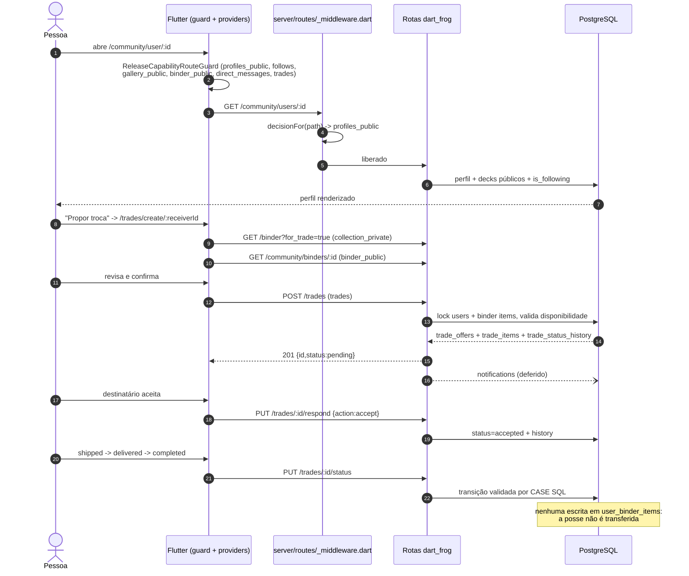

# Fluxo `social_trade` — Comunidade, perfis públicos, marketplace, trades, mensagens, denúncias e moderação

Estado: documentação de apoio, não autoritativa · gerado em 2026-09-21 sobre o commit d26f23a16 · verificação estática (nenhum teste foi executado)

---

## 1. Resumo e veredito

| Eixo | Veredito | Base |
| --- | --- | --- |
| **Implementado** | **sim** (com uma lacuna funcional declarada) | 34 dos 36 passos têm código de ponta a ponta (35 e 36 só no servidor): 12 telas no app, 38 arquivos de rota no servidor, 14 tabelas + 2 views ·  *corrigido na verificação adversarial: a versão anterior dizia "28 passos, 11 telas, 23 handlers, 9 tabelas + 1 view", números que não batem com a própria §2 nem com a §5* |
| **Alcançável hoje** | **não** | `server/config/release_capabilities.json` (policy `brewtact_free_beta_2026-08-13`, `offer_mode: free_beta_no_commerce`) tem `gallery_public`, `profiles_public`, `comments`, `follows`, `user_search`, `direct_messages`, `social_push`, `binder_public`, `trades` e `marketplace` com `release_capability: "off"` / `allowed: false`. **Verificação adversarial:** as **29** capabilities do arquivo estão `("off", false)` — nenhuma exceção, incluindo `collection_private`, `catalog_private` e `decks_private`, que aparecem como `implemented_p0_open` mas seguem negadas. Isso importa para A18: mesmo ligando `marketplace`, sem `collection_private` a tela não abre |
| **Provado** | **parcial** | O portão **declarado** no contrato (`scripts/manaloom_e2e_suite.sh:589`) roda apenas `app/test/features/trades` deste fluxo. Mas existe um portão **mais largo e não declarado** que cobre comunidade, social e mensagens: `.githooks/pre-push` → `scripts/manaloom_local_ci.sh:246 (full)` → `run_full_quality` (`:186-190`) → `melos run quality` (`melos.yaml:98`) → `scripts/quality_gate.sh full` (`:464-469`), que roda `run_backend_full` (**todos** os `server/test/*_test.dart`, `quality_gate.sh:66-93`) e `run_frontend_full` (**todo** o `app/test`, `:139-144`). O que continua **fora de qualquer portão**: os `*_live_test.dart` deste fluxo (excluídos por `--exclude-tags live \|\| live_backend \|\| live_db_write \|\| live_external`, `quality_gate.sh:89`), os três `integration_test/` e `e2e_trade_tests.py`. Dois "contratos" de servidor são `grep` sobre o texto-fonte (A10), mas **dois outros são testes de propriedade reais e rodam no portão**: `server/test/release_capability_policy_test.dart` (565 l.) e `app/test/core/config/release_capabilities_test.dart` (577 l.) — ver A19 ·  *corrigido na verificação adversarial: a versão anterior afirmava "não entram em nenhum portão" e "os testes de servidor deste fluxo são todos `@Tags(['live'])`", as duas falsas e mutuamente contraditórias* |

**O que isso significa na prática.** O fluxo social é o mais completo do repositório em superfície de código e o menos provado em comportamento. Hoje, um usuário autenticado que digite `/community`, `/messages`, `/trades`, `/market`, `/marketplace` ou `/quotes` é redirecionado antes de qualquer requisição (`app/lib/core/config/release_capabilities.dart:414-499`); se conseguisse chegar, o servidor responderia `404 {"error":"capability_unavailable"}` no middleware raiz (`server/routes/_middleware.dart:105-144`). Os dois portões são coerentes: nenhum caminho social abre.

**Três achados que sobrevivem ao desligamento** (viram bug no dia em que a capability abrir):

1. `DELETE /community/decks/:id/comments/:commentId` responde **200** (`server/routes/community/decks/[id]/comments/[commentId]/index.dart:28-31`) e o app só aceita **204** (`app/lib/features/community/providers/community_provider.dart:456`) — excluir o próprio comentário sempre falhará na tela, apesar de o comentário ser realmente apagado no banco.
2. `GET /community/marketplace` é o **único** endpoint social que expõe itens de fichário sem checar `binder_visibility`, `profile_visibility` ou `user_blocks` (`server/routes/community/marketplace/index.dart:30-34`), enquanto `/community/binders/:userId` (linhas 136-158) e `/community/trade-matches` (via `server/lib/community_engagement_service.dart:330-356`) checam os três.
3. `FriendlyErrorMapper` devolve o texto cru do campo `error` quando ele não "parece técnico" (`app/lib/core/utils/friendly_error_mapper.dart:317-318`) — logo, negações de capability e de bloqueio aparecem para o usuário como `capability_unavailable` e `interaction_blocked`.

**Lacuna funcional declarada:** o trade **não transfere posse**. Nenhum handler escreve em `user_binder_items` ao concluir uma negociação (`git grep -n "transfer\|ownership" server/lib server/routes` retorna só comentários e o enum `payment_method`). A view `binder_item_availability` reserva quantidade enquanto o trade está em `pending|accepted|shipped|delivered|disputed` e **libera** em `completed` (`server/lib/collection_availability_contract.dart:42-44`), devolvendo a carta ao fichário de quem a entregou. A UI declara isso ("o BrewTact registra a proposta e a conversa, mas não recebe, guarda nem protege pagamentos" — `app/lib/features/trades/widgets/trade_safety_notice.dart:11-14`), mas `docs/project_logic_contracts.json` descreve o fluxo como `"source_of_truth": "PostgreSQL ownership and transition services"`. É divergência de contrato, não de código.

---

## 2. Jornada passo a passo

Legenda de capability: **A** = portão do app (`ReleaseCapabilityRouteGuard` / tela), **S** = portão do servidor (`requiredCapabilityForRequest`).

| # | Passo (tela / widget) | Provider / cliente | Método + endpoint | Handler do servidor | Serviço / repositório | Tabelas |
| --- | --- | --- | --- | --- | --- | --- |
| 1 | Hub Comunidade `CommunityScreen` (`app/lib/features/community/screens/community_screen.dart:21-46`), rota `/community` (`app/lib/main.dart:811-841`) | — (monta abas por capability, `community_screen.dart:28-36`) | — | — | — | — |
| 2 | Aba Explorar `_ExploreTab` (`community_screen.dart:111`; seção declarada em `:50-56`) | `CommunityProvider.fetchPublicDecks` (`community_provider.dart:261-360`) | `GET /community/decks?page&limit&search&format` | `server/routes/community/decks/index.dart:9-15` | `_listPublicDecks` (linha 19) | `decks`, `users`, `deck_cards`, `cards`, `user_blocks` |
| 3 | Detalhe do deck público `CommunityDeckDetailScreen` (`app/lib/main.dart:833-839`) | `fetchPublicDeckDetails` (`community_provider.dart:370-397`) | `GET /community/decks/:id` | `server/routes/community/decks/[id]/index.dart:19-21` | `_getPublicDeck` (linha 31) | `decks`, `deck_comments`, `sets`, `user_blocks` |
| 4 | Lista de comentários (`community_deck_detail_screen.dart:59-66`) | `fetchDeckComments` (`community_provider.dart:399-426`) | `GET /community/decks/:id/comments` | `server/routes/community/decks/[id]/comments/index.dart:12-14` | `CommunityEngagementService.listDeckComments` (`server/lib/community_engagement_service.dart:43-90`) | `deck_comments`, `users`, `user_blocks` |
| 5 | Publicar comentário (`community_deck_detail_screen.dart:119-155`) | `addDeckComment` (`community_provider.dart:428-448`) | `POST /community/decks/:id/comments` `{body}` | idem, linha 15-17 | `createDeckComment` (`community_engagement_service.dart:92-138`) | `deck_comments` |
| 6 | Excluir comentário próprio (`community_deck_detail_screen.dart:199-240`) | `deleteDeckComment` (`community_provider.dart:450-470`) | `DELETE /community/decks/:id/comments/:commentId` | `server/routes/community/decks/[id]/comments/[commentId]/index.dart:9-32` | `deleteDeckComment` (`community_engagement_service.dart:140-158`) — soft delete | `deck_comments` |
| 7 | Denunciar deck ou comentário (`community_deck_detail_screen.dart:157-197`; diálogo em `app/lib/features/social/widgets/social_report_dialog.dart:21-30`) | `CommunityProvider.reportContent` (`community_provider.dart:472-512`) | `POST /content-reports` `{target_type,target_id,reason,details}` | `server/routes/content-reports/index.dart:8-45` | `SocialSafetyService.reportContent` (`server/lib/social_safety_service.dart:340-443`) | `content_reports`, `rate_limits` |
| 8 | Copiar deck público | `DeckProvider` → `app/lib/features/decks/providers/deck_provider_support_import.dart:251` | `POST /community/decks/:id` `{}` | `server/routes/community/decks/[id]/index.dart:23-25` | `_copyPublicDeck` (linha 319) + `DeckRulesService` | `decks`, `deck_cards` |
| 9 | Aba Seguindo `_FollowingFeedTab` (`community_screen.dart:216`) | `SocialProvider.fetchFollowingFeed` (`social_provider.dart:718-776`) | `GET /community/decks/following?page&limit` | alias dentro da rota dinâmica: `server/routes/community/decks/[id]/index.dart:17` → `handleCommunityFollowingFeed` | `server/lib/community_following_feed_service.dart` | `user_follows`, `decks`, `users` |
| 10 | Aba Usuários / `UserSearchScreen` (`app/lib/main.dart:820-825`) | `SocialProvider.searchUsers` (`social_provider.dart:207-267`) | `GET /community/users?q&limit` | `server/routes/community/users/index.dart:8-14` | `_searchUsers` (linha 18) | `users`, `user_follows`, `decks`, `user_blocks` |
| 11 | Perfil público `UserProfileScreen` (`app/lib/main.dart:826-832`) | `fetchUserProfile` (`social_provider.dart:284-347`) | `GET /community/users/:id` | `server/routes/community/users/[id].dart:9-15` | `_getUserProfile` (linha 21) | `users`, `user_follows`, `decks`, `user_blocks` |
| 12 | Seguir (`user_profile_screen.dart:60-79`) | `followUser` (`social_provider.dart:354-400`) | `POST /users/:id/follow` `{}` | `server/routes/users/[id]/follow/index.dart:11-12` | `_followUser` (linha 23) + `NotificationService.createFromActorDeferred` | `user_follows`, `users`, `user_blocks`, `notifications` |
| 13 | Deixar de seguir | `unfollowUser` (`social_provider.dart:403-448`) | `DELETE /users/:id/follow` | idem, linha 13-14 | `_unfollowUser` (linha 138) | `user_follows` |
| 14 | Seguidores / Seguindo (`user_profile_screen.dart:1047`) | `fetchFollowers` / `fetchFollowing` (`social_provider.dart:594-711`) | `GET /users/:id/followers?page&limit`, `.../following` | `server/routes/users/[id]/followers/index.dart:7-12`, `.../following/index.dart` | inline | `user_follows`, `users`, `user_blocks` |
| 15 | Fichário público no perfil (`user_profile_screen.dart:166`) | `BinderProvider.fetchPublicBinder` (`binder_provider.dart:1199-1244`) | `GET /community/binders/:userId?page&limit` | `server/routes/community/binders/[userId].dart:9-12` | inline | `user_binder_items`, `binder_item_availability`, `users`, `user_blocks` |
| 16 | Bloquear perfil (`user_profile_screen.dart:118+`) | `blockUser` (`social_provider.dart:489-521`) | `POST /users/:id/block` `{reason?}` | `server/routes/users/[id]/block/index.dart:12` | `SocialSafetyService.blockUser` (`social_safety_service.dart:128-260`) | `user_blocks`, `moderation_actions` |
| 17 | Listar / desfazer bloqueios (perfil) | `fetchBlockedUsers` / `unblockUser` (`social_provider.dart:523-587`) | `GET /users/me/blocks`; `DELETE /users/:id/block` | `server/routes/users/me/blocks/index.dart:8-16`; `.../block/index.dart:13` | `listBlockedUsers` / `unblockUser` | `user_blocks` |
| 18 | Abrir conversa a partir do perfil (`user_profile_screen.dart:81-96`, `:1441`) | `MessageProvider.getOrCreateConversation` (`message_provider.dart:260-278`) | `POST /conversations` `{user_id}` | `server/routes/conversations/index.dart:12` | `_createConversation` (linha 164) — respeita `message_visibility` e bloqueio | `conversations`, `users`, `user_follows`, `user_blocks` |
| 19 | Caixa de mensagens `MessageInboxScreen` (`app/lib/main.dart:846-848`) | `fetchConversations` (`message_provider.dart:205-247`) | `GET /conversations?page&limit` | `server/routes/conversations/index.dart:11` | `_listConversations` (linha 18) | `conversations`, `direct_messages`, `users`, `user_blocks` |
| 20 | Badge global de não lidas | `fetchUnreadCount` a cada 30 s (`message_provider.dart:147-202`) | `GET /conversations/unread-count` | `server/routes/conversations/unread-count.dart:9-12` | inline | `direct_messages`, `conversations`, `user_blocks` |
| 21 | Chat direto `ChatScreen` + polling 5 s (`chat_screen.dart:57-67`) | `fetchMessages` (`message_provider.dart:284-377`), `markAsRead` (`:423`) | `GET /conversations/:id/messages?page&limit` ou `?since&limit`; `PUT /conversations/:id/read` | `server/routes/conversations/[id]/messages.dart:13`; `.../read.dart:8-11` | inline | `direct_messages`, `conversations`, `user_blocks` |
| 22 | Enviar mensagem direta (`chat_screen.dart:133-167`) | `sendMessage` com `client_request_id` (`message_provider.dart:380-420`) | `POST /conversations/:id/messages` `{message, client_request_id?}` | `server/routes/conversations/[id]/messages.dart:14` | `_postMessage` (linha 165) — upsert idempotente | `direct_messages`, `conversations`, `notifications` |
| 23 | Marketplace global (`/collection?tab=1`, `marketplace_screen.dart`) | `BinderProvider.fetchMarketplace` (`binder_provider.dart:1249-1300`) | `GET /community/marketplace?page&limit&search&condition&for_trade&for_sale` | `server/routes/community/marketplace/index.dart:9-12` | inline | `user_binder_items`, `binder_item_availability`, `cards`, `price_history`, `users` |
| 24 | Aba Cotações (`/community?tab=3`, `community_screen.dart:221`) | `MarketProvider.fetchMovers` (`market_provider.dart:46-48`) | `GET /market/movers?limit&min_price` | `server/routes/market/movers/index.dart:26-40` | `server/lib/market_movers.dart` + cache | `price_history`, `cards` |
| 25 | Matches de troca (`/collection/matches`, `TradeMatchesScreen`) | `CommunityProvider.fetchTradeMatchResult` (`community_provider.dart:519-573`) | `GET /community/trade-matches?deck_id?` | `server/routes/community/trade-matches/index.dart:8-14` | `CommunityEngagementService.findTradeMatches` (`community_engagement_service.dart:176-440`) | `user_binder_items`, `decks`, `deck_cards`, `binder_item_availability`, `user_follows`, `user_blocks` |
| 26 | Montar proposta `CreateTradeScreen` (`app/lib/main.dart:876-896`): meus itens | `BinderProvider.fetchBinderDirect(listType:'have', forTrade:true)` (`create_trade_screen.dart:100-110`) | `GET /binder?...&for_trade=true` | `server/routes/binder/index.dart` | inline | `user_binder_items`, `binder_item_availability` |
| 27 | Montar proposta: itens do outro / item do deep link | `fetchPublicBinderDirect` (`create_trade_screen.dart:739`), `fetchPublicBinderItemDirect` (`:151`) | `GET /community/binders/:userId?list_type=have[&item_id=]` | `server/routes/community/binders/[userId].dart` (`item_id` validado na linha 27-33) | inline | `user_binder_items` |
| 28 | Enviar proposta (`create_trade_screen.dart:348-362`) | `TradeProvider.createTrade` (`trade_provider.dart:797-853`) | `POST /trades` `{receiver_id,type,message?,my_items[],requested_items[],payment_amount?,payment_method?,counter_to_trade_id?}` | `server/routes/trades/index.dart:20` | `_createTrade` (linha 25) — locks `FOR UPDATE` em users e binder items | `trade_offers`, `trade_items`, `trade_status_history`, `trade_messages`, `user_binder_items`, `notifications` |
| 29 | Caixa de trades `TradeInboxScreen` (`app/lib/main.dart:872-875`) | `fetchTrades` / `fetchMoreTrades` (`trade_provider.dart:603-712`) | `GET /trades?page&limit&role&status?` | `server/routes/trades/index.dart:19` | `_listTrades` (linha 806) + `_buildTrustInsight` | `trade_offers`, `trade_items`, `trade_messages`, `trade_status_history`, `users` |
| 30 | Detalhe do trade `TradeDetailScreen` (`app/lib/main.dart:897-903`) | `refreshTradeDetail` (`trade_provider.dart:730-786`) | `GET /trades/:id` | `server/routes/trades/[id]/index.dart:14-16` | `_getTradeDetail` (linha 20) + `_buildValueSummary` | `trade_offers`, `trade_items`, `trade_messages`, `trade_status_history` |
| 31 | Aceitar / recusar (`trade_detail_screen.dart:1033-1057`, com confirmação) | `respondToTrade` (`trade_provider.dart:856-893`) | `PUT /trades/:id/respond` `{action}` | `server/routes/trades/[id]/respond.dart:10-13` | CTE transacional (linha 63) | `trade_offers`, `trade_status_history`, `notifications` |
| 32 | Enviado / entregue / concluído / cancelado / disputa (`trade_detail_screen.dart:1059-1081`) | `updateTradeStatus` (`trade_provider.dart:896-941`) | `PUT /trades/:id/status` `{status,tracking_code?,delivery_method?,notes?}` | `server/routes/trades/[id]/status.dart:10-13` | CTE com máquina de estados (linha 119-138) | `trade_offers`, `trade_status_history`, `notifications` |
| 33 | Chat do trade (`trade_detail_screen.dart:1290-1315`) | `fetchMessages` / `sendMessage` (`trade_provider.dart:944-1044`) | `GET /trades/:id/messages?page&limit`; `POST /trades/:id/messages` | `server/routes/trades/[id]/messages.dart:13-14` | upsert idempotente por `client_request_id` (linha 268) | `trade_messages`, `notifications` |
| 34 | Denunciar mensagem de trade (`trade_detail_screen.dart:1317-1340`) | `SocialProvider.reportContent(targetType:'trade_message')` | `POST /content-reports` | `server/routes/content-reports/index.dart` | `SocialSafetyService` | `content_reports` |
| 35 | Fila de moderação e decisão | **sem cliente no app** | `GET /moderation/reports`, `PUT /moderation/reports/:id` | `server/routes/moderation/reports/index.dart:8-11`, `.../[id]/index.dart` | `listModerationQueue` / `_applyModerationAction` (`social_safety_service.dart:445-...`) | `content_reports`, `moderation_actions`, `decks`, `deck_comments`, `direct_messages`, `trade_messages` |
| 36 | Apelação de denúncia | **sem cliente no app** | `POST /content-reports/:id/appeals` | `server/routes/content-reports/[id]/appeals/index.dart:8-11` | `appealReport` (`social_safety_service.dart:643-...`) | `report_appeals`, `content_reports` |

> Passos 1-34 têm caminho completo app→servidor. **Passos 35 e 36 existem só no servidor** — `git grep -n -i "moderation\|appeals" app/lib` retorna zero ocorrências.

### Diagrama da jornada principal (perfil → proposta → conclusão)



---

## 3. Capabilities e portões

### 3.1 Os dois portões, lado a lado

| Superfície do app | Capability exigida pelo app (`release_capabilities.dart`) | Endpoint correspondente | Capability exigida pelo servidor (`release_capability_policy.dart`) | Nomes batem? |
| --- | --- | --- | --- | --- |
| `/community` (tab 0) | `gallery_public` (`:453`) | `GET /community/decks` | `gallery_public` (`:467-470`) | sim |
| `/community?tab=1` | `gallery_public` + `follows` (`:444-447`) | `GET /community/decks/following` | `follows` (`:464-466`) | sim (app é mais estrito) |
| `/community?tab=2` (aba Usuários) | `profiles_public` + `user_search` (`:448-451`) | `GET /community/users` | `user_search` (`:477-479`) | sim (app mais estrito) |
| `/community/search-users` (rota própria) | **só `user_search`** (`:414-417`) | `GET /community/users` | `user_search` (`:477-479`) | sim — **mas note a assimetria com a linha acima**: com `user_search=on` e `profiles_public=off` a rota `/community/search-users` abre e a aba do hub não; e qualquer toque num resultado vai para `/community/user/:id`, que o guard manda para `/home` (`:419-429`) ·  *corrigido: a versão anterior fundia as duas superfícies numa linha só* |
| `/community?tab=3` (Cotações) | `marketplace` (`:452`; seção em `community_screen.dart:77-83`) | `GET /market/movers` | **`catalog_private`** (`:526-532`) | **não** |
| `/community/user/:id` | `profiles_public`+`follows`+`gallery_public`+`binder_public`+`direct_messages`+`trades` (`:419-429`) | `GET /community/users/:id` | `profiles_public` (`:480-482`) | app muito mais estrito |
| `/community/decks/:id` | `gallery_public`+`profiles_public`+`comments`+`trades` (`:431-439`) | `GET /community/decks/:id` | `gallery_public` | app mais estrito |
| — (ação de comentar) | coberta pela rota acima | `GET/POST .../comments` | `comments` (`:459-463`) | sim |
| — (excluir comentário) | nenhuma | `DELETE .../comments/:commentId` | **`null` → plano de controle** (`:462`, `:570-575`) | intencional: desfazer sempre pode |
| `/messages`, `/messages/:id` | `direct_messages` (`:460-463`) | `/conversations*` | `direct_messages` (`:492-495`) | sim |
| `/notifications` | `social_push` (`:465-468`) | `/notifications*`, `PUT /users/me/fcm-token` | `social_push` (`:496-504`) | sim |
| `/trades*` | `trades` (`:485-488`) | `/trades*` | `trades` (`:509-514`) | sim |
| `/collection/matches` | **`collection_private` + `trades`** — a checagem de `collection_private` para `path.startsWith('/collection/')` vem **antes** (`:470-476`) da de `trades` (`:490-493`) | `GET /community/trade-matches` | **só `trades`** (`:509-514`) | **não** — achado A18 |
| `/market`, `/quotes` | `marketplace` (`:495-499`) → em seguida redirect de rota para `/community?tab=3` (`main.dart:799-810`) | `GET /market/movers` | **`catalog_private`** | **não** (A4) |
| `/marketplace`, `/collection?tab=1` (Marketplace global) | **`marketplace` + `collection_private`**: o guard libera `/marketplace` por `marketplace` (`:495-499`), a rota redireciona para `/collection?tab=1` (`main.dart:803-806`, `trade_route_contract.dart:1`) e o guard roda de novo, onde `:470-476` exige `collection_private` antes do switch de abas em `:502-506` | `GET /community/marketplace` | **só `marketplace`** (`:515-518`) | **não** — achado A18 |
| Fichário público no perfil | `binder_public` (via guard de `/community/user/`) | `GET /community/binders/:userId` | `binder_public` (`:505-508`) | sim |
| Denunciar (qualquer alvo) | nenhuma na rota | `POST /content-reports` | **`null` → plano de controle** (`:618`) | intencional |
| Bloquear / desbloquear | nenhuma na rota | `GET/POST/DELETE /users/:id/block` | **`null` → plano de controle** (`:558-561`) | intencional |
| Deixar de seguir | nenhuma | `DELETE /users/:id/follow` | **`null` → plano de controle** (`:562-565`) | intencional |
| Moderação e apelação | **não existe tela** | `GET /moderation/reports`, `PUT /moderation/reports/:id`, `POST /content-reports/:id/appeals` | plano de controle + `operationalAdminMiddleware` (`server/routes/moderation/_middleware.dart:5-7`) | n/a |

O desenho de "desfazer nunca é bloqueado" (desbloquear, desseguir, apagar comentário, denunciar) é deliberado e coerente: `isReleaseCapabilityControlPlaneRequest` (`release_capability_policy.dart:547-586`) libera exatamente as ações de saída/segurança mesmo com o social todo `off`.

### 3.2 Alcançável hoje: não

`server/config/release_capabilities.json` (policy `brewtact_free_beta_2026-08-13`) traz, para as dez capabilities deste fluxo, `implementation_status: "implemented_guarded"`, `release_capability: "off"`, `allowed: false`, `live_verified_as_of: null`. Bate com `docs/status/CURRENT_PRODUCT_DECISION.md` ("Galeria, perfis públicos, busca social, comments, follows, DMs e push social — `OFF`"; "Binder público, marketplace e trades — `OFF`").

Só existe uma porta para ligar isso em runtime: `MANALOOM_ISOLATED_RELEASE_CAPABILITIES_FILE`, e ela exige simultaneamente `MANALOOM_E2E_ISOLATED_RUNTIME=1`, `MANALOOM_CONFIRM_ISOLATED_RELEASE_CAPABILITIES=I_UNDERSTAND_THIS_IS_DISPOSABLE_TEST_ONLY`, `ENVIRONMENT` em `development|test` e um arquivo **absoluto dentro de `Directory.systemTemp` resolvido por symlink** (`release_capability_policy.dart:346-375`). Fora disso, cai em `_invalidPolicy` → tudo `off`.

### 3.3 O que o usuário vê quando é negado

| Situação | Comportamento | Arquivo |
| --- | --- | --- |
| `/community` com nada liberado | `_firstAllowedCommunityLocation` devolve `null` → redirect para `/home` | `release_capabilities.dart:441-458`, `:557-579` |
| `/messages`, `/notifications`, `/community/search-users`, `/community/user/:id`, `/community/decks/:id` | redirect para `/home` | `:414-468` |
| `/trades*`, `/collection/matches`, `/market`, `/marketplace`, `/quotes` | redirect para `/collection?tab=0` — que por sua vez cai em `/home` porque `collection_private` também está `off` (`:470-476`). Dois saltos, sem loop. Confirmado por teste: `app/test/core/config/release_capabilities_test.dart:379-387` asserta `/trades/trade-1 → /collection?tab=0`, `/collection/matches?deck=deck-1 → /home`, `/marketplace → /collection?tab=0` | `:485-499` |
| `/community` com **alguma** aba liberada mas não a pedida | troca para a primeira aba permitida | `:441-458` |
| `CommunityScreen` montada sem nenhuma seção | `_CommunityUnavailableScaffold` (tela explicativa, não erro) | `community_screen.dart:34-36`, `:298` |
| Requisição que escapa do guard (snapshot do app desatualizado) | `404 {"error":"capability_unavailable","capability":...,"policy_version":...,"policy_digest_sha256":...}` + `Cache-Control: no-store` | `server/routes/_middleware.dart:110-144` |

**O ponto fraco da negação server-side:** o app nunca reconhece `capability_unavailable`. `SocialProvider.fetchUserProfile` mapeia 404 para "Usuário não encontrado" (`social_provider.dart:319-320`); `FriendlyErrorMapper` mostra a string crua (achado A3). Não há tela "recurso indisponível nesta versão" em nenhum ponto pós-guard.

---

## 4. Contrato app↔servidor, por endpoint

| Endpoint | App (arquivo:linha) | Servidor (arquivo:linha) | Campos do corpo/query enviados | Campos lidos na resposta | Divergência |
| --- | --- | --- | --- | --- | --- |
| `GET /community/decks` | `community_provider.dart:305` | `community/decks/index.dart:146-148` | `page,limit,search,format` | `data[]`, `total` | App ignora `page`/`limit` da resposta e recalcula `_hasMore` por `_decks.length < total` — ok |
| `GET /community/decks/:id` | `community_provider.dart:372` | `community/decks/[id]/index.dart:222-247` | — | mapa inteiro (`name`, `owner_id`, `stats`, `main_board`, `all_cards_flat`, `visual_analysis`, `comments_summary`) | ok |
| `POST /community/decks/:id` (copiar) | `deck_provider_support_import.dart:251` | `community/decks/[id]/index.dart:436-439` | `{}` | `success`, `deck` | ok |
| `GET /community/decks/:id/comments` | `community_provider.dart:401` | `comments/index.dart:39-41` | nenhum (usa defaults `page=1,limit=50`) | `data[]` → `id,body,created_at,author{…},user_id` | Servidor não devolve `total`; app não pagina. Sem bug hoje, mas o 51º comentário some em silêncio |
| `POST /community/decks/:id/comments` | `community_provider.dart:430` | `comments/index.dart:68-71` | `{body}` | só o status 201 | Resposta `{comment:{…}}` é descartada; a tela recarrega tudo (`community_deck_detail_screen.dart:154`) |
| `DELETE /community/decks/:id/comments/:commentId` | `community_provider.dart:452-456` | `comments/[commentId]/index.dart:28-31` | — | **espera 204** | **Servidor responde 200 + JSON.** Achado A1 |
| `POST /content-reports` | `community_provider.dart:479`, `social_provider.dart:461` | `content-reports/index.dart:28-41` | `target_type,target_id,reason,details` | status 201 | App nunca envia `evidence`, que o servidor aceita (`content-reports/index.dart:24-27`) — campo morto no cliente. Enums de `reason` batem exatamente (`social_report_dialog.dart:12-19` × `social_safety_service.dart:7-14`) |
| `POST /community/decks/:id/reports` | **nenhum chamador** (`git grep` em `app/lib`) | `community/decks/[id]/reports/index.dart:11-14` | — | — | **Endpoint órfão**: o app denuncia deck por `/content-reports` com `target_type:'deck'` |
| `GET /community/decks/following` | `social_provider.dart:735` | alias em `community/decks/[id]/index.dart:17` | `page,limit` | `data[]`, `total` | ok |
| `GET /community/users` | `social_provider.dart:231` | `community/users/index.dart:155-157` | `q,limit` (nunca `page`) | `data[]`, `total` | App não pagina busca (fixa `limit=30`); `total` pode ser maior e não há "carregar mais" |
| `GET /community/users/:id` | `social_provider.dart:294` | `community/users/[id].dart:170` | — | `user{…,is_following,is_own_profile}`, `public_decks[]` | `commander_image_url` **não** passa por `normalizeScryfallImageUrl` aqui (linhas 161-168), ao contrário de `community/decks/index.dart:140`. Achado A6 |
| `POST /users/:id/follow` | `social_provider.dart:356` | `users/[id]/follow/index.dart:107-110` | `{}` | espera 200 + `follower_count` | Servidor devolve `follower_count`, `following_count`, `is_following`. App só usa `follower_count` — `following_count` do alvo fica desatualizado na tela |
| `DELETE /users/:id/follow` | `social_provider.dart:405` | idem `:153-155` | — | 200 + `follower_count` | ok |
| `GET /users/:id/followers` / `following` | `social_provider.dart:611`, `:671` | `users/[id]/followers/index.dart` | `page,limit=30` | `data[]`, `total` | ok |
| `POST /users/:id/block` | `social_provider.dart:491` | `users/[id]/block/index.dart:12` | `{reason?}` | status 200 | ok |
| `DELETE /users/:id/block` | `social_provider.dart:560` | idem `:13` | — | 200 | ok |
| `GET /users/me/blocks` | `social_provider.dart:529` | `users/me/blocks/index.dart:8-16` | — | `data[]` (`id,username,display_name,avatar_url,reason,blocked_at`) | ok; `total` devolvido e ignorado |
| `GET /users/:id/block` | **nenhum chamador** | `users/[id]/block/index.dart:11` | — | `blocked_by_me`, `interaction_blocked` | **Endpoint órfão.** O app nunca sabe se *foi* bloqueado |
| `POST /conversations` | `message_provider.dart:262` | `conversations/index.dart:287-302` | `{user_id}` | `id`, `other_user{…}`, `created_at` | App aceita 200 **ou** 201 (`:263`); servidor só devolve 200 — tolerante, ok |
| `GET /conversations` | `message_provider.dart:213` | `conversations/index.dart:137-144` | `page,limit` | `data[]`, `total` | ok |
| `GET /conversations/unread-count` | `message_provider.dart:186` | `conversations/unread-count.dart:38` | — | `unread` | ok |
| `GET /conversations/:id/messages` | `message_provider.dart:306-310` | `conversations/[id]/messages.dart:142-144` | `page,limit` **ou** `since,limit` | `data[]`, `total` | Em modo `since` o servidor devolve `total = msgResult.length` (`:93`), não o total real. O app já trata (`message_provider.dart:329-340`), mas o campo tem duas semânticas com o mesmo nome |
| `POST /conversations/:id/messages` | `message_provider.dart:390` | `conversations/[id]/messages.dart:366-380` | `{message, client_request_id?}` | `DirectMessage.fromJson(resposta inteira)` | Resposta não traz `sender_username`/`sender_display_name`/`sender_avatar_url`/`read_at`, mas **isso não produz defeito visível**: `_MessageBubble` (`chat_screen.dart:501-592`) desenha só texto + hora e usa `senderId` (que vem na resposta) para lado e cor. Os três campos não são lidos em lugar nenhum de `app/lib` — são campos mortos no modelo, não bug de UX. Ver A7, **refutado** |
| `PUT /conversations/:id/read` | `message_provider.dart:426` | `conversations/[id]/read.dart:8-11` | `{}` | só faixa 2xx | ok |
| `GET /community/binders/:userId` | `binder_provider.dart:1139`, `:1173`, `:1218` | `community/binders/[userId].dart:9-12` | `page,limit,list_type,item_id?` | `owner`, `data[]` | ok; `item_id` validado como UUID no servidor (`:27-33`) |
| `GET /community/marketplace` | `binder_provider.dart:1277` | `community/marketplace/index.dart:9-12` | `page,limit,search,condition,for_trade,for_sale` | `data[]` | App usa `list.length >= 20` para `_hasMoreMarket` (`:1284`) e ignora `total`; se a página vier cheia no fim da lista, pedirá uma página vazia. Falha de privacidade em A2 |
| `GET /market/movers` | `market_provider.dart:46` | `market/movers/index.dart:26` | `limit,min_price` | `MarketMoversData.fromJson` | Capability divergente (A4) |
| `GET /community/trade-matches` | `community_provider.dart:527` | `community/trade-matches/index.dart:8-14` | `deck_id?` | `matches[]`, `source`, `deck_id`, `message` | Servidor devolve `'deck_missing_and_wishlist'` quando o `deck_id` é do próprio usuário e `'all_deck_missing_and_wishlist'` caso contrário, com `deck_id: null` nesse segundo caso (`community_engagement_service.dart:420-425`; o outro ponto de retorno é `:186`); o app assume `'wishlist'` como default (`community_provider.dart:539,546`). `git grep "\.source"` em `app/lib` não acha nenhum leitor de `CommunityTradeMatchSearchResult.source` — enum divergente e morto ·  *corrigido: a linha citada antes (`436-441`) é `_ownsDeck`, não o retorno* |
| `POST /trades` | `trade_provider.dart:826` | `trades/index.dart:20` | `receiver_id,type,my_items[],requested_items[],message?,payment_amount?,payment_method?,counter_to_trade_id?` | espera 201 | Enums batem: `type∈{trade,sale,mixed}` (`trade_route_contract.dart:5` × `trades/index.dart:55`); `payment_method∈{pix,cash,transfer,other}` (`:79`). Resposta (`id,status,type,my_items_count,…`) é descartada — o app refaz `fetchTrades()` |
| `GET /trades` | `trade_provider.dart:621`, `:683` | `trades/index.dart:937-939` | `page,limit,role,status?` | `data[]`, `total`, `page` | `role∈{sender,receiver,all}`; servidor trata qualquer outro valor como `all` (`:822-828`), sem 400 |
| `GET /trades/:id` | `trade_provider.dart:746` | `trades/[id]/index.dart:309-345` | — | mapa completo (`my_items`, `their_items`, `messages`, `status_history`, `value_summary`, `sender/receiver.trust`) | ok |
| `PUT /trades/:id/respond` | `trade_provider.dart:863` | `trades/[id]/respond.dart:177-183` | `{action}` (`accept`/`decline`) | espera 200 | ok |
| `PUT /trades/:id/status` | `trade_provider.dart:914` | `trades/[id]/status.dart:289-296` | `{status,tracking_code?,delivery_method?,notes?}` | espera 200 | `status∈{shipped,delivered,completed,cancelled,disputed}` (`:32-38`); `delivery_method∈{correios,motoboy,pessoalmente,outro}` no handler (`:48-54`) mas o CHECK do banco também aceita `mail`/`in_person` (`server/bin/migrate.dart:1916-1919`) — enum mais largo no schema que na API |
| `GET /trades/:id/messages` | `trade_provider.dart:953` | `trades/[id]/messages.dart:114-121` | `page,limit` | `data[]`, `total`; chave `sender_avatar` | Bate com `TradeMessage.fromJson` (`trade_provider.dart:234`) — note que DM usa `sender_avatar_url` e trade usa `sender_avatar`: nomes diferentes para a mesma coisa em dois fluxos irmãos |
| `POST /trades/:id/messages` | `trade_provider.dart:1011` | `trades/[id]/messages.dart:357-370` | `{message, attachment_url?, attachment_type?, client_request_id?}` | `TradeMessage.fromJson` | O app **nunca** envia `attachment_url`/`attachment_type` (nenhum chamador passa; `trade_detail_screen.dart:1296` só manda texto): `attachment_type∈{receipt,tracking,photo,other}` é contrato morto no cliente. Resposta sem `sender_username` (mesma questão de A7) |
| `GET /moderation/reports`, `PUT /moderation/reports/:id`, `POST /content-reports/:id/appeals` | **nenhum chamador** | `moderation/reports/*`, `content-reports/[id]/appeals` | — | — | Superfície de moderação inteira sem cliente |

---

## 5. Dados: tabelas, view e migrações

Bootstrap em `server/database_setup.sql`; migrações versionadas em `server/bin/migrate.dart`. `server/test/social_runtime_schema_contract_test.dart:19-35` cobra que os dois caminhos exponham as mesmas relações.

| Relação | Definição | Papel no fluxo | Observações |
| --- | --- | --- | --- |
| `user_follows` | `database_setup.sql:1843` | passos 12-14, feed de seguidos | `UNIQUE(follower_id, following_id)`; follow usa `ON CONFLICT DO NOTHING` |
| `user_blocks` | `migrate.dart:2566`, `database_setup.sql:1855` | filtro transversal de todo o fluxo | Consultada em decks, users, comments, binders, conversas, DMs, trades e trade-matches — **exceto** em `/community/marketplace` |
| `deck_comments` | `migrate.dart:956`, `database_setup.sql:2427` | passos 4-6 | `status∈{visible,deleted,…}`; exclusão é soft (`community_engagement_service.dart:147-153`) |
| `content_reports` | `migrate.dart:979`, `database_setup.sql:2449` | passos 7, 34-36 | `UNIQUE` parcial gera `23505` → `duplicate_report` (409); `sla_due_at` e `priority` calculados no insert |
| `moderation_actions` | `migrate.dart:2668`, `database_setup.sql:2526` | passos 16, 35 | grava bloqueio e decisão de moderação com `request_id` |
| `report_appeals` | criada junto do pacote de segurança social | passo 36 | `duplicate_appeal` também por `23505` |
| `conversations` | `migrate.dart:2002` | passos 18-21 | índice único em `LEAST/GREATEST(user_a_id,user_b_id)` — garante 1 conversa por par |
| `direct_messages` | `migrate.dart:2015` | passos 21-22 | `moderation_status` filtrado em toda leitura; `UNIQUE(sender_id, client_request_id)` parcial dá a idempotência |
| `trade_offers` | `migrate.dart:1902` | passos 28-33 | `CHECK status IN (pending,accepted,declined,shipped,delivered,completed,cancelled,disputed)`; `CHECK sender_id <> receiver_id` |
| `trade_items` | `migrate.dart:1950` | passo 28 | `binder_item_id` é **nullable** com `ON DELETE SET NULL` + snapshot JSONB `trade_item_snapshot_v1` (`trades/index.dart:420-447`) — é o que mantém o histórico legível quando o fichário muda |
| `trade_messages` | `migrate.dart:1972` | passo 33 | `attachment_type` CHECK; `UNIQUE(sender_id, client_request_id)` parcial |
| `trade_status_history` | `migrate.dart:1989` | passos 28-32 | append-only; alimenta `avg_response_hours`/`avg_shipping_hours` do trust insight |
| `user_binder_items` | pacote de binder | passos 15, 23, 25-28 | **nunca escrita pelo fluxo de trade** |
| `notifications` | `migrate.dart` (logo após `direct_messages`) | passos 12, 22, 28, 31-33 | `CHECK type IN (new_follower, trade_offer_received, trade_accepted, trade_declined, trade_shipped, trade_delivered, trade_completed, trade_message, direct_message)` |
| `users.*_visibility` | `migrate.dart:2535-2562` | políticas de privacidade | `profile_visibility` e `binder_visibility` default `public`; `message_visibility`/`trade_visibility` default `everyone`; `location_visibility`/`trade_notes_visibility` default `private` |
| **view** `collection_availability_snapshot` | `server/lib/collection_availability_contract.dart` | reserva de estoque | `committed` conta `trade_items` cujo trade está em `pending|accepted|shipped|delivered|disputed` (`:42-44`) |
| **view** `binder_item_availability` | `database_setup.sql:2218` | disponibilidade por cópia física | `available_quantity = min(item_quantity, free_quantity - prior_item_quantity)`, priorizando itens marcados para troca/venda |

**Consequência da reserva:** ao marcar `completed`, o trade sai da lista de status reservados, `committed_trade_quantity` cai e a carta volta a `free` **no fichário de quem a entregou**. Não há linha nova no fichário de quem recebeu. Ver A5.

---

## 6. Estados e erros

### 6.1 Tratados

| Estado | Onde | Como |
| --- | --- | --- |
| Carregando (lista, detalhe, envio) | todos os providers | flags dedicadas (`_isLoading`, `_isLoadingMessages`, `_isSending`, `_isLoadingProfile`, `_isLoadingFollowers`…) com `notifyListeners` |
| Vazio | `AppStatePanel` em inbox, matches, perfis, busca | `message_inbox_screen.dart:97` oferece CTA para `/community/search-users`; `trade_matches_screen_test.dart:199` cobre o CTA canônico do Marketplace |
| Erro de rede | `FriendlyErrorMapper.fromException` (`:134+`) detecta `SocketException`, `ClientException`, `Failed host lookup`, `XMLHttpRequest error` | mensagem humana, sem stack |
| 401 / expiração | `ApiClient.isSessionInvalidatingUnauthorized` (`api_client.dart:96-117`) só derruba a sessão quando o corpo fala de token/sessão; `401` de domínio (ex.: `invalid_password`) fica local | `social_provider.dart:756-758` trata 401 do feed com texto próprio |
| Resposta fora de ordem (corrida de digitação/navegação) | geração monotônica em **todos** os providers do fluxo: `_fetchGeneration` (`community_provider.dart:276`), `_stateGeneration`/`_listFetchGeneration`/`_detailFetchGeneration`/`_messageFetchGeneration` (`trade_provider.dart:576-579`), `_conversationFetchGeneration`/`_unreadFetchGeneration` (`message_provider.dart:109-111`) | resposta velha é descartada; coberto por teste (`community_provider_test.dart:128`, `trade_provider_test.dart:366`, `message_provider_test.dart:249`) |
| Duplo toque em "enviar mensagem" | `client_request_id` gerado uma vez e persistido no rascunho (`chat_screen.dart:134-136`, `trade_detail_screen.dart:1293-1295`); servidor faz `ON CONFLICT (sender_id, client_request_id) DO UPDATE` e devolve 200 + `idempotent_replay:true` (`conversations/[id]/messages.dart:282-290`, `trades/[id]/messages.dart:286-296`) | conteúdo diferente com a mesma chave → 409 `idempotency_conflict` |
| Duplo toque em ações críticas do trade | diálogo de confirmação obrigatório antes de `respond`/`status` (`trade_detail_screen.dart:1039-1041`, `:1065-1067`) | coberto por `trade_confirmation_flow_test.dart:733`, `:762` |
| Rascunho não enviado | `MessageDraftStore` com debounce de 250 ms; restaurado no `initState` e limpo só após sucesso (`chat_screen.dart:91-128`) | coberto por `chat_screen_test.dart:146` |
| Concorrência de exclusão de conta | `SELECT ... FOR UPDATE` sobre os dois participantes, em ordem estável por id, antes de follow, conversa, DM, trade, respond, status e mensagem de trade | ex.: `trades/index.dart:244-256`, `respond.dart:44-61` |
| Concorrência de estoque | lock dos `binder_item_ids` ordenados + `_requireTradeItemsAvailable` → 409 `trade_inventory_changed` / `trade_item_not_listed` / `trade_quantity_unavailable` (`trades/index.dart:327-352`, `:723-779`) | coberto por `trade_provider_test.dart:256` (lado app) |
| Transição de status inválida | `CASE` SQL dentro da transação + `allowed_transitions` na resposta 400 (`status.dart:119-138`, `:216-223`) | coberto por `trade_provider_test.dart:301` (lado app) |
| Contraproposta em corrida | `FOR UPDATE` na proposta original + verificação de `receiver/sender/status/type` (`trades/index.dart:259-283`) | coberto por `trade_counterproposal_contract_test.dart` — **mas só por `grep` no fonte** |
| Bloqueio mútuo | checado em leitura e escrita de decks, users, comments, binders, conversas, DMs, trades e matches | 403 `interaction_blocked` |
| Rate limit de denúncia | 10/hora por usuário; 429 + `Retry-After: 3600` (`social_safety_service.dart:370-381`, `content-reports/index.dart:56-58`) | app mapeia 429 (`friendly_error_mapper.dart:118-120`) |
| Polling desligado quando a capability fecha | `_onReleaseCapabilitiesChanged` para o polling de DM e de notificações (`app/lib/main.dart:1009-1026`, `:1041-1060`) | evita rajada de 404 com social `off` |

### 6.2 Não tratados

| Estado | Evidência |
| --- | --- |
| **403/404 de capability com texto próprio** | Nenhum provider ou widget do fluxo testa `error == 'capability_unavailable'`. `social_provider.dart:319` transforma 404 em "Usuário não encontrado"; `FriendlyErrorMapper` mostra o código cru (A3) |
| **Offline / fila de reenvio** | Não há fila. O rascunho é preservado, mas o reenvio é manual. `app/lib/core/resilience/offline_capability.dart` é importado pelo mapper só para texto |
| **Retry automático** | Só o `_postWithRetry` interno do `ApiClient` (150 ms, `api_client.dart:331,342`); nenhum backoff por fluxo |
| **Botão "enviar" do chat de trade sem trava de re-entrada** | `trade_detail_screen.dart:1376-1379` sempre habilitado; o `TradeProvider` não expõe `isSending` (o chat de DM expõe: `chat_screen.dart:469`). Só a idempotência de servidor segura |
| **Paginação de comentários e de busca de usuários** | `fetchDeckComments` não passa `page`; `searchUsers` fixa `limit=30` sem "carregar mais" |
| **"Finalizadas" na caixa de trades** | filtra apenas `status=completed` (`trade_inbox_screen.dart:51,151,201`); `declined`, `cancelled` e `disputed` ficam invisíveis em qualquer aba |
| **Job assíncrono em andamento** | Não se aplica: nenhum passo deste fluxo é assíncrono por job. As notificações usam `createFromActorDeferred`, sem espera do cliente |
| **`follower_count` do perfil após follow** | atualizado; `following_count` do alvo não (contrato §4) |
| **Avatar/nome na bolha recém-enviada** | A7 |

---

## 7. Testes por passo

| Passos | Arquivo de teste | O que **de fato** afirma | Exercita comportamento? |
| --- | --- | --- | --- |
| 2, 3, 4, 7, 25 | `app/test/features/community/providers/community_provider_test.dart` (251 l.) | loading+vazio; erro de backend; nenhuma exceção crua vaza; 404 → `null` no detalhe; query URL-encoded; resposta velha descartada; `[Contexto: …]` preservado no corpo do comentário; match expõe dono acionável | sim (fake `ApiClient`) |
| 10, 11, 12, 14, 7, 16, 17 | `app/test/features/community/providers/social_provider_test.dart` (194 l.) | busca vazia; 404 → "Usuário não encontrado"; follow 403 → `false`; feed 401 → texto próprio; seguidores vazio; `reportContent` envia o contrato canônico; bloquear/desbloquear | sim |
| 19, 20, 21, 22 | `app/test/features/messages/providers/message_provider_test.dart` (362 l.) | unread; lista; erro; incremental `since` sem duplicar; resposta tardia não sobrescreve conversa ativa; replay idempotente | sim |
| 28-33 | `app/test/features/trades/providers/trade_provider_test.dart` (449 l.) | snapshot físico preservado; item legado sem binder continua legível; 409 de disponibilidade vira texto amigável; `counter_to_trade_id` chega no corpo; transição inválida vira texto; realtime atualiza detalhe/lista; patch da linha da lista; respostas tardias descartadas após `clearAllState`; replay de mensagem mantém 1 bolha | sim |
| 28, 31, 32 | `app/test/features/trades/screens/trade_confirmation_flow_test.dart` (939 l.) | revisão final antes de enviar; troca de tipo limpa pagamento/itens; falha mantém âncora de retry; quantidade limitada ao disponível; troca pura exige os dois lados; contraproposta restaura ambos os lados; **accept e delivered exigem confirmação**; identidade legada explicada; vazio oferece retry | sim — é o melhor teste do fluxo |
| 25 | `app/test/features/trades/screens/trade_matches_screen_test.dart` | cópia exata; URL de proposta recuperável; vazio com CTA canônico; falha explícita e retry | sim |
| 26, 28 | `app/test/features/trades/screens/create_trade_screen_overflow_test.dart` | layout a 320 px | não (layout) |
| 30 | `app/test/features/trades/screens/trade_detail_screen_overflow_test.dart` | layout | não |
| 28 (URL) | `app/test/features/trades/trade_route_contract_test.dart` | normalização de `type`/`source` fail-closed; URL preserva receiver/item/tipo/origem/contraproposta | sim (puro) |
| 7, 34 | `app/test/features/social/widgets/social_report_dialog_test.dart` | devolve motivo escolhido e detalhes trimados; exige cancelar explícito | sim |
| 10 | `app/test/features/social/screens/user_search_screen_test.dart` | restaura query da URL e busca; "limpar" só com query; erro com retry | sim |
| 19 | `app/test/features/messages/screens/message_inbox_screen_test.dart` | tile pinta cor/borda/ink; layout | parcial |
| 21, 22 | `app/test/features/messages/screens/chat_screen_test.dart` | rascunho preservado e feedback em falha; coluna de leitura limitada no desktop | sim |
| 11 | `app/test/features/social/screens/user_profile_screen_responsive_test.dart` | layout | não |
| 1, 2 | `app/test/features/community/screens/community_screen_responsive_test.dart` | layout | não |
| 3-5 | `app/test/features/community/screens/community_deck_detail_screen_test.dart` (304 l.) | composição 390/1280; campo de comentário só habilita com ≥3 caracteres | parcial — **não toca em excluir comentário** |
| 2-22 (live) | `app/integration_test/profile_community_runtime_test.dart` (477 l.) | registra usuários reais via API, cria deck público, navega perfil/busca/comunidade | sim, **exige backend + DB vivos** |
| 23, 26-33 (live) | `app/integration_test/binder_marketplace_trade_runtime_test.dart` (1226 l.) | ciclo de venda binder→trade com notificações; conversa direta com recibo de leitura | sim, **live** |
| 23-33 (visual) | `app/integration_test/social_trade_visual_runtime_proof_test.dart` (1075 l.) | captura telas montando widgets **direto**, sem router (ver C17 em `docs/MAPA_OPERACIONAL_DO_PROJETO.md:389-400`) | parcial — prova pixel, não alcance |
| 2-8, 25 | `server/test/community_engagement_contract_test.dart` (99 l.) | **`File(...).readAsStringSync()` + `expect(source, contains(...))`** | **não** — é grep sobre o fonte |
| 28 | `server/test/trade_counterproposal_contract_test.dart` (36 l.) | idem, 9 `contains` sobre `routes/trades/index.dart` | **não** |
| tabelas | `server/test/social_runtime_schema_contract_test.dart` (80 l.) | bootstrap e migração 041 expõem as mesmas relações; constraints de privacidade e concorrência em ambos os caminhos; triggers de usuário ativo só após as tabelas sociais | sim (analisa SQL, não roda) |
| 2-33 | `server/test/social_trading_live_test.dart` (2 testes), `server/test/profile_community_live_test.dart`, `server/test/social_safety_live_test.dart` (645 l.) | `@Tags(['live','live_backend','live_db_write'])`; registram usuários por HTTP | sim, **live** |
| 28-33 | `server/test/e2e_trade_tests.py` | suíte Python E2E; exige `MANALOOM_CONFIRM_LIVE_MUTATIONS=I_HAVE_EXPLICIT_APPROVAL` | sim, **live e com guard** |
| **portão do servidor (todos os passos)** | `server/test/release_capability_policy_test.dart` (565 l.) — **ausente da versão anterior desta tabela** | `:186-236` chama `requiredCapabilityForRequest` numa tabela de 44 rotas, incluindo `POST /community/decks`, `POST /community/decks/deck/comments`→`comments`, `GET /community/users`→`user_search`, `GET /community/users/user`→`profiles_public`, `POST /users/user/follow`→`follows`, `GET /conversations`→`direct_messages`, `POST /users/me/fcm-token`→`social_push`, `GET /community/binders/user`→`binder_public`, `POST /trades`→`trades`, `GET /community/marketplace`→`marketplace`; `:249-270` cobra o plano de controle (`POST /content-reports`, `GET /moderation/reports`, `POST /users/user/block`, `DELETE /community/decks/deck/comments/comment`, `DELETE /users/user/follow`) | **sim — teste de propriedade, não grep.** Roda no portão largo (`quality_gate.sh full`). Lacunas: não cita `/market/*` (A4) nem `POST /community/decks/:id` (A20), e cita `POST /community/decks`, que é 405 (A20) |
| **portão do app (todos os passos)** | `app/test/core/config/release_capabilities_test.dart` (577 l.) — **ausente da versão anterior desta tabela** | `:361-393` roda `ReleaseCapabilityRouteGuard.redirectFor` sobre 28 rotas negadas, incluindo `/community`, `/community/search-users?q=ana`, `/community/user/user-1`, `/community/decks/deck-2`, `/messages/conversation-1`, `/notifications`, `/trades/trade-1`, `/collection/matches?deck=deck-1`, `/collection?tab=1..3`, `/marketplace`; `:463-487` cobra a normalização de aba desconhecida sem autorizar outra superfície | **sim — teste de propriedade.** Roda no portão largo. Lacuna: não associa cada rota ao endpoint que a tela chama (A19), e não cobre o ramo morto de A13 |

### 7.1 Passos sem nenhum teste

**6 passos** com zero cobertura (nem unit, nem widget, nem live, nem grep) — *a versão anterior dizia 7 e incluía o passo 24, que tem cobertura parcial; ver a linha corrigida abaixo*:

| # | Passo | Por quê |
| --- | --- | --- |
| 6 | Excluir comentário próprio | nenhum teste chama `deleteDeckComment`; é exatamente onde vive o bug A1 |
| 8 | Copiar deck público (`POST /community/decks/:id`) | caminho em `deck_provider_support_import.dart:251`; não aparece em nenhum teste social |
| 9 | Feed de seguidos server-side | `social_provider_test.dart:98` cobre só o 401; `community_following_feed_service.dart` não tem teste |
| 24 | Aba Cotações / `GET /market/movers` | **parcialmente coberto, corrigido**: `app/test/core/config/release_capabilities_test.dart:466-486` exercita o lado do app (`marketOnly` → `/community?tab=3`) e `market_movers_test.dart` testa o serviço. O que falta é o casamento das duas decisões — A19 — e qualquer teste do `_CotacoesTab` (`community_screen.dart:1399-1406`) |
| 35 | Fila de moderação (`GET /moderation/reports`, `PUT /moderation/reports/:id`) | sem cliente e sem teste de contrato |
| 36 | Apelação (`POST /content-reports/:id/appeals`) | idem |
| — | `GET /users/:id/block`, `POST /community/decks/:id/reports` | endpoints órfãos, sem chamador e sem teste |

### 7.2 Testes que só verificam string/posição

- `server/test/community_engagement_contract_test.dart` e `server/test/trade_counterproposal_contract_test.dart`: `expect(source, contains("..."))` sobre o texto dos arquivos. Qualquer refactor legítimo quebra; qualquer bug lógico passa. É exatamente o padrão que `docs/MAPA_OPERACIONAL_DO_PROJETO.md:379-390` já identificou como causa de C16.
- `app/test/core/config/release_capability_surface_contract_test.dart:9-30`: mesmo padrão do lado do app — um mapa `requiredTokensByFile` com literais como `'ReleaseCapability.marketplace'` conferidos por `contains` sobre o fonte. Cobra que o *símbolo apareça no arquivo*, não que o portão decida certo.
- **Ressalva adversarial:** esta seção, na versão anterior, dava a entender que *todo* contrato de capability é grep. Não é. `server/test/release_capability_policy_test.dart` e `app/test/core/config/release_capabilities_test.dart` são testes de propriedade sobre funções reais, rodam no portão largo, e cobrem a maior parte das rotas deste fluxo (ver as duas linhas novas em §7). O motivo real de A4 e A18 passarem verdes não é "tudo é grep" — é que **nenhum teste cruza as duas decisões para a mesma tela** (A19).
- `create_trade_screen_overflow_test.dart`, `trade_detail_screen_overflow_test.dart`, `community_screen_responsive_test.dart`, `user_profile_screen_responsive_test.dart`, `marketplace_screen_overflow_test.dart`: posição e largura. Úteis, mas não exercitam comportamento.
- `app/test/ui/goldens/runtime/*/community_tab_*.png`, `trades_inbox.png`, `trade_detail_unavailable.png`: 45 goldens de pixel. Provam aparência, não alcance nem contrato.

### 7.3 O portão declarado não cobre o fluxo

`docs/project_logic_contracts.json` declara `gates: ["scripts/manaloom_e2e_suite.sh"]`. No script:

- linha 589 roda `flutter test test/features/commercial test/features/retention test/features/growth test/features/trades` — pega `trade_provider_test`, `trade_confirmation_flow_test`, `trade_route_contract_test`, `trade_matches_screen_test`, `trade_safety_notice_test`;
- **não** roda `test/features/community`, `test/features/social`, `test/features/messages`;
- **não** roda nenhum dos `server/test/*_live_test.dart` deste fluxo, nem `community_engagement_contract_test.dart`, nem `social_runtime_schema_contract_test.dart` (o passo de contratos de servidor, `:595`, lista 12 arquivos, todos de IA/deck; o passo de fundação, `:395-432`, lista 25 arquivos, todos de ramp/otimização);
- **não** roda `server/test/e2e_trade_tests.py`.

Ou seja: dos 3 testes que o contrato declara para `social_trade`, **1** está no portão declarado.

**Correção adversarial — existe um portão mais largo, e o contrato não o declara.** O gate que de fato roda antes de cada push é outro:

```
.githooks/pre-push:13   → scripts/manaloom_local_ci.sh full
manaloom_local_ci.sh:246 (case full) → run_full (:227-234) → run_full_quality (:186-190)
run_full_quality        → melos run quality
melos.yaml:98           → quality_gate.sh project-logic && quality_gate.sh full && ui-audit && custom-lint && patrol-smoke
quality_gate.sh:464-469 (case full) → run_backend_full + run_frontend_full + run_public_web_full + run_runtime_performance_contract
quality_gate.sh:66-93   run_backend_full  → find test -name '*_test.dart' → TODOS, em lotes
quality_gate.sh:139-144 run_frontend_full → flutter analyze + flutter test (TODO o app/test)
```

Logo, **entram no portão**: `app/test/features/community`, `.../social`, `.../messages`, `.../trades`, `.../market`, `app/test/core/config/release_capabilities_test.dart`, `release_capability_surface_contract_test.dart`, `message_draft_store_test.dart`, e todos os `server/test/*.dart` não-live — inclusive `release_capability_policy_test.dart`, `social_runtime_schema_contract_test.dart`, `community_engagement_contract_test.dart`, `trade_counterproposal_contract_test.dart`, `collection_availability_*_test.dart` e `market_movers_test.dart`.

**Continuam fora de qualquer portão**, e é aqui que o veredito "provado" perde força:

- os três `*_live_test.dart` deste fluxo — `run_backend_full` passa `--exclude-tags "live || live_backend || live_db_write || live_external || historical_external_snapshot"` (`quality_gate.sh:89`) e os três arquivos declaram `@Tags(['live','live_backend','live_db_write'])` na linha 1; em `run_backend_quick` (`:62`) eles rodam mas se auto-pulam por `RUN_INTEGRATION_TESTS=0`;
- os três `app/integration_test/*` (precisam de `-d chrome` e backend vivo);
- `server/test/e2e_trade_tests.py` (exige `MANALOOM_CONFIRM_LIVE_MUTATIONS`).

**A formulação certa, então, não é "o fluxo não é testado". É: o fluxo tem cobertura unitária e de contrato razoável no portão largo, e zero cobertura de comportamento vivo em qualquer portão.** Todo achado deste documento que depende de *comportamento com banco de pé* (A1, A2, A5, A6, A16) cai exatamente nessa faixa.

---

## 8. Achados

| Id | Tipo | Severidade | Descrição | Arquivo:linha | Como provar |
| --- | --- | --- | --- | --- | --- |
| **A1** | bug provável | **alta** | Excluir o próprio comentário sempre mostra "Não foi possível excluir": o app exige `204` e o servidor responde `200` com JSON `{"id":…,"status":"deleted"}`. O comentário **é** apagado no banco, mas some só depois de um reload manual; a lista local não é atualizada (`community_deck_detail_screen.dart:225-231` só roda se `ok`) | app `app/lib/features/community/providers/community_provider.dart:456`; servidor `server/routes/community/decks/[id]/comments/[commentId]/index.dart:28-31` | Teste a escrever em `app/test/features/community/providers/community_provider_test.dart`: `ApiResponse(200, {'id':'c1','status':'deleted'})` para `DELETE /community/decks/d1/comments/c1` e `expect(await provider.deleteDeckComment('d1','c1'), isTrue)` — falha hoje. Prova viva: comentar e excluir com `comments=on` |
| **A2** | segurança | **alta** | `GET /community/marketplace` expõe itens de fichário **ignorando** `binder_visibility`, `profile_visibility` e `user_blocks`. As três checagens existem em `/community/binders/:userId` (`[userId].dart:136-158`) e em `findTradeMatches` (`community_engagement_service.dart:330-356`). Quem marcou o fichário como privado, ou bloqueou alguém, continua listado na busca global | `server/routes/community/marketplace/index.dart:30-34` (`whereClauses` só tem `for_trade OR for_sale`, `available_quantity > 0`, `u.deleted_at IS NULL`) | Teste a escrever em `server/test/social_safety_live_test.dart`: usuário A com `binder_visibility='private'` e item `for_trade`; `GET /community/marketplace?search=<carta>` como B **não** deve retornar o item. Segundo caso: A bloqueia B; B não deve ver o item de A. Ambos falham hoje (hipótese com alta confiança; a rota nem lê o viewer — não há `readAuthenticatedUserId`) |
| **A3** | ux funcional | média | Códigos técnicos vazam para a tela. `_messageFromBody` devolve o texto cru quando `!_looksTechnical(text)`; `capability_unavailable`, `interaction_blocked`, `trades_not_allowed`, `messages_not_allowed`, `recipient_unavailable`, `idempotency_conflict` e `participant_unavailable` passam todos nesse filtro. Em `POST /trades/:id/messages` o corpo 403 é `{'error': error}` **sem** `message`, então o usuário lê literalmente "interaction_blocked" | `app/lib/core/utils/friendly_error_mapper.dart:317-318`; corpos: `server/routes/_middleware.dart:130-137`, `server/routes/trades/[id]/messages.dart:324-332`, `.../read.dart:47-52` | Teste a escrever em `app/test/core/utils/friendly_error_mapper_test.dart`: `fromStatusCode(404, body:{'error':'capability_unavailable'}, context: tradeList)` não deve conter `capability_unavailable`. Prova viva: com `trades=off`, chamar `GET /trades` via `ApiClient` direto e observar o snackbar |
| **A4** | incoerência app↔servidor | média | A aba Cotações é liberada por `marketplace` no app e por `catalog_private` no servidor. Com `marketplace=on` + `catalog_private=off`, a aba abre e `GET /market/movers` devolve 404; com o inverso, o dado existe e a aba é inalcançável. Já registrado como C12 em `docs/MAPA_OPERACIONAL_DO_PROJETO.md:369` — confirmo e localizo o consumidor | app `app/lib/features/community/screens/community_screen.dart:74-80` + `release_capabilities.dart:452,495-499`; servidor `server/lib/release_capability_policy.dart:525-532`; chamada `app/lib/features/market/providers/market_provider.dart:46-48` | Teste **novo e comportamental** (não dentro de `release_capability_surface_contract_test.dart`, que é grep — ver A10): tabela `{rota do app → endpoint chamado}` e asserção de que `ReleaseCapabilityRouteGuard` nega a rota exatamente quando `requiredCapabilityForRequest(endpoint)` está negada. Prova viva: policy isolada com `marketplace=on, catalog_private=off`, abrir `/community?tab=3` |
| **A5** | incoerência app↔servidor | média | Trade concluído não transfere posse nem consome estoque. Nenhum handler escreve em `user_binder_items`; ao entrar em `completed` a reserva é liberada e a carta volta a "livre" para quem a entregou. A UI declara o escopo (`trade_safety_notice.dart:11-14`), mas o contrato declara "ownership and transition services" e lista `user_binder_items` como storage do fluxo | `server/routes/trades/[id]/status.dart:141-151` (o `UPDATE` só toca `trade_offers`); `server/lib/collection_availability_contract.dart:42-44` (`completed` fora da lista de reserva); `docs/project_logic_contracts.json` → flow `social_trade` | Prova viva: com `trades` e `collection_private` ligados em runtime isolado, levar um trade a `completed` e conferir `SELECT user_id, quantity FROM user_binder_items WHERE id = <item>` antes e depois — inalterado. Depois decidir: ou o contrato muda de linguagem, ou nasce um passo de transferência |
| **A6** | bug provável | baixa | `commander_image_url` do perfil público não passa por `normalizeScryfallImageUrl`, ao contrário das outras listas de deck. Cartas cuja `image_url` é referência de API (`api.scryfall.com/cards/<oracle_id>`) tendem a não renderizar no perfil, embora rendam na aba Explorar | `server/routes/community/users/[id].dart:161-168` vs `server/routes/community/decks/index.dart:140-142` | Teste a escrever em `server/test/profile_community_live_test.dart`: `GET /community/users/:id` → toda `public_decks[].commander_image_url` deve satisfazer o mesmo predicado que `GET /community/decks` já satisfaz. Prova viva: perfil com deck cujo commander veio de resolução por nome |
| **~~A7~~** | ~~ux funcional~~ → **código morto** | **baixa (rebaixado)** | **REFUTADO como bug de UX na verificação adversarial.** A premissa de que "a bolha aparece sem nome nem avatar" é falsa: `_MessageBubble` (`app/lib/features/messages/screens/chat_screen.dart:501-592`) renderiza **apenas** `message.message` e `_formatTime(message.createdAt)`; não há `Text` de nome, nem `CircleAvatar`, nem recibo de leitura. `git grep "senderUsername\|senderDisplayName\|senderAvatarUrl" app/lib` devolve **só** as 6 linhas do próprio modelo (`message_provider.dart:70-72,80-82,92-94`) — zero consumidores. O que sobra é verdadeiro e menor: três campos do modelo `DirectMessage` são parseados e nunca usados | `app/lib/features/messages/providers/message_provider.dart:70-94`; `chat_screen.dart:393-394,501-592` | Não há prova viva a fazer: o passo 8 do roteiro §10.2 foi removido. Se algum dia a bolha ganhar identidade do remetente, aí sim o contrato de `POST /conversations/:id/messages` (`server/routes/conversations/[id]/messages.dart:366-380`) precisa dos três campos |
| **A8** | estado não tratado | baixa | Em proposta `mixed`, itens **só** marcados `for_sale` não podem ser oferecidos: a tela carrega o próprio fichário com `for_trade=true` fixo, enquanto o servidor aceita `for_trade OR for_sale` (`trades/index.dart:159,171`) | `app/lib/features/trades/screens/create_trade_screen.dart:106-110` (`fetchBinderDirect(listType:'have', forTrade:true)`) | Teste widget: fichário com um item `for_sale=true,for_trade=false`, tipo `mixed`, e verificar que ele aparece na lista de "meus itens". Hipótese com alta confiança — o filtro é aplicado no servidor (`server/routes/binder/index.dart:56`) |
| **A9** | passo sem teste | média | 7 passos sem nenhum teste (§7.1). O mais crítico é o passo 6, que é exatamente onde A1 vive | ver §7.1 | Escrever os testes listados; o de A1 falha imediatamente |
| **A10** | passo sem teste | **média → baixa (rebaixado)** | **Verdadeiro nos três arquivos citados, mas a conclusão original ("um bug lógico passa por todos") era larga demais.** É fato que `community_engagement_contract_test.dart:10-24` faz `File(...).readAsStringSync()` + `expect(source, contains(...))`, que `trade_counterproposal_contract_test.dart` (36 l.) tem 9 `contains` sobre `routes/trades/index.dart`, e que `release_capability_surface_contract_test.dart:9-30` cobra literais como `'ReleaseCapability.marketplace'` por `contains`. **O que a versão anterior não viu:** ao lado deles existem dois testes de propriedade reais sobre a mesma matéria, e os dois rodam no portão largo — `server/test/release_capability_policy_test.dart:185-270` chama `requiredCapabilityForRequest` e `isReleaseCapabilityControlPlaneRequest` numa tabela de 44 rotas (inclui `gallery_public`, `comments`, `user_search`, `profiles_public`, `follows`, `direct_messages`, `social_push`, `binder_public`, `trades`, `marketplace` e o plano de controle de denúncia/bloqueio/apagar comentário), e `app/test/core/config/release_capabilities_test.dart:361-487` chama `ReleaseCapabilityRouteGuard.redirectFor` numa matriz de 28 rotas. A lacuna restante é **específica**: nenhum dos dois casa as duas decisões para a mesma tela, que é exatamente por onde A4 e A18 passam | `server/test/community_engagement_contract_test.dart:10-24`, `server/test/trade_counterproposal_contract_test.dart:6-35`, `app/test/core/config/release_capability_surface_contract_test.dart:9-30` | Não é "substituir por testes de propriedade" — eles já existem. É **cruzar** os dois: uma tabela `{rota do app → endpoint que a tela chama}` asserindo que `redirectFor` nega exatamente quando `requiredCapabilityForRequest` nega. Ver A19 |
| **A11** | doc defasada | média | `docs/project_logic_contracts.json` → `social_trade` diverge do disco em `implementation`, `tests`, `gates` e `storage`. Ver §9 | `docs/project_logic_contracts.json` | Comparação direta; §9 lista item a item |
| **A12** | outro (código morto) | baixa | Endpoints sem nenhum chamador no app: `POST /community/decks/:id/reports`, `GET /users/:id/block`, `GET /users/:id/follow`, `GET /moderation/reports`, `PUT /moderation/reports/:id`, `POST /content-reports/:id/appeals`. Campos sem chamador: `evidence` em `/content-reports`, `attachment_url`/`attachment_type` em `/trades/:id/messages`, `source` de `/community-trade-matches` | `git grep -n -i "moderation\|appeals" app/lib` → 0; `git grep -n "attachment_url" app/lib` → só o parâmetro opcional | Decidir por caso: remover, ou dar cliente. Moderação sem UI significa que uma denúncia registrada hoje não tem caminho de decisão dentro do produto |
| **A13** | outro (código morto) | baixa | `_firstAllowedCommunityLocation` tem ramo inalcançável: o `if` de `:563-568` exige `{galleryPublic, follows}`, mas só é avaliado quando o `if` de `:560-562` (que testa exatamente `galleryPublic`) já falhou. A aba 1 nunca é escolhida como destino de fallback | `app/lib/core/config/release_capabilities.dart:557-579` (ramo morto em `:563-568`) | Teste puro: `_firstAllowedCommunityLocation` com `{follows}` permitido e `galleryPublic` negado deve devolver `null` hoje (nunca `/community?tab=1`). Confirmado por leitura; `app/test/core/config/release_capabilities_test.dart:463-487` já exercita o fallback para `tab=3` mas não cobre este ramo |
| **A14** | outro (código morto) | baixa | `status.dart` trata `only_sender_ship` e `only_receiver_deliver` no `switch`, mas o `CASE` SQL nunca produz esses valores (só `only_receiver_ship_sale` e `only_sender_deliver_sale`) | `server/routes/trades/[id]/status.dart:224-233` vs `:129-136` | Leitura direta; remover ou alinhar |
| **A15** | ux funcional | baixa | **Corrigido na verificação adversarial — o escopo estava errado.** "Enviadas" chama `fetchTrades(role: 'sender')` **sem filtro de status** (`trade_inbox_screen.dart:48,148`) e o servidor só adiciona `t.status = @status` quando o parâmetro vem (`server/routes/trades/index.dart:830-833`): logo **quem enviou a proposta continua vendo-a** em Enviadas depois de recusada. O buraco real é do outro lado: para **quem recebeu**, um trade `declined`, `cancelled` ou `disputed` some das três abas — Recebidas filtra `status='pending'` (`:45,145`), Enviadas filtra `role='sender'`, Finalizadas filtra `status='completed'` (`:51,151`). Vale para as duas cópias da tela (`TradeInboxTabContent` `:13-113` e `TradeInboxScreen` `:115-205`) | `app/lib/features/trades/screens/trade_inbox_screen.dart:41-53` e `:141-154`; `server/routes/trades/index.dart:821-833` | Teste widget: 1 trade `declined` em que o usuário logado é **receiver**, e verificar que ele aparece em alguma aba. Prova viva: receber uma proposta, recusá-la e procurá-la |
| **A16** | incoerência app↔servidor | baixa | `delivery_method` aceito pelo banco (`correios, motoboy, pessoalmente, outro, mail, in_person`) é mais largo que o aceito pela API (`correios, motoboy, pessoalmente, outro`). Registro legado com `mail` volta para o app e não tem rótulo | `server/bin/migrate.dart:1916-1919` vs `server/routes/trades/[id]/status.dart:48-54` | Teste: inserir `trade_offers.delivery_method='mail'` direto no banco e ler `GET /trades/:id` |
| **A17** | ux funcional | baixa | Paginação ausente em dois pontos: comentários (`fetchDeckComments` nunca passa `page`; servidor usa `limit` default 50, `comments/index.dart:23-24`, e devolve `{data, page, limit}` sem `total`, `:39-41`) e busca de usuários (`limit=30` fixo em `social_provider.dart:230-232`, sem "carregar mais", apesar de `total` vir e ser guardado em `_searchTotal`) | `app/lib/features/community/providers/community_provider.dart:399-412`; `app/lib/features/social/providers/social_provider.dart:229-241`; `server/routes/community/decks/[id]/comments/index.dart:23-24,39-41` | Teste: 60 comentários → a tela mostra 50 e não oferece caminho para os outros 10 |
| **A18** | incoerência app↔servidor | **média** | **Novo (verificação adversarial).** A mesma classe de A4 numa segunda e terceira superfície, e desta vez o app é **mais** estrito que o servidor. (a) **Marketplace global:** o servidor exige só `marketplace` para `GET /community/marketplace` (`release_capability_policy.dart:515-518`), mas no app `/marketplace` é um `GoRoute` com `redirect` para `/collection?tab=1` (`main.dart:803-806`, `trade_route_contract.dart:1`), e o guard de topo (`main.dart:426-434`) roda de novo sobre esse destino, onde `release_capabilities.dart:470-476` exige `collection_private` **antes** do switch de abas de `:502-506`. Com `marketplace=on` + `collection_private=off`, o endpoint responde 200 e a tela é inalcançável — cai em `/home`. (b) **Matches de troca:** `/collection/matches` sofre a mesma coisa: `:470-476` (`collection_private`) precede `:490-493` (`trades`), enquanto o servidor exige só `trades` para `GET /community/trade-matches` (`:509-514`). (c) Reflexo prático: a `MAPA:101` "capability que segura: `marketplace`" fica ainda mais imprecisa — ligar `marketplace` sozinho **não abre nem o Marketplace** | `app/lib/core/config/release_capabilities.dart:470-476` vs `:495-506`; `app/lib/main.dart:803-806`; `server/lib/release_capability_policy.dart:509-518` | Teste puro (roda no portão, junto de `release_capabilities_test.dart`): `redirectFor(Uri.parse('/marketplace'), {marketplace})` → hoje devolve `null` no primeiro passe e `/home` no segundo; asserir a decisão final contra `requiredCapabilityForRequest('/community/marketplace','GET')`. Prova viva: policy isolada com `marketplace=on, collection_private=off`, abrir `/marketplace` e comparar com `curl /community/marketplace` |
| **A19** | passo sem teste | média | **Novo.** Os dois testes de propriedade que já existem (`server/test/release_capability_policy_test.dart:185-270` e `app/test/core/config/release_capabilities_test.dart:361-487`) cobrem **cada portão isoladamente** e nenhum casa os dois para a mesma tela. Por isso A4 (`/community?tab=3` → `marketplace` no app, `catalog_private` no servidor) e A18 (`/marketplace`, `/collection/matches`) passam verdes: a tabela do servidor nem cita `GET /market/movers`, e a do app nem cita qual endpoint cada rota chama. É também por isso que a §7 original não listou nenhum dos dois — o documento não enxergou a cobertura que existe **nem** a lacuna precisa que sobra | `server/test/release_capability_policy_test.dart:186-236` (44 rotas, sem `/market/*`); `app/test/core/config/release_capabilities_test.dart:361-393` (28 rotas, sem endpoint associado) | Um teste novo com a tabela `{rota do app → endpoint chamado}` de §3.1, asserindo `redirectFor(rota, caps) == null  ⟺  decisionFor(endpoint, caps).allowed`. Ele falha hoje em `/community?tab=3`, `/marketplace` e `/collection/matches` |
| **A20** | capability | média | **Novo.** `POST /community/decks/:id` (copiar deck público, passo 8) **cria uma linha em `decks` e N em `deck_cards`** (`server/routes/community/decks/[id]/index.dart:403,426`) sob a capability `gallery_public` (`release_capability_policy.dart:466-470`, que casa `/community/decks/` com qualquer método). Ou seja: a superfície de **criação de deck** tem uma segunda porta que não passa por `decks_private`. Com `gallery_public=on` e `decks_private=off`, a galeria abre, o botão "copiar" funciona e o usuário ganha um deck que não consegue abrir. Não é explorável hoje (as 29 capabilities estão `off`), mas é uma fronteira de política, não de código | `server/routes/community/decks/[id]/index.dart:23-25,319,403,426`; `server/lib/release_capability_policy.dart:466-470` | Acrescentar à tabela de `release_capability_policy_test.dart:186-236` a linha `'POST /community/decks/deck'` e decidir qual é a resposta certa. Repare que a tabela hoje tem `'POST /community/decks': 'gallery_public'` (`:211`) — uma rota que **não existe**: `server/routes/community/decks/index.dart:9-12` devolve 405 para tudo que não é GET. O teste assevera a política de um verbo morto e deixa o verbo vivo (`POST /community/decks/:id`) descoberto. Prova viva: policy isolada com `gallery_public=on, decks_private=off` e copiar um deck |
| **A21** | estado não tratado | baixa | **Novo.** A tela de notificações (`/notifications`, `main.dart:866-871`) navega por `context.push` para destinos de **outras** capabilities: `new_follower → /community/user/:id`, os sete tipos `trade_* → /trades/:id`, `direct_message → /messages/:id` (`app/lib/features/notifications/screens/notification_screen.dart:184-204`). Com `social_push=on` e `trades=off` (combinação que a policy permite: são entradas independentes), a notificação de trade aparece, é tocável, e o guard manda para `/collection?tab=0` → `/home`. Nenhum tratamento de "essa notificação não leva a lugar nenhum nesta versão". A tela também **não aparece na jornada §2** da versão anterior deste documento, nem seus três endpoints irmãos (`GET /notifications/count`, `PUT /notifications/:id/read`, `PUT /notifications/read-all` — `notification_provider.dart:99,201,261`) | `app/lib/features/notifications/screens/notification_screen.dart:184-204`; `app/lib/core/config/release_capabilities.dart:465-493` | Teste widget: montar `NotificationScreen` com uma notificação `trade_offer_received` e snapshot sem `trades`, e asserir que o tile não é acionável (ou explica). Prova viva: `social_push=on`, `trades=off`, tocar a notificação |

---

## 9. Divergências em relação aos contratos existentes

### 9.1 `docs/project_logic_contracts.json` → flow `social_trade`

| Campo declarado | O que está no disco | Veredito |
| --- | --- | --- |
| `entrypoints: ["/community","/messages","/trades","/collection"]` | faltam `/community/search-users`, `/community/user/:userId`, `/community/decks/:deckId`, `/messages/:conversationId`, `/trades/create/:receiverId`, `/trades/:tradeId`, `/collection/matches`, `/market`, `/marketplace`, `/quotes`, `/notifications` | incompleto |
| `implementation[0]: server/routes/community/_middleware.dart` | existe, mas tem 10 linhas e só aplica `verifiedEmailForMutations` — não é onde a lógica mora | enganoso |
| `implementation[1]: server/routes/conversations/_middleware.dart` | idem, 6 linhas | enganoso |
| `implementation[3]: server/routes/binder/index.dart` | pertence ao fluxo de coleção; entra aqui só como fornecedor do passo 26 | fronteira difusa |
| ausentes de `implementation` | `server/lib/social_safety_service.dart` (1113 l.), `server/lib/community_engagement_service.dart` (488 l.), `server/lib/collection_availability_contract.dart`, `server/lib/release_capability_policy.dart`, `app/lib/core/config/release_capabilities.dart`, `app/lib/features/social/providers/social_provider.dart`, `app/lib/features/messages/providers/message_provider.dart`, `app/lib/features/community/providers/community_provider.dart` | lacuna grave: o serviço que decide bloqueio, denúncia e moderação não é citado |
| `storage` lista 9 tabelas | faltam `user_follows`, `notifications`, `report_appeals`, `moderation_actions`, e as duas views `collection_availability_snapshot` / `binder_item_availability` | incompleto |
| `tests` lista 3 arquivos | `e2e_trade_tests.py` exige `MANALOOM_CONFIRM_LIVE_MUTATIONS`; `community_engagement_contract_test.dart` é grep de fonte; só `trade_provider_test.dart` roda no portão | **superestima a prova** |
| `gates: ["scripts/manaloom_e2e_suite.sh"]` | o script cobre só `app/test/features/trades` deste fluxo (linha 589). **Mas o portão que roda de fato antes de cada push é `.githooks/pre-push` → `manaloom_local_ci.sh full` → `melos run quality` → `quality_gate.sh full`, que roda todo o `app/test` e todos os `server/test` não-live** (§7.3) | **o campo `gates` aponta para o portão errado** — não que não exista portão, mas que o contrato declara o mais fraco dos dois e ignora o real |
| `source_of_truth: "PostgreSQL ownership and transition services"` | não há transferência de posse (A5) | **contradiz o código** |
| `status: "active_requires_release_e2e"` | correto em espírito; o E2E que faltaria é exatamente o que não está no portão | coerente |

`traceability` tem uma regra para este fluxo — *"Trade usa ownership, locks e transições válidas; confirmação crítica não é implícita"*. Locks e transições: verdadeiro e bem feito (§6.1). Confirmação crítica: verdadeiro e testado (`trade_confirmation_flow_test.dart:733,762`). **Ownership: falso** (A5).

### 9.2 `docs/MAPA_OPERACIONAL_DO_PROJETO.md`

- Linha 101, tabela "Estado por jornada": `| social_trade | sim | não | marketplace |`. "Implementado: sim" e "Alcançável hoje: não" batem. **"Capability que segura: `marketplace`" é impreciso** — dez capabilities distintas seguram o fluxo, e `marketplace` segura apenas o Marketplace global e a aba Cotações (esta última com o nome errado do lado do servidor, A4). Um leitor que ligue só `marketplace` não abre comunidade, perfis, DMs nem trades — **e, pela verificação adversarial, nem o próprio Marketplace**: `/marketplace` redireciona para `/collection?tab=1`, que exige `collection_private` (A18).
- C12 (linha 369, `/market/*` em `catalog_private`): **confirmado**, e localizei o consumidor real (A4).
- C13 (linha 370, `/decks/:id/reports` exige `gallery_public` enquanto `/reports` é plano de controle): **confirmado** em `release_capability_policy.dart:471-476`. Acrescento que `/community/decks/:id/reports` (rota diferente, linha 456-458) devolve `null` e é liberada como plano de controle só no POST — e não tem nenhum chamador (A12).
- C17 (linha 375 e 389-400): **confirmado**. `social_trade_visual_runtime_proof_test.dart` monta `CreateTradeScreen`, `TradeMatchesScreen` e `MarketplaceTabContent` como `home:` direto, sem router — as capturas provam pixel, não alcance.

### 9.3 `docs/LAYOUT_TEST_MAP.md`

Linhas 131-132 já registram "community_screen sem teste de widget unitário" e "trade_detail_screen sem teste de layout dedicado". A segunda está **desatualizada**: `app/test/features/trades/screens/trade_detail_screen_overflow_test.dart` existe. A primeira também: `app/test/features/community/screens/community_screen_responsive_test.dart` existe. As contagens de linhas citadas (1729 / 1479) também mudaram — `wc -l` hoje dá **1953** e **1769**.

Acrescentado na verificação adversarial: a **linha 134** — "chat_screen sem teste de widget | 3 falhas pré-existentes no flutter test" — também está defasada. `app/test/features/messages/screens/chat_screen_test.dart` existe e é citado na própria §7 deste documento. São três linhas defasadas seguidas no mesmo bloco do `LAYOUT_TEST_MAP`, o que sugere que o arquivo inteiro precisa de uma passada, não de três correções pontuais.

### 9.4 `docs/MANALOOM_E2E_RELEASE_CONTRACT.md`

`grep -n -i "social|trade|comunidade|community|marketplace|mensagem"` retorna **zero** ocorrências em 229 linhas. O contrato de release E2E não menciona este fluxo em nenhum ponto, embora `project_logic_contracts.json` classifique `social_trade` como `active_requires_release_e2e`.

---

## 10. Rodada 2: comandos e roteiro de prova viva

### 10.1 Comandos exatos (rodar quando a máquina estiver livre — **não rodar agora**)

Camada do app, sem backend:

```bash
cd /Users/desenvolvimentomobile/Documents/rafa/mtg/mtgia/app && flutter test test/features/community test/features/social test/features/messages test/features/trades test/features/market --no-version-check --reporter compact
cd /Users/desenvolvimentomobile/Documents/rafa/mtg/mtgia/app && flutter test test/core/config/release_capabilities_test.dart test/core/config/release_capability_surface_contract_test.dart test/core/services/message_draft_store_test.dart test/core/services/realtime_notification_coordinator_test.dart --no-version-check --reporter compact
cd /Users/desenvolvimentomobile/Documents/rafa/mtg/mtgia/app && flutter test test/features/binder/screens/marketplace_screen_overflow_test.dart test/features/growth/trade_match_summary_test.dart --no-version-check --reporter compact
```

Camada do servidor, sem backend vivo:

```bash
cd /Users/desenvolvimentomobile/Documents/rafa/mtg/mtgia/server && RUN_INTEGRATION_TESTS=0 JWT_SECRET=local_social_audit dart test test/release_capability_policy_test.dart test/social_runtime_schema_contract_test.dart test/community_engagement_contract_test.dart test/trade_counterproposal_contract_test.dart test/collection_availability_contract_test.dart test/collection_availability_route_contract_test.dart test/market_movers_test.dart
```

Camada do servidor, **com** backend + PostgreSQL de pé (`TEST_API_BASE_URL` apontando para o runtime isolado):

```bash
cd /Users/desenvolvimentomobile/Documents/rafa/mtg/mtgia/server && RUN_INTEGRATION_TESTS=1 TEST_API_BASE_URL=http://127.0.0.1:8082 JWT_SECRET=local_social_live dart test -j 1 test/social_trading_live_test.dart test/profile_community_live_test.dart test/social_safety_live_test.dart
```

Integração do app contra backend vivo (exige dispositivo e alvo explícito, conforme `scripts/manaloom_e2e_suite.sh:237`):

```bash
cd /Users/desenvolvimentomobile/Documents/rafa/mtg/mtgia/app && flutter test integration_test/profile_community_runtime_test.dart --dart-define=API_BASE_URL=http://127.0.0.1:8082 -d chrome --no-version-check
cd /Users/desenvolvimentomobile/Documents/rafa/mtg/mtgia/app && flutter test integration_test/binder_marketplace_trade_runtime_test.dart --dart-define=API_BASE_URL=http://127.0.0.1:8082 -d chrome --no-version-check
```

Prova visual do fluxo (script dedicado já existente):

```bash
bash /Users/desenvolvimentomobile/Documents/rafa/mtg/mtgia/scripts/manaloom_social_trade_visual_qa.sh
```

E2E Python legada (**só com aprovação explícita de mutação live**):

```bash
MANALOOM_CONFIRM_LIVE_MUTATIONS=I_HAVE_EXPLICIT_APPROVAL python3 /Users/desenvolvimentomobile/Documents/rafa/mtg/mtgia/server/test/e2e_trade_tests.py --api http://127.0.0.1:8082
```

### 10.2 Roteiro curto de prova viva

**Pré-requisitos**

1. PostgreSQL com o schema aplicado (`dart run bin/migrate.dart` ou `database_setup.sql`).
2. Policy isolada em `$TMPDIR` com `gallery_public`, `profiles_public`, `comments`, `follows`, `user_search`, `direct_messages`, `binder_public`, `trades`, `marketplace`, `collection_private`, `catalog_private`, `decks_private` em `"release_capability":"on"` **e** `"allowed":true` (o parser rejeita se os dois não casarem — `release_capability_policy.dart:318-322`).
3. Servidor com `MANALOOM_E2E_ISOLATED_RUNTIME=1`, `MANALOOM_ISOLATED_RELEASE_CAPABILITIES_FILE=<caminho absoluto em $TMPDIR>`, `MANALOOM_CONFIRM_ISOLATED_RELEASE_CAPABILITIES=I_UNDERSTAND_THIS_IS_DISPOSABLE_TEST_ONLY`, `ENVIRONMENT=development`.
4. Dois usuários com e-mail verificado (o `verifiedEmailForMutations` bloqueia escritas sociais sem isso), ambos com `profile_visibility='public'` e `binder_visibility='public'`. Chame-os **A** e **B**.
5. B com pelo menos 2 itens em `user_binder_items` (`list_type='have'`), um `for_trade=true` e outro `for_sale=true,for_trade=false`. A com 1 item `for_trade=true`. Um deck público de B com comandante que tenha `image_url` real.
6. App: `flutter run -d chrome --dart-define=API_BASE_URL=<host>` (ou simulador iOS — o `social_trade_visual_runtime_proof_test.dart` roda em 390×844).

**Passos (≈12 minutos)**

| # | Ação como A | O que confirmar | Achado que testa |
| --- | --- | --- | --- |
| 1 | `GET /capabilities` no navegador | `capabilities.trades.allowed == true` e `policy_digest_sha256` do arquivo isolado | pré-condição |
| 2 | Abrir `/community` | 4 abas visíveis (Explorar, Seguindo, Usuários, Cotações) | §3.3 |
| 3 | Aba Cotações | dados carregam (se `catalog_private=off`, a aba abre e fica vazia/erro) | **A4** |
| 4 | Explorar → deck de B → comentar 5 caracteres | comentário aparece após reload | passo 5 |
| 5 | Excluir o próprio comentário | **esperado hoje: "Não foi possível excluir"**; conferir no banco `SELECT status FROM deck_comments WHERE id=…` → `deleted` | **A1** |
| 6 | Perfil de B → conferir capa dos decks | commander sem imagem enquanto na aba Explorar aparece | **A6** |
| 7 | Seguir B, abrir seguidores | `follower_count` sobe; `following_count` de B não | §4 |
| 8 | ~~"Mensagem" no perfil de B → enviar~~ **substituído**: abrir `/marketplace` com `marketplace=on` e `collection_private=off` | **esperado hoje: cai em `/home`**, embora `curl /community/marketplace` responda 200 | **A18** *(o passo original testava A7, que foi refutado)* |
| 9 | Marketplace global (com `collection_private=on`); depois marcar `binder_visibility='private'` em B e recarregar | **esperado hoje: itens de B continuam na lista** | **A2** |
| 10 | A bloqueia B; recarregar Marketplace | **esperado hoje: itens de B continuam na lista** | **A2** |
| 11 | Desbloquear; `/trades/create/<id-de-B>`, tipo `mixed` | o item `for_sale`-only de A **não** aparece em "meus itens" (o de B aparece — o fichário do outro é buscado sem `for_trade`, `binder_provider.dart:1138-1140`) | **A8** |
| 12 | Enviar proposta; como **B** recusar | **como B** (receiver), procurar a proposta nas 3 abas de `/trades` — não está em nenhuma. Como **A** (sender) ela continua visível em "Enviadas" | **A15 (escopo corrigido)** |
| 13 | Nova proposta; B aceita; A marca `shipped`→`delivered`→`completed` | `SELECT user_id, quantity FROM user_binder_items WHERE id=<item de B>` antes e depois: **inalterado** | **A5** |
| 14 | Trocar a policy isolada para `trades:off` e reiniciar o servidor sem reiniciar o app | o app ainda tem o snapshot velho; `GET /trades` devolve 404 e o snackbar mostra **`capability_unavailable`** | **A3** |
| 15 | Denunciar a mensagem de trade e tentar achar a denúncia no app | não há tela de moderação nem de apelação | **A12** |

| 16 | **novo:** com `gallery_public=on` e `decks_private=off`, abrir um deck público e tocar "copiar" | o deck é criado (201) e o usuário não consegue abri-lo: `/decks/:id` cai no guard de `decks_private` | **A20** |
| 17 | **novo:** com `social_push=on` e `trades=off`, receber uma notificação de trade e tocá-la | vai para `/trades/:id` → guard → `/collection?tab=0` → `/home` | **A21** |

**Capturas a guardar:** passos 5, 8, 9, 12, 14, 16 e 17 — são as sete em que a tela contradiz o comportamento esperado. (O passo 8 original, da bolha sem avatar, saiu: A7 foi refutado.)

---

## 11 Verificação adversarial

Segunda passada, cética, sobre o commit `d26f23a16`, em 2026-09-21. Só leitura: `Read`, `Grep`, `sed -n`, `wc -l`, `git grep`, `python3` para ler JSON. **Nenhum teste foi executado** (outra sessão estava capturando evidência de UI na mesma máquina), então nada aqui é PROVADO no sentido de "eu rodei"; o que muda de status muda por **leitura de código**, que é o bastante para derrubar ou confirmar afirmações sobre o que o código diz.

### 11.1 Afirmações `arquivo:linha` conferidas uma a uma

| # | Afirmação do documento | Confere? | Nota |
| --- | --- | --- | --- |
| 1 | `community_provider.dart:456` → `return response.statusCode == 204;` | **sim, exato** | `deleteDeckComment` começa em `:450` |
| 2 | `comments/[commentId]/index.dart:28-31` → `Response.json({'id','status':'deleted'})` sem `statusCode` (logo 200) | **sim, exato** | `:22-27` devolve 404 quando o serviço diz que não apagou |
| 3 | `marketplace/index.dart:30-34` → `whereClauses` só com `for_trade OR for_sale`, `available_quantity > 0`, `u.deleted_at IS NULL` | **sim, exato** | E `grep -n "user_blocks\|binder_visibility\|profile_visibility\|readAuthenticatedUserId"` no arquivo inteiro (452 l.) devolve **zero** |
| 4 | `[userId].dart:136-158` tem as três checagens | **sim** | `binder_visibility` `:138`, `profile_visibility` `:142`, `user_blocks` `:150` |
| 5 | `community_engagement_service.dart:330-356` tem as três em `findTradeMatches` | **sim** | `:330` profile, `:331` binder, `:346` blocks, mais `trade_visibility` em `:333-340` (que o documento não citava) |
| 6 | `friendly_error_mapper.dart:317-318` → `if (!_looksTechnical(text)) return text;` | **sim, exato** | E `_messageFromBody` é chamado **antes** dos ramos por status (`:51-54`), então vence o texto canônico de 403/404 |
| 7 | `_looksTechnical` (`:345-369`) não casa `capability_unavailable` / `interaction_blocked` / `trades_not_allowed` | **sim** | A lista tem `'/trades'` **com barra**; `trades_not_allowed` passa |
| 8 | `_middleware.dart:130-137` — corpo da negação sem campo `message` | **sim** | `'error'` em `:131`, `'capability'` `:132`; nenhum `message` |
| 9 | `trades/[id]/messages.dart:324-332` — 403 com `body: {'error': error}` | **sim, exato** | `:326-329` escolhe 409 para `idempotency_conflict` e 403 para o resto |
| 10 | `release_capability_policy.dart:525-532` — `/market/` em `catalog_private` | **quase**: é `:526-532`, `startsWith('/market/')` em `:531` | irrelevante para a conclusão |
| 11 | `community_screen.dart:74-80` — aba Cotações exige `marketplace` | **quase**: a seção `quotes(` é `:77-83`, `requiredCapabilities` em `:79` | conclusão intacta |
| 12 | `community_screen.dart:221` → `MarketProvider.fetchMovers()` | **sim, exato** | dentro de `_activateSection` |
| 13 | `status.dart:141-151` — o `UPDATE` só toca `trade_offers` | **sim** (`UPDATE trade_offers t` em `:142`) | `grep "UPDATE\|INSERT INTO\|DELETE FROM user_binder_items" server/routes server/lib` devolve 8 ocorrências, **nenhuma** em rota de trade |
| 14 | `collection_availability_contract.dart:42-44` — reserva não inclui `completed` | **sim, exato** | `WHERE trade.status IN ('pending','accepted','shipped','delivered','disputed')` |
| 15 | `community/users/[id].dart:161-168` não normaliza; `decks/index.dart:140-142` normaliza | **sim** | `normalizeScryfallImageUrl` aparece em `decks/index.dart:140` e `decks/[id]/index.dart:133`, e **não** aparece em `users/[id].dart` |
| 16 | `create_trade_screen.dart:106-110` com `forTrade: true` fixo | **sim** (`:110`) | e o filtro do servidor está em `binder/index.dart:55-57` (o documento dizia `:56`, que é a linha do `whereClauses.add`) |
| 17 | `trades/index.dart:159,171` aceita `for_trade OR for_sale` | **sim, exato** | `my_available` e `requested_available` |
| 18 | `status.dart:224-233` tem ramos mortos e o `CASE` só produz `only_receiver_ship_sale`/`only_sender_deliver_sale` | **sim** | `case 'only_sender_ship'` `:224`, `case 'only_receiver_deliver'` `:229`; `CASE` produz em `:132` e `:136` |
| 19 | `migrate.dart:1916-1919` — CHECK mais largo que a API | **sim** | CHECK em `:1913-1920` com `'mail','in_person'`; handler em `status.dart:47-54` |
| 20 | `trade_inbox_screen.dart:51,151,201` — "Finalizadas" só `completed` | **sim** para `completed`, **não** para a conclusão | ver 11.3, A15 |
| 21 | `release_capabilities.dart:560-571` — ramo inalcançável | **sim, com linha corrigida** | função `:557-579`, ramo morto `:563-568` |
| 22 | `scripts/manaloom_e2e_suite.sh:588-589` roda só `test/features/{commercial,retention,growth,trades}` | **sim** | o comando é `:589` |
| 23 | `docs/project_logic_contracts.json` → flow `social_trade` com 4 entrypoints, 5 `implementation`, 9 `storage`, 3 `tests`, 1 `gates`, `source_of_truth: "PostgreSQL ownership and transition services"` | **sim, item a item** | lido com `python3 -c "json.load(...)"` |
| 24 | `docs/MAPA_OPERACIONAL_DO_PROJETO.md:101` → `\| social_trade \| sim \| não \| marketplace \|` | **sim, exato** | |
| 25 | `MAPA:369` (C12) e `:370` (C13) | **sim** | C12 cita `policy:531`, que é a linha exata do `startsWith('/market/')` |
| 26 | `LAYOUT_TEST_MAP.md:131-132` defasado; contagens hoje 1953/1769 | **sim, exato** | `wc -l` confirma |
| 27 | `MANALOOM_E2E_RELEASE_CONTRACT.md` — 229 linhas, zero ocorrências de social/trade/comunidade/community/marketplace/mensagem | **sim, exato** | `grep -c -i -E` devolve 0 |
| 28 | `server/config/release_capabilities.json` — as dez capabilities `off`/`allowed:false` | **sim, e mais forte** | **todas as 29** capabilities da policy estão `('off', False)`; `collection_private`, `catalog_private` e `decks_private` também |
| 29 | Contagens de linha dos 17 arquivos de teste/fonte citados na §7 e na §9.1 (251/194/362/449/939/304/99/36/80/645/477/1226/1075/1113/488) | **sim, todas exatas** | `wc -l` de uma vez só |
| 30 | Linhas de início de todos os métodos de provider citados na §2 e §4 | **sim, todas** | `community_provider` 261/370/399/428/450/472/519; `social_provider` 207/284/354/403/489/523/558/594/654/718; `message_provider` 147/182/205/260/284/380/423; `trade_provider` 603/660/730/797/856/896/944/994 |

Erros de referência encontrados e corrigidos no texto: `_ExploreTab` (era `:105-109`, é `:111`), `source` de trade-matches (era `community_engagement_service.dart:436-441`, que é `_ownsDeck`; é `:420-425`), aba Cotações (era `:74-80`, é `:77-83`), `/market/` na policy (era `:525-532`, é `:526-532`), ramo morto de A13 (era `:560-571`, é `:563-568`).

### 11.2 O que caiu

**A7 — REFUTADO.** A premissa não sobrevive a abrir a tela. `_MessageBubble` (`app/lib/features/messages/screens/chat_screen.dart:501-592`) constrói um `Container` com `Column(children: [Text(message.message), SizedBox, Text(_formatTime(...))])` e um `Row` com o botão de denúncia. Não há avatar, não há nome, não há recibo de leitura. O que a bolha **usa** do modelo é `senderId` (`:393`, para `isMe`), `message`, `createdAt` e `id` — todos presentes na resposta do `POST`. E `git grep "senderUsername\|senderDisplayName\|senderAvatarUrl" app/lib` devolve exatamente 6 linhas, todas dentro de `message_provider.dart:70-94`: nenhum consumidor. O achado vira, no máximo, "três campos mortos no modelo `DirectMessage`", severidade baixa, sem passo de prova viva.

**§1, "não entram em nenhum portão" — FALSO.** Ver §7.3 reescrita. `.githooks/pre-push` → `manaloom_local_ci.sh full` → `melos run quality` → `quality_gate.sh full` roda `flutter test` sobre **todo** o `app/test` e `dart test` sobre **todos** os `server/test/*_test.dart` não-live. A frase seguinte, "os testes de servidor deste fluxo são todos `@Tags(['live'])`", contradizia a própria frase anterior do mesmo parágrafo (que chamava dois deles de grep) e é falsa: `release_capability_policy_test.dart`, `social_runtime_schema_contract_test.dart`, `community_engagement_contract_test.dart`, `trade_counterproposal_contract_test.dart`, `collection_availability_contract_test.dart`, `collection_availability_route_contract_test.dart` e `market_movers_test.dart` não têm tag live.

**A15 — escopo invertido.** "Enviadas" chama `fetchTrades(role: 'sender')` **sem** status (`trade_inbox_screen.dart:48,148`) e o servidor só filtra status quando o parâmetro chega (`server/routes/trades/index.dart:830-833`). Quem **enviou** continua vendo a proposta recusada. Quem **recebeu** é que a perde. O passo 12 do roteiro de prova viva estava escrito do ponto de vista errado e foi corrigido.

**A10 — rebaixado de média para baixa.** Os três arquivos citados são mesmo grep, isso se confirma linha a linha. Mas a conclusão ("um bug lógico passa por todos") ignorava 1.142 linhas de teste de propriedade que rodam no mesmo portão. A lacuna real é mais estreita e mais interessante, e virou A19.

**§7.1 — 7 passos sem teste → 6.** O passo 24 (aba Cotações) tem cobertura parcial no lado do app: `release_capabilities_test.dart:466-486` prova que com só `marketplace` permitido o fallback do hub vai para `/community?tab=3`.

**§1 — números da linha "Implementado".** "28 passos, 11 telas, 23 handlers, 9 tabelas + 1 view" não batia com a §2 (36 passos, 34 com caminho completo), com a lista de 38 arquivos de rota, nem com a §5 (14 tabelas + 2 views). E faltava a `NotificationScreen` na conta de telas.

**§3.1 — duas superfícies fundidas numa linha.** `/community?tab=2` exige `profiles_public` + `user_search`; `/community/search-users` exige **só** `user_search` (`release_capabilities.dart:414-417`). São guardas diferentes, com consequência real.

### 11.3 O que se sustentou

Confirmados por leitura de código, sem ressalva: **A1** (204 × 200, com o `_deleteComment` de `community_deck_detail_screen.dart:199-239` mostrando "Não foi possível excluir." em vermelho e não removendo da lista), **A2** (a rota não lê o viewer e as três irmãs leem), **A3** (`_messageFromBody` roda antes dos ramos por status e `capability_unavailable` não casa nenhum termo de `_looksTechnical`), **A4**, **A5** (nenhuma escrita em `user_binder_items` em qualquer rota de trade, verificado por `grep` dos três verbos SQL em `server/routes` + `server/lib`), **A6**, **A8**, **A9**, **A11**, **A12**, **A13**, **A14**, **A16**, **A17**.

Uma checagem a mais que reforça A2: `/community/decks` (`:33-44`), `/community/users` (`:41-47`, `:77-83`) e `/community/users/:id` (`:63-73`) **todos** filtram `profile_visibility` e `user_blocks`. `/community/marketplace` é mesmo o único vazamento — a afirmação "único" do §1 é verdadeira e foi verificada, não assumida.

### 11.4 O que o documento não tinha visto

Rastreei por conta própria dois endpoints e uma tela que a versão anterior tratava em uma linha:

1. **`POST /community/decks/:id` (copiar deck, passo 8).** Corre em `gallery_public` e **insere em `decks` e `deck_cards`** (`:403`, `:426`). É uma segunda porta de criação de deck fora de `decks_private` → **A20**. De quebra: `release_capability_policy_test.dart:211` assevera a capability de `POST /community/decks`, que é 405 (`server/routes/community/decks/index.dart:9-12`), e não assevera a do verbo que existe.
2. **`GET /community/marketplace` pelo lado do app.** Seguir o caminho `/marketplace` → `GoRoute.redirect` (`main.dart:803-806`) → `/collection?tab=1` → guard de topo (`main.dart:426-434`) → `release_capabilities.dart:470-476` revela que a tela exige `collection_private` além de `marketplace`, enquanto o servidor exige só `marketplace`. Mesma coisa em `/collection/matches` → **A18**. É a mesma patologia de A4 em duas superfícies a mais, e ninguém tinha olhado o **encadeamento** redirect-de-rota + guard-de-topo.
3. **`NotificationScreen` (`/notifications`).** Não aparecia em passo nenhum da §2, e seus três endpoints (`GET /notifications/count`, `PUT /notifications/:id/read`, `PUT /notifications/read-all`) não apareciam em §4. O `_navigateToContext` (`:184-204`) atravessa fronteiras de capability sem checar nada → **A21**.

Além disso: `LAYOUT_TEST_MAP.md:134` está defasado pelo mesmo motivo que `:131-132` (§9.3), e a §7 omitia os dois testes de propriedade mais fortes do fluxo (§7, duas linhas novas; A19).

### 11.5 Confiança

**Média.**

O que puxa para cima: as 30 afirmações `arquivo:linha` amostradas conferem, incluindo todas as 15 contagens de linha e as 32 linhas de início de método; os cinco erros encontrados são de deslocamento de poucas linhas e nenhum derruba a conclusão que sustentava; A1, A2, A4, A5 e A13 são visíveis a olho nu no código e não dependem de interpretação.

O que puxa para baixo: **uma afirmação central do veredito era falsa** (o portão) e **um achado de oito não sobrevive** (A7), os dois porque o autor parou no arquivo que confirmava a hipótese em vez de abrir o seguinte — o `chat_screen.dart` no caso de A7, o `quality_gate.sh` no caso do portão. Três achados de severidade média nasceram só nesta segunda passada (A18, A19, A20), todos na fronteira app↔servidor, que é justamente o assunto declarado da §3 e da §4. Isso sugere que a tabela app↔servidor foi montada por coluna (o que o app pede, o que o servidor pede) e não por **caminho** (o que acontece quando a pessoa navega), que é onde os furos estão.

E o limite mais duro, que vale repetir: **nada aqui foi executado.** Os dois achados de severidade alta (A1 e A2) continuam sendo hipóteses de altíssima confiança lidas no código, não fatos observados. O teste de A1 é de cinco linhas e roda sem backend — é o primeiro que deveria existir.
