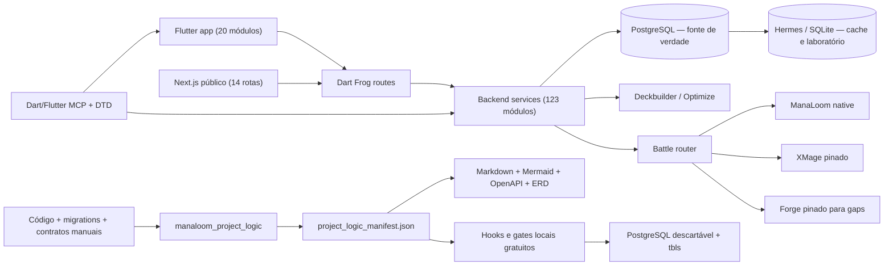

# ManaLoom — arquitetura gerada

> Gerado. A topologia vem do manifesto; razões arquiteturais continuam em ADRs/documentos canônicos.

## Política

- O gerador extrai estrutura; não promove hipótese histórica a verdade.
- PostgreSQL/backend prevalece sobre Hermes/SQLite.
- OpenAPI é estrutural enquanto handlers não tiverem DTOs tipados completos.
- Runtime MCP confirma árvore, erros e estado vivo; não substitui testes nem contratos.
