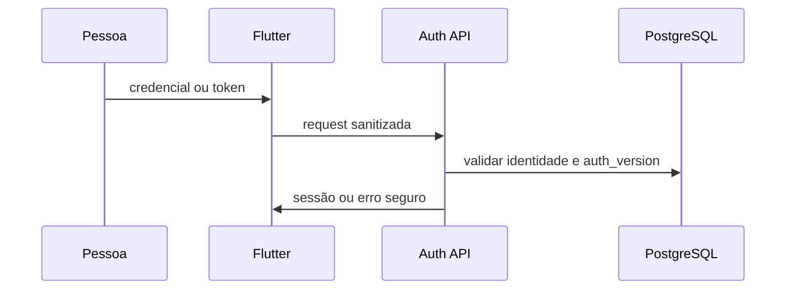
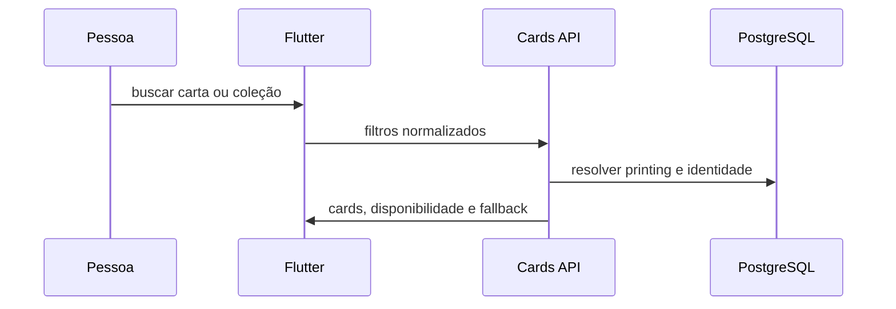
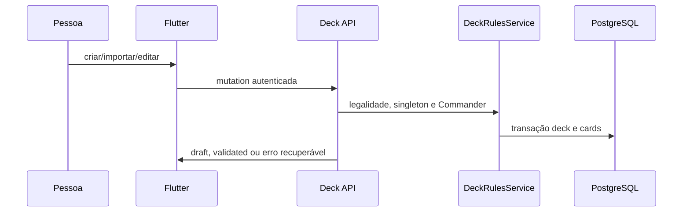
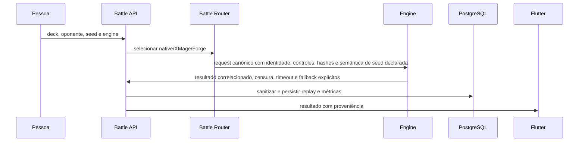
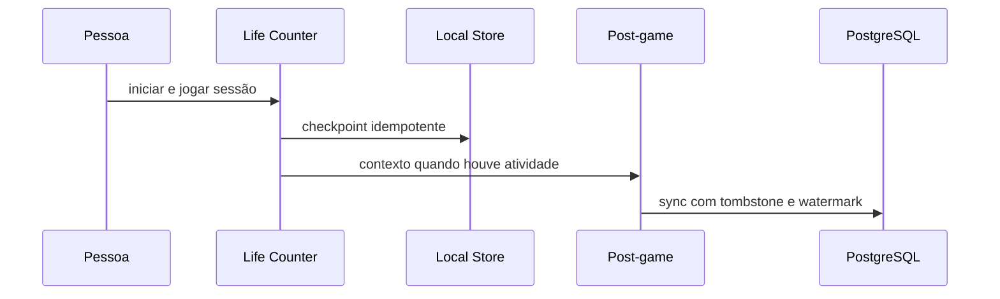
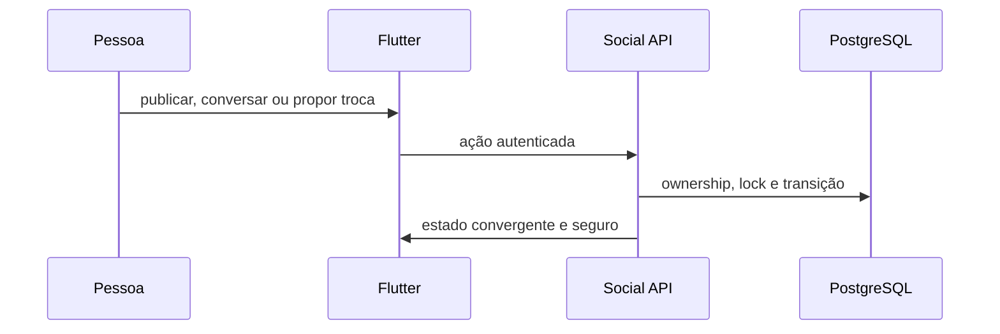
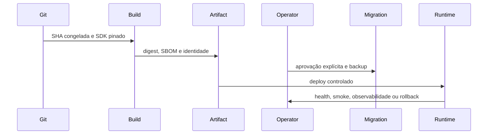

# ManaLoom — fluxos gerados

> As sequências são declaradas em `docs/project_logic_contracts.json`; paths são validados pelo gerador.

## Autenticação, recuperação e sessão

Estado: `active_release_scope`
Fonte de verdade: users/auth_version and backend auth policies



Implementação: `app/lib/features/auth/providers/auth_provider.dart`, `app/lib/core/security/auth_token_store.dart`, `server/lib/auth_service.dart`, `server/lib/auth_runtime_policy.dart`, `server/routes/auth/login.dart`, `server/routes/auth/register.dart`.
Testes: `app/test/features/auth/providers/auth_provider_security_test.dart`, `server/test/auth_flow_integration_test.dart`, `server/test/auth_runtime_policy_test.dart`.
Gates: `scripts/quality_gate.sh`.

## Descoberta de cartas e coleção

Estado: `active_release_scope`
Fonte de verdade: cards, sets, card_legalities and collection availability in PostgreSQL



Implementação: `app/lib/features/cards/providers/card_provider.dart`, `app/lib/features/collection/screens/sets_catalog_screen.dart`, `server/routes/cards/index.dart`, `server/routes/sets/index.dart`, `server/lib/collection_availability_contract.dart`.
Testes: `app/test/features/cards/providers/card_provider_search_test.dart`, `app/test/features/collection/sets_catalog_screen_test.dart`, `server/test/collection_availability_contract_test.dart`.
Gates: `scripts/quality_gate.sh`.

## Criar, importar, editar e validar deck

Estado: `active_release_scope`
Fonte de verdade: decks and deck_cards under DeckRulesService validation



Implementação: `app/lib/features/decks/providers/deck_provider.dart`, `app/lib/features/decks/screens/deck_details_screen.dart`, `server/lib/deck_rules_service.dart`, `server/routes/decks/index.dart`, `server/routes/import/to-deck/index.dart`.
Testes: `app/test/features/decks/screens/deck_runtime_widget_flow_test.dart`, `server/test/deck_rules_service_test.dart`, `server/test/import_to_deck_flow_test.dart`, `server/test/deck_validation_state_route_contract_test.dart`.
Gates: `scripts/quality_gate.sh`, `scripts/manaloom_e2e_suite.sh`.

## Gerar, analisar e otimizar deck com IA

Estado: `experimental_guarded`
Fonte de verdade: Commander deckbuilding contract plus backend deterministic and quality gates

```mermaid
sequenceDiagram
    participant Flutter as Flutter
    participant AI_API as AI API
    participant PostgreSQL as PostgreSQL
    participant Deterministic_Gates as Deterministic Gates
    participant Provider as Provider
    Flutter->>AI_API: objetivo, deck e intenção
    AI_API->>PostgreSQL: estado, legalidade e intelligence snapshot
    AI_API->>Deterministic_Gates: shell, candidates e quality
    AI_API->>Provider: somente quando permitido
    AI_API->>Flutter: preview, diagnóstico e diff; sem auto-apply
```

Implementação: `server/routes/ai/generate/index.dart`, `server/routes/ai/optimize/index.dart`, `server/lib/ai/commander_deckbuilding_contract_support.dart`, `server/lib/ai/optimization_quality_gate.dart`, `app/lib/features/decks/providers/deck_provider_support_ai.dart`.
Testes: `server/test/ai_generate_create_optimize_flow_test.dart`, `server/test/ai_optimize_flow_test.dart`, `server/test/optimization_quality_gate_test.dart`, `app/test/features/decks/providers/deck_provider_ai_runtime_contract_test.dart`.
Gates: `scripts/manaloom_deep_ai_alignment_tester.sh`, `scripts/manaloom_ai_prompt_eval.sh`.

## Battle, evidência de carta e replay

Estado: `active_guarded`
Fonte de verdade: battle request plus persisted battle_simulations; external pins do not promote native rules



Implementação: `server/lib/ai/battle_engine_config.dart`, `server/lib/ai/battle_simulator.dart`, `server/routes/ai/simulate/index.dart`, `server/lib/battle/battle_replay_payload_sanitizer.dart`, `server/lib/battle/battle_replay_read_service.dart`, `docs/hermes-analysis/manaloom-knowledge/scripts/external_battle_async_runner.py`, `services/xmage-sidecar/src/main/java/com/manaloom/xmage/XmageBattleService.java`, `services/forge-sidecar/sidecar.py`, `app/lib/features/battle/screens/battle_replays_screen.dart`.
Testes: `server/test/battle_product_e2e_test.dart`, `server/test/battle_replay_routes_security_test.dart`, `server/test/deck_battle_learning_evidence_test.dart`, `docs/hermes-analysis/manaloom-knowledge/scripts/test_external_battle_async_runner.py`, `services/xmage-sidecar/src/test/java/com/manaloom/xmage/XmageBattleServiceTest.java`, `services/forge-sidecar/test_sidecar.py`, `app/test/features/battle/screens/battle_replays_screen_test.dart`.
Gates: `scripts/manaloom_battle_product_gate.sh`, `scripts/manaloom_external_engine_delta_audit.sh`.

## Life Counter, sessão e pós-jogo

Estado: `active_release_scope`
Fonte de verdade: local game session stores plus PostgreSQL post_game_notes after sync



Implementação: `app/lib/features/home/lotus_life_counter_screen.dart`, `app/lib/features/home/life_counter/life_counter_session_store.dart`, `app/lib/features/retention/services/post_game_note_store.dart`, `server/lib/retention/post_game_note_service.dart`, `server/routes/decks/[id]/post-game-notes/index.dart`.
Testes: `app/test/features/home/lotus_life_counter_screen_test.dart`, `app/test/features/retention/post_game_note_store_test.dart`, `server/test/post_game_note_sync_contract_test.dart`.
Gates: `scripts/quality_gate.sh`, `scripts/manaloom_e2e_suite.sh`.

## Comunidade, mensagens, binder e trades

Estado: `active_requires_release_e2e`
Fonte de verdade: PostgreSQL ownership and transition services



Implementação: `server/routes/community/_middleware.dart`, `server/routes/conversations/_middleware.dart`, `server/routes/trades/index.dart`, `server/routes/binder/index.dart`, `app/lib/features/trades/providers/trade_provider.dart`.
Testes: `server/test/e2e_trade_tests.py`, `server/test/community_engagement_contract_test.dart`, `app/test/features/trades/providers/trade_provider_test.dart`.
Gates: `scripts/manaloom_e2e_suite.sh`.

## Build, migração, deploy, observabilidade e rollback

Estado: `guarded_no_implicit_live_write`
Fonte de verdade: same-SHA release contract, artifact digests, migration ledger and health/readiness



Implementação: `scripts/manaloom_build_beta_release.sh`, `scripts/manaloom_deploy_backend_image.sh`, `scripts/manaloom_deploy_battle_sidecars.sh`, `scripts/manaloom_deploy_flutter_web.sh`, `scripts/manaloom_generate_release_sbom.py`, `server/bin/migrate.dart`, `server/lib/health_readiness_support.dart`.
Testes: `server/test/deploy_rollback_convergence_contract_test.dart`, `server/test/ops_sidecar_digest_release_contract_test.dart`, `server/test/release_sbom_scope_test.py`, `server/test/flutter_web_deploy_contract_test.dart`, `server/test/data_model_migration_test.dart`.
Gates: `scripts/manaloom_release_ops_contract_test.sh`, `scripts/manaloom_e2e_suite.sh`.
