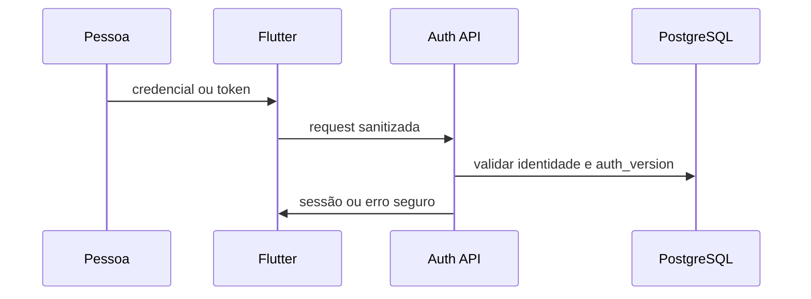
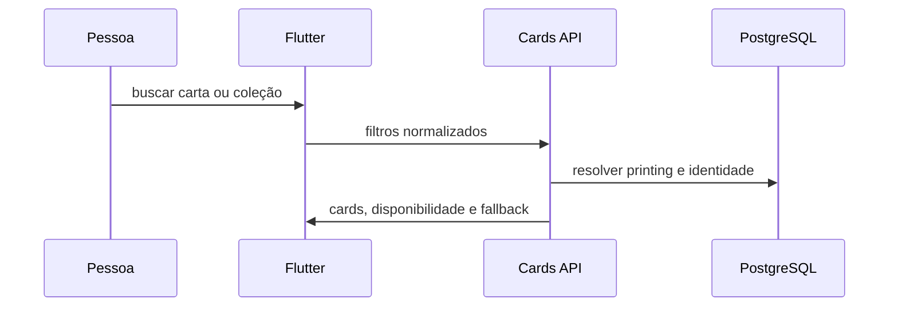
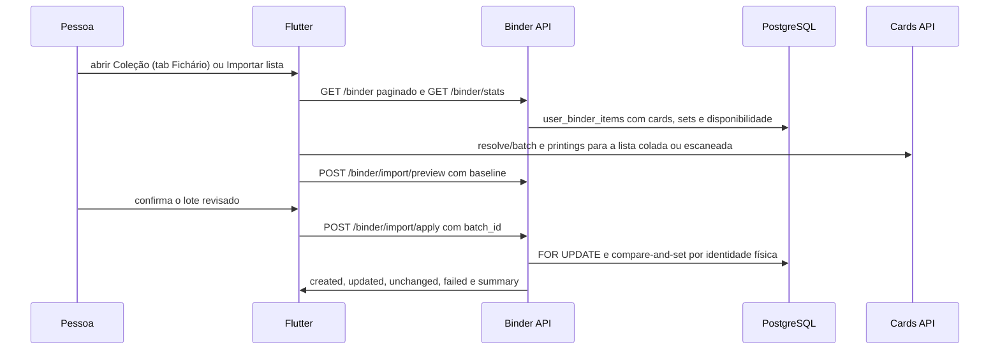
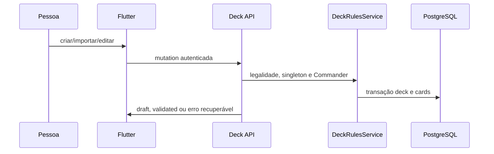
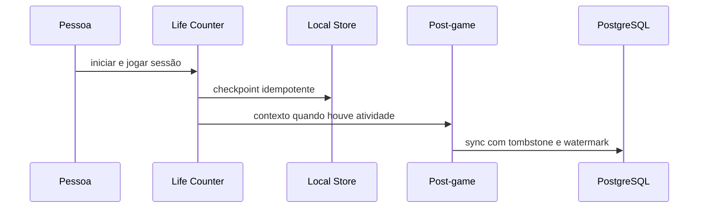
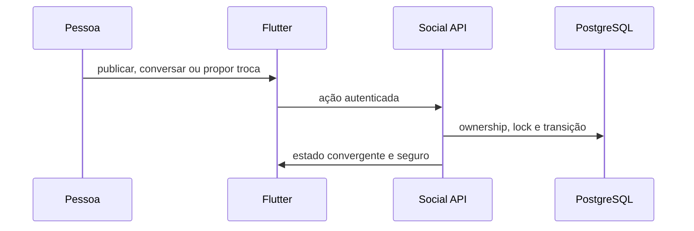
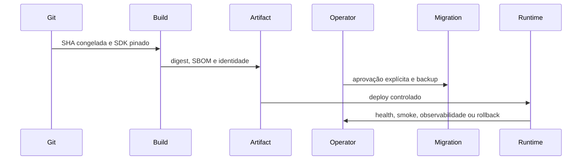

# ManaLoom — fluxos gerados

> As sequências são declaradas em `docs/project_logic_contracts.json`; paths são validados pelo gerador.

## Autenticação, recuperação e sessão

Estado: `active_release_scope`
Fonte de verdade: users/auth_version and backend auth policies

```mermaid
sequenceDiagram
    participant Pessoa as Pessoa
    participant Flutter as Flutter
    participant Auth_API as Auth API
    participant PostgreSQL as PostgreSQL
    Pessoa->>Flutter: credencial ou token
    Flutter->>Auth_API: request sanitizada
    Auth_API->>PostgreSQL: validar identidade e auth_version
    Auth_API->>Flutter: sessão ou erro seguro
```

Implementação: `app/lib/features/auth/providers/auth_provider.dart`, `app/lib/core/security/auth_token_store.dart`, `server/lib/auth_service.dart`, `server/lib/auth_runtime_policy.dart`, `server/routes/auth/login.dart`, `server/routes/auth/register.dart`.
Testes: `app/test/features/auth/providers/auth_provider_security_test.dart`, `server/test/auth_flow_integration_test.dart`, `server/test/auth_runtime_policy_test.dart`.
Gates: `scripts/quality_gate.sh`.

## Home, onboarding, notificações e retenção

Estado: `active_release_scope`
Fonte de verdade: notifications and activation_funnel_events in PostgreSQL; onboarding disposition lives only on the device (SharedPreferences); /notifications and PUT /users/me/fcm-token require social_push

```mermaid
sequenceDiagram
    participant Pessoa as Pessoa
    participant Flutter as Flutter
    participant Capabilities_API as Capabilities API
    participant Local_Store as Local Store
    participant Activation_API as Activation API
    participant PostgreSQL as PostgreSQL
    participant Notifications_API as Notifications API
    Pessoa->>Flutter: abre o app
    Flutter->>Capabilities_API: GET /capabilities antes de qualquer rota
    Flutter->>Local_Store: disposição do onboarding: pending, completed ou skipped
    Flutter->>Activation_API: POST /users/me/activation-events com recibo local
    Activation_API->>PostgreSQL: INSERT activation_funnel_events
    Flutter->>Notifications_API: GET /notifications/count a cada 30 s; PUT /users/me/fcm-token só com social_push
    Notifications_API->>PostgreSQL: SELECT e UPDATE notifications
    Notifications_API->>Flutter: lista, badge ou 404 capability_unavailable
```

Implementação: `app/lib/main.dart`, `app/lib/features/home/home_screen.dart`, `app/lib/features/home/onboarding_core_flow_screen.dart`, `app/lib/features/home/services/onboarding_state_store.dart`, `app/lib/features/notifications/providers/notification_provider.dart`, `app/lib/features/notifications/screens/notification_screen.dart`, `app/lib/features/notifications/widgets/notification_permission_boundary.dart`, `app/lib/core/widgets/shell_app_bar_actions.dart`, `app/lib/core/widgets/main_scaffold.dart`, `app/lib/core/services/activation_funnel_service.dart`, `app/lib/core/services/push_notification_service.dart`, `app/lib/core/services/realtime_notification_coordinator.dart`, `server/routes/notifications/_middleware.dart`, `server/routes/notifications/index.dart`, `server/routes/notifications/count.dart`, `server/routes/notifications/read-all.dart`, `server/routes/notifications/[id]/read.dart`, `server/routes/users/me/fcm-token/index.dart`, `server/routes/users/me/activation-events/index.dart`, `server/lib/notification_service.dart`, `server/lib/push_notification_service.dart`.
Testes: `app/test/core/config/release_capabilities_test.dart`, `app/test/features/auth/providers/auth_provider_onboarding_test.dart`, `app/test/features/home/onboarding_core_flow_screen_test.dart`, `app/test/features/home/services/onboarding_state_store_test.dart`, `app/test/features/home/home_screen_test.dart`, `app/test/core/services/activation_funnel_service_test.dart`, `app/test/core/services/realtime_notification_coordinator_test.dart`, `app/test/features/notifications/models/notification_models_test.dart`, `app/test/features/notifications/screens/notification_screen_test.dart`, `app/test/features/notifications/widgets/notification_permission_boundary_test.dart`, `app/integration_test/onboarding_first_run_runtime_test.dart`, `app/integration_test/realtime_notifications_runtime_test.dart`, `server/test/activation_events_contract_test.dart`, `server/test/push_notification_service_test.dart`.
Gates: `scripts/quality_gate.sh`, `scripts/manaloom_ui_live_evidence_gate.sh`.

## Descoberta de cartas e coleção

Estado: `active_release_scope`
Fonte de verdade: cards, sets, card_legalities and collection availability in PostgreSQL

```mermaid
sequenceDiagram
    participant Pessoa as Pessoa
    participant Flutter as Flutter
    participant Cards_API as Cards API
    participant PostgreSQL as PostgreSQL
    Pessoa->>Flutter: buscar carta ou coleção
    Flutter->>Cards_API: filtros normalizados
    Cards_API->>PostgreSQL: resolver printing e identidade
    Cards_API->>Flutter: cards, disponibilidade e fallback
```

Implementação: `app/lib/features/cards/providers/card_provider.dart`, `app/lib/features/collection/screens/sets_catalog_screen.dart`, `server/routes/cards/index.dart`, `server/routes/sets/index.dart`.
Testes: `app/test/features/cards/providers/card_provider_search_test.dart`, `app/test/features/collection/sets_catalog_screen_test.dart`.
Gates: `scripts/quality_gate.sh`.

## Fichário, importação de coleção e scanner

Estado: `active_release_scope`
Fonte de verdade: user_binder_items in PostgreSQL under binder_item_contract and binder_import_contract (compare-and-set per physical identity); availability derived from decks; scanner requires ENABLE_SCANNER_RELEASE build flag plus the scanner capability

```mermaid
sequenceDiagram
    participant Pessoa as Pessoa
    participant Flutter as Flutter
    participant Binder_API as Binder API
    participant PostgreSQL as PostgreSQL
    participant Cards_API as Cards API
    Pessoa->>Flutter: abrir Coleção (tab Fichário) ou Importar lista
    Flutter->>Binder_API: GET /binder paginado e GET /binder/stats
    Binder_API->>PostgreSQL: user_binder_items com cards, sets e disponibilidade
    Flutter->>Cards_API: resolve/batch e printings para a lista colada ou escaneada
    Flutter->>Binder_API: POST /binder/import/preview com baseline
    Pessoa->>Flutter: confirma o lote revisado
    Flutter->>Binder_API: POST /binder/import/apply com batch_id
    Binder_API->>PostgreSQL: FOR UPDATE e compare-and-set por identidade física
    Binder_API->>Flutter: created, updated, unchanged, failed e summary
```

Implementação: `app/lib/features/collection/screens/collection_screen.dart`, `app/lib/features/binder/screens/binder_screen.dart`, `app/lib/features/binder/screens/binder_import_screen.dart`, `app/lib/features/binder/providers/binder_provider.dart`, `app/lib/features/binder/providers/binder_import_provider.dart`, `app/lib/features/binder/models/binder_import_models.dart`, `app/lib/features/binder/services/binder_import_draft_store.dart`, `app/lib/features/binder/widgets/binder_item_editor.dart`, `app/lib/features/scanner/screens/card_scanner_screen.dart`, `app/lib/features/scanner/providers/scanner_provider.dart`, `app/lib/features/scanner/services/scanner_card_search_service.dart`, `app/lib/features/trades/screens/trade_matches_screen.dart`, `app/lib/core/config/launch_features.dart`, `server/routes/binder/_middleware.dart`, `server/routes/binder/index.dart`, `server/routes/binder/[id]/index.dart`, `server/routes/binder/import/preview/index.dart`, `server/routes/binder/import/apply/index.dart`, `server/routes/community/trade-matches/index.dart`, `server/routes/community/binders/[userId].dart`, `server/lib/binder_item_contract.dart`, `server/lib/binder_import_contract.dart`, `server/lib/collection_availability_contract.dart`, `server/lib/community_engagement_service.dart`.
Testes: `app/test/features/binder/providers/binder_provider_test.dart`, `app/test/features/binder/providers/binder_import_provider_test.dart`, `app/test/features/binder/screens/binder_screen_resilience_test.dart`, `app/test/features/binder/screens/binder_import_screen_test.dart`, `app/test/features/collection/collection_screen_responsive_test.dart`, `app/test/features/scanner/scanner_collection_session_contract_test.dart`, `app/test/features/trades/screens/trade_matches_screen_test.dart`, `server/test/binder_route_test.dart`, `server/test/binder_item_contract_test.dart`, `server/test/binder_import_contract_test.dart`, `server/test/collection_availability_contract_test.dart`, `server/test/collection_availability_route_contract_test.dart`.
Gates: `scripts/quality_gate.sh`, `scripts/manaloom_binder_import_visual_qa.sh`, `scripts/manaloom_ui_live_evidence_gate.sh`.

## Criar, importar, editar e validar deck

Estado: `active_release_scope`
Fonte de verdade: decks and deck_cards under DeckRulesService validation

```mermaid
sequenceDiagram
    participant Pessoa as Pessoa
    participant Flutter as Flutter
    participant Deck_API as Deck API
    participant DeckRulesService as DeckRulesService
    participant PostgreSQL as PostgreSQL
    Pessoa->>Flutter: criar/importar/editar
    Flutter->>Deck_API: mutation autenticada
    Deck_API->>DeckRulesService: legalidade, singleton e Commander
    DeckRulesService->>PostgreSQL: transação deck e cards
    Deck_API->>Flutter: draft, validated ou erro recuperável
```

Implementação: `app/lib/features/decks/providers/deck_provider.dart`, `app/lib/features/decks/screens/deck_details_screen.dart`, `server/lib/deck_rules_service.dart`, `server/routes/decks/index.dart`, `server/routes/import/to-deck/index.dart`.
Testes: `app/test/features/decks/screens/deck_runtime_widget_flow_test.dart`, `server/test/deck_rules_service_test.dart`, `server/test/import_to_deck_flow_test.dart`, `server/test/deck_validation_state_route_contract_test.dart`.
Gates: `scripts/quality_gate.sh`, `scripts/manaloom_e2e_suite.sh`.

## Gerar, analisar e otimizar deck com IA

Estado: `experimental_split: analyze_optimize=experimental_p0_open; generate_rebuild=experimental_guarded`
Fonte de verdade: Commander deckbuilding contract plus backend deterministic and quality gates

```mermaid
sequenceDiagram
    participant Flutter as Flutter
    participant AI_API as AI API
    participant PostgreSQL as PostgreSQL
    participant Deterministic_Gates as Deterministic Gates
    participant Provider as Provider
    Flutter->>AI_API: objetivo, deck e intenção
    AI_API->>PostgreSQL: estado, legalidade e intelligence snapshot
    AI_API->>Deterministic_Gates: shell, candidates e quality
    AI_API->>Provider: somente quando permitido
    AI_API->>Flutter: preview, diagnóstico e diff; sem auto-apply
```

Implementação: `server/routes/ai/generate/index.dart`, `server/routes/ai/optimize/index.dart`, `server/routes/ai/rebuild/index.dart`, `server/routes/ai/commander-reference/index.dart`, `server/routes/ai/commander-learning/index.dart`, `server/routes/decks/[id]/analysis/index.dart`, `server/routes/decks/[id]/ai-analysis/index.dart`, `server/routes/decks/[id]/index.dart`, `server/lib/deck_rules_service.dart`, `server/lib/ai_generate_job.dart`, `server/lib/ai/optimize_job.dart`, `server/lib/ai/commander_deckbuilding_contract_support.dart`, `server/lib/ai/optimization_quality_gate.dart`, `server/lib/ai/optimize_cache_support.dart`, `server/lib/ai/deck_learning_event_support.dart`, `server/lib/ai/rebuild_guided_service.dart`, `app/lib/features/decks/providers/deck_provider_support_ai.dart`, `app/lib/features/decks/providers/deck_provider_support_generation.dart`, `app/lib/features/decks/widgets/deck_analysis_tab.dart`.
Testes: `server/test/ai_generate_create_optimize_flow_test.dart`, `server/test/ai_generate_learning_boundary_test.dart`, `server/test/ai_generate_performance_support_test.dart`, `server/test/ai_optimize_flow_test.dart`, `server/test/optimize_cache_support_test.dart`, `server/test/optimize_learning_pipeline_test.dart`, `server/test/optimization_quality_gate_test.dart`, `server/test/commander_learned_deck_support_test.dart`, `server/test/commander_reference_read_only_contract_test.dart`, `server/test/production_ai_mock_fallback_policy_test.dart`, `app/test/features/decks/providers/deck_provider_ai_runtime_contract_test.dart`, `app/test/features/decks/providers/deck_provider_support_test.dart`, `app/test/features/decks/widgets/deck_analysis_tab_test.dart`.
Gates: `scripts/manaloom_deck_ai_learning_gate.sh`, `scripts/manaloom_deep_ai_alignment_tester.sh`, `scripts/manaloom_ai_prompt_eval.sh`.

## Battle, Jogar contra IA, evidência de carta e replay

Estado: `active_guarded`
Fonte de verdade: persisted battle attempts, jobs and replays plus pinned execution identity; external pins do not promote native rules

```mermaid
sequenceDiagram
    participant Pessoa as Pessoa
    participant Battle_API as Battle API
    participant PostgreSQL as PostgreSQL
    participant Battle_Worker as Battle Worker
    participant Battle_Router as Battle Router
    participant Engine as Engine
    participant Jogar_contra_IA as Jogar contra IA
    participant Live_interno as Live interno
    participant Flutter as Flutter
    Pessoa->>Battle_API: deck, oponente, seed e engine
    Battle_API->>PostgreSQL: persistir attempt/job, hashes, owner e estado fechado
    Battle_Worker->>Battle_Router: claim com lease e selecionar native/XMage/Forge
    Battle_Router->>Engine: request canônico com identidade, controles, hashes e semântica de seed declarada
    Engine->>Jogar_contra_IA: estado privado, mão própria e prompts tipados para o humano; nunca mão adversária
    Engine->>Live_interno: eventos/snapshots incrementais somente para execução, recuperação, diagnóstico e evidência; nenhuma rota pública
    Engine->>Battle_Worker: resultado correlacionado, censura, timeout e fallback explícitos
    Battle_API->>PostgreSQL: sanitizar e persistir replay e métricas
    Battle_API->>Flutter: resultado com proveniência
```

Implementação: `server/lib/ai/battle_engine_config.dart`, `server/lib/battle/battle_execution_runtime.dart`, `server/routes/ai/simulate/index.dart`, `server/lib/battle/battle_replay_payload_sanitizer.dart`, `server/lib/battle/battle_replay_read_service.dart`, `server/lib/battle/battle_simulation_attempt_service.dart`, `server/lib/battle/battle_replay_annotation_service.dart`, `server/lib/battle/battle_job_service.dart`, `server/lib/battle/battle_job_runner.dart`, `server/lib/battle/battle_job_metrics_service.dart`, `server/lib/battle/battle_live_cursor_contract.dart`, `server/lib/battle/battle_live_service.dart`, `server/lib/battle/battle_live_store.dart`, `server/lib/battle/interactive_battle_contract.dart`, `server/lib/battle/interactive_battle_runtime_client.dart`, `server/lib/battle/interactive_battle_service.dart`, `server/lib/battle/interactive_battle_store.dart`, `server/routes/ai/battle/sessions/index.dart`, `server/routes/ai/battle/sessions/[id]/index.dart`, `server/routes/ai/battle/sessions/[id]/actions/index.dart`, `server/routes/ai/battle/sessions/[id]/concede/index.dart`, `docs/hermes-analysis/manaloom-knowledge/scripts/external_battle_async_runner.py`, `services/xmage-sidecar/src/main/java/com/manaloom/xmage/XmageBattleService.java`, `services/xmage-sidecar/src/main/java/com/manaloom/xmage/XmageCardQualificationPolicy.java`, `services/xmage-sidecar/src/main/java/com/manaloom/xmage/BattleLiveRegistry.java`, `services/xmage-sidecar/src/main/java/com/manaloom/xmage/InteractiveBattleRegistry.java`, `services/xmage-sidecar/src/main/java/com/manaloom/xmage/SidecarMain.java`, `services/forge-sidecar/sidecar.py`, `app/lib/features/battle/models/interactive_battle_session.dart`, `app/lib/features/battle/screens/battle_coach_screen.dart`, `app/lib/features/battle/screens/battle_replays_screen.dart`, `app/lib/features/battle/screens/battle_live_spectator_screen.dart`, `app/lib/features/battle/services/battle_job_gateway.dart`, `app/lib/features/battle/services/interactive_battle_service.dart`, `scripts/manaloom_play_vs_ai_e2e.sh`.
Testes: `server/test/battle_product_e2e_test.dart`, `server/test/battle_replay_routes_security_test.dart`, `server/test/battle_simulation_attempt_service_test.dart`, `server/test/battle_replay_annotation_service_test.dart`, `server/test/battle_job_runner_test.dart`, `server/test/battle_job_metrics_service_test.dart`, `server/test/battle_live_cursor_contract_test.dart`, `server/test/deck_battle_learning_evidence_test.dart`, `server/test/interactive_battle_contract_test.dart`, `server/test/interactive_battle_route_contract_test.dart`, `server/test/interactive_battle_runtime_client_test.dart`, `server/test/interactive_battle_service_test.dart`, `server/test/interactive_battle_store_live_test.dart`, `server/test/interactive_battle_migration_test.dart`, `server/test/xmage_interactive_release_contract_test.dart`, `server/test/play_vs_ai_real_xmage_e2e_test.dart`, `docs/hermes-analysis/manaloom-knowledge/scripts/test_external_battle_async_runner.py`, `services/xmage-sidecar/src/test/java/com/manaloom/xmage/XmageBattleServiceTest.java`, `services/xmage-sidecar/src/test/java/com/manaloom/xmage/BattleLiveRegistryTest.java`, `services/xmage-sidecar/src/test/java/com/manaloom/xmage/InteractiveBattleRegistryTest.java`, `services/forge-sidecar/test_sidecar.py`, `app/test/features/battle/models/interactive_battle_session_test.dart`, `app/test/features/battle/screens/battle_coach_screen_test.dart`, `app/integration_test/battle_coach_visual_runtime_proof_test.dart`, `app/test/features/battle/screens/battle_replays_screen_test.dart`, `app/test/features/battle/screens/battle_live_spectator_screen_test.dart`, `app/test/features/battle/services/battle_job_gateway_test.dart`, `app/test/features/battle/services/interactive_battle_service_test.dart`.
Gates: `scripts/quality_gate.sh`, `scripts/manaloom_battle_product_gate.sh`, `scripts/manaloom_external_engine_delta_audit.sh`, `scripts/manaloom_ui_live_evidence_gate.sh`, `scripts/manaloom_play_vs_ai_e2e.sh`.

## Life Counter, sessão e pós-jogo

Estado: `active_release_scope`
Fonte de verdade: local game session stores plus PostgreSQL post_game_notes after sync

```mermaid
sequenceDiagram
    participant Pessoa as Pessoa
    participant Life_Counter as Life Counter
    participant Local_Store as Local Store
    participant Post_game as Post-game
    participant PostgreSQL as PostgreSQL
    Pessoa->>Life_Counter: iniciar e jogar sessão
    Life_Counter->>Local_Store: checkpoint idempotente
    Life_Counter->>Post_game: contexto quando houve atividade
    Post_game->>PostgreSQL: sync com tombstone e watermark
```

Implementação: `app/lib/features/home/lotus_life_counter_screen.dart`, `app/lib/features/home/life_counter/life_counter_session_store.dart`, `app/lib/features/retention/services/post_game_note_store.dart`, `server/lib/retention/post_game_note_service.dart`, `server/routes/decks/[id]/post-game-notes/index.dart`.
Testes: `app/test/features/home/lotus_life_counter_screen_test.dart`, `app/test/features/retention/post_game_note_store_test.dart`, `server/test/post_game_note_sync_contract_test.dart`.
Gates: `scripts/quality_gate.sh`, `scripts/manaloom_e2e_suite.sh`.

## Comunidade, mensagens, binder e trades

Estado: `active_requires_release_e2e`
Fonte de verdade: PostgreSQL ownership and transition services

```mermaid
sequenceDiagram
    participant Pessoa as Pessoa
    participant Flutter as Flutter
    participant Social_API as Social API
    participant PostgreSQL as PostgreSQL
    Pessoa->>Flutter: publicar, conversar ou propor troca
    Flutter->>Social_API: ação autenticada
    Social_API->>PostgreSQL: ownership, lock e transição
    Social_API->>Flutter: estado convergente e seguro
```

Implementação: `server/routes/community/_middleware.dart`, `server/routes/conversations/_middleware.dart`, `server/routes/trades/index.dart`, `server/routes/binder/index.dart`, `app/lib/features/trades/providers/trade_provider.dart`.
Testes: `server/test/e2e_trade_tests.py`, `server/test/community_engagement_contract_test.dart`, `app/test/features/trades/providers/trade_provider_test.dart`.
Gates: `scripts/quality_gate.sh`, `scripts/manaloom_e2e_suite.sh`.

## Build, migração, deploy, observabilidade e rollback

Estado: `guarded_no_implicit_live_write`
Fonte de verdade: same-SHA release contract, artifact digests, migration ledger and health/readiness

```mermaid
sequenceDiagram
    participant Git as Git
    participant Build as Build
    participant Artifact as Artifact
    participant Operator as Operator
    participant Migration as Migration
    participant Runtime as Runtime
    Git->>Build: SHA congelada e SDK pinado
    Build->>Artifact: digest, SBOM e identidade
    Operator->>Migration: aprovação explícita e backup
    Artifact->>Runtime: deploy controlado
    Runtime->>Operator: health, smoke, observabilidade ou rollback
```

Implementação: `scripts/manaloom_build_beta_release.sh`, `scripts/manaloom_deploy_backend_image.sh`, `scripts/manaloom_deploy_battle_sidecars.sh`, `scripts/manaloom_deploy_flutter_web.sh`, `scripts/manaloom_generate_release_sbom.py`, `server/bin/migrate.dart`, `server/lib/health_readiness_support.dart`, `server/routes/_middleware.dart`, `server/lib/release_capability_policy.dart`, `server/routes/capabilities/index.dart`, `app/lib/core/config/release_capabilities.dart`, `server/bin/manaloom_ops_daemon.py`.
Testes: `server/test/deploy_rollback_convergence_contract_test.dart`, `server/test/ops_sidecar_digest_release_contract_test.dart`, `server/test/release_sbom_scope_test.py`, `server/test/flutter_web_deploy_contract_test.dart`, `server/test/data_model_migration_test.dart`, `server/test/release_capability_policy_test.dart`, `app/test/core/config/release_capabilities_test.dart`, `app/test/core/config/release_capability_surface_contract_test.dart`, `server/test/manaloom_ops_daemon_test.py`.
Gates: `scripts/quality_gate.sh`, `scripts/manaloom_release_ops_contract_test.sh`, `scripts/manaloom_e2e_suite.sh`.

## Plano, cota de IA e comércio (beta gratuita, sem cobrança)

Estado: `free_beta_no_commerce`
Fonte de verdade: user_plans and ai_logs in PostgreSQL under PlanService; offer_mode free_beta_no_commerce in server/config/release_capabilities.json; no payment provider exists

```mermaid
sequenceDiagram
    participant Pessoa as Pessoa
    participant Flutter as Flutter
    participant Plan_API as Plan API
    participant PostgreSQL as PostgreSQL
    participant AI_API as AI API
    participant Plan_Middleware as Plan Middleware
    participant Billing_API as Billing API
    Pessoa->>Flutter: abre /plans; /upgrade e /checkout redirecionam para /plans
    Flutter->>Plan_API: GET /users/me/plan (plano de controle, sem capability)
    Plan_API->>PostgreSQL: user_plans e uso mensal em ai_logs
    Flutter->>AI_API: ação de IA com cota
    AI_API->>Plan_Middleware: capability primeiro; depois teto de 120 ações por mês UTC
    Billing_API->>Flutter: checkout e webhook fail-closed: 404 capability_unavailable antes do handler
```

Implementação: `app/lib/features/commercial/models/commercial_launch_policy.dart`, `app/lib/features/commercial/models/manaloom_plan.dart`, `app/lib/features/commercial/providers/commercial_provider.dart`, `app/lib/features/commercial/screens/plan_screen.dart`, `app/lib/features/commercial/screens/upgrade_screen.dart`, `app/lib/features/commercial/screens/checkout_screen.dart`, `app/lib/features/commercial/widgets/ai_usage_gate.dart`, `app/lib/features/commercial/widgets/ai_usage_meter.dart`, `app/lib/core/config/release_capabilities.dart`, `server/routes/users/me/plan/index.dart`, `server/routes/users/me/plan/checkout/index.dart`, `server/routes/billing/webhook/index.dart`, `server/routes/health/commercial/index.dart`, `server/routes/ai/_middleware.dart`, `server/lib/plan_service.dart`, `server/lib/plan_middleware.dart`, `server/lib/billing/payment_provider.dart`.
Testes: `app/test/features/commercial/commercial_provider_test.dart`, `app/test/features/commercial/ai_usage_gate_test.dart`, `app/test/features/commercial/ai_usage_meter_test.dart`, `app/test/features/commercial/checkout_screen_test.dart`, `app/test/features/commercial/commercial_screens_responsive_test.dart`, `app/test/features/commercial/legal_account_cycle_test.dart`, `app/test/features/commercial/manaloom_plan_test.dart`, `app/test/core/config/release_capabilities_test.dart`, `server/test/plan_checkout_contract_test.dart`, `server/test/payment_provider_url_test.dart`, `server/test/ai_middleware_order_contract_test.dart`, `server/test/ai_plan_async_settlement_contract_test.dart`, `server/test/release_capability_policy_test.dart`.
Gates: `scripts/quality_gate.sh`, `scripts/manaloom_commercial_quality_gate.sh`.

## Site público (brewtact.com) e relatório compartilhável

Estado: `active_release_scope`
Fonte de verdade: web-public/src/lib/product-data.ts and routes.ts under the free-beta offer contract; shared_deck_reports in PostgreSQL for GET /reports/{id}; no product capability is served

```mermaid
sequenceDiagram
    participant Visitante as Visitante
    participant Next_js as Next.js
    participant Reports_API as Reports API
    participant PostgreSQL as PostgreSQL
    Visitante->>Next_js: abre brewtact.com (11 rotas estáticas)
    Next_js->>Visitante: beta gratuita; nenhum link para /app
    Visitante->>Next_js: abre /reports/{id}
    Next_js->>Reports_API: GET /reports/{id} anônimo
    Reports_API->>PostgreSQL: shared_deck_reports com decks e deck_cards
    Reports_API->>Next_js: relatório público ou 404
```

Implementação: `web-public/src/app/page.tsx`, `web-public/src/app/pricing/page.tsx`, `web-public/src/app/reports/[id]/page.tsx`, `web-public/src/components/site-shell.tsx`, `web-public/src/components/ui.tsx`, `web-public/src/lib/product-data.ts`, `web-public/src/lib/public-server.ts`, `web-public/src/lib/routes.ts`, `server/routes/reports/[id].dart`, `server/lib/reports/shareable_report_service.dart`, `server/lib/public_site_url.dart`, `scripts/manaloom_deploy_public_web.sh`, `scripts/manaloom_public_web_smoke.sh`.
Testes: `web-public/tests/free-beta-offer-contract.mjs`, `server/test/user_facing_brand_contract_test.dart`.
Gates: `scripts/quality_gate.sh`, `scripts/manaloom_public_web_smoke.sh`.

## Scheduler operacional (manaloom-ops) e sincronizações

Estado: `guarded_no_implicit_live_write`
Fonte de verdade: server/bin/manaloom_ops_daemon.py with JOB_REQUIRED_CAPABILITIES (16 jobs) reading server/config/release_capabilities.json; with every capability off only hermes_cron_governor_report runs (safe_housekeeping_only)

```mermaid
sequenceDiagram
    participant Operator as Operator
    participant Ops_Image as Ops Image
    participant Ops_Daemon as Ops Daemon
    participant Capability_Policy as Capability Policy
    participant Job as Job
    participant PostgreSQL as PostgreSQL
    Operator->>Ops_Image: deploy da imagem do daemon (mesmo SHA)
    Ops_Daemon->>Capability_Policy: lê release_capabilities.json no boot
    Ops_Daemon->>Job: só agenda job cuja capability está on; senão safe_housekeeping_only
    Job->>PostgreSQL: sync_log, sync_state e data_source_snapshots
    Ops_Daemon->>Operator: GET /health próprio e relatório do governor
```

Implementação: `server/bin/manaloom_ops_daemon.py`, `scripts/manaloom_deploy_ops_image.sh`, `server/bin/hermes_cron_governor_report.sh`, `server/bin/cron_cleanup_optimize_telemetry.sh`, `server/bin/sync_card_legalities_from_scryfall.sh`, `server/bin/sync_cards.dart`, `server/bin/sync_staples.dart`, `server/bin/sync_status.dart`.
Testes: `server/test/manaloom_ops_daemon_test.py`.
Gates: `scripts/manaloom_battle_product_gate.sh`.
