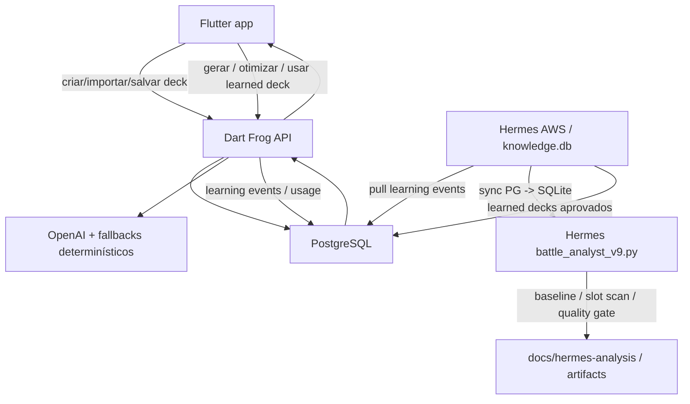

# Battle, AI Deckbuilding e Lorehold - Deep Dive de Logica Atual

> Data: 2026-06-11
> Base local verificada: `master@b11456cf43c7aa5b8bfd2cd012816648afc64e78`
> Escopo: documentar como a logica funciona hoje para battle simulator, geracao
> de decks com IA, melhoria/otimizacao de decks, Hermes e Lorehold.
>
> Este documento e analitico. Ele nao autoriza apply automatico de swaps,
> feature flags ou migracoes sem testes focados. Nao contem secrets, tokens,
> DSNs completos, JWTs, connection strings ou dados privados de usuarios.

## 1. Objetivo

Este documento existe para permitir comparar a logica atual do ManaLoom com
novos planos de implementacao sem depender de memoria verbal.

Ele responde:

- onde comeca a logica de simulacao;
- qual simulador e produto, qual simulador e laboratorio Hermes;
- como a IA gera decks;
- como a IA melhora decks;
- como o Hermes aprende e sincroniza conhecimento;
- como Lorehold virou caso de estudo;
- quais gaps precisam ser implementados antes de transformar conhecimento
  Hermes em logica permanente do servidor.

## 2. Fontes de verdade consultadas

### Codigo backend

- `server/routes/decks/[id]/simulate/index.dart`
- `server/lib/ai/battle_simulator.dart`
- `server/routes/ai/generate/index.dart`
- `server/routes/ai/optimize/index.dart`
- `server/routes/ai/commander-learning/index.dart`
- `server/lib/ai/commander_learned_deck_support.dart`
- `server/lib/ai/deck_learning_event_support.dart`
- `server/lib/generated_deck_validation_service.dart`
- `server/lib/deck_rules_service.dart`
- `server/lib/commander_pairing.dart`
- `server/lib/commander_eligibility.dart`
- `server/lib/ai/candidate_quality_data_support.dart`
- `server/database_setup.sql`

### Hermes e conhecimento

- `docs/hermes-analysis/BATTLE_SYSTEM_LOGIC.md`
- `docs/hermes-analysis/BATTLE_AND_DECK_IMPROVEMENT_PROGRESS_2026-06-10.md`
- `docs/hermes-analysis/HERMES_CRON_VALUE_AND_MIGRATION_AUDIT_2026-06-11.md`
- `docs/hermes-analysis/HERMES_E2E_SYSTEM_CONTRACT_2026-06-07.md`
- `docs/hermes-analysis/manaloom-knowledge/LOREHOLD_ACTIVE_DECK_PROMOTION.md`
- `docs/hermes-analysis/manaloom-knowledge/LOREHOLD_BEST_OF_LEARNED.md`
- `docs/hermes-analysis/manaloom-knowledge/LOREHOLD_BEST_OF_LEARNED_NO_MOX_CARD_RATIONALE.md`
- `docs/hermes-analysis/manaloom-knowledge/scripts/battle_analyst_v9.py`
- `docs/hermes-analysis/manaloom-knowledge/scripts/sync_pg_target_deck_to_hermes.py`
- `docs/hermes-analysis/manaloom-knowledge/scripts/slot_optimizer.py`
- `docs/hermes-analysis/manaloom-knowledge/scripts/master_optimizer_baseline.py`
- `docs/hermes-analysis/manaloom-knowledge/scripts/master_optimizer_quality_gate.py`
- `docs/hermes-analysis/manaloom-knowledge/scripts/master_optimizer_preflight_cron.sh`
- `docs/hermes-analysis/manaloom-knowledge/scripts/master_optimizer_end_to_end.sh`

### Estado observado

- `server/routes/ai/generate/index.dart`: 1684 linhas.
- `server/routes/ai/optimize/index.dart`: 2321 linhas.
- `server/lib/ai/optimize_runtime_support.dart`: 551 linhas.
- `server/lib/ai/battle_simulator.dart`: 879 linhas.
- `docs/hermes-analysis/manaloom-knowledge/scripts/battle_analyst_v9.py`: 7311 linhas.
- `docs/hermes-analysis/manaloom-knowledge/scripts/slot_optimizer.py`: 514 linhas.
- `docs/hermes-analysis/manaloom-knowledge/scripts/master_optimizer_quality_gate.py`: 87 linhas.
- `docs/hermes-analysis/manaloom-knowledge/scripts/sync_pg_target_deck_to_hermes.py`: 422 linhas.

## 3. Mapa geral do fluxo



Regra de propriedade:

- PostgreSQL e backend sao fonte de verdade para produto.
- Hermes e laboratorio de aprendizado, simulacao e auditoria.
- SQLite Hermes e cache operacional, nao fonte final.
- App Flutter nunca deve decidir legalidade, regras MTG, identidade de cor,
  resultado de IA ou sincronizacao externa como autoridade final.

## 4. Existem dois simuladores diferentes

### 4.1 Simulador app/API-facing

Arquivos:

- `server/routes/decks/[id]/simulate/index.dart`
- `server/lib/ai/battle_simulator.dart`

Função atual:

- fornecer estatisticas simples de consistencia;
- simular Monte Carlo de maos iniciais e jogadas na curva;
- apoiar analises rapidas app/backend;
- nao tentar ser judge engine Commander completo.

Fluxo da rota `GET /decks/:id/simulate`:

1. Confirma ownership do deck pelo `user_id`.
2. Carrega `deck_cards` com `cards.name`, `mana_cost`, `type_line`,
   `quantity`, `is_commander`.
3. Separa comandante da biblioteca.
4. Expande biblioteca por `quantity`.
5. Roda 1000 iteracoes.
6. Mede distribuicao de terrenos na mao inicial.
7. Mede probabilidade de jogada ate turnos 1 a 5.
8. Retorna `opening_hand.land_distribution` e `on_curve_probability`.

Limites deliberados:

- nao modela multiplayer real;
- nao modela stack completa;
- nao usa `card_battle_rules`;
- nao usa `card_function_tags` como decisor de simulacao;
- nao mede matchup real;
- nao deve ser usado para decidir swaps de Lorehold.

`server/lib/ai/battle_simulator.dart` e mais antigo/simplificado:

- representa `GameCard`, `PlayerState`, `GameAction` e `BattleResult`;
- joga 1v1;
- resolve spells imediatamente;
- usa heuristicas simples para criaturas, removal, draw, ramp e board wipe;
- keywords como flying, haste, lifelink, deathtouch, trample e first strike
  sao lidas por `oracle_text`, mas sem cobertura completa de regras.

Conclusao: esse simulador serve como camada leve de produto/ML, nao como
simulador oficial de melhoria de deck.

### 4.2 Simulador Hermes

Arquivo ativo:

- `docs/hermes-analysis/manaloom-knowledge/scripts/battle_analyst_v9.py`

Arquivos extraidos:

- `battle_mana_cost_support.py`
- `battle_card_characteristics_support.py`
- `battle_land_support.py`
- `battle_zone_transition_support.py`
- `battle_replacement_support.py`
- `battle_sba_support.py`
- testes por dominio `battle_*_tests.py`

Função:

- simular partidas Commander 4 jogadores;
- medir win rate;
- gerar replays JSONL;
- classificar modos de derrota;
- testar swaps por slot;
- auditar regras executaveis;
- alimentar qualidade de Lorehold e de futuros comandantes.

O engine Hermes cobre mais regras que o simulador Dart:

- turn flow com fases e passos;
- priority e stack LIFO;
- state-based actions;
- commander damage por origem;
- command zone replacement;
- partner damage ledger;
- Vehicle/Spacecraft commander;
- Warp, Station, Flashback, Omen, Prepare, Paradigm como suporte minimo;
- multi-defender combat;
- targeting com hexproof, shroud, protection e ward;
- replacement/prevention;
- replay events e engine metrics.

Limite intencional:

- ainda nao e judge engine completo;
- regras muito modernas ou ability words devem entrar por carta real no corpus,
  replay incorreto e teste focado;
- nao aplicar generalizacao pesada sem prova.

## 5. Como o Hermes battle pipeline funciona

Fluxo documentado em `BATTLE_SYSTEM_LOGIC.md`:

```text
generate_card_replays.py
  -> simulate_game_v8 / battle_analyst_v9
  -> JSONL replays
  -> card_impact_analyzer.py
  -> loss_mode_suggester.py
  -> master_optimizer_baseline.py
  -> slot_optimizer.py
  -> master_optimizer_quality_gate.py
  -> confirmation / handoff
```

### 5.1 Preflight

Script:

- `master_optimizer_preflight_cron.sh`

Executa:

1. checkout de `master`;
2. carrega env privado do PostgreSQL no runtime AWS;
3. sincroniza meta decks PG -> Hermes SQLite;
4. sincroniza target deck PG -> Hermes SQLite;
5. sincroniza metadata/oracle cache;
6. sincroniza `card_battle_rules` SQLite -> PG;
7. sincroniza `card_battle_rules` PG -> SQLite;
8. roda `master_optimizer_loop.py --preflight`.

Guardrail:

- scripts operacionais rodam em `master`, nao na branch de memoria
  `codex/hermes-analysis-docs`.

### 5.2 Sync PG -> Hermes target deck

Script:

- `sync_pg_target_deck_to_hermes.py`

Função:

- escolher um deck real do PostgreSQL;
- exportar para `knowledge.db.deck_cards`;
- preservar comandante;
- colapsar duplicatas por nome;
- manter soma de `quantity`.

Estado atual:

- o bug de multiplicacao por `card_battle_rules` foi contido inicialmente por
  seleção única;
- o Slice 1 de 2026-06-11 substituiu esse containment por agregação por
  `card_id`;
- o snapshot agora preserva `functional_tags_json`, `semantic_tags_v2_json`,
  `battle_rules_json`, `deck_hash`, `semantics_hash` e `sync_run_id`;
- pendente real: migrar validadores/report-only crons restantes antes de
  aplicar no SQLite Hermes runtime.

Invariante:

```text
SUM(deck_cards.quantity) antes do enriquecimento
==
SUM(deck_cards.quantity) depois do enriquecimento
```

### 5.3 Baseline

Script:

- `master_optimizer_baseline.py`

Função:

- congelar um baseline aprovado;
- calcular hash do deck;
- rodar battle contra oponentes;
- salvar win rate, matchups, stdout tail e status `approved`.

Uso:

- todo slot scan deve comparar contra baseline congelado;
- se o deck mudou, o quality gate bloqueia por hash mismatch.

### 5.4 Slot scan

Script:

- `slot_optimizer.py`

Função:

- testar swaps isolados por categoria;
- nunca editar deck diretamente;
- usar `temporary_swap`;
- restaurar estado original;
- salvar resultados em `slot_benchmarks`.

Categorias:

- `ramp`
- `draw`
- `removal`
- `protection`
- `wincon`
- `wipe`
- `tutor`
- `engine`

Fontes de categoria em ordem:

1. `card_deck_analysis.role_in_deck` / role real do deck;
2. `known_cards.deck_category`;
3. `card_battle_rules.effect_json` via `EFFECT_TO_CATEGORY`;
4. `deck_cards.functional_tag`.

Correção importante ja feita:

- role real vence battle effect, evitando troca cross-category como wincon por
  removal so porque a carta tem algum efeito agressivo.

### 5.5 Quality gate

Script:

- `master_optimizer_quality_gate.py`

Valida:

- deck atual bate com baseline hash;
- deck continua 100 cartas;
- carta de entrada nao esta no deck;
- carta de corte existe;
- carta protegida nao e cortada;
- identidade de cor e legalidade commander;
- categoria/role do swap;
- orçamento de bracket/Game Changer;
- plano do comandante.

Saidas:

- `passed`;
- `blocked`;
- `needs_review`.

### 5.6 Confirmation e handoff

Script:

- `master_optimizer_end_to_end.sh`

Ordem:

1. metadata sync;
2. preflight;
3. baseline;
4. slot scan;
5. quality gate;
6. confirmation;
7. full confirmation;
8. replay audit;
9. handoff.

Regra:

- `slot_benchmarks` nao aplica no produto;
- qualquer apply real precisa handoff e aprovacao humana;
- Lorehold tem bloqueios adicionais por ser caso sensivel de aprendizado.

## 6. Como a geracao de deck com IA funciona

Arquivo principal:

- `server/routes/ai/generate/index.dart`

### 6.1 Entrada

`POST /ai/generate` recebe:

- `prompt`;
- `format`;
- `commander_name`;
- `bracket`;
- `async`;
- demais campos app-facing.

Se `async` for solicitado:

- cria job via `ai_generate_jobs`;
- retorna `202 Accepted`;
- app faz polling em `/ai/generate/jobs/:id`.

### 6.2 Contexto antes do prompt

Para Commander, a rota tenta carregar:

- reference profile do comandante;
- card stats do Commander Reference;
- corpus de decks de referencia;
- stats por archetype quando nao ha profile direto;
- `commander_card_usage` com cartas salvas por usuarios reais.

Fontes:

- `commander_reference_profiles`;
- `commander_reference_card_stats`;
- `commander_reference_deck_analysis`;
- `commander_card_usage`;
- meta candidates.

### 6.3 Cache

O cache key considera:

- prompt;
- formato;
- bracket;
- commander_name quando existe guidance;
- versao do profile/stats/corpus.

Objetivo:

- evitar custo/latencia repetida;
- invalidar quando referencia do comandante muda.

### 6.4 Caminhos de resposta

1. Se falta `OPENAI_API_KEY`: usa fallback deterministico/mock.
2. Se guidance de referencia e forte: pode usar fast path deterministico.
3. Se OpenAI responde: parseia JSON do deck.
4. Se OpenAI falha/timeout: usa fallback deterministico.
5. Sempre passa por validacao antes do retorno app-facing.

### 6.5 Validacao da geracao

Usa:

- `GeneratedDeckValidationService`;
- `PostgresGeneratedDeckRepository`;
- `DeckRulesService`;
- normalizacao de cartas;
- identidade de cor;
- legalidade Commander;
- singleton;
- contagem de deck.

Se a IA ignora comandante de referencia:

- a rota forca o comandante do profile antes de validar.

### 6.6 Aprendizado gerado pelo uso

`deck_learning_event_support.dart` grava:

- `deck_learning_events`;
- `commander_card_usage`.

Fluxo:

```text
deck gerado/salvo
  -> logGeneratedDeckForLearning / logDeckLearningEvent
  -> commander_card_usage incrementa cartas nao-comandante
  -> Hermes puxa eventos
  -> eventos elegiveis viram aprendizado
  -> learned decks podem ser promovidos
  -> backend expoe learned deck para app
```

Ponto critico:

- eventos com `card_count` baixo sao telemetria parcial, nao deck treinavel.
  O Hermes ja classifica como `trainable_commander_deck`,
  `partial_telemetry` ou `non_commander_telemetry`.

## 7. Como a otimizacao/melhoria de deck funciona no backend

Arquivo principal:

- `server/routes/ai/optimize/index.dart`

Supports ja extraidos:

- `optimize_route_request_support.dart`
- `optimize_route_async_support.dart`
- `optimize_route_response_support.dart`
- `optimize_route_payload_support.dart`
- `optimize_route_suggestion_filter_support.dart`
- `optimize_route_color_identity_filter_support.dart`
- `optimize_route_bracket_policy_filter_support.dart`
- `optimize_route_land_removal_protection_support.dart`
- `optimize_route_rebalance_support.dart`
- `optimize_route_complete_top_up_support.dart`
- `optimize_route_post_validation_support.dart`
- `optimize_route_validator_support.dart`
- `optimize_route_final_gate_support.dart`
- `optimize_route_outcome_support.dart`
- `optimize_feedback_support.dart`

### 7.1 Entrada

`POST /ai/optimize` recebe:

- `deck_id`;
- `archetype`;
- `bracket`;
- `keep_theme`;
- `intensity`;
- `mode`;
- `async`;
- parametros de complete/rebuild quando aplicavel.

Modos relevantes:

- `focused`: swaps pontuais;
- `aggressive`: maior busca, async por padrao;
- `complete`: completar deck incompleto;
- `rebuild`: rebuild guiado ou draft clone;
- `preview_only`: nao aplica, retorna plano.

### 7.2 Ownership e carregamento

A rota deve operar com usuario autenticado.

Carrega:

- deck;
- comandante;
- cards atuais;
- quantidade;
- `functional_tags`;
- `semantic_tags_v2`;
- color identity;
- legalidade;
- dados EDHREC/reference quando disponiveis;
- telemetria/cache.

### 7.3 Ordem de prioridade semantica

A regra atual esperada para roles e diagnostico:

```text
card_function_tags persistidos
-> card_semantic_tags_v2
-> heuristica por oracle_text/type_line
```

Motivo:

- deck analysis mostra `functional_tags`;
- optimize precisa enxergar a mesma verdade do usuario;
- `semantic_tags_v2` permanece como camada mais rica, mas ainda nao deve
  sobrescrever uma tag funcional curada sem gate.

### 7.4 Cache

`ai_optimize_cache` usa:

- `cache_key`;
- `deck_signature`;
- `payload`;
- `expires_at`;
- `user_id`;
- `deck_id`.

Regra:

- cache deve depender da assinatura do deck e da entrada de optimize;
- mudanca em deck deve invalidar cache;
- mudanca futura somente em semantica deve usar `semantics_hash`, nao alterar
  `deck_hash`.

### 7.5 Filtros de seguranca

Antes de retornar recomendacoes:

- remove comandante/core cards de cuts;
- bloqueia duplicata de comandante;
- bloqueia adicao fora da identidade de cor;
- aplica politica de bracket/Game Changer;
- protege lands quando contagem esta baixa;
- filtra no-op;
- reequilibra depois dos filtros;
- roda validator;
- aplica final gate.

### 7.6 Semantic Layer v2 enforcement

Estado:

- existe `SEMANTIC_LAYER_V2_OPTIMIZE_ENFORCEMENT`;
- default deve ser `disabled`;
- `partial` bloqueia perdas criticas em `draw`, `removal`, `ramp`, `wipe`;
- `protection` permanece review-only;
- scorecards publicos ja mostraram zero blockers em amostras limitadas, mas
  ainda nao justificam gate duro amplo.

### 7.7 Feedback de optimize

`optimize_feedback_support.dart` grava em `ml_prompt_feedback`:

- deck;
- usuario;
- comandante;
- cartas aceitas;
- cartas rejeitadas;
- score de efetividade;
- comentario sanitizado;
- prompt version.

Ponto futuro:

- hoje coletar feedback ja funciona;
- ainda falta usar historico para selecionar prompt, score ou policy de
  candidatos de forma deterministica.

## 8. Como a melhoria de deck funciona no Hermes

Hermes melhora deck de forma experimental por loop.

### 8.1 Entradas

- deck ativo no SQLite (`decks`, `deck_cards`);
- PG metadata sincronizada;
- `known_cards_generated.json`;
- `card_battle_rules`;
- `card_deck_analysis`;
- opponent decks;
- learned decks;
- replays e baselines anteriores.

### 8.2 Processo

```text
preflight
  -> baseline
  -> slot scan por categoria
  -> quality gate
  -> confirmation
  -> replay audit
  -> handoff
```

### 8.3 O que o Hermes pode decidir sozinho

Pode:

- reportar gaps;
- rodar preflight;
- medir baseline;
- testar candidatos;
- bloquear swaps perigosos;
- promover learned decks nao-Lorehold quando passam gate;
- registrar artefatos e docs.

Nao pode:

- aplicar swap no produto sem handoff;
- alterar `master` diretamente por docs de memoria;
- promover Lorehold sem revisao manual;
- substituir validação iPhone/Android;
- usar provider LLM para tarefas que ja viraram script deterministico.

## 9. Lorehold como caso de estudo

### 9.1 Estado documentado

Docs principais:

- `LOREHOLD_BEST_OF_LEARNED.md`
- `LOREHOLD_BEST_OF_LEARNED_NO_MOX_CARD_RATIONALE.md`
- `LOREHOLD_ACTIVE_DECK_PROMOTION.md`

Historico:

- learned candidate 81: best-of learned com pacote premium Mox.
- learned candidate 82: best-of learned sem Chrome Mox, Mox Diamond e Mox Opal.
- active Hermes deck 6: `Lorehold Best-of Learned No Premium Mox 2026-06-02`.

Remocoes solicitadas:

- `Chrome Mox`;
- `Mox Diamond`;
- `Mox Opal`.

Substituicoes:

- `Fellwar Stone`;
- `Lightning Greaves`;
- `Victory Chimes`.

Metricas do deck ativo Hermes:

- 100 cartas;
- 33 lands;
- 6 ramp;
- 6 draw;
- 6 tutor;
- 4 protection;
- 3 removal;
- 3 stax;
- 11 wincon.

### 9.2 Pacotes do Lorehold aprendido

Pacotes principais:

- copy combo: Dualcaster Mage, Twinflame, Heat Shimmer, Molten Duplication,
  Electroduplicate;
- big spell/value: Mizzix's Mastery, Past in Flames, Rise of the Eldrazi,
  Worldfire, Storm Herd;
- alternate win: Aetherflux Reservoir, Approach of the Second Sun + Top/Rack;
- damage wincon: Fiery Emancipation, Guttersnipe, Rite of the Dragoncaller;
- protection/stax: Teferi's Protection, Deflecting Swat, Boros Charm, Silence,
  Orim's Chant, Grand Abolisher, Drannith Magistrate;
- ramp/cost: Sol Ring, Mana Vault, Lotus Petal, Ruby Medallion, rituals,
  Fellwar Stone, Victory Chimes.

### 9.3 Como aparece no app

Backend:

- `GET /ai/commander-learning?commander=Lorehold,%20the%20Historian`

Retorna:

- `available`;
- `promoted_deck`;
- `recommended_deck`;
- source `pg_commander_learned_decks`;
- score;
- confidence;
- legalidade;
- decklist;
- cards main;
- role summary.

App esperado:

- botao aparece apenas quando formato e Commander e comandante digitado tem
  learned deck ativo;
- preview mostra fonte Hermes, score, legalidade, confianca, comandante, 100
  cartas e 99 main;
- save cria deck revisado no backend;
- deck salvo nao contem as tres Mox premium removidas.

### 9.4 Limite atual do learned deck

`commander_learned_deck_support.dart` valida:

- `parsedCardCount == 100`;
- `commanderQuantity == 1`;
- `mainQuantity == 99`.

Consequencia:

- learned deck atual e single-commander only;
- backend de regras ja conhece Partner/Background/Friends Forever/Doctor's
  companion, mas learned deck ainda nao;
- se o produto quiser learned decks para partner commanders, o contrato precisa
  aceitar `commanderQuantity == 2` e `mainQuantity == 98`, com nomes dos dois
  commanders preservados.

## 10. Dados e tabelas principais

### PostgreSQL

| Tabela | Papel |
|---|---|
| `cards` | catalogo principal de cartas |
| `card_legalities` | legalidade por formato |
| `decks` | decks do usuario/produto |
| `deck_cards` | cardinalidade real do deck |
| `card_function_tags` | funcoes de deckbuilding multi-tag |
| `card_semantic_tags_v2` | camada semantica mais rica em shadow/partial |
| `card_role_scores` | scores por papel/formato/bracket |
| `commander_card_synergy` | sinergia carta-comandante |
| `optimize_rejection_penalties` | memoria de rejeicao de optimize |
| `card_battle_rules` | regras executaveis/revisaveis de battle |
| `commander_learned_decks` | decks aprendidos promovidos para o backend |
| `deck_learning_events` | eventos app/backend para Hermes aprender |
| `commander_card_usage` | uso real de cartas por comandante |
| `ai_optimize_cache` | cache de optimize |
| `ai_optimize_jobs` | jobs async de optimize |
| `ai_optimize_fallback_telemetry` | telemetria do fallback vazio |
| `ml_prompt_feedback` | feedback automatico do optimize |

### SQLite Hermes

| Tabela | Papel |
|---|---|
| `decks` | deck ativo/target de laboratorio |
| `deck_cards` | snapshot do deck para battle/optimizer |
| `card_deck_analysis` | role real por carta no deck |
| `card_battle_rules` | regras executaveis locais |
| `slot_benchmarks` | candidatos testados |
| `optimizer_baseline_runs` | baselines congelados |
| `optimizer_quality_reviews` | quality gate |
| `learned_decks` | candidatos aprendidos |
| `deck_promotions` | promocoes Hermes |
| `user_learning_events` | eventos puxados do backend |

## 11. Ponto critico: carta multi-funcao

Problema:

- uma carta pode ter multiplas tags;
- uma carta pode ter multiplas regras de batalha;
- um join bruto pode multiplicar linhas do deck;
- `LIMIT 1` evita fanout, mas perde informacao.

Exemplo conceitual:

```text
1 carta no deck
2 functional tags
3 battle rules

join bruto -> 6 linhas
resultado correto -> 1 linha de deck com arrays agregados
```

Contrato final desejado:

- `deck_cards.quantity` define cardinalidade;
- `functional_tags_json` preserva todas as funcoes;
- `battle_rules_json` preserva todas as regras;
- `functional_tag` legado pode existir como primary role;
- `deck_hash` mede estrutura do deck;
- `semantics_hash` mede tags/regras.

## 12. Gaps reais para implementar depois

### P1 - Agregacao canonica por `card_id`

Criar helper/query compartilhado para PG -> Hermes:

- uma linha por `deck_cards.card_id`;
- `functional_tags_json` ordenado;
- `semantic_tags_v2_json` quando aplicavel;
- `battle_rules_json` ordenado;
- sem `LIMIT 1` como solucao final;
- teste garantindo `SUM(quantity) == 100`.

### P1 - Identidade semantica de carta

Hoje `cards.scryfall_id` tem uso/documentacao ambigua entre Oracle ID e printing
ID. Tambem faltam colunas diretas para `oracle_id`, `layout` e
`card_faces_json` no schema principal.

Impacto:

- nomes localizados;
- printings;
- rulings;
- DFC/MDFC;
- regras por face;
- dedupe semantico.

### P1 - Learned decks com dois comandantes

Backend de regras ja suporta pares, mas learned deck nao.

Implementar quando houver corpus:

- `commander_names`;
- `commander_count`;
- `main_quantity = 100 - commander_count`;
- compatibilidade por Partner/Background/Friends Forever/Doctor's companion;
- UI preview e save preservando dois commanders.

### P1 - Consumidores Hermes set-based

Atualizar:

- `slot_optimizer.py`;
- `loss_mode_suggester.py`;
- `mana_base_validate.py`;
- `known_cards_validator`;
- replay audit;
- quality gate.

Todos devem consumir arrays de roles/regras sem tratar role como particao unica.

### P2 - Separar simulador produto de simulador laboratorio

Documentar no contrato que:

- `/decks/:id/simulate` e consistencia leve;
- `battle_analyst_v9.py` e laboratorio Hermes;
- migrar logica Hermes para servidor exige modulo novo, testes e API nova;
- nao substituir rota leve sem plano de performance e seguranca.

### P2 - Replay schema enriquecido

Adicionar em replays futuros:

- `card_id`;
- `semantic_hash`;
- `variant_kind`;
- `variant_name`;
- `source_zone`;
- `alternative_cost_kind`;
- `review_status`;
- `rule_version`.

### P2 - Usar feedback ML na politica

`ml_prompt_feedback` ja coleta; falta usar.

Possiveis usos:

- score de prompt;
- penalidade para cartas rejeitadas;
- boosts por cartas aceitas;
- ajuste de archetype/bracket;
- auditoria de falso positivo/negativo.

### P2 - Migrar crons valiosas para jobs do servidor

Prioridade de migracao:

1. pull learning events;
2. auto-promote learned decks;
3. auto-sync learned decks;
4. mana-base validator;
5. known cards validator;
6. preflight de optimizer;
7. scorecards de regras.

Hermes fica como laboratorio ate os jobs terem:

- locks;
- logs;
- artifacts sanitizados;
- dry-run/apply;
- tests;
- rollback.

## 13. O que comparar no proximo documento do usuario

Quando vier outro plano, comparar contra estes pontos:

1. Ele preserva `deck_cards.quantity` como unica cardinalidade?
2. Ele diferencia `functional_tags`, `semantic_tags_v2` e `card_battle_rules`?
3. Ele elimina `LIMIT 1` sem criar fanout?
4. Ele trata `card_id` como UUID?
5. Ele nao confunde `source='curated'` com `review_status='curated'`?
6. Ele considera `rule_version` como inteiro?
7. Ele separa `deck_hash` de `semantics_hash`?
8. Ele nao usa Hermes SQLite como fonte final do produto?
9. Ele preserva Lorehold no-mox como politica manual?
10. Ele deixa learned deck partner como gap explicito?
11. Ele nao tenta fazer judge engine completo sem corpus?
12. Ele inclui testes de regressao para fanout, stale cleanup e determinismo?

## 14. Validacoes recomendadas por tipo de mudanca

### Documentacao

```bash
git diff --check
# Rode o scan simples de segredos usado pelo projeto nas linhas alteradas.
```

### Backend Generate/Optimize

```bash
cd server
dart analyze bin lib routes test
dart test test/ai_generate_create_optimize_flow_test.dart test/ai_optimize_flow_test.dart test/optimize_route_validator_support_test.dart test/optimize_route_final_gate_support_test.dart --reporter compact
```

### Learned decks

```bash
cd server
dart test test/commander_learned_deck_support_test.dart test/deck_learning_event_support_test.dart test/auto_sync_learned_decks_test.py --reporter compact
```

### Battle Hermes

```bash
cd docs/hermes-analysis/manaloom-knowledge/scripts
python3 -m py_compile battle_analyst_v9.py sync_pg_target_deck_to_hermes.py slot_optimizer.py master_optimizer_quality_gate.py
python3 test_battle_analyst_v10_3.py
```

### App runtime

Continuar usando iPhone Simulator para qualquer mudanca de UX:

```bash
cd app
flutter test integration_test/commander_learned_deck_availability_runtime_test.dart -d <IPHONE_15_SIMULATOR_ID> --dart-define=API_BASE_URL=https://evolution-cartinhas.8ktevp.easypanel.host --dart-define=PUBLIC_API_BASE_URL=https://evolution-cartinhas.8ktevp.easypanel.host --dart-define=DISABLE_FIREBASE_STARTUP=true --dart-define=DISABLE_FIREBASE_PERFORMANCE_INIT=true --no-version-check
```

## 15. Conclusao

O projeto hoje tem tres camadas de inteligencia:

1. backend IA app-facing para gerar, otimizar, validar e salvar decks;
2. Hermes como laboratorio de simulação, aprendizado e scorecards;
3. tags/regras persistidas no PostgreSQL como ponte para transformar achados em
   logica deterministica.

O proximo passo tecnico correto nao e aumentar prompts. E consolidar a ponte de
dados:

- agregacao multi-funcao por `card_id`;
- identidade semantica de cartas;
- learned decks com contrato Commander completo;
- consumidores Hermes set-based;
- migracao gradual das crons que provaram valor para jobs do servidor.
