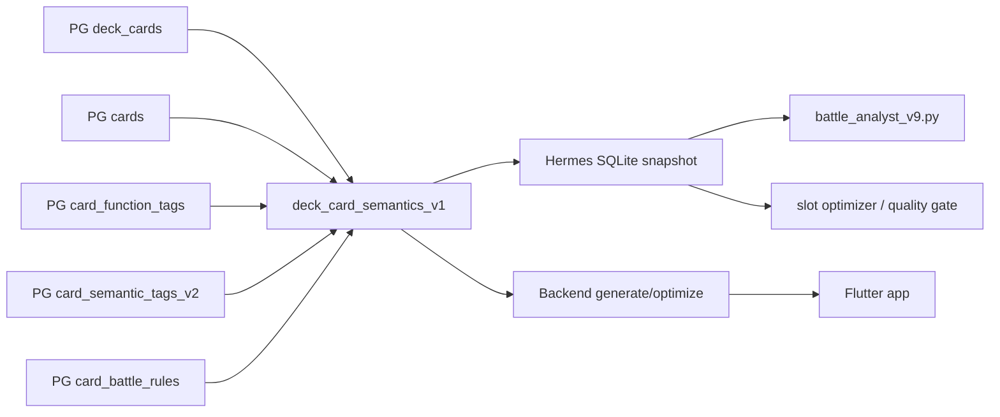

# Battle/AI Semantic Sync - Plano de Implementacao

Status: Slice 1 implemented, committed to `master` as `bd7eb558`, pulled by
Hermes AWS and applied to the real Hermes SQLite runtime after backup. Slice 2
was committed as `76d828d2`, pulled by Hermes AWS and applied to the real
Hermes SQLite runtime after backup. Optimizer baseline, slot scan, quality gate
and apply now track separate `semantics_hash` and `ruleset_hash` values.

Scope: battle simulator, AI deck generation, optimize, Hermes sync, Lorehold
learned deck and semantic multi-function cards.

Owner-approved scope for the first coding slice on 2026-06-11:

- release stability first;
- no global Mox ban;
- learned decks only for single commander until partner corpus exists;
- duplicate Commander singleton identity blocks save/import;
- Hermes metadata hidden from normal users;
- Hermes proposes, backend owns;
- `needs_review` battle rules do not execute hard behavior;
- `card_battle_rules` can derive tags only when trusted and traceable;
- first coding slice limited to aggregation + Hermes snapshot + tests.

This document converts the latest deep validations into an actionable plan. It
must be read together with:

- `docs/hermes-analysis/BATTLE_AI_DECK_LOGIC_DEEP_DIVE_2026-06-11.md`
- `docs/hermes-analysis/IMPLEMENTATION_GAPS.md`
- `docs/hermes-analysis/BATTLE_SYSTEM_LOGIC.md`
- `docs/hermes-analysis/HERMES_E2E_SYSTEM_CONTRACT_2026-06-07.md`
- `docs/hermes-analysis/manaloom-knowledge/scripts/sync_pg_target_deck_to_hermes.py`
- `server/database_setup.sql`

## 1. Non-negotiable rules

1. `deck_cards.quantity` is the only source of deck cardinality.
2. Enrichment must never multiply deck rows.
3. `card_function_tags` is the canonical deckbuilding multi-function layer.
4. `card_semantic_tags_v2` is richer semantic metadata, not a hard gate by
   default.
5. `card_battle_rules` is executable/reviewable battle semantics, not the main
   deckbuilding role table.
6. Hermes SQLite is a read model/cache. PostgreSQL remains the product source
   of truth.
7. `functional_tag` is legacy compatibility. `functional_tags_json` is the real
   multi-role contract.
8. `LIMIT 1` is not acceptable as semantic fanout containment; target sync no
   longer uses it for battle-rule aggregation.
9. Commander legality must be checked by Commander rules, not by display card
   count alone.
10. Lorehold no-mox policy is a product decision for that learned deck, not a
    global Mox ban.

## 2. Current state that matters before implementation

### PostgreSQL

Current relevant tables:

- `cards`
- `deck_cards`
- `card_function_tags`
- `card_semantic_tags_v2`
- `card_battle_rules`
- `commander_learned_decks`
- `deck_learning_events`
- `commander_card_usage`
- `ai_optimize_cache`
- `ai_optimize_jobs`
- `ai_generate_jobs`
- `ml_prompt_feedback`

Current remaining risk:

- `card_battle_rules` supports multiple rules per card; the Hermes target sync
  now aggregates those rules into `battle_rules_json`, and the primary
  validators/report-only summaries read `functional_tags_json` with fallback.
  Remaining risk is legacy/manual scripts still querying `functional_tag`
  directly.
- `deck_cards` is unique by `deck_id/card_id` in PostgreSQL, but Commander
  singleton legality is by card identity/name, not necessarily by printing id.
- `cards.scryfall_id` is still not enough as the final semantic identity
  contract for split/MDFC/DFC/adventure/faces.

### Hermes SQLite

Current target deck cache after Slice 1:

- `deck_cards` exists as Hermes operational snapshot.
- New snapshots make `card_id` explicit.
- New snapshots persist `functional_tags_json`, `battle_rules_json`,
  `semantic_tags_v2_json`, `deck_hash`, `semantics_hash`, `ruleset_hash` and
  `sync_run_id`.
- Legacy `card_name` and `functional_tag` remain for compatibility.

Runtime rollout status:

- Backup created on Hermes before apply:
  `docs/hermes-analysis/manaloom-knowledge/backups/knowledge.db.pre-semantic-bd7eb558.20260611T192016Z`
- Report-only gate passed before apply:
  `semantic_snapshot_report_only_bd7eb558_20260611T192326Z.json`
- Apply gate passed after writing the real runtime snapshot:
  `semantic_snapshot_apply_bd7eb558_20260611T192404Z.json`
- Runtime invariants after slot scan:
  `100` rows, `100` summed quantity, `1` commander, no Chrome Mox/Mox
  Diamond/Mox Opal in the Lorehold snapshot, `14` slot benchmarks for phase
  `semantic_snapshot_smoke`.
- Slice 2 backup before ruleset apply:
  `docs/hermes-analysis/manaloom-knowledge/backups/knowledge.db.pre-ruleset-76d828d2.20260611T194820Z`
- Slice 2 apply gate passed:
  `100` rows, `100` summed quantity, `1` commander, one distinct
  `deck_hash`, one distinct `semantics_hash` and one distinct `ruleset_hash`.
- Ruleset smoke after apply:
  latest baseline `id=2`, `60` games, baseline `deck_hash`,
  `semantics_hash` and `ruleset_hash` all length `64`; phase
  `ruleset_hash_smoke` wrote `7` slot benchmark rows with both baseline
  hashes; no Chrome Mox, Mox Diamond or Mox Opal present.

The next risk is not runtime rollout of Slice 2 anymore. The remaining risk is
semantic policy: reviewing Lorehold candidates, expanding sample size and only
then deciding whether trusted `card_battle_rules` should derive missing
`card_function_tags`.

Slice 3 status: implemented and applied to Hermes AWS after backup. The
snapshot now adds a stable `logical_rule_key` to every battle rule and dedupes
equivalent rules by face/variant/effect/deck role before writing
`battle_rules_json` and calculating `ruleset_hash`. Local and remote
PostgreSQL-to-SQLite smokes for Lorehold kept `100` cards, `1` commander,
wrote `98` rules with logical keys and deduped `2` equivalent rules.

### Backend app-facing simulator

`/decks/:id/simulate` and `server/lib/ai/battle_simulator.dart` are a light
deck-consistency simulation path. They do not replace Hermes Commander battle
analysis.

Current use:

- opening hand/land distribution;
- curve/on-curve probability;
- basic Monte Carlo support;
- not a judge engine;
- not the source for Lorehold battle optimization.

### Hermes battle simulator

`docs/hermes-analysis/manaloom-knowledge/scripts/battle_analyst_v9.py` is the
active richer simulator/lab.

Current role:

- Commander 4-player simulation;
- stack/priority/SBAs/replacement/prevention primitives;
- commander damage;
- multi-defender combat;
- replay/forensic audit;
- slot optimizer and quality gate support.

It remains a lab/read-model consumer until knowledge is promoted back to
PostgreSQL and backend contracts.

## 3. Target architecture



Target principle:

- every consumer reads one deck row per `deck_id/card_id`;
- all multi-role and multi-rule data are arrays attached to that one row;
- deck quantity is never derived from tag/rule counts;
- local Hermes tables are rebuilt from a deterministic PG snapshot.

## 4. Canonical contract: `deck_card_semantics_v1`

Create a shared contract, preferably a PostgreSQL view or SQL function, that
returns one row per deck card.

Required output fields:

| Field | Purpose |
|---|---|
| `deck_id` | Source deck |
| `card_id` | Canonical card row id from PG |
| `card_name` | Display/debug only |
| `quantity` | Only cardinality source |
| `is_commander` | Commander flag from `deck_cards` |
| `cmc` | Deck/battle support |
| `type_line` | Display/heuristic support |
| `oracle_text` | Fallback only; do not expose in public artifacts |
| `functional_tags_json` | Ordered array of deckbuilding roles |
| `functional_tag` | Legacy primary role for old consumers |
| `semantic_tags_v2_json` | Optional richer semantic object/array |
| `battle_rules_json` | Ordered array of executable/reviewable rules |
| `deck_hash_input` | Deterministic deck-structure input |
| `semantics_hash_input` | Deterministic semantic input |

Required behavior:

- aggregate every 1:N table before joining to deck base;
- `COALESCE` empty arrays to `[]`;
- deterministic `ORDER BY` inside JSON aggregation;
- do not use `LIMIT 1`;
- preserve multiple tags and multiple battle rules;
- filter out rejected/deprecated rules unless explicitly requested by audit
  mode;
- keep `source` and `review_status` separate.

## 5. Functional tag namespaces

Do not keep one flat bucket forever. Introduce a documented tag namespace.

| Namespace | Tags | Use |
|---|---|---|
| `function_core` | `ramp`, `draw`, `removal`, `wipe`, `protection`, `tutor`, `engine`, `wincon` | validator, optimize, quality gate |
| `function_extended` | `combo_piece`, `recursion`, `token_maker`, `enabler`, `stax`, `payoff`, `mana_fixing`, `card_selection` | diagnostics, analysis, scorecards |
| `type_fallback` | `land`, `creature`, `artifact`, `enchantment`, `planeswalker`, `utility` | UI/debug fallback only |

Rules:

- `functional_tags_json` can contain many roles.
- `functional_tag` chooses one legacy-compatible role.
- `functional_tag` must prefer `function_core`, then eligible
  `function_extended`, then `type_fallback`.
- `unknown` must never replace a real tag.
- `artifact`, `creature`, `land` and similar type fallback values must not
  become hard optimize gates.

## 6. Implementation phases

### Phase 0 - freeze current baseline

Goal: capture current behavior before changing sync semantics.

Actions:

1. Run Hermes report-only/current target sync.
2. Save current deck total, row total, commander count and Lorehold metrics.
3. Save current failing examples around multi-function cards.
4. Confirm no pending branch/doc divergence.

Validation:

```bash
git status --short
python3 -m py_compile docs/hermes-analysis/manaloom-knowledge/scripts/sync_pg_target_deck_to_hermes.py
```

### Phase 1 - build canonical aggregation

Status: implemented locally in `sync_pg_target_deck_to_hermes.py`.

Goal: implement one-row-per-card semantic output.

Files likely involved:

- `server/database_setup.sql`
- `server/bin/migrate.dart` or a dedicated migration path
- `docs/hermes-analysis/manaloom-knowledge/scripts/sync_pg_target_deck_to_hermes.py`
- new focused tests for the helper/query

Expected changes:

1. Add a canonical SQL view/function or shared query helper.
2. Aggregate `card_function_tags` by `card_id`.
3. Aggregate `card_semantic_tags_v2` by `card_id`.
4. Aggregate `card_battle_rules` by `card_id`.
5. Keep rejected/deprecated rules out of normal snapshot.
6. Return `[]` for cards without tags/rules.

Required tests:

- one card with 2 tags and 3 rules still returns 1 row;
- total quantity stays exactly 100 for a Commander learned deck;
- commander stays 1;
- main deck stays 99;
- changing tag order does not change semantic hash;
- no `LIMIT 1` remains in final target sync query.

### Phase 2 - migrate Hermes SQLite snapshot

Status: implemented locally, applied on Hermes AWS and validated against the
real Hermes SQLite runtime after backup.

Goal: make Hermes snapshot explicit and deterministic.

Files likely involved:

- `docs/hermes-analysis/manaloom-knowledge/scripts/sync_pg_target_deck_to_hermes.py`
- Hermes SQLite schema creation logic
- validator/optimizer consumers

Expected SQLite fields:

| Field | Requirement |
|---|---|
| `deck_id` | required |
| `card_id` | required |
| `card_name` | display/debug |
| `quantity` | required |
| `is_commander` | required |
| `functional_tag` | legacy |
| `functional_tags_json` | required JSON text |
| `semantic_tags_v2_json` | optional JSON text |
| `battle_rules_json` | required JSON text |
| `deck_hash` | snapshot structure hash |
| `semantics_hash` | snapshot semantic hash |
| `ruleset_hash` | executable battle-rules hash |
| `sync_run_id` | traceability |

Indexes/constraints:

- prefer `UNIQUE(deck_id, card_id)`;
- keep `card_name` only as display/debug;
- if old consumers require `UNIQUE(deck_id, card_name)`, keep compatibility but
  do not make it the canonical identity.

Required behavior:

- delete stale rows for the target deck during apply;
- write all rows in one SQLite transaction;
- produce a sanitized report with counts/hashes;
- refuse partial decks below configured threshold;
- refuse decks without commander for Commander target sync.

### Phase 3 - update Hermes consumers

Status: implemented for `master_optimizer_common.py`, `slot_optimizer.py`,
`_mana_validator.py`, `_run_validation.py` and `_update_cron_status.py`.
Historical/manual scripts remain to classify.

Goal: make every relevant consumer set-based.

Consumers to audit/update:

- `slot_optimizer.py`
- `loss_mode_suggester.py`
- `hermes_mana_base_validator.py`
- `master_optimizer_quality_gate.py`
- battle replay/forensic scripts
- cron reporters that count roles

Rules:

- count deck size from `quantity`;
- count roles by membership in `functional_tags_json`;
- a card can count in many role buckets;
- role bucket totals must never be interpreted as deck size;
- `functional_tag` can be used only when arrays are absent;
- `battle_rules_json` can guide battle/replay, but not hard deckbuilding roles
  unless mapped through controlled derivation.
- every battle rule in a deck snapshot should carry `logical_rule_key`;
- duplicate logical rules collapse to the best reviewed/source/confidence
  exemplar before `ruleset_hash` is calculated;
- dedupe must never remove distinct effects, faces, variants or deck roles.

Required tests:

- dual-role card counts in both role buckets;
- role bucket sum can exceed deck size without failing;
- no duplicate card rows after sync;
- old SQLite without arrays uses fallback without crash.

### Phase 4 - formalize card semantic identity

Goal: remove ambiguity between printing, oracle identity and card faces.

Likely schema additions:

- `oracle_id` or equivalent canonical card identity;
- `layout`;
- `card_faces_json`;
- normalized English name identity for Commander singleton validation;
- optional face fields for battle rules.

Why this matters:

- split cards;
- MDFCs/DFCs;
- adventures;
- localized names;
- reprints;
- Commander singleton by name/card identity;
- color identity across faces.

Current production constraint verified on 2026-06-12 and coding status:

- A backend-owned additive migration/contract now introduces
  `cards.oracle_id`, `cards.layout` and `cards.card_faces_json`.
- Updated cards resolve/printings/sync paths treat `scryfall_id` as the
  Scryfall printing id and `oracle_id` as canonical card identity when present.
- `DeckRulesService` now prefers `oracle_id` for physical-copy identity when
  the columns exist, blocking Commander singleton duplicates across printings
  and blocking a commander's canonical identity from entering the 99. It falls
  back to normalized physical card name while production backfill is incomplete.
- Production migration/backfill status on 2026-06-12: migration `021` is
  applied; `cards.oracle_id` is filled for `34325/34329` rows. Four special
  rows remain without `oracle_id` and critical consumers must keep fallback or
  explicit review for them.
- `/import`, `/import/validate` and deck save/update paths use the central
  backend rule service. `/import/validate` remains non-mutating and reports
  canonical identity conflicts as warnings; final write paths still own the
  blocking decision.
- Multiple-printing learned deck matches must remain report-only until a
  backend-owned policy defines either oracle identity or canonical printing.
- The learned-opponent identity audit now reports two coverage layers:
  concrete `card_id` resolution and semantic `oracle_id` resolution. Multiple
  printings sharing the same `oracle_id` improve semantic coverage but still do
  not produce a persisted `card_id` without a canonical printing policy.
- Hermes AWS validation in `9c6f44c9` originally ran the v3 audit against the
  real `knowledge.db` and PostgreSQL target with
  `oracle_id_column_present=false`, `1200` learned-opponent card instances,
  `1150` concrete `card_id` matches, `50` printing ambiguities and `0`
  unresolved names. After migration/backfill on 2026-06-12, the same report-only
  audit returned `oracle_id_column_present=true`,
  `semantic_identity_coverage=1.0`, `oracle_resolved_instances=50`,
  `ambiguous_instances=0` and `unresolved_instances=0`. Learned-opponent replay
  can use semantic identity coverage, but persisted `card_id` remains blocked
  until a backend-owned canonical printing policy exists.
- The v4 audit adds `canonical_printing_candidate_*` fields in report-only
  mode. It emits a concrete `card_id` candidate only when one printing has a
  unique highest evidence score from explicit fields (`scryfall_id` as printing
  id, direct Scryfall image, layout, collector number, set code, rarity). Ties
  remain semantic-only and must not be applied.
- Hermes AWS validation on commit `babf800c` expanded the v4 sample to 50
  learned-opponent decks / 5,000 card instances: `semantic_identity_coverage`
  stayed `1.0`, `unresolved_instances=0`, `ambiguous_instances=0`,
  `oracle_resolved_instances=207` and
  `canonical_printing_candidate_instances=0`. This confirms the current policy
  is conservative enough for report-only coverage, not enough for persisted
  `card_id` apply.

Required behavior:

- app/search/import can still use localized aliases;
- deck legality uses canonical identity;
- battle execution can choose active face/mode/variant;
- no silent collapse of two illegal singleton duplicates.

### Phase 5 - expand `card_battle_rules` contract

Goal: make rules executable enough for Hermes and future backend migration.

Recommended fields:

| Field | Purpose |
|---|---|
| `rule_id` or stable fingerprint | replay/dedupe |
| `oracle_id` | semantic identity |
| `layout` | split/MDFC/DFC/adventure support |
| `face_name` | face-specific rules |
| `face_index` | deterministic face order |
| `variant_kind` | spell/creature/adventure/omen/warp/etc |
| `ability_kind` | static/triggered/activated/spell/replacement/prevention |
| `timing_window` | cast/trigger timing |
| `source_zone` | hand/graveyard/exile/command/etc |
| `target_schema_json` | target contract |
| `cost_schema_json` | mana/additional/alternative costs |
| `duration_schema_json` | continuous/delayed/until EOT |
| `requirements_json` | restrictions/conditions |
| `is_enabled` or `execution_status` | separates review from execution |

Important:

- do not overload `review_status`;
- keep `source` as provenance;
- keep `review_status` as review quality;
- use a separate enabled/execution flag for battle execution.

### Phase 6 - learned deck Commander contract

Goal: keep current Lorehold safe while preparing future partner/background
support.

Current behavior:

- learned deck validation requires exactly 1 commander and 99 main cards.

Next behavior:

- keep current contract for normal commanders;
- document partner/background as explicit future mode;
- do not accept 2 commanders until corpus and UI can show/validate both;
- tests must prove 98 main + 2 commanders only for legal partner/background
  situations.

Lorehold current policy:

- learned candidate 82 is no-premium-Mox;
- `Chrome Mox`, `Mox Diamond`, `Mox Opal` remain excluded for that active
  learned deck by product policy;
- do not generalize that exclusion globally.

### Phase 7 - ML feedback and prompt policy

Goal: convert useful feedback into deterministic policy only after scorecards.

Allowed now:

- collect `ml_prompt_feedback`;
- use reports for analysis;
- keep diagnostics.

Not allowed yet:

- use feedback as hard ranking/prompt policy without scorecard;
- let rejected battle rules redefine deckbuilding tags;
- let Hermes-only findings change production decks automatically.

Promotion rule:

1. Hermes finds signal.
2. Report-only validates.
3. Scorecard confirms no regression.
4. Backend contract/test is added.
5. Production behavior changes.

## 7. Implementation blockers

Block implementation if any proposed patch:

- joins 1:N semantic tables directly to `deck_cards` without aggregation;
- reintroduces `LIMIT 1` as final battle rule selection;
- removes secondary rules/tags;
- counts `functional_tags_json.length` as deck size;
- makes SQLite the source of truth;
- changes Lorehold learned deck without handoff;
- treats `card_battle_rules` as the canonical deckbuilding role table;
- confuses `source='curated'` with `review_status`;
- treats `rule_version` as string;
- changes learned deck commander counts without explicit Commander mode.

## 8. Validation matrix

### Documentation-only

```bash
git diff --check
# Run the project secret scan on changed lines.
```

### PostgreSQL/schema/query

```bash
cd server
dart analyze bin lib routes test
dart test test/*semantic* test/*battle* test/*commander* --reporter compact
```

### Hermes scripts

```bash
cd docs/hermes-analysis/manaloom-knowledge/scripts
python3 -m py_compile sync_pg_target_deck_to_hermes.py sync_battle_card_rules_pg.py slot_optimizer.py master_optimizer_quality_gate.py
```

### Hermes runtime

```bash
# Run report-only first.
# Then run apply only when totals and deck/semantic/ruleset hashes match.
```

### App/runtime

Use iPhone Simulator for any UX-visible learned deck change:

```bash
cd app
flutter test integration_test/commander_learned_deck_availability_runtime_test.dart -d <IPHONE_15_SIMULATOR_ID> --dart-define=API_BASE_URL=https://evolution-cartinhas.8ktevp.easypanel.host --dart-define=PUBLIC_API_BASE_URL=https://evolution-cartinhas.8ktevp.easypanel.host --dart-define=DISABLE_FIREBASE_STARTUP=true --dart-define=DISABLE_FIREBASE_PERFORMANCE_INIT=true --no-version-check
```

## 9. Implemented slices and next controlled work

Start small. Do not change battle execution before snapshot/optimizer
invariants are stable.

Slice 1 implemented locally on 2026-06-11:

1. Add/centralize SQL aggregation contract.
2. Add tests for fanout and deterministic arrays.
3. Update `sync_pg_target_deck_to_hermes.py` to consume it.
4. Add `card_id`, arrays and hashes to SQLite snapshot.
5. Keep old `functional_tag` fallback.
6. Run Hermes report-only and apply on Hermes AWS after backup.

Expected result:

- same deck total;
- same commander/main counts;
- more semantic information preserved;
- no fanout;
- no battle behavior change yet.

Evidence:

- `docs/hermes-analysis/BATTLE_SEMANTIC_SYNC_SLICE1_REPORT_2026-06-11.md`

Slice 2 implemented and applied on Hermes AWS on 2026-06-11:

1. Add `ruleset_hash` to the Hermes target snapshot.
2. Keep `deck_hash` structural only.
3. Keep `semantics_hash` for functional/semantic deckbuilding metadata.
4. Keep `ruleset_hash` for executable/reviewable battle rules.
5. Propagate baseline semantic/ruleset hashes through baseline, slot scan,
   quality gate and apply rollback metadata.

Slice 3 implemented locally and applied on Hermes AWS on 2026-06-11:

1. Add `logical_rule_key` to normalized battle rules.
2. Deduplicate equivalent `battle_rules_json` entries by
   face/variant/effect/deck role.
3. Prefer `verified`/`active`, then trusted source, then confidence/version
   when equivalent rules compete.
4. Report `battle_rules_seen`, `battle_rules_written` and
   `battle_rules_deduped`.
5. Prove with PG -> temp SQLite Lorehold smoke:
   `100` cards, `100` quantity, `1` commander, `98` rules with
   `logical_rule_key`, `2` deduped rules.
6. Apply on Hermes AWS with backup
   `knowledge.db.pre-logical-rule-55af86c4.20260611T201027Z`.
7. Remote smoke:
   baseline `id=3`, `36` games, phase `logical_rule_smoke`, `8` slot rows
   carrying semantic/ruleset hashes, `98` rules with `logical_rule_key`, deck
   restored to `100` cards and `1` commander.

Current next work:

1. Review Lorehold report-only candidates before any apply.
2. Expand sample size before trusting any swap.
3. Keep derived `card_battle_rules_v1` function tags in rollback-only
   validation until an explicit operator-controlled apply path and
   `apply_approved=true` allowlist exist.
4. Keep battle execution unchanged until these policies and tests exist.

Slice 4 report-only derivation status:

1. Added `derive_functional_tags_from_battle_rules.py` as proposal-only.
2. Gates: `card_id` required, `review_status IN ('verified','active')`,
   `source IN ('manual','curated')`, confidence >= `0.75`, derivable tag only.
3. PG report-only smoke after taxonomy/card-specific review in `86ef9062`:
   `3156` rules seen, `89` new candidates, `261` already present, `2806`
   rejected by gate, `27` low-risk review candidates and `62` manual-review
   candidates. No PG writes were performed.
4. Review artifact:
   `docs/hermes-analysis/BATTLE_RULE_DERIVED_TAG_REVIEW_2026-06-11.md`.
5. Added allowlist dry-run support to the same runner. Default behavior keeps
   manual-review candidates blocked, reports unmatched keys, and still performs
   no PostgreSQL writes.
6. Commit `51328ea7` added the versioned dry-run allowlist
   `BATTLE_RULE_DERIVED_TAG_LOW_RISK_ALLOWLIST_2026-06-12.json` for the 27
   low-risk candidates. Hermes AWS dry-run loaded 72 matching keys from those
   27 entries, allowlisted 27 candidates, blocked 0 manual-review candidates,
   had 0 unmatched keys and kept `apply=false`.
7. The runner now includes stale-cleanup detection and a PostgreSQL
   transaction dry-run path that always rolls back. Current local and Hermes
   AWS PG result:
   `existing_derived_tags_count=0`, `stale_cleanup_candidates_count=0`,
   `would_upsert_allowlisted_count=27`, `would_delete_stale_count=0`,
   `rolled_back=true`, `apply=false`.
8. The runner now has an operator-controlled apply path, but the current
   versioned allowlist still blocks it because `apply_approved=false`. A local
   apply-attempt smoke returned `pg_apply.blocked=true`,
   `pg_apply.applied=false` and
   `reasons=["allowlist_apply_approved_required"]`.
