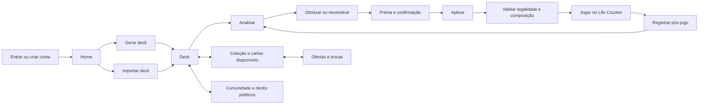

# Auditoria canônica de produto e experiência do ManaLoom

**Data de corte:** 2026-07-16

**Escopo:** aplicativo Flutter, incluindo web, Android e iOS; scanner avaliado como superfície condicional

**Inventário auditado:** 33 `GoRoute`s, 1 `ShellRoute` e 37 arquivos de tela

**Estado deste documento:** auditoria e remediações consolidadas no checkout; gate `full` final aprovado, com P0 de promoção e externos ainda abertos e sem promoção para produção

Este é o documento canônico para compreender a proposta do aplicativo, a relação entre suas áreas, a qualidade de cada superfície e o que ainda impede uma afirmação de release completa. Ele não substitui o contrato E2E, os contratos de API nem a verdade de dados PostgreSQL. Resultados históricos são evidência de fase, não autorização para declarar o estado atual como aprovado.

## 1. Veredito executivo

O ManaLoom tem uma proposta coerente e diferenciada: transformar o ciclo de Commander em uma única jornada, da criação ou importação do deck à análise, otimização, validação, partida e aprendizado pós-jogo. O sistema visual também possui uma identidade reconhecível. A direção correta é uma **mesa de jogo premium**, não um painel administrativo: Obsidian cria profundidade, Frost organiza a informação e Brass deve aparecer apenas onde há ação, valor ou decisão.

Antes desta rodada, a maior fragilidade não era ausência de funcionalidades, mas fragmentação: partes relevantes existiam sem formar um fluxo contínuo, controles visuais sugeriam ações ainda inexistentes, erros podiam se parecer com estados vazios, rotas internas perdiam contexto e o Life Counter web não correspondia ao acesso manual pelo aplicativo. Isso reduzia confiança e fazia o produto parecer menos acabado do que sua base técnica.

As correções desta rodada atacam esses pontos: continuidade de autenticação, navegação canônica por URL, rota correta de trocas, Life Counter disponível na web, regras de mulligan corrigidas, estados de erro e retry explícitos, preservação de rascunhos, sincronização offline e cross-device das notas pós-jogo, exportação e exclusão de conta, aviso explícito de segurança em trocas, linguagem de cliente no lugar de mensagens técnicas e disciplina visual de contraste, tipografia e alvos de toque.

Ainda não é rigoroso afirmar que “tudo está 100% pronto”. O código do candidato foi ampliado, mas as seguintes provas permanecem abertas:

1. **Migração de privacidade/sync:** exportação, exclusão/anonimização de conta, revisões e tombstones estão implementados, mas a migration 038 ainda precisa de precheck e aplicação autorizada no PostgreSQL antes do novo backend.
2. **Trocas:** o produto da beta é coordenação entre usuários, sem custódia ou garantia do ManaLoom. A interface agora informa que pagamento e entrega são combinados diretamente; confirmação de pagamento, mediação e disputa não podem ser prometidas.
3. **Operação e observabilidade:** restore isolado local passou e `age`/Docker estão prontos, mas Sentry, prova FCM, CORS exato de produção e backup off-site criptografado ainda exigem credenciais/destino/evidência externa.
4. **Distribuição:** APK/AAB finais foram inspecionados e o APK instalou/abriu no emulador Android 36, mas falta exercitar o APK assinado exato em aparelho físico. iOS segue sem cadeia Apple para distribuição; scanner permanece desabilitado por padrão até prova física fresca.
5. **Prova visual autenticada completa:** a captura automática anterior parou em `/auth/register`; uma nova passagem autenticada mobile/desktop ainda é necessária para o SHA final.

### Decisão de produto

- **Continuar:** deckbuilding assistido, coleção, mesa/Life Counter e pós-jogo como um único ciclo.
- **Beta gratuita:** todos os usuários entram no mesmo acesso gratuito temporário; checkout pago fica desabilitado e não é anunciado enquanto a política comercial não for reaberta e validada.
- **Conter:** IA deve separar fato verificado, análise e sugestão; citar a origem e pedir confirmação antes de alterar um deck.
- **Não expandir ainda:** novas áreas sociais, comerciais ou de meta não devem crescer antes de fechar confiabilidade, interoperabilidade e clareza das áreas existentes.
- **Condicionar release:** nenhuma superfície transacional pode ser declarada segura sem evidência bilateral de servidor, e nenhuma plataforma pode ser declarada entregue sem prova instalável/runtime própria.

## 2. Método e limites

A auditoria combinou cinco lentes:

1. **Inventário estático:** rotas, telas, entradas, navegação imperativa, estados de carga/erro/vazio e dependências entre domínios.
2. **Análise visual:** hierarquia, densidade, contraste, tipografia, consistência de tokens, tamanho de alvos, responsividade e aderência à identidade ManaLoom.
3. **Análise funcional:** ações reais versus controles decorativos, recuperação após falhas, preservação de trabalho e continuidade entre telas.
4. **Pesquisa de necessidades:** fontes oficiais de Magic, produtos especializados e relatos de comunidades. Fontes comunitárias são sinal qualitativo, não verdade estatística.
5. **Validação automatizada e runtime:** testes Flutter, análise estática, build web, auditoria visual estática e inspeção no navegador. A matriz de resultado e os limites de cada prova estão registrados na seção 12.

### Limites de interpretação desta auditoria

- A rodada final inclui mudanças de app, servidor e operação, mas este relatório não autoriza aplicação automática de migrations nem outras mutações live.
- Nenhuma mudança transforma trocas em checkout, escrow, proteção de pagamento ou entrega garantida.
- Remoção destrutiva de artefatos históricos ou provas de QA.
- Declaração de distribuição iOS sem evidência da cadeia de assinatura/distribuição.

## 3. Tese de experiência e sistema visual

### 3.1 Tese

> **ManaLoom é uma mesa de jogo premium e um espaço de decisão de Commander.** A interface deve fazer o jogador sentir continuidade entre cartas, deck e partida, não alternância entre produtos desconectados.

### 3.2 Papéis dos elementos visuais

| Elemento | Papel obrigatório | Uso inadequado |
|---|---|---|
| Obsidian / Abyss | Base, profundidade, descanso visual e foco no conteúdo | Muitos contêineres indistinguíveis ou preto sem separação de planos |
| Frost | Texto principal, hierarquia, estados neutros e informação operacional | Competir com Brass em toda a tela |
| Brass | Ação primária, valor, seleção e confirmação relevante | Bordas, ícones e textos decorativos simultâneos; excesso transforma destaque em ruído |
| Arte de cartas | Contexto semântico de Magic, reconhecimento e desejo | Fundo genérico sem relação com a carta, deck ou ação |
| Inter | Texto operacional, leitura contínua, formulários e navegação | Metadado crítico abaixo do mínimo legível |
| Cinzel / display | Títulos curtos, identidade e momentos editoriais | App bars densas, parágrafos, labels pequenos ou dados tabulares |

### 3.3 Regras de composição

- Um CTA primário por região visual; ações secundárias usam Frost ou tratamento tonal.
- Alvo interativo mínimo de 48 × 48 px para navegação e ações recorrentes.
- 11 px apenas para metadado excepcional e não decisório; 12 px é o piso operacional; corpo deve privilegiar 14–16 px.
- Estado vazio, falha e carregamento precisam ter aparência e texto diferentes.
- Controles só aparecem quando executam uma ação real. Filtros sem comportamento são removidos, não “explicados” por snackbar.
- Desktop não deve apenas esticar mobile: largura de leitura é limitada, navegação lateral segue os mesmos tokens e grades preservam ritmo.
- Português do Brasil é o idioma de interface; termos oficiais de Magic podem permanecer quando necessários, com contexto em português.
- Semântica acessível, live regions para mudanças de estado e labels claros fazem parte da definição de pronto.

## 4. Arquitetura de produto e fluxo canônico

O fluxo de deck vigente permanece:

`generate/import → analyze → optimize/rebuild → apply → validate`

Para que isso seja um produto e não apenas um pipeline técnico, a jornada visível deve continuar até a mesa e retornar como aprendizado:

### Contratos de continuidade

| Transição | O que deve atravessar a rota | Estado nesta rodada |
|---|---|---|
| Link protegido → login/cadastro → destino | URI segura e normalizada | Ajustado e coberto por testes automatizados; runtime autenticado completo continua dependente do ambiente |
| Home → coleção/trocas | Aba correta, sem interpretação implícita | Ajustado: Trocas aponta para `tab=2` |
| Sets → cartas do set | `setCode` em URL canônica | Ajustado no checkout; promoção para produção depende do candidato final |
| Comunidade → usuário/deck/mercado | ID e aba em URL | Ajustado |
| Perfil público → conversa | ID de conversa; dados ricos opcionais | Ajustado, com fallback seguro |
| Perfil/mercado → criar troca | Receptor, tipo e item preselecionado | Ajustado por argumento tipado |
| Deck → mesa → pós-jogo | `deckId`, nome, sessão e retorno explícito | Concluído no cliente: a mesa recebe o deck, troca de deck inicia tabuleiro limpo sem reetiquetar o histórico, a saída diferencia “fechou” de “jogou” e a sessão chega ao pós-jogo; a camada de servidor para continuidade cross-device foi implementada, mas depende da migration 038 e de prova integrada no SHA final |
| Pós-jogo offline → servidor | Fila de upsert, revisão, cursor e tombstone de delete | Implementado no cliente e no servidor, incluindo prevenção de ressurreição por tombstones; a ativação em produção depende da migration 038 e de prova multi-device após o deploy |

## 5. Inventário de rotas

O roteador principal contém **33 `GoRoute`s** e **1 `ShellRoute`**. O total não inclui telas abertas por `MaterialPageRoute`, sheets nem conteúdos embutidos em abas.

| Domínio | Rotas GoRouter | Quantidade |
|---|---|---:|
| Acesso | `/`, `/login`, `/register` | 3 |
| Mesa | `/life-counter` | 1 |
| Início | `/home`, `/onboarding/core-flow` | 2 |
| Decks | `/decks`, `/decks/generate`, `/decks/import`, `/decks/:id`, `/decks/:id/search`, `/decks/:id/scan`, `/decks/:id/post-game` | 7 |
| Comercial | `/plans`, `/upgrade`, `/checkout`, `/legal` | 4 |
| Coleção | `/collection`, `/collection/latest-set`, `/collection/sets`, `/collection/sets/:code` | 4 |
| Comunidade/mercado | `/market` (compatibilidade → `/community?tab=3`), `/community`, `/community/search-users`, `/community/user/:userId`, `/community/decks/:deckId` | 5 |
| Perfil/mensagens | `/profile`, `/messages`, `/messages/:conversationId`, `/notifications` | 4 |
| Trocas | `/trades`, `/trades/create/:receiverId`, `/trades/:tradeId` | 3 |
| **Total** |  | **33** |

### Dívida de navegação remanescente

`CardDetailScreen` e `BattleReplaysScreen`, entre outras superfícies transitórias, ainda podem ser abertas por `MaterialPageRoute`. Isso é aceitável para detalhe efêmero quando deep link não é requisito, mas deve permanecer inventariado. Uma tela que precisa ser retomada, compartilhada ou restaurada deve migrar para URL canônica.

## 6. O que jogadores procuram e a cobertura do ManaLoom

A síntese abaixo separa necessidade recorrente de implementação provada. O ranking não é uma pesquisa quantitativa própria; combina o que produtos maduros priorizam com pedidos recorrentes em comunidades.

| Prioridade | Job do jogador | Evidência externa | Cobertura ManaLoom | Decisão |
|---|---|---|---|---|
| P0 | Jogar rápido e retomar uma mesa sem perder estado | Companion organiza a experiência presencial; LifeTap e similares enfatizam contagem multiplayer | Life Counter Lotus, histórico e persistência; web e vínculo deck/pós-jogo corrigidos e provados no cliente | Revalidar retomada em dispositivo físico e persistência cross-device no servidor |
| P0 | Ver vida, dano de comandante, veneno e estados sem navegar por menus | Apps de life tracking especializados | Coberto pelo domínio Lotus; legibilidade e localização revisadas | Manter controles essenciais na superfície principal |
| P0 | Escanear e corrigir impressão, foil, idioma e condição | Guia de scanner do ManaBox | Scanner existe, mas é condicionado por feature flag e não integra o gate non-scanner | Não prometer disponibilidade universal; provar por build/dispositivo |
| P0 | Saber o que possui, o que está livre e o que falta no deck | ManaBox combina coleção e deck; pedidos comunitários destacam alocação | Coleção, fichário, ofertas e deck existem; alocação entre decks não está provada ponta a ponta | Tornar “possuo/livre/alocado/falta” uma linguagem única |
| P0 | Construir e validar curva, custo, legalidade e cartas ausentes | Archidekt, Moxfield e EDHREC tratam isso como núcleo | Geração/importação/detalhe/análise/optimize existem | Exibir origem e confiança; validar antes de aplicar |
| P0 | Consultar Oracle e regras confiáveis | Wizards é a fonte normativa; comunidade rejeita IA apresentada como regra | Busca/detalhe e dados de cartas existem; proveniência visível ainda é parcial | Separar “Oracle verificado” de “sugestão ManaLoom” |
| P0 | Exportar/recuperar os próprios dados | Produtos de coleção oferecem exportação e backup como garantia de confiança | Exportação de conta implementada no perfil e no servidor; backup operacional off-site ainda precisa prova externa | Validar payload autenticado e recuperação prática no SHA final |
| P1 | Sincronizar entre dispositivos | Roadmaps e avaliações de apps cobram continuidade | Pós-jogo ganhou revisão, cursor e tombstones no cliente/servidor | Aplicar migration 038 e provar conflito/delete em dois clientes |
| P1 | Registrar partidas e aprender com o playgroup | Playgroup e trackers de Commander valorizam histórico/leagues | Pós-jogo tem fila offline e contrato cross-device implementado | Relacionar sessão, deck, resultado e versão do deck; provar após migration |
| P1 | Negociar wishlist/coleção com clareza | ManaBox e apps de coleção expõem trade/wishlist | UI existe e mostra aviso de que pagamento/entrega são responsabilidade dos usuários | Manter como coordenação P2P; não descrever como fluxo financeiro protegido |
| P1 | Descobrir eventos e o metagame relevante | Companion cobre eventos; deck platforms cobrem dados/meta | Cobertura parcial ou não provada | Só priorizar após o ciclo principal estar fechado |
| P1 | Receber ajuda de IA que explique o porquê | Rejeição comunitária cresce quando IA inventa regras ou altera decks | Analyze/optimize é diferencial do ManaLoom | Fato, análise e sugestão em camadas; diff antes de aplicar |

### Síntese de posicionamento

O produto não precisa vencer por quantidade de módulos. Deve vencer por **continuidade confiável**: coleção informa o deck, o deck informa a mesa, a mesa gera pós-jogo e o pós-jogo melhora a próxima análise. Toda função que não fortalece esse ciclo deve justificar sua prioridade.

## 7. Auditoria por domínio

| Domínio | Leitura | Ajustes desta rodada | Risco remanescente |
|---|---|---|---|
| Acesso e onboarding | Visual premium já consistente, mas deep links perdiam intenção entre login e cadastro | Redirect seguro preservado e normalizado; destino restaurado após autenticação | Prova autenticada completa bloqueada pelo timeout do ambiente |
| Home e navegação | Boa identidade, porém CTAs e destino de Trocas não eram coerentes em todos os tamanhos | Destino correto, CTA mínimo de 48 px, navegação lateral alinhada a Brass/Frost, acesso web à mesa | Goldens e testes responsivos passaram; jornada autenticada completa continua condicionada ao ambiente |
| Deck lifecycle | Núcleo estratégico forte, mas analyze/optimize/play/pós-jogo pareciam áreas paralelas | Erros separados de vazio, retries, copy de cliente, remoção de filtros falsos; deck, mesa e pós-jogo conectados por sessão explícita | Proveniência de IA e versão do deck seguem abertas; sync cross-device implementado aguarda migration/prova E2E |
| Mesa/Life Counter | Superfície mais distinta visualmente, porém web e entrada manual usavam caminhos diferentes; linguagem misturada | Host web isolado, mesma skin/contratos e estado canônico, regra London Mulligan corrigida, PT-BR, saída tipada, troca de deck segura e correção de overlap no histórico | Runtime web e host nativo isolado no Android 36 passaram; retomada em aparelho físico e distribuição iOS ainda exigem evidência |
| Coleção e catálogo | Área útil, mas densa; termos de abas e falhas podiam confundir | Abas renomeadas, alvos ampliados, erro diferente de vazio, rotas de set canônicas, copy técnica removida | Modelo “livre/alocado” ainda não está provado ponta a ponta; exportação de conta foi implementada |
| Comunidade e mercado | Conteúdo relevante, mas tabs/rotas duplicadas e falhas silenciosas reduziam confiança | `/market` virou compatibilidade para aba canônica, perfil/deck/chat por URL, retries e feedbacks | Moderation/trust e disponibilidade de dados devem ser monitorados |
| Trocas | Interface ampla para coordenação entre usuários | Modalidades normalizadas; campos incompatíveis são limpos/validados; aviso informa que ManaLoom não processa, protege ou garante pagamento e entrega | Provar estados bilaterais e concorrência; não oferecer expectativa de escrow, mediação ou disputa |
| Retenção e mensagens | Pós-jogo, chat e notificações existiam, mas perda silenciosa era possível | Rascunho preservado, chat sinaliza falha, pós-jogo ganhou fila por deck, revisão/cursor/tombstone e suporte de servidor; polls antigos são invalidados | Migration 038 e prova multi-device/idempotente ainda são obrigatórias |
| Comercial | Rotas existem, mas cobrança não pertence à beta atual | Beta gratuita comunicada; checkout e chamada paga desabilitados/não anunciados; backend de billing falha fechado | Reabrir somente com decisão comercial e prova sandbox/end-to-end futura |
| Perfil | Entrada estável para identidade e preferências | Exportação de dados e exclusão com confirmação exata + senha foram implementadas; sessão só é limpa após confirmação `account_deleted: true` | Validar contra backend migrado e registrar prova autenticada final |

## 8. Registro tela a tela

Há **37 arquivos de tela** sob `app/lib/features`. Conteúdos embutidos contam como superfícies porque têm estado e decisões próprios, mesmo sem rota direta.

| # | Tela/superfície | Entrada | Diagnóstico e tratamento |
|---:|---|---|---|
| 1 | `SplashScreen` | `/` | Preserva redirect normalizado; não deve virar uma segunda home. Ajustado e validado por contratos automatizados de redirect. |
| 2 | `LoginScreen` | `/login` | Visual forte; continuidade do deep link foi corrigida. Erros devem permanecer acionáveis e não técnicos. |
| 3 | `RegisterScreen` | `/register` | Mantém o destino desejado ao alternar com login. A prova runtime parou aqui por timeout do backend. |
| 4 | `BattleReplaysScreen` | Deck details, rota transitória | Integração inventariada; nenhuma mutação de Battle nesta rodada. Exige evidência própria antes de afirmar coerência estratégica. |
| 5 | `BinderTabContent` | `/collection?tab=0` | Área densa; abas, alvos e estados foram tornados mais claros. Exclusão com falha agora precisa informar o usuário. |
| 6 | `MarketplaceTabContent` | `/collection?tab=1` | Busca/oferta úteis; CTA e navegação para troca foram alinhados. Segurança transacional continua externa ao widget. |
| 7 | `CardDetailScreen` | Push transitório a partir de listas | Reuso consistente de arte e metadados. Candidata a GoRoute somente se compartilhamento/restauração virar requisito. |
| 8 | `CardSearchScreen` | `/decks/:id/search` | Controles que apenas exibiam snackbar foram removidos. Busca deve mostrar somente filtros reais. |
| 9 | `CollectionScreen` | `/collection?tab=N` | Vocabulário consolidado em Fichário, Ofertas, Trocas e Edições; rota preserva aba. |
| 10 | `LatestSetCollectionScreen` | `/collection/latest-set` | Proposta clara; validar empty/error e contraste de preço/quantidade no gate visual final. |
| 11 | `SetCardsScreen` | `/collection/sets/:code` | Copy interna sobre banco local foi substituída por linguagem de cliente; navegação de produção usa URL. |
| 12 | `SetsCatalogScreen` | `/collection/sets` | Catálogo conectado à rota de set; validar densidade e largura de leitura em desktop. |
| 13 | `CheckoutScreen` | `/checkout` | Na beta gratuita não inicia pagamento: a rota deve falhar fechada ou orientar que o acesso é gratuito, sem preço/CTA de compra. |
| 14 | `CommercialLegalScreen` | `/legal` | Conteúdo deve priorizar leitura e não display font. Nenhum bloqueador visual específico identificado. |
| 15 | `PlanScreen` | `/plans` | Comunica beta gratuita temporária e evita anunciar entitlement/preço pago como disponível. |
| 16 | `UpgradeScreen` | `/upgrade` | Não oferece compra na beta; deve conduzir de volta ao uso gratuito sem urgência comercial artificial. |
| 17 | `CommunityDeckDetailScreen` | `/community/decks/:deckId` | Ao copiar deck, o feedback passa a oferecer abertura direta quando há ID retornado. |
| 18 | `CommunityScreen` | `/community?tab=N` | Aba agora é endereçável; mercado carrega o provider correto e falhas ganham recuperação. |
| 19 | `DeckDetailsScreen` | `/decks/:id` | É o hub do ciclo: abre a mesa com `deckId`/nome, interpreta a saída tipada, só oferece pós-jogo quando houve atividade e encaminha o contexto temporal da sessão. |
| 20 | `DeckGenerateScreen` | `/decks/generate` | Parte do fluxo canônico. Sugestões precisam explicar premissas, fontes e limites antes de criar/aplicar. |
| 21 | `DeckImportScreen` | `/decks/import` | Parte do fluxo canônico. Formato e erros de parsing devem ser apresentados como correção orientada, sem perder input. |
| 22 | `DeckListScreen` | `/decks` | Falha de carregamento foi separada de lista vazia, com retry; melhora confiança e evita CTA incorreto. |
| 23 | `HomeScreen` | `/home` | Trocas aponta para a aba correta; CTAs foram ampliados e Life Counter deixa de ser artificialmente indisponível na web. |
| 24 | `LotusLifeCounterScreen` | `/life-counter` | Host web e host móvel representam a mesma experiência Lotus e espelham o estado canônico. PT-BR, armazenamento isolado, saída com/sem atividade, vínculo de deck e troca segura de sessão têm testes dedicados. No web, o iframe confiável permite IndexedDB e a ponte local mantém o estado canônico escopado. No host Android, o botão “Todas as partidas” foi reposicionado para não sobrepor fechar/header e revalidado visualmente e por teste estático. |
| 25 | `OnboardingCoreFlowScreen` | `/onboarding/core-flow` | Deve ensinar a jornada completa, não uma lista de recursos. Revisar após fechar deck → mesa → pós-jogo. |
| 26 | `MarketScreen` | Sem GoRoute ativo | Superfície standalone aparenta ser legado; manter como candidata de limpeza somente após confirmar ausência de entradas externas e substituir seus testes. |
| 27 | `ChatScreen` | `/messages/:conversationId` | Abertura por URL e dados opcionais; falhas de criação/envio não devem mais ser silenciosas. |
| 28 | `MessageInboxScreen` | `/messages` | Entrada canônica de conversas. Validar unread/realtime e recuperação no gate integrado. |
| 29 | `NotificationScreen` | `/notifications` | Ação “ler todas” confirma sucesso ou falha; polls antigos são invalidados e o feedback semântico evita anúncios duplicados. |
| 30 | `ProfileScreen` | `/profile` | Exporta os dados da conta e exige confirmação exata + senha para exclusão; só encerra a sessão após confirmação positiva do servidor. Prova autenticada final segue pendente. |
| 31 | `PostGameNotesScreen` | `/decks/:id/post-game` | Fila offline, revisão/cursor, retry e tombstones evitam perda/ressurreição de notas; suporte cross-device existe no código e aguarda migration/prova integrada. |
| 32 | `CardScannerScreen` | `/decks/:id/scan`, condicional | Feature flag redireciona para busca quando scanner está desabilitado. Mensagens devem ser PT-BR e amigáveis; prova exige dispositivo/build habilitado. |
| 33 | `UserProfileScreen` | `/community/user/:userId` | Perfil, follow, chat e troca foram aproximados de rotas canônicas e feedback explícito. |
| 34 | `UserSearchScreen` | `/community/search-users` | Falha não deve parecer “nenhum usuário”; retry foi introduzido. |
| 35 | `CreateTradeScreen` | `/trades/create/:receiverId` | Recebe contexto tipado e exibe aviso de segurança: combinação, pagamento e entrega são responsabilidade dos participantes. |
| 36 | `TradeDetailScreen` | `/trades/:tradeId` | Falha/retry e aviso de segurança foram tratados; ações dependem de estados válidos do servidor e não representam garantia financeira. |
| 37 | `TradeInboxScreen` | `/trades` | Precisa diferenciar recebidas, enviadas, pendentes e concluídas com a mesma taxonomia do backend. |

## 9. Correções consolidadas nesta rodada

### Navegação e continuidade

- Redirect de autenticação centralizado, normalizado e preservado entre login, cadastro e splash.
- Rota da Home para Trocas corrigida de `collection?tab=1` para `collection?tab=2`.
- `/market` preservado como alias de compatibilidade e redirecionado para `/community?tab=3`.
- Aba inicial de Comunidade interpretada da URL; mercado inicializa seu provider quando é a entrada direta.
- Catálogo de sets, perfis, decks públicos, conversas e criação de troca aproximados de rotas URL canônicas.
- Argumentos de criação de troca encapsulados em tipo próprio para evitar mapas implícitos e casts frágeis.

### Funcionalidade e recuperação

- Home e listas diferenciam erro de estado vazio e oferecem retry.
- Filtros decorativos da busca de cartas foram removidos.
- London Mulligan corrigido: compra sempre sete e coloca no fundo uma carta por mulligan após manter.
- Rascunho de comentário só é limpo após sucesso; em falha, permanece editável.
- Falhas de chat, exclusão no fichário e ações sociais recebem feedback visível.
- Cópia de deck público oferece ação “Abrir deck” quando o backend retorna o novo ID.
- Notas pós-jogo ganharam fila local, revisão, cursor, tombstone e suporte de servidor para reconciliação cross-device, evitando perda silenciosa e ressurreição remota; ativação depende da migration 038.
- Life Counter web ganhou host dedicado com armazenamento isolado; o sandbox do iframe confiável permite IndexedDB sem abandonar a ponte de estado escopada; mobile mantém o host nativo.
- No histórico do Life Counter nativo, “Todas as partidas” deixou de sobrepor o botão de fechar e o header; a correção foi revalidada visualmente no Android 36 e por teste estático.
- Perfil ganhou exportação dos dados e exclusão de conta com confirmação exata, senha e limpeza de sessão somente após resposta positiva do servidor.
- Criação e detalhe de troca mostram aviso persistente de que ManaLoom não processa nem garante pagamento ou entrega.
- Token de autenticação passou a usar armazenamento seguro nas plataformas suportadas, com migração do armazenamento legado.
- Beta gratuita remove a expectativa de checkout: telas comerciais comunicam acesso temporariamente gratuito e billing falha fechado.

### Qualidade visual

- Cor de erro e papéis `onError`/container foram definidos para contraste consistente.
- Tipografia operacional mínima foi elevada e app bar voltou a usar Inter para legibilidade.
- NavigationRail agora segue a mesma semântica Brass/Frost da navegação principal.
- CTAs e tabs recorrentes foram ampliados para alvo mínimo de 48 px.
- Copy técnica sobre banco, provider ou backend foi substituída por linguagem orientada à tarefa.
- Tokens literais do Life Counter foram reduzidos em favor do sistema visual compartilhado.

## 10. Complexidade, atratividade e poluição visual

### Onde o produto é mais atraente

- Life Counter: identidade própria, alto valor em mesa e uso de cor conectado à função.
- Home: bom potencial editorial para comunicar “o que fazer agora”.
- Carta/deck: arte fornece reconhecimento imediato e pode criar hierarquia natural sem decoração adicional.

### Onde a complexidade exige contenção

- Deck details: muitas ações de mesmo peso podem obscurecer a próxima decisão.
- Fichário/mercado/comunidade: tabs, filtros, chips, preços e CTAs disputam atenção.
- Trocas: complexidade de estado é de domínio, não pode ser resolvida apenas com cor ou cards.
- Comercial: excesso de Brass ou benefícios genéricos reduz credibilidade.

### Regra prática de redução de ruído

Em cada viewport, o jogador deve conseguir responder em cinco segundos:

1. Onde estou?
2. Qual é o estado atual?
3. Qual é a ação principal?
4. O que acontece se a ação falhar?
5. Como volto ao ciclo deck → mesa → aprendizado?

Se a tela precisa de vários destaques simultâneos para responder, a hierarquia está errada.

## 11. Riscos e backlog priorizado

### P0 — antes de afirmar release funcional completa

| Risco | Critério de fechamento | Dependência |
|---|---|---|
| Migration 038 não aplicada | Precheck read-only, backup, autorização literal, apply, postcheck e rollback documentado antes de subir o novo backend | PostgreSQL/autoridade live |
| Identidade de release ainda não congelada | Checkout limpo, `HEAD == origin/master` e manifests Web/APK/AAB com a mesma SHA e versão | Git/build |
| Prova runtime autenticada incompleta | Candidato final percorre Home, Decks, Coleção, Comunidade, Perfil, privacidade e Life Counter em mobile/desktop | Ambiente/backend |
| Runtime físico Android | APK assinado exato é instalado e exercitado no aparelho, incluindo retomada do Life Counter; scanner continua fora do escopo com flag desligada | Dispositivo/build assinado |
| Observabilidade e recuperação parcialmente provadas | Restore isolado local passou; ainda faltam Sentry/FCM do SHA final, CORS exato e backup off-site criptografado | Credenciais/infraestrutura |

O gate `full` final passou com exit 0. Isso fecha a pendência local integrada, mas não substitui os P0 externos e de promoção listados acima.

### P1 — confiança e retenção

- Matriz local/server por entidade além do pós-jogo, com política explícita de retry, conflito e reconciliação.
- Validar a exportação autenticada já implementada e definir import/restauração dos dados pelo usuário.
- Visibilidade de cartas possuídas, alocadas, livres e faltantes por deck.
- Proveniência visível para Oracle, preço, popularidade e sugestões de IA.
- Histórico relacionando partida, versão do deck, resultado e observações.
- Provar em dois clientes a persistência implementada de `playSessionId`, início/fim, revisão, cursor e tombstone após a migration 038.
- Completar testes de concorrência dos estados bilaterais de troca, preservando o posicionamento de coordenação P2P sem garantia financeira.
- Migração seletiva de pushes transitórios para GoRouter quando deep link/retomada for valor real.
- Prova física do scanner no build em que a feature estiver habilitada.

### P2 — refinamento e expansão controlada

- Metagame/eventos depois de o ciclo principal estar fechado.
- Playgroups/leagues com privacidade e escopo definidos.
- Consolidação ou remoção segura de `MarketScreen` legado.
- Redução adicional de densidade em desktop e telas com múltiplos chips/filtros.
- Auditoria contínua de localização PT-BR e termos oficiais de Magic.

## 12. Evidências de QA

### Evidência de fase anterior às remediações finais

Estas execuções serviram como baseline e não substituem o gate final:

| Verificação | Resultado observado na fase | Limite |
|---|---|---|
| `flutter analyze` | Sem issues no baseline | Rodar novamente após todas as integrações |
| `flutter test` | `+829 All tests passed` no baseline | Não cobre mudanças posteriores |
| `flutter build web` | Build concluído; havia warning de fonte CupertinoIcons | Dependência foi ajustada; evidência foi substituída pelo rebuild final abaixo |
| Auditoria visual estática | 23 sinais P2 inicialmente; 0 após limpeza de tokens do Life Counter | O relatório conserva `visual_pass=false` por contrato; não equivale a runtime |
| Navegador | Login e cadastro inspecionados em desktop/mobile | Fluxo autenticado interrompido pelo timeout de `/auth/register` |
| Captura visual integrada | Parou após 15 s aguardando resposta de cadastro | Bloqueio de ambiente/backend, não aprovação das telas seguintes |

### Estado atual do candidato de beta gratuita

Saídas confirmadas até este ponto, sempre com o limite explícito da evidência. A versão `1.0.0+2` foi compilada nas três plataformas; isso ainda é evidência local, não publicação nem identidade final congelada.

| Gate | Estado observado | Evidência e limite |
|---|---|---|
| Dependências Flutter | **PASS** | `flutter pub get` concluiu após o bump para `1.0.0+2`. |
| Cliente — análise e suíte completa | **PASS** | Análise com 0 issues; 909 testes passaram e 1 teste web-only foi pulado, confirmados também pelo `full` final. |
| Privacidade no perfil | **PASS FOCADO** | 6/6 testes de exportação, exclusão, responsividade e ciclo de sessão passaram; runtime autenticado contra backend migrado continua pendente. |
| Servidor all-local | **PASS** | `RUN_INTEGRATION_TESTS=0 ... dart test -P all-local --reporter compact`: 1494 testes passaram. Inclui regressão SQL da migration de privacidade; não aplica PostgreSQL live. |
| Sets/Basic Land | **PASS FOCADO** | 12/12 testes passaram após correção de fronteira de tipo; coberto também pelo all-local. |
| Contratos de release/DR | **PASS** | `scripts/manaloom_release_ops_contract_test.sh`: 10/10 contratos passaram; testes Dart focados de operação: 9/9. Não prova credenciais, uploads, restore real ou device. |
| Quality gate `deps` | **PASS** | Concluiu com exit 0; apontamentos são pressupostos executáveis/custom lint/Patrol e possibilidade de asset, não falha do gate. |
| Quality gate `custom-lint` | **PASS** | Pacote de lint: 5/5 testes. |
| Quality gate `ui-audit` | **PASS** | Análise com 0 issues e 13 testes de UI passaram. |
| `quality_gate.sh full` integrado | **PASS** | Exit 0: backend 1494/1494, Flutter analyze com 0 issues, Flutter 909 pass + 1 skip, Web ESLint/build de 12 páginas/smoke aprovados e npm com 0 vulnerabilidades. Smoke: `/tmp/manaloom_public_web_smoke/20260717T005350Z_97473_2517619098`. |
| `quality_gate.sh e2e` | **PASS** | 14 etapas executadas; 5 perfis opt-in ficaram em SKIP. Revalidação pós-correções: `/tmp/manaloom_e2e_suite_reports/manaloom_e2e_suite_20260717T005439Z/summary.md`. |
| Resolution preflight | **PASS SEM WRITES** | 19/19 casos Commander passaram com `VALIDATION_PREFLIGHT_ONLY=1`; nenhuma promoção ou mutação live. |
| Patrol smoke | **PASS** | 9/9 testes passaram. |
| Build Web/Android/iOS | **PASS LOCAL** | Web release, Android APK/AAB `1.0.0+2` e iOS release sem codesign concluíram. Publicação e mesma SHA congelada continuam pendentes. |
| Artefatos Android | **PASS DE ARTEFATO LOCAL** | AAB 75,1 MB, SHA-256 `3b501a0f6656c7f85ef6928326a73290dc6fe4f8218605ec74b606aacb02046a`; APK 114,4 MB, SHA-256 `6eba1ea198e8e0d264bdbdcb69a4af5d37a065bbee641629eaa4e2c0152bb752`; package `com.mtgia.mtg_app`, versão `1.0.0+2`, assinatura igual ao upload keystore e permissões mínimas. |
| Life Counter web, storage e responsividade | **PASS WEB LOCAL** | Desktop e 390 × 844: vida 40→41, valor persistido após reload, menu, histórico e rota direta validados; console com 0 erros e 0 warnings. |
| Runtime Android em emulador | **PASS PARCIAL** | Android 36: instalação/cold launch sem fatal nem `MissingPlugin`; no debug host nativo, quatro jogadores, vida 40→41, menu, histórico e evento persistido passaram. O overlap de “Todas as partidas” com fechar/header foi corrigido e revalidado visualmente + teste estático. Não substitui aparelho físico nem execução do APK release assinado. |
| Runtime Android físico | **NÃO PROVADO** | O APK assinado exato ainda não foi instalado/exercitado em aparelho físico. |
| Runtime/distribuição iOS | **BUILD NO-CODESIGN PASS; DISTRIBUIÇÃO BLOQUEADA** | Build local `1.0.0+2` sem assinatura passou; falta equipe/cadeia Apple e runtime instalável. Isso não bloqueia o escopo Web+Android da beta. |
| Fluxo deck → mesa → pós-jogo | **PASS NO CLIENTE; SERVIDOR CONDICIONAL** | Vínculo do cliente tem testes; revisão/tombstone no servidor estão implementados, mas dependem da migration 038 e prova multi-device. |
| Restore PostgreSQL isolado | **PASS LOCAL** | Dump `/tmp/manaloom-final-backup-20260716/manaloom-postgres-20260717T001442Z.dump`, SHA-256 `d45b6ef30e974a4f01035f18804e605da0ce29c2ace782e17ad0833a4603c470`; `postgres:17`, `--network none`, 83 tabelas, 63 FKs, `users=1133`, `cards=34331`, `decks=311`, `deck_cards=8579`, constraints válidas e `remote_writes=false`. A cadeia usada não foi criptografada. |
| Backup off-site criptografado | **PENDENTE** | `age 1.3.1` e Docker 28.1.1 estão prontos; faltam destino e recipient para upload/verificação off-site. |

### Regra de interpretação

- **Passou localmente** não significa **distribuído**.
- **Buildou** não significa **funcionou no runtime**.
- **Tela bonita** não significa **ação segura**.
- **Erro do ambiente de prova** não reprova automaticamente a UI, mas impede uma afirmação de cobertura.
- Uma linha bloqueada ou não revalidada continua aberta mesmo quando seus subsistemas estão verdes.

## 13. Limpeza segura e governança

- Não usar limpeza em massa em checkout compartilhado.
- Não remover `/market`: ele agora é alias de compatibilidade para links existentes.
- `MarketScreen` standalone é candidata a remoção, não lixo confirmado; primeiro provar ausência de callers externos e substituir/cancelar seus testes.
- Preservar provas de QA e documentos históricos que sustentam decisões.
- Não mover verdade de dados de PostgreSQL para cache local; Hermes/SQLite continuam camadas de evidência/cache.
- Mudanças de contrato app/backend exigem atualização de `server/doc/API_CONTRACTS_AND_DATA_MAP.md` e do manual operacional pertinente.
- Cada nova tela deve declarar: job, rota/entrada, source of truth, estados loading/error/empty/success/offline, ação primária, evento de sucesso e caminho de recuperação.

## 14. Checklist para consultar ou validar uma área

1. Localize a tela no registro da seção 8 e sua rota na seção 5.
2. Identifique o job correspondente na seção 6.
3. Confirme o source of truth e se o dado é local, cache ou servidor.
4. Percorra loading, erro, vazio, sucesso, offline e retomada.
5. Verifique a próxima transição no diagrama da seção 4.
6. Aplique a tese visual da seção 3; Brass só onde existe decisão.
7. Confirme alvos de 48 px, legibilidade, PT-BR e semântica.
8. Rode teste focado e depois gate proporcional ao risco.
9. Registre evidência fresca; não herde “pass” de relatório antigo.

## 15. Referências de pesquisa

### Fontes oficiais e normativas

- [Magic: The Gathering Companion App](https://magic.wizards.com/en/products/companion-app)
- [Companion App update: Magic Player Profiles](https://magic.wizards.com/en/news/announcements/companion-app-update-magic-player-profiles)
- [Commander Brackets beta update — 22 abr. 2025](https://magic.wizards.com/en/news/announcements/commander-brackets-beta-update-april-22-2025)
- [Commander Brackets beta update — 21 out. 2025](https://magic.wizards.com/en/news/announcements/commander-brackets-beta-update-october-21-2025)
- [Magic keyword glossary](https://magic.wizards.com/en/keyword-glossary)
- [The London Mulligan](https://magic.wizards.com/en/news/announcements/london-mulligan-2019-06-03)
- [State of Design 2025](https://magic.wizards.com/en/news/making-magic/state-of-design-2025)
- [Hasbro investor material](https://hasbro.gcs-web.com/static-files/688a9e7f-b2c8-4f10-b4fb-a516aa30dd2b)

### Produtos e guias especializados

- [ManaBox](https://www.manabox.app/)
- [ManaBox scanner — getting started](https://www.manabox.app/guides/scanner/getting-started/)
- [ManaBox collection — getting started](https://manabox.app/guides/collection/getting-started/)
- [ManaBox prices](https://www.manabox.app/guides/general/prices-in-the-app/)
- [ManaBox no Google Play](https://play.google.com/store/apps/details?id=skilldevs.com.manabox)
- [Archidekt/Tolarian](https://archidekt.com/tolarian)
- [Moxfield public feature reference](https://github-wiki-see.page/m/moxfield/moxfield-public/wiki/Features)
- [EDHREC — how to build a Commander deck](https://edhrec.com/guides/how-to-build-a-commander-deck)
- [EDHREC — synergy and lift](https://edhrec.com/articles/from-synergy-to-lift-the-math-behind-edhrecs-new-era/)
- [EDHREC — digital deckbuilding guide](https://edhrec.com/articles/digital-deckbuilding-the-how-to-guide-to-building-a-commander-deck-using-edhrec-archidekt-and-commander-spellbook)
- [Playgroup rewind 2025](https://playgroup.gg/posts/96-rewind-2025-playgroup-leagues-and-more)
- [LifeTap no Google Play](https://play.google.com/store/apps/details?id=com.lifetap)
- [TopDecked no Google Play](https://play.google.com/store/apps/details?id=com.maritlabs.topdecked.mtg)
- [MTG Manager no Google Play](https://play.google.com/store/apps/details?id=pt.tscg.mtgmanager)

### Sinais comunitários, usados apenas de forma qualitativa

- [ManaBox roadmap 2026 — Reddit](https://www.reddit.com/r/ManaBoxApp/comments/1qbvm9n/manabox_roadmap_2026/)
- [Pedidos para apps de coleção/deck — Reddit](https://www.reddit.com/r/mtg/comments/1ud8jyh/what_do_current_mtg_collectiondeckbuilding_apps/)
- [Moxfield ou Archidekt — Reddit](https://www.reddit.com/r/EDH/comments/1uav2g2/an_ageold_question_moxfield_or_archidekt/)
- [Cautela com IA em regras/sugestões — Reddit](https://www.reddit.com/r/EDH/comments/1q0epg2/do_not_use_ai_to_make_deck_suggestions_or_clarify/)
- [Ferramenta de construção de Commander — Reddit](https://www.reddit.com/r/EDH/comments/1ref0cp/i_updated_my_tool_that_lets_you_build_a_commander/)

## 16. Fontes internas de verdade

- `docs/qa/MANALOOM_FREE_BETA_RELEASE_CANDIDATE_2026-07-16.md` — decisão go/no-go, bloqueios, ordem de promoção e rollback do candidato.
- `docs/qa/MANALOOM_FREE_BETA_RELEASE_OPS_GATE_2026-07-16.md` — contratos de mesma SHA, observabilidade, CORS, backup e restore.
- `docs/CONTEXTO_PRODUTO_ATUAL.md` — prioridade e estado operacional atual.
- `docs/MANALOOM_E2E_RELEASE_CONTRACT.md` — critérios de execução e release.
- `docs/qa/MANALOOM_E2E_PROJECT_CLOSURE_2026-07-15.md` — evidência da rodada E2E anterior.
- `docs/qa/MANALOOM_BATTLE_DECKBUILDER_DEFINITIVE_2026-07-15.md` — fronteira e pendências de Battle/deckbuilder.
- `docs/qa/MANALOOM_DESIGN_USABILITY_AUDIT_2026-07-01.md` — baseline de usabilidade.
- `docs/qa/manaloom_ux_psychology_design_audit_2026-04-30.md` — baseline de psicologia/design.
- `docs/qa/MANALOOM_PREMIUM_VISUAL_RUNTIME_PROOF_2026-06-04.md` — prova visual histórica.
- `docs/qa/manaloom_premium_visual_audit_latest.md` — saída estática atualizável.
- `server/doc/API_CONTRACTS_AND_DATA_MAP.md` — contratos app/backend.

---

**Regra de manutenção:** toda nova rodada deve substituir evidência antiga por saída fresca e registrar explicitamente o que passou, o que falhou e o que permaneceu bloqueado. Bloqueadores não devem ser removidos apenas para “fechar” o documento.
